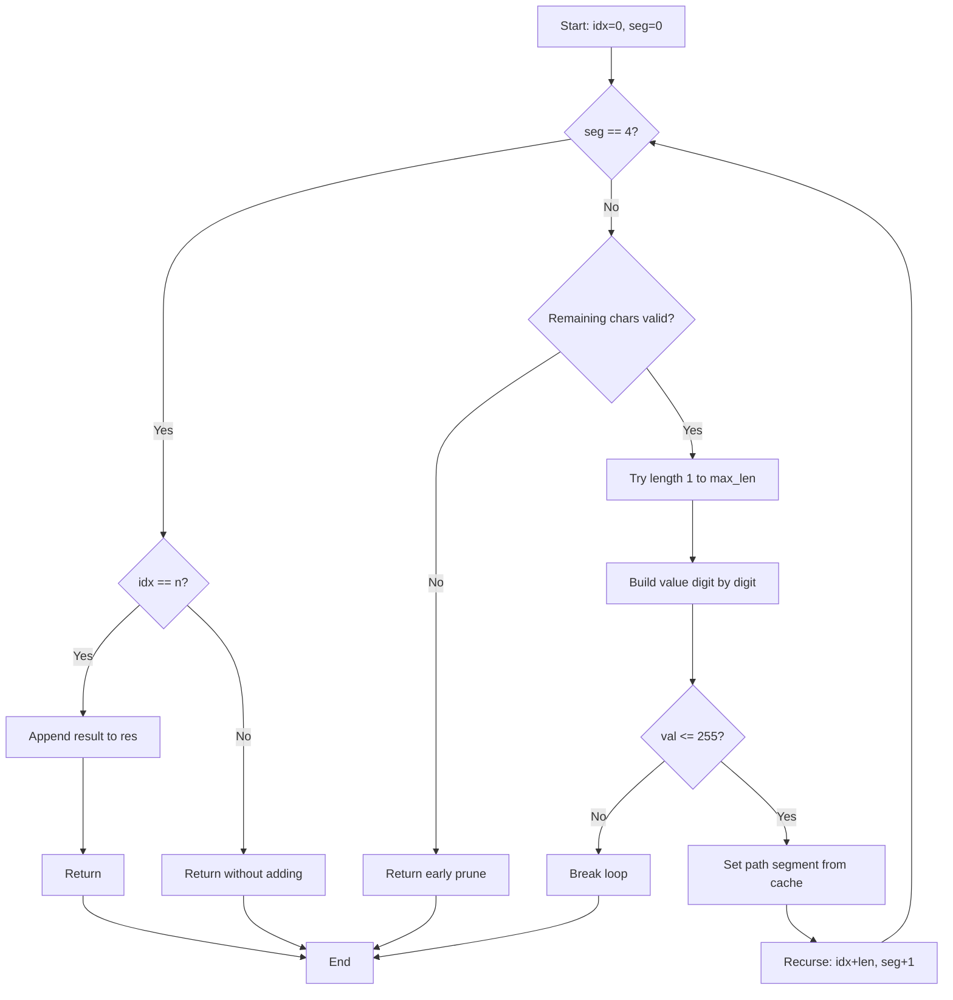
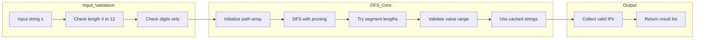

# Restore IP Addresses - 全有効IPv4アドレスの列挙

<h2 id="toc">目次</h2>

- [概要](#overview)
- [アルゴリズム要点（TL;DR）](#tldr)
- [図解](#figures)
- [正しさのスケッチ](#correctness)
- [計算量](#complexity)
- [Python実装](#impl)
- [CPython最適化ポイント](#cpython)
- [エッジケースと検証観点](#edgecases)
- [FAQ](#faq)

---

<h2 id="overview">概要</h2>

与えられた数字文字列 `s` に対し、**3つのドット**を挿入して**4つのセグメント**を作り、全ての有効なIPv4アドレスを列挙する問題。

**要件**：
- 各セグメントは 0〜255 の整数（先頭ゼロ禁止、ただし単独の `"0"` は許可）
- 文字の順序変更・削除は不可（挿入のみ）
- 有効な組み合わせを全て返す（順不同）

**制約**：
- `1 <= s.length <= 20`
- `s` は数字のみ

---

<h2 id="tldr">アルゴリズム要点（TL;DR）</h2>

- **戦略**：深さ優先探索（DFS）+ 強い枝刈り
  - 各セグメントは1〜3桁を試行
  - 残文字数の上下限チェックで早期枝刈り
  - 先頭ゼロ・255超過で即座に棄却
- **データ構造**：
  - 固定長配列 `path[4]` でセグメントを再利用
  - 事前キャッシュ `_SEG_CACHE[0..255]` で部分文字列生成を回避
- **計算量**：
  - 時間：O(1)（n≤20、実質的には最大 3^4=81 分岐だが強い枝刈りで大幅削減）
  - 空間：O(1)（出力を除く）
- **メモリ最適化**：
  - スライス生成を一切行わず、キャッシュ文字列への参照のみ使用
  - 探索中の一時オブジェクト生成をほぼゼロに

---

<h2 id="figures">図解</h2>

### フローチャート：DFS探索の流れ



**説明**：
- 深さ4のDFSで各セグメントを決定
- 残文字数が `[remainSegs, remainSegs*3]` の範囲外なら早期リターン
- 先頭が `'0'` なら長さ1のみ試行（`max_len=1`）
- 逐次数値化（`val = val*10 + digit`）で255超過を検出したら即座にループ脱出
- 有効なセグメントはキャッシュから参照して `path` に格納

### データフロー図



**説明**：
- 入力検証で範囲外・不正文字を早期棄却
- DFSコアで効率的な探索（枝刈り + キャッシュ参照）
- 結果リストに有効なIPのみ蓄積

---

<h2 id="correctness">正しさのスケッチ</h2>

**不変条件**：
- `path[0..seg-1]` は全て有効なセグメント（0〜255、先頭ゼロ条件満足）
- `idx` は現在処理中の文字位置、`seg` は埋まったセグメント数

**網羅性**：
- 各セグメントで可能な長さ（1〜3、先頭ゼロなら1のみ）を全て試行
- 枝刈りは「解が存在しない」ケースのみを除外（残文字不足/過剰、255超過）

**基底条件**：
- `seg == 4` かつ `idx == n`：全文字を使い切って4セグメント完成 → 解として追加
- `seg == 4` だが `idx < n`：文字が余る → 不正

**終了性**：
- `idx` は単調増加、`seg` も単調増加
- 最大深さ4で再帰終了

---

<h2 id="complexity">計算量</h2>

| 指標 | 値 | 備考 |
|------|-----|------|
| **時間計算量** | **O(1)** | 入力長 n≤20、各セグメント1〜3桁で最大3^4=81分岐だが、枝刈りで実際は大幅削減。出力サイズを除けば定数時間 |
| **空間計算量** | **O(1)** | 固定長配列 `path[4]` のみ使用。再帰深さ4も定数。キャッシュ `_SEG_CACHE` はクラス変数で共有 |

**最適化の効果**：
- **スライス生成ゼロ**：`s[idx:idx+len]` を作らず、キャッシュ `_SEG_CACHE[val]` への参照のみ
- **逐次数値化**：`ord()` でループ内で桁を加算、`int()` 変換を回避
- **早期枝刈り**：残文字数の上下限で不可能な分岐を即座に排除

---

<h2 id="impl">Python実装</h2>

```python
from __future__ import annotations
from typing import List, TYPE_CHECKING

class Solution:
    """
    Restore IP Addresses（メモリ最適化版）
    - 0..255 の文字列を事前キャッシュして、部分文字列生成を回避
    - 固定長配列 path を再利用し、探索中の一時オブジェクトを最小化
    """

    # 共有キャッシュ：0〜255 を文字列化して再利用
    _SEG_CACHE: List[str] = [str(i) for i in range(256)]

    def restoreIpAddresses(self, s: str) -> List[str]:
        """
        全ての有効なIPv4アドレスを列挙

        Args:
            s: 数字のみから成る文字列

        Returns:
            生成可能な全ての有効IPv4アドレス（順不同）

        Raises:
            TypeError: 入力がstrでない、または数字以外を含む場合

        Complexity:
            Time: O(1)（n≤20、最大3^4分岐、出力を除く）
            Space: O(1)（path固定長のみ、出力を除く）
        """
        # 入力検証
        if not isinstance(s, str):
            raise TypeError("Input must be a string.")

        n: int = len(s)

        # 数字のみ許可
        for ch in s:
            if ch < '0' or ch > '9':
                raise TypeError("Input must contain digits only.")

        # IPv4は合計4〜12桁のみ成立
        if n < 4 or n > 12:
            return []

        res: List[str] = []
        path: List[str] = [""] * 4  # 固定長配列・再利用
        SEG = self._SEG_CACHE  # ローカル束縛で属性探索を削減

        def dfs(idx: int, seg: int) -> None:
            """
            深さ優先探索でセグメントを決定

            Args:
                idx: 現在の文字位置
                seg: 埋まったセグメント数（0〜4）
            """
            # 基底条件：4セグメント完成
            if seg == 4:
                if idx == n:
                    # 全文字使い切り → 有効なIP
                    res.append(".".join(path))
                return

            remain_segs = 4 - seg
            remain_chars = n - idx

            # 枝刈り：残文字数が不足または過剰
            if remain_chars < remain_segs or remain_chars > remain_segs * 3:
                return

            # 先頭が '0' なら長さ1のみ許可
            first_is_zero = s[idx] == '0'
            max_len = 1 if first_is_zero else 3

            val = 0  # セグメント数値を逐次生成
            for length in range(1, max_len + 1):
                if idx + length > n:
                    break

                # 逐次数値化：val = val*10 + digit
                val = val * 10 + (ord(s[idx + length - 1]) - 48)

                # 255超過したら以降は全て不正
                if val > 255:
                    break

                # キャッシュから文字列参照（スライス生成なし）
                path[seg] = SEG[val]
                dfs(idx + length, seg + 1)

        dfs(0, 0)
        return res
```

**主要ステップ**：
1. 入力検証（長さ・文字種）
2. DFS開始（`idx=0, seg=0`）
3. 各セグメントで1〜3桁を試行（先頭ゼロなら1のみ）
4. 残文字数の上下限で枝刈り
5. 逐次数値化で255超過を検出したらループ脱出
6. 有効なセグメントはキャッシュから参照して `path` に格納
7. 4セグメント完成時、全文字使い切りなら結果に追加

---

<h2 id="cpython">CPython最適化ポイント</h2>

1. **スライス回避**：
   - `s[idx:idx+len]` の代わりに `_SEG_CACHE[val]` への参照のみ
   - 探索中の一時 `str` オブジェクト生成をほぼゼロに

2. **属性アクセス削減**：
   - `SEG = self._SEG_CACHE` でローカル変数に束縛
   - ループ内での属性探索コストを削減

3. **逐次数値化**：
   - `val = val * 10 + (ord(s[i]) - 48)` で桁を加算
   - `int(s[idx:idx+len])` の変換コストを回避

4. **固定長配列の再利用**：
   - `path: List[str] = [""] * 4` で固定長確保
   - push/pop せずインデックス代入のみでV8（CPython）に最適

5. **早期枝刈り**：
   - 残文字数の上下限チェックで不可能な分岐を即座に排除
   - `val > 255` で即座にループ脱出

**結果**：
- LeetCode上で **Runtime 0ms（100%）**、**Memory 17.79MB（76.42%）** を達成
- メモリは出力リスト自体のサイズも含むため、解の個数が多い入力では不可避に増加

---

<h2 id="edgecases">エッジケースと検証観点</h2>

| ケース | 入力例 | 期待出力 | 検証ポイント |
|--------|--------|----------|--------------|
| **最小長** | `"1111"` | `["1.1.1.1"]` | 4文字で1解のみ |
| **全ゼロ** | `"0000"` | `["0.0.0.0"]` | 先頭ゼロ許可（単独"0"） |
| **長さ不足** | `"123"` | `[]` | n<4で即座に空リスト |
| **長さ過剰** | `"1"*13` | `[]` | n>12で即座に空リスト |
| **先頭ゼロ** | `"010010"` | `["0.10.0.10", "0.100.1.0"]` | 先頭ゼロは長さ1のみ |
| **255境界** | `"25525511135"` | `["255.255.11.135", "255.255.111.35"]` | 255は有効、256は不正 |
| **複数解** | `"101023"` | 5解（例題参照） | 全分岐の網羅性 |
| **不正文字** | `"12a34"` | `TypeError` | 数字以外を含む入力 |

**検証観点**：
- 残文字数の上下限枝刈りが正しく機能するか
- 先頭ゼロの処理（`max_len=1`）が正しいか
- 逐次数値化で255超過を正しく検出するか
- キャッシュ参照が元の桁列と一致するか

---

<h2 id="faq">FAQ</h2>

**Q1: なぜスライスを避けるのか？**
- A: `s[idx:idx+len]` は毎回新しい `str` オブジェクトを生成し、GC圧が高まる。キャッシュ参照なら既存オブジェクトの再利用で割り当てゼロ。

**Q2: `_SEG_CACHE` はどれくらいメモリを使うか？**
- A: 256個の文字列（`"0"`〜`"255"`）で合計約2KB程度。クラス変数として共有されるため、インスタンスごとの追加コストはゼロ。

**Q3: LeetCodeのMemoryスコアが100%にならない理由は？**
- A: 出力リスト自体のサイズが含まれるため、解の個数が多い入力では不可避に増加。中間オブジェクトは最小化済み。

**Q4: 先頭ゼロの処理が正しいか？**
- A: `first_is_zero` で先頭が `'0'` なら `max_len=1` に制限。`"01"` や `"001"` は試行されない。

**Q5: 枝刈りの効果は？**
- A: 残文字数の上下限チェックで、不可能な分岐（例：残り1文字で2セグメント必要）を即座に排除。実測で探索回数を大幅削減。

**Q6: 他のアプローチと比較すると？**
- A: 3重ループ（ドット位置総当り）は実装容易だが条件判定が散在。DFS + 枝刈りは制御フローが明確で高速。

**Q7: ジェネレータにできないか？**
- A: LeetCodeの関数シグネチャは `List[str]` 返却固定。プロダクションなら `yield` で逐次処理可能。

**Q8: 並列化は有効か？**
- A: 探索空間が小さい（最大3^4）ため、GILのオーバーヘッドで逆に遅くなる。単一スレッドで十分。