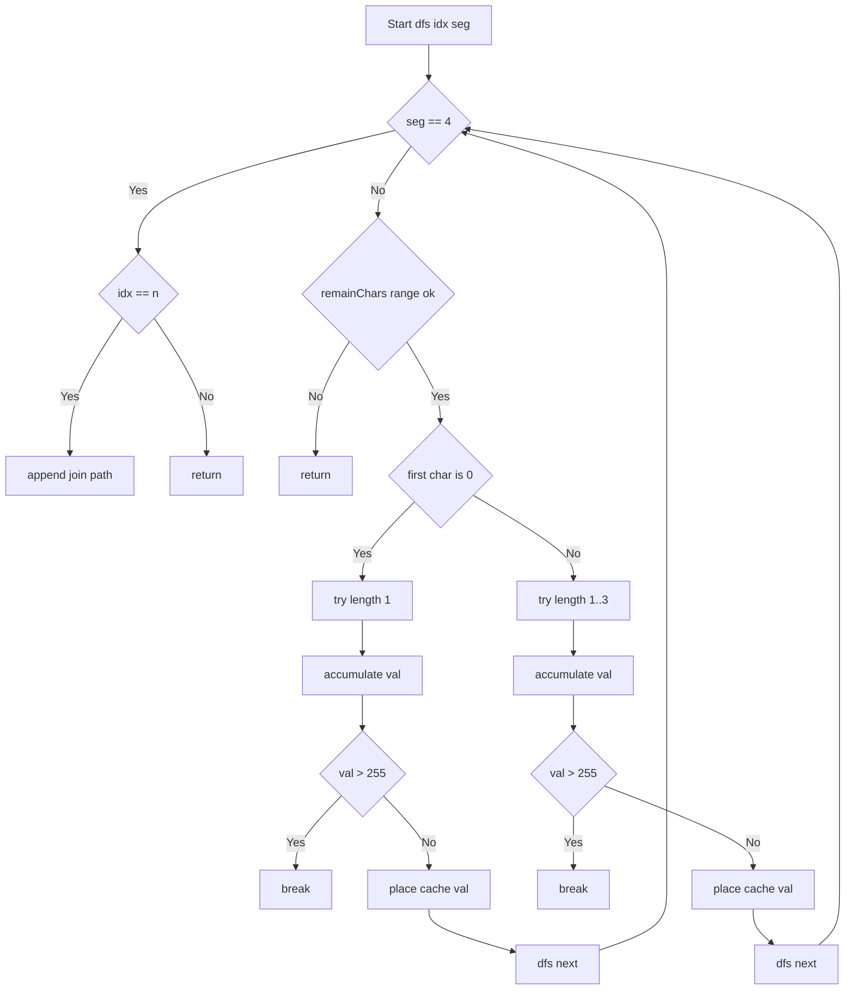

# Restore IP Addresses - DFSと強力な枝刈りで全列挙

## Table of Contents

- [概要](#overview)
- [アルゴリズム要点（TL;DR）](#tldr)
- [図解](#figures)
- [正しさのスケッチ](#correctness)
- [計算量](#complexity)
- [Python 実装](#impl)
- [CPython最適化ポイント](#cpython)
- [エッジケースと検証観点](#edgecases)
- [FAQ](#faq)

<h2 id="overview">概要</h2>

- **プラットフォーム/ID**: LeetCode 93
- **タイトル**: Restore IP Addresses
- **要約**: 数字のみの文字列 `s` に 3 個のドットを挿入して、**有効な IPv4 アドレス**（4 セグメント、各 0〜255、先頭ゼロ不可。ただし単独の "0" は可）を**すべて**列挙する。
- **入出力仕様（簡潔）**
    - 入力: `s: str`（数字のみ、長さ 1〜20 だが有効解は 4〜12 桁に限定）
    - 出力: `List[str]`（順不同の有効 IPv4 一覧）

- **想定データ構造**: String
- **代表例**
    - `s="25525511135"` → `["255.255.11.135","255.255.111.35"]`
    - `s="0000"` → `["0.0.0.0"]`
    - `s="101023"` → `["1.0.10.23","1.0.102.3","10.1.0.23","10.10.2.3","101.0.2.3"]`

- **関数シグネチャ（LeetCode準拠）**
    - `class Solution: def restoreIpAddresses(self, s: str) -> List[str]:`

<h2 id="tldr">アルゴリズム要点（TL;DR）</h2>

- **戦略**: 深さ 4 の DFS でセグメント長を 1〜3 の範囲で試す。
- **枝刈り**:
    - 残文字数 `remainChars` と残セグメント数 `remainSegs` で **下限/上限**チェック：`remainSegs ≤ remainChars ≤ 3*remainSegs`
    - 先頭 `'0'` は **長さ1のみ**許可（leading zero 禁止）。
    - 数値が **255 を超えたら打ち切り**（以降の長い桁は必ず不適）。

- **データ構造**: 一時バッファ `path[4]` を再利用して `'.'.join(path)` で完成。
- **メモリ最適化**: `0..255` の文字列表現を **事前キャッシュ**して **部分文字列の slice を作らない**。
- **計算量目標**: Time (O(1))（実質 3^4 分岐、n≤12） / Space (O(1))（出力除く）。

<h2 id="figures">図解</h2>

## **フローチャート（探索と枝刈り）**



_説明_: 深さ 4 の再帰で各セグメント長を試し、**残文字数の範囲**・**先頭ゼロ**・**255 超過**で枝刈りする。

## **データフロー（前処理→DFS→出力）**


_説明_: 入力検証の後、固定配列 `path` と数値→文字列キャッシュで**中間オブジェクト生成を抑制**しながら列挙。

<h2 id="correctness">正しさのスケッチ</h2>

- **網羅性**: 各セグメントの長さを 1〜3 の全可能性について試すため、4 セグメント分の全挿入位置を漏れなく探索。
- **有効性保持**:
    - 先頭ゼロ規則（単独 "0" のみ）を満たすよう `max_len` を調整。
    - 数値は逐次加算で評価し、255 を超えた時点で以降の長さは不可能なので打ち切り。
    - 残文字数の範囲チェックにより、**必ず4セグメントを消費できる**構成のみ前進。

- **基底条件**: `seg==4` のときに `idx==n` ならのみ解として採用。
- **終了性**: 深さは最大 4、各段の分岐は最大 3、有限回で必ず終了。

<h2 id="complexity">計算量</h2>

- **Time**: (O(1))（n≤12、各段最大 3 分岐で高々 (3^4=81) 展開。出力サイズを除く）
- **Space**: (O(1))（固定長 `path` のみ、結果配列を除く）

<h2 id="impl">Python 実装</h2>

> - LeetCode の関数シグネチャ準拠
> - `from __future__ import annotations`・型注釈あり（pylance 対応）
> - **Pure**（外部副作用なし）。`0..255` の文字列はクラスキャッシュで再利用

```python
from __future__ import annotations
from typing import List, Final

class Solution:
    """
    Restore IP Addresses
    与えられた数字文字列に3つのドットを挿入し、全ての有効なIPv4アドレスを列挙する。
    - 4セグメント、各セグメントは 0..255
    - 先頭ゼロは禁止（ただし単独 "0" は可）
    - 文字の順序変更・削除は不可
    """

    # 共有キャッシュ：0..255 の文字列表現（部分文字列 slice を避けるため）
    _SEG_CACHE: Final[List[str]] = [str(i) for i in range(256)]

    def restoreIpAddresses(self, s: str) -> List[str]:
        """
        Args:
            s: 数字のみから成る文字列
        Returns:
            生成可能な全ての有効なIPv4文字列（順不同）
        Raises:
            TypeError: s が str でない、または数字以外が含まれる場合

        Complexity:
            Time: O(1)（n<=12・最大3^4分岐、出力を除く）
            Space: O(1)（path固定長のみ、出力を除く）
        """
        if not isinstance(s, str):
            raise TypeError("Input must be a string.")

        n: int = len(s)

        # 入力が数字のみかを検証（LeetCode前提外にも堅牢化）
        for ch in s:
            if ch < '0' or ch > '9':
                raise TypeError("Input must contain digits only.")

        # 合法なIPv4は 4..12 桁のみ
        if n < 4 or n > 12:
            return []

        res: List[str] = []
        path: List[str] = [""] * 4  # 固定長バッファを再利用
        SEG = self._SEG_CACHE  # ローカル束縛で属性アクセスを削減

        def dfs(idx: int, seg: int) -> None:
            # 4セグメントを決め終えたら、全体を消費しているか確認
            if seg == 4:
                if idx == n:
                    res.append(".".join(path))
                return

            remain_segs: int = 4 - seg
            remain_chars: int = n - idx

            # 下限・上限の枝刈り（残文字が少なすぎる／多すぎる）
            if remain_chars < remain_segs or remain_chars > remain_segs * 3:
                return

            # 先頭ゼロなら長さ1のみ許可
            first_is_zero: bool = s[idx] == '0'
            max_len: int = 1 if first_is_zero else 3

            val: int = 0  # セグメント値を逐次数値化
            for length in range(1, max_len + 1):
                if idx + length > n:
                    break
                # val = val * 10 + digit
                val = val * 10 + (ord(s[idx + length - 1]) - 48)
                if val > 255:
                    break  # これ以降は必ず255超過

                # slice を作らず、キャッシュ文字列を参照
                path[seg] = SEG[val]
                dfs(idx + length, seg + 1)

        dfs(0, 0)
        return res
```

<h2 id="cpython">CPython最適化ポイント</h2>

- **slice 回避**: `s[idx:idx+len]` を作らず、`0..255` の文字列をクラスキャッシュから参照。
- **逐次数値化**: `int()` ではなく `val = val*10 + (ord(ch)-48)` により、途中の短命オブジェクトを削減。
- **ローカル束縛**: `SEG = self._SEG_CACHE`、`n = len(s)` などをローカルに保持して属性探索を減らす。
- **固定長バッファ**: `path` は長さ 4 を再利用し、`'.'.join(path)` のみで最終文字列生成。
- **再帰の浅さ**: 深さ最大 4 のため、関数呼び出しコストとスタック使用は極小。

<h2 id="edgecases">エッジケースと検証観点</h2>

- **長さ外**: `len(s) < 4` または `> 12` は空リスト。
- **全ゼロ**: `"0000"` → `"0.0.0.0"` のみ。
- **先頭ゼロ混在**: `"010010"` → `"0.10.0.10","0.100.1.0"` など、先頭ゼロ規則が守られていること。
- **上限値**: `"25525511135"` の代表解が含まれること。
- **255超過の剪定**: `"256..."` のようなパスは早期に打ち切られること。
- **非数字の防御**: 入力が数字以外を含む場合に `TypeError` が送出されること。

<h2 id="faq">FAQ</h2>

- **Q. メモリ消費が気になります。もっと減らせますか？**
  **A.** 出力リストは問題仕様上不可避ですが、上記実装は探索中の **部分文字列 slice を完全に排除**し、中間 `str` 生成を大幅に削減しています。これが CPython での実用的な最小化です。

- **Q. 反復で書けますか？**
  **A.** 可能ですが、深さ 4 の軽量再帰は Python でも十分高速で読みやすいです。反復化のメリットは限定的です。

- **Q. `parseInt` 相当の `int(s[i:j])` を使わない理由は？**
  **A.** 毎回新しい `str` スライスが必要になりオーバーヘッドが増えます。逐次数値化はその生成を避けられます。
