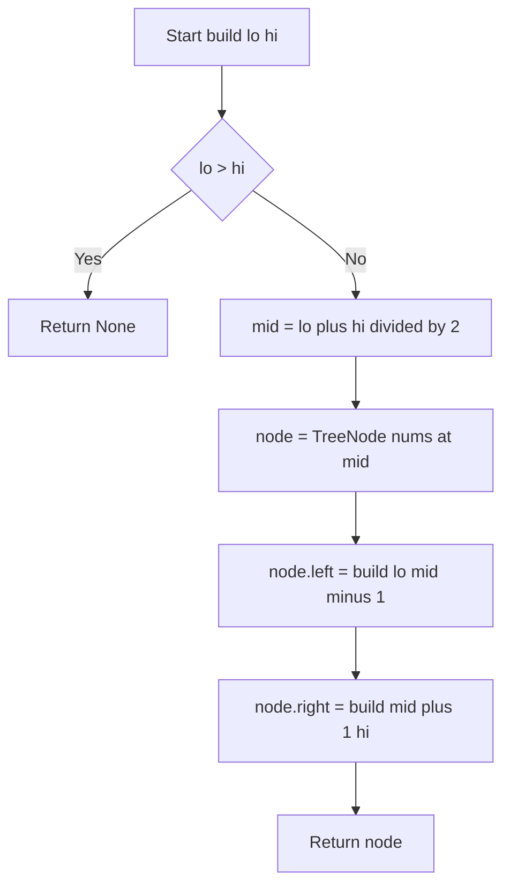
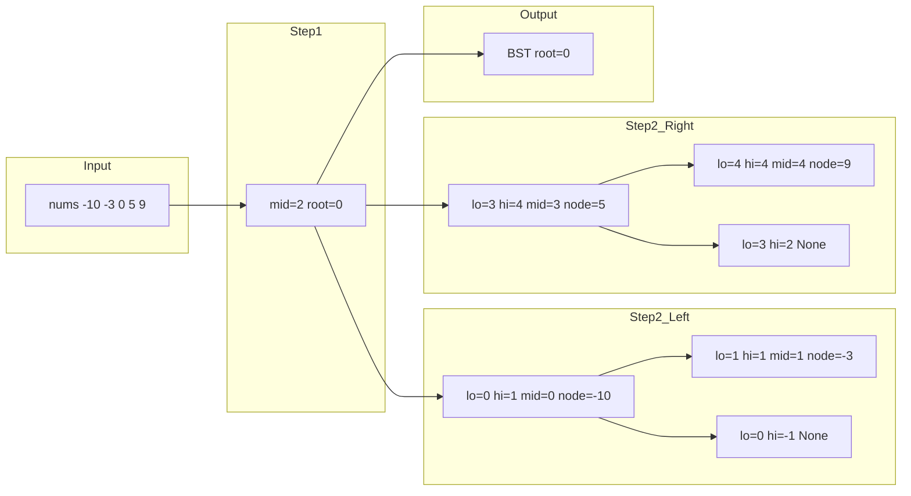

# Convert Sorted Array to Binary Search Tree - 昇順配列を高さ平衡BSTに変換する

> **LeetCode 108** · Python (CPython 3.11+) · 分割統治法 · Time O(n) / Space O(log n)

---

## 目次（Table of Contents）

- [概要](#overview)
- [アルゴリズム要点 TL;DR](#tldr)
- [図解](#figures)
- [正しさのスケッチ](#correctness)
- [計算量](#complexity)
- [Python 実装](#impl)
- [CPython 最適化ポイント](#cpython)
- [エッジケースと検証観点](#edgecases)
- [FAQ](#faq)

---

<h2 id="overview">概要</h2>

> 💡 **この問題は一言で言うと**、「昇順ソート済みリストを、左右の高さが均等な二分探索木（BST）のルートノードに変換する問題」です。

### 問題の背景とポイント

与えられたリスト `nums` はすでに昇順に並んでいます。これを **高さ平衡な BST（Height-Balanced Binary Search Tree）** に変換することが目標です。

「高さ平衡（Height-Balanced）」とは、**どのノードについても左右の部分木の高さの差が 1 以下**であることを指します。平衡が崩れた BST は最悪の場合、検索に O(n) かかりますが、平衡が保たれていれば O(log n) で検索できます。

**なぜ難しいのか？**
「ソート済みリストから BST を作る」と聞くと、端から順に挿入すれば良いと思いがちです。しかし、端から挿入すると右に伸び続ける「竹のような木」になり、高さ平衡の条件を満たしません。**配列のどこを根にするかを賢く選ぶ**ことが核心です。

**ポイント：** ソート済みリストの「真ん中の要素」を根にすれば、左半分と右半分の要素数がほぼ等しくなり、自然と高さ平衡が実現されます。これを再帰的に繰り返すのが本解法の戦略です。

### 制約

- `1 <= nums.length <= 10^4`
- `-10^4 <= nums[i] <= 10^4`
- `nums` は**厳密な昇順**にソートされている（重複なし）

> 📖 **この章で登場した用語**
>
> - **BST（二分探索木）**: 各ノードの左の子は必ず小さく、右の子は必ず大きいという規則を持つ木構造。検索・挿入が効率的になる
> - **高さ平衡**: 左右の部分木の高さの差が常に 1 以下であること。平衡が崩れると検索効率が下がる
> - **根（ルート）**: 木構造の最上位のノード。すべてのノードはここから辿れる
> - **制約**: 入力として与えられる値の範囲や条件。例：「リストの長さは 1 以上 10^4 以下」

---

<h2 id="tldr">アルゴリズム要点（TL;DR）</h2>

> 💡 **TL;DR（Too Long; Didn't Read）** とは「要約だけ読みたい人向け」の意味です。ここではアルゴリズム全体の戦略を掴んでください。詳細は後の章で説明します。

### 戦略の骨格

1. **中央要素を根にする**
   ソート済みリストの真ん中の値を根ノードにする。これにより左右の要素数がほぼ等しくなり、高さ平衡が保たれる。

2. **インデックスで範囲管理（スライスコピー回避）**
   `nums[lo:hi]` のようなスライスは新しいリストを生成してしまう（O(n) のメモリ追加コスト）。代わりに `lo`・`hi` という左右端のインデックスを引数で渡すことで、コピーなし O(1) の範囲移動を実現する。

3. **再帰で左右を構築**
   中央より左の範囲 `[lo, mid-1]` と右の範囲 `[mid+1, hi]` に対して、同じ処理を再帰的に繰り返す。分割統治法（＝問題を小さな問題に分けて解き、結果を組み合わせる手法）の典型的な使い方。

4. **ベースケースは「空区間」**
   `lo > hi` のとき有効な要素がないため `None` を返す。これが再帰の終了条件。

5. **計算量**
    - 時間計算量：O(n) — 全ノードをちょうど 1 回ずつ処理する
    - 空間計算量：O(log n) — 再帰スタックの深さ = 木の高さ（log₂n 段）

> 📖 **この章で登場した用語**
>
> - **分割統治法**: 問題を小さな部分問題に分割し、それぞれを再帰で解いて結果を組み合わせる手法
> - **スライスコピー**: `nums[lo:hi]` のようにリストの一部を取り出す操作。新しいリストを生成するためメモリコストが発生する
> - **再帰**: 関数が自分自身を呼び出すこと。大きな問題を同じ構造の小さな問題に分割して解くときに使う
> - **ベースケース（基底条件）**: 再帰を止める条件。これがないと無限ループになる

---

<h2 id="figures">図解</h2>

> 💡 **Mermaid フローチャートの読み方：** ひし形 `{}` は「条件分岐（Yes/No の判定）」を表し、長方形 `[]` は「処理ステップ」を表します。矢印の向きがデータの流れる方向です。上から下へ読み進めてください。

---

### フローチャート

この図は `build(lo, hi)` 関数がどのように動作するかの処理の流れを表しています。上から下へ読み進め、再帰がどのように木を組み立てていくかを追ってください。



**各ノードの意味：**

- `Start[Start build lo hi]`：`lo`（左端インデックス）と `hi`（右端インデックス）を受け取って関数を開始する
- `BaseCheck{lo &gt; hi}`：区間が空かどうかを判定する条件分岐（ひし形）。空なら再帰終了
- `RetNone[Return None]`：子ノードが存在しないことを `None` で表して返す
- `CalcMid[mid = lo plus hi divided by 2]`：中央インデックスを計算する（床除算で切り捨て）
- `MakeNode[node = TreeNode nums at mid]`：中央の値で新しいノードを生成する
- `RecLeft[node.left = build lo mid minus 1]`：左半分の範囲で再帰呼び出し
- `RecRight[node.right = build mid plus 1 hi]`：右半分の範囲で再帰呼び出し
- `RetNode[Return node]`：左右の子が接続されたノードを返す

---

### データフロー図

この図は `nums = [-10, -3, 0, 5, 9]` が渡されたとき、どのように木構造に変換されるかのデータの流れを表しています。左から右へ読み進めてください。



**主要な流れの説明：**

- `Input → Step1`：入力リスト全体（インデックス 0〜4）の中央 `mid=2` を選び、根ノード `0` を作る
- `Step1 → Step2_Left`：左半分 `[lo=0, hi=1]` を再帰処理。中央は `mid=0` → ノード `-10` が親、ノード `-3` がその右の子
- `Step1 → Step2_Right`：右半分 `[lo=3, hi=4]` を再帰処理。中央は `mid=3` → ノード `5` が親、ノード `9` がその右の子
- `None` の箱：`lo > hi` になった空区間で再帰終了

---

### 代表例でのトレース

`nums = [-10, -3, 0, 5, 9]` を入力として、上記フローチャートの各ノードを通過する様子をステップごとに示します。

```
初期呼び出し: build(lo=0, hi=4)
─────────────────────────────────────────────────────
Step 1:  BaseCheck → lo(0) <= hi(4) → No → 続行
Step 2:  CalcMid   → mid = (0+4)//2 = 2
Step 3:  MakeNode  → node = TreeNode(nums[2]) = TreeNode(0)  ← 根ノード確定！

  ┌── 左の再帰: build(lo=0, hi=1)
  │   Step 4:  mid = (0+1)//2 = 0
  │   Step 5:  node = TreeNode(nums[0]) = TreeNode(-10)
  │
  │   ├── 左の再帰: build(lo=0, hi=-1)
  │   │   Step 6:  BaseCheck → lo(0) > hi(-1) → Yes → return None
  │   │
  │   └── 右の再帰: build(lo=1, hi=1)
  │       Step 7:  mid = (1+1)//2 = 1
  │       Step 8:  node = TreeNode(nums[1]) = TreeNode(-3)
  │       Step 9:  build(1,0) → None, build(2,1) → None
  │       return TreeNode(-3, None, None)  ← 葉ノード
  │
  │   TreeNode(-10).right = TreeNode(-3)
  │   return TreeNode(-10, left=None, right=TreeNode(-3))

  └── 右の再帰: build(lo=3, hi=4)
      Step 10: mid = (3+4)//2 = 3
      Step 11: node = TreeNode(nums[3]) = TreeNode(5)
      Step 12: build(3,2) → None
      Step 13: build(lo=4, hi=4): mid=4 → TreeNode(9) → 葉ノード
      return TreeNode(5, left=None, right=TreeNode(9))

─────────────────────────────────────────────────────
完成した BST:
         0          ← 根
        / \
      -10    5
        \     \
        -3     9

高さ確認:
  左部分木の高さ = 2（0 → -10 → -3）
  右部分木の高さ = 2（0 → 5  → 9）
  差 = 0  ✅ 高さ平衡！
```

> 📖 **この章で登場した用語**
>
> - **フローチャート**: 処理の手順を図形と矢印で表したもの。ひし形 = 条件分岐、長方形 = 処理ステップ
> - **データフロー図**: データがどのように変換・移動するかを示す図
> - **葉ノード**: 左右両方の子が `None` のノード。木の末端
> - **床除算 `//`**: 小数点以下を切り捨てる割り算。`(0+4)//2 = 2`

---

<h2 id="correctness">正しさのスケッチ</h2>

> 💡 この章では、「なぜこのアルゴリズムが常に正しい答えを返せるのか」の根拠を整理します。数学的な証明ではなく「なぜ正しいと言えるか」の直感的な説明です。

---

### ① 不変条件（Invariant）

> **不変条件（＝アルゴリズムが正しく動くために、処理中ずっと成り立ち続けるべき条件）** を確認します。

`build(lo, hi)` を呼び出すたびに、以下の条件が常に成り立ちます：

- `nums[lo..hi]` は**昇順ソート済み**である（元のリストを変更しないため、常にこの性質が保たれる）
- 中央インデックス `mid = (lo+hi)//2` を選ぶことで、左側の要素数 `(mid-lo)` と右側の要素数 `(hi-mid)` の差は**常に 1 以下**になる

具体例：`lo=0, hi=4` → `mid=2` → 左 2 個・右 2 個（差=0）
具体例：`lo=0, hi=3` → `mid=1` → 左 1 個・右 2 個（差=1）

この「差が常に 1 以下」という性質が、**高さ平衡を再帰の全ステップで保証**しています。

---

### ② 網羅性（Completeness）

> **網羅性（＝すべてのケースをもれなく処理できているという保証）** を確認します。

`nums` の各要素は、ちょうど 1 回だけ `nums[mid]` として選ばれてノードになります。選ばれた要素は左か右の再帰には渡されません（左は `[lo, mid-1]`、右は `[mid+1, hi]`）。よってすべての要素がもれなくノードになることが保証されます。

---

### ③ 基底条件（Base Case）

> **基底条件（＝再帰の終了条件）** を確認します。

`lo > hi` のとき、有効な要素が 1 つも存在しない空区間です。この場合 `None` を返すことで「子ノードが存在しない」ことを表現します。

- 1 要素の区間（`lo == hi`）：`mid = lo`、左 `build(lo, lo-1)` → `lo > hi` で `None`、右も同様 → 葉ノード（＝子が両方 `None` のノード）が正しく作られる

---

### ④ 終了性（Termination）

> **終了性（＝アルゴリズムが必ず有限ステップで終わるという保証）** を確認します。

各再帰呼び出しで区間 `[lo, hi]` のサイズが必ず 1 以上減少します（中央の `mid` を除いた左右に分割するため）。区間サイズが 0 になると `lo > hi` の条件を満たして必ず返却されます。よってアルゴリズムは必ず終了します。

> 📖 **この章で登場した用語**
>
> - **不変条件**: アルゴリズムが正しく動くために、処理中ずっと成り立ち続けるべき条件
> - **網羅性**: すべてのケースをもれなく処理できているという保証
> - **基底条件**: 再帰の終了条件。これがないと無限ループになる
> - **終了性**: アルゴリズムが必ず有限ステップで終わるという保証

---

<h2 id="complexity">計算量</h2>

> 💡 計算量とは「入力が大きくなるにつれて、処理にかかる時間・メモリがどう増えるか」の目安です。

| 記法         | 意味                                       | 直感的なイメージ           |
| ------------ | ------------------------------------------ | -------------------------- |
| `O(1)`       | 入力サイズによらず一定                     | 辞書で直接ページを開く     |
| `O(log n)`   | 入力が 2 倍になっても 1 ステップ増えるだけ | 二分探索で毎回半分に絞る   |
| `O(n)`       | 入力に比例して増加                         | リストを端から順に読む     |
| `O(n log n)` | n よりやや速く増加                         | ソートの典型的な計算量     |
| `O(n²)`      | 入力の 2 乗で増加                          | 全ペアを総当たりで確認する |

---

### 時間計算量：O(n)

`nums` の各要素はちょうど 1 回だけ `TreeNode(nums[mid])` として処理されます。n 個の要素があれば n 回ノードが生成され、それ以外の処理（インデックス計算・代入）も O(1) です。よって全体で **O(n)** となります。

---

### 空間計算量：O(log n)

スライスコピーを使わないため、アルゴリズムが使う追加メモリは**再帰スタック（＝関数の呼び出し履歴を記録するメモリ）**のみです。

木の高さは `log₂(n)` 程度（高さ平衡なので）であり、再帰の深さも同様です。`n = 10,000` のとき最大深度は `log₂(10000) ≈ 14` 段です。

---

### スライス版との比較

| 実装方式                     | 時間計算量 | 空間計算量 | 特徴                               |
| ---------------------------- | ---------- | ---------- | ---------------------------------- |
| **インデックス版（本実装）** | O(n)       | O(log n)   | スライスコピーなし・メモリ効率最良 |
| スライス版 `nums[:mid]`      | O(n log n) | O(n log n) | 再帰ごとにコピーが発生・実装は簡単 |

スライス版が O(n log n) になる理由：再帰の各階層でサイズ n/2, n/4, ... のコピーが発生し、合計すると `n + n/2 + n/4 + ... ≈ 2n` × `log n` 階層 = O(n log n) のメモリを使います。

> 📖 **この章で登場した用語**
>
> - **時間計算量**: 入力の大きさに対して処理にかかる手間がどう増えるかの目安
> - **空間計算量**: 処理中に使うメモリ量がどう増えるかの目安
> - **再帰スタック**: 関数が自分を呼び出すたびに「戻り先」情報が積み上がるメモリ領域
> - **in-place**: 新しいメモリを確保せず元のデータを直接書き換える操作

---

<h2 id="impl">Python 実装</h2>

> 💡 コードを読む前に全体の骨格を確認しましょう。

**実装の骨格：**

1. `sortedArrayToBST`（公開メソッド）：入力を受け取り、ヘルパー `_build` を全体範囲で呼び出す
2. `_build`（内部ヘルパー）：`lo`/`hi` インデックスで現在の処理区間を管理する
3. **ベースケース**：`lo > hi` なら `None` を返して再帰終了
4. **中央計算**：`mid = (lo + hi) // 2` で床除算
5. **ノード生成**：`TreeNode(nums[mid])` で中央値のノードを作る
6. **左右再帰**：`[lo, mid-1]` と `[mid+1, hi]` でそれぞれ再帰して `node.left`/`node.right` に代入
7. **返却**：完成したノードを返す

---

### 業務開発版（型安全・pylance 対応・コメント充実）

```python
from __future__ import annotations
# ^ 型ヒントの前方参照（＝まだ定義されていない型名を文字列として扱う宣言）を有効にする。
# TreeNode を Optional[TreeNode] のように自己参照する型注釈で使うために必要。

from typing import TYPE_CHECKING, Optional

# TYPE_CHECKING ブロックは pylance/mypy などの型チェッカーが読み込む時だけ実行される。
# 実行時には無視されるため、LeetCode の実行環境に TreeNode が定義済みでも
# 定義されていなくても、どちらでも安全に動く設計になっている。
if TYPE_CHECKING:
    from __future__ import annotations


class Solution:
    """
    LeetCode 108: Convert Sorted Array to Binary Search Tree
    昇順ソート済みリストを高さ平衡な BST に変換するクラス（業務開発版）

    設計方針:
    - スライスコピーを避けるため lo/hi インデックスで範囲管理 → Space O(log n)
    - 型ヒントを全箇所に付けて pylance 対応
    - バリデーションをメインメソッドで行い、_build は純粋なアルゴリズムに集中
    """

    def sortedArrayToBST(self, nums: list[int]) -> Optional[TreeNode]:
        """
        昇順ソート済みリストを高さ平衡な BST のルートノードに変換する。

        Args:
            nums: 昇順ソートされた整数リスト（重複なし）

        Returns:
            BST のルートノード。nums が空の場合は None。

        Raises:
            TypeError:  nums がリスト型でない場合
            ValueError: nums が空リストの場合

        Complexity:
            Time:  O(n)      — 全要素を 1 回ずつ処理
            Space: O(log n)  — 再帰スタックの深さ = 木の高さ
        """
        # 型チェック: Python は動的型付けのため、呼び出し元が誤った型を渡す可能性がある。
        # isinstance() で実行時に型を確認し、分かりやすいエラーを早期に発生させる。
        if not isinstance(nums, list):
            raise TypeError(f"Expected list, got {type(nums).__name__}")

        # 空リストチェック: 問題制約では len >= 1 だが、
        # 業務コードでは想定外の入力にも対応するために確認する。
        if not nums:
            raise ValueError("nums must not be empty")

        # 全体範囲（インデックス 0 〜 末尾）でヘルパーを呼び出して再帰開始
        return self._build(nums, 0, len(nums) - 1)

    def _build(self, nums: list[int], lo: int, hi: int) -> Optional[TreeNode]:
        """
        インデックス [lo, hi] の範囲で BST を再帰構築する内部ヘルパー。

        Args:
            nums: 元の昇順ソート済みリスト（変更しない）
            lo:   処理対象区間の左端インデックス（この位置を含む）
            hi:   処理対象区間の右端インデックス（この位置を含む）

        Returns:
            構築されたサブツリーのルートノード、または None（区間が空のとき）
        """
        # ベースケース（再帰の終了条件）:
        # lo > hi になった時点で有効な要素が存在しない空区間なので None を返す。
        # None は「子ノードが存在しない」ことを表す。
        # Optional[TreeNode] という型ヒントで「None になり得る」ことを明示している。
        if lo > hi:
            return None

        # 中央インデックスを計算する。
        # `//` は床除算（＝小数点以下を切り捨てる割り算）。
        # `(lo + hi) / 2` だと float が返るが、`//` なら int が直接返るため
        # インデックスとして安全に使える。pylance も int 型として認識する。
        mid: int = (lo + hi) // 2

        # 中央の値でノードを作成する。
        # このノードが現在の区間の「根（ルート）」になる。
        # TreeNode のコンストラクタはデフォルトで left=None, right=None を持つ。
        node = TreeNode(nums[mid])

        # 左部分木を再帰的に構築する。
        # [lo, mid-1] の範囲（= 中央より左の要素すべて）で同じ処理を繰り返す。
        # mid 自体は今のノードとして使用済みなので含まない（mid-1 まで）。
        node.left = self._build(nums, lo, mid - 1)

        # 右部分木を再帰的に構築する。
        # [mid+1, hi] の範囲（= 中央より右の要素すべて）で同じ処理を繰り返す。
        node.right = self._build(nums, mid + 1, hi)

        # 左右の子が接続された完成ノードを返す。
        # 呼び出し元では、これが node.left または node.right に代入される。
        return node
```

---

### 競技プログラミング版（簡潔・最小記述）

```python
from __future__ import annotations
from typing import Optional


class Solution:
    def sortedArrayToBST(self, nums: list[int]) -> Optional[TreeNode]:
        # ネスト関数（クロージャ）として定義。
        # nums を引数で毎回渡さずに外側の変数を参照できるため記述が短くなる。
        def build(lo: int, hi: int) -> Optional[TreeNode]:
            # lo > hi のとき空区間 → None で再帰終了
            if lo > hi:
                return None
            # 中央インデックス
            mid = (lo + hi) // 2
            # ノード生成と左右の再帰をまとめて記述
            node = TreeNode(nums[mid])
            node.left, node.right = build(lo, mid - 1), build(mid + 1, hi)
            return node

        return build(0, len(nums) - 1)
```

---

### コードの動作トレース（`nums = [-10, -3, 0, 5, 9]`）

```
sortedArrayToBST([-10, -3, 0, 5, 9]) を呼び出す

呼び出し: _build(nums, 0, 4)
  → lo=0 <= hi=4 → 続行
  → mid = (0+4)//2 = 2
  → node = TreeNode(nums[2]) = TreeNode(0)   ← 根ノード確定
  → node.left  = _build(nums, 0, 1)
  → node.right = _build(nums, 3, 4)

  _build(nums, 0, 1)  [左半分 -10, -3]
    → mid = (0+1)//2 = 0
    → node = TreeNode(nums[0]) = TreeNode(-10)
    → node.left  = _build(nums, 0, -1) → lo(0)>hi(-1) → None
    → node.right = _build(nums, 1, 1)
      → mid=1, node=TreeNode(-3)
      → left  = _build(1,0) → None
      → right = _build(2,1) → None
      → return TreeNode(-3)   ← 葉ノード
    → return TreeNode(-10, left=None, right=TreeNode(-3))

  _build(nums, 3, 4)  [右半分 5, 9]
    → mid = (3+4)//2 = 3
    → node = TreeNode(nums[3]) = TreeNode(5)
    → node.left  = _build(3,2) → None
    → node.right = _build(4,4)
      → mid=4, node=TreeNode(9)
      → left = right = None
      → return TreeNode(9)   ← 葉ノード
    → return TreeNode(5, left=None, right=TreeNode(9))

最終結果:
  TreeNode(0,
    left  = TreeNode(-10, left=None, right=TreeNode(-3)),
    right = TreeNode(5,   left=None, right=TreeNode(9))
  )
```

> 📖 **この章で登場した用語**
>
> - **`Optional[X]`**: `X` または `None` のどちらかであることを表す型ヒント。pylance はこの型を見て「None チェックが必要」と判断できる
> - **`TYPE_CHECKING`**: 型チェッカーが読む時だけ `True` になる定数。実行時のインポートコストを避けるために使う
> - **ネスト関数（クロージャ）**: 関数の中に定義した関数。外側の変数（`nums`）を引数なしで参照できる
> - **`//`（床除算）**: 小数点以下を切り捨てる割り算演算子。`(0+4)//2 = 2` のように整数を返す
> - **`from __future__ import annotations`**: 型ヒントを文字列として扱うようにする宣言。前方参照の問題を解決する

---

<h2 id="cpython">CPython 最適化ポイント</h2>

> 💡 この章では「同じ処理でも Python の書き方によって速さが変わる理由」を説明します。最適化の前後のコードを比較して、なぜ速くなるかを確認してください。

---

### ポイント 1：スライスコピーを避ける

スライス（`nums[lo:hi]`）は呼び出すたびに新しいリストをヒープ上に生成します。CPython では `list` のスライスは C 言語レベルの `memcpy` が走りますが、それでも O(n) のメモリ確保コストは避けられません。

```python
# ❌ 最適化前：再帰ごとにスライスコピーが発生（Space O(n log n)）
def bad_build(nums: list[int]) -> Optional[TreeNode]:
    if not nums:
        return None
    mid = len(nums) // 2
    node = TreeNode(nums[mid])
    node.left  = bad_build(nums[:mid])      # ← 新しいリストを毎回生成！
    node.right = bad_build(nums[mid + 1:])  # ← 同上
    return node

# ✅ 最適化後：インデックスのみを渡してコピーなし（Space O(log n)）
def build(lo: int, hi: int) -> Optional[TreeNode]:
    if lo > hi:
        return None
    mid = (lo + hi) // 2
    node = TreeNode(nums[mid])
    node.left  = build(lo, mid - 1)  # ← ポインタとインデックスだけ変わる
    node.right = build(mid + 1, hi)
    return node
# 理由：スライスは「ポインタ + 長さ」の情報だけ変えれば参照できるが、
#       Python の list スライスは必ず新しい list オブジェクトを確保してしまう。
#       インデックスを渡す設計なら int 2 個の受け渡しだけで済む。
```

---

### ポイント 2：床除算 `//` を使う

中央インデックスの計算には `//`（床除算）を使います。`int(...)` や `math.floor(...)` と比べて、`//` は CPython の整数型（`int`）同士に対してC言語レベルの最適化が適用され、型変換コストがありません。

```python
# ❌ 最適化前：float 経由で型変換コストが発生
mid = int((lo + hi) / 2)   # / が float を返す → int() で変換

# ✅ 最適化後：整数演算のみ・pylance も int 型として正しく認識
mid: int = (lo + hi) // 2  # // は直接 int を返す
```

---

### ポイント 3：再帰深度は問題ない（`sys.setrecursionlimit` 不要）

CPython のデフォルト再帰上限は **1,000 回** です。本問の制約 `n ≤ 10^4` では木の高さが最大 `⌈log₂(10000)⌉ = 14` 段なので、再帰深度は最大 14 回程度です。`sys.setrecursionlimit()` の変更は不要です。

```python
import math
# n = 10^4 のとき、高さ平衡な木の最大高さを確認する
max_depth = math.ceil(math.log2(10_000))  # → 14
# 14 << 1000（デフォルト上限）なので安全
```

> 📖 **この章で登場した用語**
>
> - **ヒープ（heap）**: 動的にサイズが変わるデータを置くメモリ領域。スライスで新しいリストを作るとここに確保される
> - **`memcpy`**: C 言語の関数。メモリをブロックごとコピーする高速操作。Python のスライスも内部でこれを使う
> - **再帰上限（recursion limit）**: Python が関数の入れ子呼び出しを許容する回数の上限。デフォルト 1000
> - **床除算 `//`**: 小数点以下を切り捨てる割り算演算子。整数同士で使うと型変換なしで高速に動く

---

<h2 id="edgecases">エッジケースと検証観点</h2>

> 💡 エッジケースとは「空リスト・要素 1 つ・最大サイズ」など、通常とは異なる境界的な入力のことです。エッジケースを見落とすと、普通のテストは通るのに特定の入力でだけバグが発生することがあります。

---

| ケース                       | 入力例              | 期待される出力                             | なぜ問題になりうるか                                                         |
| ---------------------------- | ------------------- | ------------------------------------------ | ---------------------------------------------------------------------------- |
| **要素 1 つ**                | `[0]`               | `TreeNode(0)`                              | `build(0,0)` → `mid=0`、左右ともに空区間 → 葉ノードになるかの確認            |
| **要素 2 つ**                | `[1, 3]`            | `TreeNode(1, None, TreeNode(3))`           | `mid=0` が選ばれ、左は空、右が 1 要素になる。`[3, 1]` も正解として受理される |
| **すべて負の数**             | `[-9, -3, -1]`      | `TreeNode(-3, TreeNode(-9), TreeNode(-1))` | 値の正負はインデックス計算に影響しないため同じ動作になるはずの確認           |
| **すべて同じ符号の大きな数** | `[10000]` など      | —                                          | 制約内の境界値での動作確認                                                   |
| **最大サイズ n=10^4**        | 長さ 10000 のリスト | —                                          | 再帰深度 ≈ 14 → CPython の上限 1000 に余裕で収まる                           |
| **空リスト（業務版のみ）**   | `[]`                | `ValueError` が発生する                    | 問題制約外だが業務コードでは想定外入力への対応が必要                         |

---

### 各エッジケースの詳細説明

**① 要素 1 つ `[0]`**

```
build(lo=0, hi=0):
  lo(0) <= hi(0) → 続行
  mid = (0+0)//2 = 0
  node = TreeNode(0)
  left  = build(0, -1) → lo(0) > hi(-1) → None  ← ここが正しく動くかの確認
  right = build(1,  0) → lo(1) > hi(0)  → None
  return TreeNode(0, None, None)  ← 葉ノード ✅
```

**② 要素 2 つ `[1, 3]`**

```
build(lo=0, hi=1):
  mid = (0+1)//2 = 0   ← 左端が根になる
  node = TreeNode(1)
  left  = build(0, -1) → None
  right = build(1,  1) → TreeNode(3)
  return TreeNode(1, None, TreeNode(3))

※ LeetCode は [1, null, 3] と [3, 1] の両方を正解として受理する
```

> 📖 **この章で登場した用語**
>
> - **エッジケース**: 空のリスト・要素 1 つ・最大サイズ入力など、境界的な条件のこと
> - **境界値**: 制約の上限・下限にあたる値。例：長さ 1 や長さ 10^4 のリスト
> - **葉ノード（leaf node）**: 子ノードを持たないノード（左右ともに None）。木の末端を形成する

---

<h2 id="faq">FAQ</h2>

> 💡 ここでは初学者がつまずきやすいポイントを Q&A 形式で解説します。各回答は「結論 → 理由 → 補足（具体例）」の順で書いています。

---

**Q1. なぜ「真ん中」を根にすると高さ平衡になるのですか？**

**結論：** 真ん中を選ぶと左右の要素数の差が最大 1 になるからです。

**理由：** n 個の要素があるとき、`mid = n // 2` を選ぶと左に `mid` 個、右に `n - mid - 1` 個の要素が分配されます。この差は最大 1 です。これを再帰の全ステップで行うため、どの階層でも左右の高さの差が 1 を超えません。

**補足（具体例）：**

```
n=5: left=2個, right=2個  → 差=0
n=4: left=2個, right=1個  → 差=1
n=3: left=1個, right=1個  → 差=0
n=2: left=1個, right=0個  → 差=1
n=1: left=0個, right=0個  → 差=0
```

すべてのケースで差が 1 以下です。

---

**Q2. スライス `nums[:mid]` を使わないのはなぜですか？**

**結論：** スライスは毎回リストをコピーするため、不要なメモリを O(n log n) 使ってしまうからです。

**理由：** Python のリストスライスは新しいリストオブジェクトを生成します。再帰の各階層でサイズ n/2, n/4, ... のコピーが発生し、全階層の合計は O(n log n) のメモリになります。インデックスを渡す設計では int 型 2 つ（lo, hi）だけを渡せばよく、コピーが一切発生しません。

**補足：** スライス版は実装がシンプルで可読性が高いため、「コードの短さ・シンプルさを優先する競技プログラミング」では許容されることもあります。制限時間内に通れば問題ないからです。

---

**Q3. `lo > hi` のとき `None` を返す理由がよく分かりません。**

**結論：** `lo > hi` は「有効な要素がない空の区間」を意味し、子ノードが存在しないことを `None` で表すからです。

**理由：** 例えば 1 要素 `[5]` の区間 `[lo=0, hi=0]` を処理すると `mid=0` でノードを作り、その後 `build(0, -1)`（左）と `build(1, 0)`（右）が呼ばれます。`lo=0 > hi=-1` は「インデックス 0 から -1 まで」という空の区間なので、ノードを作る必要がなく `None` を返します。

**補足：** `None` は Python の「値がない」を表すオブジェクトで、木のノードに「子がいない」を伝えるために使います。`TreeNode` の定義でも `left: Optional[TreeNode] = None` がデフォルトになっています。

---

**Q4. 業務開発版と競技プログラミング版の使い分けを教えてください。**

**結論：** 長期メンテナンスするコードには業務版、即座に正解を提出することが目的のコードには競技版を使います。

**理由：**

| 観点                       | 業務開発版                         | 競技プログラミング版   |
| -------------------------- | ---------------------------------- | ---------------------- |
| 型チェック・バリデーション | あり（`isinstance`, `ValueError`） | なし（問題制約を信頼） |
| pylance 対応               | 厳密な型注釈                       | 最低限の型注釈         |
| コメント・docstring        | 充実                               | 最小限                 |
| 関数の分離                 | `_build` を別メソッドに分離        | ネスト関数でシンプルに |

**補足：** LeetCode の提出だけが目的なら競技版で十分です。しかし「このコードを半年後に自分が読む」「チームメンバーがレビューする」場面では業務版のコメント量と型注釈が重要になります。

---

**Q5. `Optional[TreeNode]` という型ヒントはなぜ必要ですか？**

**結論：** `None` を返す可能性を型として明示することで、pylance が「None チェックを忘れている」というバグを実行前に検出できるからです。

**理由：** Python は動的型付け言語なので型を書かなくても動きます。しかし `Optional[TreeNode]` と書いておくと、呼び出し側が `node.val` のように `None` チェックなしで属性アクセスしたとき pylance が警告を出してくれます。これはコンパイル言語（Java や C++）の `NullPointerException` の事前防止に相当します。

**補足（型ヒントの読み方）：**

```python
Optional[TreeNode]  →  TreeNode または None のどちらか
# Python 3.10 以降は以下のように書ける（同じ意味）
TreeNode | None
```

---

> 📖 **この章で登場した用語**
>
> - **FAQ（Frequently Asked Questions）**: よくある質問と回答のこと
> - **動的型付け**: 実行時に型が決まる言語の特性。Python はこれに該当する
> - **静的型チェック**: 実行前にコードを解析して型エラーを検出すること。pylance がこれを行う
> - **`Optional[X]`**: `X` または `None` のどちらかであることを表す型ヒント。pylance が null 安全性を検証するために使う
> - **トレードオフ**: 何かを得ると何かを失う関係。例：「コードのシンプルさを得ると型安全性が下がる」
