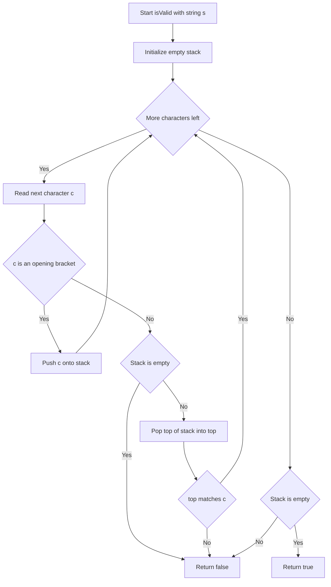
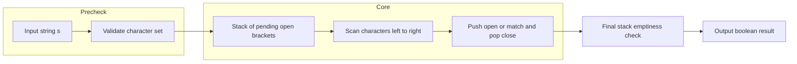

# Valid Parentheses - 括弧の対応関係をスタックで判定する（Python / TypeScript / Go / Rust）

## 目次

- [概要](#overview)
- [アルゴリズム要点（TL;DR）](#tldr)
- [図解](#figures)
- [正しさのスケッチ](#correctness)
- [計算量](#complexity)
- [Python 実装](#impl-python)
- [TypeScript 実装](#impl-typescript)
- [Go 実装](#impl-go)
- [Rust 実装](#impl-rust)
- [言語間比較](#comparison)
- [言語別最適化ポイント](#optimization)
- [エッジケースと検証観点](#edgecases)
- [FAQ](#faq)

---

<h2 id="overview">概要</h2>

> 💡 **初学者向け補足**：この問題は、一言で言うと「**開き括弧`( [ {`と閉じ括弧`) ] }`の組み合わせと順番が正しいかどうかを判定する問題**」です。

`'('`、`')'`、`'{'`、`'}'`、`'['`、`']'`だけからなる文字列 `s` が与えられたとき、以下の3条件をすべて満たすなら`true`、そうでなければ`false`を返します。

1. 開き括弧は同じ種類の閉じ括弧で閉じられなければならない
2. 開き括弧は正しい順序で閉じられなければならない
3. すべての閉じ括弧には対応する開き括弧が存在しなければならない

この問題の難しいポイントは、**「括弧の数が合っている」ことと「括弧の対応関係が正しい」ことは別物である**という点です。たとえば`"([)]"`は開き括弧`(`が1個・`[`が1個、閉じ括弧`)`が1個・`]`が1個で**数としては合致**していますが、`(`が閉じられる前に`[`が`)`によって閉じられようとしており、**順序が破綻**しています。この「数合わせ」の誤りを避けるためには、直前に開いた括弧を記憶しておく仕組みが必要になります。

この記事では、Python / TypeScript / Go / Rust の4言語で本問題を解説します。結論を先に述べると、**4言語すべて同じ「スタックを使った1回走査」というアルゴリズムを採用します**。この問題はデータ構造・計算量の面で言語ごとに有利不利が生じるタイプの問題ではないため、統一したアプローチのほうが理解しやすいと判断しました。一方で、「エラーをどう表現するか」「メモリをどう確保するか」という**実装の哲学**は言語ごとに大きく異なるため、そこが本記事の主な見どころになります。

> 📖 **この章で登場した用語**
>
> - **制約**：入力として与えられる値の範囲や条件のこと。本問題では「文字列の長さは1以上10^4以下」「使用される文字は括弧記号のみ」など
> - **正当性**：アルゴリズムが常に正しい答えを返すことの保証

---

<h2 id="tldr">アルゴリズム要点（TL;DR）</h2>

> 💡 **初学者向け補足**：TL;DR（Too Long; Didn't Read）とは「長くて読めない人向けの要約」という意味です。ここでは「なんとなくこういう手順で解くんだな」というイメージを掴んでください。詳細は後の章で説明します。

- **戦略**：文字列を先頭から1文字ずつ走査する。開き括弧が来たら「あとで閉じられるはずの候補」として記録し、閉じ括弧が来たら「直近に記録した開き括弧」と一致するか確認する。
- **データ構造**：**スタック**（後入れ先出し＝LIFO: Last In, First Out の構造）を使う。なぜスタックが最適かというと、「最後に開かれた括弧が最初に閉じられるべき」という問題の性質そのものが、スタックの「最後に入れたものを最初に取り出す」性質とぴったり一致するため。
- **計算量**：Time O(n)、Space O(n)（nは文字列長）。文字列を1回だけ走査すれば十分であり、これより速くすることは理論上不可能。
- **4言語での差異**：**アプローチ自体は4言語とも同じスタック法**。差異が出るのは「スタックの型（Python: `list[str]`、TypeScript: `string[]`、Go: `[]byte`、Rust: `Vec<char>`）」「対応表の引き方（辞書 vs `switch` vs `match`）」「エラーの表現方法（例外 vs 判別可能ユニオン型 vs `error`戻り値 vs `Result<T,E>`）」の3点です。

> 📖 **この章で登場した用語**
>
> - **TL;DR**：「長くて読めない人向けの要約」を意味する略語
> - **スタック**：後入れ先出し（LIFO）の構造を持つデータ構造。最後に追加した要素を最初に取り出す
> - **LIFO（Last In, First Out）**：「最後に入れたものを最初に出す」というスタックの動作原則

---

<h2 id="figures">図解</h2>

> 💡 **初学者向け補足**：図はアルゴリズムの「処理の流れ」を視覚的に示したものです。ひし形（`{}`）は条件分岐、長方形（`[]`）は処理ステップを表します。上から下へ読み進めてください。

### フローチャート

この図は、文字列を1文字ずつ読みながらスタックを操作していく処理の流れを表しています。



主要なノードの意味：

- `Loop`：まだ読んでいない文字が残っているかを判定するひし形（ループの継続条件）
- `IsOpen`：読んだ文字が開き括弧かどうかを判定するひし形
- `Push`：開き括弧をスタックに積む処理
- `StackEmpty`（走査中）：閉じ括弧が来たときにスタックが空でないかを確認する安全チェック
- `Match`：スタックから取り出した開き括弧が、今読んだ閉じ括弧と対応しているかを判定するひし形
- `CheckEmpty`（走査後）：全文字を読み終えた時点でスタックに未閉じの開き括弧が残っていないかを確認する最終チェック

### データフロー図

この図は、入力文字列がどのように変換されて最終的な真偽値になるかを表しています。



主要な流れの説明：

- `Input string s`から`Validate character set`へ：入力が想定した括弧文字だけで構成されているかを確認する（制約上保証されるが、防御的にチェックする言語もある）
- `Stack of pending open brackets`から`Scan characters left to right`へ：「まだ閉じられていない開き括弧」だけを保持するスタックを用意し、先頭から順に読み進める
- `Final stack emptiness check`から`Output boolean result`へ：走査が終わった時点でスタックが空なら`true`、何か残っていれば`false`として出力する

> 💡 **代表例でのトレース**：`s = "([)]"`（要件2に違反する不正な例）を入力として、上記フローチャートをどう通過するかを示します。
>
> ```
> Step 1: Start → 入力 s = "([)]"
> Step 2: Init → stack = []
> Step 3: Loop 判定 → 残り文字あり → Yes
> Step 4: ReadChar → c = '(' → IsOpen → Yes → Push → stack = ['(']
> Step 5: Loop → 残りあり → ReadChar → c = '[' → IsOpen → Yes → Push → stack = ['(', '[']
> Step 6: Loop → 残りあり → ReadChar → c = ')' → IsOpen → No
>          → StackEmpty → No → Pop → top='[' , stack=['(']
> Step 7: Match 判定 → top='[' は ')' に対応しない → No → ReturnFalse
> 結果: false
> ```

> 📖 **この章で登場した用語**
>
> - **フローチャート**：処理の手順を図形と矢印で表したもの。ひし形＝条件分岐、長方形＝処理
> - **データフロー図**：データがどのように変換・移動するかを示す図
> - **サブグラフ**：フローチャートの中で関連する処理をグループ化したもの

---

<h2 id="correctness">正しさのスケッチ</h2>

> 💡 **初学者向け補足**：「正しさのスケッチ」とは、アルゴリズムが常に正しい答えを返すことの根拠を整理したものです。数学的な証明ではなく「なぜ正しいと言えるか」の説明だと考えてください。

- **不変条件**（＝処理中ずっと成り立ち続けるべき条件）：スタックの中身は常に「まだ閉じられていない開き括弧」だけで構成されている。開き括弧が来たら積み、閉じ括弧が正しく一致したら取り除くという操作を守っている限り、この条件は崩れない。
- **網羅性**（＝すべてのケースをもれなく処理できているという保証）：走査中の各文字は「開き括弧」「閉じ括弧」のいずれかであり（制約上）、それぞれに対応する分岐が用意されているため、処理漏れは発生しない。
- **基底条件**：文字列の走査が最後まで終わったとき。このときスタックが空であれば「すべての開き括弧が正しく閉じられた」ことを意味し、`true`を返す根拠になる。逆に何か残っていれば「閉じられていない開き括弧がある」ことになり`false`。
- **終了性**：文字列は有限長（最大10^4文字、制約より）であり、ループは1文字進むごとに必ず1つ前進するため、無限ループにはならず必ず有限ステップで終わる。

「閉じ括弧が来たのにスタックが空」というケースも見逃せません。この場合、対応する開き括弧が存在しないことが確定するため、その時点で即座に`false`を返してよいことが分かります（スタックからの取り出し操作を安全に行うための重要な分岐です）。

> 📖 **この章で登場した用語**
>
> - **不変条件**：アルゴリズムが正しく動くために、処理中ずっと成り立ち続けるべき条件
> - **基底条件**：処理の終了条件。これがないと無限ループになる
> - **終了性**：アルゴリズムが必ず有限ステップで終わるという保証
> - **網羅性**：すべてのケースをもれなく処理できているという保証

---

<h2 id="complexity">計算量</h2>

> 💡 **初学者向け補足**：計算量とは「入力が大きくなるにつれて、処理にかかる時間・メモリがどう増えるか」の目安です。

| 記法    | 意味                   | 直感的なイメージ           |
| ------- | ---------------------- | -------------------------- |
| `O(1)`  | 入力サイズによらず一定 | 辞書で直接ページを開く     |
| `O(n)`  | 入力に比例して増加     | リストを端から順に読む     |
| `O(n²)` | 入力の2乗で増加        | 全ペアを総当たりで確認する |

### 4言語比較テーブル

| 言語       | 採用アルゴリズム | Time | Space | 実装上の特徴                                      |
| ---------- | ---------------- | ---- | ----- | ------------------------------------------------- |
| Python     | スタック法       | O(n) | O(n)  | `list`をスタックに使用。`dict`でO(1)対応表引き    |
| TypeScript | スタック法       | O(n) | O(n)  | `string[]`をスタックに使用。型ガードで絞り込み    |
| Go         | スタック法       | O(n) | O(n)  | `[]byte`をプリアロケーション。`switch`で分岐      |
| Rust       | スタック法       | O(n) | O(n)  | `Vec<char>`を事前確保。`Result<T, E>`でエラー表現 |

すべての言語で最悪ケース（全文字が開き括弧、例：`"((((("`）ではスタックに全文字が積まれるため、空間計算量はO(n)になります。これより空間効率の良い方法（括弧の出現数だけを数えるO(1)のアプローチ）も存在しますが、[正しさのスケッチ](#correctness)で述べた「順序の検証」ができないため不採用としています。

**in-place / Pure の観点**：4言語とも、入力文字列自体を書き換えることはなく、新しく用意したスタックだけを使って判定します。つまりすべて**Pure**（入力を変更せず新しいデータだけを使って結果を返す）な実装です。文字列自体が非常に小さい（1文字〜10^4文字）ため、in-place化するメリットもなく、可読性を優先しています。

> 📖 **この章で登場した用語**
>
> - **時間計算量**：入力の大きさに対して処理にかかる手間がどう増えるかの目安
> - **空間計算量**：処理中に使うメモリ量がどう増えるかの目安
> - **in-place**：新しいメモリを確保せず元のデータを直接書き換える操作
> - **Pure**：入力を変更せず新しいデータを返す操作。安全だがメモリを余分に使う

---

<h2 id="impl-python">Python 実装</h2>

> 💡 **初学者向け補足**：コードを読む前に、実装の全体的な骨格を示します。
>
> 1. 括弧の不正な組み合わせを表現する**カスタム例外クラス**（`BracketMismatchError`）を定義する
> 2. 閉じ括弧から対応する開き括弧を引く**対応表**（`dict`）をクラス定数として定義する
> 3. 業務開発版では`_validate_brackets`が例外を投げる形で検証し、`isValid`はそれを`try-except`で捕まえて`bool`に変換する
> 4. 競技プログラミング版では例外を使わず、辞書引きと`list`操作だけで最短コードにする

```python
from __future__ import annotations

from typing import Final


class BracketMismatchError(Exception):
    """
    括弧の対応関係・順序が不正な場合に送出する例外。
    bool の True/False だけでは「なぜ」不正だったのかを表現できないため、
    Exception を継承したクラスを用意し、将来のログ出力等に転用しやすくする。
    """

    def __init__(self, message: str, char: str, position: int) -> None:
        super().__init__(message)
        # 追加情報として問題の文字と位置を保持しておく
        self.char = char
        self.position = position


class Solution:
    """括弧の妥当性判定クラス（LeetCode 20: Valid Parentheses）"""

    # クラス定数として対応表を定義する。全インスタンスで共通のデータなので
    # __init__ の中ではなくクラスレベルで1度だけ生成する。
    # Final を付けることで「再代入されない」ことを pylance に伝える。
    _PAIRS: Final[dict[str, str]] = {
        ')': '(',
        ']': '[',
        '}': '{',
    }

    def isValid(self, s: str) -> bool:
        """
        業務開発向け実装。_validate_brackets の結果を bool に変換する薄いラッパー。

        Complexity:
            Time: O(n)
            Space: O(n)
        """
        # Python は動的型付け言語のため、pylance の静的チェックをすり抜けて
        # 誤った型が実行時に渡される可能性がある。二重の防御として有効。
        if not isinstance(s, str):
            raise TypeError("Input must be a string")

        try:
            self._validate_brackets(s)
        except BracketMismatchError:
            return False
        return True

    def _validate_brackets(self, s: str) -> None:
        """スタックを使って対応関係・順序を検証する内部メソッド。"""
        # list をスタック（後入れ先出し構造）として使う。
        # append/pop はどちらも末尾操作で（償却）O(1)。
        stack: list[str] = []

        # enumerate() でインデックスと文字を同時に取得する（Pythonic な書き方）。
        for position, char in enumerate(s):
            if char in '([{':
                # 開き括弧ならスタックに積む。
                stack.append(char)
                continue

            if char in self._PAIRS:
                # 閉じ括弧の場合、まずスタックが空でないか確認する。
                if not stack:
                    raise BracketMismatchError(
                        "対応する開き括弧がないまま閉じ括弧が出現しました", char, position
                    )
                # スタックの末尾（直前に積んだ開き括弧）を取り出す。
                top = stack.pop()
                expected_open = self._PAIRS[char]
                if top != expected_open:
                    raise BracketMismatchError(
                        f"'{char}' に対応する開き括弧は '{expected_open}' ですが "
                        f"'{top}' が見つかりました",
                        char,
                        position,
                    )
                continue

            # 制約上発生しないが、防御的に例外を送出する。
            raise BracketMismatchError("括弧以外の文字が含まれています", char, position)

        # 走査後にスタックに残りがあれば、閉じられていない開き括弧がある。
        if stack:
            unclosed = stack[-1]
            raise BracketMismatchError(
                f"開き括弧 '{unclosed}' が閉じられないまま入力が終了しました",
                unclosed,
                len(s),
            )
```

競技プログラミング版は、例外を使わず「番兵値」で空スタックの`pop()`を回避する短いコードです。

```python
from __future__ import annotations


class Solution:
    def isValid(self, s: str) -> bool:
        """
        競技プログラミング向け最適化実装。
        例外処理を使わず、辞書引きと list 操作だけで完結させる。

        Time Complexity: O(n)
        Space Complexity: O(n)
        """
        pairs = {')': '(', ']': '[', '}': '{'}
        stack: list[str] = []

        for char in s:
            if char in pairs:
                # スタックが空なら '#'（番兵、絶対に括弧と一致しないダミー値）を使う。
                # これにより空リストへの pop() で発生する IndexError を未然に回避する。
                if pairs[char] != (stack.pop() if stack else '#'):
                    return False
            else:
                stack.append(char)

        # 全て閉じられていればスタックは空になっているはず。
        return not stack
```

> 💡 **コードの動作トレース**（初学者向け）
>
> ```
> 入力: s = "([)]"
> position=0, char='(' → '(' in '([{' → append → stack=['(']
> position=1, char='[' → '[' in '([{' → append → stack=['(', '[']
> position=2, char=')' → ')' in _PAIRS → True
>              stack.pop() → top='[' , stack=['(']
>              _PAIRS[')'] = '(' だが top='[' → 不一致
>              → BracketMismatchError を送出
> isValid の戻り値: except節で捕捉 → False
> ```

> 📖 **この章で登場した用語**
>
> - **`from __future__ import annotations`**：型ヒントを文字列として扱うようにする宣言。循環参照や前方参照を解決できる
> - **`Final`**：`typing`モジュールの型。「この変数は再代入されない」ことをpylanceなどの型チェッカーに伝える
> - **EAFP（Easier to Ask Forgiveness than Permission）**：「まず実行してダメだったら例外で謝る」というPythonの伝統的な設計哲学
> - **番兵（センチネル）値**：ループや条件分岐の特殊ケースを示すためのダミー値

---

<h2 id="impl-typescript">TypeScript 実装</h2>

> 💡 **初学者向け補足**：Pythonの章で学んだ「スタックで対応関係を検証する」考え方をベースに、今度はTypeScriptの型システムでどう安全に書くかを見ていきます。骨格は以下の通りです。
>
> 1. `BracketError`クラスを定義する（`Error`を継承）
> 2. 開き括弧 → 閉じ括弧の対応表を`Readonly<Record<string, string>>`型で定義する
> 3. `isOpeningBracket` / `isClosingBracket`という**型ガード関数**（＝実行時に値の型を確認し、その情報をもとにTypeScriptの型を絞り込む仕組み）を用意する
> 4. `validateBrackets`が「成功か失敗か」を表す**判別可能ユニオン型**（`ValidationResult`）を返し、`isValid`はそれを`boolean`に変換する

```typescript
// ============================================================
// カスタムエラークラス
// ============================================================
// なぜこのクラスが必要か：
// boolean の true/false だけでは「どこで」「なぜ」不正だったのかを表現できない。
class BracketError extends Error {
    constructor(
        message: string,
        public readonly char: string,
        public readonly position: number,
    ) {
        super(message);
        this.name = 'BracketError';
    }
}

// ============================================================
// 対応表の定義
// ============================================================
// Readonly を付けることで「一度定義したら変更されるべきではない」ことを
// コンパイル時に保証する（うっかり書き換えてしまう事故を防ぐ）。
const CLOSING_BRACKETS: Readonly<Record<string, string>> = {
    '(': ')',
    '[': ']',
    '{': '}',
};

// 型ガード関数：戻り値の型を `param is '(' | '[' | '{'` にすることで、
// この関数が true を返した後、TypeScript が引数の型を自動的に絞り込んでくれる。
function isOpeningBracket(char: string): char is '(' | '[' | '{' {
    return char in CLOSING_BRACKETS;
}

function isClosingBracket(char: string): char is ')' | ']' | '}' {
    return Object.values(CLOSING_BRACKETS).includes(char);
}

// ============================================================
// 検証結果を表す判別可能ユニオン型
// ============================================================
// try-catch で例外を投げる代わりに「成功か失敗か」を型で表現することで、
// 呼び出し元が結果を必ず確認せざるを得ない設計にする。
type ValidationResult =
    | { readonly ok: true }
    | { readonly ok: false; readonly error: BracketError };

/**
 * 括弧文字列が正しく対応しているかを検証する。
 * @param s - 検証したい文字列
 * @returns 検証結果を表すオブジェクト
 * @complexity Time: O(n), Space: O(n)
 */
function validateBrackets(s: string): ValidationResult {
    // string[] を「後入れ先出し」のスタックとして使う。
    const stack: string[] = [];

    // for...of + entries() で文字とインデックスを安全に取得する
    // （サロゲートペア文字も1文字として正しく扱える）。
    for (const [position, char] of [...s].entries()) {
        if (isOpeningBracket(char)) {
            stack.push(char);
            continue;
        }

        if (isClosingBracket(char)) {
            // stack.pop() は string | undefined を返す。
            // strict モードでは undefined チェックを省略するとコンパイルエラーになる。
            const top = stack.pop();

            if (top === undefined) {
                return {
                    ok: false,
                    error: new BracketError(
                        '対応する開き括弧がないまま閉じ括弧が出現しました',
                        char,
                        position,
                    ),
                };
            }

            const expected = CLOSING_BRACKETS[top];
            if (expected !== char) {
                return {
                    ok: false,
                    error: new BracketError(
                        `'${top}' に対応する閉じ括弧は '${expected}' ですが '${char}' が見つかりました`,
                        char,
                        position,
                    ),
                };
            }
            continue;
        }

        // 制約上発生しないが、防御的に明示的なエラーを返す。
        return {
            ok: false,
            error: new BracketError('括弧以外の文字が含まれています', char, position),
        };
    }

    if (stack.length > 0) {
        const unclosed = stack[stack.length - 1] ?? '';
        return {
            ok: false,
            error: new BracketError(
                `開き括弧 '${unclosed}' が閉じられないまま入力が終了しました`,
                unclosed,
                s.length,
            ),
        };
    }

    return { ok: true };
}

/**
 * 括弧文字列が有効かどうかを判定する（LeetCode提出用エントリポイント）。
 * @param s - 判定対象の文字列
 * @returns 有効なら true、そうでなければ false
 * @complexity Time: O(n), Space: O(n)
 */
function isValid(s: string): boolean {
    return validateBrackets(s).ok;
}
```

> 💡 **コードの動作トレース**（初学者向け）
>
> ```
> 入力: s = "([)]"
> position=0, char='(' → isOpeningBracket=true → push → stack=['(']
> position=1, char='[' → isOpeningBracket=true → push → stack=['(', '[']
> position=2, char=')' → isClosingBracket=true
>              stack.pop() → top='[' , stack=['(']
>              CLOSING_BRACKETS['['] = ']' だが char=')' → 不一致
>              → { ok: false, error: BracketError(...) }
> isValid の戻り値: false
> ```

> 📖 **この章で登場した用語**
>
> - **`readonly`**：配列やプロパティの値を変更できないようにする修飾子。JavaScriptには無い、TypeScript独自のコンパイル時チェック機能
> - **型ガード**：`typeof`や独自関数（`is`構文）で実行時に値の型を確認し、その情報をもとに型を絞り込む仕組み
> - **判別可能ユニオン型**：`{ ok: true } | { ok: false, error: ... }`のように、共通のプロパティ（ここでは`ok`）の値によって型を区別できるユニオン型
> - **Pure function（純粋関数）**：同じ入力を与えると必ず同じ出力を返し、外部の状態を変えない関数

---

<h2 id="impl-go">Go 実装</h2>

> 💡 **初学者向け補足**：Goにはクラスが無く、`struct`とメソッドでオブジェクト指向的な設計を実現します。また例外機構（`try-catch`）も無く、エラーは戻り値として返すのがGoの慣習です。骨格は以下の通りです。
>
> 1. `BracketError`構造体を定義し、`Error() string`メソッドで`error`インターフェースを満たす
> 2. `closingFor`ヘルパー関数で開き括弧から閉じ括弧を`switch`文で引く
> 3. `validateBrackets`が`[]byte`スタックを使い、`error`を返す形で検証する
> 4. `isValid`はその結果を`== nil`で`bool`に変換する薄いラッパーにする

```go
package main

import "fmt"

// BracketError は括弧の対応関係が不正だったことを表すエラー型。
// bool の true/false だけでは「なぜ」「どこで」不正だったかを表現できないため、
// error インターフェースを満たす独自の型を用意する。
type BracketError struct {
	Reason string // 不正になった理由の説明文
	Char   byte   // 問題の原因となった文字
}

// Error は error インターフェースを満たすためのメソッド。
// Go のインターフェースは「このメソッドを持っていれば自動的に実装済み」と
// みなされる暗黙的な実装であり、Java の implements 宣言は不要。
func (e *BracketError) Error() string {
	return fmt.Sprintf("%s: %q", e.Reason, e.Char)
}

// closingFor は開き括弧に対応する閉じ括弧を返すヘルパー関数。
// map[byte]byte ではなく switch を使う理由：
// この問題では対応関係が3種類しかなく、switch の方がマップ生成の
// コストがかからず高速かつシンプルになるため。
func closingFor(open byte) (closing byte, ok bool) {
	switch open {
	case '(':
		return ')', true
	case '[':
		return ']', true
	case '{':
		return '}', true
	default:
		return 0, false
	}
}

// validateBrackets は文字列が正しく対応した括弧かどうかを検証する。
//
// Time Complexity: O(n)
// Space Complexity: O(n)
func validateBrackets(s string) error {
	// []byte をスタックとして使う。make の第3引数で len(s) を指定し、
	// 最悪ケースでも append による再アロケーションが発生しないようにする。
	stack := make([]byte, 0, len(s))

	// 括弧記号はすべてASCII文字（1バイト）なので、for range によるrune変換を
	// 避け、バイト単位のインデックスアクセスで直接走査する方が高速。
	for i := 0; i < len(s); i++ {
		c := s[i]

		switch c {
		case '(', '[', '{':
			stack = append(stack, c)

		case ')', ']', '}':
			if len(stack) == 0 {
				return &BracketError{Reason: "対応する開き括弧がない", Char: c}
			}
			// スタックの末尾を取り出す（pop操作）。
			top := stack[len(stack)-1]
			stack = stack[:len(stack)-1]

			expected, _ := closingFor(top)
			if expected != c {
				return &BracketError{
					Reason: fmt.Sprintf("'%c' に対応する閉じ括弧は '%c' ではない", top, expected),
					Char:   c,
				}
			}

		default:
			// 制約上発生しないが、パニックさせず防御的にエラーを返す。
			return &BracketError{Reason: "括弧以外の文字が含まれている", Char: c}
		}
	}

	if len(stack) != 0 {
		return &BracketError{Reason: "閉じられていない開き括弧が残っている", Char: stack[len(stack)-1]}
	}

	return nil
}

// isValid は LeetCode 提出用のエントリポイント（業務開発版）。
func isValid(s string) bool {
	return validateBrackets(s) == nil
}
```

競技プログラミング版は、エラーの詳細を持たず「対応する閉じ括弧そのもの」をスタックに積むテクニックで比較コストを減らします。

```go
// isValid は LeetCode 提出用のエントリポイント（競技プログラミング版）。
//
// Time Complexity: O(n)
// Space Complexity: O(n)
func isValid(s string) bool {
	stack := make([]byte, 0, len(s))

	for i := 0; i < len(s); i++ {
		switch s[i] {
		case '(':
			// 開き括弧が来た時点で「対応する閉じ括弧そのもの」を積んでおく。
			// これにより閉じ括弧が来たときに変換関数を介さず直接比較できる。
			stack = append(stack, ')')
		case '[':
			stack = append(stack, ']')
		case '{':
			stack = append(stack, '}')
		default:
			// ここに来るのは閉じ括弧のはず。
			if len(stack) == 0 || stack[len(stack)-1] != s[i] {
				return false
			}
			stack = stack[:len(stack)-1]
		}
	}

	return len(stack) == 0
}
```

> 💡 **コードの動作トレース**（初学者向け）
>
> ```
> 入力: s = "([)]"
> i=0, c='(' → push ')' → stack = [')']
> i=1, c='[' → push ']' → stack = [')', ']']
> i=2, c=')' → default節。stack末尾=']' と s[2]=')' を比較 → 不一致 → return false
> ```

> 📖 **この章で登場した用語**
>
> - **`error`戻り値**：JavaやPythonの例外機構と異なり、Goはエラーを戻り値として返す。呼び出し元が`if err != nil`で必ず確認する設計になっている
> - **プリアロケーション**：`make([]byte, 0, len(s))`のように必要なメモリをあらかじめまとめて確保しておくこと。`append`による途中の再確保を防ぐ
> - **パニック**：Goで回復不能なエラーが発生した際に起きる強制終了。範囲外アクセスなどで発生する
> - **レシーバ**：メソッドが属する型のインスタンス。Javaの`this`に相当するが名前を自由に決められる

---

<h2 id="impl-rust">Rust 実装</h2>

> 💡 **初学者向け補足**：Rustには所有権（＝値を"誰が管理するか"をコンパイル時に決める仕組み）という、他の3言語には無い独自の概念があります。ガベージコレクタ無しでメモリの安全性を保証する代わりに、値の受け渡し方に気をつける必要があります。骨格は以下の通りです。
>
> 1. `BracketError`という列挙型（`enum`）を定義する（失敗の種類を型で表現するため）
> 2. `validate_brackets`が`&str`（文字列への借用）を受け取り、`Vec<char>`スタックで検証し、`Result<(), BracketError>`を返す
> 3. `Solution::is_valid`はその結果を`.is_ok()`で`bool`に変換する薄いラッパーにする

```rust
// ============================================================
// カスタムエラー型
// ============================================================
// bool の true/false だけでは「どこで」「なぜ」不正だったのかを表現できない。
// Rust では例外を使わず、戻り値の型としてエラーを表現するのが特徴。
#[derive(Debug, Clone, PartialEq)]
enum BracketError {
    // 閉じ括弧が来たが、対応する開き括弧の種類が違った場合
    Mismatched { expected: char, found: char },
    // 閉じ括弧が来たのに対応する開き括弧が1つも積まれていない場合
    UnexpectedClose(char),
    // 文字列を読み終えたのに閉じられていない開き括弧が残っている場合
    UnclosedOpen(char),
}

impl std::fmt::Display for BracketError {
    fn fmt(&self, f: &mut std::fmt::Formatter<'_>) -> std::fmt::Result {
        match self {
            Self::Mismatched { expected, found } => {
                write!(f, "'{found}' に対応する閉じ括弧は '{expected}' ではありません")
            }
            Self::UnexpectedClose(c) => {
                write!(f, "対応する開き括弧がないまま閉じ括弧 '{c}' が出現しました")
            }
            Self::UnclosedOpen(c) => {
                write!(f, "開き括弧 '{c}' が閉じられないまま入力が終了しました")
            }
        }
    }
}

impl std::error::Error for BracketError {}

/// 開き括弧に対応する閉じ括弧を返すヘルパー関数。
/// Option<char> を返すことで、「括弧ではない文字」が来た場合に
/// 呼び出し元がパニックせず安全に分岐できるようにする。
fn closing_for(open: char) -> Option<char> {
    match open {
        '(' => Some(')'),
        '[' => Some(']'),
        '{' => Some('}'),
        _ => None,
    }
}

/// 括弧文字列が正しく対応しているかを検証する。
///
/// # Arguments
/// * `s` - 検証したい文字列への借用（&str）。
///         所有権を奪わないので、呼び出し元は検証後も s を使い続けられる。
///
/// # Complexity
/// - Time: O(n)
/// - Space: O(n)
fn validate_brackets(s: &str) -> Result<(), BracketError> {
    // Vec<char> を「後入れ先出し」のスタックとして使う。
    // with_capacity で最悪ケースを見越し、途中の再アロケーションを防ぐ。
    let mut stack: Vec<char> = Vec::with_capacity(s.len());

    // s.chars() は &str を借用するだけのイテレータで所有権を奪わない。
    for c in s.chars() {
        match c {
            '(' | '[' | '{' => stack.push(c),

            ')' | ']' | '}' => {
                // stack.pop() は Option<char> を返す。
                // ? 演算子で None のとき即座に Err を返す。
                let top = stack.pop().ok_or(BracketError::UnexpectedClose(c))?;

                // stack に積まれるのは開き括弧のみなので None は起こり得ない。
                let expected = closing_for(top)
                    .expect("スタックには開き括弧のみが積まれるため必ず対応する閉じ括弧が存在する");

                if expected != c {
                    return Err(BracketError::Mismatched { expected, found: c });
                }
            }

            _ => unreachable!("制約により括弧文字以外は入力されない"),
        }
    }

    if let Some(&unclosed) = stack.last() {
        return Err(BracketError::UnclosedOpen(unclosed));
    }

    Ok(())
}

struct Solution;

impl Solution {
    /// 括弧文字列が有効かどうかを判定する（LeetCode提出用エントリポイント）。
    ///
    /// # Complexity
    /// - Time: O(n)
    /// - Space: O(n)
    pub fn is_valid(s: String) -> bool {
        // s: String（所有権を持つ）を &s として借用に変換して渡す。
        // 内部処理は読み取りだけで完結するため、無駄なコピーが発生しない。
        validate_brackets(&s).is_ok()
    }
}
```

> 💡 **コードの動作トレース**（初学者向け）
>
> ```
> 入力: s = "([)]"
> c='(' → push → stack = ['(']
> c='[' → push → stack = ['(', '[']
> c=')' → pop() → top='[' , stack=['(']
>          closing_for('[') = ']' だが c=')' → 不一致
>          → Err(BracketError::Mismatched { expected: ']', found: ')' })
> is_valid の戻り値: false
> ```

> 📖 **この章で登場した用語**
>
> - **所有権**：値を"誰が管理するか"をコンパイル時に決めるRust独自の仕組み。JavaやPythonのようなガベージコレクタなしでメモリの安全性を保証できる
> - **借用**：所有権を渡さずに値を参照する仕組み。`&T`（読み取り専用）と`&mut T`（書き込み可能）がある
> - **`Result<T, E>`**：成功か失敗かを型で表現する仕組み。呼び出し元は必ず結果を確認しなければならない
> - **`?`演算子**：`Result`や`Option`がエラー・`None`だったとき、自動で呼び出し元に返す糖衣構文
> - **ゼロコスト抽象化**：便利な高レベルな書き方（イテレータなど）をしても、手書きの低レベルコードと同等の速さになるRustの特性

---

<h2 id="comparison">言語間比較</h2>

> 💡 **初学者向け補足**：同じアルゴリズムでも、言語によって「メモリの扱い方」や「エラーの表現方法」が異なります。この章では4言語の実装を横並びで比較し、それぞれの設計判断の背景を振り返ります。

| 観点               | Python                               | TypeScript                             | Go                                                 | Rust                                                   |
| ------------------ | ------------------------------------ | -------------------------------------- | -------------------------------------------------- | ------------------------------------------------------ |
| 採用アルゴリズム   | スタック法                           | スタック法                             | スタック法                                         | スタック法                                             |
| スタックの実体     | `list[str]`                          | `string[]`                             | `[]byte`                                           | `Vec<char>`                                            |
| メモリ確保の特徴   | 動的拡張（償却O(1)）                 | 動的拡張（V8内部最適化）               | `make`でプリアロケーションし再アロケーションを回避 | `Vec::with_capacity`で事前確保し再アロケーションを回避 |
| エラー表現の方法   | 例外（`Exception`継承クラス）        | 判別可能ユニオン型 + `Error`継承クラス | `error`戻り値（インターフェース）                  | `Result<T, E>` + `?`演算子                             |
| メモリ管理方式     | GC（参照カウント + 世代別GC）        | GC（V8のGC）                           | GC（並行GC）                                       | 所有権システム（GC無し）                               |
| 型安全性の担保方法 | pylance静的解析 + 実行時`isinstance` | コンパイル時の構造的型付け + 型ガード  | 静的型付け + `go vet`                              | コンパイル時の所有権チェック + トレイト境界            |

### 相違点の背景

Python・TypeScript・GoはいずれもGC（ガベージコレクション、＝使い終わったメモリを自動で回収する仕組み）を持つ言語であり、「メモリをいつ・どう解放するか」をプログラマが意識する必要がありません。そのため、これら3言語の実装の違いは主に「速度への配慮の度合い」（Goのプリアロケーションなど）や「型システムの厳密さ」（TypeScriptの型ガード）に現れます。

一方Rustは所有権システム（＝コンパイル時にメモリの管理者を1つに定める仕組み）を持ち、GCなしでメモリ安全性を実現します。この違いが最も顕著に表れるのが**エラー表現**です。Python/TypeScript/Goが「例外」または「戻り値でのフラグ」でエラーを表現するのに対し、Rustの`Result<T, E>`は「成功した場合の値」と「失敗した場合の値」を**型レベルで両方保持する**設計になっており、呼び出し元は`match`や`?`演算子を通じて必ずどちらのケースかを意識させられます。これはRustが「実行時に予期せぬ例外で落ちる」ことを可能な限りコンパイル時に排除しようとする設計哲学の表れです。

**なぜ4言語で同じアルゴリズムを採用したのか**：本問題はデータ構造・計算量の観点で言語ごとに有利不利が生じるタイプの問題ではなく、「スタックを使った1回走査」が全言語で最適かつ最も自然な解法だからです。無理に言語ごとに異なるアルゴリズムを採用すると、かえって「なぜ違う解法にしたのか」という不要な疑問を読者に与えてしまいます。ただし、スタックの型・対応表の引き方・エラー表現は、各言語のイディオム（＝その言語で自然とされる書き方）に忠実に従って変えています。

> 📖 **この章で登場した用語**
>
> - **GC（ガベージコレクション）**：使い終わったメモリを自動で回収する仕組み。Python・TypeScript（JavaScript）・Goが持つ
> - **所有権システム**：Rust独自の、コンパイル時にメモリの管理者を1つに定める仕組み。GC不要でメモリ安全性を実現する
> - **イディオム**：その言語で「自然」「慣用的」とされる書き方のパターン

---

<h2 id="optimization">言語別最適化ポイント</h2>

> 💡 **初学者向け補足**：この章では「同じ処理でも言語ごとの書き方によって速さが変わる理由」を4言語それぞれについて、最適化前 → 最適化後 → なぜ速くなるかの3点セットで説明します。

### Python（CPython）最適化ポイント

```python
# 最適化前：if/elif の連鎖で括弧の種類を判定する（遅い・冗長）
def is_open(c: str) -> bool:
    if c == '(':
        return True
    elif c == '[':
        return True
    elif c == '{':
        return True
    return False

# 最適化後：dict のキー検索でO(1)判定にする
pairs = {')': '(', ']': '[', '}': '{'}
# in 演算子は dict に対して平均O(1)（ハッシュテーブルによる検索）
if char in pairs:
    ...
# 理由：dict のキー検索はC実装のハッシュテーブルによる平均O(1)であり、
#       if/elif の連鎖（最悪O(3)、括弧の種類数に比例）より意図が明確かつ拡張しやすい
```

その他、`stack.pop() if stack else '#'`のような**番兵値**を使うことで、`try-except`による例外処理コスト（Pythonの例外は「起きなければ軽い」が構築コストがゼロではない）を避けられます。

### TypeScript最適化ポイント

```typescript
// 最適化前：毎回 Object.keys で対応表のキー一覧を作り直して探索する（遅い）
function isOpen(char: string): boolean {
    return Object.keys({ '(': ')', '[': ']', '{': '}' }).includes(char);
}

// 最適化後：対応表をモジュールスコープの定数にし、in 演算子で判定する
const CLOSING_BRACKETS: Readonly<Record<string, string>> = { '(': ')', '[': ']', '{': '}' };
function isOpen(char: string): char is '(' | '[' | '{' {
    return char in CLOSING_BRACKETS;
}
// 理由：Object.keys().includes() は呼び出しごとに配列を新規生成しO(n)探索になるが、
//       in 演算子はオブジェクトのプロパティ検索としてV8エンジンに最適化されており高速。
//       また型ガード（char is ...）にすることで、コンパイル時の型絞り込みという
//       追加のメリットも得られる（実行時コストはゼロ、TypeScript特有の恩恵）
```

### Go最適化ポイント

```go
// 最適化前：スタックの容量を指定せず append を繰り返す（再アロケーションの可能性）
stack := []byte{}
for i := 0; i < len(s); i++ {
    stack = append(stack, s[i])
}

// 最適化後：make の第3引数で最悪ケースの容量を事前確保する
stack := make([]byte, 0, len(s))
for i := 0; i < len(s); i++ {
    stack = append(stack, s[i])
}
// 理由：容量を指定しない場合、append は容量超過のたびに新しい領域を確保して
//       全要素をコピーする。事前に len(s) 分を確保しておけば、
//       最悪ケース（全て開き括弧）でもこのコピーが一切発生しない
```

### Rust最適化ポイント

```rust
// 最適化前：Vec::new() で容量指定なしにスタックを作る
let mut stack: Vec<char> = Vec::new();

// 最適化後：Vec::with_capacity で最悪ケースの容量を事前確保する
let mut stack: Vec<char> = Vec::with_capacity(s.len());
// 理由：Vec::new() は容量0からスタートし、push のたびに容量超過を判定する。
//       容量超過が起きると、より大きな領域を確保して全要素をコピーする
//       「再アロケーション」が発生する。with_capacity で最悪ケースの
//       容量を先に確保しておけば、このコピーコストをゼロにできる
//       （ゼロコスト抽象化の実践例の1つ）
```

> 📖 **この章で登場した用語**
>
> - **ハッシュテーブル**：キーからハッシュ値という数値を計算し、その番号の場所に値を格納・検索するデータ構造
> - **エスケープ解析**：変数をスタック（高速・自動解放）に置くかヒープ（低速・GC管理）に置くかをコンパイラが判断する仕組み
> - **モノモーフィゼーション**：ジェネリクス関数が型ごとに専用コードへ自動展開される仕組み。動的ディスパッチより高速
> - **再アロケーション**：配列やスライスの容量が足りなくなったとき、より大きな領域に全要素をコピーする操作

---

<h2 id="edgecases">エッジケースと検証観点</h2>

> 💡 **初学者向け補足**：エッジケースとは「入力が空・最小値・最大値・重複あり」など、通常とは異なる境界的な入力のことです。エッジケースを見落とすと、普通のテストは通るのに特定の入力でだけバグが発生します。

- **空文字列の場合**：制約上`1 <= s.length`のため発生しませんが、防御的に書かれたコードであれば、スタックが空のまま走査が終わり`true`を返すだけで安全に処理できます。
- **単一の閉じ括弧（例：`")"`）の場合**：対応する開き括弧が存在しないため`false`になるべきケースです。この処理は言語によって挙動が異なります。
    - **Python**：`stack.pop()`は空リストに対して`IndexError`（存在しない要素にアクセスしようとしたときの例外）を送出するため、業務版では`if not stack:`で事前チェックし、競技版では`stack.pop() if stack else '#'`という番兵値で回避しています。
    - **TypeScript**：`Array.prototype.pop()`は空配列に対して例外を投げず`undefined`を返すため、`top === undefined`のチェックで安全に処理します。
    - **Go**：スライスに対する範囲外アクセスは**パニック**（回復不能なエラーによる強制終了）を引き起こすため、`len(stack) == 0`のチェックを先に行い、パニックが起きる前に安全に`false`を返します。
    - **Rust**：`Vec::pop()`はそもそも`Option<T>`を返す設計になっており、空の場合は`None`が返るだけでパニックしません。`?`演算子と`ok_or()`の組み合わせで、この`None`を安全に`Err`へ変換しています。
- **未閉じの開き括弧（例：`"((("`）の場合**：走査後もスタックに要素が残るため、4言語とも「走査後のスタックの空チェック」で`false`と判定します。
- **括弧の種類の不一致（例：`"([)]"`）の場合**：[図解](#figures)や各実装章のトレースで示した通り、スタックから取り出した開き括弧と現在の閉じ括弧が一致しないため`false`になります。
- **最大長10^4文字の場合**：4言語ともスタックへのプリアロケーション（Go/Rust）または効率的な動的拡張（Python/TypeScript）により、O(n)の性能が保証されます。

> 📖 **この章で登場した用語**
>
> - **エッジケース**：空のリスト・要素1つ・最大サイズ入力など、境界的な条件の入力
> - **`IndexError`**：Pythonでシーケンスの範囲外インデックスにアクセスしようとしたときに発生する例外
> - **パニック**：GoやRustで回復不能なエラーが発生した際に起きる強制終了。範囲外アクセスなどで発生する

---

<h2 id="faq">FAQ</h2>

**Q1. なぜ括弧の"数"を数えるだけでは不十分なのですか？**

結論：数が合っていても順序が壊れている入力を見逃してしまうためです。

理由：この問題の要件2は「開き括弧は正しい順序で閉じられなければならない」というものです。数を数えるだけの方法（各括弧の出現数を記録し、最後に開き括弧の数と閉じ括弧の数が一致するか確認する方法）は、この「順序」の情報を一切保持しません。

補足：例えば`"([)]"`は`(`が1個・`[`が1個・`)`が1個・`]`が1個で数としては完全に一致していますが、`(`を閉じる前に`[`が`)`によって閉じられようとしており不正です。数を数える方法ではこれを`true`と誤判定してしまいます。

---

**Q2. なぜスタック（後入れ先出し）を使うのですか？別のデータ構造ではダメですか？**

結論：「最後に開いた括弧が最初に閉じられるべき」という問題の性質が、スタックの動作原理そのものと一致するためです。

理由：括弧が正しくネスト（入れ子）されているとき、一番内側（＝最後に開かれた）括弧が一番最初に閉じられます。スタックは「最後に入れたものを最初に取り出す」構造なので、この性質を自然に表現できます。

補足：キュー（先入れ先出し）を使うと、最初に開いた括弧が最初に取り出されてしまい、ネストの内側から外側へという正しい順序で照合できません。

---

**Q3. なぜ4言語とも同じアルゴリズムを採用したのですか？**

結論：この問題はデータ構造・計算量の面で言語ごとに有利不利が生じるタイプの問題ではないためです。

理由：本問題の最適解は「スタックを使った1回走査、O(n)時間・O(n)空間」であり、これはPython・TypeScript・Go・Rustのいずれでも実現可能かつ最も自然な実装です。言語ごとに異なるアルゴリズムを無理に採用すると、かえって「なぜ違う解法にしたのか」という不要な疑問を生んでしまいます。

補足：これは全ての問題に当てはまるわけではありません。問題によっては、ある言語では標準ライブラリの特定の関数（例：Goの`container/heap`）を使う方が自然で、別の言語では手書きの実装のほうが素直、というケースも起こり得ます。今回のケースでは、[言語間比較](#comparison)章で述べた通り、スタックの型やエラー表現の哲学に違いが出ています。

---

**Q4. なぜRustだけ所有権や借用の話が頻繁に出てくるのですか？**

結論：Rustだけがガベージコレクタ（GC）を持たず、代わりに所有権システムでメモリ安全性を保証しているためです。

理由：Python・TypeScript・GoはいずれもGCを持つため、「値をどう受け渡すか」を意識しなくても実行時に自動的にメモリが管理されます。一方Rustでは、値を関数に渡すたびに「所有権が移動するのか、それとも借用（参照）だけなのか」をプログラマが明示的に決める必要があり、これがコンパイル時のメモリ安全性チェックの土台になっています。

補足：本問題の`Solution::is_valid`が`s: String`（所有権を持つ文字列）を受け取りながら、内部では`&s`として借用に変換して`validate_brackets`に渡しているのは、この所有権システムを活かした典型的なパターンです。読み取りだけで完結する処理には所有権を渡さず借用で十分、という判断がコードに表れています。

---

**Q5. なぜGoでは`error`型を使わず`bool`を直接返すバージョンがあるのですか？**

結論：業務開発向け（詳細なエラー情報が必要な場面）と競技プログラミング向け（速度と簡潔さが最優先の場面）で、目的が異なるためです。

理由：`error`戻り値を経由するバージョンは「なぜ不正なのか」を`BracketError`構造体として保持できるため、ログ出力やAPIのエラーレスポンスへの拡張がしやすい設計です。一方、LeetCodeのような制限時間内に正解を出すことが目的の場面では、エラーの詳細情報は不要であり、構造体生成のわずかなオーバーヘッドすら削りたい場面があります。

補足：[Go実装章](#impl-go)の競技プログラミング版では、開き括弧を積む際に「対応する閉じ括弧そのもの」をスタックに積むことで、閉じ括弧が来たときの比較を1回の等値比較だけで完結させています。

---

**Q6. スタックが空のまま閉じ括弧が来た場合、なぜクラッシュせず安全に処理できるのですか？**

結論：4言語とも、スタックから値を取り出す前に「スタックが空でないか」を確認する分岐を必ず経由するように設計されているためです。

理由：もしこのチェックを省略すると、Goでは範囲外アクセスによるパニック、Pythonでは`IndexError`という形で、プログラムが想定外の形で終了してしまいます。[エッジケース](#edgecases)章で述べた通り、各言語はそれぞれ異なる方法（`if not stack`、`undefined`チェック、`len(stack) == 0`、`Option<T>`の`None`分岐）でこの安全性を確保しています。

補足：この「取り出す前に空かどうか確認する」というパターンは、スタックを使うあらゆるアルゴリズムに共通する定石です。

> 📖 **この章で登場した用語**
>
> - **FAQ**：Frequently Asked Questions の略。よくある質問と回答のこと
> - **トレードオフ**：何かを得ると何かを失う関係。例：速さを得るとメモリが増える
