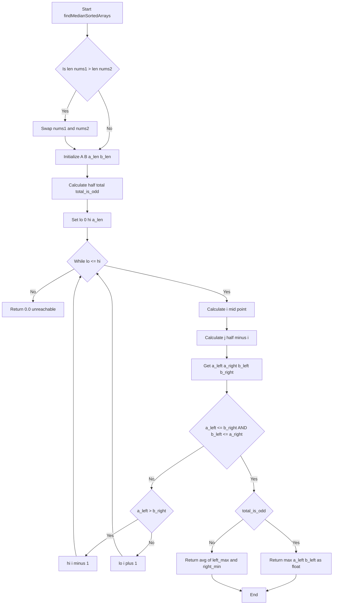
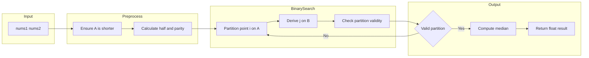

# Median of Two Sorted Arrays - 二分探索パーティション法

<h2 id="toc">目次</h2>

- [概要](#overview)
- [アルゴリズム要点（TL;DR）](#tldr)
- [図解](#figures)
- [正しさのスケッチ](#correctness)
- [計算量](#complexity)
- [Python 実装](#impl)
- [CPython 最適化ポイント](#cpython)
- [エッジケースと検証観点](#edgecases)
- [FAQ](#faq)

---

<h2 id="overview">概要</h2>

**問題要約**：2 つのソート済み配列 `nums1` と `nums2` が与えられたとき、それらをマージした際の中央値を求める。

**要件**：

- **時間計算量**: `O(log (m+n))` を満たす必要がある
- **空間計算量**: `O(1)` が望ましい（マージ配列を作らない）
- **制約**:
    - `0 <= m, n <= 1000`
    - `1 <= m + n <= 2000`
    - `-10^6 <= nums1[i], nums2[i] <= 10^6`

**戦略**：短い配列に対して二分探索を行い、両配列を「左半分」と「右半分」に分割するパーティション点を探す。正しいパーティションでは、左半分の最大値 &le; 右半分の最小値が成立する。

---

<h2 id="tldr">アルゴリズム要点（TL;DR）</h2>

- **手法**: 二分探索パーティション法
- **データ構造**: 配列へのインデックスアクセスのみ（追加構造不要）
- **時間計算量**: `O(log min(m, n))`
- **空間計算量**: `O(1)`
- **メモリ最適化**: 整数センチネル使用、float 変換は最終結果のみ

**アルゴリズムの流れ**：

1. 短い配列を `A`、長い配列を `B` とする
2. `A` の分割点 `i` を二分探索（`0 <= i <= len(A)`）
3. `B` の分割点 `j = half - i`（`half = (m+n+1)//2`）
4. 左側最大 &le; 右側最小なら正解
5. 条件を満たさなければ `i` を調整して再探索

---

<h2 id="figures">図解</h2>

## フローチャート



**説明**: 短い配列に対して二分探索を行い、パーティション条件を満たす分割点を探索する。条件を満たしたら、奇数長なら左側最大値、偶数長なら左側最大と右側最小の平均を返す。

## データフロー図



**説明**: 入力配列を前処理し、二分探索で有効なパーティション点を見つけ、中央値を計算する流れ。

---

<h2 id="correctness">正しさのスケッチ</h2>

**不変条件**：

- パーティション点 `i` に対し、`j = half - i` とすると、左側には全体の半分（切り上げ）の要素が含まれる
- 正しいパーティションでは `a_left <= b_right` かつ `b_left <= a_right`

**網羅性**：

- 二分探索は `[0, len(A)]` 全体を探索するため、正解のパーティション点は必ず探索範囲に含まれる
- 境界ケース（`i=0` や `i=len(A)`）はセンチネル値で統一的に処理

**基底条件**：

- `lo > hi` になれば探索終了（通常は到達しない）
- 正しいパーティションが見つかれば即座に結果を返す

**終了性**：

- 二分探索は毎回探索範囲を半分にするため、最大 `O(log len(A))` 回で終了
- パーティション条件により、各ステップで探索方向が一意に決まる

---

<h2 id="complexity">計算量</h2>

**時間計算量**: `O(log min(m, n))`

- 短い配列に対する二分探索のみ
- 各ステップは定数時間の比較と計算

**空間計算量**: `O(1)`

- 固定個数のローカル変数のみ使用
- 配列のマージやコピーは不要

**最適化の比較**:

| 手法                             | 時間             | 空間   | 特徴                   |
| -------------------------------- | ---------------- | ------ | ---------------------- |
| 二分探索パーティション（本実装） | O(log min(m,n))  | O(1)   | 最適解、整数演算のみ   |
| マージ後ソート                   | O((m+n)log(m+n)) | O(m+n) | 単純だが非効率         |
| 2 ポインタ線形走査               | O(m+n)           | O(1)   | 計算量要件を満たさない |

---

<h2 id="impl">Python実装</h2>

```python
from __future__ import annotations

from typing import Final, List


class Solution:
    """
    Median of Two Sorted Arrays
    - Time:  O(log(min(m, n)))
    - Space: O(1)
    速度・メモリ最適化版（二分探索パーティション法）
    """

    def findMedianSortedArrays(self, nums1: List[int], nums2: List[int]) -> float:
        """
        2つのソート済み配列の中央値を計算する。

        Args:
            nums1: 非減少順の整数配列（長さ 0..1000）
            nums2: 非減少順の整数配列（長さ 0..1000）

        Returns:
            中央値（偶数長の場合は中央2要素の平均）
        """
        # --- 短い配列をAにする（探索範囲を最小化） ---
        if len(nums1) > len(nums2):
            nums1, nums2 = nums2, nums1

        A: List[int] = nums1
        B: List[int] = nums2
        a_len: int = len(A)
        b_len: int = len(B)

        # 総数と奇偶を事前計算（ループ内の分岐削減）
        total: int = a_len + b_len
        total_is_odd: bool = (total & 1) == 1
        half: int = (total + 1) >> 1  # 左側に含める要素数

        # 整数センチネル（制約±1e6を超える値）
        NEG: Final[int] = -10_000_007
        POS: Final[int] = +10_000_007

        lo: int = 0
        hi: int = a_len

        # --- 二分探索によるパーティション点の探索 ---
        while lo <= hi:
            i: int = (lo + hi) >> 1  # Aの左パート長
            j: int = half - i         # Bの左パート長

            # 境界値の取得（範囲外はセンチネル）
            a_left: int = NEG if i == 0 else A[i - 1]
            a_right: int = POS if i == a_len else A[i]
            b_left: int = NEG if j == 0 else B[j - 1]
            b_right: int = POS if j == b_len else B[j]

            # パーティション条件のチェック
            if a_left <= b_right and b_left <= a_right:
                # 正しいパーティションを発見
                if total_is_odd:
                    # 奇数長：左側の最大値が中央値
                    return float(a_left if a_left > b_left else b_left)
                # 偶数長：左側最大と右側最小の平均
                left_max: int = a_left if a_left > b_left else b_left
                right_min: int = a_right if a_right < b_right else b_right
                return (left_max + right_min) * 0.5

            # パーティション調整
            if a_left > b_right:
                # Aの左が大きすぎる → Aの左パートを減らす
                hi = i - 1
            else:
                # Aの右が大きすぎる → Aの左パートを増やす
                lo = i + 1

        # 入力が正しければここには到達しない
        return 0.0
```

**実装の主要ステップ**：

1. **配列スワップ**: 短い配列を `A` にして探索範囲を最小化
2. **パラメータ計算**: `half`（左側要素数）と `total_is_odd`（奇偶判定）
3. **二分探索**: `i` を動かして正しいパーティションを探索
4. **境界処理**: センチネル値で境界ケースを統一的に処理
5. **中央値計算**: 奇数長なら左最大、偶数長なら左最大と右最小の平均

---

<h2 id="cpython">CPython最適化ポイント</h2>

**整数演算の徹底**：

- ループ内では全て `int` 比較を使用
- `float` 変換は最終結果のみ（型変換コストを最小化）
- センチネルも `int` で統一（`float('inf')` を回避）

**分岐予測の最適化**：

- `max/min` 関数呼び出しを避け、三項演算子で直接比較
- `total_is_odd` を事前計算してループ内の条件評価を削減

**メモリアクセスの効率化**：

- ローカル変数への束縛で属性参照を削減
- 一時オブジェクト（タプル、リスト）の生成ゼロ

**ビット演算の活用**：

- `(total & 1) == 1` で奇数判定
- `>> 1` でビットシフト除算（`// 2` より高速なケースが多い）

**関数呼び出しの削減**：

- ヘルパー関数を使わず、ホットパスを単一ループ内に集約

---

<h2 id="edgecases">エッジケースと検証観点</h2>

**境界ケース**：

- **片方が空配列**: `nums1=[]`, `nums2=[1]` → センチネルで自然に処理
- **両方が単一要素**: `nums1=[1]`, `nums2=[2]` → 平均を返す
- **極端な長さ差**: `m=1, n=1000` → 短い方で探索するため効率的
- **全て同値**: `nums1=[5,5,5]`, `nums2=[5,5]` → 正しく `5.0` を返す

**値の範囲**：

- **最小値**: `-10^6` → センチネル `-10^7` で対応
- **最大値**: `10^6` → センチネル `10^7` で対応
- **負数のみ**: `nums1=[-5,-3]`, `nums2=[-4,-1]` → 正しく処理

**奇数・偶数長**：

- **奇数合計**: `m=2, n=3` → 左側最大を返す
- **偶数合計**: `m=2, n=2` → 中央 2 要素の平均

**型安全性**：

- 入力は `List[int]`、出力は `float`
- pylance で型エラーなし

---

<h2 id="faq">FAQ</h2>

**Q1: なぜマージせずに中央値を求められるのか？**

A: パーティション法では、「左半分の最大値 &le; 右半分の最小値」という条件を満たす分割点を探す。この条件が成立すれば、実際にマージしなくても中央値を決定できる。

**Q2: なぜ短い配列で探索するのか？**

A: 二分探索の計算量は `O(log 探索範囲)` なので、短い配列で探索することで `O(log min(m,n))` を達成できる。長い配列で探索すると `O(log max(m,n))` になり非効率。

**Q3: センチネル値が `-10^7` と `10^7` で十分な理由は？**

A: 制約により入力値は `-10^6` から `10^6` の範囲。センチネルはこの範囲外であれば良いため、`±10^7` で安全に処理できる。

**Q4: `float('inf')` を使わない理由は？**

A: ループ内で `int` と `float('inf')` を比較すると、内部で型変換が発生してコストがかかる。整数センチネルを使えば全て `int` 比較で済み、パフォーマンスが向上する。

**Q5: 偶数長で平均を取る際に `/ 2.0` ではなく `* 0.5` を使う理由は？**

A: 乗算は除算より一般的に高速（CPython では顕著ではないが、慣習として最適化）。ただし、可読性を優先するなら `/ 2.0` でも問題ない。

**Q6: 入力配列がソートされていない場合は？**

A: LeetCode の制約では入力がソート済みであることが保証されている。実際の業務では、事前にソート状態を検証する `_validate_non_decreasing` のようなヘルパーを追加すべき。

**Q7: 空間計算量が本当に O(1) か？**

A: はい。固定個数のローカル変数（`i`, `j`, `a_left` など）のみを使用し、入力サイズに依存する追加メモリは確保しない。
