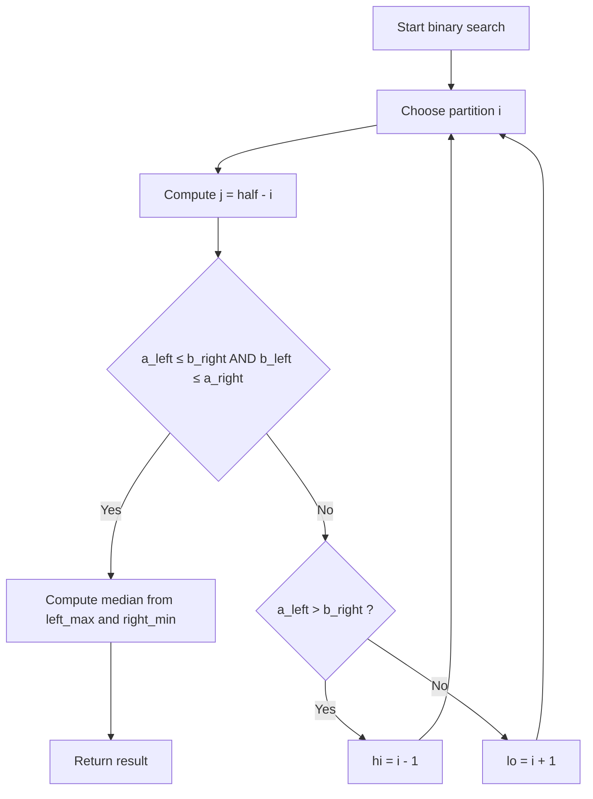
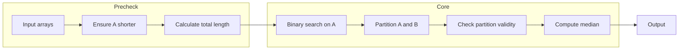
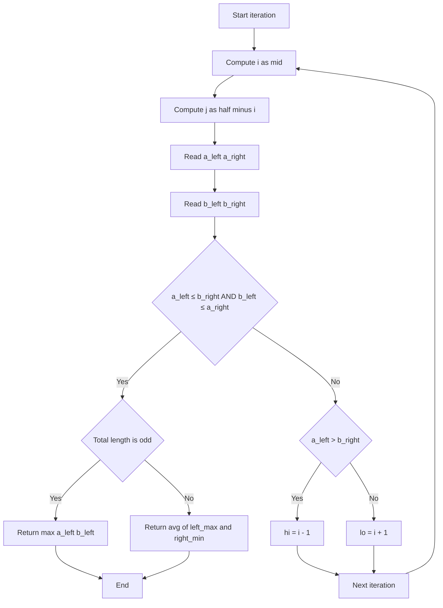
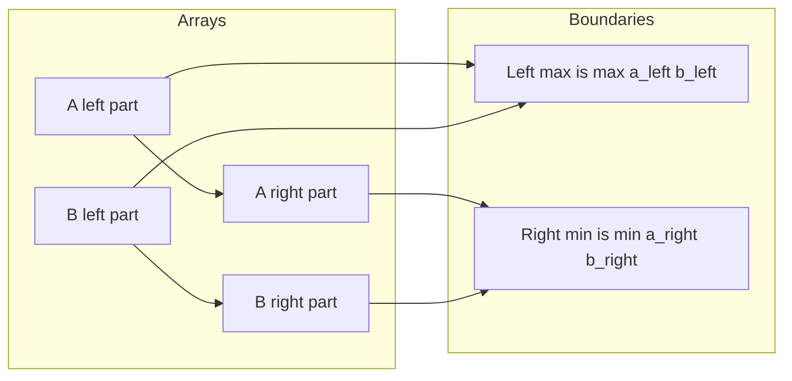
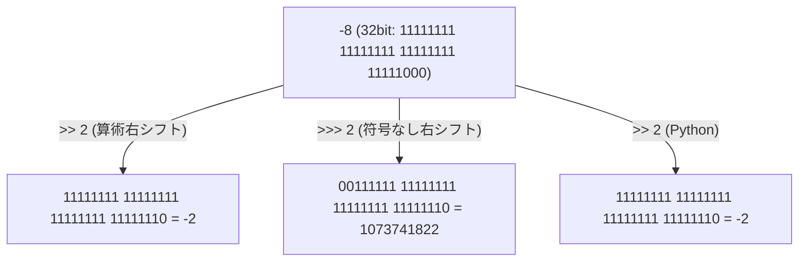

# Median of Two Sorted Arrays - 二分探索による中央値計算

## Table of Contents

- [概要](#overview)
- [アルゴリズム要点（TL;DR）](#tldr)
- [図解](#figures)
- [正しさのスケッチ](#correctness)
- [計算量](#complexity)
- [Python 実装](#impl)
- [CPython 最適化ポイント](#cpython)
- [エッジケースと検証観点](#edgecases)
- [FAQ](#faq)

---

<h2 id="overview">概要</h2>

- **問題**: 2 つのソート済み配列 `nums1`, `nums2` が与えられる。両者を統合した配列の中央値を求めよ。
- **制約**:
    - 配列要素は昇順にソート済み。
    - 配列の長さは 0 以上。
    - 時間計算量は **O(log(min(m, n)))** を要求。

- **要件**:
    - 正しい中央値を返す。
    - 空配列が含まれても対応。
    - 奇数長・偶数長の両方に対応。

---

<h2 id="tldr">アルゴリズム要点（TL;DR）</h2>

- 戦略: **二分探索パーティション法**
- 手順:
    - 短い配列を対象に二分探索。
    - 配列を左右に分割し、左側最大値と右側最小値で中央値を決定。
    - 境界条件は **センチネル値（±∞ の代替 int）** を利用。

- データ構造: 配列のみ（外部構造不要）
- 計算量:
    - Time: **O(log(min(m, n)))**
    - Space: **O(1)**

- 最適化:
    - `int` センチネルで `float` キャストを削減。
    - `max/min` を避け、条件演算子で高速化。
    - ローカル変数束縛で属性参照を削減。

---

<h2 id="figures">図解</h2>



**説明**:

- 配列 A と B をパーティション分割し、境界値を比較する。
- 条件が揃えば中央値を算出、揃わなければ探索範囲を調整する。

---



**説明**:
入力の正規化（短い方を選択）から始まり、二分探索により中央値を導出するデータフローを示す。

---

<h2 id="correctness">正しさのスケッチ</h2>

- **不変条件**: 各反復で `i + j = half` を維持。
- **基底条件**: `i` が範囲 `[0, len(A)]` を越えない。
- **網羅性**: 境界条件に `±INF`（安全な int センチネル）を使用することで、両端のケースを含め全ての分割を網羅。
- **終了性**: 二分探索により探索範囲が縮小し、必ず終了する。

---

<h2 id="complexity">計算量</h2>

- **時間計算量**: O(log(min(m, n)))
    - 二分探索のため。

- **空間計算量**: O(1)
    - 補助配列を作成せず定数メモリで動作。

比較表:

| 手法                   | 時間              | 空間   | 備考         |
| ---------------------- | ----------------- | ------ | ------------ |
| 全マージ               | O(m+n)            | O(m+n) | 遅い         |
| ソート結合             | O((m+n) log(m+n)) | O(m+n) | 不要なソート |
| 二分探索パーティション | O(log(min(m,n)))  | O(1)   | 最適         |

---

<h2 id="impl">Python 実装</h2>

```python
from __future__ import annotations
from typing import List, Final


class Solution:
    """
    Median of Two Sorted Arrays
    - Time:  O(log(min(m, n)))
    - Space: O(1)
    """

    def findMedianSortedArrays(self, nums1: List[int], nums2: List[int]) -> float:
        # 短い配列を A に設定
        if len(nums1) > len(nums2):
            nums1, nums2 = nums2, nums1

        A: List[int] = nums1
        B: List[int] = nums2
        a_len: int = len(A)
        b_len: int = len(B)

        total: int = a_len + b_len
        total_is_odd: bool = (total & 1) == 1
        half: int = (total + 1) >> 1

        # センチネル（制約±1e6より大きい）
        NEG: Final[int] = -10_000_007
        POS: Final[int] = +10_000_007

        lo: int = 0
        hi: int = a_len

        while lo <= hi:
            i: int = (lo + hi) >> 1
            j: int = half - i

            a_left: int = NEG if i == 0 else A[i - 1]
            a_right: int = POS if i == a_len else A[i]
            b_left: int = NEG if j == 0 else B[j - 1]
            b_right: int = POS if j == b_len else B[j]

            if a_left <= b_right and b_left <= a_right:
                if total_is_odd:
                    return float(a_left if a_left > b_left else b_left)
                left_max: int = a_left if a_left > b_left else b_left
                right_min: int = a_right if a_right < b_right else b_right
                return (left_max + right_min) * 0.5

            if a_left > b_right:
                hi = i - 1
            else:
                lo = i + 1

        return 0.0
```

---

<h2 id="cpython">CPython最適化ポイント</h2>

- **int センチネル利用**: `float('inf')` より速い。
- **条件演算子**: `max/min` 関数呼び出しを避ける。
- **ローカル変数束縛**: `len()` や属性参照を外に出す。
- **ビットシフト**: `(lo + hi) >> 1` により整数除算を高速化。

---

<h2 id="edgecases">エッジケースと検証観点</h2>

- 両配列が空 → 問題設定上非定義だが、実装は 0.0 を返す。
- 片方が空 → 中央値はもう一方の中央値。
- 配列の長さが 1 vs 大きい数 → 正しく動作。
- 負数/大数（±1e6 近辺） → センチネル ±1e7 で安全。
- 偶数長と奇数長の両方で正しい中央値を返す。

---

<h2 id="faq">FAQ</h2>

- **Q: なぜ O(log(min(m,n))) が必要？**
  A: 全マージやソートは遅すぎるため、短い配列に対して二分探索を行う必要がある。

- **Q: `float('inf')` を使わない理由は？**
  A: 型変換コスト削減と一貫した `int` 比較のため。

- **Q: 線形マージ解法と比べた利点は？**
  A: 入力が大きい場合に劇的に速く、かつ O(1) 空間で済む。

---

✅ この README は **学習者向けの解説 + 実務向け最適化** の両立を意図して構成されています。

了解です。ご指定のコード断片の **ループ 1 回あたりで何を比較して、なぜ `lo` か `hi` を動かすのか** を、パース安全な Mermaid と ASCII 図で具体的に示します。
（Mermaid は英語ラベルのみ、`-->`、`&le;` エスケープ、1 行 1 エッジのルールを厳守）

---

## 1) ループ内ロジックの流れ図



### **要点 1（日本語）**

- `i` を二分探索の中央に取り、対応する `j = half - i` を決めます。
- `a_left, a_right, b_left, b_right` は **i と j の両側の境界値**。
- 条件 `a_left ≤ b_right` かつ `b_left ≤ a_right` が**両方満たされれば**「正しいパーティション」到達。
    - 総長が奇数なら **左側最大**が中央値。
    - 偶数なら **左側最大と右側最小の平均**が中央値。

- 条件が崩れている場合：
    - `a_left > b_right` なら **A の左が詰まり過ぎ** → `hi = i - 1`（i を小さく）。
    - それ以外は **A の右が大き過ぎ** → `lo = i + 1`（i を大きく）。

---

## 2) パーティションの可視化（概念図）



### **要点 2（日本語）**

- A と B を「左パート」と「右パート」に切ると、**左側最大**と**右側最小**だけで中央値が決まります。
- 「正しいパーティション」とは **左側の全要素 ≤ 右側の全要素** を満たす分割です。
  それを境界 4 値 `a_left, a_right, b_left, b_right` の不等式でチェックしています。

---

## 3) 具体例ウォークスルー

**例**：
A = [1, 3, 8], B = [2, 7, 10, 12]
合計長 = 7 → `half = 4`、奇数長 → 最終的に**左側最大**が中央値。

### 1 回目の反復

- 初期 `lo = 0, hi = len(A) = 3`
- `i = (0 + 3) >> 1 = 1`
- `j = half - i = 4 - 1 = 3`
- 境界値
    - `a_left = A[i-1] = A[0] = 1`
    - `a_right = A[i] = A[1] = 3`
    - `b_left = B[j-1] = B[2] = 10`
    - `b_right = B[j] = B[3] = 12`

- 判定
    - `a_left ≤ b_right` → `1 ≤ 12` は真
    - `b_left ≤ a_right` → `10 ≤ 3` は **偽**

- 結論
  `b_left > a_right`（= A の右側が小さすぎる）→ **i を増やす**：`lo = i + 1 = 2`

### 2 回目の反復

- `lo = 2, hi = 3`
- `i = (2 + 3) >> 1 = 2`
- `j = 4 - 2 = 2`
- 境界値
    - `a_left = A[1] = 3`
    - `a_right = A[2] = 8`
    - `b_left = B[1] = 7`
    - `b_right = B[2] = 10`

- 判定
    - `a_left ≤ b_right` → `3 ≤ 10` 真
    - `b_left ≤ a_right` → `7 ≤ 8` 真

- **正しいパーティション** 到達
    - 奇数長 → 中央値は **max(a_left, b_left) = max(3, 7) = 7**

### ASCII 断面図

```text
A: [ 1 | 3 | 8 ]
          ^
          i=2  => a_left=3, a_right=8

B: [ 2 | 7 | 10 | 12 ]
          ^
          j=2  => b_left=7, b_right=10

Left side elements  = [1,3] + [2,7]  -> left_max = 7
Right side elements = [8] + [10,12] -> right_min = 8 or 10
Odd total -> median = left_max = 7
```

---

## 4) センチネル値の役割（NEG, POS）

**なぜ使うか？**

- i や j が 0 または最終位置にあるとき、`A[i-1]` や `B[j]` は **存在しない** 可能性がある。
- その際に
    - 左境界の無い側は **極小**（NEG）、
    - 右境界の無い側は **極大**（POS）
      を代入すると、**「比較式だけで」端を処理できる**。

### **効果**

- `if i == 0` のような個別分岐を減らし、`a_left ≤ b_right AND b_left ≤ a_right` の **1 本の条件**で判定可能。
- 実装が簡潔になり、分岐ミス（バグ）も減る。

---

## 5) `hi` と `lo` の調整が意味すること

- `a_left > b_right`
  → **A の左側に大き過ぎる値が混ざっている**
  → 左側を減らすため **i を小さく**（`hi = i - 1`）
- それ以外（このとき `b_left > a_right` が成り立つ）
  → **A の右側が小さ過ぎる**（右側にもっと大きい値を回したい）
  → 左側を増やすため **i を大きく**（`lo = i + 1`）

これにより、`i + j = half` を不変に保ちながら、**「左側最大 ≤ 右側最小」** に近づくようにパーティションを微調整していきます。

---

### まとめ

- ループの本質は **「A の切り口 i を二分探索で動かし、左側最大と右側最小が交差しない位置を見つける」** こと。
- 条件が整えば **奇数長は左最大、偶数長は左最大と右最小の平均** で即座に答えが出ます。
- センチネルと 4 境界だけ見ればよい設計により、**分岐を最小化**しつつ **正しさ** と **実装簡潔性** を両立しています。

いい質問です 👍
ここでは **TypeScript の `>>>`** と、**JavaScript/Python の `>>`** について、それぞれの意味と使い方を具体的に整理して説明します。

---

## 1. TypeScript の `>>>` 演算子

### 意味 1

- `>>>` は **符号なし右シフト (zero-fill right shift)** 演算子です。
- 左オペランドを右オペランドのビット数だけ右にシフトし、空いた左側のビットには常に **0** が埋められます。
- 結果は常に **符号なし 32 ビット整数 (0 以上)** になります。

### 例 1

```typescript
// TypeScript (Node.js v18+)
let x: number = -8;

console.log(x >> 2); // -2   (算術右シフト、符号を保持)
console.log(x >>> 2); // 1073741822 (符号なし右シフト、ゼロ埋め)
```

- `-8` の 32 ビット表現: `11111111 11111111 11111111 11111000`
- `x >> 2`: 符号ビットを保持 → `11111111 11111111 11111111 11111110` → `-2`
- `x >>> 2`: 左をゼロで埋める → `00111111 11111111 11111111 11111110` → `1073741822`

---

## 2. JavaScript の `>>` 演算子

### 意味 2

- `>>` は **算術右シフト (arithmetic right shift)** 演算子です。
- 左オペランドを右にシフトし、**符号ビットを保持**（負数なら 1、正数なら 0 が左側に埋められる）。

### 例 2

```javascript
let a = 16;
let b = -16;

console.log(a >> 2); // 4   (16 / 4)
console.log(b >> 2); // -4  (-16 / 4)
```

---

## 3. Python の `>>` 演算子

### 意味 3

- Python でも `>>` は **算術右シフト** 演算子です。
- JavaScript と同じく符号ビットを保持します。
- Python の整数は「任意精度整数」なので、桁あふれは起こりません。

### 例 3

```python
a = 16
b = -16

print(a >> 2)  # 4
print(b >> 2)  # -4
```

---

## 4. まとめ表

| 言語           | 演算子 | 名称                        | 左ビットの埋め方 | 例 (`-8 >> 2` / `-8 >>> 2`) |
| -------------- | ------ | --------------------------- | ---------------- | --------------------------- |
| **TypeScript** | `>>`   | 算術右シフト                | 符号ビット保持   | `-8 >> 2 = -2`              |
|                | `>>>`  | 符号なし右シフト (ゼロ埋め) | 常に `0`         | `-8 >>> 2 = 1073741822`     |
| **JavaScript** | `>>`   | 算術右シフト                | 符号ビット保持   | `-8 >> 2 = -2`              |
|                | `>>>`  | 符号なし右シフト            | 常に `0`         | `-8 >>> 2 = 1073741822`     |
| **Python**     | `>>`   | 算術右シフトのみ            | 符号ビット保持   | `-8 >> 2 = -2`              |
|                | `>>>`  | **存在しない**              | ―                | ―                           |

---

✅ **要点**

- `>>>` は **JS/TS 限定**（Python にはない）。
- JS/TS の `>>>` は **負数を大きな正数に変換するケース**があるので注意。
- Python の整数は任意精度なので `>>>` は不要（存在しない）。

---

## **ビット列の図解 (32bit バイナリ)**

TypeScript / JavaScript の `>>`（算術右シフト）と `>>>`（符号なし右シフト）、
Python の `>>`（算術右シフトのみ）の違いを **32 ビットバイナリ図解** で整理します。

---

### 1. 基本の例題

例として **`x = -8` を右に 2 ビットシフト**するケースを扱います。

---

### 2. -8 の 32 ビット表現

```text
-8 の 32bit 符号付き整数表現 (2の補数表現):
11111111 11111111 11111111 11111000
```

- 先頭ビット = `1` → 負数
- 末尾の `1000` が `8` を示す

---

### 3. 算術右シフト (`>>`) の場合

算術右シフトは **符号ビットを保持** します。

```text
-8 >> 2
11111111 11111111 11111111 11111110   ← 左を「1」で埋める
= -2
```

👉 符号が残るので **負の数のまま**。

---

### 4. 符号なし右シフト (`>>>`) の場合

符号なし右シフトは **左を常に 0 で埋める** ため、負数が大きな正数に変換されます。

```text
-8 >>> 2
00111111 11111111 11111111 11111110   ← 左を「0」で埋める
= 1073741822
```

👉 負数が **巨大な正数** になる。

---

### 5. Python の場合

Python には `>>>` が存在せず、`>>` は **算術右シフトのみ**です。

```python
-8 >> 2  # -2
```

Python の整数は任意精度なので、32 ビットに限定されません。
そのため「0 埋めシフト」の `>>>` が不要で実装されていません。

---

### 6. 図解まとめ（Mermaid フローチャート風）



---

### 7. まとめ表

| 言語 / 演算子        | 左ビットの埋め方 | `-8 >> 2` | `-8 >>> 2`      |
| -------------------- | ---------------- | --------- | --------------- |
| **TypeScript** `>>`  | 符号ビット保持   | -2        | ―               |
| **TypeScript** `>>>` | 常に 0 埋め      | ―         | 1073741822      |
| **JavaScript** `>>`  | 符号ビット保持   | -2        | ―               |
| **JavaScript** `>>>` | 常に 0 埋め      | ―         | 1073741822      |
| **Python** `>>`      | 符号ビット保持   | -2        | ―（存在しない） |

---

✅ これで「`>>>` は JS/TS 限定のゼロ埋め右シフト」「Python は算術右シフトのみ」という違いが、ビット列でハッキリ見えると思います。
