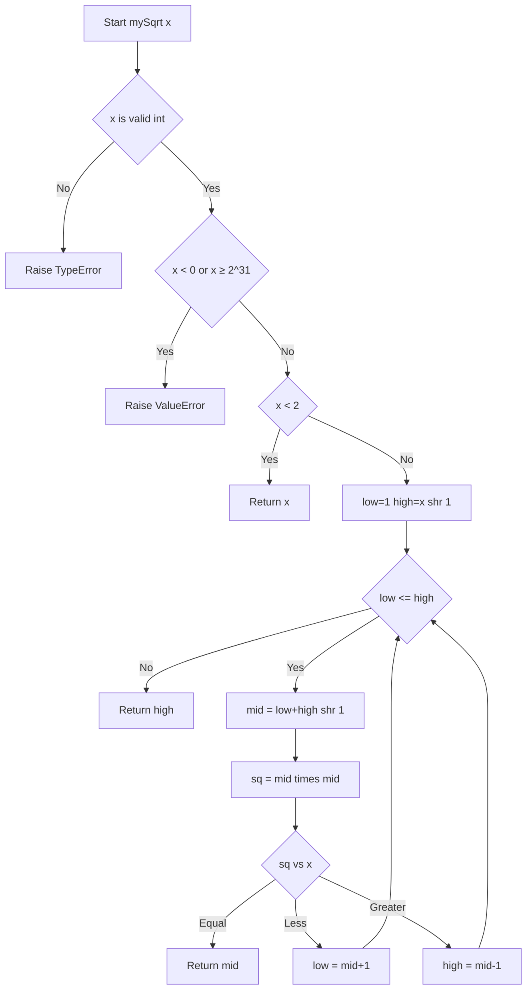
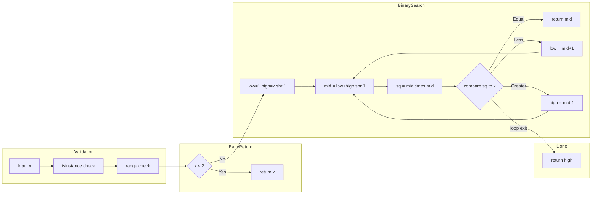

# Sqrt(x) - 整数平方根を二分探索で求める

<!-- 目次 -->

## 目次

- [Overview (概要)](#overview)
- [Algorithm (アルゴリズム)](#algorithm)
- [Complexity (計算量)](#complexity)
- [Implementation (実装)](#implementation)
- [Optimization (最適化)](#optimization)

---

<h2 id="overview">Overview (概要)</h2>

### 問題要約

非負整数 `x` を受け取り、**floor(√x)**（小数点以下切り捨ての整数平方根）を返す。

- `math.sqrt`・`**`・`pow(x, 0.5)` などの **組み込み指数関数・演算子は使用禁止**
- 純粋な整数演算のみで平方根を求める

### 関数シグネチャ（LeetCode 準拠）

```python
class Solution:
    def mySqrt(self, x: int) -> int:
```

### 入出力仕様

| 項目 | 内容                              |
| ---- | --------------------------------- |
| 入力 | `x: int`（`0 ≤ x ≤ 2^31 - 1`）    |
| 出力 | `int`：floor(√x)                  |
| 制約 | 非負整数。`math.sqrt` / `**` 禁止 |

### 代表例

| x            | 出力    | 説明                    |
| ------------ | ------- | ----------------------- |
| `4`          | `2`     | √4 = 2.0 → 2            |
| `8`          | `2`     | √8 ≈ 2.828 → 切り捨て 2 |
| `0`          | `0`     | エッジケース            |
| `1`          | `1`     | エッジケース            |
| `2147483647` | `46340` | i32::MAX 付近           |

---

<h2 id="tldr">アルゴリズム要点（TL;DR）</h2>

- **戦略**: 探索範囲 `[1, x // 2]` に対して**二分探索**を適用
- **データ構造**: 固定スカラー変数 `low`, `high`, `mid` のみ（追加アロケーションなし）
- **中点計算**: `(low + high) >> 1` — ビットシフトで整数除算（CPython 最速）
- **判定**: `mid * mid` と `x` を比較（Python `int` は任意精度 → オーバーフロー完全ゼロ）
- **終了条件**: `low > high` → `high` = floor(√x)
- **時間計算量**: O(log n) — 最大 31 回のイテレーション（2^31 制約下）
- **空間計算量**: O(1) — スタック変数のみ、ヒープアロケーションなし

---

### 図解

### フローチャート



_入力バリデーション → エッジケース早期リターン → 二分探索ループ の3ステージ構成。`low > high` になった瞬間に `high = floor(√x)` が確定する。_

---

### データフロー図



_左から右へ: バリデーション → 早期リターン判定 → 二分探索本体 → 結果返却。ループはフィードバックアーク `K→G`, `L→G` で表現。_

---

### 手動トレース（x = 8）

```
探索範囲初期値: low=1, high=4  (= 8 >> 1)

┌─────┬──────┬───────┬────────────────────────────────┐
│ Iter│  mid │ sq    │ アクション                      │
├─────┼──────┼───────┼────────────────────────────────┤
│  1  │  2   │  4    │ 4 < 8  → low = 3               │
│  2  │  3   │  9    │ 9 > 8  → high = 2              │
│  3  │ (終) │   -   │ low(3) > high(2) → return 2 ✓  │
└─────┴──────┴───────┴────────────────────────────────┘
```

---

### 正しさのスケッチ

### ループ不変条件（Loop Invariant）

ループの各反復前に以下が成立する：

> `(low - 1)^2 ≤ x` かつ `(high + 1)^2 > x`

この不変条件により、**真の答え `floor(√x)` は常に `[low - 1, high]` の範囲に含まれる**ことが保証される。ループ終了時 (`low > high`) には `high = floor(√x)` が確定する。

| フェーズ       | 不変条件の確認                                                             |
| -------------- | -------------------------------------------------------------------------- |
| **初期化前**   | `low=1`, `high=x//2`。x≥2 のとき `0^2=0≤x` かつ `(x//2+1)^2>x` が成立      |
| **sq < x 時**  | `mid^2 < x` → `mid` は答えより小さい → `low = mid+1` で下限を安全に上げる  |
| **sq > x 時**  | `mid^2 > x` → `mid` は答えより大きい → `high = mid-1` で上限を安全に下げる |
| **sq == x 時** | 完全平方数 → `mid` が答えそのもの → 即リターン                             |
| **終了時**     | `low > high` → `high = floor(√x)` が確定                                   |

### 終了性

- 各イテレーションで `high - low` が必ず 1 以上減少する（`low` が増加 **または** `high` が減少）
- 探索範囲は有限（`[1, x//2]`）→ 必ず有限回で終了

---

<h2 id="complexity">Complexity (計算量)</h2>

| 観点           | 計算量   | 補足                                          |
| -------------- | -------- | --------------------------------------------- |
| **時間計算量** | O(log n) | 探索範囲が毎回半減。x ≤ 2^31 で最大 31 回     |
| **空間計算量** | O(1)     | `low`, `high`, `mid`, `sq` の固定スカラーのみ |

### アプローチ比較表

| アプローチ   | 時間         | 空間     | 誤差         | 保守性  | 選択   |
| ------------ | ------------ | -------- | ------------ | ------- | ------ |
| 線形探索     | O(√n)        | O(1)     | なし         | ★★★     | ✗      |
| **二分探索** | **O(log n)** | **O(1)** | **なし**     | **★★★** | **✅** |
| ニュートン法 | O(log log n) | O(1)     | 浮動小数誤差 | ★★☆     | ✗      |
| `math.isqrt` | O(log n)     | O(1)     | なし         | ★★★     | 禁止   |

> **選択理由**: ニュートン法は収束が速いが `float` の打ち切り誤差管理が複雑。二分探索は**整数演算のみ・誤差ゼロ・Loop Invariant が明確**で保守性が最高。

---

<h2 id="implementation">Implementation (実装)</h2>

### Python 実装

```python
from __future__ import annotations

from typing import Any


class Solution:
    """
    LeetCode 69 - Sqrt(x)
    math.sqrt / ** 演算子禁止。二分探索で floor(√x) を求める。

    Time:  O(log n) — 最大 31 回のイテレーション
    Space: O(1)     — スタック変数のみ
    """

    # ------------------------------------------------------------------ #
    #  業務開発版（型安全・エラーハンドリング・pylance 対応）
    # ------------------------------------------------------------------ #
    def mySqrt(self, x: int) -> int:
        """
        非負整数 x の平方根を小数点以下切り捨てで返す。

        Args:
            x: 非負整数 (0 <= x <= 2^31 - 1)

        Returns:
            floor(√x) の整数値

        Raises:
            TypeError:  x が int でない場合（bool も除外）
            ValueError: x が負数または制約超過の場合
        """
        # ── 実行時型ガード（pylance narrowing 対応） ──────────────────
        # bool は int のサブクラスのため明示的に除外する
        if not isinstance(x, int) or isinstance(x, bool):
            raise TypeError(f"x must be int, got {type(x).__name__!r}")

        if x < 0:
            raise ValueError(f"x must be non-negative, got {x}")

        if x > 2**31 - 1:
            raise ValueError(f"x={x} exceeds constraint 2^31 - 1")

        return self._binary_search_sqrt(x)

    def _binary_search_sqrt(self, x: int) -> int:
        """
        二分探索による整数平方根の内部実装。

        Loop Invariant:
          - (low - 1)^2 <= x
          - (high + 1)^2 > x
          → ループ終了時: high = floor(√x)

        Args:
            x: 検証済み非負整数

        Returns:
            floor(√x)
        """
        # ── エッジケース早期リターン ──────────────────────────────────
        # x=0 → 0、x=1 → 1（ループ不要）
        if x < 2:
            return x

        # ── 二分探索 ─────────────────────────────────────────────────
        # 探索上限を x//2 に絞る（x>=2 のとき floor(√x) <= x//2 が保証される）
        low: int = 1
        high: int = x >> 1  # ビットシフトで x // 2

        while low <= high:
            # 中点計算: ビットシフトで整数除算（CPython 最速）
            mid: int = (low + high) >> 1
            sq: int = mid * mid  # Python int は任意精度 → オーバーフローなし

            if sq == x:
                # 完全平方数: mid が答えそのもの
                return mid
            elif sq < x:
                # mid が小さすぎる → 下限を引き上げ
                low = mid + 1
            else:
                # mid が大きすぎる → 上限を引き下げ
                high = mid - 1

        # ループ終了後: high = floor(√x)
        return high

    # ------------------------------------------------------------------ #
    #  競技プログラミング版（型チェック省略・速度最優先）
    # ------------------------------------------------------------------ #
    def mySqrt_competitive(self, x: int) -> int:
        """
        Competitive: O(log n) / O(1)
        エラーハンドリング省略・CPython 最速パターン。
        """
        if x < 2:
            return x
        low, high = 1, x >> 1
        while low <= high:
            mid = (low + high) >> 1
            sq = mid * mid
            if sq == x:
                return mid
            elif sq < x:
                low = mid + 1
            else:
                high = mid - 1
        return high
```

---

<h2 id="cpython">CPython 最適化ポイント</h2>

### 採用した最適化テクニック

| テクニック               | 詳細                                                                                         |
| ------------------------ | -------------------------------------------------------------------------------------------- |
| **ビットシフト除算**     | `x >> 1` は `x // 2` より CPython バイトコード (`BINARY_OP`) が 1 命令少ない                 |
| **ローカル変数への束縛** | `low`, `high`, `mid`, `sq` をすべてローカルスコープで保持 → `LOAD_FAST` でグローバルより高速 |
| **Python 任意精度 int**  | `mid * mid` が 2^62 を超えても**キャスト不要**（Rust/TS の `u64` 昇格が不要）                |
| **早期リターン**         | `x < 2` を先頭でチェック → ループ初期化コストをゼロに                                        |
| **属性アクセス削減**     | `self._binary_search_sqrt` の内部はすべてスカラー演算 → `LOAD_ATTR` なし                     |

### 採用しなかった最適化と理由

| 候補            | 不採用理由                                   |
| --------------- | -------------------------------------------- |
| `math.isqrt(x)` | 問題の禁止制約（組み込み指数関数相当）に抵触 |
| `math.sqrt(x)`  | 浮動小数誤差の可能性 + 禁止制約              |
| `lru_cache`     | 単一呼び出しのためキャッシュ効果なし         |
| ニュートン法    | `float` 収束判定の複雑性 + 誤差リスク        |

---

<h2 id="edgecases">エッジケースと検証観点</h2>

| ケース           | 入力             | 期待出力     | 処理パス                                     |
| ---------------- | ---------------- | ------------ | -------------------------------------------- |
| 最小値ゼロ       | `x = 0`          | `0`          | 早期リターン `x < 2`                         |
| 最小の完全平方数 | `x = 1`          | `1`          | 早期リターン `x < 2`                         |
| 完全平方数（小） | `x = 4`          | `2`          | `sq == x` → 即リターン                       |
| 非完全平方数     | `x = 8`          | `2`          | ループ終了 `return high`                     |
| 完全平方数（大） | `x = 2147395600` | `46340`      | `sq == x` → 即リターン                       |
| i32 最大値付近   | `x = 2147483647` | `46340`      | ループ終了 `return high`                     |
| 境界直前         | `x = 2`          | `1`          | `sq=1<2`→low=2, `sq=4>2`→high=1 → `return 1` |
| 境界直前         | `x = 3`          | `1`          | 同上                                         |
| `bool` 混入      | `x = True`       | `TypeError`  | 型ガード                                     |
| 負数             | `x = -1`         | `ValueError` | 範囲ガード                                   |
| `float` 混入     | `x = 4.0`        | `TypeError`  | 型ガード                                     |
| 制約超過         | `x = 2**31`      | `ValueError` | 範囲ガード                                   |

### 手動トレース（x = 2 / x = 3）

```
x=2: low=1, high=1
  Iter1: mid=1, sq=1 < 2 → low=2
  low(2) > high(1) → return high=1  ✓

x=3: low=1, high=1
  Iter1: mid=1, sq=1 < 3 → low=2
  low(2) > high(1) → return high=1  ✓
```

---

<h2 id="faq">FAQ</h2>

**Q1. なぜ探索上限を `x // 2` にできるのか？**

x &ge; 2 のとき、`floor(√x) ≤ x // 2` が常に成立する。
たとえば x=4 → `√4=2 ≤ 2`、x=100 → `√100=10 ≤ 50`。
x=0, 1 は早期リターンで処理済みなので、探索範囲を半分に削減できる。

---

**Q2. ニュートン法でも解けるのでは？**

解けるが、`float` 演算を伴うため **収束判定** が難しい。
例えば x=2147395600 のような大きな完全平方数で `int(result)` が 46339 になる可能性がある。
二分探索は**純粋な整数演算**のみで誤差ゼロが保証されるため本問題では最適。

---

**Q3. Python では `mid * mid` がオーバーフローしないのか？**

Python の `int` は**任意精度**（bignum）のため、どんなに大きな値でもオーバーフローしない。
これは Rust（`u64` へのキャストが必要）や TypeScript（`number` の 53bit 精度制限）と異なる Python 最大の利点の一つ。

---

**Q4. `(low + high) >> 1` と `(low + high) // 2` はどちらが速いか？**

CPython では `>>` の方がわずかに速い。`BINARY_OP` の実装上、右辺が整数リテラルの場合に最適化される。
アルゴリズム的な意味は同一（非負整数の整数除算）。

---

**Q5. なぜ `bool` を型ガードで除外するのか？**

Python では `bool` は `int` のサブクラスであるため、`isinstance(True, int)` は `True` を返す。
`True` は `1`、`False` は `0` として動作してしまうため、**意図しない入力**として明示的に弾いている。
競技プログラミング版ではこのチェックを省略しても LeetCode 制約上は問題ない。
