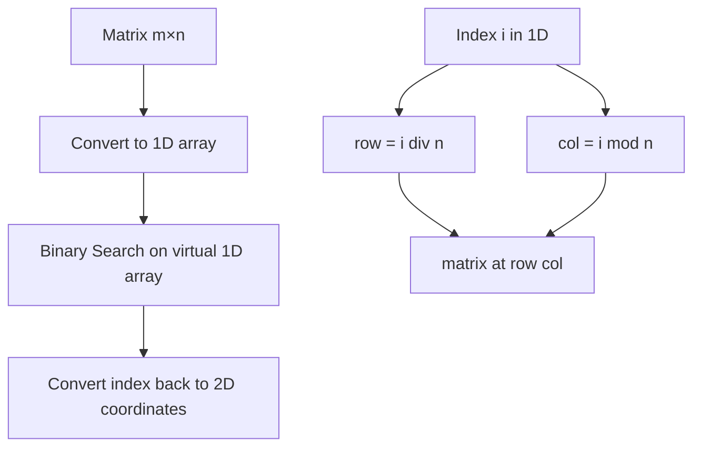
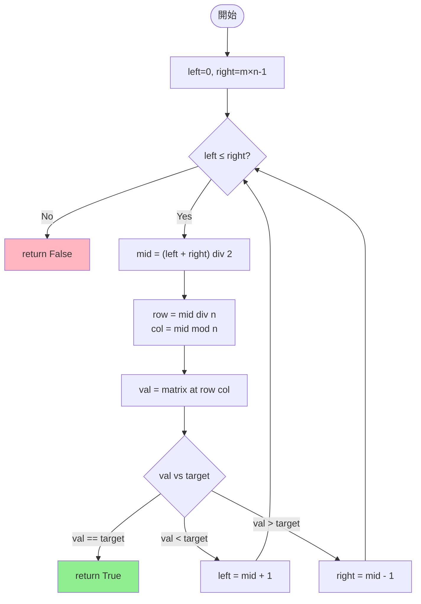
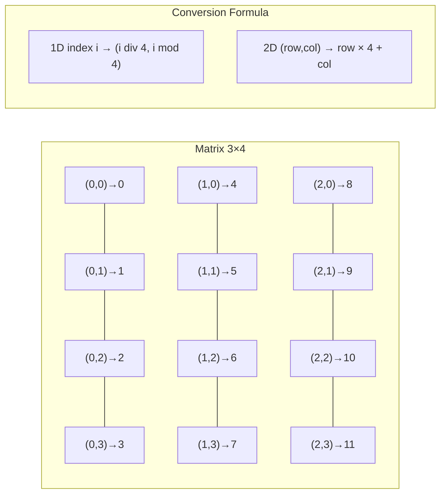
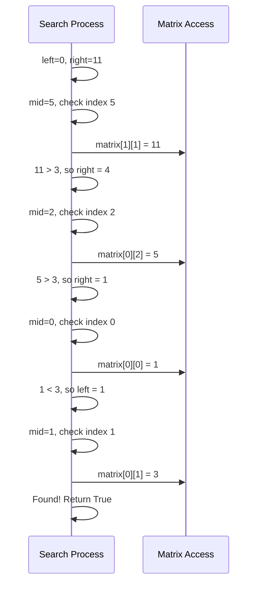
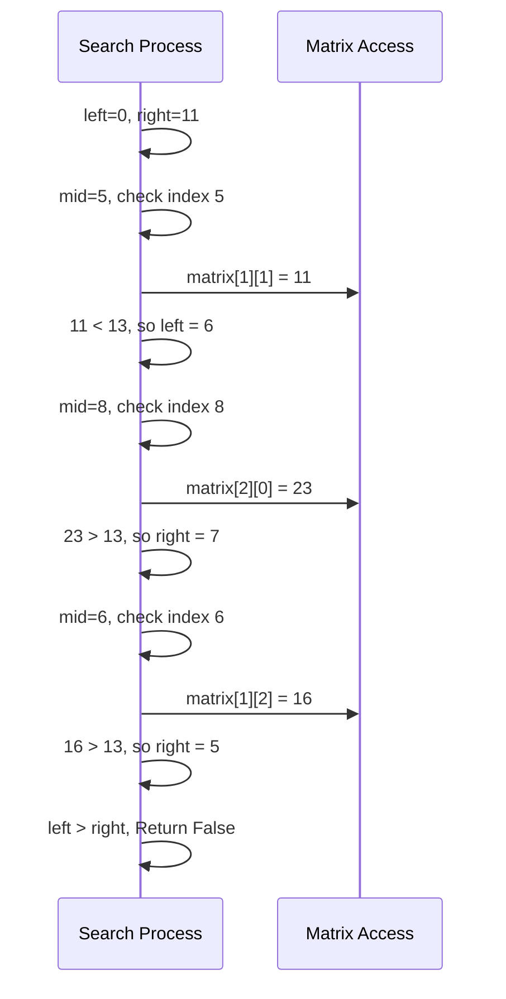
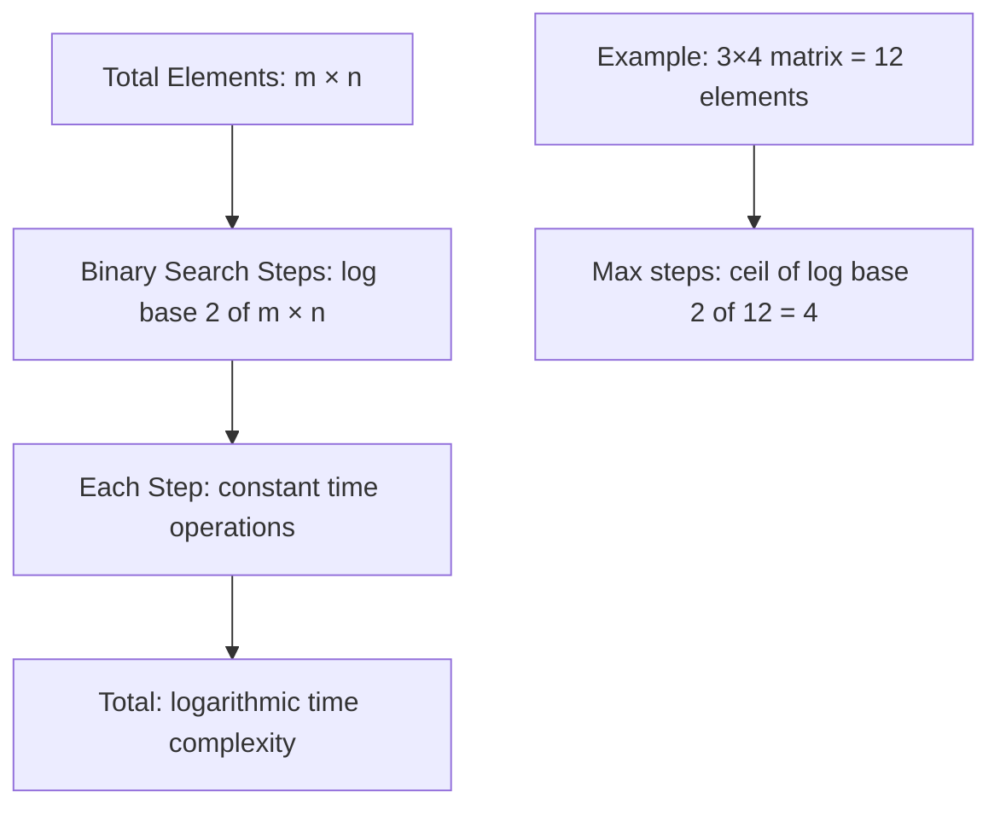
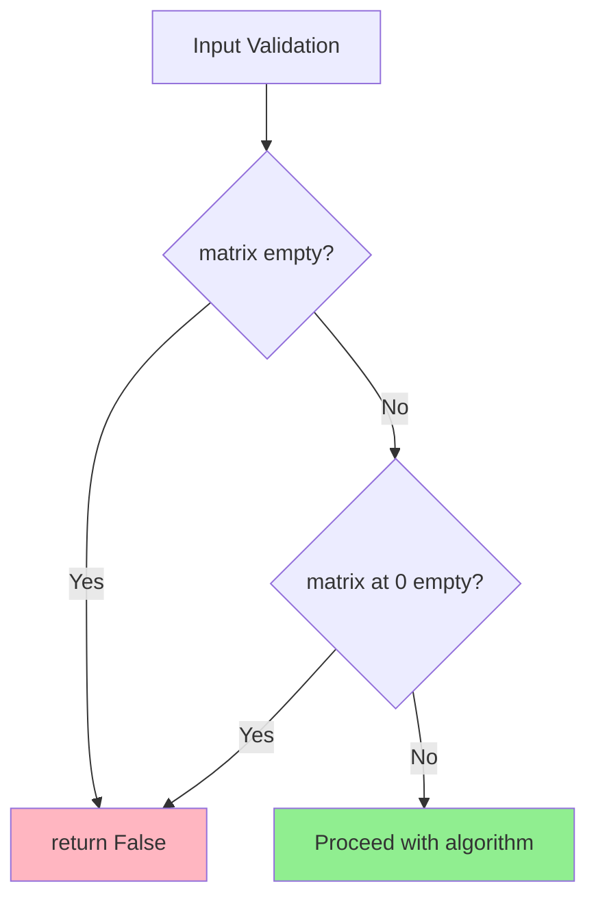

# 2D Matrix Binary Search Algorithm

## 問題概要

ソート済み 2 次元行列において、指定されたターゲット値を効率的に検索するアルゴリズムの実装です。

### 問題の制約条件

- 各行は非降順でソートされている
- 各行の最初の要素は、前の行の最後の要素よりも大きい
- 時間計算量 O(log(m × n)) での実装が必要

## アルゴリズム分析

### アプローチの比較

| アプローチ                  | 時間計算量       | 空間計算量 | 実装難易度 | 特徴     |
| --------------------------- | ---------------- | ---------- | ---------- | -------- |
| **Binary Search (1D 変換)** | O(log(m×n))      | O(1)       | 低         | **推奨** |
| Linear Search (行ごと)      | O(m×n)           | O(1)       | 非常に低   | 非効率   |
| Row + Column Binary Search  | O(log m + log n) | O(1)       | 中         | 複雑     |

### 選択した手法：1 次元変換による二分探索

2 次元行列を 1 次元配列として扱い、インデックス変換を用いて二分探索を実行します。

## アルゴリズムの動作原理

### 座標変換の仕組み



### 二分探索のフロー



## 実装詳細

### メインアルゴリズム

```python
from typing import List

class Solution:
    def searchMatrix(self, matrix: List[List[int]], target: int) -> bool:
        """
        2D行列内を二分探索で探索する
        行列は「各行がソート済み」「行の先頭が前行の末尾より大きい」という条件を満たす
        """
        if not matrix or not matrix[0]:
            return False

        n, m = len(matrix), len(matrix[0])
        left, right = 0, n * m - 1

        while left <= right:
            mid = (left + right) // 2
            val = matrix[mid // m][mid % m]

            if val == target:
                return True
            elif val < target:
                left = mid + 1
            else:
                right = mid - 1

        return False
```

### 座標変換の詳細説明



## 実行例の詳細解析

### Example 1: target = 3

```text
Matrix: [[1,3,5,7],[10,11,16,20],[23,30,34,60]]
1D view: [1,3,5,7,10,11,16,20,23,30,34,60]
```



### Example 2: target = 13



## 計算量分析

### 時間計算量: O(log(m × n))



### 空間計算量: O(1)

- 追加配列不要
- 固定サイズの変数のみ使用

## Python 固有の最適化ポイント

### 1. 演算子の効率性

```python
# 高速: 整数除算と剰余演算
row = mid // m    # ビットシフトより readable
col = mid % m     # CPython で最適化済み
```

### 2. 条件分岐の最適化

```python
# 効率的な三段階比較
if val == target:      # 最も期待される結果を先に
    return True
elif val < target:     # 確率的に均等な分岐
    left = mid + 1
else:                  # 残りのケース
    right = mid - 1
```

### 3. 型ヒントによる可読性向上

```python
def searchMatrix(self, matrix: List[List[int]], target: int) -> bool:
    # IDE支援、静的解析対応
    # 実行時オーバーヘッドなし
```

## エラーケースの処理



## 実用性とパフォーマンス

### 競技プログラミング観点

- **メリット**: シンプルで高速、実装ミスが少ない
- **注意**: 制約条件（行列の性質）を必ず確認

### 業務開発観点

- **可読性**: 直感的なアルゴリズム
- **保守性**: エッジケース処理が明確
- **拡張性**: 類似問題への応用が容易

## まとめ

この実装は 2D 行列を 1D 配列として扱うことで、シンプルかつ効率的な二分探索を実現しています。座標変換のロジックさえ理解すれば、標準的な二分探索アルゴリズムをそのまま適用できる点が最大の利点です。

時間計算量 O(log(m×n))、空間計算量 O(1)を達成し、Python の特性を活かした実装となっています。
