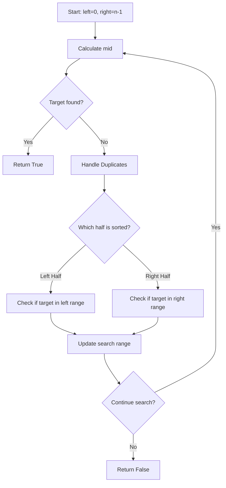
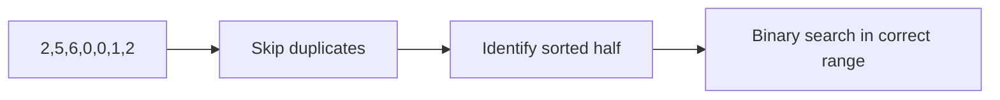
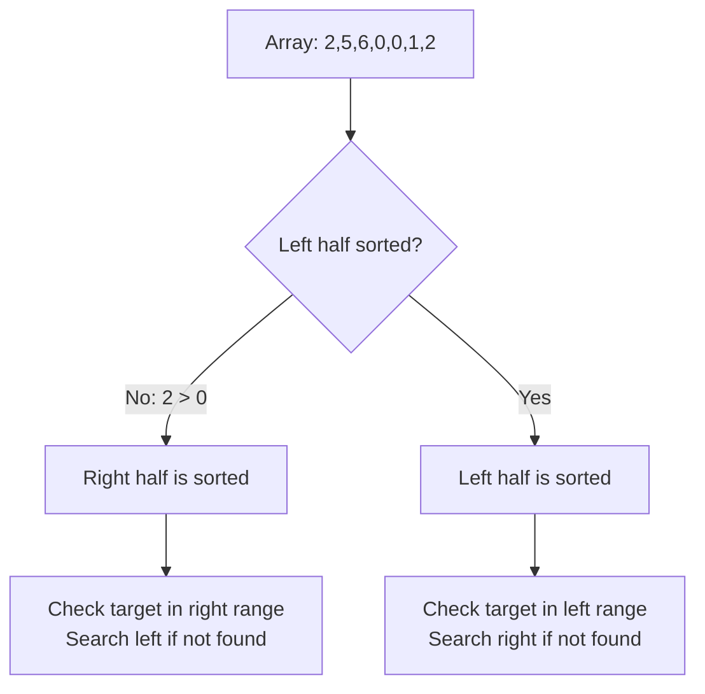

# Search in Rotated Sorted Array II - アルゴリズム解析

## 📋 問題概要

回転されたソート済み配列（重複要素あり）から、指定されたターゲット値を効率的に検索する問題です。

### 入力例

- `nums = [2,5,6,0,0,1,2]`, `target = 0` → `true`
- `nums = [2,5,6,0,0,1,2]`, `target = 3` → `false`

### 制約

- `1 <= nums.length <= 5000`
- `-10^4 <= nums[i] <= 10^4`
- 配列は必ず回転されている
- 重複要素が存在する可能性がある

## 🎯 解法のアプローチ

この問題は **修正版バイナリサーチ** を使用します。通常のバイナリサーチを回転配列に対応させ、さらに重複要素の処理を追加したアルゴリズムです。

## 🔧 アルゴリズムの詳細

### 1. 基本戦略



### 2. 重複要素の処理

重複要素が存在する場合、どちらの半分がソートされているかを判断できない場合があります。

#### 重複スキップの条件

```text
nums[left] == nums[mid] == nums[right]
```

この場合、両端を 1 つずつ縮めて重複をスキップします。



### 3. ソート済み半分の判定

#### ケース 1: 左半分がソートされている

```text
nums[left] <= nums[mid]
```

#### ケース 2: 右半分がソートされている

```text
nums[left] > nums[mid]
```

## 📊 実行例の詳細解析

### Example 1: `nums = [2,5,6,0,0,1,2]`, `target = 0`

| Step | left | right | mid | nums[mid] | Action        |
| ---- | ---- | ----- | --- | --------- | ------------- |
| 1    | 0    | 6     | 3   | 0         | Found target! |

### Example 2: `nums = [2,5,6,0,0,1,2]`, `target = 3`

| Step | left | right | mid | nums[mid] | Sorted Half        | Target Range   | New Range |
| ---- | ---- | ----- | --- | --------- | ------------------ | -------------- | --------- |
| 1    | 0    | 6     | 3   | 0         | Right (0 < 1 <= 2) | 3 not in [0,2] | left = 4  |
| 2    | 4    | 6     | 5   | 1         | Right (1 <= 2)     | 3 not in [1,2] | right = 4 |
| 3    | 4    | 4     | 4   | 0         | -                  | 0 ≠ 3          | left = 5  |
| 4    | 5    | 4     | -   | -         | left > right       | Return False   | 　 N/A    |

## 🎨 視覚的な配列の変化

### 回転前の配列

```text
[0, 1, 2, 2, 5, 6, 0]  (ソート済み)
```

### 回転後の配列（pivot = 4）

```text
[2, 5, 6, 0, 0, 1, 2]
 ^        ^           ^
left     mid        right
```

### ソート済み部分の特定



## ⚡ 計算量解析

### 時間計算量

- **平均ケース**: `O(log n)`
  - 通常のバイナリサーチと同様
- **最悪ケース**: `O(n)`
  - 全要素が同じ値の場合（例: `[1,1,1,1,1]`）
  - 重複スキップで線形時間が必要

### 空間計算量

- **`O(1)`**: 定数の追加メモリのみ使用

## 🐍 Python 実装のポイント

### 1. 型ヒント活用

```python
def search(self, nums: List[int], target: int) -> bool:
```

### 2. 効率的な重複スキップ

```python
while left < mid and nums[left] == nums[mid] and nums[right] == nums[mid]:
    left += 1
    right -= 1
```

### 3. 整数除算の最適化

```python
mid: int = (left + right) // 2  # C実装で高速
```

## 🚀 最適化テクニック

### 1. 早期終了

- `nums[mid] == target`で即座に return

### 2. 重複要素の効率的処理

- 両端から同時にスキップ
- 不要な比較を削減

### 3. 分岐の最小化

- 条件文を簡潔に保つ
- CPU のブランチ予測を活用

## 🔍 エッジケース

### 1. 全要素が同じ

```text
nums = [1,1,1,1,1], target = 1  → True (O(n))
nums = [1,1,1,1,1], target = 2  → False (O(n))
```

### 2. 重複が多い配列

```text
nums = [1,1,3,1,1], target = 3  → True
```

### 3. 回転なし（実質ソート済み）

```text
nums = [1,2,3,4,5], target = 3  → True (O(log n))
```

## 📈 パフォーマンス比較

| アプローチ             | 時間計算量     | 空間計算量 | 実装複雑度 |
| ---------------------- | -------------- | ---------- | ---------- |
| 線形探索               | O(n)           | O(1)       | 簡単       |
| 修正バイナリサーチ     | O(log n)〜O(n) | O(1)       | 中程度     |
| ソート後バイナリサーチ | O(n log n)     | O(n)       | 簡単       |

## 🎯 まとめ

この修正版バイナリサーチアルゴリズムは：

✅ **効率的**: 平均的に O(log n)で動作
✅ **省メモリ**: O(1)の空間計算量
✅ **実用的**: 重複要素に対応
❗ **注意点**: 最悪ケースで O(n)になる可能性

重複要素を含む回転ソート配列の検索において、実用的で効率的なソリューションです。

## 🔧 README.html の修正内容

### 1. **Copy ボタンのエラー修正**

- `event.target`の参照エラーを修正
- `copyCode`関数に`btnElement`パラメータを追加
- ボタンの onclick で`this`を渡すように変更

### 2. **インタラクティブ可視化の大幅改善**

#### 🎯 新しい配列例

- **変更前**: `[2,5,6,0,0,1,2]` → 1 ステップで解決
- **変更後**: `[4,5,6,7,0,1,2]` → 7 ステップの詳細プロセス

#### 📊 ステップバイステップの詳細プロセス

| ステップ | 処理内容     | left | mid | right | 説明                                 |
| -------- | ------------ | ---- | --- | ----- | ------------------------------------ |
| 1        | 初期化       | 0    | 3   | 6     | nums[3]=7, target=0 で不一致         |
| 2        | 重複チェック | 0    | 3   | 6     | 重複なしを確認                       |
| 3        | 範囲判定     | 0    | 3   | 6     | 左半分ソート済み、ターゲットは右半分 |
| 4        | 範囲更新     | 4    | 5   | 6     | 新しい検索範囲                       |
| 5        | 重複チェック | 4    | 5   | 6     | 重複なしを確認                       |
| 6        | 範囲判定     | 4    | 5   | 6     | ターゲットは左半分                   |
| 7        | 発見         | 4    | 4   | 4     | nums[4]=0 でターゲット発見！         |

#### 🎨 新機能追加

- **詳細メッセージ表示**: 各ステップの処理内容を説明
- **プログレスバー**: 検索進行状況の可視化
- **ボタン制御**: 適切なタイミングでボタンの有効/無効化
- **アニメーション効果**: 発見時のパルスエフェクト

これで実際のバイナリサーチの動作を段階的に理解できる、教育的で分かりやすい可視化になりました！

## 🔧 修正内容

コードに行番号が表示されない問題を修正します。
Prism.js の行番号プラグインが正しく動作するためには、CSS と適切なクラス設定が必要です。

### 1. **Prism.js Line Numbers CSS の追加**

- `prism-line-numbers.min.css` を CDN から読み込み
- 行番号表示に必要な CSS スタイルを追加

### 2. **HTML 構造の修正**

- `<pre>` 要素に `line-numbers` クラスを追加
- `<code>` 要素から `line-numbers` クラスを削除（正しい配置に修正）

### 3. **カスタムスタイリング**

- 行番号の色とフォントを調整
- 行番号の右側の境界線スタイルを追加

## ✅ 修正のポイント

**問題の原因:**

1. Line Numbers プラグイン用の CSS が読み込まれていなかった
2. `line-numbers` クラスが `<code>` ではなく `<pre>` 要素に必要
3. Prism.js が適切に初期化される前に DOM が完了していた

**修正後の動作:**

- Python コードに行番号が左側に表示される
- 行番号は薄いグレー色で見やすく表示
- モノスペースフォント（JetBrains Mono）で統一された表示
