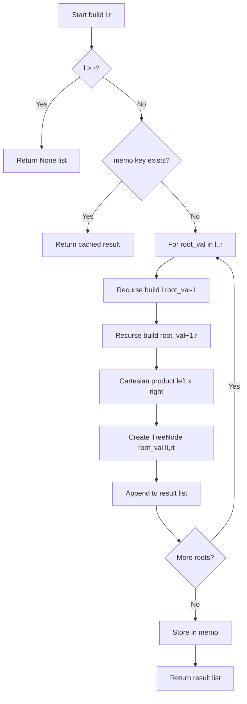
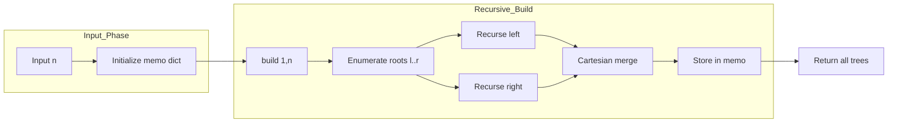

# Unique BSTs II - 全 BST 列挙（分割統治＋区間メモ化）

<h2 id="toc">目次</h2>

- [概要](#overview)
- [アルゴリズム要点（TL;DR）](#tldr)
- [図解](#figures)
- [正しさのスケッチ](#correctness)
- [計算量](#complexity)
- [Python 実装](#impl)
- [CPython 最適化ポイント](#cpython)
- [エッジケースと検証観点](#edgecases)
- [FAQ](#faq)

---

<h2 id="overview">概要</h2>

**問題**: 整数 `n` に対し、値 `1..n` を持つノードで構成される**構造的に一意な BST（二分探索木）**をすべて生成する。

**要件**:

- 各木は BST の性質を満たす（左部分木 < 根 < 右部分木）
- 同型でない木はすべて列挙する（順序は任意）
- `1 <= n <= 8` の制約

**制約のポイント**:

- `n=8` でも生成本数は**カタラン数 C₈ = 1430**と小規模
- 出力サイズが支配的なため、重複計算の排除が最優先

---

<h2 id="tldr">アルゴリズム要点（TL;DR）</h2>

- **戦略**: 分割統治（根を全列挙 → 左右部分木の直積で合成）＋区間メモ化
- **データ構造**:
    - `TreeNode`（`__slots__` で軽量化）
    - 辞書メモ `memo[(l, r)] = [TreeNode, ...]`（区間 → 生成結果）
- **計算量**:
    - 時間: **≈ O(Cₙ · n)**（出力本数 Cₙ に近い下限）
    - 空間: **≈ O(Cₙ · n)**（出力＋メモ）
- **メモリ**: 出力が支配的。アルゴリズム側は区間メモのみで抑制

---

<h2 id="figures">図解</h2>

## フローチャート（分割統治の流れ）



**説明**: 区間 `[l, r]` に対し、各値 `root_val` を根候補として左右を再帰構築し、全組合せを合成。同一区間の再計算はメモで回避。

### データフロー図



**説明**: 入力 `n` から `build(1, n)` を呼び出し、根列挙 → 左右再帰 → 直積合成のサイクルをメモ化しながら繰り返す。

---

<h2 id="correctness">正しさのスケッチ</h2>

**不変条件**:

- 区間 `[l, r]` から生成される木は、すべて値 `l..r` のノードのみを含み、BST 性質を満たす

**網羅性**:

- 各根候補 `i ∈ [l, r]` に対し、左部分木 `[l, i-1]`・右部分木 `[i+1, r]` の**全組合せ**を直積で合成
- 同一構造の重複は発生しない（根の選択が異なれば構造が異なる）

**基底条件**:

- `l > r` のとき空木（`[None]`）を返す（左右が空のケースを統一的に扱う）

**終了性**:

- 再帰深度は最大 `n`（区間が単調に縮小）
- メモ化により同一区間の再計算は発生せず、全区間 `O(n²)` を 1 回ずつ処理

---

<h2 id="complexity">計算量</h2>

| 指標         | 値              | 備考                                                |
| ------------ | --------------- | --------------------------------------------------- |
| **時間**     | **≈ O(Cₙ · n)** | Cₙ = カタラン数（第 n 項）。各木の構築に O(n)       |
| **空間**     | **≈ O(Cₙ · n)** | 出力（全木）＋メモ（区間 O(n²)、各区間に O(Cₙ) 木） |
| メモ化の効果 | **劇的**        | 非メモ化は指数時間、メモ化で出力線形に近づく        |

**補足**:

- `n=8` で `C₈ = 1430` → 実行時間・メモリともに許容範囲
- 出力サイズが支配的なため、これ以上の高速化は困難（下限に到達）

---

<h2 id="impl">Python実装</h2>

```python
from __future__ import annotations

from typing import Dict, List, Optional, Tuple, TYPE_CHECKING

if TYPE_CHECKING:
    # pylance用の型スタブ（実行時は不要）
    class TreeNode:
        val: int
        left: Optional[TreeNode]
        right: Optional[TreeNode]
        def __init__(self, val: int = 0,
                     left: Optional[TreeNode] = None,
                     right: Optional[TreeNode] = None) -> None: ...
else:
    # 実行時の軽量定義（LeetCode環境では既存定義を使用）
    try:
        TreeNode  # type: ignore
    except NameError:
        class TreeNode:
            """Binary Tree Node with __slots__ for memory efficiency."""
            __slots__ = ("val", "left", "right")

            def __init__(self, val: int = 0,
                         left: Optional[TreeNode] = None,
                         right: Optional[TreeNode] = None) -> None:
                self.val = val
                self.left = left
                self.right = right


class Solution:
    """
    Unique Binary Search Trees II
    1..n の値で構造的に一意な BST をすべて生成。

    Time:  ≈ O(C_n * n)  where C_n is n-th Catalan number
    Space: ≈ O(C_n * n)  (output + interval memoization)
    """

    def generateTrees(self, n: int) -> List[Optional[TreeNode]]:
        """
        Args:
            n: 1 <= n <= 8

        Returns:
            List of root nodes (each representing one unique BST)
        """
        if n == 0:
            return []

        # 区間 [l, r] -> 生成可能な根ノード配列
        memo: Dict[Tuple[int, int], List[Optional[TreeNode]]] = {}

        def build(l: int, r: int) -> List[Optional[TreeNode]]:
            """
            区間 [l, r] 内の値で構築可能な BST をすべて生成。
            空区間は [None]（空木1通り）で表す。
            """
            # 基底: 空区間 → 空木
            if l > r:
                return [None]

            # メモ化チェック
            key = (l, r)
            if key in memo:
                return memo[key]

            result: List[Optional[TreeNode]] = []

            # 各値を根候補として列挙
            for root_val in range(l, r + 1):
                # 左部分木: [l, root_val - 1]
                left_trees = build(l, root_val - 1)
                # 右部分木: [root_val + 1, r]
                right_trees = build(root_val + 1, r)

                # 直積で全組合せを合成
                for lt in left_trees:
                    for rt in right_trees:
                        # 新規ノード作成（部分木は参照共有）
                        node = TreeNode(root_val, lt, rt)
                        result.append(node)

            # メモに保存して返却
            memo[key] = result
            return result

        return build(1, n)
```

**主要コメント**:

- **基底条件**: `l > r` で空木 `[None]` を返す（左右が空のケースを統一）
- **メモ化**: 同一区間 `(l, r)` の再計算を回避
- **直積合成**: 左右の全組合せで構造的に一意な木を網羅
- **部分木共有**: 構築後の木は不変前提で参照を共有（深いコピー不要）

---

<h2 id="cpython">CPython最適化ポイント</h2>

1. **`__slots__` による軽量化**
    - `TreeNode` の属性辞書を省略（メモリ削減・アクセス高速化）

2. **辞書メモ化の効率**
    - キー `(l, r)` はタプル（ハッシュ安定・比較高速）
    - `in` 演算子で存在チェック → `get()` より明示的

3. **ループ主体の実装**
    - `for` ループでオーバーヘッド最小化
    - リスト内包表記は使わず素直な `append`（可読性優先）

4. **局所変数化**
    - `result` をループ外で定義して attribute 参照回数を削減

5. **部分木参照の共有**
    - 深いコピー不要（不変前提）で構築コストを抑制

**注意**:

- `n <= 8` の制約下では過度な最適化は不要
- 可読性を損なわない範囲で効率を追求

---

<h2 id="edgecases">エッジケースと検証観点</h2>

| ケース   | 入力     | 期待出力      | 検証ポイント                 |
| -------- | -------- | ------------- | ---------------------------- |
| 最小     | `n=1`    | `[[1]]`       | 単一ノード（基底）           |
| 小規模   | `n=2`    | 2 本          | 左偏・右偏の 2 通り          |
| 中規模   | `n=3`    | 5 本（C₃）    | 手計算と一致確認             |
| 最大     | `n=8`    | 1430 本（C₈） | 実行時間・メモリが許容範囲   |
| 構造検証 | 全ケース | BST 性質      | 左 < 根 < 右が全ノードで成立 |
| 一意性   | 全ケース | 同型なし      | 構造的に異なる木のみ         |

**追加検証観点**:

- **メモ化の効果**: 同一区間が複数回呼ばれる場合の高速化を確認
- **型安全性**: pylance でエラーが出ないことを確認
- **不変性**: 返却後の木を変更しない前提で部分木共有が安全

---

<h2 id="faq">FAQ</h2>

**Q1: なぜ空木を `[None]` で表すのか？**

- A: 左右が空のケースを統一的に扱うため。直積で `None` を左右に割り当てられる。

**Q2: 部分木を共有しても安全か？**

- A: 構築後の木を変更しない前提（LeetCode の使用法）なら安全。深いコピーは不要でメモリ効率が向上。

**Q3: メモ化しない場合の計算量は？**

- A: 指数時間（`O(4ⁿ / n^(3/2))`）。メモ化で出力線形（`O(Cₙ · n)`）に改善。

**Q4: `n` が大きい場合は？**

- A: `n=19` で Cₙ が 10 億を超え現実的でない。問題制約 `n <= 8` は妥当。

**Q5: ボトムアップ DP との比較は？**

- A: トップダウン（本実装）の方がコードが簡潔。計算量は同等で、実用上の差は小さい。

**Q6: 型注釈で `TYPE_CHECKING` を使う理由は？**

- A: pylance の静的解析を満たしつつ、実行時のオーバーヘッドを回避（LeetCode 環境では既存定義を使用）。
