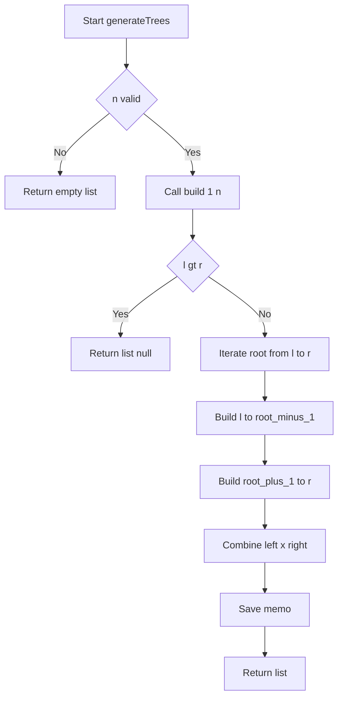
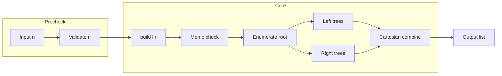
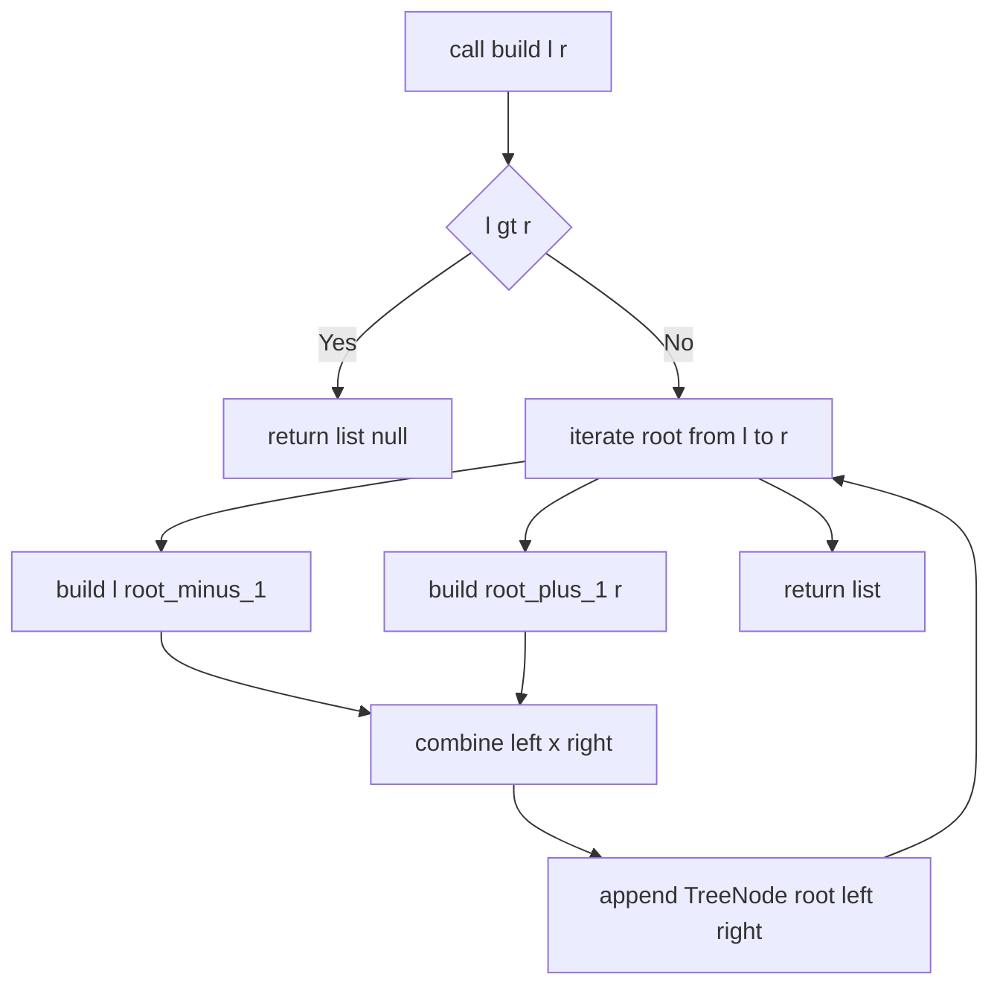
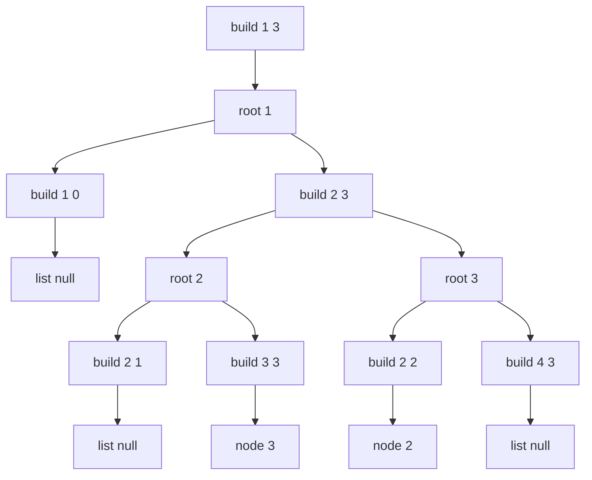
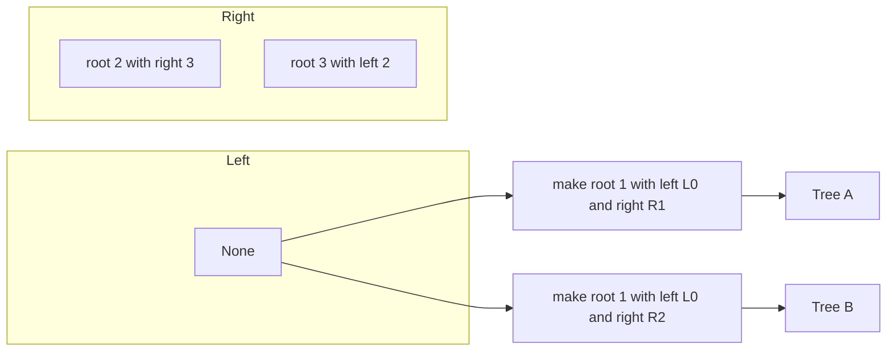
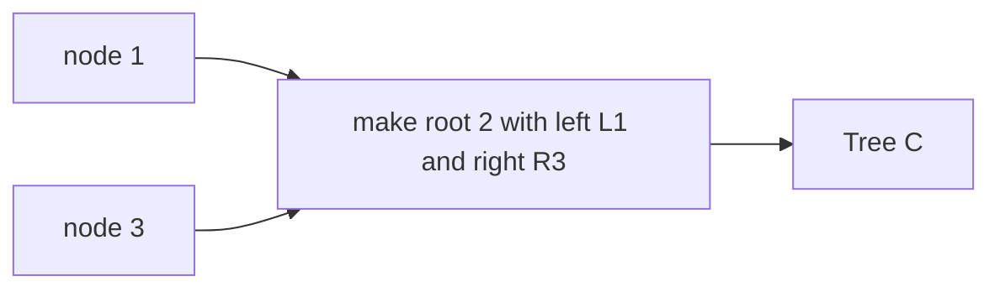
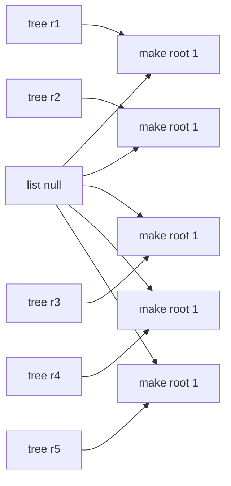
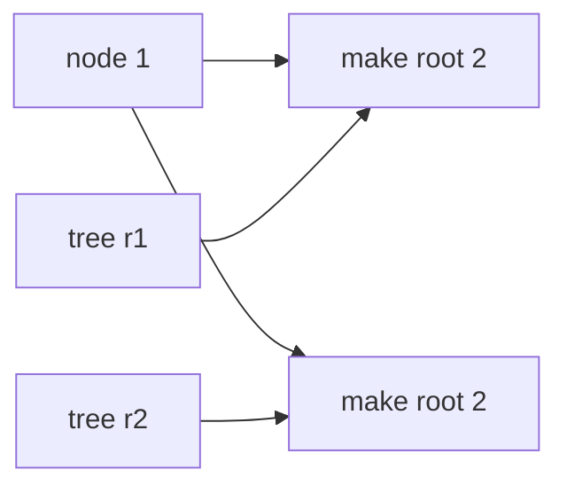
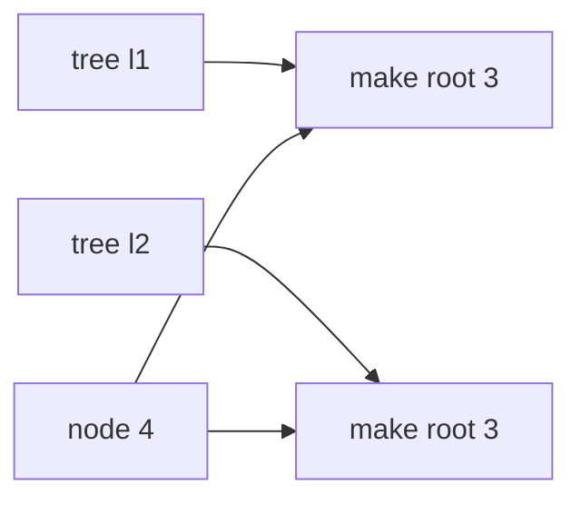
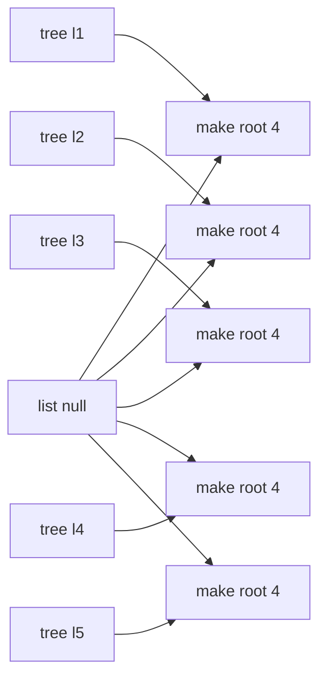

# Unique Binary Search Trees II - 分割統治と区間メモで全列挙

---

## Table of Contents

- [概要](#overview)
- [アルゴリズム要点（TL;DR）](#tldr)
- [図解](#figures)
- [正しさのスケッチ](#correctness)
- [計算量](#complexity)
- [Python 実装](#impl)
- [CPython 最適化ポイント](#cpython)
- [エッジケースと検証観点](#edgecases)
- [FAQ](#faq)

---

<h2 id="overview">概要</h2>

- **プラットフォーム/ID**: LeetCode 95
- **タイトル**: Unique Binary Search Trees II
- **要約**: `1..n` の **連続整数**を各ノード値に持つ **構造的に一意な BST** を **すべて生成**して返す。
- **入出力仕様（簡潔）**

  - 入力: `n: int`
  - 出力: `List[Optional[TreeNode]]`（各要素は 1 本の BST の根。空木は `None`）

- **データ構造**: `TreeNode`（二分木）
- **代表例**

  - `n=3` → `5` 本
  - `n=1` → `1` 本

- **関数シグネチャ（LeetCode 準拠）**

  ```python
  class Solution:
      def generateTrees(self, n: int) -> List[Optional[TreeNode]]:
          ...
  ```

- **要件**

  - 正当性: すべての構造（同型を 1 回のみ）を網羅
  - 制約: `1 <= n <= 8`（便宜上 `n==0` は空配列として扱うと自然）

---

<h2 id="tldr">アルゴリズム要点（TL;DR）</h2>

- **戦略**: 区間 `[l, r]` の再帰。根候補 `i` を全列挙し、左 `[l, i-1]` × 右 `[i+1, r]` の**直積**で合成。
- **メモ化**: 同一区間の再計算を避けるため **`lru_cache`** または辞書で区間をキャッシュ。
- **計算量**: 生成本数が **カタラン数 `C_n`**。時間は概ね **`O(C_n * n)`**、空間も **`O(C_n * n)`**（出力＋メモ）。
- **メモリ**: `TreeNode` を `__slots__` で軽量化（実行時の最小定義）。
- **純粋関数的**: 構築後の木は不変とし、部分木参照の共有で余分なコピーを避ける。

---

<h2 id="figures">図解</h2>

## **フローチャート（再帰と合成の流れ）**



_説明_: 区間 `[l, r]` が空なら `[None]` を返し、そうでなければ根候補を全走査。左右部分木の**全組合せ**で `TreeNode` を生成し、区間メモに保存。

## **データフロー（前処理 → コア → 出力）**



_説明_: `n` 検証後に `build(1, n)` を起点とした再帰で全列挙し、組合せ結果を最終的な配列として返す。

---

<h2 id="correctness">正しさのスケッチ</h2>

- **不変条件**: `build(l, r)` は **ちょうど** 区間 `[l, r]` の値を使う BST を **重複なく**全列挙する。
- **網羅性**: 各 `i in [l, r]` を根とすると、左は `[l, i-1]` の任意の BST、右は `[i+1, r]` の任意の BST。直積で **全構造**を生成。
- **重複排除**: 値の順序性と区間分割により、同じ構造が別の経路で生成されることはない。
- **基底条件**: `l > r` のとき空木（`None`）一通りのみ。再帰は必ず短い区間へ進む。
- **終了性**: 区間長が 0 で停止。`lru_cache` により DAG（有向非巡回）上の再帰に帰着。

---

<h2 id="complexity">計算量</h2>

- **時間**: `O(C_n * n)`（各根候補につき左右結果の直積合成。漸近支配は生成本数 `C_n`）
- **空間**: `O(C_n * n)`（生成した全ノードと区間メモ。呼び出しスタックは高々 `O(n)`）

> 参照共有（部分木をそのまま指す）により不要なディープコピーを避け、定数因子を削減。

---

<h2 id="impl">Python 実装</h2>

> 要件: **LeetCode class 形式**・pylance 互換の型注釈・`from __future__ import annotations`・必要最小の `TreeNode` フォールバックを同梱。

```python
from __future__ import annotations

from typing import Optional, List, Dict, Tuple, Set, Deque, Iterable, Final, TYPE_CHECKING
from functools import lru_cache

# LeetCode 実行環境では TreeNode が事前定義される。
# ローカル静的解析（pylance）に配慮しつつ、実行時フォールバックを提供。
if TYPE_CHECKING:
    class TreeNode:  # type: ignore[no-redef]
        val: int
        left: Optional["TreeNode"]
        right: Optional["TreeNode"]
        def __init__(self, val: int = 0,
                     left: Optional["TreeNode"] = None,
                     right: Optional["TreeNode"] = None) -> None: ...
else:
    try:
        TreeNode  # type: ignore[name-defined]
    except NameError:
        class TreeNode:  # minimal runtime fallback
            __slots__ = ("val", "left", "right")
            def __init__(self, val: int = 0,
                         left: Optional["TreeNode"] = None,
                         right: Optional["TreeNode"] = None) -> None:
                self.val = val
                self.left = left
                self.right = right


class Solution:
    """
    LeetCode 95: Unique Binary Search Trees II
    1..n の値で構造的に一意な BST を全列挙して返す。

    Time:   ~ O(C_n * n)
    Space:  ~ O(C_n * n)  # 出力＋メモ
    """

    def generateTrees(self, n: int) -> List[Optional[TreeNode]]:
        """
        再帰分割 + 区間メモ（lru_cache）で全列挙。

        Args:
            n: 範囲上限（1..n の連続整数を使用）
        Returns:
            構造的に一意な BST の根ノード配列

        備考:
            - n == 0 の場合は互換性のため空配列を返す。
            - 返却木は不変前提。部分木参照を共有しても安全。
        """
        if n == 0:
            return []

        @lru_cache(maxsize=None)
        def build(l: int, r: int) -> List[Optional[TreeNode]]:
            # 基底条件: 空区間は空木1通り（None）
            if l > r:
                return [None]

            out: List[Optional[TreeNode]] = []
            # 根候補を全列挙
            for root_val in range(l, r + 1):
                left_trees = build(l, root_val - 1)
                right_trees = build(root_val + 1, r)

                # 左×右の直積で合成
                for lt in left_trees:
                    for rt in right_trees:
                        out.append(TreeNode(root_val, lt, rt))
            return out

        return build(1, n)
```

## **主要コメント**

- **基底条件**: `l > r` → `[None]` を返す。
- **遷移**: `root_val` を根に、`build(l, root_val-1)` と `build(root_val+1, r)` を直積合成。
- **枝刈り**: 連続値の BST 性より、区間分割が全探索の重複を除去。
- **不変条件**: `build(l, r)` は区間の値のみを使う BST を重複なく列挙。

---

<h2 id="cpython">CPython最適化ポイント</h2>

- **`lru_cache`**: 同一区間 `[l, r]` の再帰結果をキャッシュし、指数的再計算を回避。
- **`__slots__`**: フォールバック `TreeNode` を軽量化し、属性辞書コストを削減。
- **局所変数利用**: ループ内で関数参照・属性アクセスを最小化（ここでは読みやすさ優先で必要十分）。
- **イミュータブル設計**: 返却後の木を変更しない前提で参照共有し、コピーや再構築を回避。

---

<h2 id="edgecases">エッジケースと検証観点</h2>

- **最小**: `n=1` → 1 本のみ（根値 1、左右 `None`）。
- **典型**: `n=3` → 5 本（手計算と一致）。
- **上限**: `n=8` → 143 本（件数のみ確認でも有益）。
- **防御的**: `n=0` → `[]`（問題外だが自然な拡張）。
- **一意性**: 直積合成で同型重複が生じないことを確認。
- **木の健全性**: すべて BST 条件を満たす（左 < 根 < 右 の区間分割による帰納）。

---

<h2 id="faq">FAQ</h2>

- **Q. 生成木が多くてメモリが心配**
  A. 生成本数 `C_n` は問題固有の下限。`n<=8` では現実的。`__slots__` や参照共有で定数因子を抑える。
- **Q. `deepcopy` は不要?**
  A. はい。不変前提なので **部分木参照の共有**で十分。LeetCode の検証は破壊的変更をしない。
- **Q. メモ化は辞書と `lru_cache` のどちらが良い?**
  A. 本問題ではどちらも同等。`lru_cache` は簡潔で安全、辞書は柔軟。好みと周辺要件で選んでよい。
- **Q. `n=0` の扱いは?**
  A. 仕様外だが、実務では空配列を返すのが直感的で安全。ここでもそう実装している。

---

## def build(l: int, r: int)での処理

`build(l, r)` は「区間 `[l, r]` を使って作れる BST を**すべて**列挙する再帰関数」で、**根にできる値 `root_val` を `l..r` から順に選び**、そのたびに

- 左部分木 = `build(l, root_val-1)` が返す**全パターン**
- 右部分木 = `build(root_val+1, r)` が返す**全パターン**

の **直積（全組合せ）** を取り、`TreeNode(root_val, left, right)` を**全部 push**して返します。
`l > r` のときは「空の部分木 1 通り」を意味する `[None]` を返すのが基底条件です。

下で、**フローチャート → n=3 の具体的な展開 → 直積の合成図 → 最終 5 本の木の絵**の順で、視覚的に噛み砕きます。

---

## 1) build の流れ（全体像）



## **ポイント**

- `l > r` なら `[None]` を返す（空木は 1 通り）。
- 各 `root_val` について **左の全通り × 右の全通り**を合成し、全部 `out` に追加。
- ループ終了後に `out` を返す＝その区間で作れる BST 全部。

---

## 2) 具体例 n=3 の展開（まず root=1 の枝を拡大）

最初に `build(1, 3)` を呼びます。`root=1` を選ぶと、左は `build(1, 0)`、右は `build(2, 3)` です。



## **読み解き**

- `build(1,0)` は空区間なので **`[None]`**。
- `build(2,3)` は 2 を根にすると左は空 `build(2,1)=[None]`、右は `build(3,3)=[TreeNode(3)]`。
  3 を根にすると左は `build(2,2)=[TreeNode(2)]`、右は空 `build(4,3)=[None]`。
- よって `build(2,3)` の結果は **2 通り**（`2→3`、`3←2`）。

---

## 3) 直積での合成イメージ（root=1 のとき）

左は `[None]`、右は 2 通り（`2→3` と `3←2`）。これを **左 × 右** の全組合せで合成します。



## **結果（root=1 から生まれる 2 本）**

- **Tree A**:

  ```text
  1
   \
    2
     \
      3
  ```

- **Tree B**:

  ```text
  1
   \
    3
   /
  2
  ```

---

## 4) root=2 と root=3 も同様

- **root=2** の場合：左は `build(1,1)=[1]`、右は `build(3,3)=[3]` → 直積は 1 通りのみ。



- **root=3** は root=1 と対称。左が 2 通り、右が `[None]` なので 2 本生まれます。

---

## 5) n=3 の最終 5 本（BFS 直感に近い並び）

1. `1, null, 2, null, 3`

   ```text
   1
    \
     2
      \
       3
   ```

2. `1, null, 3, 2`

   ```text
   1
    \
     3
    /
   2
   ```

3. `2, 1, 3`

   ```text
     2
    / \
   1   3
   ```

4. `3, 1, null, null, 2`

   ```text
   3

   /
   1

   2

   ```

5. `3, 2, null, 1`

   ```text
   3
   /
   2
   /
   1
   ```

---

## 6) まとめ（コードの該当部分の意味）

```python
for root_val in range(l, r + 1):
 left_trees = build(l, root_val - 1)
 right_trees = build(root_val + 1, r)
 for lt in left_trees:
     for rt in right_trees:
         out.append(TreeNode(root_val, lt, rt))
```

- `root_val` を根にする場合の **左の全通り**と**右の全通り**を取得。
- **二重ループ**で **直積**を取り、`TreeNode(root_val, lt, rt)` をすべて `out` に追加。
- これを `root_val = l..r` で繰り返すと、その区間で作れる BST を**重複なく網羅**できます。
- `l > r` のとき `[None]` を返すことで、**空部分木**を「1 通り」として正しく合成できます（葉や片側だけの枝も自然に生成可能）。

## n=4 の場合

`n=4` でも同様に「各 root ごとの左 × 右」を描くと、カタラン増加の直感がさらに掴みやすいです。
`n=4` のときの **「各 root ごとの 左 × 右 の直積」**を、Mermaid の **graph LR** で 4 つに分けて描きます。
すべて **テンプレの厳守ルール**（ヘッダ単独行、1 行 1 エッジ、英語ラベル、行頭コメント、`-->`、括弧禁止、ID は英数とアンダースコア）で記述しています。

---

## Root = 1 の枝（Left は空一通り、Right は 5 通り）



## **R1..R5 の意味（右部分木 2..4 の 5 通り）**

- R1: 2 r 3 r 4
- R2: 2 r 4 with left 3
- R3: 3 with left 2 right 4
- R4: 4 l 3 l 2
- R5: 4 l 2 r 3

> 左は list null のみなので **1 × 5 = 5 本**。

---

## Root = 2 の枝（Left は 1 通り、Right は 2 通り）



## **右部分木 3..4 の 2 通り**

- R1: 3 r 4
- R2: 4 l 3

> 左が 1 通り、右が 2 通りなので **1 × 2 = 2 本**。

---

## Root = 3 の枝（Left は 2 通り、Right は 1 通り）



## **左部分木 1..2 の 2 通り**

- L1: 1 r 2
- L2: 2 l 1

> 左が 2 通り、右が 1 通りなので **2 × 1 = 2 本**。

---

## Root = 4 の枝（Left は 5 通り、Right は空一通り）



## **L1..L5 の意味（左部分木 1..3 の 5 通り）**

- L1: 1 r 2 r 3
- L2: 1 r 3 with left 2
- L3: 2 with left 1 right 3
- L4: 3 l 2 l 1
- L5: 3 l 1 r 2

> 右は list null のみなので **5 × 1 = 5 本**。

---

## 合計本数の確認

- root 1 から 5 本
- root 2 から 2 本
- root 3 から 2 本
- root 4 から 5 本

**合計 14 本**（カタラン数 C4 = 14）で、`generateTrees(4)` の戻り配列の要素数と一致します。

---

### 補足　（mermaid）修正点

- ノードラベルはすべて **英語**かつ **括弧なし**に統一しています。
- `list null` は空部分木 1 通りを表す記号的表現です。
- `A r B` は A の右に B、`A l B` は A の左に B の意図です。
- `make root k` は選んだ左と右を根値 `k` に接続して 1 本の BST を作ることを表します。

エラーの原因は **Mermaid の文法違反**が混ざっているためです。主にこの 2 点が致命傷になっています。

1. **行内コメント `%% ...` をノード宣言の末尾に置いた**
   　 → Mermaid はコメントを **行頭**に置くのが安全です（行末のコメントはパース失敗の原因になりがち）。

2. **エッジ記法のミス**
   　 → 矢印は `-->`（ハイフン 2 本）を使います。`->` は不可。

あわせて、以下を守ると安定します。

- ヘッダ行は単独行：`flowchart TD` の行にノードやエッジを書かない
- **1 行に 1 宣言 or 1 エッジ**
- ノード ID は英数字とアンダースコアのみ（例：`R23_2`）
- ラベルに括弧 `()` を使わない（Mermaid が壊れやすい）

---

## 修正版：ご指摘の「root=1 の枝」の展開図

下は **build(1,3)** を呼び、**root=1** を選んだときの再帰分解を、文法エラーの起きない形で表したフローチャートです。
（コメントは別行に置き、エッジは `-->`、1 行 1 エッジ・1 宣言を守っています）


## **読み方（対応づけ）**

- `Lret[list null]` は **空区間の戻り値 `[None]`** を表します（＝空部分木は 1 通り）。
- `R33ret[node 3]` は **単一ノード 3 の木**（`build(3,3)`の結果）。
- `R23` を **root=2** と **root=3** の 2 分岐に割り、さらにそれぞれの左・右区間を再帰しています。

この図の意味をコードに対応させると：

```python
# root_val = 1
left_trees  = build(1, 0)  # -> [None]
right_trees = build(2, 3)  # -> 2通り（root=2 の木 と root=3 の木）

# 直積で合成（左×右）
for lt in left_trees:      # lt は None のみ
    for rt in right_trees: # rt は 2通り
        out.append(TreeNode(1, lt, rt))
# => root=1 から 2 本が生成
```

---

## よくあるハマりどころ（今回のエラー再発防止チェック）

- `flowchart TD` の行にノードやエッジを書かない（**ヘッダ行は単独**）
- **インラインコメントを置かない**：`A --> B  %% コメント` は壊れやすい → `%% コメント` を**別行**にする
- 矢印は **`-->`**、`->` は使わない
- **1 行に 1 エッジ**、複数書くなら `;` で区切る（今回は 1 行 1 エッジで統一）
- ノード ID にスペース・記号を入れない（`R23_2` のようにする）
- ラベル内に括弧を使わない（`node 3` のようにシンプルに）

この修正版をコピペしていただければ、パースエラーは解消されるはずです。必要なら **root=2 / root=3** それぞれ単独の合成図（左 × 右の直積）も描きます！
