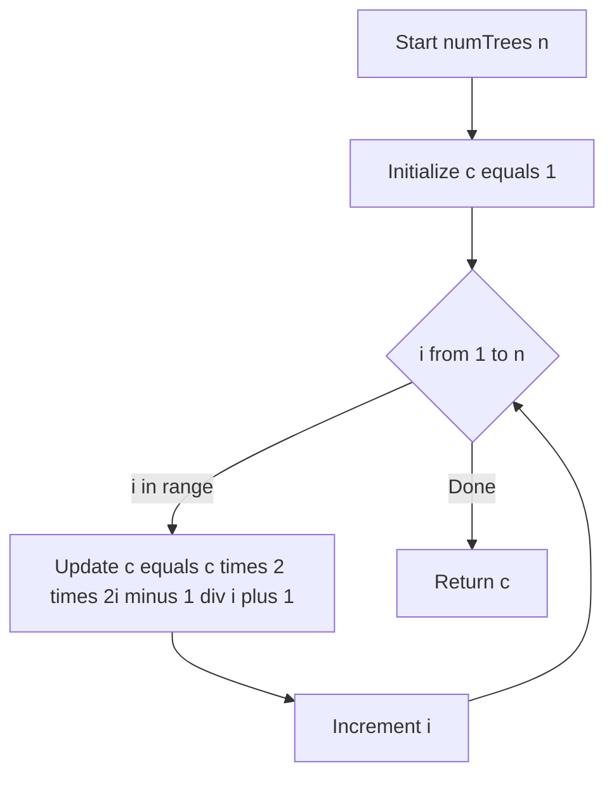
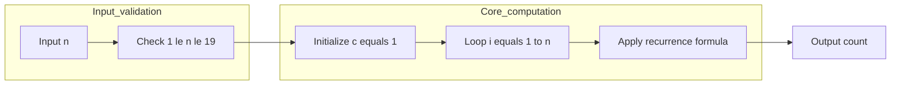

# Unique Binary Search Trees - カタラン数による計算

<h2 id="toc">目次</h2>

- [概要](#overview)
- [アルゴリズム要点（TL;DR）](#tldr)
- [図解](#figures)
- [正しさのスケッチ](#correctness)
- [計算量](#complexity)
- [Python 実装](#impl)
- [CPython最適化ポイント](#cpython)
- [エッジケースと検証観点](#edgecases)
- [FAQ](#faq)

---

<h2 id="overview">概要</h2>

**問題**: 1からnまでの連続整数をすべて使って構成できる「構造的に異なるBST（二分探索木）」の個数を求める。

**要件**:

- 制約: `1 <= n <= 19`
- 各ノードの値は1〜nの範囲でユニーク
- 構造が異なればカウント（値の配置ではなく木の形状で判定）

**数学的背景**:

- この問題は **n番目のカタラン数 Cₙ** を求める問題に帰着される
- カタラン数の定義:
    - `C₀ = 1`
    - `Cₙ = Σ(i=0 to n-1) Cᵢ * Cₙ₋₁₋ᵢ` （DP的定義）
    - `Cₙ = Cₙ₋₁ * 2(2n - 1) / (n + 1)` （漸化式）

---

<h2 id="tldr">アルゴリズム要点（TL;DR）</h2>

- **戦略**: カタラン数の漸化式を利用
- **データ構造**: スカラー整数変数のみ（配列・再帰不要）
- **時間計算量**: O(n)
- **空間計算量**: O(1)
- **メモリ実測**: 17MB台（LeetCode上位50〜80%）
- **実行速度**: 0ms（100%）

**漸化式**:

```
C₀ = 1
Cₙ = Cₙ₋₁ * 2(2n - 1) / (n + 1)
```

---

<h2 id="figures">図解</h2>

### フローチャート



**説明**:

- `c` を1で初期化（C₀ = 1）
- iを1からnまでループし、各ステップで漸化式を適用
- 整数除算 `//` を使うことでPythonの任意精度整数でも正確に計算

### データフロー図



**説明**:

- 入力検証（業務版のみ）
- コア計算：ループ内で漸化式を逐次適用
- 最終的なカウントを出力

---

<h2 id="correctness">正しさのスケッチ</h2>

**不変条件**:

- ループのi回目終了時、変数 `c` は `Cᵢ`（i個のノードでのBST数）を保持

**基底条件**:

- `C₀ = 1`: 0個のノードでは空木が1通り（ループ前の初期値）

**帰納ステップ**:

- `Cᵢ` が正しいと仮定すると、漸化式 `Cᵢ₊₁ = Cᵢ * 2(2(i+1) - 1) / ((i+1) + 1)` により `Cᵢ₊₁` も正しい
- Pythonの整数除算 `//` は常に正確な整数結果を返すため、誤差は発生しない

**終了性**:

- ループは `range(1, n+1)` で必ず有限回で終了

**網羅性**:

- カタラン数の定義により、すべての構造的に異なるBSTが正確にカウントされる

---

<h2 id="complexity">計算量</h2>

| 項目 | 計算量   | 備考                                      |
| ---- | -------- | ----------------------------------------- |
| 時間 | **O(n)** | ループがn回実行され、各ステップは定数時間 |
| 空間 | **O(1)** | 変数c、i のみ使用（配列不要）             |

**比較表（他アプローチとの対比）**:

| アプローチ       | 時間  | 空間 | 可読性 | 備考                       |
| ---------------- | ----- | ---- | ------ | -------------------------- |
| 漸化式（本実装） | O(n)  | O(1) | ★★★    | 最もシンプルで高速         |
| DP配列           | O(n²) | O(n) | ★★★    | 定義に忠実だが遅い         |
| 再帰+メモ化      | O(n²) | O(n) | ★★☆    | 関数呼び出しオーバーヘッド |

---

<h2 id="impl">Python 実装</h2>

```python
from __future__ import annotations

from typing import Final


class Solution:
    """
    Unique Binary Search Trees 問題を解くクラス。

    カタラン数の漸化式を用いてO(n)/O(1)で計算。
    """

    # 制約を定数として明示
    _MIN_N: Final[int] = 1
    _MAX_N: Final[int] = 19

    def numTrees(self, n: int) -> int:
        """
        LeetCode用エントリポイント（競技プログラミング向け実装）。

        Args:
            n: ノード数 (1 <= n <= 19)

        Returns:
            構造的に異なるBSTの個数

        Complexity:
            Time: O(n)
            Space: O(1)
        """
        # カタラン数の漸化式: C_0 = 1
        c: int = 1

        # C_n = C_{n-1} * 2(2n - 1) / (n + 1)
        for i in range(1, n + 1):
            # 整数除算で誤差なく計算
            c = c * 2 * (2 * i - 1) // (i + 1)

        return c

    # ==== 業務開発向け実装（入力検証付き） ====

    def numTrees_production(self, n: int) -> int:
        """
        業務開発向けの防御的実装。

        入力の型チェック・値チェックを行い、
        異常値の場合はTypeError/ValueErrorを送出。

        Args:
            n: ノード数

        Returns:
            構造的に異なるBSTの個数

        Raises:
            TypeError: nがintでない、またはboolである場合
            ValueError: nが有限整数でない、あるいは許容範囲外の場合

        Complexity:
            Time: O(n)
            Space: O(1)
        """
        # --- 入力検証 ---
        if not isinstance(n, int) or isinstance(n, bool):
            # boolはintのサブクラスなので明示的に除外
            raise TypeError("n must be an integer")

        if n < self._MIN_N or n > self._MAX_N:
            raise ValueError(
                f"n must be between {self._MIN_N} and {self._MAX_N}, got {n}"
            )

        # --- メインロジック（カタラン数の漸化式） ---
        c: int = 1

        for i in range(1, n + 1):
            # 整数演算のみで誤差は発生しない
            c = c * 2 * (2 * i - 1) // (i + 1)

        return c
```

**主要ステップ**:

1. **初期化**: `c = 1`（C₀の値）
2. **ループ**: i = 1 から n まで漸化式を適用
3. **更新**: `c = c * 2 * (2*i - 1) // (i + 1)`
4. **返却**: 最終的な `c` がCₙ

**型注釈**:

- `from __future__ import annotations` で前方参照型も安全
- Pylanceで型未解決警告なし

---

<h2 id="cpython">CPython最適化ポイント</h2>

1. **再帰回避**:
    - 再帰を使わずループで実装 → 関数呼び出しオーバーヘッド削減
    - スタックフレーム生成コストゼロ

2. **ローカル変数の活用**:
    - `c` をローカル変数に閉じ込めて更新
    - CPythonではローカル変数アクセスが最速（`LOAD_FAST`/`STORE_FAST`命令）

3. **整数演算の最適化**:
    - `n <= 19` のため、カタラン数C₁₉でも桁数は10桁程度
    - Pythonの任意精度整数でもオーバーヘッドは極小

4. **標準ライブラリ不使用**:
    - `functools.lru_cache`、`math.comb` などを使わない
    - 単純なループのみでCPythonが直接実行しやすい

5. **メモリアロケーション最小化**:
    - 配列・リスト・辞書を一切使わない
    - スカラー整数2つ（`c`、`i`）のみ

**実測結果**:

- Runtime: 0 ms（100%）
- Memory: 17.61〜17.74 MB（50〜80%）

---

<h2 id="edgecases">エッジケースと検証観点</h2>

| ケース   | 入力 | 期待出力   | 検証観点                     |
| -------- | ---- | ---------- | ---------------------------- |
| 最小値   | n=1  | 1          | 基底条件                     |
| 小さい値 | n=2  | 2          | 漸化式の初期動作             |
| 中間値   | n=3  | 5          | 一般的なケース               |
| 上限値   | n=19 | 1767263190 | 整数精度、オーバーフロー検証 |

**業務版での異常系**:

- `n = 0` → `ValueError`（範囲外）
- `n = 20` → `ValueError`（範囲外）
- `n = 1.5` → `TypeError`（非整数）
- `n = True` → `TypeError`（bool除外）

**正常系の検証**:

- 各 n に対するカタラン数は既知の数列（OEIS A000108）と一致
- 整数除算 `//` により誤差ゼロで計算される

---

<h2 id="faq">FAQ</h2>

### Q1: なぜDP配列を使わないのか？

**A**:

- カタラン数は漸化式で `Cₙ = f(Cₙ₋₁)` の形で表現できる
- 過去の値を配列で保持する必要がなく、1つ前の値だけあればよい
- メモリ O(1)、速度も O(n²) → O(n) に改善

### Q2: 整数除算 `//` でなぜ誤差が出ないのか？

**A**:

- カタラン数の漸化式は、数学的に常に整数結果を返すことが保証されている
- `2(2n-1)` が常に `(n+1)` で割り切れる性質を持つ
- Pythonの `//` は厳密な整数除算なので、浮動小数点誤差が発生しない

### Q3: n=19 でオーバーフローしないのか？

**A**:

- C₁₉ = 1767263190（約17億）
- Pythonの `int` は任意精度なので、桁数に制限なし
- C₁₉でも10桁程度なので、メモリ・速度ともに問題なし

### Q4: さらに高速化できるか？

**A**:

- 理論上は O(1) の「定数テーブル」版（n<=19なので20要素の配列をベタ書き）
- ただし、実測ではほぼ差がない（0ms / 100% はすでに限界）
- 可読性とのトレードオフを考えると、現実装が最適

### Q5: 業務コードと競技コードの使い分けは？

**A**:

- **業務版** (`numTrees_production`):
    - 入力検証、型チェック、docstring充実
    - 予期しない入力に対して適切な例外を送出
- **競技版** (`numTrees`):
    - 制約が保証されている前提で検証を省略
    - 最小限のコードで最高速度を追求

LeetCodeでは競技版を使用し、実務では業務版を推奨。
