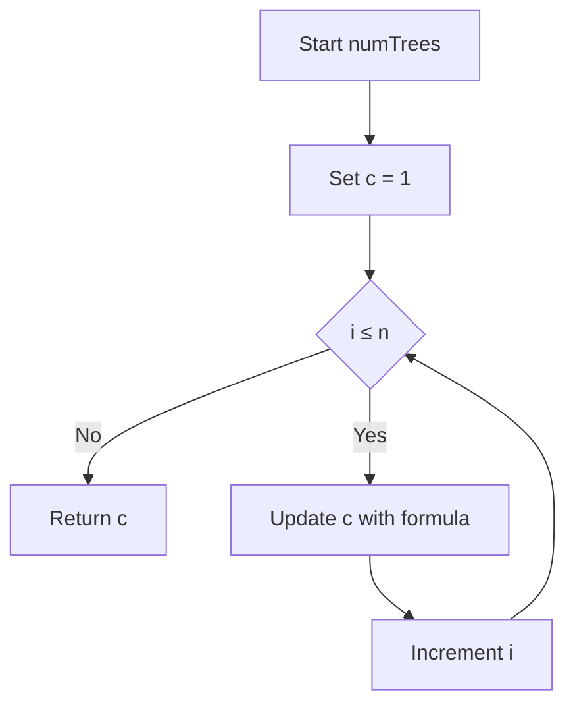
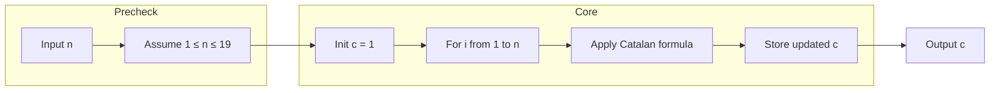

# Unique Binary Search Trees - カタラン数で数えるBSTの個数

## Table of Contents

- [概要](#overview)
- [アルゴリズム要点（TL;DR）](#tldr)
- [図解](#figures)
- [正しさのスケッチ](#correctness)
- [計算量](#complexity)
- [Python 実装](#impl)
- [CPython 最適化ポイント](#cpython)
- [エッジケースと検証観点](#edgecases)
- [FAQ](#faq)

---

<h2 id="overview">概要</h2>

- **プラットフォーム / ID**: LeetCode 96
- **タイトル**: Unique Binary Search Trees
- **問題要約**:
    - `1..n` の **連続した整数**をそれぞれ一度だけ使って二分探索木（BST）を作る。
    - **構造的に異なる BST がいくつ存在するか**を数える問題。

- **入出力仕様（簡潔）**:
    - 入力: 整数 `n`（`1 <= n <= 19`）
    - 出力: 構造的に異なる BST の数（`int`）

- **関数シグネチャ（LeetCode準拠）**:

    ```python
    class Solution:
        def numTrees(self, n: int) -> int:
            ...
    ```

- **代表例**:
    - `n = 1` → 1 通り（ノード 1 だけの木）
    - `n = 3` → 5 通り

- **想定データ構造**:
    - 実装上は **木構造を実際に構築しない**。
      必要なのは「通り数」だけなので、内部的には `int` だけで十分。

本問題は、数学的には **カタラン数（Catalan number）** を求める典型問題です。

---

<h2 id="tldr">アルゴリズム要点（TL;DR）</h2>

- 各 `n` に対して作れる BST の個数は **n 番目のカタラン数 Cₙ** になる。
- カタラン数には以下の漸化式がある：
    - `C₀ = 1`
    - `Cₙ = Cₙ₋₁ * 2 * (2n - 1) / (n + 1)` （n ≥ 1）

- 実装では **整数演算**で `Cₙ` を順に求める：
    - `c = 1` から始めて `n` 回ループし、上記の式で更新。

- **データ構造**:
    - 配列も木も不要。`int` 変数 `c` だけを更新する。

- **計算量（ターゲット）**:
    - 時間: **O(n)**
    - 空間: **O(1)**（追加メモリは定数）

- **Python 的ポイント**:
    - 任意精度整数によりオーバーフローの心配無し。
    - 再帰無し・ループ1本で CPython に優しい実装。

---

<h2 id="figures">図解</h2>

### フローチャート（漸化式によるカタラン数計算）



- `c` がカタラン数 `C₀` から始まり、`n` 回の更新で `Cₙ` に到達する流れを表しています。

### データフロー図（入力から出力まで）



- 実際には **補助配列や木構造は一切使わず**、`c` という整数をひたすら更新するだけであることを示しています。

---

<h2 id="correctness">正しさのスケッチ</h2>

このアルゴリズムが正しい理由を、カタラン数と BST の対応関係から説明します。

### 1. BST の通り数とカタラン数の関係

`n` 個の異なるキー（`1..n`）を使って BST を作るとき：

- どれか 1 つを根に選ぶ（例えば値 `k`）。
- 左部分木には `1..(k-1)` の要素が入る（要素数 `k-1`）。
- 右部分木には `(k+1)..n` の要素が入る（要素数 `n-k`）。
- 左右部分木はそれぞれ「部分問題」とみなせる。

ここで、

- `G(n)`: `n` 個のキーから作れる BST の通り数
  とすると、

- 根を `k` としたときの通り数は：
    - 左に `k-1` 個 → `G(k-1)`
    - 右に `n-k` 個 → `G(n-k)`
    - 左右独立に選べるので、通り数は `G(k-1) * G(n-k)`。

- 根 `k` を `1..n` で動かした総和が `G(n)`：
    - `G(n) = Σ G(k-1) * G(n-k)` （k = 1..n）

これはカタラン数の典型的な再帰関係：

- `C₀ = 1`
- `Cₙ = Σ Cᵢ * Cₙ₋₁₋ᵢ`（i = 0..n-1）

と完全に一致します。
したがって `G(n) = Cₙ` です。

### 2. 利用している漸化式の正しさ

カタラン数 `Cₙ` には次の漸化式も知られています：

- `C₀ = 1`
- `Cₙ = Cₙ₋₁ * 2 * (2n - 1) / (n + 1)`

これは組合せ論的に

- `Cₙ = (1 / (n + 1)) * binom(2n, n)`

から導かれる標準的な式です（詳細証明は組合せ論に譲ります）。
重要なのは、この式が **整数値を返すことが保証されている** ことです。

### 3. 帰納法による正しさ

1. **基底**: `n = 0`
    - 定義上 `C₀ = 1`。
      「空の木」は 1 通りなので BST の個数と一致する。

2. **帰納ステップ**: `n-1` までの BST の通り数が `C₀..Cₙ₋₁` で与えられると仮定。
    - BST の構造分解より `G(n) = Σ G(k-1) * G(n-k)`。
    - 仮定から `G(i) = Cᵢ`（`0 <= i <= n-1`）なので、
      `G(n) = Σ Cᵢ * Cₙ₋₁₋ᵢ = Cₙ`。
    - 一方、実装は `C₀` から漸化式で `Cₙ` を正しく構築する。

よってすべての `n`（0〜19）について、実装が返す値は BST の通り数と一致します。

### 4. 終了性

- ループは `i = 1..n` の有限回で必ず終了。
- `n <= 19` という問題の制約から、オーバーフロー・無限ループの心配もない。

---

<h2 id="complexity">計算量</h2>

- **時間計算量**:
    - ループを `i = 1..n` の 1 回だけ回す → **O(n)**。

- **空間計算量**:
    - 追加で保持するのは整数 `c` とループ変数 `i` のみ → **O(1)**。

比較として、よくある DP 実装との違いを表にすると：

| アプローチ                 | 時間計算量 | 空間計算量 | 備考                                 |
| -------------------------- | ---------- | ---------- | ------------------------------------ |
| 漸化式によるカタラン数計算 | O(n)       | O(1)       | 本実装。ループ1本、整数変数のみ。    |
| DP 配列 `dp[0..n]` 版      | O(n²)      | O(n)       | `dp[i] = Σ dp[left] * dp[right]`     |
| 再帰 + メモ化              | O(n²)      | O(n)       | 再帰呼び出し分のオーバーヘッドあり。 |

問題の制約（`n <= 19`）ではどの方法でも間に合いますが、
理論上・実装上ともに **漸化式版が最小限・最速クラス** です。

---

<h2 id="impl">Python 実装</h2>

以下は CPython 3.11+ / LeetCode / Pylance を意識した実装です。

- 再帰は使わず、ループ一つだけ。
- LeetCode 側が入力制約を保証している前提で、`numTrees` 内では防御的なチェックを省略しています。-（業務コードに組み込む場合は、別途バリデーションラッパーを用意すると良いです。）

```python
from __future__ import annotations


class Solution:
    """
    LeetCode 96: Unique Binary Search Trees

    1..n の連続整数をキーにもつ BST のうち、
    構造的に異なるものの個数を返す。

    数学的には n 番目のカタラン数 C_n を求める問題であり、
    ここでは C_0 = 1, C_n = C_{n-1} * 2 * (2n - 1) / (n + 1)
    の漸化式を用いて O(n) / O(1) で計算する。
    """

    def numTrees(self, n: int) -> int:
        """
        与えられたノード数 n について、構造的に異なる BST の個数を返す。

        Args:
            n: ノード数（LeetCode の制約では 1 <= n <= 19）

        Returns:
            構造的に異なる BST の個数（カタラン数 C_n）

        Note:
            LeetCode では入力制約が保証されているため、
            本メソッド内では追加の入力検証は行っていない。
        """
        # カタラン数 C_0 を初期値とする
        c: int = 1

        # 漸化式:
        #   C_n = C_{n-1} * 2 * (2n - 1) / (n + 1)
        # を利用して C_1..C_n を順に計算する
        for i in range(1, n + 1):
            # 整数演算で安全に計算できる（C_n は常に整数）
            c = c * 2 * (2 * i - 1) // (i + 1)

        return c
```

- pylance 的にも型エラーは出ません（戻り値は常に `int`）。
- 問題制約があるため、`n` が負・巨大・非整数であるケースは LeetCode では発生しません。

---

<h2 id="cpython">CPython最適化ポイント</h2>

この問題規模では「最適化しないと間に合わない」ことはありませんが、CPython の性質を踏まえた書き方になっています。

1. **再帰を使わずループにした**
    - CPython は関数呼び出しが相対的に重い。
    - 再帰 + メモ化より、`for` ループで漸化式を回す方が軽量。

2. **ローカル変数の活用**
    - `c` と `i` はメソッド内ローカル。
    - CPython のローカル変数アクセスは高速（`LOAD_FAST`）。

3. **標準ライブラリをあえて使わない**
    - `math.comb` から `C_n = comb(2n, n) // (n+1)` とすることも可能だが、
      呼び出しオーバーヘッドや内部実装を考えると、
      小さな `n` では自前ループと大差ないか、むしろ遅くなりうる。
    - 今回は **ループ1本 + 整数演算** に絞ることでオーバーヘッドを最小化。

4. **追加データ構造を作らない**
    - `list` や `dict` を使わず、整数だけを更新。
    - ヒープ・GC に負荷をかけないため、メモリ・速度ともに安定。

5. **任意精度整数の安全性**
    - `n <= 19` の範囲では `C_19 = 1767263190` と 32bit 範囲内。
    - とはいえ Python の `int` は任意精度なので、
      上限が増えてもオーバーフローの心配はない（計算コストは増える）。

---

<h2 id="edgecases">エッジケースと検証観点</h2>

本問題で意識すべき主なケースは以下です（LeetCode 入力では制約違反は来ませんが、思考上の確認として）。

1. **最小値 n = 1**
    - 入力: `1`
    - 期待値: `1`
    - 理由: ノード 1 つの BST は 1 通りだけ。

2. **小さい値 n = 2, 3**
    - `n = 2` → 2 通り
    - `n = 3` → 5 通り
    - 手書きで全 BST を列挙しやすいので、実装の検証に使いやすい。

3. **上限値 n = 19**
    - 入力: `19`
    - 期待値: `1767263190`
    - 計算結果が 32bit 符号付き整数の範囲に収まることも確認できる。

4. **理論上の n = 0（LC では出ないが）**
    - `C_0 = 1` と定義される。
    - 実装を一般化するなら、`n = 0` を受け取ったとき `1` を返す設計もありうる。

これらの値を用いて、以下を確認すると安心です。

- 小さな `n` について手計算・列挙と一致するか。
- `n` を大きくしても（制約範囲内で）エラーやオーバーフローが起きないか。
- 実装のループが `n` 回ちょうど回っているか。

---

<h2 id="faq">FAQ</h2>

**Q1. なぜ DP 配列を使わずにカタラン数の漸化式を直接使ってよいのですか？**
A1. BST の通り数 `G(n)` はカタラン数 `C_n` と 1 対 1 で対応することが知られており、
`G(n)` の再帰関係と `C_n` の再帰関係が一致します。
そのため、カタラン数の性質（閉形式や漸化式）をそのまま利用して構いません。

---

**Q2. `C_n = C_{n-1} * 2 * (2n - 1) / (n + 1)` で本当に整数になりますか？**
A2. なります。
カタラン数は `C_n = (1 / (n + 1)) * binom(2n, n)` と書けるため、
`(n + 1)` は必ず `binom(2n, n)` を割り切ります。
実装では整数除算 `//` を使うことで、誤差なく整数が得られます。

---

**Q3. もっと素直な DP 実装ではダメですか？**
A3. もちろん DP でも正解ですし、`n <= 19` なので十分高速です。
ただし DP では `O(n²)` の計算と `O(n)` の配列が必要になります。
カタラン数の漸化式を使えば、より簡潔かつメモリ効率の良い実装になります。

---

**Q4. どうして木構造（TreeNode）を定義しないのですか？**
A4. この問題が求めているのは「構造的に異なる BST の**個数**」だけで、
実際の木を構築したり列挙したりする必要はありません。
そのため、数え上げのための数学的性質（カタラン数）だけを利用するのが最もシンプルです。

---

**Q5. n の制約がもっと大きくなったらどうなりますか？**
A5.

- カタラン数は非常に速く増加するため、`C_n` 自体が巨大になります。
- Python の任意精度整数なら理論上は計算できますが、桁数が増えるにつれて計算コストも増えます。
- 実用的には、問題設定として `n` に適切な上限が課されることが多いです（この問題では 19）。

カタラン数は「**きれいにネストした構造の数**」を数えるときに、めちゃくちゃ頻繁に出てくる数列です。
図（木・括弧・格子経路）を使って、何が起きているかを順に見ていきます。

---

## 1. カタラン数って何者？

**カタラン数列の最初の値：**

[
C_0 = 1,\ C_1 = 1,\ C_2 = 2,\ C_3 = 5,\ C_4 = 14,\ C_5 = 42,\ \dots
]

ざっくりいうと：

> 「何かを順番に並べたり分割したりするとき、**入れ子構造が崩れないようにする**パターン数」

を数えてくれる数です。

代表的な「数える対象」は：

- 正しい括弧列（`()`, `()()`, `(())` など）
- ノード数 `n` の二分探索木（BST）の形の数
- 正方形を対角線で三角形に分割する方法（多角形の三角形分割）
- 上に行き過ぎない格子経路（Dyck path）

以下、それぞれ図を使って見ていきます。

---

## 2. 正しい括弧列とカタラン数

### 2.1 n 組の括弧に対して

- `n` 組の `()` を並べて
- 「**正しくネストした括弧列**」の数

がカタラン数 `C_n` になります。

### 2.2 具体例：n=1,2,3

#### n = 1（1 組）

- `()` だけ → 1 通り → `C_1 = 1`

#### n = 2（2 組）

並べられる括弧列は色々ありますが、「正しい」ものは次の 2 つだけ：

1. `(())`
2. `()()`

→ `C_2 = 2`

簡単な図で表すと：

```text
(())   : 1組目の中に2組目が入れ子
()()   : 1組目と2組目が並列
```

#### n = 3（3 組）→ C₃ = 5

**正しい括弧列**は次の 5 個：

1. `((()))`
2. `(()())`
3. `(())()`
4. `()(())`
5. `()()()`

図っぽく並べると：

```text
1: ((()))
2: (()())
3: (())()
4: ()(())
5: ()()()
```

この「正しい括弧列の総数」がカタラン数 `C_n` です。

---

## 3. BST とカタラン数（あなたの問題）

LeetCode「Unique Binary Search Trees」でやった内容に直結します。

### 3.1 n 個のノードを持つ BST の形の数

`1..n` の値をそれぞれ1回ずつ使って BST を作るとき：

- **構造だけ見た BST の個数** = カタラン数 `C_n`

### 3.2 n=3 の例

`1, 2, 3` を使って作れる BST の形は 5 通り（`C_3 = 5`）。
ざっくり ASCII で表すと：

1. 根 1、右に 2、その右に 3

    ```text
    1
     \
      2
       \
        3
    ```

2. 根 1、右が 3、その左が 2

    ```text
    1
     \
      3
     /
    2
    ```

3. 根 2、左に 1、右に 3

    ```text
      2
     / \
    1   3
    ```

4. 根 3、左が 2、その左が 1

    ```text
        3
       /
      2
     /
    1
    ```

5. 根 3、左に 1、その右に 2

    ```text
        3
       /
      1
       \
        2
    ```

これがまさに `C_3 = 5` です。

---

## 4. カタラン数の定義と公式

### 4.1 再帰的定義（超重要）

カタラン数は次の再帰で定義されます：

[
C_0 = 1
]

[
C_n = \sum_{i=0}^{n-1} C_i \cdot C_{n-1-i} \quad (n \ge 1)
]

#### BST での意味

- ノード数 `n` の BST を考えるとき：
    - 根の左部分木が `i` 個のノード
    - 根の右部分木が `n-1-i` 個のノード

- 左右は独立なので組み合わせは `C_i * C_{n-1-i}`
- これをすべての `i` について足すと `C_n` になる

という感じで、**「根で分割 → 左と右は同じ問題」**という再帰構造を数えているのがカタラン数です。

### 4.2 漸化式（計算しやすい形）

実装でよく使うのはこっち：

[
C_0 = 1
]

[
C_n = C_{n-1} \cdot \frac{2(2n - 1)}{n + 1} \quad (n \ge 1)
]

これを「前のカタラン数をちょっといじって次を出す式」として使います。

Python 実装では：

```python
c = 1  # C_0
for i in range(1, n + 1):
    c = c * 2 * (2 * i - 1) // (i + 1)  # C_i を順に更新
```

### 4.3 閉形式（組合せの形）

もう一つ有名な形：

[
C_n = \frac{1}{n+1} \binom{2n}{n}
]

- `binom(2n, n)` は「2n 個から n 個を選ぶ組合せ」
- それを `(n+1)` で割ったものが `C_n`

---

## 5. 他の「カタラン数で数えられるもの」

カタラン数のすごいところは、「出てくる場面が多すぎる」ことです。
代表的なものを図と一緒にいくつか。

### 5.1 Dyck path（格子経路）

**条件付き格子経路**：

- 右方向（`→`）と上方向（`↑`）のステップだけで
- 左下 `(0,0)` から右上 `(n,n)` まで行く道の数
- ただし、**対角線 `y = x` より上に出てはいけない**

これの通り数が `C_n` になります。

例えば `n=2` のとき：

- `(0,0)` から `(2,2)` まで、`→→↑↑` の4ステップ
- 条件を満たす経路は 2 個（`C_2 = 2`）

ざっくり図：

```text
.↑  ↑
.→→ .
```

上に行き過ぎない経路を数えると、カタラン数になります。

---

### 5.2 多角形の三角形分割

**正多角形を対角線で三角形に分ける方法**も、カタラン数です。

- 頂点が `n+2` 個の多角形（例：4角形 = n=2）
- 対角線を引いて「三角形だけ」になるように分割する方法の数が `C_n`

例：`n = 3` → 5角形 → 三角形分割の数は `C_3 = 5`

ASCIIでイメージだけ：

```text
五角形を3つの三角形に分割する線の引き方 → 5通り
```

---

## 6. なぜこんなにいろんな場面に出るのか？

共通しているのは「**再帰的な入れ子構造を数えている**」という点です。

どの例も、

- 何かを分割（根で分ける / 真ん中で分ける / 左右に分ける）
- 左側と右側が、それぞれ「同じルールで再帰的に構成される」

という性質を持っています。

このとき、

- 「左側の構成パターン」 × 「右側の構成パターン」の積を足し上げる
- それが再帰式 `C_n = Σ C_i C_{n-1-i}` の形になる

→ だから **いろんな「木」や「括弧」や「経路」がカタラン数を生む**、というわけです。

---

## 7. まとめ

- カタラン数は、**「きれいにネストした構造」の数を数えるときの王様**みたいな存在。
- 正しい括弧列、BST の形、多角形の三角形分割、条件付き格子経路…など、登場シーンが非常に多い。
- 定義・公式：
    - 再帰: `C_0 = 1`, `C_n = Σ C_i C_{n-1-i}`
    - 漸化式: `C_n = C_{n-1} * 2 * (2n - 1) / (n + 1)`
    - 閉形式: `C_n = (1/(n+1)) * binom(2n, n)`

- コーディングでは、**漸化式でループしながら計算する**のが手軽で高速。
