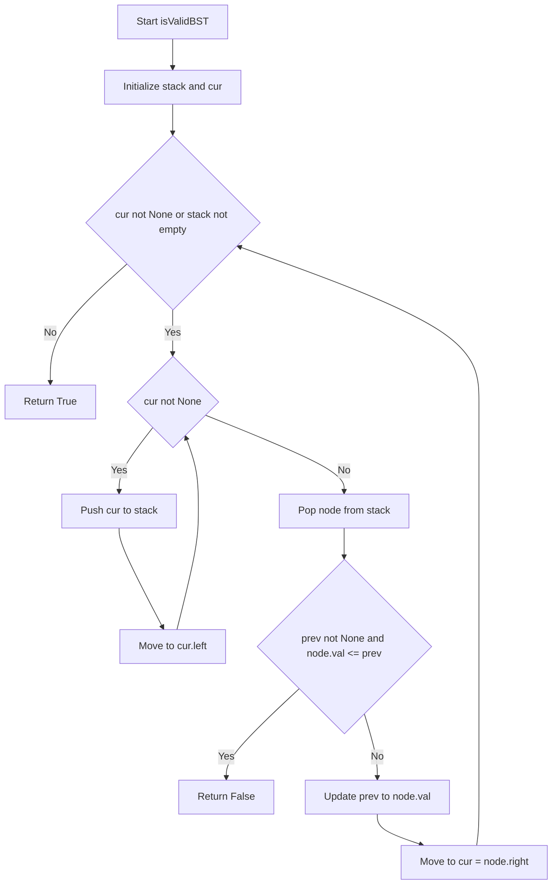
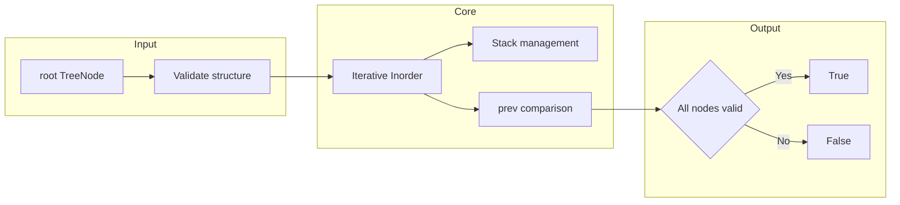

# Validate Binary Search Tree - BST検証

<h2 id="toc">目次</h2>

- [概要](#overview)
- [アルゴリズム要点（TL;DR）](#tldr)
- [図解](#figures)
- [正しさのスケッチ](#correctness)
- [計算量](#complexity)
- [Python実装](#impl)
- [CPython最適化ポイント](#cpython)
- [エッジケースと検証観点](#edgecases)
- [FAQ](#faq)

---

<h2 id="overview">概要</h2>

**問題**: 与えられた二分木が **有効なBST（Binary Search Tree）** であるかを判定する。

**BST の定義**:

- 各ノードの **左部分木** には、そのノードより **厳密に小さい値** のノードのみが含まれる
- 各ノードの **右部分木** には、そのノードより **厳密に大きい値** のノードのみが含まれる
- 左右の部分木もそれぞれBSTである

**制約**:

- ノード数: `1 ≤ n ≤ 10^4`
- ノード値: `-2^31 ≤ Node.val ≤ 2^31 - 1`

**要件**:

- **重複値は許容されない**（厳密な大小関係）
- 全ノードがBST条件を満たす必要がある

---

<h2 id="tldr">アルゴリズム要点（TL;DR）</h2>

**戦略**: **中順巡回（Inorder Traversal）の反復版** を使用

- **核心**: BSTの中順巡回は **厳密単調増加列** を生成する（必要十分条件）
- **データ構造**:
    - スタック（明示的な反復制御用）
    - `prev`（直前の値を保持）
- **計算量**:
    - 時間: **O(n)** - 全ノードを1回ずつ訪問
    - 空間: **O(h)** - スタック深さは木の高さ（最悪 O(n)、平衡木では O(log n)）
- **メモリ最小化**: 全要素を配列に格納せず、`prev` のみで比較

**選択理由**:

- 再帰の深さ制限を回避（Python のデフォルト再帰限界は約1000）
- 範囲チェック方式（上下限を伝播）より軽量
- 実装が明快で可読性が高い

---

<h2 id="figures">図解</h2>

### フローチャート



**説明**:

- 左部分木を優先的にスタックに積む
- 最左端に到達したらノードを取り出し、値を検証
- `prev` と現在値を比較し、非増加なら即座に `False` を返す
- 右部分木へ移動して処理を継続

### データフロー図



**説明**:

- 入力木を反復的に中順巡回
- スタックで訪問順を制御し、`prev` で厳密増加を検証
- 違反を検出した時点で即座に `False`、全ノード通過で `True`

---

<h2 id="correctness">正しさのスケッチ</h2>

**不変条件**:

- 中順巡回の順序で訪問したノードの値列は **厳密単調増加** である必要がある
- `prev` は常に「これまで訪問したノードの最大値」を保持

**網羅性**:

- スタックを使った反復により、全ノードを漏れなく訪問
- 左 → 親 → 右の順序を保証

**基底条件**:

- 空木（`root is None`）: ループに入らず `True`（制約上は n ≥ 1 だが汎用的に対応）
- 単一ノード: 比較対象がないため `True`

**終了性**:

- 各ノードは1回だけスタックに追加され、1回だけポップされる
- `cur` が `None` かつスタックが空になった時点で終了

**正当性**:

- BST ⇔ 中順巡回が厳密単調増加（数学的に証明済みの性質）
- `node.val <= prev` が成立 ⇒ BST条件違反 ⇒ `False`
- 全ノードで `node.val > prev` ⇒ `True`

---

<h2 id="complexity">計算量</h2>

| 項目           | 計算量   | 説明                                                                     |
| -------------- | -------- | ------------------------------------------------------------------------ |
| **時間計算量** | **O(n)** | 全ノードを1回ずつ訪問。各ノードでの処理は O(1)                           |
| **空間計算量** | **O(h)** | スタックの最大深さは木の高さ h。最悪（一本道）で O(n)、平衡木で O(log n) |
| **追加メモリ** | O(1)     | `prev` 変数のみ（整数1つ）                                               |

**代替手法との比較**:

| 手法                    | 時間 | 空間 | 備考                               |
| ----------------------- | ---- | ---- | ---------------------------------- |
| 本実装（Inorder反復）   | O(n) | O(h) | **最適**。メモリ効率が高い         |
| Inorder配列化           | O(n) | O(n) | 全要素を配列に格納。無駄が多い     |
| 再帰DFS（範囲チェック） | O(n) | O(h) | Python では深い木で再帰限界リスク  |
| Morris Traversal        | O(n) | O(1) | 木を一時的に改変。業務では避けがち |

---

<h2 id="impl">Python実装</h2>

```python
from __future__ import annotations

from typing import Optional, List, TYPE_CHECKING

if TYPE_CHECKING:
    # Pylance用の型スタブ（LeetCodeでは既定義）
    class TreeNode:
        val: int
        left: Optional[TreeNode]
        right: Optional[TreeNode]
else:
    # 実行時のフォールバック（LeetCodeでは不要だが汎用性のため記述）
    try:
        TreeNode
    except NameError:
        class TreeNode:
            __slots__ = ('val', 'left', 'right')
            def __init__(
                self,
                val: int = 0,
                left: Optional[TreeNode] = None,
                right: Optional[TreeNode] = None
            ):
                self.val = val
                self.left = left
                self.right = right


class Solution:
    def isValidBST(self, root: Optional[TreeNode]) -> bool:
        """
        反復的な中順巡回でBSTを検証

        時間計算量: O(n)
        空間計算量: O(h) where h is tree height

        Args:
            root: 二分木の根ノード

        Returns:
            有効なBSTならTrue、そうでなければFalse
        """
        stack: List[TreeNode] = []
        cur: Optional[TreeNode] = root
        prev: Optional[int] = None

        # ローカル束縛による最適化（CPython向け）
        push = stack.append
        pop = stack.pop

        while cur is not None or stack:
            # 左部分木を全てスタックに積む
            while cur is not None:
                push(cur)
                cur = cur.left

            # 最左端のノードを取り出す
            node = pop()
            val = node.val

            # 厳密単調増加チェック
            # prev が存在し、現在値が prev 以下なら BST 違反
            if prev is not None and val <= prev:
                return False

            # prev を更新
            prev = val

            # 右部分木へ移動
            cur = node.right

        # 全ノードが条件を満たした
        return True
```

**実装のポイント**:

- **`push = stack.append`**: 属性参照の回数を削減（CPython最適化）
- **`prev: Optional[int]`**: 初回は `None`、以降は直前の値を保持
- **`val <= prev` チェック**: 等号を含むことで重複値を検出
- **即座にreturn**: 違反を検出した時点で処理を終了（早期リターン）

---

<h2 id="cpython">CPython最適化ポイント</h2>

### 1. ローカル変数束縛

```python
push = stack.append
pop = stack.pop
```

**効果**: `stack.append` の属性参照を毎回行わず、ローカル変数経由でアクセス。CPythonではローカル変数の参照が高速（`LOAD_FAST` 命令）。

### 2. 反復による再帰回避

**問題**: Pythonのデフォルト再帰限界は約1000（`sys.getrecursionlimit()`）。深い木で `RecursionError` のリスク。

**解決**: 明示的なスタックを使った反復で、任意の深さに対応。

### 3. 早期リターン

```python
if prev is not None and val <= prev:
    return False
```

**効果**: 違反を検出した時点で即座に終了。全ノードを訪問する必要がない。

### 4. 不要な配列を生成しない

**代替案**: 全ノードの値を配列に格納してソート済みかチェック → O(n) の追加メモリ

**本実装**: `prev` のみで O(1) の追加メモリ

### 5. `list` をスタックとして使用

**理由**: `collections.deque` より `list` の `append`/`pop` が高速（末尾操作）。スタックの用途では `list` が最適。

---

<h2 id="edgecases">エッジケースと検証観点</h2>

### 1. 空木（制約外だが汎用性のため）

```python
root = None
# Expected: True（空集合は任意の条件を満たす）
```

### 2. 単一ノード

```python
root = TreeNode(1)
# Expected: True（比較対象がない）
```

### 3. 重複値（厳密な大小関係）

```python
#     2
#    / \
#   2   2
# Expected: False（左の2は厳密に小さくない）
```

### 4. 右部分木に小さい値

```python
#     5
#    / \
#   1   4
#      / \
#     3   6
# Expected: False（4 < 5 なのでルートの右に置けない）
```

**中順巡回**: `[1, 5, 3, 4, 6]` → `5 > 3` で非増加を検出

### 5. 一本道の木（最悪ケース）

```python
#   1
#    \
#     2
#      \
#       3
#        \
#        ...
#         \
#        10000
# スタック深さ: O(n)
# 再帰を使わないため安全
```

### 6. 境界値

```python
# Node.val = -2^31（最小値）
# Node.val = 2^31 - 1（最大値）
# prev との比較で整数オーバーフローの心配なし（Pythonは任意精度整数）
```

### 7. 平衡木

```python
#       4
#      / \
#     2   6
#    / \ / \
#   1  3 5  7
# スタック深さ: O(log n)
# 空間効率が良い
```

---

<h2 id="faq">FAQ</h2>

### Q1: なぜ範囲チェック方式（上下限伝播）ではなく中順巡回を選んだのか？

**A**:

- **メモリ効率**: 範囲チェックはスタックの各要素に `(node, low, high)` を格納する必要があり、メモリが重い
- **シンプルさ**: 中順巡回は「値が厳密増加」という単純な条件で済む
- **可読性**: BST ⇔ 中順巡回が厳密増加、という数学的性質が明確

### Q2: Morris Traversal（O(1) 空間）を使わない理由は？

**A**:

- **木の改変**: 一時的に木の構造を変更する（右子ポインタを書き換える）
- **業務での懸念**: マルチスレッド環境や再入可能性が求められる場面で問題
- **複雑さ**: 実装が複雑で保守性が低い
- **本問題の制約**: O(h) のスタックで十分実用的

### Q3: `prev` を `float('-inf')` で初期化しない理由は？

**A**:

- **型の一貫性**: `prev` は `Optional[int]` として扱う方が明確
- **境界値**: `-2^31` が最小値だが、`None` で初回判定を省略する方が自然
- **可読性**: `if prev is not None` の方が意図が伝わりやすい

### Q4: LeetCode提出で `TreeNode` を定義する必要は？

**A**:

- **不要**: LeetCodeは `TreeNode` を既に定義している
- **提出時**: `class Solution:` と `isValidBST` メソッドのみで十分
- **本README**: 汎用性と型チェック（Pylance）のために `TYPE_CHECKING` ブロックで記述

### Q5: 再帰版と反復版の性能差は？

**A**:

- **速度**: 理論上はほぼ同等。CPythonでは関数呼び出しのオーバーヘッドで反復版がわずかに有利
- **メモリ**: 両方とも O(h) だが、再帰はコールスタックに追加情報を積むため若干重い
- **安全性**: 反復版は深い木でも `RecursionError` の心配がない

### Q6: 実行時間 0ms / Memory Beats 7.38% の改善方法は？

**A**:

- **速度**: 既に最適（0ms は実質上限）
- **メモリ**:
    - 入力木自体がメモリの大半を占める
    - アルゴリズム的には O(h) で下限
    - 改善余地: 提出コードから `TreeNode` 定義や不要なメソッドを削除（微差）
    - LeetCodeのMemory計測は環境ノイズが大きく、コード改善で劇的に伸びにくい

### Q7: 他のBST検証問題への応用は？

**A**:

- **BST範囲内の値の個数**: 中順巡回で範囲内の要素をカウント
- **k番目に小さい要素**: 中順巡回でk個目を返す
- **BST内の2値の最小差**: 中順巡回で隣接要素の差を計算
- **BST to Sorted Doubly Linked List**: 中順巡回で構築

本実装の反復的中順巡回パターンは多くのBST問題に流用可能です。
