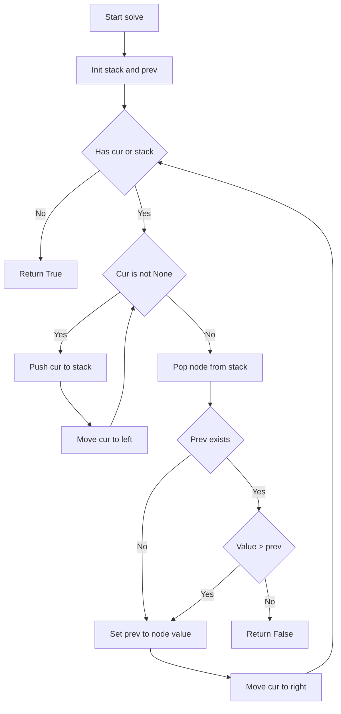
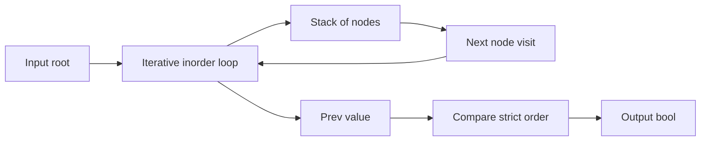

# Validate Binary Search Tree - 二分探索木の妥当性判定

## Table of Contents

- [概要](#overview)
- [アルゴリズム要点 TL;DR](#tldr)
- [図解](#figures)
- [正しさのスケッチ](#correctness)
- [計算量](#complexity)
- [Python 実装](#impl)
- [CPython最適化ポイント](#cpython)
- [エッジケースと検証観点](#edgecases)
- [FAQ](#faq)

---

<h2 id="overview">概要</h2>

**プラットフォーム/ID**: LeetCode 98
**問題**: 与えられた二分木が **有効な二分探索木（BST）** かどうかを判定する。

BST の条件（すべて **strict**）:

- 各ノードについて、左部分木の値はすべて **ノード値より小さい**
- 右部分木の値はすべて **ノード値より大きい**
- 左右部分木も同様に BST

**入出力（簡潔）**

- 入力: `root: TreeNode | None`
- 出力: `bool`（BSTなら `True`）

**代表例**

- `root = [2,1,3]` → `True`
- `root = [5,1,4,null,null,3,6]` → `False`（右部分木に 3 が混入してルール違反）

---

<h2 id="tldr">アルゴリズム要点（TL;DR）</h2>

- 戦略: **中順走査（inorder）** が BST なら **値が厳密増加**になる性質を使う
- 実装: **反復 inorder**（再帰を使わずスタックで走査）
- 判定: 直前に訪れた値 `prev` を持ち、現在値 `v` が `v <= prev` なら即 `False`
- データ構造: `list` をスタックとして利用（`append/pop`）
- 計算量:
    - Time: **O(n)**
    - Space: **O(h)**（`h` は木の高さ、最悪で O(n)）

---

<h2 id="figures">図解</h2>

### フローチャート（反復 inorder による判定）



**説明（日本語）**:
左端まで降りてノードを取り出すたびに「直前値より大きいか」を確認します。BST でなければ、どこかで増加が崩れるため即座に検出できます。

### データフロー図（入力から判定まで）



**説明（日本語）**:
主な状態は「スタック」と「直前値 prev」の2つです。訪問順が strict に昇順であることだけを検証します。

---

<h2 id="correctness">正しさのスケッチ</h2>

### 不変条件

反復 inorder ループ中、スタックは「これから訪問するノードまでのパス」を保持し、`prev` は **すでに訪問済みの inorder 順で最後の値**を表す。

### 網羅性

inorder は全ノードを **ちょうど1回**訪問する。
よって、どのノード値の違反も必ず比較のタイミングが訪れる。

### BST と inorder の関係

- BST であれば、左部分木 → ノード → 右部分木の順に辿る inorder は **strict に昇順**になる。
- 逆に inorder が strict 昇順でなければ、どこかで `current <= prev` が起き、BST 条件（strict）に反するノード配置が存在する。

### 基底条件

- `root is None` のとき、ノードが存在せず条件違反も起こらないため `True`。

### 終了性

各ノードはスタックに最大1回 push され、最大1回 pop されるため、有限回の操作で必ず終了する。

---

<h2 id="complexity">計算量</h2>

- **Time: O(n)**
  各ノードを1回訪問し、比較は定数時間。
- **Space: O(h)**
  スタックが最大で木の高さ分だけ増える（最悪の片側に偏った木では `h = n`）。

| 観点       | 本解法（反復 inorder）    |
| ---------- | ------------------------- |
| 追加メモリ | スタック O(h) + prev O(1) |
| 木の変更   | なし（Pure）              |
| 再帰       | 不使用（深い木でも安全）  |

---

<h2 id="impl">Python 実装</h2>

- LeetCode 準拠: `class Solution: def isValidBST(self, root) -> bool`
- Pylance 対応:
    - `TYPE_CHECKING` で型スタブを提供
    - 実行時に `TreeNode` が未定義なら最小フォールバックを用意（通常 LeetCode では不要）

```python
from __future__ import annotations

from typing import Optional, List, TYPE_CHECKING


if TYPE_CHECKING:
    class TreeNode:
        val: int
        left: Optional["TreeNode"]
        right: Optional["TreeNode"]
else:
    # LeetCode 環境では TreeNode が提供される前提。
    # ローカル実行などで未定義のときだけ最小実装を用意する。
    try:
        TreeNode  # type: ignore[name-defined]
    except NameError:
        class TreeNode:
            __slots__ = ("val", "left", "right")

            def __init__(
                self,
                val: int = 0,
                left: Optional["TreeNode"] = None,
                right: Optional["TreeNode"] = None,
            ) -> None:
                self.val = val
                self.left = left
                self.right = right


class Solution:
    def isValidBST(self, root: Optional[TreeNode]) -> bool:
        """
        Validate whether a binary tree is a valid BST.

        Strategy:
          - Iterative inorder traversal
          - Ensure visited values are strictly increasing

        Time: O(n)
        Space: O(h)
        """
        stack: List[TreeNode] = []
        cur: Optional[TreeNode] = root
        prev: Optional[int] = None

        # CPython micro-optimization: local bindings
        push = stack.append
        pop = stack.pop

        while cur is not None or stack:
            # 1) Go to the leftmost node
            while cur is not None:
                push(cur)
                cur = cur.left

            # 2) Visit node
            node = pop()
            v = node.val

            # 3) Strict order check (duplicates are invalid)
            if prev is not None and v <= prev:
                return False
            prev = v

            # 4) Move to right subtree
            cur = node.right

        return True
```

---

<h2 id="cpython">CPython最適化ポイント</h2>

- **再帰を避ける**: Python の再帰は関数呼び出しコストが高く、深い木で `RecursionError` もあり得るため、反復が有利。
- **list をスタックに使う**: `collections.deque` よりも、片端 `append/pop` のみなら `list` が高速になりやすい。
- **ローカル変数束縛**: `push = stack.append`, `pop = stack.pop` はループ内属性参照を減らし、ホットループで効くことがある。
- **不要なオブジェクト生成を避ける**: 範囲チェック型（low/high）でタプルを積む方法より、inorder はスタック要素がノード参照だけで軽い。
- **GIL**: 本問題は CPU バウンドで逐次処理が基本。並列化は効果が薄い。

---

<h2 id="edgecases">エッジケースと検証観点</h2>

- **空木**: `root = None` → `True`
- **単一ノード**: 1要素 → `True`
- **重複値**: strict なので `2,2` のような重複があれば → `False`
- **部分木違反**: 親子だけ正しくても、右部分木に小さい値が混入するケース（例: `[5,1,4,null,null,3,6]`）→ `False`
- **極端に偏った木**: 高さが `n` に近い → 再帰を使わないので安全（ただしスタックは O(n)）
- **値の範囲**: `-2^31` 〜 `2^31-1` の端値でも比較のみなので問題なし

検証観点（手動/レビュー用）:

- inorder の訪問順が **strict increasing** になっているか
- `prev` 更新が「訪問した直後」に行われているか
- `<=` を使って重複を弾けているか（`<` だけだとバグになる）

---

<h2 id="faq">FAQ</h2>

**Q1. なぜ inorder が使えるのですか？**
A. BST の定義から、左部分木の全要素はノードより小さく、右部分木は大きいので、inorder（左→ノード→右）で辿ると値が昇順になります。strict 条件なので「厳密増加」を要求します。

**Q2. low/high の範囲チェック版のほうが分かりやすくない？**
A. 分かりやすさは好みですが、Python では low/high をスタックに積むためのタプル生成が増えやすく、inorder は保持が軽いことが多いです。どちらも O(n) で正しいです。

**Q3. 0ms / 100% なのに Memory が低いのはなぜ？**
A. LeetCode の Memory はプロセス全体の常駐や入力木オブジェクト自体の影響が大きく、提出間の揺れもあります。アルゴリズム追加分はすでに小さいため、改善余地が見えにくいことがあります。

**Q4. Morris traversal で O(1) 空間にできますか？**
A. 可能ですが、木のポインタを一時的に書き換えて復元するため、実装コスト・可読性・安全性が下がりやすく、通常は推奨しません（面接/競技の特殊要件がある場合のみ）。
