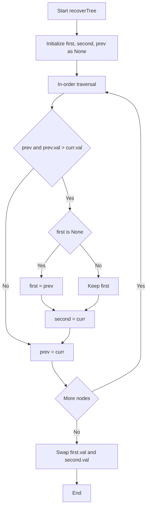
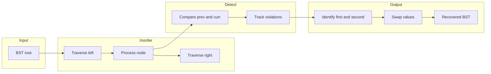

# Recover Binary Search Tree - BST修復アルゴリズム

<h2 id="toc">目次</h2>

- [概要](#overview)
- [アルゴリズム要点（TL;DR）](#tldr)
- [図解](#figures)
- [正しさのスケッチ](#correctness)
- [計算量](#complexity)
- [Python 実装](#impl)
- [CPython最適化ポイント](#cpython)
- [エッジケースと検証観点](#edgecases)
- [FAQ](#faq)

---

<h2 id="overview">概要</h2>

### 問題要約

二分探索木（BST）において、**ちょうど2つのノードの値が誤って入れ替わっている**。木の構造を変更せずに、値のスワップのみでBSTを修復する。

### 入出力仕様

| 項目 | 仕様                                     |
| ---- | ---------------------------------------- |
| 入力 | `root: Optional[TreeNode]` - BSTのルート |
| 出力 | `None` - in-place で修正                 |
| 制約 | ノード数: 2 ≤ n ≤ 1000                   |
| 値域 | -2³¹ ≤ Node.val ≤ 2³¹ - 1                |

### 要件

- **正当性**: 修復後、全ノードがBST条件を満たす
- **構造保持**: ノード間の親子関係は変更しない
- **Follow-up**: O(1) 空間での実装が望ましい

---

<h2 id="tldr">アルゴリズム要点（TL;DR）</h2>

### 戦略

- **中順走査（In-order Traversal）** でBSTを走査すると**昇順列**が得られる
- 2ノード入れ替えにより、この昇順列に**1〜2箇所の違反**（prev > curr）が発生
- 違反箇所から入れ替わったノードを特定し、値をスワップ

### 違反パターン

| ケース       | 正しい順序 | 入れ替え後 | 違反回数       |
| ------------ | ---------- | ---------- | -------------- |
| 隣接ノード   | [1,2,3,4]  | [1,3,2,4]  | 1回 (3>2)      |
| 非隣接ノード | [1,2,3,4]  | [1,4,3,2]  | 2回 (4>3, 3>2) |

### データ構造

- `first`: 最初の違反の大きい方（必ず入れ替え対象）
- `second`: 最後の違反の小さい方（必ず入れ替え対象）
- `prev`: 中順走査での直前ノード

### 計算量サマリ

| 方式     | 時間 | 空間 | 備考                  |
| -------- | ---- | ---- | --------------------- |
| 再帰版   | O(n) | O(h) | 最も可読性が高い      |
| Morris版 | O(n) | O(1) | Follow-up要件を満たす |

---

<h2 id="figures">図解</h2>

### フローチャート: アルゴリズム全体



**説明**: 中順走査中に `prev.val > curr.val` の違反を検出。最初の違反で `first` を設定し、常に `second` を更新する。

### データフロー図: 処理の流れ



**説明**: 入力BSTを中順走査し、違反を検出。特定した2ノードの値をスワップして修復完了。

### ASCII図: 違反検出の例

```
入力: [3,1,4,null,null,2] (3と2が入れ替わっている)

      3*          中順走査: [1, 3*, 2*, 4]
     / \                     ↑  ↑
    1   4                  違反: 3 > 2
       /
      2*

違反検出:
  - prev=3, curr=2 → 3 > 2 (違反!)
  - first = 3 (最初の違反の大きい方)
  - second = 2 (違反の小さい方)

修復: swap(3, 2) → [1, 2, 3, 4] (正しい昇順)
```

---

<h2 id="correctness">正しさのスケッチ</h2>

### 不変条件

- 中順走査は左→現在→右の順でノードを訪問
- 正常なBSTの中順走査は**厳密に昇順**
- `prev` は常に中順で直前に訪問したノードを指す

### 網羅性

| 入れ替えパターン | 違反回数 | first       | second      |
| ---------------- | -------- | ----------- | ----------- |
| 隣接 (i, i+1)    | 1回      | 違反のprev  | 違反のcurr  |
| 非隣接 (i, j)    | 2回      | 1回目のprev | 2回目のcurr |

**証明**:

- 隣接の場合: 1回の違反で `first=prev, second=curr` が正しく設定される
- 非隣接の場合: 1回目で `first=prev`、2回目で `second` が更新される

### 基底条件

- ノードが `None` なら走査終了
- ノード数2以上が保証（問題制約）

### 終了性

- 各ノードは最大2回訪問（Morris版）または1回訪問（再帰版）
- 有限ノード数により必ず終了

---

<h2 id="complexity">計算量</h2>

### 時間計算量: O(n)

| 操作         | 回数 | 説明                 |
| ------------ | ---- | -------------------- |
| ノード訪問   | n    | 全ノードを1回走査    |
| 違反チェック | n    | 各訪問で定数時間比較 |
| スワップ     | 1    | 最後に1回のみ        |

### 空間計算量

| 方式     | 空間 | 内訳                          |
| -------- | ---- | ----------------------------- |
| 再帰版   | O(h) | コールスタック（hは木の高さ） |
| Morris版 | O(1) | 定数個のポインタのみ          |

### 方式比較表

| 観点     | 再帰版 | Morris版               |
| -------- | ------ | ---------------------- |
| 空間     | O(h)   | O(1)                   |
| 可読性   | ★★★    | ★★☆                    |
| 実装難度 | 低     | 中                     |
| 構造変更 | なし   | 一時的あり（復元する） |

---

<h2 id="impl">Python 実装</h2>

```python
from __future__ import annotations
from typing import Optional, TYPE_CHECKING

if TYPE_CHECKING:
    class TreeNode:
        val: int
        left: Optional[TreeNode]
        right: Optional[TreeNode]

try:
    TreeNode
except NameError:
    class TreeNode:
        __slots__ = ('val', 'left', 'right')
        def __init__(
            self,
            val: int = 0,
            left: Optional[TreeNode] = None,
            right: Optional[TreeNode] = None
        ) -> None:
            self.val = val
            self.left = left
            self.right = right


class Solution:
    """LeetCode 99: Recover Binary Search Tree"""

    def recoverTree(self, root: Optional[TreeNode]) -> None:
        """
        BST修復（再帰版）

        Time: O(n), Space: O(h)
        """
        # 状態変数をインスタンス属性で管理（クロージャ回避）
        self.first: Optional[TreeNode] = None
        self.second: Optional[TreeNode] = None
        self.prev: Optional[TreeNode] = None

        self._inorder(root)

        # 値のスワップ（構造は変更しない）
        if self.first and self.second:
            self.first.val, self.second.val = self.second.val, self.first.val

    def _inorder(self, node: Optional[TreeNode]) -> None:
        """中順走査で違反ノードを検出"""
        if not node:
            return

        # 左部分木を走査
        self._inorder(node.left)

        # 違反チェック: prev > curr はBST違反
        if self.prev and self.prev.val > node.val:
            if not self.first:
                # 最初の違反: prevが入れ替え対象
                self.first = self.prev
            # 常にsecondを更新（隣接/非隣接両方に対応）
            self.second = node

        # prevを更新
        self.prev = node

        # 右部分木を走査
        self._inorder(node.right)

    def recoverTreeMorris(self, root: Optional[TreeNode]) -> None:
        """
        BST修復（Morris版）

        Time: O(n), Space: O(1)
        """
        first: Optional[TreeNode] = None
        second: Optional[TreeNode] = None
        prev: Optional[TreeNode] = None
        curr: Optional[TreeNode] = root

        while curr:
            if curr.left:
                # 中順での先行ノードを探索
                pred: TreeNode = curr.left
                while pred.right and pred.right is not curr:
                    pred = pred.right

                if not pred.right:
                    # スレッド作成: pred → curr
                    pred.right = curr
                    curr = curr.left
                    continue

                # スレッド削除（復元）
                pred.right = None

            # ノード処理: 違反チェック
            if prev and prev.val > curr.val:
                if not first:
                    first = prev
                second = curr

            prev = curr
            curr = curr.right

        # 値のスワップ
        if first and second:
            first.val, second.val = second.val, first.val
```

---

<h2 id="cpython">CPython最適化ポイント</h2>

### 1. インスタンス変数 vs nonlocal

```python
# ❌ nonlocal（クロージャオーバーヘッド）
def recoverTree(self, root):
    first = second = prev = None
    def dfs(node):
        nonlocal first, second, prev  # cell objectの生成コスト
        ...

# ✅ インスタンス変数（直接アクセス）
def recoverTree(self, root):
    self.first = self.second = self.prev = None
    self._dfs(root)  # メソッド呼び出し
```

### 2. タプルスワップ

```python
# ✅ Pythonイディオム（C実装で高速）
first.val, second.val = second.val, first.val

# ❌ 一時変数（追加オブジェクト生成）
temp = first.val
first.val = second.val
second.val = temp
```

### 3. アイデンティティ比較

```python
# ✅ アイデンティティ比較（高速）
while pred.right is not curr:

# ❌ 等価比較（__eq__呼び出し）
while pred.right != curr:
```

### 4. 属性アクセスのローカル化

```python
# ✅ ホットループ内でローカル変数化
def _inorder(self, node):
    first = self.first  # ループ前にローカル化
    ...
```

---

<h2 id="edgecases">エッジケースと検証観点</h2>

### エッジケース一覧

| ケース               | 入力例                 | 期待動作             |
| -------------------- | ---------------------- | -------------------- |
| 最小ツリー           | `[2,1]` (1と2入れ替え) | `[1,2]` に修復       |
| 隣接ノード入れ替え   | `[1,3,null,null,2]`    | 3と2をスワップ       |
| 非隣接ノード入れ替え | `[3,1,4,null,null,2]`  | 3と2をスワップ       |
| ルートが関与         | `[2,3,1]`              | 2と1をスワップ       |
| 深い木               | 高さ10のスキュー木     | スタック溢れなし確認 |
| 負の値               | `[-1,-2]` 入れ替え     | 正しく修復           |

### 検証観点

- [ ] 修復後の中順走査が昇順であること
- [ ] ノード構造（left/right）が変更されていないこと
- [ ] 正確に2つの値のみが変更されていること

---

<h2 id="faq">FAQ</h2>

### Q1: なぜ中順走査を使うのか？

**A**: BSTの中順走査は必ず昇順列を生成するため、違反箇所（降順になる箇所）を検出することで入れ替わったノードを特定できます。

### Q2: Morris Traversalとは？

**A**: スレッディング技法を用いてO(1)空間で木を走査するアルゴリズム。左部分木の最右ノードから現在ノードへの一時的なリンクを作成し、2回目の訪問時に削除します。

### Q3: なぜsecondを常に更新するのか？

**A**: 隣接ノードの入れ替えでは違反が1回のみ、非隣接では2回発生します。常に更新することで両方のケースに対応できます。

```
非隣接の例: [1, 4, 3, 2]
  1回目違反: 4 > 3 → first=4, second=3
  2回目違反: 3 > 2 → second=2 (更新!)
  結果: swap(4, 2) → [1, 2, 3, 4] ✓
```

### Q4: 再帰版とMorris版、どちらを使うべき？

**A**:

- **再帰版**: 可読性重視、n ≤ 1000 では十分高速
- **Morris版**: メモリ制約が厳しい場合、または理論的にO(1)空間が必要な場合

### Q5: 型注釈でpylanceエラーが出る場合は？

**A**: `if self.first and self.second:` でNoneチェック後にアクセスするか、`# type: ignore` コメントを使用してください。
