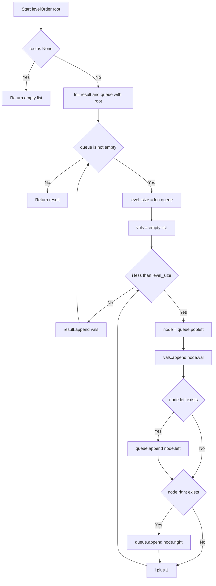
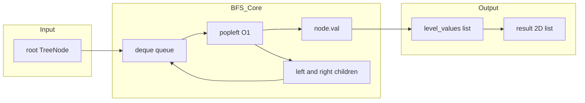

# Binary Tree Level Order Traversal - 木を階層ごとにグループ化する

---

## 目次（Table of Contents）

- [概要](#overview)
- [アルゴリズム要点 TL;DR](#tldr)
- [図解](#figures)
- [正しさのスケッチ](#correctness)
- [計算量](#complexity)
- [Python 実装](#impl)
- [CPython 最適化ポイント](#cpython)
- [エッジケースと検証観点](#edgecases)
- [FAQ](#faq)

---

<h2 id="overview">概要</h2>

> 💡 **この問題は一言で言うと「木を上から下へ、同じ高さのノードをまとめてグループ化する問題」です。**

与えられた二分木（＝各ノードが最大2つの子を持つ木構造のデータ）のノードを、
**深さ（根からの距離）が同じものをひとつの配列にまとめ**、深さ順に並べた2次元配列を返します。

```
        3          ← 深さ0 → [3]
       / \
      9  20        ← 深さ1 → [9, 20]
         / \
        15   7     ← 深さ2 → [15, 7]

出力: [[3], [9, 20], [15, 7]]
```

**なぜこの問題が難しいのか：**
木構造を「縦（深さ方向）」に探索するのは直感的ですが、この問題は「横（同じ深さ）」の単位でまとめる必要があります。
そのため、**同じ深さにあるノードをすべて処理し終えてから次の深さへ進む**BFS（幅優先探索）という手法を使う必要があり、
その実現に `collections.deque` というデータ構造が鍵を握ります。

**制約：**

| 項目       | 範囲                                             |
| ---------- | ------------------------------------------------ |
| ノード数   | 0 以上 2000 以下                                 |
| ノードの値 | -1000 以上 1000 以下（**0 が含まれる点に注意**） |

> 📖 **この章で登場した用語**
>
> - **二分木**：各ノードが左の子・右の子の最大2つを持つ木構造のデータ
> - **深さ**：根ノードからそのノードまでの辺の数。根の深さは 0
> - **BFS（幅優先探索）**：グラフや木を「横方向に広がりながら」探索する方法
> - **制約**：入力として与えられる値の範囲や条件のこと

---

<h2 id="tldr">アルゴリズム要点（TL;DR）</h2>

> 💡 **TL;DR（Too Long; Didn't Read）** とは「長くて読めない人向けの要約」という意味です。
> ここではアルゴリズム全体の戦略をざっくり把握するための章です。
> 詳細は後の章で説明するので、**「なんとなくこういう手順で解くんだな」というイメージを掴む**ことを目的にしています。

- **手法：BFS（幅優先探索）**
  木を「同じ深さのノードをすべて処理してから次の深さへ進む」順番で探索する。
  これが今回の「階層ごとのグループ化」と自然に一致するため選ぶ。

- **データ構造：`collections.deque`（両端キュー）**
  先頭からの取り出しが O(1) で行えるため、キュー（行列）として最適。
  `list.pop(0)` を使うと先頭取り出しが O(n) になり全体が O(n²) へ悪化するため使わない。

- **核心テクニック：`level_size = len(queue)` をループ前に固定する**
  ループ中にキューへの追加・取り出しが同時に起きるため、「今の階のサイズ」を先に変数へ保存しないとズレが生じる。

- **時間計算量：O(n)** 各ノードをちょうど1回だけ処理する。

- **空間計算量：O(n)** キューに最大で最下層のノード数（最大 n/2 個）が入る。

- **`val = 0` への注意**
  ノードの値が `-1000 〜 1000` のため `0` は普通に登場する。
  `0 or 式` のような `or` トリックは `val=0` のとき `0`（falsy）と判定されて壊れるため**絶対に使わない**。

> 📖 **この章で登場した用語**
>
> - **TL;DR**：「長くて読めない人向けの要約」を意味する略語
> - **キュー**：先に入れたものを先に取り出す（FIFO）データ構造。銀行の窓口の行列と同じ仕組み
> - **falsy（フォールシー）**：Pythonで `if` の条件式が `False` 相当と見なされる値。`0`, `None`, `[]`, `""` などが該当する

---

<h2 id="figures">図解</h2>

> 💡 **Mermaid フローチャートの読み方：**
>
> - **長方形 `[]`** は「処理ステップ」を表します。
> - **ひし形 `{}`** は「条件分岐」を表します。Yes/No の矢印でどちらへ進むかが決まります。
> - 矢印は処理の流れを示し、上から下（または左から右）へ読み進めます。

---

### フローチャート

この図は `levelOrder` 関数全体の処理の流れを表しています。
上から下へ読み進めることで、BFS がどのように「階層ごと」に処理するかを確認できます。



**各ノードの意味：**

- `Start`：関数の入り口。`root` を引数として受け取る
- `IsNone`（ひし形）：`root` が `None`（空ツリー）かどうかを判定する
- `RetEmpty`：空ツリーなら空リストを即返す
- `Init`：`result = []` と `queue = deque([root])` を初期化する
- `WhileLoop`（ひし形）：キューが空でない間ループを続ける判定
- `FixSize`：**今の階のサイズを変数に固定する**（BFS の核心）
- `InitVals`：今の階の値を格納する一時リストを作る
- `ForLoop`（ひし形）：`level_size` 個分のノードを処理するループ判定
- `PopNode`：`popleft()` でキューの先頭ノードを O(1) で取り出す
- `AppendVal`：ノードの値を今の階のリストに追加する（`val=0` も正しく追加される）
- `CheckLeft` / `CheckRight`（ひし形）：子が存在するかどうかを判定する
- `PushLeft` / `PushRight`：子をキューの末尾に追加する（次の階として処理待ちにする）
- `AppendLevel`：今の階の値リストを結果に追加する

---

### データフロー図

この図は入力ツリーがどのようにキューを経由して結果配列へ変換されるかのデータの流れを表しています。



**主要な流れの説明：**

- `root → deque`：ルートノードをキューに入れてBFS開始
- `popleft() → node.val`：先頭ノードを取り出してその値を今の階のリストへ追加
- `left/right → deque`：子ノードをキューの末尾へ追加（次の階として登録）
- `level_values → result`：今の階の値リストを結果の2次元配列へ追加

---

> 💡 **代表例でのトレース：`root = [3, 9, 20, null, null, 15, 7]`**

```
ツリー:
    3
   / \
  9  20
     / \
    15   7

Step 1: Start → root = Node(3)
Step 2: IsNone → No（rootは存在する）
Step 3: Init → result=[], queue=deque([Node(3)])

━━ while ループ 1回目（深さ0） ━━
Step 4: FixSize → level_size = len(queue) = 1（ここで固定）
Step 5: InitVals → vals = []
Step 6: ForLoop i=0:
        PopNode  → node = Node(3)   queue = deque([])
        AppendVal → vals = [3]      （val=3 を正しく追加）
        CheckLeft → Node(9) あり    → queue = deque([Node(9)])
        CheckRight → Node(20) あり  → queue = deque([Node(9), Node(20)])
Step 7: AppendLevel → result = [[3]]

━━ while ループ 2回目（深さ1） ━━
Step 8: FixSize → level_size = 2（ここで固定。以降 queue が変わっても影響しない）
Step 9: ForLoop i=0:
        PopNode  → node = Node(9)   queue = deque([Node(20)])
        AppendVal → vals = [9]
        left=None, right=None → スキップ
        ForLoop i=1:
        PopNode  → node = Node(20)  queue = deque([])
        AppendVal → vals = [9, 20]
        left=Node(15) → queue = deque([Node(15)])
        right=Node(7) → queue = deque([Node(15), Node(7)])
Step 10: AppendLevel → result = [[3], [9, 20]]

━━ while ループ 3回目（深さ2） ━━
Step 11: FixSize → level_size = 2
         i=0: Node(15) → vals=[15]  子なし
         i=1: Node(7)  → vals=[15,7] 子なし
Step 12: AppendLevel → result = [[3], [9, 20], [15, 7]]

Step 13: WhileLoop → queue が空 → ループ終了
Step 14: RetResult → [[3], [9, 20], [15, 7]] ✅
```

> 📖 **この章で登場した用語**
>
> - **フローチャート**：処理の手順を図形と矢印で表したもの。ひし形=条件分岐、長方形=処理
> - **データフロー図**：データがどのように変換・移動するかを示す図
> - **サブグラフ**：フローチャートの中で関連する処理をグループ化したもの
> - **FIFO**：First In First Out。最初に入れたものを最初に取り出す順序。キューはこの性質を持つ

---

<h2 id="correctness">正しさのスケッチ</h2>

> 💡 **「正しさのスケッチ」** とは、アルゴリズムが**常に正しい答えを返せる根拠**を整理したものです。
> 数学的な厳密な証明ではなく「なぜ正しいと言えるか」の説明です。

---

### 1. 不変条件（＝アルゴリズムが正しく動くために、処理中ずっと成り立ち続けるべき条件）

**「while ループの各反復の開始時点で、`queue` には現在の階のノードだけが入っている」**

- ループ開始時：`level_size = len(queue)` で今の階のサイズを固定する
- `level_size` 回だけ `popleft()` することで今の階のノードを全部取り出す
- その間に追加された子ノードは「次の階」としてキューの末尾に積まれるだけで、今の階のカウントには影響しない
- ループ終了時：キューには次の階のノードだけが残り、次の反復の開始時にも不変条件が保たれる

### 2. 網羅性（＝すべてのケースをもれなく処理できているという保証）

- 全ノードは「キューに積まれる」→「`popleft()` で取り出される」の2ステップを必ずたどる
- ルートはループ前にキューに積まれる
- 各ノードの左・右の子は「そのノードを処理するとき」に `None` チェックをしてからキューに積まれる
- したがって、存在するすべてのノードがちょうど1回だけ処理される

### 3. 基底条件（＝再帰の終了条件に相当する、処理を打ち切る条件）

- `root is None`：ツリーが空の場合は即座に `[]` を返す
  → これがないと `queue = deque([None])` となり `node.val` アクセスでクラッシュする
- `while queue`：キューが空になった（全ノードを処理し終えた）ときにループを終了する
  → これにより無限ループにならない

### 4. 終了性（＝アルゴリズムが必ず有限ステップで終わるという保証）

- ノード数は有限（最大 2000）
- 各ノードはキューから取り出されると二度と積まれない（子ノードを追加するだけ）
- したがって `popleft()` の合計呼び出し回数はノード数 n に等しく、ループは必ず終了する

> 📖 **この章で登場した用語**
>
> - **不変条件**：アルゴリズムが正しく動くために、処理中ずっと成り立ち続けるべき条件
> - **網羅性**：すべてのケースをもれなく処理できているという保証
> - **基底条件**：処理を打ち切る（または再帰を終了させる）条件
> - **終了性**：アルゴリズムが必ず有限ステップで終わるという保証

---

<h2 id="complexity">計算量</h2>

> 💡 **計算量** とは「入力が大きくなるにつれて、処理にかかる時間・メモリがどう増えるか」の目安です。

| 記法         | 意味                   | 直感的なイメージ           |
| ------------ | ---------------------- | -------------------------- |
| `O(1)`       | 入力サイズによらず一定 | 辞書で直接ページを開く     |
| `O(n)`       | 入力に比例して増加     | リストを端から順に読む     |
| `O(n log n)` | n よりやや速く増加     | ソートアルゴリズムの典型   |
| `O(n²)`      | 入力の2乗で増加        | 全ペアを総当たりで確認する |

---

### 時間計算量：O(n)

- 各ノードはキューへの追加（`append`）とキューからの取り出し（`popleft`）を1回ずつ行う
- どちらも `deque` の O(1) 操作なので、n ノード全体で O(n)
- 結果配列へのリスト追加（`result.append(vals)`）も合計 O(n)

### 空間計算量：O(n)

- `result`（出力配列）：全ノードの値を格納するため O(n)
- `queue`（キュー）：最大で「最も広い階のノード数」が同時に入る
  完全二分木の最下層は最大 n/2 ノードなので O(n)

---

### `list.pop(0)` を使った場合との比較

「`list.pop(0)` ではダメなのか」を疑問に思う方のために比較します。

| 手法                          | `popleft()` 1回の計算量    | 全体の時間計算量 |
| ----------------------------- | -------------------------- | ---------------- |
| `collections.deque.popleft()` | O(1)                       | **O(n)** ✅      |
| `list.pop(0)`                 | O(n)（残り全要素をシフト） | **O(n²)** ❌     |

n = 2000 のとき、`list.pop(0)` を使うと最大 2000 × 2000 = **4,000,000 回**の操作が発生します。
`deque.popleft()` ならば **2000 回**で済みます。

> 📖 **この章で登場した用語**
>
> - **時間計算量**：入力の大きさに対して処理にかかる手間がどう増えるかの目安
> - **空間計算量**：処理中に使うメモリ量がどう増えるかの目安
> - **O(n²)**：入力が2倍になると処理が約4倍になること。`list.pop(0)` を n 回呼ぶと発生する

---

<h2 id="impl">Python 実装</h2>

> 💡 **コードを読む前に、実装の全体的な骨格を確認しましょう。**
>
> 1. `root is None` チェックで空ツリーを即返す
> 2. `result`（結果格納用）と `queue`（BFS用）を初期化する
> 3. `while queue` でキューが空になるまでループ
> 4. `level_size = len(queue)` で今の階のサイズを**変数に保存して固定**する（核心）
> 5. `level_size` 回だけ `popleft()` し、値の収集と子の登録を行う
> 6. 今の階の値リストを `result` に追加する
> 7. すべての階を処理し終えたら `result` を返す

---

### 業務開発版（型安全・pylance 対応）

チームで長期間メンテナンスするプロダクションコードに向きます。
型ヒントとコメントを充実させることで、後から読んだ人が意図を理解しやすい構造です。

```python
from __future__ import annotations

# TYPE_CHECKING は pylance などの型チェッカーが動くときだけ True になる特殊フラグ。
# これを使うことで「型チェック時のみ import する」定義を書ける。
# 実行時（LeetCode のジャッジ）では TreeNode は既に定義済みなので import 不要。
from typing import TYPE_CHECKING, Optional
from collections import deque

if TYPE_CHECKING:
    # pylance に TreeNode の構造を教えるための型スタブ（型情報のみの定義）。
    # 実行時には評価されないため、LeetCode 環境でエラーにならない。
    class TreeNode:
        val: int
        left: Optional[TreeNode]
        right: Optional[TreeNode]
        def __init__(
            self,
            val: int = 0,
            left: Optional[TreeNode] = None,
            right: Optional[TreeNode] = None,
        ) -> None: ...


class Solution:
    """
    LeetCode #102 Binary Tree Level Order Traversal

    BFS（幅優先探索）+ collections.deque を使って
    木を上から下へ階層ごとにグループ化して返す。
    """

    def levelOrder(self, root: Optional[TreeNode]) -> list[list[int]]:
        """
        二分木のレベル順トラバーサルを返す（業務開発版）。

        Args:
            root: 二分木のルートノード。None の場合は空ツリーを意味する。

        Returns:
            各階層の値を格納した2次元リスト。
            空ツリーの場合は空リスト [] を返す。

        Complexity:
            Time:  O(n) — 各ノードを1回だけキューに出し入れする
            Space: O(n) — キューに最大で最下層のノード数が入る
        """
        # ── 基底条件：root が None（空ツリー）なら即座に空リストを返す ──
        # Optional[TreeNode] 型のため、None チェックをしないと
        # pylance が「None に .val はない」とエラーを報告する。
        # ここで弾いた後は、以降のコードで root を TreeNode として安全に扱える。
        if root is None:
            return []

        # 結果を格納する2次元リスト。
        # result[0] = 深さ0の値リスト、result[1] = 深さ1の値リスト、...
        result: list[list[int]] = []

        # collections.deque をキューとして使う。
        # list.pop(0) は O(n) だが deque.popleft() は O(1)。
        # deque はC言語実装の双方向キューで先頭・末尾への操作が高速。
        queue: deque[TreeNode] = deque([root])

        # キューが空になるまでループ（= 全ノードを処理し終えるまで）
        while queue:
            # ── BFS の核心：今の階のサイズをここで固定する ──
            # ループ中に popleft()/append() が混在して queue の長さが変化するため、
            # 先に変数へ保存しないと「今の階」の範囲がずれて Wrong Answer になる。
            level_size: int = len(queue)

            # 今の階のノード値を格納する一時リスト
            level_values: list[int] = []

            for _ in range(level_size):
                # popleft() でキューの先頭ノードを O(1) で取り出す
                node: TreeNode = queue.popleft()

                # ノードの値を直接 append する。
                # `or` トリックは val=0 のとき 0（falsy）と判定されて壊れるため使わない。
                # 制約 -1000 <= val <= 1000 の範囲では 0 が普通に登場する。
                level_values.append(node.val)

                # 子ノードをキューの末尾に追加する（次の階の準備）。
                # is not None でチェックすることで、
                # キューの中身が常に TreeNode 型であると保証できる。
                # pylance も None をキューに入れようとするとエラーを検出する。
                if node.left is not None:
                    queue.append(node.left)
                if node.right is not None:
                    queue.append(node.right)

            # 今の階の値リストを結果に追加
            result.append(level_values)

        return result
```

---

### 競技プログラミング版（速度・簡潔さ優先）

LeetCode などで制限時間内に正解を出すことが目的のコードに向きます。
型ヒントは最小限に抑えつつ、**`val=0` を含む全テストケースで正しく動作**します。

```python
from collections import deque
from typing import Optional


class Solution:
    def levelOrder(self, root: Optional[TreeNode]) -> list[list[int]]:
        # not root は「root が None」のとき True になる。
        # TreeNode の __bool__ は未定義なので None チェックとして正しく機能する。
        if not root:
            return []

        result: list[list[int]] = []
        # C実装の deque でキューを初期化する。popleft() が O(1) のためキューとして最適。
        queue: deque[TreeNode] = deque([root])

        while queue:
            # 今の階のサイズをループ前に固定する（絶対に省略できない）。
            level_size = len(queue)
            vals: list[int] = []

            for _ in range(level_size):
                node = queue.popleft()                    # 先頭ノードを O(1) で取得
                vals.append(node.val)                     # val を直接追加（0 も正しく扱われる）
                if node.left:                             # 左の子があればキューへ追加
                    queue.append(node.left)
                if node.right:                            # 右の子があればキューへ追加
                    queue.append(node.right)

            result.append(vals)

        return result
```

---

> 💡 **コードの動作トレース：`root = [3, 9, 20, null, null, 15, 7]`**

```
初期状態:
  queue  = deque([Node(3)])
  result = []

━━ while ループ 1回目（深さ0） ━━
  level_size = 1        ← len(queue) を変数に保存して固定
  vals = []

  i=0: node = queue.popleft() → Node(3)   queue = deque([])
       vals.append(3) → [3]   ← val=3 を正しく追加
       node.left  = Node(9)  → queue.append → deque([Node(9)])
       node.right = Node(20) → queue.append → deque([Node(9), Node(20)])

  result.append([3]) → result = [[3]]

━━ while ループ 2回目（深さ1） ━━
  level_size = 2        ← キューに Node(9), Node(20) の2つが入っている
  vals = []

  i=0: node = Node(9)    queue = deque([Node(20)])
       vals.append(9)  → [9]
       left=None, right=None → スキップ

  i=1: node = Node(20)   queue = deque([])
       vals.append(20) → [9, 20]
       left=Node(15)  → deque([Node(15)])
       right=Node(7)  → deque([Node(15), Node(7)])

  result.append([9, 20]) → result = [[3], [9, 20]]

━━ while ループ 3回目（深さ2） ━━
  level_size = 2
  i=0: Node(15) → vals=[15]    子なし
  i=1: Node(7)  → vals=[15, 7] 子なし

  result.append([15, 7]) → result = [[3], [9, 20], [15, 7]]

━━ queue が空 → ループ終了 ━━
戻り値: [[3], [9, 20], [15, 7]] ✅
```

> 📖 **この章で登場した用語**
>
> - **`from __future__ import annotations`**：型ヒントを文字列として扱い、前方参照や循環参照を解決できるようにする宣言
> - **`TYPE_CHECKING`**：pylance などの型チェッカーが動くときだけ `True` になる特殊フラグ。実行時は `False`
> - **`Optional[X]`**：`X` または `None` のどちらかであることを表す型ヒント
> - **型スタブ**：実行はされないが型チェッカーに型情報を教えるためだけの定義
> - **`deque([root])`**：`deque` を初期値ありで生成する書き方

---

<h2 id="cpython">CPython 最適化ポイント</h2>

> 💡 **この章では「同じ処理でも Python の書き方によって速さが変わる理由」を説明します。**
> 最適化テクニックは「最適化前 → 最適化後 → なぜ速くなるか」の3点セットで示します。

---

### ① `list.pop(0)` → `deque.popleft()` への置き換え

```python
# 最適化前：list の先頭取り出し（遅い）
queue = [root]
node = queue.pop(0)   # O(n): 残り全要素を1つずつ前にシフトする

# 最適化後：deque の先頭取り出し（速い）
from collections import deque
queue = deque([root])
node = queue.popleft()  # O(1): 双方向連結リストの先頭ポインタを1つ進めるだけ
```

**なぜ速くなるか：**
`list.pop(0)` は Python の `list` が内部で「配列」として実装されているため、
先頭を取り出すと残り全要素を1つ前にずらす処理が走ります（O(n)）。
`deque` は「双方向連結リスト」として実装されているため、先頭ポインタを1つ進めるだけで済みます（O(1)）。
`deque` の実装はC言語で書かれているため、Pure Python のループより大幅に高速です。

---

### ② `or` トリックを使わない

```python
# 最適化前（競技版でよく見る書き方）：val=0 で壊れる ❌
result.append([
    (node := queue.popleft()).val
    or queue.extend(c for c in (node.left, node.right) if c)
    for _ in range(len(queue))
])

# 最適化後：シンプルな for ループ + append() ✅
for _ in range(level_size):
    node = queue.popleft()
    vals.append(node.val)   # val=0 でも正しく追加される
    if node.left:
        queue.append(node.left)
    if node.right:
        queue.append(node.right)
```

**なぜ `or` トリックが壊れるか：**
Python の `or` 演算子は「左辺が falsy（`0`, `None`, `False`, `[]` など）のとき右辺を評価する」性質を持ちます。
`val = 0` のとき `0 or queue.extend(...)` は `extend()` を実行し、その戻り値は `None`。
結果として `None` がリストに混入し、Wrong Answer になります。
制約 `-1000 <= val <= 1000` では `0` は普通に登場するため、このバグは必ず踏みます。

---

### ③ `Vec::with_capacity` 相当：`list` の事前確保

```python
# 最適化前：サイズが分からない状態でリストを作る
vals = []

# 最適化後：サイズが分かっているときは初期容量を指定する（Python ではリスト内包表記で代用）
# ただし今回は append() の順序が重要なため、内包表記への置き換えは行わない。
# level_size が分かっているので「最大 level_size 回の append()」が保証されており、
# CPython の list は amortized O(1) で append するため実用上は問題ない。
vals = []  # level_size 回の append() は amortized O(1)
```

**なぜ問題にならないか：**
CPython の `list.append()` は内部で「容量が足りなくなったら2倍に拡張する」戦略（amortized O(1)）を採用しています。
n 回の `append()` 全体では O(n) になるため、今回の実装では追加の最適化は不要です。

> 📖 **この章で登場した用語**
>
> - **双方向連結リスト**：各要素が「前の要素」と「次の要素」へのポインタを持つデータ構造。先頭・末尾への操作が O(1)
> - **amortized O(1)**：1回の操作は最悪 O(n) になることがあるが、n 回の操作を平均するとO(1) になること
> - **falsy**：Pythonで `if` 条件が `False` 相当と見なされる値。`0`, `None`, `[]`, `""` などが該当する
> - **Pure Python**：C言語の拡張を使わず Python のみで書かれたコード。C実装より遅い

---

<h2 id="edgecases">エッジケースと検証観点</h2>

> 💡 **エッジケース** とは「入力が空・最小値・最大値・特殊な構造」など、通常とは異なる境界的な入力のことです。
> エッジケースを見落とすと、普通のテストは通るのに特定の入力でだけバグが発生します。

| ケース                       | 入力                    | 期待出力                 | なぜ問題になりうるか                                               | 対処箇所                                    |
| ---------------------------- | ----------------------- | ------------------------ | ------------------------------------------------------------------ | ------------------------------------------- |
| 空ツリー                     | `root = None`           | `[]`                     | `queue.popleft()` や `node.val` にアクセスするとクラッシュする     | `if root is None: return []`                |
| ノード1つ                    | `root = Node(1)`        | `[[1]]`                  | 子が存在しないため、子の追加ループがスキップされる必要がある       | `if node.left` で `None` を自然に弾く       |
| `val = 0` のノード           | `root = Node(0)`        | `[[0]]`                  | `or` トリックで `0` が falsy と判定されて `None` が混入する        | `vals.append(node.val)` で直接追加          |
| 左のみ偏った木               | `1→2→3`（左の子のみ）   | `[[1],[2],[3]]`          | 各階層にノードが1つずつ。`level_size=1` が毎回設定される必要がある | `level_size = len(queue)` が毎回正しく動く  |
| 右のみ偏った木               | `1→2→3`（右の子のみ）   | `[[1],[2],[3]]`          | 左のみ偏った木と同様                                               | 同上                                        |
| 完全二分木（最大）           | 2000 ノード、すべて存在 | 最下層に最大 1000 ノード | キューに 1000 ノードが同時に入る。`deque` なら問題なく処理できる   | O(1) の `popleft()` で十分に高速            |
| `val = -1000` / `val = 1000` | 制約境界値              | そのまま返す             | 整数範囲の端の値が正しく扱われるか                                 | `append(node.val)` は整数をそのまま追加する |
| すべてのノードの値が同じ     | 全ノード `val = 5`      | 各階層に `5` が並ぶ      | 値の比較は不要なので影響しないが、重複値でも正しく動くか確認が必要 | `append(node.val)` は値を問わず追加する     |

> 📖 **この章で登場した用語**
>
> - **エッジケース**：空のリスト・要素1つ・最大サイズ入力など、境界的な条件の入力
> - **境界値**：制約の上限・下限にあたる値。例：ノード値 -1000 や 1000
> - **偏った木（skewed tree）**：左または右の子のみを持つノードが連続した、ほぼリスト状の木構造

---

<h2 id="faq">FAQ</h2>

> 💡 **FAQ（Frequently Asked Questions）** とは「よくある質問と回答」のことです。
> 初学者がつまずきやすいポイントを想定した質問をまとめています。
> 各回答は「**結論 → 理由 → 補足（具体例）**」の順で書いています。

---

**Q1. なぜ `list.pop(0)` ではなく `collections.deque` を使うのですか？**

**結論：** `list.pop(0)` はキューとして使うと全体の計算量が O(n²) になるため使いません。

**理由：**
Python の `list` は内部で「連続したメモリ領域（配列）」として実装されています。
先頭要素を取り出す `pop(0)` は、残り全要素を1つずつ前にずらす処理が走るため O(n) かかります。
これを n 回繰り返すと O(n²) になり、n=2000 では 4,000,000 回の操作が発生します。

**補足：**
`deque` は「双方向連結リスト」として実装されており、先頭・末尾への操作が O(1)。
n 回の `popleft()` 全体でも O(n) で済みます。

---

**Q2. `level_size = len(queue)` を変数に保存しないとどうなりますか？**

**結論：** `for _ in range(len(queue))` と直接書くと、「今の階」の範囲がずれて Wrong Answer になります。

**理由：**
`range(len(queue))` はループ開始時に1回だけ評価されます。
しかし `len(queue)` はあくまで「その時点」のサイズを返すだけで、
ループ中に `popleft()` で減り `append()` で増えるため、次の階のノードも今の階として処理してしまいます。

**補足：**

```python
# 危険な書き方（level_size を固定しない）
while queue:
    for _ in range(len(queue)):    # ← この len(queue) はループ開始時点の値のみ
        node = queue.popleft()     # 取り出すたびに queue が縮む
        if node.left:
            queue.append(node.left)  # 追加で queue が増える → 次の階も処理してしまう

# 正しい書き方（level_size を固定する）
while queue:
    level_size = len(queue)        # ← この時点でのサイズを変数に保存して固定
    for _ in range(level_size):
        ...
```

---

**Q3. なぜ前回の競技版で `or` トリックを使ったのに Wrong Answer になったのですか？**

**結論：** `val = 0` のノードがあると `0 or 式` の `0` が falsy と判定されて壊れます。

**理由：**
Python の `or` 演算子は「左辺が falsy なら右辺を評価して返す」性質を持ちます。
`val = 0` のとき `node.val` は `0` なので、`0 or queue.extend(...)` の左辺は falsy と判定されます。
その結果 `queue.extend(...)` が実行され、その戻り値（`None`）がリスト内包表記の要素として入ってしまいます。

**補足：**
制約 `-1000 <= val <= 1000` には `0` が含まれており、LeetCode の 2〜3 番目のテストケース付近で確実に踏みます。
`vals.append(node.val)` と直接書けばどんな値でも正しく処理できます。

---

**Q4. `if node.left:` と `if node.left is not None:` の違いは何ですか？どちらを使うべきですか？**

**結論：** どちらも今回の問題では同じ動作をしますが、意図の明確さから `is not None` が推奨されます。

**理由：**
`TreeNode` は `__bool__` メソッドを定義していないため、`if node.left:` は「`None` かどうか」を判定しています。
一方 `if node.left is not None:` は「`None` でないこと」を明示的に表現しており、読み手に意図が伝わりやすいです。
pylance も `is not None` を推奨します（PEP8 準拠）。

**補足：**
競技プログラミング版では入力速度を重視して `if node.left:` と短く書くこともあります。
業務開発版では `is not None` を使って意図を明確にするのが良い習慣です。

---

**Q5. BFS と DFS のどちらを使っても答えは同じになりますか？どちらが良いですか？**

**結論：** 両方でも正解は得られますが、**この問題には BFS の方が自然で実装しやすい**です。

**理由：**
DFS（深さ優先探索）は縦方向に深く潜るため、「同じ深さのノードをまとめる」処理のために
「今どの深さにいるか」という情報を引数やデータ構造で別途管理する必要があります。
BFS は「同じ深さのノードをまとめて処理してから次へ進む」動き方をするため、
`level_size = len(queue)` だけで自然に階層分けができます。

**補足：**
DFS で解く場合はこのような設計になります：

```python
# DFS版（参考）：深さ情報を引数で持ち回る必要がある
def dfs(node: Optional[TreeNode], depth: int, result: list[list[int]]) -> None:
    if node is None:
        return
    if len(result) == depth:       # 今の深さの配列がまだない場合は追加
        result.append([])
    result[depth].append(node.val) # 深さをインデックスとして値を追加
    dfs(node.left, depth + 1, result)
    dfs(node.right, depth + 1, result)
```

BFS 版と比べてコードが複雑になり、再帰の深さがツリーの高さに比例してスタックを消費するデメリットもあります。

> 📖 **この章で登場した用語**
>
> - **FAQ**：Frequently Asked Questions の略。よくある質問と回答のこと
> - **falsy**：Pythonで `if` 条件が `False` 相当と見なされる値。`0`, `None`, `[]` などが該当する
> - **PEP8**：Pythonの公式スタイルガイド。`== None` より `is None` / `is not None` を推奨する
> - **DFS（深さ優先探索）**：グラフや木を「縦方向に深く潜りながら」探索する方法。スタックや再帰で実装する
> - **スタック**：後に入れたものを先に取り出す（LIFO）データ構造。関数の再帰呼び出しはスタックを消費する
