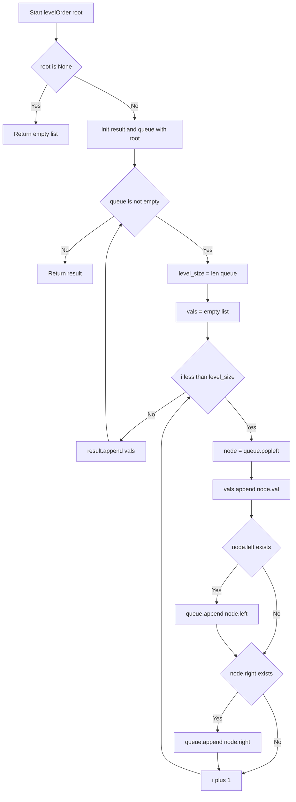

# Binary Tree Level Order Traversal - 木を階層ごとにグループ化する

---

## 目次（Table of Contents）

- [1. Overview](#overview)
- [2. Algorithm](#algorithm)
- [3. Complexity](#complexity)
- [4. Implementation](#implementation)
- [5. Optimization](#optimization)

---

<h2 id="overview">1. Overview</h2>

> 💡 **この問題は一言で言うと「木を上から下へ、同じ高さのノードをまとめてグループ化する問題」です。**

与えられた二分木（＝各ノードが最大2つの子を持つ木構造のデータ）のノードを、
**深さ（根からの距離）が同じものをひとつの配列にまとめ**、深さ順に並べた2次元配列を返します。

```
        3          ← 深さ0 → [3]
       / \
      9  20        ← 深さ1 → [9, 20]
         / \
        15   7     ← 深さ2 → [15, 7]

出力: [[3], [9, 20], [15, 7]]
```

**なぜこの問題が難しいのか：**
木構造を「縦（深さ方向）」に探索するのは直感的ですが、この問題は「横（同じ深さ）」の単位でまとめる必要があります。
そのため、**同じ深さにあるノードをすべて処理し終えてから次の深さへ進む**BFS（幅優先探索）という手法を使う必要があり、
その実現に `collections.deque` というデータ構造が鍵を握ります。

**制約：**

| 項目       | 範囲                                             |
| ---------- | ------------------------------------------------ |
| ノード数   | 0 以上 2000 以下                                 |
| ノードの値 | -1000 以上 1000 以下（**0 が含まれる点に注意**） |

> 📖 **この章で登場した用語**
>
> - **二分木**：各ノードが左の子・右の子の最大2つを持つ木構造のデータ
> - **深さ**：根ノードからそのノードまでの辺の数。根の深さは 0
> - **BFS（幅優先探索）**：グラフや木を「横方向に広がりながら」探索する方法
> - **制約**：入力として与えられる値の範囲や条件のこと

---

<h2 id="algorithm">2. Algorithm</h2>

> 💡 **TL;DR（Too Long; Didn't Read）** とは「長くて読めない人向けの要約」という意味です。
> ここではアルゴリズム全体の戦略をざっくり把握するための章です。

- **手法：BFS（幅優先探索）**
  木を「同じ深さのノードをすべて処理してから次の深さへ進む」順番で探索する。
  これが今回の「階層ごとのグループ化」と自然に一致するため選ぶ。

- **データ構造：`collections.deque`（両端キュー）**
  先頭からの取り出しが O(1) で行えるため、キュー（行列）として最適。
  `list.pop(0)` を使うと先頭取り出しが O(n) になり全体が O(n²) へ悪化するため使わない。

- **核心テクニック：`level_size = len(queue)` をループ前に固定する**
  ループ中にキューへの追加・取り出しが同時に起きるため、「今の階のサイズ」を先に変数へ保存しないとズレが生じる。

### 図解



### 正しさのスケッチ

1. **不変条件**：「while ループの各反復の開始時点で、`queue` には現在の階のノードだけが入っている」
    - `level_size` 回だけ `popleft()` することで今の階を全部処理し、その間に追加された子は「次の階」として末尾に積まれる。
2. **網羅性**：ルートから始まり、全ノードの左右の子をキューに積むため、存在する全ノードがちょうど1回処理される。
3. **基底条件**：`root is None` なら `[]` を返す。`while queue` で全ノード処理後に終了する。

---

<h2 id="complexity">3. Complexity</h2>

| 項目           | 値   | 理由                                                                         |
| -------------- | ---- | ---------------------------------------------------------------------------- |
| **時間計算量** | O(n) | 各ノードをキューへの追加・取り出しでちょうど1回ずつ処理する（各操作 O(1)）   |
| **空間計算量** | O(n) | `result` 配列と、最大で最下層のノード数（最大 n/2 個）を保持するキューのため |

---

<h2 id="implementation">4. Implementation</h2>

### Python 実装（業務開発版）

```python
from collections import deque
from typing import Optional

class Solution:
    def levelOrder(self, root: Optional[TreeNode]) -> list[list[int]]:
        if root is None:
            return []

        result: list[list[int]] = []
        queue: deque[TreeNode] = deque([root])

        while queue:
            level_size: int = len(queue)
            level_values: list[int] = []

            for _ in range(level_size):
                node: TreeNode = queue.popleft()
                level_values.append(node.val)

                if node.left is not None:
                    queue.append(node.left)
                if node.right is not None:
                    queue.append(node.right)

            result.append(level_values)

        return result
```

### エッジケースと検証観点

| ケース             | 入力          | 期待出力        | 対処箇所                     |
| ------------------ | ------------- | --------------- | ---------------------------- |
| 空ツリー           | `root = None` | `[]`            | `if root is None: return []` |
| `val = 0` のノード | `[0]`         | `[[0]]`         | `vals.append(node.val)`      |
| 偏った木 (左のみ)  | `1→2→3`       | `[[1],[2],[3]]` | `level_size` の固定          |

---

<h2 id="optimization">5. Optimization</h2>

### CPython 最適化ポイント

1. **`list.pop(0)` → `deque.popleft()`**:
   `list.pop(0)` は O(n) の要素シフトが発生し全体で O(n²) になるが、`deque.popleft()` は O(1) で動作する。
2. **`or` トリックの回避**:
   `0 or extend(...)` は `val=0`（falsy）のときに右辺を評価してしまい、戻り値 `None` がリストに混入するため、安全な `append()` を使用する。

### FAQ

- **Q: なぜ `level_size` を先に保存するのですか？**
    - **A**: ループ内で `append()` が行われるため、`len(queue)` が動的に増えてしまい、次の階のノードまで今の階として処理してしまうのを防ぐためです。
- **Q: DFS でも解けますか？**
    - **A**: はい。ただし「今どの深さにいるか」を引数で持ち回る必要があり、この問題には BFS の方が直感的で自然です。
