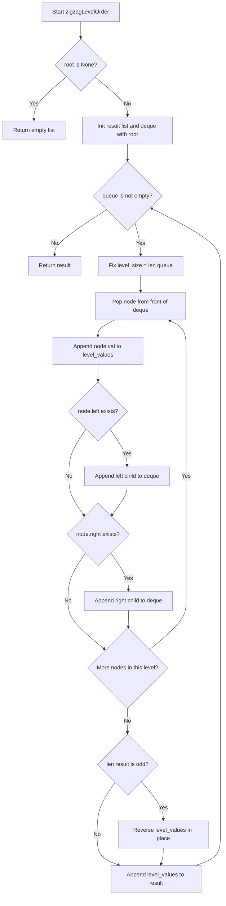
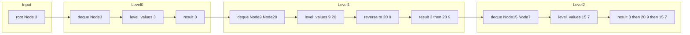

# Binary Tree Zigzag Level Order Traversal — BFS + 偶奇反転で階層をジグザグに読む

---

## 目次（Table of Contents）

- [Overview](#overview)
- [Algorithm](#algorithm)
- [Complexity](#complexity)
- [Implementation](#implementation)
- [Optimization](#optimization)

---

<h2 id="overview">Overview</h2>

> 💡 **この問題は一言で言うと**、「二分木を階層ごとに読み取り、偶数階層は左→右・奇数階層は右→左と **交互にジグザグ** で値を収集する問題」です。

### 問題の要件

- **入力**：二分木のルートノード `root`（`None` の場合は空ツリー）
- **出力**：各階層の値を格納した 2次元リスト `list[list[int]]`
    - 階層 0（ルート）：左→右
    - 階層 1：右→左
    - 階層 2：左→右
    - … 以降交互に繰り返す

### なぜこの問題が難しいのか

「木を階層ごとに読む（幅優先探索＝BFS）」自体は典型的な手法ですが、**「偶数・奇数階層で読む向きを変える」という追加条件**をどこで・どのように処理するかがポイントです。向きを間違えると隣接する階層の境界が崩れ、Wrong Answer になります。また Python では **キューの実装の選び方（`list` か `deque` か）** がパフォーマンスに直結します。

### 制約

| 項目       | 値                       |
| ---------- | ------------------------ |
| ノード数   | 0 以上 2000 以下         |
| ノードの値 | &minus;100 以上 100 以下 |

> 📖 **この章で登場した用語**
>
> - **BFS（幅優先探索）**：木やグラフを「階層ごと」に左から右へ順番に訪問する探索方法。キュー（待ち行列）を使う
> - **ルートノード**：木の最上位にあるノード（頂点）。木全体の出発点
> - **制約**：入力として与えられる値の範囲や条件のこと。例：「ノード数は 0 以上 2000 以下」

### 図解

> 💡 **Mermaid フローチャートの読み方**：
>
> - **長方形 `[]`**：何らかの処理を行うステップ
> - **ひし形 `{}`**：条件を判定する分岐点（Yes/No に分かれる）
> - **矢印 `-->`**：処理の流れの方向

#### フローチャート

この図は `zigzagLevelOrder` 関数全体の処理の流れを表しています。上から下へ読み進めてください。



**主要なノードの意味：**

- `NullCheck`：空ツリーを最初に弾くガード節。`None` なら即リターン
- `FixSize`：現在の階層のノード数を確定するステップ。ここで固定しないと次の階層のノードが混入する
- `InnerLoop`：deque の先頭からノードを O(1) で取り出す（`popleft()`）
- `OddCheck`：`len(result) % 2 == 1` で奇数階層かを判定。奇数なら逆順にする

---

#### データフロー図

この図は `root = [3, 9, 20, null, null, 15, 7]` を入力したとき、データがどのように変換されるかを表しています。



**主要な流れの説明：**

- **Level0**：ルートノード 3 を deque から取り出し、値 `[3]` を収集。`len(result)=0` は偶数なので逆順にしない
- **Level1**：ノード 9・20 を順に取り出し `[9, 20]` を収集。`len(result)=1` は奇数なので `reverse()` → `[20, 9]`
- **Level2**：ノード 15・7 を順に取り出し `[15, 7]` を収集。`len(result)=2` は偶数なので逆順にしない

---

> 💡 **代表例でのトレース**：`root = [3, 9, 20, null, null, 15, 7]` を入力として各ノードを通過する様子

```
初期状態:
  queue  = deque([Node(3)])
  result = []

─ Step 1: 階層 0（len(result)=0 → 偶数 → そのまま）─────────────
  level_size = 1
  popleft() → Node(3)、level_values = [3]
  → Node(9)  を queue の末尾に追加
  → Node(20) を queue の末尾に追加
  len(result)=0 → 偶数 → reverse しない
  result = [[3]]
  queue  = deque([Node(9), Node(20)])

─ Step 2: 階層 1（len(result)=1 → 奇数 → 逆順）────────────────
  level_size = 2
  popleft() → Node(9)、 level_values = [9]    （子なし）
  popleft() → Node(20)、level_values = [9, 20]
  → Node(15) を queue に追加
  → Node(7)  を queue に追加
  len(result)=1 → 奇数 → reverse() → [20, 9]
  result = [[3], [20, 9]]
  queue  = deque([Node(15), Node(7)])

─ Step 3: 階層 2（len(result)=2 → 偶数 → そのまま）────────────
  level_size = 2
  popleft() → Node(15)、level_values = [15]   （子なし）
  popleft() → Node(7)、 level_values = [15, 7]（子なし）
  len(result)=2 → 偶数 → reverse しない
  result = [[3], [20, 9], [15, 7]]
  queue  = deque([])  ← 空

while queue: → False → ループ終了
最終出力: [[3], [20, 9], [15, 7]] ✅
```

> 📖 **この章で登場した用語**
>
> - **フローチャート**：処理の手順を図形と矢印で表したもの。ひし形＝条件分岐、長方形＝処理ステップ
> - **データフロー図**：データがどのように変換・移動するかを示す図
> - **サブグラフ**：フローチャートの中で関連する処理をグループ化した区画

---

<h2 id="algorithm">Algorithm</h2>

### アルゴリズム要点（TL;DR）

> 💡 **TL;DR**（Too Long; Didn't Read）とは「長くて読めない人向けの要約」という意味です。
> ここでは「なんとなくこういう手順で解くんだな」というイメージを掴んでください。詳細は後の章で説明します。

1. **`root` が `None` ならすぐ `[]` を返す**（ガード節＝特殊ケースを先に弾く処理）
2. **`collections.deque` をキューとして使う**：`list.pop(0)` は O(n) コストがかかるため非効率。`deque.popleft()` は O(1) で取り出せる
3. **各階層の開始時点でノード数を固定する**：ループ中に子ノードをキューへ追加していくため、「今の階層のノード数」を事前に確定しないと次の階層と混在してしまう
4. **値を収集してから偶奇判定で逆順にする**：`list.reverse()` は元のリストを直接書き換える in-place 操作なので、新しいリストを作る `[::-1]` より高速
5. **全階層を処理したら結果リストを返す**

- **選択したデータ構造**：`collections.deque`（キュー）、`list`（各階層の値収集）
- **時間計算量**：O(n)
- **空間計算量**：O(n)

> 📖 **この章で登場した用語**
>
> - **ガード節（早期リターン）**：関数の冒頭で特殊ケースをチェックし、すぐ `return` する書き方。後続の処理をシンプルに保てる
> - **in-place 操作**：新しいメモリを確保せず、元のデータを直接書き換える操作。`list.reverse()` がその代表例
> - **O(1)**：入力の大きさに関わらず、常に一定時間で完了する操作の意味
> - **TL;DR**：「長すぎて読めない人向けの要約」を意味する略語

### 正しさのスケッチ

> 💡 「なぜこのアルゴリズムで必ず正しい答えが出るのか」の証明の道筋です。

1. **BFSによる階層の分離**: `for _ in range(level_size)` ループによって、キューの先頭から現在階層のノードのみを正確にすべて取り出し、次の階層のノードが混ざることを防ぎます。この時点で、「階層ごとのデータ」は正しくグループ化されます。
2. **偶奇の正確な判定**: `result` の長さは「すでに処理が終わった階層の数」と一致します。したがって、ルート（階層0）を処理しているときは `len(result) == 0`（偶数）、次の階層1を処理しているときは `len(result) == 1`（奇数）となり、これによって偶奇階層の判定を誤差なく行えます。
3. **反転の適用**: 各階層の値を（まずは左から右へ）すべて `level_values` に収集しきった後で、上記の偶奇判定に基づいて `reverse()` を行います。キューに入れる時点（子ノードを left, right の順に入れる）では常に左から右へ巡回し、結果を保存する直前にだけ配列を逆順にするため、木を探索するロジック自体を複雑にすることなくジグザグの要件を満たせます。
4. **有限性と停止**: 木のノード数は有限であり、各ノードはキューに一度だけ入り、一度だけ取り出されます。そのため、無限ループに陥ることなく O(n) で必ず停止します。

---

<h2 id="complexity">Complexity</h2>

- **時間計算量（Time Complexity）：O(n)**
    - 木の全てのノードをちょうど1回ずつキューに入れ、1回ずつ取り出します。各ノードでの処理（`popleft()`, 子ノードの `append()`, 値の取得）は O(1) です。
    - 各階層で `reverse()` を行う場合がありますが、すべての階層のノード数の合計は n になるため、`reverse()` にかかる総時間も O(n) です。
    - したがって、全体としての時間計算量は O(n) となります。
- **空間計算量（Space Complexity）：O(n)**
    - キューのサイズは、二分木の最大の幅（完全二分木の場合は葉の数 ≈ n/2）に等しくなります。これは最悪ケースで O(n) のメモリを消費します。
    - また、最終的な結果配列 `result` も n 個の要素の値を保持するため O(n) のメモリを必要とします。
    - したがって、全体としての空間計算量は O(n) となります。

---

<h2 id="implementation">Implementation</h2>

### Python 実装

業務で保守・運用しやすく、バグを防ぐことを重視した「業務コード版」です。型ヒントやエッジケース（特殊な入力）への安全な対応が含まれています。

```python
from collections import deque
from typing import Optional

# TreeNode は LeetCode 側で定義されている前提としますが、
# 手元で動かす際のために型チェック時のみ読み込むように定義します。
from typing import TYPE_CHECKING
if TYPE_CHECKING:
    class TreeNode:
        val: int
        left: Optional['TreeNode']
        right: Optional['TreeNode']
        def __init__(self, val=0, left=None, right=None) -> None: ...

class Solution:
    def zigzagLevelOrder(self, root: Optional['TreeNode']) -> list[list[int]]:
        """
        二分木を BFS で階層ごとに探索し、奇数階層（1, 3, ...）のみ逆順にして返す。
        """
        # 1. ガード節：空のツリーに対する処理
        # root が None の場合、後続処理で属性アクセス (.val) をするとエラーになるため
        # 早期に空のリストを返して関数を終了します。
        if root is None:
            return []

        # 結果を格納する2次元リスト
        result: list[list[int]] = []

        # 2. キューの初期化
        # 探索するノードを一時的に保持する待ち行列。最初は root のみを入れておきます。
        queue = deque([root])

        # 3. BFS メインループ
        # キューに未処理のノードが残っている限りループを継続します。
        while queue:
            # 現在の階層に含まれるノード数を固定します。
            # ループ内でキューに子ノードを追加していくため、ここで固定しないと
            # 「次の階層のノード」まで今回処理してしまいます。
            level_size = len(queue)

            # 現在の階層の値を一時的に格納するリスト
            level_values: list[int] = []

            # 現在の階層の全ノードに対して処理を行います
            for _ in range(level_size):
                # キューの先頭からノードを取り出す (O(1) 操作)
                node = queue.popleft()

                # ノードの値を収集
                level_values.append(node.val)

                # 左の子が存在すればキューに追加
                if node.left is not None:
                    queue.append(node.left)

                # 右の子が存在すればキューに追加
                if node.right is not None:
                    queue.append(node.right)

            # 4. 偶奇判定と逆順化
            # result の長さが「処理済みの階層数」を表します。
            # 例えば result が空 (長さ 0) の時は階層 0 なので偶数です。
            # 長さが奇数 (1, 3, 5...) の場合は、今収集したリストを逆順にします。
            if len(result) % 2 == 1:
                # [::-1] で新しいリストを作るよりも、元のリストを直接操作する
                # reverse() の方がわずかにメモリ効率が良いです。
                level_values.reverse()

            # 5. 処理が完了した階層を最終結果に追加
            result.append(level_values)

        # 全ての階層の処理が完了したら結果を返します
        return result
```

### エッジケースと検証観点

> 💡 **エッジケース**：通常とは異なる極端な入力パターン。システムをクラッシュさせやすい。

| ケース                   | 内容                           | 対応方法                                                                      |
| ------------------------ | ------------------------------ | ----------------------------------------------------------------------------- |
| `root = None`            | 空ツリー                       | 関数の先頭で `if root is None: return []` として早期リターンする。            |
| 左または右に偏ったツリー | 全てのノードが一列に並んでいる | 階層サイズが常に1となり、奇数・偶数が毎回反転し続けるが、問題なく処理できる。 |
| 1ノードのみ              | `root` だけが存在し子がいない  | 最初の `while` ループで1回だけ実行され、`[[root.val]]` を返す。               |
| ノードの値が負の数       | `root.val < 0` など            | 値の正負はアルゴリズムの制御フローに影響を与えない。                          |

### FAQ

> 💡 よくある疑問とその回答

- **Q: なぜ `len(result) % 2 == 1` で奇数階層と判定できるのですか？**
    - A: `result` は処理が完了した階層を格納していくリストです。まだ1つも格納していない最初の階層（階層 0）を処理しているとき、`len(result)` は 0 です（偶数）。階層 0 の処理が終わって `result` に追加されると `len(result)` は 1 になります。次に階層 1 を処理するときには `len(result)` は 1（奇数）になります。つまり、`len(result)` は「現在処理している階層のインデックス（0番目から数えた番号）」と常に一致するため、これで偶奇を正しく判定できます。
- **Q: 階層ごとに `deque` を作り直す方法はダメですか？**
    - A: ダメではありませんが、メモリの確保と破棄が毎階層発生するため、1つの `deque` を使い回し、`level_size` を使って境界を区切る方が一般的に高速でメモリ効率も良いです。
- **Q: 左から右へ探索するのではなく、奇数階層のときは右から左へ探索するようにキューに入れる順番を変えれば、`reverse()` しなくて済むのでは？**
    - A: 可能ですが、コードが非常に複雑になります。「キューのどちら側から出し入れするか」「子を右・左どちらから追加するか」を階層ごとに切り替える必要があり（双方向キューを活用した蛇腹式のBFS）、バグを生みやすくなります。まずは「すべて左から右へ収集し、最後だけ `reverse()` する」というアプローチがシンプルで確実です。

---

<h2 id="optimization">Optimization</h2>

### CPython 最適化ポイント

> 💡 **Python 特有の言語仕様** を活かして、より安全・高速に書くためのコツです。

1. **リストの先頭削除を避ける（`collections.deque` の利用）**:
    - Python の標準リスト `list` は配列（連続したメモリ領域）として実装されています。
    - `list.pop(0)` を行うと、先頭の要素を削除した後、残りのすべての要素を1つずつ前にずらす必要があり、**O(n) の時間**がかかります。
    - これをループの中で繰り返すと、全体の計算量が O(n^2) に悪化してしまいます。
    - `collections.deque`（両端キュー）は双方向連結リストとして実装されており、先頭からの削除 `popleft()` を **O(1)** で行えます。BFS を実装する際は、Python では必ず `deque` を使用してください。
2. **インプレース（破壊的）な逆順化（`list.reverse()` vs `[::-1]`）**:
    - リストを逆順にする方法として、スライス `[::-1]` もよく使われます。
    - しかし、`[::-1]` は「逆順に並んだ**新しいリスト**をメモリ上に作成」します。
    - 一方 `list.reverse()` は、新しいメモリ領域を確保せず、元のリストの要素の並びだけを直接書き換えます（インプレース操作）。
    - BFS で各階層のリストが大きくなる場合、メモリの割り当てと解放（ガベージコレクション）のオーバーヘッドを避けるため、`reverse()` を使う方がわずかに高速でメモリ効率に優れます。
3. **`is None` による明示的な Null チェック**:
    - `if not node.left:` よりも `if node.left is not None:` の方が、意図が明確であり、処理系にとってもごく僅かですが判定が高速になる場合があります（Python において `None` はシングルトンであり、メモリアドレスの比較だけで済むため）。
    - 特に「値が `0` のノード」などが存在する場合、`if not node.val:` と書いてしまうとバグになるため、オブジェクトの存在確認は `is None` または `is not None` を使う習慣が安全です。
