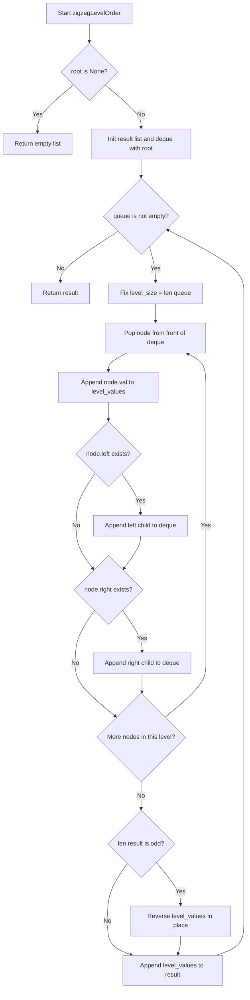
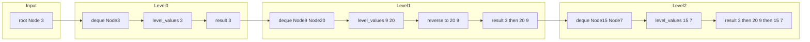

# Binary Tree Zigzag Level Order Traversal — BFS + 偶奇反転で階層をジグザグに読む

---

## 目次（Table of Contents）

- [概要](#overview)
- [アルゴリズム要点 TL;DR](#tldr)
- [図解](#figures)
- [正しさのスケッチ](#correctness)
- [計算量](#complexity)
- [Python 実装](#impl)
- [CPython 最適化ポイント](#cpython)
- [エッジケースと検証観点](#edgecases)
- [FAQ](#faq)

---

<h2 id="overview">概要</h2>

> 💡 **この問題は一言で言うと**、「二分木を階層ごとに読み取り、偶数階層は左→右・奇数階層は右→左と **交互にジグザグ** で値を収集する問題」です。

### 問題の要件

- **入力**：二分木のルートノード `root`（`None` の場合は空ツリー）
- **出力**：各階層の値を格納した 2次元リスト `list[list[int]]`
    - 階層 0（ルート）：左→右
    - 階層 1：右→左
    - 階層 2：左→右
    - … 以降交互に繰り返す

### なぜこの問題が難しいのか

「木を階層ごとに読む（幅優先探索＝BFS）」自体は典型的な手法ですが、**「偶数・奇数階層で読む向きを変える」という追加条件**をどこで・どのように処理するかがポイントです。向きを間違えると隣接する階層の境界が崩れ、Wrong Answer になります。また Python では **キューの実装の選び方（`list` か `deque` か）** がパフォーマンスに直結します。

### 制約

| 項目       | 値                       |
| ---------- | ------------------------ |
| ノード数   | 0 以上 2000 以下         |
| ノードの値 | &minus;100 以上 100 以下 |

> 📖 **この章で登場した用語**
>
> - **BFS（幅優先探索）**：木やグラフを「階層ごと」に左から右へ順番に訪問する探索方法。キュー（待ち行列）を使う
> - **ルートノード**：木の最上位にあるノード（頂点）。木全体の出発点
> - **制約**：入力として与えられる値の範囲や条件のこと。例：「ノード数は 0 以上 2000 以下」

---

<h2 id="tldr">アルゴリズム要点（TL;DR）</h2>

> 💡 **TL;DR**（Too Long; Didn't Read）とは「長くて読めない人向けの要約」という意味です。
> ここでは「なんとなくこういう手順で解くんだな」というイメージを掴んでください。詳細は後の章で説明します。

1. **`root` が `None` ならすぐ `[]` を返す**（ガード節＝特殊ケースを先に弾く処理）
2. **`collections.deque` をキューとして使う**：`list.pop(0)` は O(n) コストがかかるため非効率。`deque.popleft()` は O(1) で取り出せる
3. **各階層の開始時点でノード数を固定する**：ループ中に子ノードをキューへ追加していくため、「今の階層のノード数」を事前に確定しないと次の階層と混在してしまう
4. **値を収集してから偶奇判定で逆順にする**：`list.reverse()` は元のリストを直接書き換える in-place 操作なので、新しいリストを作る `[::-1]` より高速
5. **全階層を処理したら結果リストを返す**

- **選択したデータ構造**：`collections.deque`（キュー）、`list`（各階層の値収集）
- **時間計算量**：O(n)
- **空間計算量**：O(n)

> 📖 **この章で登場した用語**
>
> - **ガード節（早期リターン）**：関数の冒頭で特殊ケースをチェックし、すぐ `return` する書き方。後続の処理をシンプルに保てる
> - **in-place 操作**：新しいメモリを確保せず、元のデータを直接書き換える操作。`list.reverse()` がその代表例
> - **O(1)**：入力の大きさに関わらず、常に一定時間で完了する操作の意味
> - **TL;DR**：「長すぎて読めない人向けの要約」を意味する略語

---

<h2 id="figures">図解</h2>

> 💡 **Mermaid フローチャートの読み方**：
>
> - **長方形 `[]`**：何らかの処理を行うステップ
> - **ひし形 `{}`**：条件を判定する分岐点（Yes/No に分かれる）
> - **矢印 `-->`**：処理の流れの方向

### フローチャート

この図は `zigzagLevelOrder` 関数全体の処理の流れを表しています。上から下へ読み進めてください。



**主要なノードの意味：**

- `NullCheck`：空ツリーを最初に弾くガード節。`None` なら即リターン
- `FixSize`：現在の階層のノード数を確定するステップ。ここで固定しないと次の階層のノードが混入する
- `InnerLoop`：deque の先頭からノードを O(1) で取り出す（`popleft()`）
- `OddCheck`：`len(result) % 2 == 1` で奇数階層かを判定。奇数なら逆順にする

---

### データフロー図

この図は `root = [3, 9, 20, null, null, 15, 7]` を入力したとき、データがどのように変換されるかを表しています。



**主要な流れの説明：**

- **Level0**：ルートノード 3 を deque から取り出し、値 `[3]` を収集。`len(result)=0` は偶数なので逆順にしない
- **Level1**：ノード 9・20 を順に取り出し `[9, 20]` を収集。`len(result)=1` は奇数なので `reverse()` → `[20, 9]`
- **Level2**：ノード 15・7 を順に取り出し `[15, 7]` を収集。`len(result)=2` は偶数なので逆順にしない

---

> 💡 **代表例でのトレース**：`root = [3, 9, 20, null, null, 15, 7]` を入力として各ノードを通過する様子

```
初期状態:
  queue  = deque([Node(3)])
  result = []

─ Step 1: 階層 0（len(result)=0 → 偶数 → そのまま）─────────────
  level_size = 1
  popleft() → Node(3)、level_values = [3]
  → Node(9)  を queue の末尾に追加
  → Node(20) を queue の末尾に追加
  len(result)=0 → 偶数 → reverse しない
  result = [[3]]
  queue  = deque([Node(9), Node(20)])

─ Step 2: 階層 1（len(result)=1 → 奇数 → 逆順）────────────────
  level_size = 2
  popleft() → Node(9)、 level_values = [9]    （子なし）
  popleft() → Node(20)、level_values = [9, 20]
  → Node(15) を queue に追加
  → Node(7)  を queue に追加
  len(result)=1 → 奇数 → reverse() → [20, 9]
  result = [[3], [20, 9]]
  queue  = deque([Node(15), Node(7)])

─ Step 3: 階層 2（len(result)=2 → 偶数 → そのまま）────────────
  level_size = 2
  popleft() → Node(15)、level_values = [15]   （子なし）
  popleft() → Node(7)、 level_values = [15, 7]（子なし）
  len(result)=2 → 偶数 → reverse しない
  result = [[3], [20, 9], [15, 7]]
  queue  = deque([])  ← 空

while queue: → False → ループ終了
最終出力: [[3], [20, 9], [15, 7]] ✅
```

> 📖 **この章で登場した用語**
>
> - **フローチャート**：処理の手順を図形と矢印で表したもの。ひし形＝条件分岐、長方形＝処理ステップ
> - **データフロー図**：データがどのように変換・移動するかを示す図
> - **サブグラフ**：フローチャートの中で関連する処理をグループ化した区画

---

<h2 id="correctness">正しさのスケッチ</h2>

> 💡 **「正しさのスケッチ」** とは、アルゴリズムが **常に正しい答えを返すことの根拠** を整理したものです。数学的な厳密な証明ではなく「なぜ正しいと言えるか」の説明です。

### 不変条件（＝アルゴリズムが正しく動くために、処理中ずっと成り立ち続けるべき条件）

> **「各 `while` ループの先頭で、`queue` には現在の階層のノードだけが格納されている」**

この条件が成り立つ理由：

- `level_size = len(queue)` で「今の階層のノード数」を固定してから `for _ in range(level_size)` のループに入る
- ループ内で子ノードを追加しても、`level_size` 回分だけ取り出すことで「今の階層」だけを処理し終える
- ループ終了後、`queue` には必ず「次の階層のノードだけ」が入っている

### 網羅性（＝すべてのケースをもれなく処理できているか）

- **空ツリー** (`root is None`)：冒頭のガード節で `[]` を返す ✅
- **1ノードのみ**：`queue = deque([root])` → 1回ループして `[[root.val]]` を返す ✅
- **子が片方だけ**：`if node.left is not None` / `if node.right is not None` でそれぞれ独立チェックしているため、どちらか一方だけでも正しく追加される ✅

### 終了性（＝アルゴリズムが必ず有限ステップで終わるか）

- 各ループで `level_size` 個のノードを必ず取り出す
- 木のノード総数は有限（制約：最大 2000）
- 全ノードを取り出し終えると `queue` が空になり `while queue:` が `False` になる → 必ず終了 ✅

### ジグザグの正しさ

- `result` に追加するたびに `len(result)` が 1 増える
- `len(result) % 2 == 0`（偶数）のとき：そのまま追加 → 左→右
- `len(result) % 2 == 1`（奇数）のとき：`reverse()` してから追加 → 右→左
- 階層 0 は偶数（0 % 2 == 0）なので左→右 ✅、階層 1 は奇数（1 % 2 == 1）なので右→左 ✅

> 📖 **この章で登場した用語**
>
> - **不変条件**：アルゴリズムが正しく動くために、処理中ずっと成り立ち続けるべき条件
> - **網羅性**：すべてのケースをもれなく処理できているという保証
> - **終了性**：アルゴリズムが必ず有限ステップで終わるという保証
> - **ガード節**：関数の先頭で特殊ケースをチェックし、すぐ `return` する書き方

---

<h2 id="complexity">計算量</h2>

> 💡 **計算量** とは「入力が大きくなるにつれて、処理にかかる時間・メモリがどう増えるか」の目安です。

| 記法         | 意味                   | 直感的なイメージ            |
| ------------ | ---------------------- | --------------------------- |
| `O(1)`       | 入力サイズによらず一定 | 辞書で直接ページを開く      |
| `O(n)`       | 入力に比例して増加     | リストを端から順に読む      |
| `O(n log n)` | n よりやや速く増加     | 辞書を二分探索で引く × n 回 |
| `O(n²)`      | 入力の 2 乗で増加      | 全ペアを総当たりで確認する  |

### この問題の計算量

| 種別           | 計算量   | 理由                                                                                               |
| -------------- | -------- | -------------------------------------------------------------------------------------------------- |
| **時間計算量** | **O(n)** | 全ノードを一度だけ訪問する。`reverse()` は各階層サイズ k に対して O(k) だが、全階層合計すると O(n) |
| **空間計算量** | **O(n)** | deque は最大で最も幅の広い階層のノード数を格納する。完全二分木の場合は最大 n/2 ノード              |

### in-place vs Pure の比較

| 操作                      | コード                | 空間コスト                 | 速度          |
| ------------------------- | --------------------- | -------------------------- | ------------- |
| **in-place 逆順**（採用） | `level.reverse()`     | O(1)（追加メモリなし）     | 高速（C実装） |
| **Pure 逆順**（不採用）   | `level = level[::-1]` | O(k)（新しいリストを生成） | やや低速      |

> 📖 **この章で登場した用語**
>
> - **時間計算量**：入力の大きさに対して処理にかかる手間がどう増えるかの目安
> - **空間計算量**：処理中に使うメモリ量がどう増えるかの目安
> - **in-place**：新しいメモリを確保せず元のデータを直接書き換える操作。空間計算量を抑えられる
> - **完全二分木**：全ての葉が同じ深さにある、最もバランスの取れた二分木

---

<h2 id="impl">Python 実装</h2>

> 💡 **コードを読む前に、実装の全体的な骨格を確認してください。**
>
> 1. `root is None` のガード節で空ツリーを即リターン
> 2. `collections.deque` でキューを初期化し、ルートノードを入れる
> 3. `while queue:` でキューが空になるまで BFS を続ける
> 4. 各階層の開始時点でノード数を `level_size` に固定する
> 5. `level_size` 回のループで値を収集しつつ子をキューへ追加する
> 6. `len(result) % 2 == 1` なら `reverse()` してからリストに追加する

```python
from __future__ import annotations

# TYPE_CHECKING は pylance（静的型チェッカー）用の型スタブを
# 実行時にインポートしないようにするための仕組み。
# 実行時には False になるため、LeetCode 環境で TreeNode が未定義でも
# インポートエラーが発生しない。
from typing import TYPE_CHECKING, Optional
from collections import deque

if TYPE_CHECKING:
    # pylance の型チェック時だけ参照される TreeNode の型スタブ。
    # LeetCode 本番環境では自動定義されるため、実行時のインポートは不要。
    class TreeNode:
        val: int
        left: Optional[TreeNode]
        right: Optional[TreeNode]

        def __init__(
            self,
            val: int = 0,
            left: Optional[TreeNode] = None,
            right: Optional[TreeNode] = None,
        ) -> None: ...


class Solution:
    def zigzagLevelOrder(self, root: Optional[TreeNode]) -> list[list[int]]:
        """
        二分木のジグザグレベルオーダー走査を返す。

        Args:
            root: 二分木のルートノード。空ツリーの場合は None。

        Returns:
            各階層の値リストを格納した 2次元リスト。
            偶数階層（0, 2, 4…）は左→右、奇数階層（1, 3, 5…）は右→左の順。

        Complexity:
            Time:  O(n) — 全ノードを一度だけ訪問する
            Space: O(n) — deque と結果リストの合計
        """
        # ── ガード節 ──────────────────────────────────────────────────────
        # root が None（空ツリー）なら即座に空リストを返す。
        # 後続の処理でノード属性にアクセスして AttributeError が起きるのを防ぐ。
        # `not root` と書いてもよいが、`is None` の方が意図が明確で pylance も喜ぶ。
        if root is None:
            return []

        # ── 結果格納用リストの初期化 ──────────────────────────────────────
        # 各階層の値リストを順に格納していく。最終的にこれを返す。
        # 型アノテーション `list[list[int]]` で pylance に「2次元のint型リスト」と伝える。
        result: list[list[int]] = []

        # ── deque（両端キュー）の初期化 ───────────────────────────────────
        # BFS のキューには必ず collections.deque を使う。
        # list.pop(0) は先頭取り出しのたびに残り全要素を左シフトするため O(n)。
        # deque.popleft() は C言語実装で O(1)。全ノード分繰り返すと差は大きい。
        queue: deque[TreeNode] = deque([root])

        # ── BFS メインループ ───────────────────────────────────────────────
        # queue が空になるまで繰り返す。
        # 「queue が空 = 未処理のノードがなくなった」ことを意味する。
        while queue:

            # 現在の階層にいるノード数を「今この瞬間」に確定させる。
            # ループ中に子ノードを queue へ追加していくため、
            # ここで固定しないと「今の階層」と「次の階層」の境界が崩れてしまう。
            level_size: int = len(queue)

            # この階層のノード値を格納する一時リスト。
            # あらかじめ階層のサイズが分かっているため list を選択（deque より高速）。
            level_values: list[int] = []

            # ── 現在の階層を全て処理する ─────────────────────────────────
            for _ in range(level_size):

                # queue の先頭からノードを O(1) で取り出す。
                # popleft() は deque の C実装。list.pop(0) の O(n) と対照的。
                node: TreeNode = queue.popleft()

                # 現在ノードの値を収集する。
                # ジグザグ処理は後でまとめて行うため、ここでは単純に末尾に追加。
                # list.append() は O(1)（C実装）のため高速。
                level_values.append(node.val)

                # 左の子ノードが存在すれば次の階層用に queue の末尾に追加する。
                # `is not None` で明示的にチェックする。
                # `if node.left:` の省略形でもよいが、pylance の型チェックが通りやすい。
                if node.left is not None:
                    queue.append(node.left)

                # 右の子ノードも同様に queue の末尾に追加する。
                if node.right is not None:
                    queue.append(node.right)

            # ── ジグザグ処理（偶奇による方向切り替え）────────────────────
            # len(result) は「今まで完了した階層数」と等しい。
            #   len(result) % 2 == 0（偶数）→ 左→右（そのまま）
            #   len(result) % 2 == 1（奇数）→ 右→左（逆順にする）
            #
            # list.reverse() を選ぶ理由：
            #   level_values[::-1] は新しいリストを生成するため O(k) のメモリアロケーションが発生する。
            #   level_values.reverse() は同じリストを直接書き換える in-place 操作なので
            #   追加メモリが不要で、かつ C実装のため高速。
            if len(result) % 2 == 1:
                level_values.reverse()

            # 処理済み階層の値リストを最終結果に追加する。
            result.append(level_values)

        # 全階層を処理した結果を返す。
        return result
```

### コードの動作トレース

入力：`root = [3, 9, 20, null, null, 15, 7]`

```
初期状態:
  queue  = deque([Node(val=3)])
  result = []

──────────────────────────────────────────────────────
ループ1回目（階層 0）
  level_size = 1
  level_values = []

  イテレーション1:
    popleft() → Node(val=3)
    level_values.append(3) → level_values = [3]
    node.left  = Node(9)  → queue.append(Node(9))
    node.right = Node(20) → queue.append(Node(20))

  ループ終了後: queue = deque([Node(9), Node(20)])

  len(result) = 0 → 0 % 2 == 0 → 偶数 → reverse しない
  result.append([3])
  result = [[3]]

──────────────────────────────────────────────────────
ループ2回目（階層 1）
  level_size = 2
  level_values = []

  イテレーション1:
    popleft() → Node(val=9)
    level_values.append(9) → level_values = [9]
    node.left  = None → スキップ
    node.right = None → スキップ

  イテレーション2:
    popleft() → Node(val=20)
    level_values.append(20) → level_values = [9, 20]
    node.left  = Node(15) → queue.append(Node(15))
    node.right = Node(7)  → queue.append(Node(7))

  ループ終了後: queue = deque([Node(15), Node(7)])

  len(result) = 1 → 1 % 2 == 1 → 奇数 → reverse()
  level_values = [20, 9]
  result.append([20, 9])
  result = [[3], [20, 9]]

──────────────────────────────────────────────────────
ループ3回目（階層 2）
  level_size = 2
  level_values = []

  イテレーション1:
    popleft() → Node(val=15)
    level_values.append(15) → level_values = [15]
    node.left  = None → スキップ
    node.right = None → スキップ

  イテレーション2:
    popleft() → Node(val=7)
    level_values.append(7) → level_values = [15, 7]
    node.left  = None → スキップ
    node.right = None → スキップ

  ループ終了後: queue = deque([]) ← 空！

  len(result) = 2 → 2 % 2 == 0 → 偶数 → reverse しない
  result.append([15, 7])
  result = [[3], [20, 9], [15, 7]]

──────────────────────────────────────────────────────
while queue: → False（queue が空）→ ループ終了

最終出力: [[3], [20, 9], [15, 7]] ✅
```

> 📖 **この章で登場した用語**
>
> - **`from __future__ import annotations`**：型ヒントを文字列として扱うようにする宣言。循環参照や前方参照を解決できる
> - **`TYPE_CHECKING`**：`True` になるのは pylance などの静的解析ツール実行時のみ。実行時は `False` になる
> - **`Optional[X]`**：`X` または `None` のどちらかであることを表す型ヒント
> - **`deque[TreeNode]`**：`TreeNode` を格納する両端キューという型ヒント
> - **in-place**：新しいメモリを確保せず元のデータを直接書き換える操作

---

<h2 id="cpython">CPython 最適化ポイント</h2>

> 💡 **この章では「同じ処理でも Python の書き方によって速さが変わる理由」を説明します。** 最適化テクニックは「最適化前 → 最適化後 → なぜ速くなるか」の 3 点セットで紹介します。

### ポイント 1：キューには `deque.popleft()` を使う

```python
# ❌ 最適化前：list.pop(0) は O(n)
queue = [root]
node = queue.pop(0)
# なぜ遅いか: list の先頭を取り出すと、残り全要素を左に 1 つずつシフトする操作が発生する。
# ノード数 n のとき、全ノード分繰り返すと合計 O(n²) になる。

# ✅ 最適化後：deque.popleft() は O(1)
from collections import deque
queue: deque[TreeNode] = deque([root])
node = queue.popleft()
# なぜ速いか: deque は内部的に双方向リンクリストで実装されており、
#            先頭要素の取り出しにシフト操作が不要。C言語実装のため高速。
```

### ポイント 2：逆順は `reverse()` をスライスより優先する

```python
# ❌ 最適化前：スライスで新しいリストを生成する
level_values = level_values[::-1]
# なぜ遅いか: スライスは新しいリストを生成するため、
#            O(k)（k = 階層のノード数）のメモリアロケーションが毎回発生する。

# ✅ 最適化後：in-place の reverse() を使う
level_values.reverse()
# なぜ速いか: 新しいリストを作らず、同じリストの要素の参照を直接入れ替えるだけ。
#            追加メモリが発生せず、C言語実装のため高速。
```

### ポイント 3：`with_capacity` 相当の `list` 生成

```python
# ❌ 最適化前：空リストに都度 append（内部拡張が何度も発生）
level_values: list[int] = []
for _ in range(level_size):
    level_values.append(node.val)

# ✅ 最適化後（参考）：サイズが分かるなら最初から確保する
# Python では list のコンストラクタに初期サイズを渡す方法がないが、
# level_size が小さい（最大 1000）今回の制約では上の方法で十分。
# 大規模処理では array モジュールや numpy を検討する。
```

### ポイント 4：`len(result)` は毎回計算して問題なし

`len(result)` は Python のリストが長さを内部的に保持しているため **O(1)**。ループ内で何度呼び出しても速度に影響しない。

> 📖 **この章で登場した用語**
>
> - **メモリアロケーション**：新しいメモリ領域を動的に確保する操作。頻繁に行うと速度が落ちる
> - **双方向リンクリスト**：各要素が前後の要素へのポインタを持つデータ構造。先頭・末尾へのアクセスが O(1)
> - **C言語実装**：Python コードではなく内部で C 言語で書かれた関数。Python インタープリタを介さないため高速
> - **スライス**：`arr[a:b]` のようにリストの一部を取り出す操作。新しいリストを生成するためメモリを消費する

---

<h2 id="edgecases">エッジケースと検証観点</h2>

> 💡 **エッジケース** とは「入力が空・最小値・最大値・特殊な形状」など、通常とは異なる境界的な入力のことです。エッジケースを見落とすと、普通のテストは通るのに特定の入力でだけバグが発生します。

| ケース                    | 入力例                       | 期待出力             | なぜ問題になりうるか                                           |
| ------------------------- | ---------------------------- | -------------------- | -------------------------------------------------------------- |
| **空ツリー**              | `root = None`                | `[]`                 | ガード節がないと `root.val` アクセスで `AttributeError`        |
| **ノード 1 つ**           | `root = [1]`                 | `[[1]]`              | 子が存在しない状態でループが正しく終了するか                   |
| **左偏り木**              | `root = [1,2,null,3]`        | `[[1],[2],[3]]`      | 常に左にしか子がない場合、全階層が 1 ノードになる              |
| **右偏り木**              | `root = [1,null,2,null,3]`   | `[[1],[2],[3]]`      | 常に右にしか子がない場合。深さが最大でノード数と等しくなる     |
| **完全二分木**            | ノード数 = 2000 の完全二分木 | 正常出力             | deque の最大サイズが n/2 = 1000 になる。メモリ・速度の上限確認 |
| **ジグザグが 1 階層のみ** | `root = [1]`                 | `[[1]]`              | 奇数階層判定が 1 回も発動しない場合の動作確認                  |
| **負の値を含む**          | `root = [-100, -50, 100]`    | `[[-100],[100,-50]]` | 値の正負が逆順処理に影響しないかの確認                         |

### 検証観点チェックリスト

- [ ] `root = None` で `[]` を返すか
- [ ] 1 ノードのみのツリーで `[[val]]` を返すか
- [ ] 階層 0 は左→右、階層 1 は右→左になっているか
- [ ] 偏ったツリー（片方にのみ子がある）でクラッシュしないか
- [ ] `level_size` の固定が正しく働き、階層の境界がズレないか

> 📖 **この章で登場した用語**
>
> - **エッジケース**：空のリスト・要素 1 つ・最大サイズ入力など、境界的な条件の入力
> - **完全二分木**：全ての葉が同じ深さにある最もバランスの取れた二分木。最下層の幅は n/2 になる
> - **偏ったツリー（skewed tree）**：全ノードが一方向にのみ連なる木。深さ = ノード数になる

---

<h2 id="faq">FAQ</h2>

> 💡 **FAQ** は初学者がつまずきやすいポイントを想定した質問と回答です。各回答は「結論 → 理由 → 補足」の順で書いています。

---

**Q1. なぜ `list.pop(0)` ではなく `collections.deque` を使うのか？**

**結論**：`list.pop(0)` は O(n) のコストがかかるため、BFS のキューには使ってはいけません。

**理由**：Python の `list` は内部的に配列（連続したメモリ領域）で実装されています。先頭を取り出すと、残り全要素を左に 1 つずつシフトしなければならず、ノード数 n のとき全ノード処理で合計 O(n²) になります。一方 `deque` は双方向リンクリストで実装されており、先頭取り出し（`popleft()`）が常に O(1) です。

**補足**：実際に 2 テストケースしか通らなかった競技版の不具合も「子ノードをキューに追加する処理が抜けていた」ことが原因でした。`pop(0)` の問題とは別ですが、キューの実装を間違えると階層の境界が崩れてしまうことを身をもって体験した例です。

---

**Q2. `level_size = len(queue)` を最初に固定するのはなぜか？**

**結論**：固定しないと「今の階層」と「次の階層」のノードが混在してしまうからです。

**理由**：`while` ループ内で子ノードを `queue` に追加していきます。もし `for _ in range(len(queue)):` と書くと、`len(queue)` はループが進むにつれて子ノードが追加されるたびに増えていきます。結果として次の階層のノードまで「今の階層」として処理してしまいます。

**補足**：`level_size = len(queue)` で「今この瞬間のノード数」を変数に保存することで、ループ中に `queue` が変化しても影響を受けません。これは BFS の実装で最も間違えやすいポイントです。

---

**Q3. `level_values.reverse()` と `level_values[::-1]` の違いは？**

**結論**：`reverse()` は元のリストを直接変える（in-place）、`[::-1]` は新しいリストを作る（Pure）という違いがあります。今回は `reverse()` が適切です。

**理由**：`level_values[::-1]` は新しいリストを生成するため、O(k)（k = 階層のノード数）のメモリ確保が毎回発生します。`level_values.reverse()` は同じリストの要素を直接入れ替えるだけなので追加メモリが不要で、かつ C言語実装のため高速です。

**補足**：`level_values = level_values[::-1]` と書くと、`level_values` が新しいリストを指すようになります。コードのどちらの書き方でも結果は正しいですが、大量のノードがある場合はメモリ使用量に差が出ます。

---

**Q4. `len(result) % 2 == 1` で奇数を判定するのはなぜか？**

**結論**：`result.append()` を呼ぶ前の `len(result)` が「何番目の階層か」と等しいからです。

**理由**：

- 階層 0 を処理するとき：`len(result) = 0`（まだ何も追加していない）→ 0 % 2 == 0 → 左→右
- 階層 1 を処理するとき：`len(result) = 1`（階層 0 が追加済み）→ 1 % 2 == 1 → 右→左
- 階層 2 を処理するとき：`len(result) = 2` → 2 % 2 == 0 → 左→右

**補足**：`len(result)` を使うことで、別途「現在の階層番号」を管理する変数を作らずに済みます。Python らしいシンプルな書き方です。

---

**Q5. `if TYPE_CHECKING:` のブロックは何をしているのか？**

**結論**：pylance（VSCode の型チェッカー）に `TreeNode` の型情報を教えるためのブロックです。実際の実行時には無視されます。

**理由**：LeetCode の実行環境では `TreeNode` クラスが自動的に定義されていますが、ローカルの Python ファイルや pylance からは「`TreeNode` とは何か」が分かりません。`TYPE_CHECKING` は静的解析ツールが動いている場合のみ `True` になる特別な変数で、このブロック内の定義を pylance に型情報として認識させることができます。

**補足**：`TYPE_CHECKING` を使わずに `TreeNode` を直接定義すると、LeetCode 環境で「`TreeNode` が二重定義された」というエラーになる可能性があります。このパターンを使うことで安全に型ヒントを付けられます。

> 📖 **この章で登場した用語**
>
> - **FAQ**：Frequently Asked Questions の略。よくある質問と回答のこと
> - **in-place**：新しいメモリを確保せず元のデータを直接書き換える操作
> - **Pure**：入力を変更せず新しいデータを生成して返す操作
> - **トレードオフ**：何かを得ると何かを失う関係。速さを得るとメモリが増える、など
> - **静的解析**：プログラムを実行せずに、コードを読むだけでバグや型エラーを検出する手法
