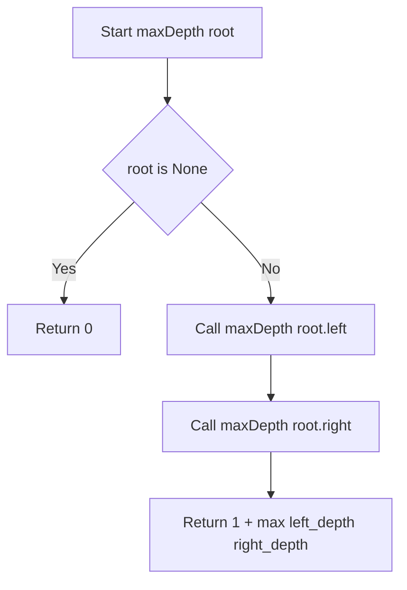
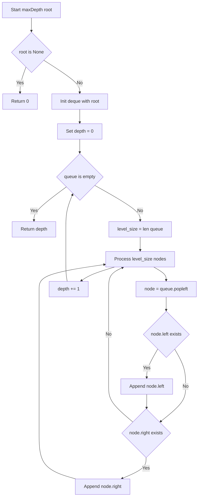
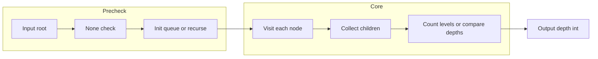

# Maximum Depth of Binary Tree — 木の最大深さを再帰・BFSで求める

---

## 目次（Table of Contents）

- [概要](#overview)
- [アルゴリズム要点 TL;DR](#tldr)
- [図解](#figures)
- [正しさのスケッチ](#correctness)
- [計算量](#complexity)
- [Python 実装](#impl)
- [CPython 最適化ポイント](#cpython)
- [エッジケースと検証観点](#edgecases)
- [FAQ](#faq)

---

<h2 id="overview">概要</h2>

> 💡 この問題は、一言で言うと「木（ツリー）の一番深いところまで何段あるかを数える問題」です。

### 問題の要約

与えられた二分木（＝各ノードが最大2つの子「左・右」を持つ木構造データ）の根（root）から、
一番遠い**葉ノード**（＝子を持たない末端のノード）までのノード数を返してください。

```
例1:
        3          ← 深さ 1（根・root）
       / \
      9  20        ← 深さ 2
        /  \
       15   7      ← 深さ 3（葉ノード）

最大深さ = 3

例2:
    1              ← 深さ 1
     \
      2            ← 深さ 2

最大深さ = 2
```

### なぜこの問題が重要か

「木の深さ」を求めるには、**すべてのノードを1回は必ず訪問しなければならない**という点がポイントです。
単純に数を数えるだけでなく、「左の部分木」と「右の部分木」のどちらがより深いかを比較しながら
探索していく必要があります。この「比較しながら探索する」という考え方が、
後述する再帰DFSやBFSの核心になります。

### 制約

| 項目       | 内容               |
| ---------- | ------------------ |
| ノード数   | 0 以上 10,000 以下 |
| ノードの値 | -100 以上 100 以下 |

> 📖 **この章で登場した用語**
>
> - **二分木（Binary Tree）**：各ノードが最大2つの子（左・右）を持つ木構造のデータ形式
> - **根（root）**：木の一番上にあるノード。木の入り口になる
> - **葉（leaf）**：子を持たないノード。木の末端にある
> - **制約**：入力として与えられる値の範囲や条件。例：「ノード数は0以上10,000以下」
> - **部分木（subtree）**：木のあるノードを根として見たときの、そのノード以下の木全体

---

<h2 id="tldr">アルゴリズム要点（TL;DR）</h2>

> 💡 TL;DR（Too Long; Didn't Read）とは「長くて読めない人向けの要約」です。
> ここではアルゴリズム全体の戦略を箇条書きでまとめます。詳細は後の章で説明するので、
> **「なんとなくこういう手順で解くんだな」というイメージを掴む章**として読んでください。

### 戦略（2パターン）

#### 競技プログラミング版：再帰 DFS（深さ優先探索）

- **アルゴリズム**：「木の深さ = 1 + max(左の深さ, 右の深さ)」を再帰で表現する
- **データ構造**：追加のデータ構造は不要。CPython のコールスタック（関数呼び出しの記録）のみ使う
- **なぜ再帰か**：「左右に分岐しながら深く探索する」という木構造の性質と再帰は非常に相性が良いから
- **時間計算量**：O(n)（全ノードを1回ずつ訪問）
- **空間計算量**：O(h)（h = 木の高さ。再帰のスタックがh段分積まれる）

#### 業務開発版：反復 BFS（幅優先探索）+ `collections.deque`

- **アルゴリズム**：木を「段ごと（レベルごと）」に処理し、段数を数える
- **データ構造**：`collections.deque`（両端キュー）を使ってBFSを実装する
- **なぜ deque か**：`list.pop(0)` は先頭削除がO(n)かかるが、`deque.popleft()` はO(1)で済むから
- **なぜBFSか**：CPythonの再帰深度制限（デフォルト約1000）を完全に回避できるから
- **時間計算量**：O(n)（全ノードを1回ずつ訪問）
- **空間計算量**：O(w)（w = 木の最大幅。同じ深さのノード数の最大値）

> 📖 **この章で登場した用語**
>
> - **DFS（Depth-First Search＝深さ優先探索）**：根から一本道を葉まで探索してから戻り、次の道を探す方式。迷路を一本道ずつ進む探索に似ている
> - **BFS（Breadth-First Search＝幅優先探索）**：根から同じ深さのノードを全て見てから次の深さへ進む方式。木を段ごとに横に見ていくイメージ
> - **コールスタック**：関数が呼び出されるたびにその記録が積み上がるメモリ領域。再帰の深さに比例して消費される
> - **`collections.deque`**：「両端開きの箱」。前からも後ろからも O(1) で出し入れできるデータ構造

---

<h2 id="figures">図解</h2>

> 💡 この章では、アルゴリズムの「処理の流れ」を視覚的に示します。
> Mermaidフローチャートの読み方：
>
> - **長方形（`[]`）**：処理ステップ（何かを実行する）
> - **ひし形（`{}`）**：条件分岐（Yes/Noで処理が分かれる）
> - **矢印（`-->`）**：処理の流れ

---

### フローチャート①：競技プログラミング版（再帰 DFS）

この図は `maxDepth(root)` が再帰的に呼び出され、ベースケースから結果を積み上げていく処理の流れを表しています。
上から下へ読み進め、再帰呼び出しが「返ってくる流れ」を矢印で追ってください。



各ノードの意味：

- `Start`：`maxDepth` 関数の入り口。`root`（ノードまたは`None`）を受け取る
- `Base`（ひし形）：`root is None` かどうかを判定する条件分岐。再帰の**ベースケース**（終了条件）
- `Ret0`：`None`なので深さ0を返す。これ以上探索しない「底」
- `CallL`：左の部分木に対して同じ関数を再帰呼び出し → `left_depth` が返ってくる
- `CallR`：右の部分木に対して同じ関数を再帰呼び出し → `right_depth` が返ってくる
- `Combine`：左右の深さを比較し、大きい方に現在のノード分（+1）を加えて返す

---

### フローチャート②：業務開発版（反復 BFS）

この図はキュー（`deque`）を使って木を段ごとに処理し、深さを数えていく処理の流れを表しています。
「1レベル分全部処理してから次のレベルへ進む」という繰り返し構造に注目してください。



各ノードの意味：

- `Init`：根ノードをキューに入れてBFSの準備をする
- `LoopCheck`（ひし形）：キューが空なら全ノードを処理済み → 深さを返す
- `LevelSize`：今のキューの長さ＝今のレベルのノード数を記録する
- `LevelLoop`：`level_size` 個のノードをまとめて処理する（1段分の処理）
- `Dequeue`：キュー先頭のノードを取り出す（O(1) の `popleft()`）
- `AddLeft/AddRight`：左・右の子が存在すれば次のレベルとしてキューへ追加
- `IncDepth`：1段分の処理が終わったので深さカウンターを+1

---

### データフロー図：入力から出力までの変換

この図は入力（`TreeNode`または`None`）が最終的に深さ（`int`）に変換されるまでのデータの流れを表しています。



主要な流れの説明：

- `Input → None check`：空の木（`root=None`）を早期に捕捉し、0を返す
- `Init → Visit`：BFSならキューへ、DFSなら再帰で各ノードを1回ずつ訪問する
- `Collect children → Count`：BFSは段数を、DFSは左右の深さの最大値を積み上げる

---

### 代表例でのトレース（入力例1）

`root = [3, 9, 20, null, null, 15, 7]`（業務開発版BFSで追跡）

```
初期状態:
  queue = deque([TreeNode(3)]), depth = 0

【レベル1 の処理】
  level_size = 1
  popleft() → node = TreeNode(3)
    left=TreeNode(9)   → append → queue=[9]
    right=TreeNode(20) → append → queue=[9, 20]
  レベル完了 → depth = 1

【レベル2 の処理】
  level_size = 2
  popleft() → node = TreeNode(9)
    left=None  → スキップ
    right=None → スキップ
  popleft() → node = TreeNode(20)
    left=TreeNode(15)  → append → queue=[15]
    right=TreeNode(7)  → append → queue=[15, 7]
  レベル完了 → depth = 2

【レベル3 の処理】
  level_size = 2
  popleft() → node = TreeNode(15) → 子なし → スキップ
  popleft() → node = TreeNode(7)  → 子なし → スキップ
  レベル完了 → depth = 3

queue = deque([]) → 空 → ループ終了
return 3 ✅
```

> 📖 **この章で登場した用語**
>
> - **フローチャート**：処理の手順を図形と矢印で表したもの。ひし形=条件分岐、長方形=処理ステップ
> - **ベースケース（base case）**：再帰の終了条件。「これ以上分割できない最小の状態」
> - **レベル（BFSの文脈）**：木の同じ深さにいるノードの集合。BFSは1レベルずつ処理する
> - **キュー（Queue）**：「先に入れたものを先に出す」データ構造。行列（レジの並び）と同じ仕組み

---

<h2 id="correctness">正しさのスケッチ</h2>

> 💡 この章では「なぜこのアルゴリズムが常に正しい答えを返すと言えるか」の根拠を整理します。
> 数学的な厳密な証明ではなく、「直感的に納得できる理由」のスケッチです。

### ①ベースケース（再帰の終了条件）

`root is None` のとき `0` を返す。
「存在しないノード」の深さは0であり、これは直感的にも正しい。
また、すべての葉ノードの子は`None`なので、**全ての再帰呼び出しは必ずここで停止する**。

### ②不変条件（アルゴリズムが正しく動くために処理中ずっと成り立つべき条件）

`maxDepth(node)` は「`node` を根とする部分木の最大深さ」を正しく返す、という性質が
すべての再帰呼び出しで成り立つ。

- 葉ノード（`node.left=None, node.right=None`）のとき：`1 + max(0, 0) = 1` → 深さ1 ✅
- 子が1つのノードのとき：`1 + max(子の深さ, 0) = 1 + 子の深さ` → 正しく積み上がる ✅
- 子が2つのノードのとき：`1 + max(左の深さ, 右の深さ)` → 深い方を選ぶ ✅

### ③網羅性（すべてのノードを処理できているか）

- **DFS版**：`root.left` と `root.right` の両方を必ず再帰呼び出しするため、全ノードを1回ずつ訪問する
- **BFS版**：キューに入れたノードの左右の子を必ず全てキューへ追加するため、全ノードを1回ずつ訪問する

### ④終了性（必ず有限ステップで終わるか）

木のノード数は有限（制約：最大10,000）なので、再帰呼び出しの深さもBFSのループ回数も有限。
どちらのアプローチも必ず終了する。

> 📖 **この章で登場した用語**
>
> - **不変条件**：アルゴリズムが正しく動くために、処理中ずっと成り立ち続けるべき条件
> - **網羅性**：すべてのケースをもれなく処理できているという保証
> - **終了性**：アルゴリズムが必ず有限ステップで終わるという保証
> - **ベースケース**：再帰の終了条件。これがないと無限再帰になる

---

<h2 id="complexity">計算量</h2>

> 💡 計算量とは「入力が大きくなるにつれて、処理にかかる時間・メモリがどう増えるか」の目安です。

| 記法       | 意味                   | 直感的なイメージ           |
| ---------- | ---------------------- | -------------------------- |
| `O(1)`     | 入力サイズによらず一定 | 辞書で直接ページを開く     |
| `O(log n)` | 入力の対数に比例       | 二分探索で半分ずつ絞る     |
| `O(n)`     | 入力に比例して増加     | リストを端から順に読む     |
| `O(n²)`    | 入力の2乗で増加        | 全ペアを総当たりで確認する |

---

### 計算量の比較表

| 実装               | 時間計算量 | 空間計算量 | 空間の詳細                                     |
| ------------------ | ---------- | ---------- | ---------------------------------------------- |
| 競技版（再帰 DFS） | **O(n)**   | **O(h)**   | h = 木の高さ。平衡木でO(log n)、一本道でO(n)   |
| 業務版（反復 BFS） | **O(n)**   | **O(w)**   | w = 木の最大幅。完全二分木では最下段≈n/2でO(n) |

- **n** = ノードの総数（最大10,000）
- **h（木の高さ）**：平衡な木ではlog₂(n)≈14段、最悪の一本道ではnに等しい
- **w（木の最大幅）**：完全二分木では最下段のノード数≈n/2。平均的にはhより大きくなることが多い

### どちらの空間計算量が有利か？

```
木が「平衡に近い」場合:
  DFS の空間: O(log n) ← 少ない ✅
  BFS の空間: O(n/2)  ← 多い

木が「一本道（最悪ケース）」の場合:
  DFS の空間: O(n)    ← 多い（再帰スタックが n 段積まれる）
  BFS の空間: O(1)    ← 少ない ✅（常にキューに1ノードしかない）
```

LeetCode制約（最大10,000ノード）では、どちらも実用上は問題ない範囲です。

> 📖 **この章で登場した用語**
>
> - **時間計算量**：入力の大きさに対して処理にかかる手間がどう増えるかの目安
> - **空間計算量**：処理中に使うメモリ量がどう増えるかの目安
> - **平衡木（balanced tree）**：左右の部分木の高さがほぼ等しい、理想的な形の木
> - **一本道（skewed tree）**：全ノードが右の子のみ（または左の子のみ）を持つ最悪ケースの木

---

<h2 id="impl">Python 実装</h2>

> 💡 コードを読む前に、実装の**全体的な骨格**を確認しましょう。

**業務開発版（反復 BFS）の骨格：**

1. `from typing import Optional` で型ヒントを有効にする
2. `root is None` チェックで空の木を早期に返す
3. `deque([root])` でBFS用キューを初期化する
4. `while queue:` で「キューが空になるまで」ループする
5. `level_size = len(queue)` で現在の段のノード数を記録する
6. `level_size` 回 `popleft()` を繰り返し、子をキューへ追加する
7. 1段の処理が終わるたびに `depth += 1` する

**競技プログラミング版（再帰 DFS）の骨格：**

1. `root is None` ならば `0` を返す（ベースケース）
2. `1 + max(self.maxDepth(root.left), self.maxDepth(root.right))` を返す（再帰ステップ）

---

```python
from __future__ import annotations
# 型ヒントの前方参照を有効にする。
# TreeNode を型として使うとき、定義前に参照してもエラーにならないようにするため。

from typing import Optional, TYPE_CHECKING
from collections import deque

# TYPE_CHECKING ブロック：pylance（型チェッカー）に TreeNode の型を伝えるための宣言。
# 実行時（LeetCode環境）には TreeNode はすでに定義済みなので、
# このブロックは実行されない（型チェック時のみ有効）。
if TYPE_CHECKING:
    class TreeNode:
        val: int
        left: Optional[TreeNode]
        right: Optional[TreeNode]
        def __init__(
            self,
            val: int = 0,
            left: Optional[TreeNode] = None,
            right: Optional[TreeNode] = None,
        ) -> None: ...


class Solution:
    """
    LeetCode 104: Maximum Depth of Binary Tree

    2つの実装を提供する:
      - maxDepth        : 業務開発向け（反復BFS。再帰深度制限を回避）
      - maxDepth_recursive : 競技プログラミング向け（再帰DFS。最もシンプル）
    """

    # ════════════════════════════════════════════════════════
    # 業務開発版：反復 BFS（collections.deque を使用）
    # ════════════════════════════════════════════════════════
    def maxDepth(self, root: Optional[TreeNode]) -> int:
        """
        二分木の最大深さを返す（BFS反復版・業務開発向け）。

        CPythonのデフォルト再帰深度制限（約1000）を回避するため、
        再帰を使わず deque を使った反復BFSで実装する。

        Args:
            root: 二分木の根ノード。None は空の木を意味する。

        Returns:
            根から最も遠い葉ノードまでのノード数。空の木は 0。

        Time:  O(n) — 全ノードを1回ずつ訪問
        Space: O(w) — w は木の最大幅（同じ深さのノード数の最大値）
        """

        # ── エッジケース：空の木 ────────────────────────────────────────
        # root が None の場合、ノードが1つもないため深さは 0。
        # 後続の deque 処理に None を入れないための早期リターン。
        if root is None:
            return 0

        # ── BFS 用キューの初期化 ────────────────────────────────────────
        # collections.deque を使う理由：
        #   list.pop(0) は全要素をシフトするため O(n) かかる。
        #   deque.popleft() は O(1) で済む。
        #   大量ノードを処理するときに list では著しく遅くなるため、
        #   BFS には必ず deque を使うのが Python の慣習。
        queue: deque[TreeNode] = deque([root])

        # ── 深さカウンター ──────────────────────────────────────────────
        # 「1レベルの処理が完了するたびに +1」という方針でカウントする。
        # BFS は同じ深さのノードをまとめて処理するため、
        # この方法で正確に深さを数えられる。
        depth: int = 0

        # ── BFS メインループ ────────────────────────────────────────────
        # キューが空になる = 全ノードを処理済み → ループ終了
        while queue:

            # この時点の queue の長さ = 「今のレベルにいるノードの数」。
            # この数だけ popleft() を行うことで「1段分だけ」処理できる。
            level_size: int = len(queue)

            # 今のレベルのノードを全て処理する。
            for _ in range(level_size):
                # deque の先頭からノードを O(1) で取り出す。
                # list.pop(0) は使ってはいけない（O(n) になるため）。
                node: TreeNode = queue.popleft()

                # 左の子が存在すれば「次のレベル」としてキューへ追加する。
                # None チェックを先に行うことで、None をキューに入れない。
                # None をキューに入れると、次のループで node.left アクセス時に
                # AttributeError が発生するリスクがある。
                if node.left is not None:
                    queue.append(node.left)

                # 右の子も同様に処理する。
                if node.right is not None:
                    queue.append(node.right)

            # 今のレベルを全部処理し終えた = 1段下りた。
            depth += 1

        # 全レベルを処理し終えたので、数えた深さを返す。
        return depth

    # ════════════════════════════════════════════════════════
    # 競技プログラミング版：再帰 DFS（最もシンプルな実装）
    # ════════════════════════════════════════════════════════
    def maxDepth_recursive(self, root: Optional[TreeNode]) -> int:
        """
        二分木の最大深さを返す（再帰DFS版・競技プログラミング向け）。

        「木の深さ = 1 + max(左の深さ, 右の深さ)」をそのままコードで表現。
        コードが極めて短く、アルゴリズムの本質が一目で分かる。

        注意: CPython のデフォルト再帰深度制限（約1000）があるため、
              ノード数が多い一本道の木では sys.setrecursionlimit() が必要。
              LeetCode 制約（最大10,000）では完全な一本道でなければ安全。

        Time:  O(n) — 全ノードを1回ずつ訪問
        Space: O(h) — h は木の高さ（再帰のコールスタック分）
        """

        # ── ベースケース ────────────────────────────────────────────────
        # root が None = 「この方向には木がない」。
        # 存在しないノードの深さは 0 なので 0 を返して再帰を終了する。
        # "if root is None:" と明示することで pylance の型推論が通る。
        # "if not root:" は TreeNode(val=0) でも True になる可能性があり、
        # 意図しない挙動になりうるため使わない。
        if root is None:
            return 0

        # ── 再帰ステップ ────────────────────────────────────────────────
        # max() は C言語実装の組み込み関数なので、if文での比較より高速。
        # 「左の部分木の深さ」と「右の部分木の深さ」を再帰で求め、
        # 大きい方を選んで現在のノード分（+1）を加える。
        return 1 + max(
            self.maxDepth_recursive(root.left),   # 左の部分木の深さ
            self.maxDepth_recursive(root.right),  # 右の部分木の深さ
        )
```

---

### コードの動作トレース（競技プログラミング版・入力例1）

`root = [3, 9, 20, null, null, 15, 7]`

```
maxDepth_recursive(TreeNode(3)) を呼び出す

Call 1: root=TreeNode(3)
  ├─ Call 2: root=TreeNode(9)     ← root.left
  │    ├─ Call 3: root=None  → return 0  (9の左はNone)
  │    ├─ Call 4: root=None  → return 0  (9の右はNone)
  │    └─ 1 + max(0, 0) = 1
  │       ↑ left_depth = 1

  └─ Call 5: root=TreeNode(20)    ← root.right
       ├─ Call 6: root=TreeNode(15) ← 20の左
       │    ├─ Call 7: root=None → return 0
       │    ├─ Call 8: root=None → return 0
       │    └─ 1 + max(0, 0) = 1

       └─ Call 9: root=TreeNode(7)  ← 20の右
            ├─ Call 10: root=None → return 0
            ├─ Call 11: root=None → return 0
            └─ 1 + max(0, 0) = 1

       └─ 1 + max(1, 1) = 2
          ↑ right_depth = 2

Call 1 の最終結果: 1 + max(1, 2) = 3 ✅
```

> 📖 **この章で登場した用語**
>
> - **`from __future__ import annotations`**：型ヒントを文字列として扱うようにする宣言。前方参照（＝まだ定義されていないクラスを型として使う）を解決できる
> - **`TYPE_CHECKING`**：型チェックツール（pylance）が解析するときだけ`True`になる定数。実行時は`False`なのでブロック内のコードは実行されない
> - **`Optional[X]`**：`X`または`None`のどちらかであることを表す型ヒント。`X | None`と同じ意味（Python 3.10以降）
> - **`deque`**：両端キュー（Double-Ended Queue）。前後どちらからも O(1) で追加・削除できる

---

<h2 id="cpython">CPython 最適化ポイント</h2>

> 💡 この章では「同じ処理でも Python の書き方によって速さが変わる理由」を説明します。
> 最適化テクニックは**最適化前 → 最適化後 → なぜ速くなるか**の3点セットで示します。

### 最適化①：`list.pop(0)` ではなく `deque.popleft()` を使う

```python
# ── 最適化前：list を使った先頭削除（遅い）──────────────────────────
queue_list: list[TreeNode] = [root]
node = queue_list.pop(0)  # O(n)：全要素を1つずつ前へシフトするため遅い

# ── 最適化後：deque を使った先頭削除（速い）─────────────────────────
from collections import deque
queue_deque: deque[TreeNode] = deque([root])
node = queue_deque.popleft()  # O(1)：ポインタを1つ動かすだけ

# なぜ速いか：
#   list はメモリ上で連続した配列として実装されている。
#   先頭を削除すると残り全要素を1つずつ前へずらす操作（シフト）が発生し O(n)。
#   deque は「前後にポインタを持つ双方向リンクリスト」なので、
#   先頭の削除はポインタを1つ動かすだけで O(1) になる。
```

### 最適化②：`max()` 組み込み関数を使う

```python
# ── 最適化前：if文での比較────────────────────────────────────────────
if left_depth > right_depth:
    deeper = left_depth
else:
    deeper = right_depth
return 1 + deeper

# ── 最適化後：組み込み関数 max() を使う──────────────────────────────
return 1 + max(left_depth, right_depth)

# なぜ速いか：
#   max() は C言語で実装された組み込み関数。
#   Python インタープリタを介さずに C言語レベルで比較するため、
#   if文（Pythonバイトコード）より高速かつコードが短くなる。
#   同様に min(), sum(), all(), any() も C実装なので積極的に活用する。
```

### 最適化③：`root is None` vs `not root` の違い

```python
# ── 危険な書き方：not root──────────────────────────────────────────
if not root:
    return 0
# 問題点：TreeNode(val=0) の場合、カスタム __bool__ が定義されていると
# True/False が予期しない値になりうる。
# pylance も型を正確に絞り込めないことがある。

# ── 安全な書き方：is None────────────────────────────────────────────
if root is None:
    return 0
# 理由：None との同一性チェックなので、あらゆる TreeNode に対して安全。
# pylance がこの分岐以降では root を TreeNode 型として推論できる（型ナローイング）。
```

### 最適化④：`len(queue)` のループ前キャプチャ

```python
# ── 最適化前：ループ条件で毎回 len() を呼ぶ（微妙に遅い）────────────
for _ in range(len(queue)):   # ループのたびに len() を再評価する必要がある

# ── 最適化後：ループ前に一度だけキャプチャする（速い）────────────────
level_size = len(queue)       # len() の呼び出しを1回だけに抑える
for _ in range(level_size):   # range(level_size) は整数アクセスのみで高速

# なぜ速いか：
#   Python の属性アクセスはC言語の変数アクセスより低速。
#   len(queue) は deque の内部長を属性から読み出す操作を含む。
#   ループ前に整数としてキャプチャしておくと、
#   ループ中は純粋な整数カウントダウンになり高速になる。
```

> 📖 **この章で登場した用語**
>
> - **バイトコード**：Pythonのコードがインタープリタに渡される前に変換された中間表現。if文はバイトコード命令として実行される
> - **C実装**：Pythonコードではなく内部でC言語で書かれた関数。Pythonバイトコードを介さないため大幅に高速
> - **型ナローイング（Type Narrowing）**：条件分岐の後でpylanceが変数の型を絞り込む仕組み。`if root is None: return 0` の後では `root` が `TreeNode` であることをpylanceが認識できる
> - **双方向リンクリスト**：各要素が「前の要素」と「次の要素」へのポインタを持つデータ構造。先頭・末尾へのアクセスが O(1)

---

<h2 id="edgecases">エッジケースと検証観点</h2>

> 💡 エッジケースとは「入力が空・最小値・最大値・極端な形状」など、境界的な入力のことです。
> 普通のテストは通るのに特定の入力でだけバグが発生する、というのがエッジケースの怖さです。
> 各ケースで「なぜそのケースが問題になりうるか」も一緒に確認します。

| #   | ケース           | 入力                           | 期待出力   | なぜ問題になりうるか                                           |
| --- | ---------------- | ------------------------------ | ---------- | -------------------------------------------------------------- |
| 1   | 空の木           | `root = None`                  | `0`        | `root.left` にアクセスすると `AttributeError` が発生する       |
| 2   | ノードが1つ      | `root = [1]`                   | `1`        | 葉ノードの子は全て`None`。ベースケースが正しく機能するかの確認 |
| 3   | 左に偏った一本道 | `root = [1,2,null,3,null,...]` | ノード数   | 再帰深度がノード数に等しくなる。CPython再帰制限への最接近      |
| 4   | 右に偏った一本道 | `root = [1,null,2,null,3,...]` | ノード数   | 同上。`root.right` 方向のみに深くなるケース                    |
| 5   | 完全二分木       | `root = [1,2,3,4,5,6,7]`       | `3`        | 最も「平衡な」形。深さはlog₂(n)≈14（n=10,000時）で安全         |
| 6   | 最大ノード数     | 10,000ノード                   | 最大10,000 | 時間・空間計算量が制限に収まるかの確認                         |
| 7   | 値が全て同じ     | `root = [0,0,0,...]`           | 木の高さ   | 値ではなく構造（左右の子）で深さを判定するため、値は関係ない   |
| 8   | 負の値を含む     | `root = [-100,-50,50]`         | `2`        | 値の大小は深さの計算に影響しない。判定は `is None` のみ        |

### 特に注意すべきケース3・4の対処方法

```python
# 一本道ツリーで再帰版を使う場合の対処（競技プログラミング版のみ必要）
import sys

# デフォルトの再帰深度制限（約1000）を引き上げる。
# LeetCode では問題によっては必要になる場合がある。
# 業務開発版（BFS）ではこの対処は不要。
sys.setrecursionlimit(20000)
```

> 📖 **この章で登場した用語**
>
> - **エッジケース**：空の木・ノード1つ・最大サイズ入力など、境界的な条件の入力
> - **AttributeError**：存在しない属性（プロパティ）にアクセスしようとしたときに起きるエラー。`None.left` のようなアクセスで発生する
> - **`sys.setrecursionlimit(n)`**：CPythonの再帰深度制限を n 回まで拡張する関数。デフォルトは約1000
> - **完全二分木**：全ての内部ノードが2つの子を持ち、葉が全て同じ深さにある理想的な木

---

<h2 id="faq">FAQ</h2>

> 💡 ここでは初学者がつまずきやすいポイントをQ&A形式でまとめます。
> 各回答は「**結論 → 理由 → 補足（具体例）**」の順で書いています。

---

**Q1. なぜ `if root is None:` と書くのに `if not root:` を使わないのですか？**

**結論**：`is None` のほうが安全で、pylance の型推論も正確に動くからです。

**理由**：`not root` は Python の「真偽値評価（falsy チェック）」を使います。
`TreeNode` クラスに `__bool__` や `__len__` が定義されている場合、
`val=0` のノードで `not root` が `True` になってしまう可能性があります。
`root is None` は「`None` と完全に同一かどうか」だけをチェックするため、
どんな `TreeNode` に対しても安全に動作します。

**補足**：pylance の観点からも `is None` チェックの後では変数の型が自動的に
`TreeNode`（`None`を除いた型）に絞り込まれる「型ナローイング」が機能します。
これにより `root.left` へのアクセスが型エラーなしに認識されます。

---

**Q2. 業務開発版でなぜ `deque` を使うのですか？`list` ではダメなのですか？**

**結論**：`list.pop(0)` が O(n) になるため、大量ノードで著しく遅くなります。

**理由**：Python の `list` はメモリ上で連続した配列として実装されています。
先頭要素を削除する `pop(0)` を呼ぶと、残りの全要素を1つずつ前にずらす操作が必要で、
ノード数 n に比例した時間（O(n)）がかかります。
`deque` は双方向リンクリストなので `popleft()` がO(1)で済みます。

**補足**：BFS では1つのノードを処理するごとに先頭削除が発生します。
`list` を使うとトータルの空間計算量は変わらないのに、時間計算量がO(n²)まで悪化します。
BFS を実装するときは**必ず `deque`**を使うのが Python のベストプラクティスです。

---

**Q3. 再帰版のほうがコードが短くてシンプルなのに、なぜ業務版では使わないのですか？**

**結論**：CPython のデフォルト再帰深度制限（約1000）があるため、本番環境では危険だからです。

**理由**：LeetCode の制約（最大10,000ノード）で「一本道の木」が入力されると、
再帰が10,000段深くなります。CPython のデフォルト制限（約1000）を大幅に超えるため、
`RecursionError` でクラッシュします。

**補足**：`sys.setrecursionlimit(20000)` で制限を引き上げることは可能ですが、
本番コードでグローバル設定を変更するのは副作用が大きく、業務開発では避けるべきです。
BFS版はキューというデータ構造でループを管理するため、再帰深度制限に無関係に動作します。

---

**Q4. `level_size = len(queue)` を事前に記録するのはなぜですか？ループの中で直接 `len(queue)` を見ればよいのでは？**

**結論**：ループ中にキューの長さが変わるため、事前に記録しておく必要があります。

**理由**：ループ内では `node.left` や `node.right` をキューに `append` しています。
もし `for _ in range(len(queue)):` のように毎回 `len()` を評価すると、
**次のレベルのノードも含めたカウント**でループが回り続け、1レベル分の処理が正しく区切れません。

**補足**：`level_size = len(queue)` と事前に「今のレベルのノード数」を固定することで、
「今のレベルだけを処理する」という不変条件を守ることができます。

---

**Q5. `max()` の中に再帰呼び出しを直接入れても大丈夫ですか？**

**結論**：問題ありません。Python では関数の引数は全て評価されてから関数に渡されます。

**理由**：`max(self.maxDepth_recursive(root.left), self.maxDepth_recursive(root.right))` は、
まず `maxDepth_recursive(root.left)` が完全に評価されて結果（整数）が得られ、
次に `maxDepth_recursive(root.right)` が評価されて結果（整数）が得られ、
最後にその2つの整数が `max()` に渡されます。評価の順序は左から右で保証されています。

**補足**：一時変数に入れても結果は同じです。
どちらを選ぶかは可読性の好みの問題ですが、競技プログラミングでは1行で書く派が多いです。

---

> 📖 **この章で登場した用語**
>
> - **`RecursionError`**：Pythonで再帰深度制限を超えたときに発生するエラー
> - **falsy（偽値）**：Pythonでの `bool(x)` が `False` になる値。`None`, `0`, `""`, `[]`, `{}` などが該当する
> - **型ナローイング（Type Narrowing）**：条件分岐後に変数の型が絞り込まれることをpylanceが認識する仕組み
> - **FAQ**：Frequently Asked Questions の略。よくある質問と回答のこと
