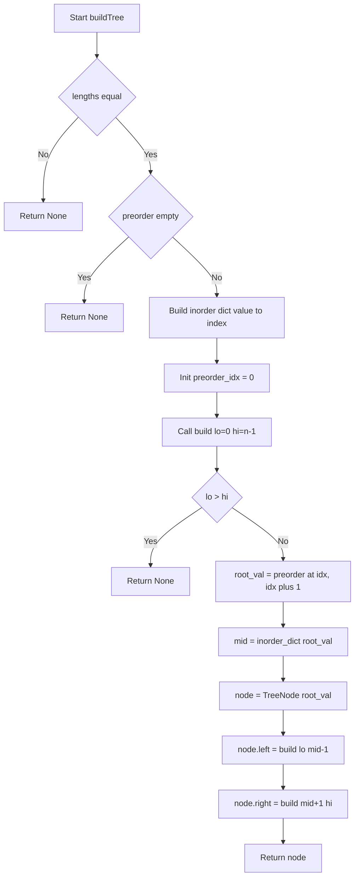
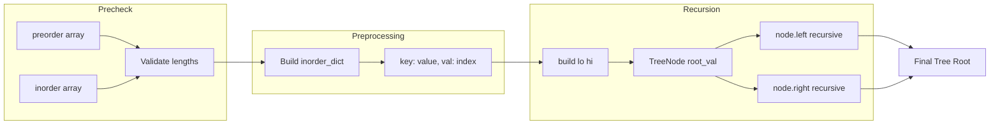

# Construct Binary Tree from Preorder and Inorder Traversal - preorder と inorder から二分木を復元する

---

## 目次（Table of Contents）

- [概要](#overview)
- [アルゴリズム要点 TL;DR](#tldr)
- [図解](#figures)
- [正しさのスケッチ](#correctness)
- [計算量](#complexity)
- [Python 実装](#impl)
- [CPython 最適化ポイント](#cpython)
- [エッジケースと検証観点](#edgecases)
- [FAQ](#faq)

---

<h2 id="overview">概要</h2>

> 💡 **一言で言うと**：「2種類の"木の探索順リスト"を手がかりに、元の二分木を Python のクラスインスタンスとして復元する問題」です。

### この問題が難しい理由

2つの配列が渡されますが、**どちらか一方だけでは木を一意に復元できません**。たとえば preorder（前順探索＝ルート → 左 → 右 の順で訪れる）だけでは、ルートは分かっても左右の分割点が特定できません。inorder（中順探索＝左 → ルート → 右 の順で訪れる）と組み合わせてはじめて「ルートの左に何ノードあるか」が確定し、木を一意に復元できます。

### 問題の要件

| 項目 | 内容                                                                |
| ---- | ------------------------------------------------------------------- |
| 入力 | `preorder: List[int]`（前順配列）・`inorder: List[int]`（中順配列） |
| 出力 | `Optional[TreeNode]`（復元した木のルートノード）                    |
| 制約 | `1 ≤ n ≤ 3000`、値はすべてユニーク、`-3000 ≤ preorder[i] ≤ 3000`    |
| 保証 | preorder と inorder は必ず同じ木の探索結果                          |

> 📖 **この章で登場した用語**
>
> - **preorder（前順探索）**：ルート → 左部分木 → 右部分木 の順にノードを訪れる探索。先頭要素が必ずルートになる
> - **inorder（中順探索）**：左部分木 → ルート → 右部分木 の順にノードを訪れる探索。ルートの左右の境界線が分かる
> - **TreeNode**：二分木の1つのノードを表すクラス。`val`（値）・`left`（左の子）・`right`（右の子）を持つ
> - **Optional[X]**：`X` または `None` のどちらかであることを表す型ヒント

---

<h2 id="tldr">アルゴリズム要点（TL;DR）</h2>

> 💡 **TL;DR**（Too Long; Didn't Read）とは「長くて読めない人向けの要約」という意味です。ここでは「なんとなくこういう手順で解くんだな」というイメージを掴む章として読んでください。

- **戦略**：「preorder の先頭 = ルート」という性質と「inorder のルート位置 = 左右の境界線」という性質を再帰的に利用して木を復元する
- **前処理**：`inorder` の「値 → インデックス」を `dict`（ハッシュマップ）に登録しておく。なぜか：毎回 `list.index()` で線形探索すると全体が O(n²) になるが、`dict` なら O(1) で位置を取り出せる
- **カーソル共有**：`preorder` を先頭から順に消費するカーソル変数を `nonlocal` で再帰関数間で共有する。なぜか：各再帰呼び出しが「今どのルートを処理するか」を順番通りに取り出す必要があるため
- **時間計算量**：O(n)（各ノードをちょうど1回だけ処理）
- **空間計算量**：O(n)（`dict` の n エントリ + 再帰スタックの高さ h 分）

```
【2つの配列が持つ情報の整理】

preorder = [3, 9, 20, 15, 7]
            ↑
            先頭が必ずルート！

inorder  = [9, 3, 15, 20, 7]
                ↑
                ルート「3」の位置が分かる
                左側 [9] = 左部分木
                右側 [15,20,7] = 右部分木
```

> 📖 **この章で登場した用語**
>
> - **再帰（recursion）**：関数が自分自身を呼び出して、問題を小さな部分問題に分解して解く手法
> - **`dict`（ハッシュマップ）**：キーから値を平均 O(1) で取り出せる Python の組み込みデータ構造。内部はハッシュテーブル（値の場所を計算で直接求める仕組み）
> - **`nonlocal`**：内側の関数から外側（でも `global` ではない）スコープにある変数を書き換えるための Python キーワード
> - **O(n²)**：入力が2倍になると処理が約4倍になること。二重ループや毎回の線形探索に多い

---

<h2 id="figures">図解</h2>

> 💡 **Mermaid フローチャートの読み方**：ひし形（`{}`）は条件分岐（Yes/No で処理が分かれる）、長方形（`[]`）は処理ステップを表します。矢印はデータや処理の流れを示します。上から下へ順に読み進めてください。

### フローチャート

この図は `buildTree` 関数全体の処理の流れを表しています。前処理フェーズで `dict` を構築し、再帰フェーズで木を組み立てる2段構造になっています。



**各ノードの意味：**

- `Start[Start buildTree]`：関数の入り口。`preorder` と `inorder` を受け取る
- `LenCheck{lengths equal}`：2つの配列の長さが一致するかを判定する条件分岐
- `BuildMap[Build inorder dict...]`：`inorder` の「値→インデックス」を `dict` に登録する前処理ステップ
- `InitIdx[Init preorder_idx = 0]`：preorder を先頭から消費するカーソルを初期化
- `RecBase{lo &gt; hi}`：再帰の終了条件。範囲が空（lo > hi）なら部分木なし
- `GetRoot[root_val = ...]`：preorder の現在位置からルート値を取り出し、カーソルを進める
- `GetMid[mid = ...]`：`dict` でルートの inorder 上の位置を O(1) で取得
- `RecLeft / RecRight`：左右の部分木を再帰的に構築して接続

---

### データフロー図

この図は入力の2配列からノードが生成され、木として組み立てられるまでのデータの変換を表しています。



**主要な流れの説明：**

- `preorder` / `inorder` → `Validate`：長さ不一致を早期検出
- `Build inorder_dict`：O(n) の前処理で「値→インデックス」を登録
- `build lo hi` → `TreeNode`：再帰的にノードを生成して親子関係を接続
- 2つの `recursive` → `Final Tree Root`：左右部分木がルートに接続されて完成

---

### 代表例でのトレース

入力 `preorder=[3,9,20,15,7]`・`inorder=[9,3,15,20,7]` を使って各ステップを追います。

```
【前処理】inorder_dict の構築（O(n)）:
  { 9:0, 3:1, 15:2, 20:3, 7:4 }

preorder_idx = 0 で build(lo=0, hi=4) を呼び出す
━━━━━━━━━━━━━━━━━━━━━━━━━━━━━━━━━━━━━━━━━
Step 1: build(lo=0, hi=4)
  lo(0) ≤ hi(4) → 続行
  root_val = preorder[0] = 3,  preorder_idx → 1
  mid = inorder_dict[3] = 1
  node = TreeNode(3)

  Step 2: node.left = build(lo=0, hi=0)  ← inorder[0..0]=[9]
    root_val = preorder[1] = 9,  preorder_idx → 2
    mid = inorder_dict[9] = 0
    node = TreeNode(9)
    node.left  = build(lo=0, hi=-1) → lo>hi → None
    node.right = build(lo=1, hi=0)  → lo>hi → None
    ✅ return TreeNode(9)

  Step 3: node.right = build(lo=2, hi=4)  ← inorder[2..4]=[15,20,7]
    root_val = preorder[2] = 20,  preorder_idx → 3
    mid = inorder_dict[20] = 3
    node = TreeNode(20)

    Step 4: node.left = build(lo=2, hi=2)  ← inorder[2..2]=[15]
      root_val = preorder[3] = 15,  preorder_idx → 4
      mid = inorder_dict[15] = 2
      node = TreeNode(15)
      node.left  = build(lo=2, hi=1) → lo>hi → None
      node.right = build(lo=3, hi=2) → lo>hi → None
      ✅ return TreeNode(15)

    Step 5: node.right = build(lo=4, hi=4)  ← inorder[4..4]=[7]
      root_val = preorder[4] = 7,  preorder_idx → 5
      mid = inorder_dict[7] = 4
      node = TreeNode(7)
      node.left  = build(lo=4, hi=3) → lo>hi → None
      node.right = build(lo=5, hi=4) → lo>hi → None
      ✅ return TreeNode(7)

    ✅ return TreeNode(20, left=TreeNode(15), right=TreeNode(7))

✅ return TreeNode(3, left=TreeNode(9), right=TreeNode(20,...))

━━━━━━━━━━━━━━━━━━━━━━━━━━━━━━━━━━━━━━━━━
最終結果の木：
        3
       / \
      9  20
         / \
        15   7
Output: [3,9,20,null,null,15,7]  ✅
```

> 📖 **この章で登場した用語**
>
> - **フローチャート**：処理の手順を図形と矢印で表したもの。ひし形＝条件分岐、長方形＝処理ステップ
> - **データフロー図**：データがどのように変換・移動するかを示す図
> - **前処理（Preprocessing）**：メインの処理を始める前に行う準備作業。この問題では `dict` の構築がそれにあたる

---

<h2 id="correctness">正しさのスケッチ</h2>

> 💡 「正しさのスケッチ」とは、アルゴリズムが**常に正しい答えを返すことの根拠**を整理したものです。数学的な厳密証明ではなく「なぜ正しいと言えるか」の説明です。

### 不変条件（＝アルゴリズムが正しく動くために、処理中ずっと成り立ち続けるべき条件）

`build(lo, hi)` が呼ばれるとき、以下の2つが常に成り立ちます：

1. **`preorder[preorder_idx]` はこの部分木のルート値である**
   preorder は「ルート→左→右」の順なので、左の再帰が終わるたびに次のルート値が `preorder_idx` の位置に来ます。左を先に処理することでこの順序が崩れません。

2. **`inorder[lo..hi]` はこの部分木のノード全体を表す**
   `mid` でルートを特定したあと、左部分木は `inorder[lo..mid-1]`、右部分木は `inorder[mid+1..hi]` の範囲に完全に含まれます。

### 基底条件（＝再帰の終了条件。これがないと無限ループになる）

`lo > hi` のとき `None` を返します。これは「対象となるノードが存在しない空の部分木」を意味し、直感的にも正しい（「木のない場所は None である」）です。
例：葉ノード `TreeNode(9)` の左子を求めるとき `build(lo=0, hi=-1)` が呼ばれ、`lo(0) > hi(-1)` で即座に `None` が返ります。

### 網羅性（＝すべてのケースをもれなく処理できているという保証）

- `preorder` の各要素は `preorder_idx` の単調増加によってちょうど1回だけ消費されます
- `inorder_dict` は事前にすべての値を登録しているため、`inorder_dict[root_val]` は必ず成功します（制約「preorder と inorder は同じ木のもの」より）

### 終了性（＝アルゴリズムが必ず有限ステップで終わるという保証）

各再帰呼び出しで処理対象の範囲 `(hi - lo + 1)` は必ず1以上縮小します（左再帰は `mid-1`、右再帰は `mid+1` を渡すため）。したがって有限回の呼び出しで必ず `lo > hi` に到達して終了します。

> 📖 **この章で登場した用語**
>
> - **不変条件**：アルゴリズムが正しく動くために、処理中ずっと成り立ち続けるべき条件
> - **基底条件**：再帰の終了条件。これがないと無限ループ（スタックオーバーフロー）になる
> - **終了性**：アルゴリズムが必ず有限ステップで終わるという保証
> - **網羅性**：すべてのケースをもれなく処理できているという保証

---

<h2 id="complexity">計算量</h2>

> 💡 計算量とは「入力が大きくなるにつれて、処理にかかる時間・メモリがどう増えるか」の目安です。

| 記法         | 意味                   | 直感的なイメージ            |
| ------------ | ---------------------- | --------------------------- |
| `O(1)`       | 入力サイズによらず一定 | 辞書で直接ページを開く      |
| `O(n)`       | 入力に比例して増加     | リストを端から順に読む      |
| `O(n log n)` | n よりやや速く増加     | 辞書を二分探索で引く × n 回 |
| `O(n²)`      | 入力の2乗で増加        | 全ペアを総当たりで確認する  |

### 時間計算量：O(n)

| 処理                               | 計算量   | 理由                            |
| ---------------------------------- | -------- | ------------------------------- |
| `inorder_dict` の構築              | O(n)     | 全要素を1回ずつ登録             |
| `build` の再帰呼び出し合計         | O(n)     | 各ノードをちょうど1回だけ処理   |
| `inorder_dict[root_val]` 1回あたり | O(1)     | `dict` の平均ルックアップコスト |
| **合計**                           | **O(n)** |                                 |

### 空間計算量：O(n)

| 使用メモリ         | 計算量   | 理由                                                 |
| ------------------ | -------- | ---------------------------------------------------- |
| `inorder_dict`     | O(n)     | n 個のキー・値ペアを保持                             |
| 再帰スタック       | O(h)     | h は木の高さ。バランス木は O(log n)、偏った木は O(n) |
| 生成ノード（出力） | O(n)     | 復元した木全体のノード数                             |
| **合計**           | **O(n)** |                                                      |

### アプローチ別比較

| アプローチ               | 時間計算量 | 空間計算量 | 備考                          |
| ------------------------ | ---------- | ---------- | ----------------------------- |
| `dict` 前処理 + 再帰     | O(n)       | O(n)       | ★採用。最速・コード明瞭       |
| `list.index()` + 再帰    | O(n²)      | O(n)       | n=3000 で約9M操作、TLE リスク |
| 反復（スタック）+ `dict` | O(n)       | O(n)       | 同速だが実装が複雑            |

> 📖 **この章で登場した用語**
>
> - **時間計算量**：入力の大きさに対して処理にかかる手間がどう増えるかの目安
> - **空間計算量**：処理中に使うメモリ量がどう増えるかの目安
> - **ルックアップコスト**：`dict` でキーに対応する値を取り出すのにかかるコスト。平均 O(1)
> - **再帰スタック**：再帰呼び出しのたびに関数の状態が積まれるメモリ領域。深さが木の高さに比例する

---

<h2 id="impl">Python 実装</h2>

> 💡 コードを読む前に、実装の骨格を確認しましょう。

```
実装の骨格：
1. sys.setrecursionlimit で再帰深度の上限を緩和する（最悪 3000 段の再帰に備えるため）
2. 入力検証：型チェック・長さ不一致・空リストを早期検出する
3. 前処理：inorder の「値→インデックス」を dict 内包表記で O(n) 構築
4. preorder カーソル変数を初期化し、nonlocal で再帰間共有する準備
5. 再帰関数 build(lo, hi)：
   a. lo > hi なら None を返す（再帰の終了条件）
   b. preorder[preorder_idx] をルート値として取得し、カーソルを進める
   c. dict でルートの inorder 上の位置を O(1) で取得
   d. TreeNode を生成し、左右を再帰的に構築して接続して返す
6. build(0, n-1) を呼び出して結果を返す
```

### 業務開発版（型安全・pylance 対応・エラーハンドリング重視）

【業務開発版を使う場面】
チームで長期間メンテナンスするプロダクションコードに向きます。エラーの原因が分かりやすく、後から読んだ人が意図を理解できる構造になっています。pylance による静的型チェックも通ります。

```python
from __future__ import annotations
# 型ヒントの前方参照を有効にする。
# 例：TreeNode が自分自身を型ヒントに使える（`left: Optional[TreeNode]`）。

import sys
from typing import Optional, TYPE_CHECKING

# 再帰深度の上限を緩和する。
# Python のデフォルトは 1000 だが、本問は最悪 3000 段（完全に偏った木）になりうる。
# モジュールロード時に1回だけ実行されるよう、クラスの外に配置している。
sys.setrecursionlimit(10_000)

# TYPE_CHECKING ブロック：pylance（静的型チェッカー）向けに TreeNode の型情報を提供する。
# 実行時ではなく型チェック時にのみ読み込まれるため、LeetCode の実行環境でも安全。
if TYPE_CHECKING:
    class TreeNode:
        val: int
        left: Optional[TreeNode]
        right: Optional[TreeNode]
        def __init__(
            self,
            val: int = 0,
            left: Optional[TreeNode] = None,
            right: Optional[TreeNode] = None,
        ) -> None: ...

# LeetCode の実行環境では TreeNode は既に定義済みのため、
# NameError が出ない場合はスキップ。定義がなければ軽量フォールバックを用意する。
try:
    TreeNode  # type: ignore[name-defined]
except NameError:
    class TreeNode:  # type: ignore[no-redef]
        __slots__ = ("val", "left", "right")
        def __init__(
            self,
            val: int = 0,
            left: Optional[TreeNode] = None,
            right: Optional[TreeNode] = None,
        ) -> None:
            self.val = val
            self.left = left
            self.right = right


class Solution:
    def buildTree(
        self,
        preorder: list[int],
        inorder: list[int],
    ) -> Optional[TreeNode]:
        """
        preorder（前順）と inorder（中順）から二分木を復元する。

        Args:
            preorder: 前順探索の配列（先頭が必ずルート）
            inorder:  中順探索の配列（ルートの左右を区切る境界線）

        Returns:
            復元した二分木のルートノード。空の場合は None。

        Raises:
            TypeError:  引数がリストでない場合
            ValueError: 2つの配列の長さが異なる場合

        Complexity:
            Time:  O(n) - 各ノードをちょうど1回だけ処理
            Space: O(n) - dict（n エントリ）+ 再帰スタック（高さ h）
        """
        # ① 型チェック：list 以外が渡された場合に分かりやすいエラーを出す。
        #    Python は動的型付けなので実行時まで型エラーに気づかない。
        #    isinstance() で早期検出することでデバッグを容易にする。
        if not isinstance(preorder, list) or not isinstance(inorder, list):
            raise TypeError("Both preorder and inorder must be lists")

        # ② 長さ不一致チェック：2つの配列が同じ木を表していない場合は復元不可。
        if len(preorder) != len(inorder):
            raise ValueError(
                f"Length mismatch: preorder={len(preorder)}, inorder={len(inorder)}"
            )

        # ③ 空リストチェック：ノードが1つもなければ木なし → None を返す。
        if not preorder:
            return None

        n = len(inorder)

        # ④ 前処理：inorder の「値 → インデックス」を dict 内包表記で O(n) 構築。
        #    なぜ dict か：list.index() は C 実装でも O(n) の線形探索のため、
        #    n ノードで合計 O(n²) になる。dict.__getitem__ は平均 O(1)。
        #    日常の例え：図書館の索引カード。本のタイトル（値）から棚番号（インデックス）を即座に引ける。
        inorder_index: dict[int, int] = {val: i for i, val in enumerate(inorder)}

        # ⑤ preorder を先頭から消費するカーソルを初期化する。
        #    int は Python のイミュータブル（変更不可）型なので、
        #    nonlocal を使って外側スコープの変数を直接書き換える方式をとる。
        preorder_idx: int = 0

        def build(lo: int, hi: int) -> Optional[TreeNode]:
            """
            inorder の [lo, hi] 範囲に対応する部分木を再帰的に構築する。

            Args:
                lo: この部分木の inorder 上の左端インデックス
                hi: この部分木の inorder 上の右端インデックス
            """
            # nonlocal 宣言：外側の preorder_idx を書き換えることをPythonに伝える。
            # これがないと、代入時に新しいローカル変数として扱われ外側が更新されないバグが起きる。
            nonlocal preorder_idx

            # ⑥ 再帰の終了条件：範囲が空（lo > hi）なら部分木なし → None を返す。
            #    例：葉ノードの左子を求めるとき lo=0, hi=-1 でここに到達する。
            if lo > hi:
                return None

            # ⑦ preorder の現在位置の値がこの部分木のルートになる。
            #    preorder は「ルート→左→右」の順なので、
            #    呼ばれた時点の先頭が必ずこの部分木のルート値になる。
            root_val: int = preorder[preorder_idx]
            preorder_idx += 1  # 次の再帰のためにカーソルを進める

            # ⑧ dict でルート値の inorder 上の位置を O(1) で取得する。
            #    この位置（mid）を境に「左側 = 左部分木」「右側 = 右部分木」が決まる。
            #    制約「preorder と inorder は同じ木のもの」が保証されているため
            #    KeyError は発生しない。
            mid: int = inorder_index[root_val]

            # ⑨ TreeNode を生成し、左右を再帰的に構築して接続する。
            #    ★ 左を先に構築する理由：preorder は「ルート→左→右」の順なので
            #    左の再帰が終わるまで右のルート値は preorder に現れない。
            node = TreeNode(root_val)
            node.left = build(lo, mid - 1)    # 左部分木（mid の左側）
            node.right = build(mid + 1, hi)   # 右部分木（mid の右側）
            return node

        # ⑩ inorder 全体（0 〜 n-1）を対象として木全体を構築して返す
        return build(0, n - 1)
```

---

### 競技プログラミング版（速度・コードの短さ優先）

【競技プログラミング版を使う場面】
LeetCode の制限時間内に通すことが目的のコードです。型チェックやエラーハンドリングを省略し、最小限のコードで最速実行を目指します。

```python
import sys
from typing import Optional

sys.setrecursionlimit(10_000)  # 偏った木での深い再帰に備えて上限を緩和


class Solution:
    def buildTree(
        self, preorder: list[int], inorder: list[int]
    ) -> Optional[TreeNode]:
        # dict 内包表記で inorder の「値→インデックス」を前処理（O(n)）
        idx_map: dict[int, int] = {v: i for i, v in enumerate(inorder)}
        pre_i = 0  # preorder のカーソル

        def build(lo: int, hi: int) -> Optional[TreeNode]:
            nonlocal pre_i
            if lo > hi:
                return None
            val = preorder[pre_i]
            pre_i += 1
            mid = idx_map[val]
            node = TreeNode(val)
            node.left = build(lo, mid - 1)
            node.right = build(mid + 1, hi)
            return node

        return build(0, len(inorder) - 1)
```

---

### 動作トレース（業務版コードの主要ステップ確認）

```
入力: preorder=[3,9,20,15,7], inorder=[9,3,15,20,7]

Step 1: isinstance チェック → 両方 list ✅
Step 2: 長さチェック → len=5, len=5 → 一致 ✅
Step 3: 空チェック → preorder は空でない ✅
Step 4: inorder_index = {9:0, 3:1, 15:2, 20:3, 7:4}  (dict 内包表記 O(n))
Step 5: preorder_idx = 0
Step 6: build(lo=0, hi=4) を呼び出す

  build(0,4): root_val=3, preorder_idx→1, mid=1
    node = TreeNode(3)
    node.left  = build(0, 0)  → root_val=9, preorder_idx→2, mid=0
      node = TreeNode(9)
      node.left  = build(0,-1) → lo>hi → None
      node.right = build(1, 0) → lo>hi → None
      ✅ return TreeNode(9)
    node.right = build(2, 4)  → root_val=20, preorder_idx→3, mid=3
      node = TreeNode(20)
      node.left  = build(2, 2) → root_val=15, mid=2 → TreeNode(15, None, None)
      node.right = build(4, 4) → root_val=7,  mid=4 → TreeNode(7, None, None)
      ✅ return TreeNode(20)
    ✅ return TreeNode(3, left=9, right=20)

最終結果: [3, 9, 20, null, null, 15, 7] ✅
```

> 📖 **この章で登場した用語**
>
> - **`nonlocal`**：内側の関数から外側のローカル変数を書き換えるための Python キーワード。`global`（モジュール変数）とは異なる
> - **dict 内包表記**：`{k: v for k, v in iterable}` という形で dict を1行で作る Python 固有の書き方
> - **`TYPE_CHECKING`**：型チェッカー（pylance）が実行するときだけ `True` になるフラグ。実行時コストゼロで型情報を提供できる
> - **`__slots__`**：クラスが持てる属性を明示的に制限することでメモリを節約する Python の仕組み

---

<h2 id="cpython">CPython 最適化ポイント</h2>

> 💡 この章では「同じ処理でも Python の書き方によって速さが変わる理由」を説明します。**最適化前のコード → 最適化後のコード → なぜ速くなるか** の3点セットで確認しましょう。

### ポイント1：`list.index()` ではなく `dict` を使う

```python
# ❌ 最適化前：毎回 list.index() で線形探索（O(n) × n ノード = O(n²) 全体）
# list.index() はC実装で高速だが、それでも先頭から順に比較する O(n) 操作
def build_slow(lo, hi):
    root_val = preorder[preorder_idx]
    mid = inorder.index(root_val)  # ← ここが毎回 O(n)
    ...

# ✅ 最適化後：dict で前処理して O(1) ルックアップ
inorder_index = {val: i for i, val in enumerate(inorder)}  # O(n) の前処理（1回だけ）

def build_fast(lo, hi):
    root_val = preorder[preorder_idx]
    mid = inorder_index[root_val]  # ← O(1) のハッシュルックアップ
    ...

# なぜ速いか：dict.__getitem__ は Python 内部でハッシュ値を計算して直接位置を求めるため
# リストのように先頭から順に比較する必要がない。
# n=3000 のとき：list.index 版 ≈ 4,500,000 回比較 → dict 版 ≈ 3,000 回ルックアップ
```

### ポイント2：dict 内包表記でリスト生成コストを削減

```python
# ❌ 最適化前：for ループと dict.update() の組み合わせ（純 Python ループ）
inorder_index = {}
for i in range(len(inorder)):
    inorder_index[inorder[i]] = i  # Python インタープリタを経由する for ループ

# ✅ 最適化後：dict 内包表記（バイトコードレベルで最適化された専用命令を使う）
inorder_index = {val: i for i, val in enumerate(inorder)}

# なぜ速いか：Python のリスト/dict 内包表記は CPython のバイトコードレベルで
# LIST_APPEND / MAP_ADD という専用の高速命令に変換される。
# 通常の for ループに比べてインタープリタのオーバーヘッドが少ない。
```

### ポイント3：`sys.setrecursionlimit` で再帰上限を緩和

```python
import sys

# ❌ 設定なし：Python デフォルトの再帰深度は 1000
# 完全に偏った木（n=3000）では深さ 3000 の再帰が起き RecursionError になる

# ✅ 設定あり：事前に上限を緩和しておく
sys.setrecursionlimit(10_000)  # クラスの外・ファイルの先頭近くに書く

# なぜ 10_000 か：n ≤ 3000 なので 3000 段の再帰に対して余裕を持たせた値。
# 大きすぎるとスタックメモリを大量消費するため、必要最小限にとどめる。
```

### ポイント4：`nonlocal` vs `リストラップ` の使い分け

```python
# ① nonlocal を使う方法（今回採用・可読性が高い）
preorder_idx = 0
def build(lo, hi):
    nonlocal preorder_idx
    preorder_idx += 1  # 外側の変数を直接書き換える

# ② リストラップを使う方法（nonlocal が使えない場合の代替）
preorder_idx = [0]  # リストに入れると参照渡しになる
def build(lo, hi):
    preorder_idx[0] += 1  # リストの中身を書き換える（所有権は変わらない）

# なぜ nonlocal を推奨するか：
# Python の int は不変型（immutable）のため、+=（再代入）は新しいオブジェクトを作る。
# nonlocal なしで += すると「新しいローカル変数への代入」として扱われ外側が更新されない。
# nonlocal を明示することで、読み手に「外側の変数を意図的に書き換えている」と伝えられる。
```

> 📖 **この章で登場した用語**
>
> - **バイトコード**：Python のソースコードが CPython によって変換される中間表現。実際にはこの形式で実行される
> - **dict.**getitem\*\*\*\*：`dict[key]` という操作の内部実装。ハッシュ計算で直接位置を求めるため O(1)
> - **インタープリタオーバーヘッド**：Python コードの各命令を解釈・実行するためにかかるコスト。C 実装の組み込み関数はこれを大幅に削減できる
> - **不変型（immutable）**：`int`・`str`・`tuple` など、生成後に値を変更できない型。`+=` は新しいオブジェクトを作る再代入になる

---

<h2 id="edgecases">エッジケースと検証観点</h2>

> 💡 エッジケースとは「空リスト・単一ノード・極端な形の木」など通常とは異なる境界的な入力のことです。エッジケースを見落とすと、普通のテストは通るのに特定の入力でだけバグが発生します。

| #   | ケース名             | 入力                               | 期待出力                                   | なぜ問題になりうるか                                                                                                                                                  |
| --- | -------------------- | ---------------------------------- | ------------------------------------------ | --------------------------------------------------------------------------------------------------------------------------------------------------------------------- |
| 1   | 単一ノード           | `pre=[-1]`, `ino=[-1]`             | `TreeNode(-1)`                             | `build(0,0)` で `lo==hi` になり終了条件ギリギリ。`lo-1=-1` で `lo>hi` になるかチェック                                                                                |
| 2   | 右に偏った木         | `pre=[1,2,3]`, `ino=[1,2,3]`       | 1→None→2→None→3                            | mid が常に lo と一致するため左再帰が `build(lo,lo-1)` = `build(x,x-1)` になる。`lo-1` のアンダーフローは Python では起きないが lo > hi の判定が正しく機能するかを確認 |
| 3   | 左に偏った木         | `pre=[3,2,1]`, `ino=[1,2,3]`       | 3→2→1→None 右側全部 None                   | mid が常に hi と一致するため右再帰が `build(hi+1,hi)` = `build(x+1,x)` になる。終了条件が正しく機能するかを確認                                                       |
| 4   | 負の値を含む         | `pre=[-3,9,-20]`, `ino=[9,-3,-20]` | `TreeNode(-3, TreeNode(9), TreeNode(-20))` | `dict` のキーに負の値が使えるか確認。Python の `dict` は任意の `int` をキーにできるため問題ない                                                                       |
| 5   | 最大サイズ           | n=3000 の完全二分木                | 正常に木を返す                             | 再帰深度が約 log₂(3000) ≈ 12 段に収まる。`sys.setrecursionlimit` なしでも動くが念のため設定済み                                                                       |
| 6   | 最大サイズ（偏り木） | n=3000 の一列の木                  | 正常に木を返す                             | 再帰深度が 3000 段になる。`sys.setrecursionlimit` なしでは `RecursionError` が発生する                                                                                |
| 7   | 業務版：長さ不一致   | `pre=[1,2]`, `ino=[1]`             | `ValueError`                               | バリデーションが正しく機能するかを確認                                                                                                                                |
| 8   | 業務版：型エラー     | `pre="abc"`, `ino=[1]`             | `TypeError`                                | `isinstance` チェックが機能するかを確認                                                                                                                               |

```python
# エッジケース確認用のサンプル呼び出し（テストコードではなく動作確認の参考）

s = Solution()

# ケース1：単一ノード
assert s.buildTree([-1], [-1]).val == -1  # type: ignore[union-attr]

# ケース2：右に偏った木
root = s.buildTree([1, 2, 3], [1, 2, 3])
assert root is not None and root.val == 1
assert root.left is None
assert root.right is not None and root.right.val == 2

# ケース7：業務版の ValueError
import sys
try:
    s.buildTree([1, 2], [1])
    assert False, "Should have raised ValueError"
except ValueError:
    pass  # 期待通り
```

> 📖 **この章で登場した用語**
>
> - **エッジケース**：空のリスト・要素1つ・最大サイズ入力など、境界的な条件の入力
> - **境界値**：制約の上限・下限にあたる値。本問では n=1（最小）と n=3000（最大）
> - **偏った木（Skewed Tree）**：すべてのノードが左だけ・または右だけにつながった木。二分探索木の最悪ケースで、再帰深度が n になる
> - **RecursionError**：Python の再帰深度制限を超えたときに発生するエラー

---

<h2 id="faq">FAQ</h2>

> 💡 FAQは「初学者がつまずきやすいポイント」を想定した質問と回答です。各回答は「**結論 → 理由 → 補足（具体例）**」の順で書いています。

---

**Q1. なぜ `list.index()` ではなく `dict` を使うのですか？**

**結論**：`dict` を使うと全体の時間計算量が O(n²) から O(n) に改善されるためです。

**理由**：`list.index()` は先頭から順に比較する線形探索（O(n)）です。n 個のノードのたびに呼ぶと合計 n × O(n) = O(n²) になります。一方 `dict.__getitem__` はハッシュ値を計算して直接位置を求めるため平均 O(1) です。

**補足**：n=3000 のとき、`list.index()` 版は最悪 `1+2+...+3000 ≈ 4,500,000` 回の比較が発生します。`dict` 版は 3,000 回の O(1) ルックアップで済みます。

---

**Q2. なぜ左の部分木を右より先に構築するのですか？**

**結論**：preorder 配列が「ルート→左→右」の順で並んでいるため、左を先に処理しないと `preorder_idx` のカーソルが合わなくなるからです。

**理由**：`preorder_idx` は現在処理中のルート値の位置を指しています。左の再帰を先に終わらせると、次に `preorder_idx` が指す値が「右部分木のルート」になります。右を先に処理してしまうと、まだ来ていない値をルートとして使ってしまいます。

**補足**：例えば `preorder=[3,9,20,15,7]` のとき、`3` のルートを処理したあと次の `9` は左部分木のルートです。`9` の再帰が終わると `preorder_idx=2` となり次の `20` が右部分木のルートになります。

---

**Q3. `nonlocal` を使わないとどうなりますか？**

**結論**：`preorder_idx += 1` が外側の変数を更新せず、カーソルが常に 0 のままになるバグが起きます。

**理由**：Python では関数内で変数に代入（`+=` も代入）すると、その変数はローカル変数として扱われます。`nonlocal` がないと外側の `preorder_idx` とは別の新しいローカル変数が作られ、外側には影響しません。

**補足**：`nonlocal` の代わりに `preorder_idx = [0]`（リストに入れる）という書き方もあります。リストは可変型（mutable）なので `preorder_idx[0] += 1` と書けば外側のリストの中身を書き換えられます。ただし可読性が下がるため `nonlocal` を推奨します。

---

**Q4. `sys.setrecursionlimit` は必ず必要ですか？**

**結論**：制約 n ≤ 3000 で偏った木が入力される可能性があるため、LeetCode の提出では設定しておくことを推奨します。

**理由**：Python のデフォルト再帰深度は 1000 です。完全に偏った木（例：全ノードが右にのみつながる）では深さ 3000 の再帰が起きるため、設定なしでは `RecursionError` が発生します。

**補足**：バランスのとれた木（高さ ≈ log₂ 3000 ≈ 12）では問題になりませんが、制約上で保証されていないため安全のために設定します。`10_000` は n=3000 に対して十分余裕のある値です（大きすぎるとメモリを消費するため過剰に設定しない）。

---

**Q5. inorder だけ、または preorder だけで木を復元できますか？**

**結論**：どちらか一方だけでは木を一意に復元できません。2つの組み合わせが必要です。

**理由**：例えば preorder `[1,2,3]` に対して、以下の複数の木が存在します：

```
パターンA          パターンB          パターンC
    1                  1                  1
   /                    \                / \
  2                      2              2   3
   \                    /
    3                  3
```

inorder がそれぞれ `[2,3,1]`, `[1,3,2]`, `[2,1,3]` となり、一意に区別できます。

**補足**：preorder + inorder、または postorder + inorder の組み合わせなら一意に復元できます。ただし preorder + postorder の組み合わせだけでは一意に復元できない場合があります（ノードが1つの子しか持たない場合に曖昧になる）。

---

**Q6. なぜ `inorder_dict[root_val]` で `KeyError` が起きないと言えるのですか？**

**結論**：問題の制約「preorder と inorder は同じ木の前順・中順探索の結果」が保証されているためです。

**理由**：preorder に含まれるすべての値は、必ず inorder にも含まれています。`inorder_dict` は inorder のすべての値をキーとして持つため、preorder の任意の値で `inorder_dict[val]` を呼んでも必ず成功します。

**補足**：業務コードでこの保証がない場合は `inorder_dict.get(root_val)` を使い `None` チェックを追加すべきです。LeetCode の制約が信頼できる環境では `[]` 直接アクセスで問題ありません。

> 📖 **この章で登場した用語**
>
> - **FAQ**：Frequently Asked Questions の略。よくある質問と回答のこと
> - **可変型（mutable）**：`list`・`dict` など、生成後に中身を変更できる型。リストに `int` を入れてラップすることで参照渡しに似た挙動を実現できる
> - **トレードオフ**：何かを得ると何かを失う関係。例：`dict` 前処理で O(n) のメモリを使う代わりに、全体の時間計算量を O(n²) から O(n) に改善できる
> - **KeyError**：辞書に存在しないキーでアクセスしたときに発生する Python の例外

---

_このドキュメントは LeetCode 105 - Construct Binary Tree from Preorder and Inorder Traversal の解説用に作成されました。_
_対象言語：Python (CPython 3.11.10) / プラットフォーム：LeetCode_
