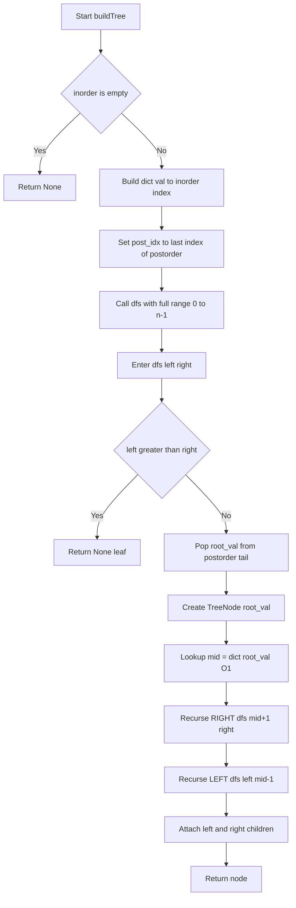
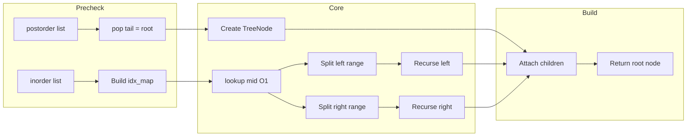

# Construct Binary Tree from Inorder and Postorder Traversal - 二分木の復元

> **LeetCode 106** ｜ Python (CPython 3.11+) ｜ Time: O(n) ／ Space: O(n)

---

## 目次（Table of Contents）

- [概要](#overview)
- [アルゴリズム要点 TL;DR](#tldr)
- [図解](#figures)
- [正しさのスケッチ](#correctness)
- [計算量](#complexity)
- [Python 実装](#impl)
- [CPython 最適化ポイント](#cpython)
- [エッジケースと検証観点](#edgecases)
- [FAQ](#faq)

---

<h2 id="overview">概要</h2>

> 💡 **この問題を一言で言うと？**
> 「2種類の木の巡回記録（Inorder・Postorder）を手がかりにして、元の二分木の形を復元する問題」です。

### 何が難しいのか？

二分木の「巡回記録」とは、木の全ノードを特定のルールで訪れた順番を並べたリストです。同じ木でも巡回ルールが違えば別のリストが得られますが、**2種類の異なる巡回記録が揃えば、元の木を一意に復元できる**という性質があります。

難しさのポイントは2つあります。

1. **Postorderの末尾がルートになる**という性質を見つけること（これが解法の核心です）
2. 毎回ルートの位置を `list.index()` で探していると O(n²) になりTLEになること。`dict` で事前マッピングを構築して O(1) 検索にする必要があります

### 問題要件

| 項目 | 内容 |
|---|---|
| 入力1 | `inorder: List[int]` — 中順走査の結果（左→自分→右の順） |
| 入力2 | `postorder: List[int]` — 後順走査の結果（左→右→自分の順） |
| 出力 | `Optional[TreeNode]` — 復元した木のルートノード |
| 要素数 | 1 &le; n &le; 3000 |
| 値の範囲 | -3000 &le; val &le; 3000 |
| 制約 | 全値はユニーク（重複なし） |

> 📖 **この章で登場した用語**
> - **二分木（Binary Tree）**：各ノード（節）が最大2つの子（左・右）を持つ木構造
> - **中順走査（Inorder）**：「左の子 → 自分 → 右の子」の順でノードを訪れる方法
> - **後順走査（Postorder）**：「左の子 → 右の子 → 自分」の順でノードを訪れる方法。最後が必ずルート
> - **TLE（Time Limit Exceeded）**：処理時間が制限を超えたときのエラー
> - **ルート（根）**：木の最上位ノード

---

<h2 id="tldr">アルゴリズム要点（TL;DR）</h2>

> 💡 **TL;DR とは？**
> "Too Long; Didn't Read"（長くて読めない人向けの要約）の略です。
> ここではアルゴリズム全体の戦略を箇条書きでまとめます。
> 詳細は後の章で説明するので、「なんとなくこういう手順で解くんだな」というイメージを掴む章です。

- **① dict で事前マッピングを構築する**
  `{ inorderの値: インデックス }` を O(n) で一括作成する。ルートの位置を毎回 O(n) で探していると全体が O(n²) になるため、O(1) 検索できる dict を使う

- **② postorder の末尾がルートになる性質を使う**
  Postorder は「左→右→自分」の順なので、**末尾要素が現在の部分木のルート**になる。`list.pop()` で末尾から O(1) で取り出す

- **③ 右部分木を先に再帰する**
  末尾からルートを逆順に消費すると「ルート→右→左」の順になる。右を先に再帰しないとインデックスがずれる

- **④ 再帰の終了条件は `in_left > in_right`**
  この範囲に要素が存在しない（部分木が空）なら `None` を返す

- **計算量**: 時間 O(n)・空間 O(n)（dict の構築 + 再帰スタック）

- **Pythonの注意点**: 再帰上限デフォルト1000のため `sys.setrecursionlimit(10000)` が必要

> 📖 **この章で登場した用語**
> - **TL;DR**：「長くて読めない人向けの要約」を意味する略語
> - **dict（辞書）**：「キー → 値」を O(1) で検索できるPythonのデータ構造
> - **再帰（Recursion）**：関数が自分自身を呼び出すことで問題を分割して解く手法
> - **`list.pop()`**：リストの末尾要素を取り出して削除するメソッド。末尾は O(1)、先頭は O(n)

---

<h2 id="figures">図解</h2>

> 💡 **Mermaid フローチャートの読み方**
> - **長方形 `[]`**：実際に何かを処理するステップを表します
> - **ひし形 `{}`**：条件を判定する分岐ポイントを表します（YesかNoかで処理が分かれます）
> - **矢印**：処理の流れる方向を表します
> 上から下へ読み進めてください。

---

### フローチャート：`buildTree` の全体処理フロー

この図は `buildTree` 全体の処理フローを表しています。まず dict を1回だけ構築し、その後は再帰ヘルパーを呼び出して木を組み立てていきます。



**各ノードの意味：**

- `Start[Start buildTree]`：入口。`inorder` と `postorder` を受け取る
- `Validate{inorder is empty}`：空入力のエッジケースチェック
- `BuildMap`：`dict` を O(n) で1回だけ構築するステップ。ここがO(n²)とO(n)の分かれ目
- `BaseCase{left greater than right}`：再帰の終了条件。左端が右端を超えたら部分木は空
- `PopRoot`：`postorder` の末尾から現在のルートを取り出す。`pop()` で O(1)
- `RecurRight` → `RecurLeft`：**右を先に**再帰することが重要（後述のFAQ参照）
- `Attach`：子ノードを親ノードの `left` / `right` に設定して木を組み立てる

---

### データフロー図：入力から木への変換

この図は `inorder=[9,3,15,20,7]`, `postorder=[9,15,7,20,3]` を例として、データがどのように変換されるかを表しています。



**主要な流れの説明：**

- `inorder list` → `Build idx_map`：辞書を1回だけ構築してO(1)検索を可能にする
- `postorder list` → `pop tail = root`：末尾要素を取り出すことで現在のルートを特定する
- `lookup mid O1`：dict を引いてルートが inorder のどこにあるかをO(1)で取得する
- `Split left/right range`：mid を境に左右の部分木の範囲（インデックスの区間）を決める
- `Attach children`：再帰の結果（子ノード）を親ノードに接続して木を完成させる

---

> 💡 **代表例でのトレース**

**入力:** `inorder=[9,3,15,20,7]`, `postorder=[9,15,7,20,3]`

```
事前準備:
  idx_map = { 9:0, 3:1, 15:2, 20:3, 7:4 }
  post_idx[0] = 4（末尾から開始）

──────────────────────────────────────────
Step 1: dfs(left=0, right=4)
  left(0) <= right(4) → 続行
  root_val = postorder[4] = 3    post_idx: 4→3
  mid = idx_map[3] = 1
  node = TreeNode(3)
  → 右を先に再帰: dfs(mid+1=2, right=4)

Step 2: dfs(left=2, right=4)
  root_val = postorder[3] = 20   post_idx: 3→2
  mid = idx_map[20] = 3
  node = TreeNode(20)
  → 右を先に再帰: dfs(4, 4)

Step 3: dfs(left=4, right=4)
  root_val = postorder[2] = 7    post_idx: 2→1
  mid = idx_map[7] = 4
  node = TreeNode(7)
  → 右: dfs(5, 4) → left > right → None
  → 左: dfs(4, 3) → left > right → None
  return TreeNode(7)  ← 葉ノード

Step 4: Step2 に戻る
  node(20).right = TreeNode(7)
  → 左: dfs(2, 2)
    root_val = postorder[1] = 15  post_idx: 1→0
    node = TreeNode(15) ← 葉ノード
    return TreeNode(15)
  node(20).left = TreeNode(15)
  return TreeNode(20)

Step 5: Step1 に戻る
  node(3).right = TreeNode(20)
  → 左: dfs(0, 0)
    root_val = postorder[0] = 9   post_idx: 0→-1
    node = TreeNode(9) ← 葉ノード
    return TreeNode(9)
  node(3).left = TreeNode(9)
  return TreeNode(3)

最終結果:
        3
       / \
      9   20
         /  \
        15    7
```

> 📖 **この章で登場した用語**
> - **フローチャート**：処理の手順を図形と矢印で表したもの。ひし形=条件分岐、長方形=処理
> - **データフロー図**：データがどのように変換・移動するかを示す図
> - **葉ノード（Leaf Node）**：左右の子を持たない木の末端ノード
> - **部分木（Subtree）**：ある木のノードを根とした木の一部

---

<h2 id="correctness">正しさのスケッチ</h2>

> 💡 **「正しさのスケッチ」とは？**
> アルゴリズムが常に正しい答えを返すことの根拠を整理したものです。
> 数学的な厳密証明ではなく「なぜ正しいと言えるか」の説明です。

### ① 不変条件（Invariant）

> *アルゴリズムが正しく動くために、処理中ずっと成り立ち続けるべき条件のこと*

**「`post_idx` が指す要素は、現在の dfs 呼び出しの部分木のルートである」** という条件が常に成立します。

なぜなら、Postorderは「左→右→自分（ルート）」の順なので、末尾から逆順に取り出すと「ルート→右→左」の順になります。`dfs` が右から先に再帰する限り、`post_idx` の消費順序は常に「現在の部分木のルート」を指します。

### ② 網羅性（Completeness）

> *すべてのケースをもれなく処理できているという保証のこと*

- `in_left > in_right` のとき `None` を返す → 空の部分木を正しく表現できる
- `mid + 1` から `in_right` の範囲 → 右部分木の全要素を漏れなく処理する
- `in_left` から `mid - 1` の範囲 → 左部分木の全要素を漏れなく処理する
- ルート自身（`mid`）は再帰に渡されず、現在の呼び出しで処理済みになる

### ③ 基底条件（Base Case）

> *再帰の終了条件のこと。これがないと無限に再帰し続けてしまう*

```
if left > right: return None
```

`left > right` は「この範囲に要素が0個」であることを意味します。
例えば葉ノード（末端）の左子の範囲は `(mid, mid - 1)` = `left > right` になるため、正しく `None` が返ります。

### ④ 終了性（Termination）

> *アルゴリズムが必ず有限ステップで終わるという保証*

各再帰呼び出しで `in_right - in_left` の範囲が**必ず1以上縮小します**。
親が `(in_left, in_right)` のとき、子は `(in_left, mid-1)` または `(mid+1, in_right)` になり、どちらも親より範囲が狭くなります（midがその1つを占めるため）。したがって必ず有限ステップで `left > right` に到達して終了します。

> 📖 **この章で登場した用語**
> - **不変条件（Invariant）**：アルゴリズムが正しく動くために処理中ずっと成り立ち続けるべき条件
> - **網羅性（Completeness）**：すべてのケースをもれなく処理できているという保証
> - **基底条件（Base Case）**：再帰の終了条件。これがないと無限再帰になる
> - **終了性（Termination）**：アルゴリズムが必ず有限ステップで終わるという保証

---

<h2 id="complexity">計算量</h2>

> 💡 **計算量とは？**
> 「入力が大きくなるにつれて、処理にかかる時間・メモリがどう増えるか」の目安です。

| 記法 | 意味 | 直感的なイメージ |
|---|---|---|
| `O(1)` | 入力サイズによらず一定 | 辞書で直接ページを開く |
| `O(log n)` | 入力の対数に比例 | 二分探索で半分ずつ絞る |
| `O(n)` | 入力に比例して増加 | リストを端から順に読む |
| `O(n²)` | 入力の2乗で増加 | 全ペアを総当たりで確認する |

---

### 時間計算量：O(n)

| 処理 | 計算量 | 理由 |
|---|---|---|
| dict 構築 | O(n) | inorder の全要素を1回走査 |
| 各 dfs 呼び出し | O(1) | dict 検索・`pop()` が全てO(1) |
| 全 dfs 呼び出し合計 | O(n) | ノードは全部でn個、それぞれ1回だけ処理 |
| **合計** | **O(n)** | |

### 空間計算量：O(n)

| 使用メモリ | 計算量 | 理由 |
|---|---|---|
| `idx_map` (dict) | O(n) | n個のキーと値を格納 |
| 再帰スタック | O(h) | h=木の高さ。最悪（完全に偏った木）でO(n) |
| 出力の木自体 | O(n) | n個のノードを作成 |
| **合計** | **O(n)** | |

### list.index() を使った場合との比較

| アプローチ | 時間計算量 | 備考 |
|---|---|---|
| `list.index()` で毎回探索 | O(n²) | n=3000 で最大900万操作 → TLE 危険 |
| **dict で事前構築（採用）** | **O(n)** | 1回の構築で全検索をO(1)に |

> 📖 **この章で登場した用語**
> - **時間計算量**：入力の大きさに対して処理にかかる手間がどう増えるかの目安
> - **空間計算量**：処理中に使うメモリ量がどう増えるかの目安
> - **再帰スタック（Call Stack）**：再帰呼び出しが積み重なる内部メモリ領域

---

<h2 id="impl">Python 実装</h2>

> 💡 **コードの骨格（先に全体像を把握）**
> 1. `sys.setrecursionlimit(10000)` で再帰上限を引き上げる（デフォルト1000では n=3000 に不足）
> 2. dict 内包表記で `idx_map = {val: idx for idx, val in enumerate(inorder)}` を構築する
> 3. `post = postorder.copy()` で元リストを保護し、`pop()` で末尾からルートを取り出す
> 4. `dfs(in_left, in_right)` が再帰ヘルパー。右を先に・左を後に再帰する

---

### 業務開発版（型安全・エラーハンドリング重視）

```python
from __future__ import annotations

import sys
from typing import Optional, List, TYPE_CHECKING

# TreeNode は LeetCode 環境で定義済み。
# pylance の型推論を通すため TYPE_CHECKING ブロックで型スタブを定義し、
# 実行時は try/except で軽量フォールバックを使う。
if TYPE_CHECKING:
    class TreeNode:
        val: int
        left: Optional[TreeNode]
        right: Optional[TreeNode]
        def __init__(
            self,
            val: int = 0,
            left: Optional[TreeNode] = None,
            right: Optional[TreeNode] = None,
        ) -> None: ...

try:
    TreeNode  # LeetCode 環境では既に定義済み → 何もしない
except NameError:
    # ローカル実行用の最小定義（__slots__ でメモリ効率を上げる）
    class TreeNode:  # type: ignore[no-redef]
        __slots__ = ("val", "left", "right")
        def __init__(
            self,
            val: int = 0,
            left: Optional[TreeNode] = None,
            right: Optional[TreeNode] = None,
        ) -> None:
            self.val = val
            self.left = left
            self.right = right


class Solution:
    def buildTree(
        self,
        inorder: List[int],
        postorder: List[int],
    ) -> Optional[TreeNode]:
        """
        Inorder と Postorder の走査結果から二分木を復元する（業務開発版）。

        Args:
            inorder:   中順走査（左→自分→右）の結果リスト
            postorder: 後順走査（左→右→自分）の結果リスト

        Returns:
            復元された二分木のルートノード。空の場合は None。

        Raises:
            TypeError:  引数がリストでない場合、または要素が int でない場合
            ValueError: 2つのリストの長さが一致しない場合

        Complexity:
            Time:  O(n) — dict 構築 O(n) + 各ノードを1回だけ処理 O(n)
            Space: O(n) — dict O(n) + 再帰スタック O(h)（h = 木の高さ）
        """
        # ── 入力バリデーション ────────────────────────────────────────────
        # isinstance() で型チェックを行う。
        # Python は動的型付けのため誤った型が渡されても実行時まで気づかない。
        # 早期チェックすることで、後続の処理でのクラッシュを防ぐ。
        if not isinstance(inorder, list) or not isinstance(postorder, list):
            raise TypeError("inorder と postorder はリストである必要があります")

        if len(inorder) != len(postorder):
            raise ValueError(
                f"長さが不一致: inorder={len(inorder)}, postorder={len(postorder)}"
            )

        # 空入力は None を返す（エラーではなく正常なエッジケース）
        if not inorder:
            return None

        # any() は C 実装の組み込み関数で、最初に True を見つけた時点で停止する。
        # for ループより高速かつ簡潔に全要素の型チェックを行える。
        if any(not isinstance(x, int) for x in inorder):
            raise TypeError("inorder の全要素は int である必要があります")

        # ── 再帰上限の設定 ─────────────────────────────────────────────────
        # Python のデフォルト再帰上限は 1000。
        # 完全に偏った木（全要素が一方向に連なる木）では n=3000 段の再帰が必要。
        # 安全のために上限を引き上げておく。
        sys.setrecursionlimit(10_000)

        # ── dict による事前マッピング ───────────────────────────────────────
        # dict 内包表記（= dict を1行で作る書き方）で
        # 「inorder の値 → そのインデックス」を O(n) で構築する。
        # list.index() を毎回呼ぶと O(n) × n 回 = O(n²) になるため、
        # 1回だけ構築してすべての検索を O(1) に短縮するのが目的。
        idx_map: dict[int, int] = {v: i for i, v in enumerate(inorder)}

        # postorder をコピーして末尾から pop() で消費する。
        # 呼び出し元の list を破壊的に変更しないようコピーを作る。
        # list.pop() の末尾削除は O(1)（先頭削除の pop(0) は O(n) なので使わない）。
        post: List[int] = postorder.copy()

        def dfs(in_left: int, in_right: int) -> Optional[TreeNode]:
            """
            inorder[in_left .. in_right] の範囲に対応する部分木を再帰的に構築する。

            Args:
                in_left:  処理対象の inorder 左端インデックス（境界を含む）
                in_right: 処理対象の inorder 右端インデックス（境界を含む）

            Returns:
                構築した部分木のルートノード。範囲が空なら None。
            """
            # 終了条件：左端が右端を超えた = この範囲に要素がない = 部分木なし
            # 例: 葉ノードの左子を求めるとき in_left=1, in_right=0 → None を返す
            if in_left > in_right:
                return None

            # postorder の末尾から現在の部分木のルートを取り出す。
            # Postorder は「左→右→自分」の順なので末尾が必ずルート。
            # list.pop() は末尾削除で O(1)。
            root_val: int = post.pop()

            # ルートを基にノードを作成する。
            node = TreeNode(root_val)

            # dict から O(1) でルートの inorder 上のインデックスを取得する。
            # 問題の制約「全値はユニークかつ inorder に存在する」が保証されているので
            # KeyError は発生しない。
            mid: int = idx_map[root_val]

            # ── 右部分木を先に再帰する理由 ────────────────────────────────
            # postorder を末尾から逆順に消費すると「ルート→右→左」の順になる。
            # つまり pop() した直後の末尾は「右部分木のルート」。
            # 左を先に再帰すると消費順序がずれて誤ったノードをルートにしてしまう。
            # ──────────────────────────────────────────────────────────────
            # 右部分木: inorder の mid+1 〜 in_right の範囲
            node.right = dfs(mid + 1, in_right)

            # 左部分木: inorder の in_left 〜 mid-1 の範囲
            node.left = dfs(in_left, mid - 1)

            return node

        # inorder の全範囲（0 〜 n-1）を対象に木を構築して返す
        return dfs(0, len(inorder) - 1)
```

---

### 競技プログラミング版（速度・簡潔さ優先）

```python
from __future__ import annotations

import sys
from typing import Optional, List


class Solution:
    def buildTree(
        self, inorder: List[int], postorder: List[int]
    ) -> Optional[TreeNode]:
        # Time: O(n)  Space: O(n)
        # 再帰上限を引き上げる（最悪ケース n=3000 段の再帰に備える）
        sys.setrecursionlimit(10_000)

        # dict 内包表記で「inorder の値 → インデックス」を O(n) で構築
        idx_map: dict[int, int] = {v: i for i, v in enumerate(inorder)}

        # post_idx をリストで包む慣用句。
        # Python で内側関数から外側の int 変数を書き換えるには nonlocal が必要だが、
        # リストに包むことで「リストの中身を変える」操作になり nonlocal が不要になる。
        post_idx: List[int] = [len(postorder) - 1]

        def dfs(left: int, right: int) -> Optional[TreeNode]:
            # 終了条件: 左端が右端を超えた = 部分木なし
            if left > right:
                return None

            # 末尾からルートを取り出してカーソルを1つ前に進める
            val: int = postorder[post_idx[0]]
            post_idx[0] -= 1

            node = TreeNode(val)
            mid: int = idx_map[val]     # O(1) でルートの位置を取得

            # 右を先に → 左を後に（postorder の消費順序に合わせる）
            node.right = dfs(mid + 1, right)
            node.left = dfs(left, mid - 1)
            return node

        return dfs(0, len(inorder) - 1)
```

---

> 💡 **コードの動作トレース**

**入力:** `inorder=[9,3,15,20,7]`, `postorder=[9,15,7,20,3]`

```
事前準備:
  idx_map   = { 9:0, 3:1, 15:2, 20:3, 7:4 }
  post_idx  = [4]（末尾インデックス）

dfs(0, 4):
  val=postorder[4]=3, post_idx=[3]
  mid=1
  node=TreeNode(3)
  → right = dfs(2, 4):
      val=postorder[3]=20, post_idx=[2]
      mid=3
      node=TreeNode(20)
      → right = dfs(4, 4):
          val=postorder[2]=7, post_idx=[1]
          mid=4
          node=TreeNode(7)
          right=dfs(5,4) → left>right → None
          left =dfs(4,3) → left>right → None
          return TreeNode(7)
      node(20).right = TreeNode(7)
      → left = dfs(2, 2):
          val=postorder[1]=15, post_idx=[0]
          node=TreeNode(15) ← 葉ノード
          return TreeNode(15)
      node(20).left = TreeNode(15)
      return TreeNode(20)
  node(3).right = TreeNode(20)
  → left = dfs(0, 0):
      val=postorder[0]=9, post_idx=[-1]
      node=TreeNode(9) ← 葉ノード
      return TreeNode(9)
  node(3).left = TreeNode(9)
  return TreeNode(3)  ✅
```

> 📖 **この章で登場した用語**
> - **`from __future__ import annotations`**：型ヒントを文字列として遅延評価し、前方参照や循環参照を解決する宣言
> - **dict 内包表記**：`{k: v for ...}` の形で dict を1行で作る書き方。for ループより CPython で高速
> - **`list.pop()`**：リストの末尾要素を取り出して削除する。末尾は O(1)、先頭（`pop(0)`）は O(n)
> - **クロージャ（Closure）**：外側スコープの変数を参照し続ける内側の関数。`dfs` が `idx_map` や `post_idx` を参照するのがその例
> - **`nonlocal`**：内側の関数が外側スコープの変数を「書き換える」ことを宣言するキーワード
> - **`TYPE_CHECKING`**：型チェックツール（pylance）が実行するときだけ `True` になるフラグ。実行時コストなしで型スタブを定義できる

---

<h2 id="cpython">CPython 最適化ポイント</h2>

> 💡 **この章では「同じ処理でもPythonの書き方によって速さが変わる理由」を説明します。**
> 最適化テクニックは「最適化前 → 最適化後 → なぜ速くなるか」の3点セットで示します。

---

### 最適化① `list.index()` vs `dict` による O(1) 検索

```python
# ── 最適化前：毎回 list.index() で線形探索（遅い）──────────────────────────
def dfs_slow(left: int, right: int) -> Optional[TreeNode]:
    root_val = postorder[-1]
    postorder.pop()
    mid = inorder.index(root_val)  # ← ここが O(n)！ 毎回 n 要素をスキャンする
    ...

# ── 最適化後：dict で事前構築して O(1) 検索（速い）─────────────────────────
idx_map = {v: i for i, v in enumerate(inorder)}  # 1回だけ O(n) で構築

def dfs_fast(left: int, right: int) -> Optional[TreeNode]:
    root_val = postorder[post_idx[0]]
    post_idx[0] -= 1
    mid = idx_map[root_val]  # ← O(1)！ ハッシュテーブルで即座に取得

# なぜ速くなるか：
# list.index() は先頭から1つずつスキャンする Pure Python の線形探索（O(n)）。
# dict の __getitem__ は C 実装のハッシュテーブル参照（O(1)）。
# n=3000 で dfs が 3000 回呼ばれると、差は 3000回 vs 3000×3000=900万回 になる。
```

---

### 最適化② `list.pop()` で末尾からルートを取り出す

```python
# ── 最適化前：毎回スライスで新しいリストを作る（遅い・メモリも無駄）────────
def build_slow(inorder: List[int], postorder: List[int]) -> Optional[TreeNode]:
    if not postorder:
        return None
    root_val = postorder[-1]
    mid = inorder.index(root_val)
    node = TreeNode(root_val)
    # slice で部分リストをコピー → O(n) のメモリ確保が毎回発生する
    node.left  = build_slow(inorder[:mid], postorder[:mid])
    node.right = build_slow(inorder[mid+1:], postorder[mid:-1])
    return node

# ── 最適化後：インデックスのみを渡してコピーを回避（速い）──────────────────
# dfs(left, right) でインデックス境界だけを渡す。
# スライスによるリストコピーが発生しないため、追加のメモリ確保がゼロ。
# list.pop() の末尾削除は C 実装で O(1)。

# なぜ速くなるか：
# スライス arr[a:b] は新しいリストを生成するため O(n) のヒープアロケーション（=
# OSへのメモリ確保要求）が発生する。n 段の再帰で合計 O(n²) のメモリが必要になる。
# インデックスを渡す方式は int 2個（スタック上の固定サイズ）を渡すだけなので無視できる。
```

---

### 最適化③ dict 内包表記による構築

```python
# ── 最適化前：通常の for ループで dict を構築（少し遅い）────────────────────
idx_map: dict[int, int] = {}
for i, v in enumerate(inorder):
    idx_map[v] = i

# ── 最適化後：dict 内包表記で構築（速い）────────────────────────────────────
idx_map = {v: i for i, v in enumerate(inorder)}

# なぜ速くなるか：
# dict 内包表記は CPython の LIST_APPEND に相当する専用バイトコード命令
# MAP_ADD を使う。通常の for ループより辞書ルックアップのオーバーヘッドが少ない。
# 処理量が多い場合に数〜十数% 高速になることがある。
```

---

### 最適化④ `sys.setrecursionlimit` の配置

```python
# ── 悪い例：関数内で毎回呼ぶ（不要なオーバーヘッド）───────────────────────
class Solution:
    def buildTree(self, inorder: List[int], postorder: List[int]) -> Optional[TreeNode]:
        sys.setrecursionlimit(10_000)  # ← dfs が再帰するたびに呼ばれてしまう場合がある

# ── 良い例：buildTree の先頭で1回だけ呼ぶ（正しい）────────────────────────
class Solution:
    def buildTree(self, inorder: List[int], postorder: List[int]) -> Optional[TreeNode]:
        sys.setrecursionlimit(10_000)  # ← 再帰開始前に1回だけ設定する
        ...
        def dfs(left: int, right: int) -> Optional[TreeNode]:
            ...  # ここでは setrecursionlimit を呼ばない
```

> 📖 **この章で登場した用語**
> - **ハッシュテーブル**：dict の内部構造。キーをハッシュ値に変換してO(1)で値を引ける
> - **ヒープアロケーション**：プログラムが OS に動的なメモリ確保を要求する操作。スタックより遅い
> - **スタック（メモリ）**：関数呼び出しで使われる高速なメモリ領域。int などの固定サイズ値が置かれる
> - **MAP_ADD**：CPython の dict 内包表記専用バイトコード命令。通常の辞書代入より高速
> - **`sys.setrecursionlimit`**：Python の再帰上限を変更する関数

---

<h2 id="edgecases">エッジケースと検証観点</h2>

> 💡 **エッジケースとは？**
> 「入力が空・最小値・最大値・偏った構造」など、通常とは異なる境界的な入力のことです。
> エッジケースを見落とすと普通のテストは通るのに特定の入力だけバグが発生します。

| # | エッジケース | 入力例 | 期待出力 | なぜ問題になりうるか |
|---|---|---|---|---|
| 1 | 要素が1個 | `inorder=[-1]`, `postorder=[-1]` | `TreeNode(-1)` | 再帰の初回で即座に葉ノードになるケース |
| 2 | 空入力 | `inorder=[]`, `postorder=[]` | `None` | `postorder[-1]` のアクセスで IndexError になる可能性 |
| 3 | 完全左偏り（Skewed Left）| `in=[5,4,3,2,1]`, `post=[5,4,3,2,1]` | 右子が全て `None` の木 | 再帰が n=3000 段に達し `RecursionError` になる可能性 |
| 4 | 完全右偏り（Skewed Right）| `in=[1,2,3,4,5]`, `post=[5,4,3,2,1]` | 左子が全て `None` の木 | 同上。`sys.setrecursionlimit` が必須 |
| 5 | 負の値を含む | `inorder=[-3,-1,0]`, `postorder=[-3,0,-1]` | 正しく復元された木 | 値が負でも dict のキーとして問題なく動作する |
| 6 | ルートが最小値 `-3000` | `inorder=[-3000]`, `postorder=[-3000]` | `TreeNode(-3000)` | 制約の下限値でのチェック |
| 7 | ルートが最大値 `3000` | `inorder=[3000]`, `postorder=[3000]` | `TreeNode(3000)` | 制約の上限値でのチェック |

### 特に注意が必要なケース：完全偏り木

```
完全左偏り木の例（n=5）:
    1
   /
  2
 /
3
/
4
/
5

inorder   = [5, 4, 3, 2, 1]
postorder = [5, 4, 3, 2, 1]  ← 末尾から 1, 2, 3, 4, 5 の順に消費される
再帰の深さ = 5 段（n=3000 なら 3000 段 → sys.setrecursionlimit が必須）
```

> 📖 **この章で登場した用語**
> - **エッジケース（Edge Case）**：境界的な条件の入力。空のリスト・要素1個・最大サイズなど
> - **Skewed Tree（偏り木）**：全ノードが一方向にのみ連なる極端な木。再帰の深さが最大になる
> - **IndexError**：リストや文字列の範囲外の要素にアクセスしたときのエラー
> - **RecursionError**：再帰の深さが上限を超えたときのエラー（デフォルトは 1000 段）

---

<h2 id="faq">FAQ</h2>

> 💡 **FAQ は「初学者がつまずきやすいポイント」への回答集です。**
> 各回答は「**結論 → 理由 → 補足（具体例）**」の順で書いています。

---

**Q1. なぜ右部分木を先に再帰するのですか？左からではダメなのですか？**

**結論**：左から先に再帰すると `postorder` の消費順序がずれて、誤ったノードをルートにしてしまうためダメです。

**理由**：Postorder は「左→右→自分」の順なので、末尾から逆順に取り出すと「自分→右→左」の順になります。つまり `pop()` した直後に来る次の末尾は「右部分木のルート」です。

**補足（具体例）**:

```
postorder = [9, 15, 7, 20, 3]
              ↑              ↑
           左最深          ルート

末尾から逆順に消費すると:
  1回目: 3  (全体のルート)
  2回目: 20 (右部分木のルート)  ← 右を先に処理
  3回目: 7  (20の右子)
  4回目: 15 (20の左子)
  5回目: 9  (3の左子)          ← 左は最後

もし左を先に再帰すると:
  1回目: 3  (全体のルート)
  左の dfs を呼ぶ → 2回目に 20 を取り出してしまう
  → 20 は右部分木のルートなのに左部分木のルートになってしまう！
```

---

**Q2. `post_idx` をリストで包むのはなぜですか？普通の int ではダメなのですか？**

**結論**：Python では内側の関数から外側の `int` 変数を「書き換える」には `nonlocal` が必要で、それを避けるための慣用句がリストで包む方法です。

**理由**：Python は内側の関数から外側の変数を「読む」だけなら問題ありませんが、「書き換える（再代入する）」と `UnboundLocalError` になります。`nonlocal` で宣言すれば解決しますが、`list[int]` で包むと「リストの中身を変える」操作になり `nonlocal` が不要になります。

**補足**:

```python
# 方法1: nonlocal を使う
count = 0
def inner():
    nonlocal count   # ← これがないと UnboundLocalError
    count += 1

# 方法2: リストで包む（本実装で採用）
post_idx = [4]       # int → list[int] にする
def dfs(left, right):
    post_idx[0] -= 1 # リストの中身を書き換えるので nonlocal 不要
```

---

**Q3. `postorder.copy()` は必要ですか？コピーしなくても動きますか？**

**結論**：LeetCode 環境では `copy()` なしでも動きますが、業務コードでは呼び出し元のリストを破壊しないために `copy()` が推奨です。

**理由**：`list.pop()` は元のリストを直接変更します。LeetCode では `buildTree` が1回しか呼ばれないので問題になりませんが、テストコードから同じ入力で複数回呼ぶ場合、`postorder` が空になって2回目以降の呼び出しが失敗します。

**補足**：競技版では速度優先のため `copy()` を省略しています。業務版では安全性のためにコピーを作っています。

---

**Q4. なぜ `sys.setrecursionlimit(10000)` が必要なのですか？**

**結論**：Python のデフォルト再帰上限が 1000 であり、完全偏り木では n=3000 段の再帰が必要なため、上限を引き上げる必要があります。

**理由**：Python インタープリタは再帰が深くなりすぎるとスタックオーバーフローを防ぐために `RecursionError` を発生させます。デフォルト上限は 1000 ですが、本問題の入力上限 n=3000 の木が完全に偏っている場合（全ノードが一方向に連なる場合）、3000 段の再帰が必要になります。

**補足**：10000 は「3000 段 + 余裕分」で設定しています。大きすぎる値を設定すると実際にスタックオーバーフロー（OS レベルのクラッシュ）になる可能性があるため、問題の制約に合わせた適切な値を設定することが重要です。

---

**Q5. この問題は Inorder + Preorder でも解けますか？何が変わりますか？**

**結論**：解けます。Preorder（前順走査 = 自分→左→右）は末尾ではなく**先頭**が部分木のルートになる点が異なります（LeetCode 105 番の問題です）。

**理由**：どちらの走査でも「ルートがどこにあるか」を特定できるからです。Postorder は末尾がルートで末尾から消費しますが、Preorder は先頭がルートで先頭から消費します。また Preorder ＋ Postorder だけでは木を一意に復元できません（同じ2つの走査でも複数の木が対応する場合があるため）。

---

> 📖 **この章で登場した用語**
> - **FAQ（Frequently Asked Questions）**：よくある質問と回答のこと
> - **UnboundLocalError**：Python で変数を参照する前に代入しようとしたときのエラー
> - **RecursionError**：再帰の深さが上限を超えたときのエラー
> - **スタックオーバーフロー**：関数の呼び出しスタックが OS の上限を超えたときのクラッシュ
> - **前順走査（Preorder）**：「自分 → 左の子 → 右の子」の順でノードを訪れる方法。先頭要素が必ずルート

---

*README generated for LeetCode 106 · Python (CPython 3.11+) · Time O(n) · Space O(n)*
