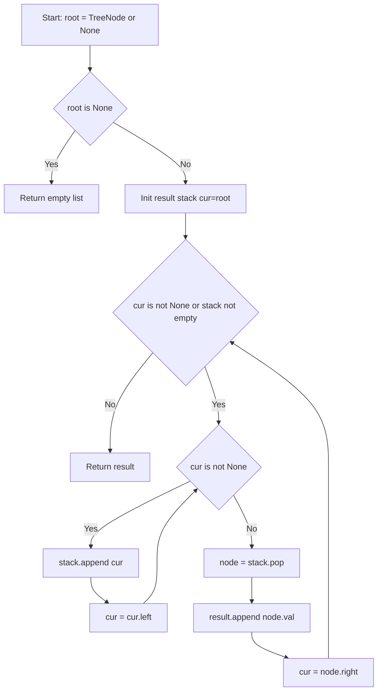
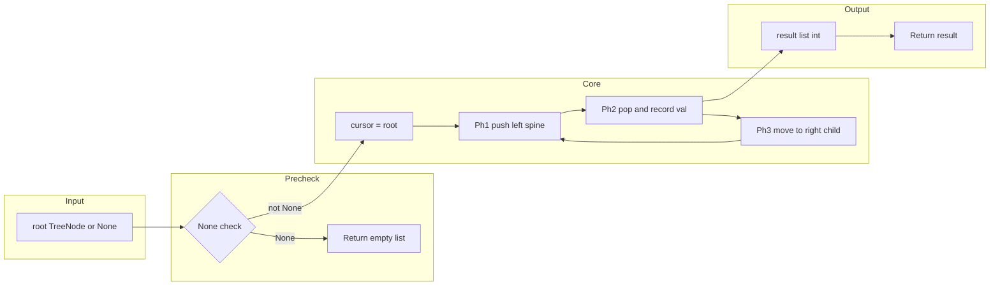

# Binary Tree Inorder Traversal - 反復スタックで中順走査を完全攻略

<h2 id="toc">目次</h2>

- [Overview](#overview)
- [Algorithm](#algorithm)
- [Complexity](#complexity)
- [Implementation](#implementation)
- [Optimization](#optimization)

---

<h2 id="overview">Overview</h2>

**LeetCode 94 — Binary Tree Inorder Traversal**

二分木の根ノード `root` が与えられるとき、**中順走査（左 → 根 → 右）** の順でノードの値を収集し、リストとして返す。

| 項目           | 内容                                                                    |
| -------------- | ----------------------------------------------------------------------- |
| 入力           | `root: Optional[TreeNode]`（ノード数 0 ≤ N ≤ 100、値 −100 ≤ val ≤ 100） |
| 出力           | `list[int]`（中順走査の値列）                                           |
| 想定データ構造 | `TreeNode`（`val / left / right`）                                      |
| Follow-up      | **再帰を使わない反復解**を実装せよ                                      |

### 要件まとめ

- 全ノードをちょうど一度訪問し、中順（左→根→右）で値を記録する
- 空木（`root is None`）は空リスト `[]` を返す
- Python のデフォルト再帰上限（1,000）に依存しない反復実装を提供する

### FAQ

**Q1. なぜ再帰ではなく反復で実装するのか？**

A. Follow-up で明示要求されているほか、Python のデフォルト再帰上限（1,000）を超える深さの木でスタックオーバーフローが発生するリスクがある。反復実装は `sys.setrecursionlimit()` 変更なしに任意深さの木を安全に処理できる。

**Q2. Morris Traversal（O(1) 空間）を選ばなかった理由は？**

A. Morris Traversal はノードの `left` ポインタを一時的に書き換えるため副作用がある（Pure function ではない）。本実装は入力ツリーへの書き込みを一切行わないため、関数の呼び出し前後でツリー構造が変化しない。可読性・安全性の観点からも反復スタック実装が優れている。

**Q3. `stack.pop()` の結果を `Optional[TreeNode]` にしなくていいのか？**

A. `while` ループの条件 `cur is not None or stack` により、Ph2 に到達する時点でスタックが空でないことが保証される。ただし型推論上は `stack.pop()` の戻り値が `TreeNode` と確定しないため、`node: TreeNode = stack.pop()` と明示的な型注釈を付与している。

**Q4. `list` と `deque` どちらをスタックとして使うべきか？**

A. 末尾への `append` / `pop(-1)` のみの操作なら CPython では `list` の方が高速。`deque` は両端操作が O(1) であるメリットが活きるのは `appendleft` / `popleft` を使う場合（BFS のキューなど）。スタック用途では `list` で十分。

**Q5. `from __future__ import annotations` が必要な理由は？**

A. Python 3.11 以降で `Optional[TreeNode]` の前方参照を文字列評価（PEP 563）するため。`TreeNode` クラスが `TYPE_CHECKING` ブロック内にある場合でも、実行時に評価が遅延されることでランタイムエラーを回避できる。

---

<h2 id="algorithm">Algorithm</h2>

### アルゴリズム要点 TL;DR

- **戦略**: 明示スタック＋カーソルポインタによる反復中順走査
- **データ構造**: `list[TreeNode]`（スタック）、`Optional[TreeNode]`（カーソル）
- **フェーズ**:
    1. **Ph1** — カーソルが非 `None` の間、左端までスタックに積む
    2. **Ph2** — スタックから `pop` → 値を記録
    3. **Ph3** — カーソルを右子に移して Ph1 へ戻る
- **終了条件**: カーソルが `None` かつスタックが空
- **時間計算量**: O(N) — 全ノードを一度だけ訪問
- **空間計算量**: O(N) — 明示スタックの最大深さ（最悪：左偏木）
- **再帰なし**: コールスタックを消費しないため深い木でも安全

### 図解

#### フローチャート



> **読み方**: 左端まで積む（Ph1）→ pop して記録（Ph2）→ 右へ移動（Ph3）の3フェーズを繰り返す。カーソルとスタックが共に空になった時点で終了。

#### データフロー図



> **データの流れ**: `root` → Noneガード → カーソル初期化 → 3フェーズのループ → `result` リストとして返却。

#### 具体的なトレース例

`root = [1, null, 2, 3]`（ツリー構造は下記）

```
      1
       \
        2
       /
      3
```

| ステップ | cur    | stack（底→top） | result    | 操作                        |
| -------- | ------ | --------------- | --------- | --------------------------- |
| 初期     | 1      | []              | []        | —                           |
| Ph1      | None   | [1]             | []        | 1 を push、left=None で停止 |
| Ph2      | —      | []              | [1]       | pop→1、val=1 を記録         |
| Ph3      | 2      | []              | [1]       | cur = right(2)              |
| Ph1      | 3→None | [2, 3]          | [1]       | 2 push → 3 push             |
| Ph2      | —      | [2]             | [1, 3]    | pop→3、val=3 を記録         |
| Ph3      | None   | [2]             | [1, 3]    | cur = right(None)           |
| Ph2      | —      | []              | [1, 3, 2] | pop→2、val=2 を記録         |
| Ph3      | None   | []              | [1, 3, 2] | ループ終了                  |

**Output: `[1, 3, 2]`** ✅

### 正しさのスケッチ

#### ループ不変条件

> 「`result` には、まだスタックに入っていない・未訪問でもない全ノードの値が中順で格納されている」

各反復で以下が保たれる:

1. **Ph1 完了後**: スタックには「現在の左端パスのノード」が底→根方向で積まれている
2. **Ph2 完了後**: `pop` したノードは左部分木を全て処理済み → 自身の値を記録するのが中順で正しい
3. **Ph3 完了後**: `cur = node.right` により、右部分木が次の未処理対象になる

#### 網羅性

- **左部分木**: Ph1 のループで再帰的に処理
- **根（自身）**: Ph2 の `pop` + `record` で処理
- **右部分木**: Ph3 でカーソルを移動 → 次の Ph1 が処理

#### 基底条件（終了性）

- 各反復で必ず `stack.pop()` が1回実行される（スタックサイズが単調減少）
- `cur` が `None` になりスタックも空になれば `while` ループが終了
- ノード数 N が有限なので、最大 N 回の pop で必ず終了する

---

<h2 id="complexity">Complexity</h2>

### 計算量

| 観点           | 値   | 理由                                                   |
| -------------- | ---- | ------------------------------------------------------ |
| **時間計算量** | O(N) | 各ノードをスタックに push 1回・pop 1回の合計 2N 操作   |
| **空間計算量** | O(N) | スタックの最大深さ（最悪: N ノードが全て左に偏った木） |

### アプローチ比較

| アプローチ                  | 時間 | 空間 | 可読性 | 安全性 | 備考                                               |
| --------------------------- | ---- | ---- | ------ | ------ | -------------------------------------------------- |
| **再帰 DFS**                | O(N) | O(N) | ★★★    | △      | 再帰上限 1,000 でスタックオーバーフロー            |
| **反復（明示スタック）** ✅ | O(N) | O(N) | ★★★    | ◎      | Follow-up 要件を満たす。本実装                     |
| **Morris Traversal**        | O(N) | O(1) | ★☆☆    | △      | ノードの `left` ポインタを一時書き換える副作用あり |

> **選択理由**: Follow-up で反復解が明示要求されており、Morris は入力ツリーを一時変更する副作用があるため不採用。反復スタック実装が安全性・可読性・要件適合の三拍子を満たす最適解。

---

<h2 id="implementation">Implementation</h2>

### Python 実装

```python
from __future__ import annotations

from typing import TYPE_CHECKING, Optional

if TYPE_CHECKING:
    # Pylance の型チェック用スタブ（実行時は LeetCode 環境の定義を使用）
    class TreeNode:
        val: int
        left: Optional[TreeNode]
        right: Optional[TreeNode]

        def __init__(
            self,
            val: int = 0,
            left: Optional[TreeNode] = None,
            right: Optional[TreeNode] = None,
        ) -> None: ...

# LeetCode 実行時フォールバック（TreeNode が未定義の環境向け）
try:
    TreeNode  # type: ignore[used-before-def]
except NameError:

    class TreeNode:  # type: ignore[no-redef]
        """最小フォールバック定義（__slots__ でメモリ最小化）"""

        __slots__ = ("val", "left", "right")

        def __init__(
            self,
            val: int = 0,
            left: Optional["TreeNode"] = None,
            right: Optional["TreeNode"] = None,
        ) -> None:
            self.val = val
            self.left = left
            self.right = right


class Solution:
    """
    LeetCode 94 - Binary Tree Inorder Traversal

    中順走査（左→根→右）を明示スタックによる反復で実装。
    Follow-up: 再帰を使わない反復解。
    """

    def inorderTraversal(self, root: Optional[TreeNode]) -> list[int]:
        """
        二分木の中順走査を反復スタックで実行する。

        Args:
            root: 二分木の根ノード（None = 空木）

        Returns:
            中順走査の値リスト。空木の場合は空リスト []。

        Complexity:
            Time:  O(N) - 全ノードを一度だけ訪問（push/pop 各 N 回）
            Space: O(N) - 明示スタックの最大深さ（最悪: 左偏木で N）
        """
        # ── ガード: 空木は即座に空リストを返す ──────────────────────────
        if root is None:
            return []

        result: list[int] = []             # 中順走査の結果を蓄積
        stack: list[TreeNode] = []         # 明示スタック（非 None のみ格納）
        cur: Optional[TreeNode] = root     # 現在注目しているノード

        # cur（未訪問）または stack（保留）のいずれかが残る間ループ
        while cur is not None or stack:

            # ── Ph1: 左端まで潜りながらスタックに積む ───────────────────
            while cur is not None:
                stack.append(cur)    # 自身と右部分木は後回し
                cur = cur.left       # 左へ進む

            # ── Ph2: スタック top を取り出して訪問 ──────────────────────
            # ループ条件より stack が空でないことは保証済み
            node: TreeNode = stack.pop()
            result.append(node.val)  # ← 中順で値を記録（左を全処理した後）

            # ── Ph3: 右部分木へカーソルを移す ───────────────────────────
            cur = node.right         # None なら次ループで即 Ph2 へ

        return result
```

### エッジケースと検証観点

| ケース               | 入力                     | 期待出力              | 本実装の挙動                                      |
| -------------------- | ------------------------ | --------------------- | ------------------------------------------------- |
| **空木**             | `root = None`            | `[]`                  | 冒頭ガードで即 `return []`                        |
| **単一ノード**       | `root = [1]`             | `[1]`                 | Ph1 で push、Ph2 で記録、Ph3 で `cur=None` → 終了 |
| **左偏木（深さ N）** | `[1,2,null,3,null,...]`  | `[N,...,2,1]`         | スタック深さ N まで積んでから順次 pop             |
| **右偏木（深さ N）** | `[1,null,2,null,3]`      | `[1,2,3]`             | Ph1 は毎回 1 回のみ push（スタック深さ常に 1）    |
| **完全二分木**       | `[1,2,3,4,5,null,8,...]` | `[4,2,6,5,7,1,3,9,8]` | 全フェーズが均等に動作                            |
| **負の値**           | `root = [-100]`          | `[-100]`              | `node.val` をそのまま記録（符号処理なし）         |
| **全ノード同値**     | `[0,0,0,0,0]`            | `[0,0,0,0,0]`         | 値の重複は問題なし（インデックス管理不要）        |

#### 静的型チェック（Pylance 対応確認点）

- `root: Optional[TreeNode]` — `None` との Union を明示
- `stack: list[TreeNode]` — 非 None のみ格納を型で保証
- `cur: Optional[TreeNode]` — カーソルの nullable を型で追跡
- `node: TreeNode` — `stack.pop()` 後に型を明示し `node.val` / `node.right` の属性アクセスを安全化

---

<h2 id="optimization">Optimization</h2>

### CPython 最適化ポイント

#### list.append / list.pop の C 実装活用

```python
# CPython の list は動的配列。append/pop(-1) は均償 O(1) で C レイヤーで動作
stack.append(cur)   # C 実装: オーバーヘッド最小
node = stack.pop()  # C 実装: pop(-1) はリアロケーション不要
```

> `collections.deque` は両端 O(1) が売りだが、末尾のみの操作なら `list` の方が CPython では高速。

#### 属性アクセスのローカル変数キャッシュ

```python
# N が大きい場合（本問題は N ≤ 100 なので省略可）
_append = result.append   # 属性ルックアップを1回に削減
_pop    = stack.pop

while cur is not None or stack:
    while cur is not None:
        stack.append(cur)
        cur = cur.left
    node = _pop()
    _append(node.val)
    cur = node.right
```

> N ≤ 100 の本問題では効果は誤差範囲だが、N が大きいユースケースへの応用時に有効。

#### 再帰上限の回避

```python
# Python デフォルト再帰上限: sys.getrecursionlimit() = 1000
# 深さ N の木で再帰 DFS を使うと N > 1000 でクラッシュ
# → 本実装の反復スタックは sys.setrecursionlimit() 不要で安全
```
