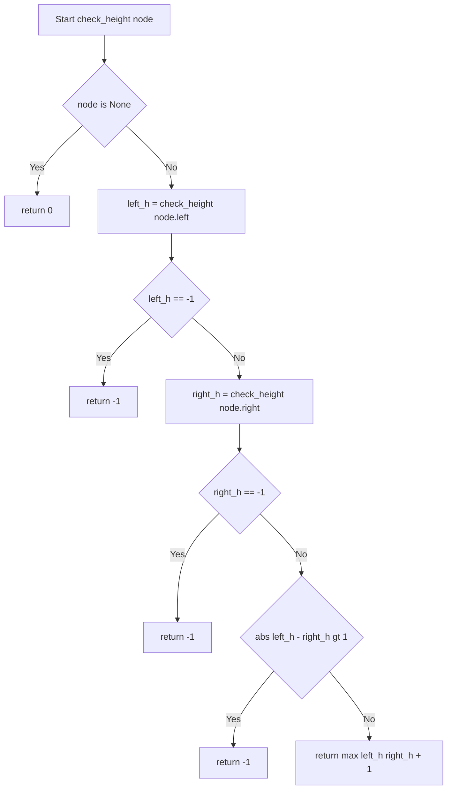
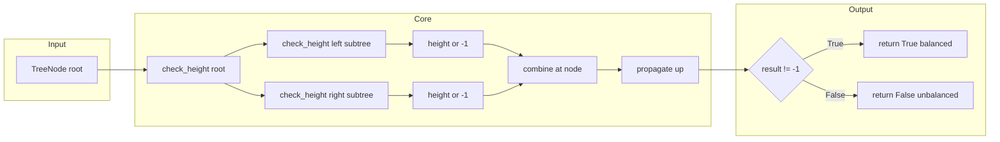

# Balanced Binary Tree — ボトムアップDFSで O(n) 判定

<h2 id="toc">目次</h2>

- [概要](#overview)
- [アルゴリズム要点（TL;DR）](#tldr)
- [図解](#figures)
- [正しさのスケッチ](#correctness)
- [計算量](#complexity)
- [Python 実装](#impl)
- [CPython最適化ポイント](#cpython)
- [エッジケースと検証観点](#edgecases)
- [FAQ](#faq)

---

<h2 id="overview">概要</h2>

> 💡 **この問題を一言で言うと**：「木のすべてのノードで、左右の枝の深さの差が1以内かどうかを判定する問題」です。

与えられた二分木が **高さ均衡（height-balanced）** かどうかを `True`/`False` で返します。高さ均衡とは、**すべてのノードにおいて**左サブツリーの高さと右サブツリーの高さの差が最大1であることを指します。

```
入力:  root = [3, 9, 20, null, null, 15, 7]
出力:  True

入力:  root = [1, 2, 2, 3, 3, null, null, 4, 4]
出力:  False

入力:  root = []
出力:  True
```

**なぜ難しいのか**：「全ノードで差が1以内」という条件は、根ノードだけでなく**葉に至るまですべてのノードで成立**しなければなりません。素朴に「高さを計算してから均衡を確認する」アプローチを取ると、同じノードを何度も訪問してしまい O(n²) になります。これを O(n) に改善するには、「高さ計算」と「均衡チェック」を**1パスで同時に行う**設計が必要です。

**制約**：

- ノード数：`0 ≤ n ≤ 5000`
- ノード値：`-10^4 ≤ Node.val ≤ 10^4`

> 📖 **この章で登場した用語**
>
> - **高さ均衡（height-balanced）**：木の全ノードで、左右の部分木の高さの差が最大1であるという性質
> - **サブツリー（部分木）**：あるノードを根として、そこから下のすべてのノードの集合
> - **葉ノード（leaf node）**：子ノードを持たない末端のノード
> - **制約**：入力として与えられる値の範囲や条件のこと

---

<h2 id="tldr">アルゴリズム要点（TL;DR）</h2>

> 💡 **TL;DR（Too Long; Didn't Read）**とは「長くて読めない人向けの要約」という意味の略語です。ここではアルゴリズム全体の戦略をまとめます。「なんとなくこういう手順で解くんだな」というイメージを掴むための章です。

- **手法**：ボトムアップDFS（深さ優先探索）＋ 番兵値 `-1`
    - 葉ノードから根ノードに向かって「高さ」を積み上げながら、同時に均衡チェックを行います。不均衡が確定した時点で番兵値 `-1` を上位ノードへ返すことで、無駄な探索を打ち切ります。
- **データ構造**：`TreeNode` への参照のみ。追加のリストや辞書は不要です。
    - 再帰のコールスタック（＝関数呼び出しが積み重なるメモリ領域）が唯一の追加メモリです。
- **時間計算量**：`O(n)` — 各ノードをちょうど1回だけ訪問します。
- **空間計算量**：`O(h)` — `h` は木の高さ。均衡木なら `O(log n)`、一直線の木（最悪）なら `O(n)`。
- **番兵値パターン**：高さは常に `≥ 0` なので、`-1` を「不均衡が検知済み」という特別な信号として使います。
    - これにより「高さを返す関数」と「均衡チェックを行う関数」を1つの関数にまとめられます。

> 📖 **この章で登場した用語**
>
> - **DFS（深さ優先探索 / Depth-First Search）**：木やグラフを「できるだけ深く進んでから戻る」方式で探索するアルゴリズム
> - **ボトムアップ**：葉ノード（末端）から根ノードに向かって結果を積み上げていく処理の方向
> - **番兵値（Sentinel Value）**：通常の値としてあり得ない特別な値を使ってエラーや特殊状態を表す手法
> - **コールスタック（Call Stack）**：関数呼び出しが積み重なっていく記録。再帰が深くなるほど大きくなる

---

<h2 id="figures">図解</h2>

> 💡 **Mermaidフローチャートの読み方**：ひし形 `{}` は「条件分岐」（はい/いいえの分かれ道）、長方形 `[]` は「処理ステップ」を表します。矢印のラベル（`Yes` / `No`）が処理の流れを示します。

## フローチャート

以下の図は `check_height(node)` 関数の処理の流れを表しています。上から下へ読み進めてください。`check_height` は `isBalanced` の内部で呼ばれ、結果（高さ または `-1`）を根ノードまで積み上げていきます。



**主要なノードの意味**：

- `Start[Start check_height node]`：`check_height` が呼ばれた入り口。引数 `node` は現在処理中のノード
- `BaseCheck{node is None}`：木の末端（これ以上子がない）かを判定する条件分岐
- `Ret0[return 0]`：空のノードは「高さ0の木」なので 0 を返す（ベースケース）
- `LeftCheck{left_h == -1}`：左サブツリーで不均衡が検知済みかを判定する早期リターン
- `BalCheck{abs left_h - right_h gt 1}`：このノードで左右の高さの差が大きすぎるかを判定
- `RetN1c[return -1]`：番兵値 `-1` を返して「不均衡」を上位ノードへ伝播させる
- `RetH[return max left_h right_h + 1]`：均衡OKのノードは「自分の高さ」を返して上位へ報告

---

### データフロー図

以下の図は、入力ツリーがどのように処理されて最終的な `True`/`False` が得られるかを示しています。



**主要な流れの説明**：

- `Input → check_height root`：ルートノードから再帰が始まる
- `check_height → left/right subtree`：左右のサブツリーを再帰的に処理する
- `height or -1 → combine at node`：左右の結果を受け取り、このノードでの均衡を判定する
- `propagate up`：結果（高さ または `-1`）を親ノードへ返していく
- `result != -1 → True/False`：最終的な判定を行う

---

💡 **代表例 `root = [3, 9, 20, null, null, 15, 7]` でのトレース**

>

```
Step 1: check_height(3) 開始

Step 2: check_height(9) を呼ぶ（node=3 の左）
        check_height(None) → 0 （9の左）
        check_height(None) → 0 （9の右）
        abs(0-0) = 0 ≤ 1 → 均衡OK
        return max(0,0) + 1 = 1
        → left_h = 1 （node=3 にとって）

Step 3: check_height(20) を呼ぶ（node=3 の右）
        check_height(15) → 1 （None + None から）
        check_height(7)  → 1 （None + None から）
        abs(1-1) = 0 ≤ 1 → 均衡OK
        return max(1,1) + 1 = 2
        → right_h = 2 （node=3 にとって）

Step 4: node=3 での均衡チェック
        abs(1-2) = 1 ≤ 1 → 均衡OK（ぎりぎり均衡）
        return max(1,2) + 1 = 3

Step 5: isBalanced → 3 != -1 → True ✅
```

> 📖 **この章で登場した用語**
>
> - **フローチャート**：処理の手順を図形と矢印で表したもの。ひし形=条件分岐、長方形=処理
> - **データフロー図**：データがどのように変換・移動するかを示す図
> - **伝播（propagate）**：ある値や信号が下位から上位へ（または逆に）次々と渡されていくこと

---

<h2 id="correctness">正しさのスケッチ</h2>

> 💡 **「正しさのスケッチ」**とは、アルゴリズムが**常に正しい答えを返すことの根拠**を整理したものです。数学的な厳密証明ではなく「なぜ正しいと言えるか」を直感的に説明します。

### 不変条件（アルゴリズムが正しく動くために、処理中ずっと成り立ち続けるべき条件）

`check_height(node)` が返す値は、常に以下のどちらかです：

1. `node` を根とするサブツリーが均衡している場合 → そのサブツリーの正確な高さ（`≥ 0`）
2. `node` を根とするサブツリーが不均衡の場合 → 番兵値 `-1`

この不変条件が成立する理由：

- 高さは「子の高さの最大値 + 1」で定義されるため、ベースケース（高さ0）から帰納的に正しい値が積み上がります
- `-1` は通常の高さとして絶対に現れない値（高さは常に `≥ 0`）なので、信号として安全に使えます

### 網羅性（すべてのケースをもれなく処理できているという保証）

`check_height` は以下の4パターンをすべてカバーしています：

| 状況                 | 条件                        | 処理                              |
| -------------------- | --------------------------- | --------------------------------- |
| 末端ノードに到達     | `node is None`              | `return 0`                        |
| 左サブツリーが不均衡 | `left_h == -1`              | `return -1`（早期リターン）       |
| 右サブツリーが不均衡 | `right_h == -1`             | `return -1`（早期リターン）       |
| このノードで不均衡   | `abs(left_h - right_h) > 1` | `return -1`                       |
| 均衡している         | 上記以外                    | `return max(left_h, right_h) + 1` |

### ベースケース（再帰の終了条件）

`node is None` のとき `return 0` を返します。これは「空の木の高さは0」という定義と一致します。空の木は高さの差を計算するノードが存在しないため、定義上「均衡している」と言えます（`0 != -1` なので `True` を返す）。

### 終了性（アルゴリズムが必ず有限ステップで終わるという保証）

`check_height` の再帰呼び出しは毎回 `node.left` または `node.right` を渡します。二分木は有限個のノードを持ち、各呼び出しで必ず「深さが1増える」ため、有限ステップで `None`（葉の下）に到達します。循環参照は二分木の定義上存在しないため、無限ループは発生しません。

> 📖 **この章で登場した用語**
>
> - **不変条件（Invariant）**：アルゴリズムが正しく動くために、処理中ずっと成り立ち続けるべき条件
> - **網羅性（Completeness）**：すべてのケースをもれなく処理できているという保証
> - **ベースケース（Base Case）**：再帰の終了条件。これがないと無限再帰になる
> - **終了性（Termination）**：アルゴリズムが必ず有限ステップで終わるという保証
> - **帰納的（Inductive）**：小さいケースが正しければ、より大きいケースも正しいという論法

---

<h2 id="complexity">計算量</h2>

> 💡 **計算量**とは「入力が大きくなるにつれて、処理にかかる時間・メモリがどう増えるか」の目安です。

| 記法       | 意味                   | 直感的なイメージ           |
| ---------- | ---------------------- | -------------------------- |
| `O(1)`     | 入力サイズによらず一定 | 辞書で直接ページを開く     |
| `O(log n)` | 入力の対数で増加       | 辞書を二分探索で引く       |
| `O(n)`     | 入力に比例して増加     | リストを端から順に読む     |
| `O(n²)`    | 入力の2乗で増加        | 全ペアを総当たりで確認する |

### このアルゴリズムの計算量

|          | 計算量 | 理由                                                                                                         |
| -------- | ------ | ------------------------------------------------------------------------------------------------------------ |
| **時間** | `O(n)` | `check_height` は各ノードをちょうど1回だけ訪問する。早期リターンにより不均衡が確定した先のノードは訪問しない |
| **空間** | `O(h)` | 再帰のコールスタックが木の高さ `h` 分だけ積み重なる                                                          |

`h` の具体的な値：

- **均衡木**（AVL木など）：`h = O(log n)` → 空間 `O(log n)`
- **最悪ケース**（一直線の木）：`h = O(n)` → 空間 `O(n)`

### 素朴な実装（トップダウン）との比較

| アプローチ                    | 時間計算量 | 空間計算量 | 備考                                                      |
| ----------------------------- | ---------- | ---------- | --------------------------------------------------------- |
| **ボトムアップDFS（本実装）** | `O(n)`     | `O(h)`     | 1パス。各ノードを1回だけ訪問                              |
| トップダウン再帰（素朴）      | `O(n²)`    | `O(h)`     | `height()` と `isBalanced()` を分離するため二重訪問が発生 |
| BFS（幅優先探索）             | `O(n)`     | `O(n)`     | `deque` の確保コストがある。実装も複雑                    |

**なぜトップダウンが O(n²) になるのか**：トップダウンでは「まず根での高さ差を確認 → 左右の子での高さ差を確認 → ...」と繰り返すため、深い部分のノードは繰り返し `height()` の計算対象になります。n 段の木では最悪 `1 + 2 + ... + n = O(n²)` の訪問回数になります。

> 📖 **この章で登場した用語**
>
> - **時間計算量（Time Complexity）**：入力の大きさに対して処理にかかる手間がどう増えるかの目安
> - **空間計算量（Space Complexity）**：処理中に使うメモリ量がどう増えるかの目安
> - **トップダウン（Top-Down）**：根ノードから葉ノードに向かって処理する方向
> - **コールスタック（Call Stack）**：関数呼び出しが積み重なっていく記録領域

---

<h2 id="impl">Python 実装</h2>

> 💡 **コードを読む前に、実装の全体的な骨格を確認しましょう。**
>
> 1. `isBalanced` が外部に公開するエントリポイント。内部で `check_height` を呼ぶ
> 2. `check_height` をネスト関数（関数の中の関数）として定義することで内部実装を隠す
> 3. ベースケース（`node is None`）を最初にチェックし `0` を返す
> 4. 左右のサブツリーを再帰的に処理し、`-1` が返ってきたら即座に `return -1`（早期リターン）
> 5. `abs(left_h - right_h) > 1` で均衡チェックを行い、OKなら `max(left_h, right_h) + 1` を返す
> 6. `isBalanced` は `check_height(root) != -1` を返す

```python
from __future__ import annotations
# from __future__ import annotations：型ヒントを文字列として扱うようにする宣言。
# Python 3.10 以前でも `TreeNode | None` のような記法を使えるようにするため。

from typing import Optional, TYPE_CHECKING

if TYPE_CHECKING:
    # TYPE_CHECKING ブロック：pylance（型チェッカー）のためだけに読まれる宣言。
    # 実行時には読み込まれないため、TreeNode が未定義でもエラーにならない。
    class TreeNode:
        val: int
        left: Optional[TreeNode]
        right: Optional[TreeNode]
        def __init__(
            self,
            val: int = 0,
            left: Optional[TreeNode] = None,
            right: Optional[TreeNode] = None,
        ) -> None: ...

# LeetCode の実行環境では TreeNode は事前に定義されている。
# ローカルで動かすときのフォールバック定義。
try:
    TreeNode  # 既に定義されていればこのブロックはスキップ
except NameError:
    class TreeNode:  # type: ignore[no-redef]
        # __slots__：属性をあらかじめ宣言し、辞書の代わりにスロットで管理する。
        # メモリ使用量を削減できる（ただし動的な属性追加は不可になる）。
        __slots__ = ("val", "left", "right")

        def __init__(
            self,
            val: int = 0,
            left: Optional[TreeNode] = None,
            right: Optional[TreeNode] = None,
        ) -> None:
            self.val = val
            self.left = left
            self.right = right


class Solution:
    def isBalanced(self, root: Optional[TreeNode]) -> bool:
        """
        二分木が高さ均衡かどうかを判定する。

        ボトムアップDFS + 番兵値パターンで O(n) を実現する。

        Args:
            root: 二分木のルートノード。空の木の場合は None。

        Returns:
            すべてのノードで左右の高さの差が 1 以内なら True、そうでなければ False。
        """

        def check_height(node: Optional[TreeNode]) -> int:
            """
            サブツリーの高さを返す。不均衡が検出された場合は -1 を返す。

            なぜネスト関数にするか：
            外部から直接呼べないようにし、「-1 という番兵値を返す」という
            内部の詳細を isBalanced の呼び出し元に見せないようにするため。
            また、ネスト関数はローカルスコープで名前解決されるため、
            クラスメソッドより少し高速（CPythonの名前解決の仕組みによる）。

            Args:
                node: 現在処理中のノード（None = 木の末端）

            Returns:
                均衡している場合は 0 以上の高さ、不均衡なら -1。
            """

            # ── ベースケース ────────────────────────────────────────────
            # node is None を使う理由：
            # Python の None はシングルトン（プログラム中に1つしか存在しないオブジェクト）。
            # `is` は「同じオブジェクトかどうか」を確認するため、
            # `== None` より意味的に正確で高速。PEP 8（Pythonの公式スタイルガイド）でも推奨。
            if node is None:
                # 空の木（ノードなし）の高さは 0。
                # この 0 が親ノードの left_h または right_h として使われる。
                return 0

            # ── 左サブツリーを再帰的に検査 ──────────────────────────────
            # node.left は Optional[TreeNode] 型（TreeNode か None のどちらか）。
            # None のときは次の再帰呼び出しでベースケースとして処理される。
            left_h: int = check_height(node.left)

            # 早期リターン（Early Return）：
            # 左で不均衡が確定していれば、右サブツリーを調べる必要が全くない。
            # これにより不必要な再帰呼び出しを省き、効率を保つ。
            if left_h == -1:
                return -1

            # ── 右サブツリーを再帰的に検査 ──────────────────────────────
            right_h: int = check_height(node.right)

            # 右サブツリーで不均衡が検知済みのときも、-1 を上位へ伝播させる。
            if right_h == -1:
                return -1

            # ── このノードでの均衡チェック ───────────────────────────────
            # abs() を使う理由：
            # 「左が深い」「右が深い」の両パターンを1行で処理でき、
            # かつ abs() はCPythonのC実装（組み込み関数）なので高速。
            if abs(left_h - right_h) > 1:
                # このノードで不均衡 → 番兵値 -1 を返して不均衡を上位へ知らせる
                return -1

            # ── このノードの高さを返す ────────────────────────────────────
            # このノードの高さ = 左右の最大値 + 自分自身の1段分。
            # +1 を忘れると高さが1ずれて正しい均衡チェックができなくなる。
            # max() もCPythonのC実装で高速。
            return max(left_h, right_h) + 1

        # check_height(root) が -1 でなければ、全ノードが均衡している。
        # -1 でない（True） = 均衡、-1（False） = 不均衡。
        return check_height(root) != -1
```

---

💡 **コードの動作トレース**（代表例 `root = [3, 9, 20, null, null, 15, 7]`）

```
isBalanced(root) 呼び出し
  → check_height(node=TreeNode(3)) 開始

  ├─ check_height(node=TreeNode(9))  ← 3の左
  │    ├─ check_height(None) → return 0    ← 9の左
  │    │   left_h=0; (0 != -1) → 継続
  │    ├─ check_height(None) → return 0    ← 9の右
  │    │   right_h=0; (0 != -1) → 継続
  │    ├─ abs(0-0) = 0 ≤ 1 → 均衡OK
  │    └─ return max(0,0)+1 = 1
  │
  │   left_h = 1; (1 != -1) → 継続
  │
  ├─ check_height(node=TreeNode(20))  ← 3の右
  │    ├─ check_height(TreeNode(15)) → return 1   ← 同様の手順
  │    │   left_h=1; (1 != -1) → 継続
  │    ├─ check_height(TreeNode(7))  → return 1
  │    │   right_h=1; (1 != -1) → 継続
  │    ├─ abs(1-1) = 0 ≤ 1 → 均衡OK
  │    └─ return max(1,1)+1 = 2
  │
  │   right_h = 2; (2 != -1) → 継続
  │
  ├─ abs(1-2) = 1 ≤ 1 → 均衡OK（ぎりぎり均衡）
  └─ return max(1,2)+1 = 3

check_height(root) = 3
3 != -1 → isBalanced = True ✅
```

**不均衡ケース** `root = [1, 2, 2, 3, 3, null, null, 4, 4]`（抜粋）：

```
 check_height(TreeNode(1)) ← ルート
   left_h  = check_height(2の左) = 3   （深い）
   right_h = check_height(2の右) = 1
   abs(3-1) = 2 > 1 → 不均衡！
   return -1

 check_height(root) = -1
 -1 == -1 → isBalanced = False ✅
```

> 📖 **この章で登場した用語**
>
> - **`from __future__ import annotations`**：型ヒントを文字列として扱うようにする宣言。前方参照の問題を回避できる
> - **`TYPE_CHECKING`**：`True` になるのは型チェッカー（pylance等）が解析するときだけ。実行時は `False`
> - **`Optional[X]`**：`X` または `None` のどちらかであることを表す型ヒント。`X | None` と同義（Python 3.10+）
> - **`__slots__`**：クラスの属性をあらかじめ宣言し、辞書の代わりにスロットで管理する機能
> - **ネスト関数（Nested Function）**：関数の中に定義された関数。外部スコープから直接呼べない
> - **早期リターン（Early Return）**：条件が確定した時点で即座に `return` する手法。ネストを浅く保てる

---

<h2 id="cpython">CPython最適化ポイント</h2>

> 💡 この章では「同じ処理でも書き方によって速さが変わる理由」を説明します。最適化テクニックは「最適化前 → 最適化後 → なぜ速いか」の3点セットで説明します。

### 最適化1：`is None` vs `== None`

```python
# 最適化前（遅い・意味的にも不正確）
if node == None:
    return 0

# 最適化後（速い・PEP 8 推奨）
if node is None:
    return 0
```

**なぜ速いか**：`== None` は `__eq__` メソッドを呼び出すため関数呼び出しのオーバーヘッドがあります。一方 `is` は「同じオブジェクトかどうか」をポインタ（＝メモリアドレス）の比較だけで判断するため、C レベルで1命令で完了します。`None` は Python のシングルトンなので `is` が意味的にも正確です。

---

### 最適化2：組み込み関数 `abs()` と `max()` の活用

```python
# 最適化前（Pure Python の条件分岐）
if left_h > right_h:
    diff = left_h - right_h
else:
    diff = right_h - left_h
if diff > 1:
    return -1

# 最適化後（C実装の組み込み関数を使う）
if abs(left_h - right_h) > 1:
    return -1
```

**なぜ速いか**：`abs()` と `max()` はCPythonのC実装（組み込み関数）であり、Pure Python（＝Pythonコードで書かれた処理）より高速に動作します。またコードが簡潔になり「左が深い」「右が深い」の両パターンを1行で処理できます。

```python
# 最終的な高さの計算も max() を使う（同様の理由）
return max(left_h, right_h) + 1
```

---

### 最適化3：ネスト関数でのローカルスコープ活用

```python
# 最適化前（クラスメソッドとして定義）
class Solution:
    def check_height(self, node):  # self 経由のアクセスで辞書検索が発生
        ...
    def isBalanced(self, root):
        return self.check_height(root) != -1

# 最適化後（ネスト関数として定義）
class Solution:
    def isBalanced(self, root):
        def check_height(node):  # ローカルスコープで名前解決 → 高速
            ...
        return check_height(root) != -1
```

**なぜ速いか**：Pythonの名前解決は「ローカル → エンクロージング → グローバル → 組み込み」の順に探索します（LEGB ルール）。ネスト関数はエンクロージングスコープで見つかるため、`self.check_height` のようにグローバルスコープ経由で辞書検索するより高速です。

---

### 最適化4：早期リターンによる枝刈り

```python
# 最適化なし（両サブツリーを必ず計算する）
left_h = check_height(node.left)
right_h = check_height(node.right)
if left_h == -1 or right_h == -1:
    return -1

# 最適化あり（左で不均衡が確定したら右を調べない）
left_h = check_height(node.left)
if left_h == -1:
    return -1          # ← ここで右サブツリーの探索をスキップ
right_h = check_height(node.right)
```

**なぜ速いか**：不均衡が左サブツリーで確定した時点で、右サブツリーの探索は結果に影響しません。早期リターン（枝刈り＝答えが得られないと分かった探索経路を途中で切り捨てること）により、最悪ケースに近い木での探索コストを大幅に削減できます。

> 📖 **この章で登場した用語**
>
> - **LEGB ルール**：Python の名前解決の優先順位。Local（ローカル）→ Enclosing（エンクロージング）→ Global（グローバル）→ Built-in（組み込み）の順
> - **C実装の組み込み関数**：`abs()` `max()` `len()` など、Pythonコードではなく C 言語で実装された関数。オーバーヘッドが少なく高速
> - **枝刈り（Pruning）**：答えが得られないと分かった探索経路を途中で切り捨てること。探索空間を削減できる
> - **シングルトン（Singleton）**：プログラム中に1つしか存在しないオブジェクト。Python の `None`・`True`・`False` がこれにあたる

---

<h2 id="edgecases">エッジケースと検証観点</h2>

> 💡 **エッジケース**とは「入力が空・最小値・最大値・特殊な形状」など、通常とは異なる境界的な入力のことです。エッジケースを見落とすと、普通のテストは通るのに特定の入力でだけバグが発生します。

| #   | エッジケース                     | 入力例                                          | 期待出力 | なぜ問題になりうるか                                                                                                                                |
| --- | -------------------------------- | ----------------------------------------------- | -------- | --------------------------------------------------------------------------------------------------------------------------------------------------- |
| 1   | **空の木**                       | `root = None`                                   | `True`   | ベースケースで即座に `0` を返すため、`check_height(None) = 0 != -1 → True` になることを確認                                                         |
| 2   | **ノード1個**                    | `root = [1]`                                    | `True`   | 左右ともに `None` → `abs(0-0) = 0 ≤ 1` → 均衡                                                                                                       |
| 3   | **片側にのみ子がある（右傾き）** | `root = [1, None, 2, None, 3]`                  | `False`  | 高さの差が `abs(0-2) = 2 > 1` となるため不均衡。`[1, None, 2]` の場合は `abs(0-1) = 1` で均衡（`True`）となる。                                     |
| 4   | **一直線の木（最悪ケース）**     | `[1, 2, null, 3, null, 4, ...]` n=5000          | `False`  | 再帰の深さが n=5000 に達する。LeetCodeの Python 環境は再帰上限が引き上げられているが、ローカルでは `sys.setrecursionlimit()` が必要になる場合がある |
| 5   | **完全二分木**                   | n=5000 の完全二分木                             | `True`   | すべてのノードで `abs(h_left - h_right) ≤ 1` が成立。高さは `O(log n)`                                                                              |
| 6   | **根のみ不均衡・子は均衡**       | `[1, 2, None, 3, 4]`                            | `False`  | 子ノードが均衡でも根ノードで `abs(2-0) = 2 > 1` → 不均衡                                                                                            |
| 7   | **根は均衡・深いところで不均衡** | `[1, 2, 2, 3, null, null, 3, 4, null, null, 4]` | `False`  | 根でのチェックを通過しても、深いノードで不均衡が検知されると `-1` が伝播する                                                                        |
| 8   | **ノード値が境界値**             | ノード値 = `-10^4` や `10^4`                    | 正常動作 | `val` は均衡チェックに影響しないため、値の大小は結果に無関係                                                                                        |

> 📖 **この章で登場した用語**
>
> - **エッジケース（Edge Case）**：空のリスト・要素1つ・最大サイズ入力など、境界的な条件の入力
> - **完全二分木（Complete Binary Tree）**：最後の段を除く全段が埋まっており、最後の段は左から詰まっている二分木
> - **再帰上限（Recursion Limit）**：Python が許可する最大の再帰深さ。デフォルトは 1000。`sys.setrecursionlimit()` で変更できる

---

<h2 id="faq">FAQ</h2>

> 💡 **FAQ（Frequently Asked Questions）**は「初学者がつまずきやすいポイント」を想定した質問と回答です。各回答は「結論 → 理由 → 補足（具体例）」の順で書かれています。

---

**Q1. なぜ番兵値として `-1` を使うのですか？ `False` を使えばよいのでは？**

**結論**：`-1` を使うのは、「高さを返す」と「不均衡を伝える」の2つの役割を1つの関数でこなすためです。

**理由**：`False` を返すと型が `bool` になり、「高さ（`int`）」と「不均衡フラグ（`bool`）」の2種類が混在して型安全でなくなります。`-1` は「高さは常に `≥ 0`」という性質を利用した安全な番兵値で、型を `int` 一種類に保てます。

**補足**：例えば `return (height, is_balanced)` のようにタプルで返すこともできますが、タプルの生成コストが発生します。`-1` を使う実装は最もシンプルで高速です。

---

**Q2. トップダウン再帰（素朴な方法）がなぜ O(n²) になるのか、具体例で教えてください。**

**結論**：トップダウンでは「高さ計算」と「均衡チェック」を別々に行うため、同じノードが複数回 `height()` の計算対象になります。

**理由**：以下の木を例に考えます。

```
        1
       / \
      2   3
     / \
    4   5
```

トップダウンで `isBalanced(1)` を呼ぶと：

1. `height(2)` と `height(3)` を計算（4, 5 を訪問）
2. `isBalanced(2)` を再帰呼び出し → また `height(4)` と `height(5)` を計算（二重訪問！）
3. `isBalanced(3)` を再帰呼び出し → また `height()` を計算

**補足**：一直線の木（n 段）では、最深ノードが `1 + 2 + ... + n = n(n+1)/2 = O(n²)` 回訪問されます。

---

**Q3. `node is None` と `not node` はどちらが良いですか？**

**結論**：`node is None` の方が推奨されます。

**理由**：`not node` は「`node` がFalsy（偽と評価される値）かどうか」を判定します。`None` はFalsyですが、`0`・`[]`・`""` もFalsyです。もし `TreeNode` が `__bool__` を実装していて特定の条件で `False` を返す場合、`not node` は意図しない動作をする可能性があります。`node is None` は「None と同じオブジェクトかどうか」だけを確認するため、常に意図通りに動作します。

**補足**：PEP 8（Pythonの公式コーディングスタイルガイド）でも `None` との比較には `is` / `is not` を使うことが明示されています。

---

**Q4. 再帰ではなくイテレーティブ（繰り返し処理）で実装できますか？**

**結論**：できます。ただし実装が大幅に複雑になります。

**理由**：再帰はコールスタックを暗黙的に利用しますが、イテレーティブ実装では自分でスタック（`deque` など）を管理し、「後処理」（子ノードを処理してから親を処理する後順DFS）を明示的に実装する必要があります。

**補足（イテレーティブの骨格）**：

```python
from collections import deque

stack: deque = deque()
heights: dict = {}
# ... post-order traversal を手動で実装する（複雑）
```

ノード数 n が最大 5000 という制約のもとでは、再帰の深さが問題になりにくいため、再帰実装の方がシンプルで保守性が高いです。

---

**Q5. `check_height` を `Solution` のメソッドとして定義するのと、ネスト関数にするのでは何が違いますか？**

**結論**：ネスト関数の方が「情報隠蔽」と「わずかな速度向上」の2点で優れています。

**理由**：

- **情報隠蔽**：`check_height` は「-1 という番兵値を返す内部実装」です。クラスメソッドにすると `solution.check_height(node)` として外部から呼べてしまい、番兵値パターンの内部実装が漏れます。ネスト関数にすると `isBalanced` の外から直接呼ぶことができません
- **速度**：Pythonの名前解決はローカルスコープが最速です（LEGB ルール）。ネスト関数はエンクロージングスコープで解決されるため、`self.check_height` のようにグローバル辞書を経由するより高速です

**補足**：チームのコーディング規約やコードの規模によっては、クラスメソッドとして定義して `_check_height`（アンダースコアで「内部メソッド」を示す慣習）とすることも一般的です。

> 📖 **この章で登場した用語**
>
> - **Falsy（偽値）**：`if` 文で `False` として評価される値。Python では `None`・`0`・`[]`・`""`・`{}` など
> - **後順DFS（Post-order DFS）**：左サブツリー → 右サブツリー → 自分自身 の順に訪問するDFS。ボトムアップ処理に対応
> - **情報隠蔽（Information Hiding）**：内部実装の詳細を外部から見えないようにすること。インターフェースをシンプルに保つ設計原則
> - **PEP 8**：Pythonの公式コーディングスタイルガイド。命名規則・空白の使い方・`is None` の使用など多くのルールを定めている

---

_LeetCode 110 — Balanced Binary Tree_
_アルゴリズム：ボトムアップDFS + 番兵値パターン | Time: O(n) | Space: O(h)_
