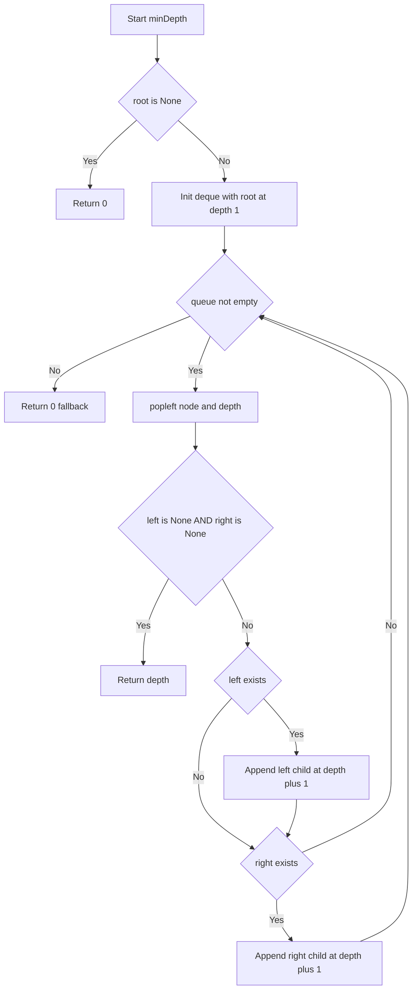
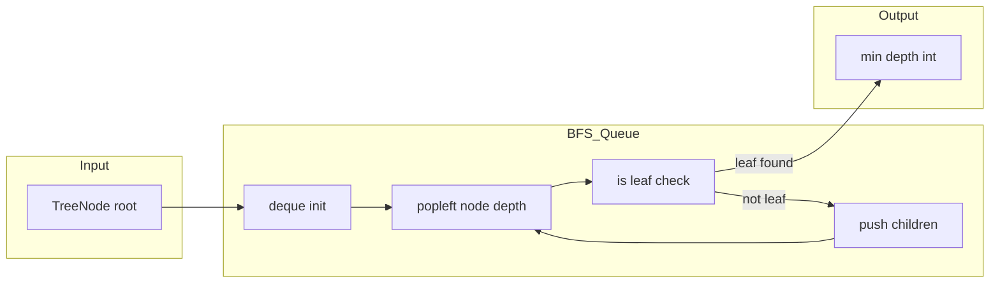

# Minimum Depth of Binary Tree — 根から最短で葉に到達する深さを求める

> **LeetCode #111** · 難易度: Easy · カテゴリ: Tree / BFS

---

## 目次

- [概要](#overview)
- [アルゴリズム要点（TL;DR）](#tldr)
- [図解](#figures)
- [正しさのスケッチ](#correctness)
- [計算量](#complexity)
- [Python 実装](#impl)
- [CPython 最適化ポイント](#cpython)
- [エッジケースと検証観点](#edgecases)
- [FAQ](#faq)

---

<h2 id="overview">3. 概要</h2>

> 💡 **一言で言うと**：「木の根（root）から、最も近い"末端ノード（葉）"までのノード数を数える問題」です。

### 問題の内容

二分木（＝各ノードが最大2つの子を持つ木）が与えられます。
根ノード（ツリーの頂点）から葉ノード（左右ともに子がない末端のノード）まで、
最も短いパスをたどったときの**ノードの個数**を返してください。

### なぜこの問題が難しいのか

一見「左右の深さを再帰で計算して `min()` で小さい方を返せばよい」と思えます。
ところが **大きな罠** があります。それは「片方の子が `None`（存在しない）のノードは葉ではない」という点です。

たとえば下の木を考えてみましょう。

```
  2
   \
    3
     \
      4
       \
        5
         \
          6  ← 唯一の葉
```

ノード `2` は左の子が `None` ですが、右の子 `3` があります。
単純に `min(左の深さ=0, 右の深さ=4)` を計算してしまうと `0 + 1 = 1` という誤答になります。
正しい答えは `5`（根から葉 `6` までの 5 ノード）です。
**「片方が `None` のときは、その方向を無視して有効な方向だけを探索する」という特別な処理が必要です。**

### 制約

| 項目       | 値                        |
| ---------- | ------------------------- |
| ノード数   | 0 以上 10^5 以下          |
| ノードの値 | -1000 以上 1000 以下      |
| 空の木     | ありえる（`root = None`） |

> 📖 **この章で登場した用語**
>
> - **二分木**：各ノードが最大 2 つの子（左・右）を持つ木構造のデータ
> - **根ノード（root）**：木の頂点にある1つのノード。入口となる
> - **葉ノード（leaf）**：左の子も右の子も持たないノード。木の末端
> - **パス**：木の上を根から葉まで辿る経路。親から子へ一方向にしか進めない
> - **制約**：入力として与えられる値の範囲や条件のこと

---

<h2 id="tldr">4. アルゴリズム要点（TL;DR）</h2>

> 💡 **TL;DR（Too Long; Didn't Read）**とは「長くて全部読めない人向けの短い要約」を意味します。
> ここではアルゴリズム全体の戦略を箇条書きでまとめます。
> 「なんとなくこういう手順で解くんだな」というイメージを掴む章として位置づけています。

### 戦略：BFS（幅優先探索）で根から層ごとに探す

1. **BFS を選ぶ理由**：「最短」を求める問題には BFS が自然に合致する。
   BFS は浅い層から順に探索するため、**最初に葉を見つけた瞬間**、それが確実に最小深さです。
   DFS（深さ優先探索）のように全葉を比較する必要がなく、早期終了できます。

2. **データ構造：`collections.deque`（デック）を使う**
   キュー（＝先に入れたものを先に取り出す「行列」のようなデータ構造）として `deque` を使います。
   `list` の先頭削除（`pop(0)`）は O(n) のコストがかかりますが、`deque.popleft()` は O(1) です。

3. **ノードと深さをセットで管理**
   キューの各要素を `(ノード, 現在の深さ)` のタプルで持ちます。
   外部のカウンタ変数を使わないので、コードがシンプルになります。

4. **葉ノードの判定を正しく行う**
   `node.left is None and node.right is None` の場合だけが葉です。
   片方が `None` でも、もう片方に子がいれば葉ではありません。

5. **計算量のまとめ**
    - 時間計算量：O(n) — 最悪ケースで全ノードを 1 回ずつ処理する
    - 空間計算量：O(w) — w は木の最大幅（キューに同時に入る最大ノード数）

> 📖 **この章で登場した用語**
>
> - **BFS（幅優先探索）**：木を「浅い層から順に横に広がりながら」探索する方法。キューを使う
> - **DFS（深さ優先探索）**：木を「根から葉まで深く一本道を掘り進んで」探索する方法。再帰やスタックを使う
> - **deque（デック）**：前からも後ろからも O(1) で出し入れできる「両端開きの箱」のようなデータ構造
> - **タプル**：複数の値を一組にまとめた変更不可のデータ。`(node, 1)` のように書く
> - **早期終了**：答えが確定した瞬間にループを抜けること。無駄な処理をスキップして高速化できる

---

<h2 id="figures">5. 図解</h2>

> 💡 **Mermaid フローチャートの読み方**
>
> - **長方形（`[]`）**：何かの処理を行うステップです
> - **ひし形（`{}`）**：条件を判定する分岐点です。「Yes/No」「True/False」で次の矢印が変わります
> - **矢印（`-->`）**：処理の流れを示します。ラベルが付いているときはその条件のときに進みます

### フローチャート

この図は `minDepth` 関数全体の処理の流れを表しています。上から下へ読み進めてください。
特に `LeafTest`（葉判定）の部分が、この問題の核心です。



**主要なノードの意味：**

- `Start[Start minDepth]`：関数の入口。`root` を受け取る
- `NullCheck{root is None}`：空の木かどうかを最初に確認する分岐（エッジケース処理）
- `Init[Init deque...]`：BFS 用キューに根ノードと深さ 1 を入れて探索を開始する
- `Loop{queue not empty}`：キューにノードが残っている間ループを続ける分岐
- `Pop[popleft node and depth]`：キューの先頭からノードと深さを取り出す（BFS の核心）
- `LeafTest{left is None AND right is None}`：葉ノードかどうかを判定する分岐（この問題の罠がここ）
- `Ret[Return depth]`：葉が見つかったので最小深さを返す（早期終了）
- `PushL / PushR`：子ノードが存在する場合だけキューに追加する

---

### データフロー図

この図は「入力の木構造がどのようにキューを通って最終的な深さの数値に変換されるか」のデータの流れを表しています。



**主要な流れの説明：**

- `A → B`：根ノードをキューに投入し BFS を開始する
- `B → C`：キューから先頭要素を取り出す（popleft）
- `C → D`：取り出したノードが葉かどうかを判定する
- `D -- leaf found → F`：葉なら即座に深さを返す（早期終了）
- `D -- not leaf → E`：葉でなければ子をキューに追加して探索を継続する
- `E → C`：ループ（次のノードを取り出す）

---

### 代表例でのトレース

#### Example 1：`root = [3, 9, 20, null, null, 15, 7]` → 期待値: `2`

```
木の形状:
        3        ← 深さ 1
       / \
      9   20     ← 深さ 2
         /  \
        15    7  ← 深さ 3

Step 0: キュー初期化
  queue = deque([ (Node(val=3), depth=1) ])

Step 1: popleft → (Node(3), depth=1)
  Node(3).left  = Node(9)   → None ではない
  Node(3).right = Node(20)  → None ではない
  → LeafTest: False（両方に子がいる）
  → PushL: queue に (Node(9),  depth=2) を追加
  → PushR: queue に (Node(20), depth=2) を追加
  queue = deque([ (Node(9),2), (Node(20),2) ])

Step 2: popleft → (Node(9), depth=2)
  Node(9).left  = None  ← None
  Node(9).right = None  ← None
  → LeafTest: True！（両方 None = 葉ノード）
  → Return 2  ← 🎯 最小深さ確定！残りのキューは処理不要

Answer: 2 ✅
```

#### Example 2：`root = [2, null, 3, null, 4, null, 5, null, 6]` → 期待値: `5`

```
木の形状:
  2            ← 深さ 1（左の子が null）
   \
    3          ← 深さ 2
     \
      4        ← 深さ 3
       \
        5      ← 深さ 4
         \
          6    ← 深さ 5（唯一の葉）

Step 0: キュー初期化
  queue = deque([ (Node(2), depth=1) ])

Step 1: popleft → (Node(2), depth=1)
  Node(2).left  = None     ← None
  Node(2).right = Node(3)  ← None ではない！
  → LeafTest: False（right に子がいる → 葉ではない）
  ⚠️ 罠: left が None でも right があれば葉でないことに注意
  → PushL: スキップ（left は None なので追加しない）
  → PushR: queue に (Node(3), depth=2) を追加
  queue = deque([ (Node(3),2) ])

Step 2〜5: 同様に Node(3)→Node(4)→Node(5) を処理
  各ノードの right のみキューに追加
  queue の状態:
    Step 2後: deque([ (Node(4),3) ])
    Step 3後: deque([ (Node(5),4) ])
    Step 4後: deque([ (Node(6),5) ])

Step 5: popleft → (Node(6), depth=5)
  Node(6).left  = None  ← None
  Node(6).right = None  ← None
  → LeafTest: True！（両方 None = 葉ノード）
  → Return 5  ← 🎯 最小深さ確定！

Answer: 5 ✅
```

> 📖 **この章で登場した用語**
>
> - **フローチャート**：処理の手順を図形と矢印で表したもの。ひし形=条件分岐、長方形=処理ステップ
> - **データフロー図**：データがどのように変換・移動するかを示す図。処理の手順ではなく「データの変化」に着目する
> - **トレース**：具体的な入力を使ってアルゴリズムの各ステップで変数がどう変わるかを追うこと

---

<h2 id="correctness">6. 正しさのスケッチ</h2>

> 💡 **「正しさのスケッチ」とは**：アルゴリズムが常に正しい答えを返せる根拠を整理したものです。
> 厳密な数学的証明ではなく「なぜ正しいと言えるのか」の直感的な説明です。

### 不変条件（ループ中ずっと成り立つべき条件）

**「キューに入っているノードは、その深さが正しく記録されている」**

- キューに最初に入れる `(root, 1)` は根ノードの深さ 1 で正しい
- 子ノードを追加するとき `depth + 1` とするのは、「親より 1 深い位置にある」という木の定義から正しい
- したがって、ループを何回繰り返しても「キュー内の各要素のノードと深さの組み合わせ」は常に正しい

### 網羅性（すべてのケースを処理できているか）

BFS は同じ層のノードをすべてキューに入れてから次の層に進みます。
これにより「深さ 1 のノード → 深さ 2 のノード → ...」と順番に処理されます。
あるノードを「スキップ」することはないため、全てのノードを1回ずつ処理します。

> **ただし**、葉が見つかった時点で即 `return` するため、残りのノードは処理されません。
> これは問題ありません。なぜなら BFS の性質上、**最初に見つかった葉が確実に最小深さの葉**だからです。

### 基底条件（終了条件）

二重の終了条件があります：

1. **`root is None`**：空の木は葉への道がないため深さ 0 を返す。この処理がないと `None.left` でクラッシュする
2. **`node.left is None and node.right is None`**：葉ノードを見つけたら即 `return`。BFS は浅い順に処理するので最初の葉 = 最小深さ

### 終了性（必ず有限ステップで終わるか）

- ノード数は有限（最大 10^5）
- 各ノードは一度だけキューに追加される（親から子への一方向）
- したがってループは最大でもノード数回で終了する

> 📖 **この章で登場した用語**
>
> - **不変条件（ループ不変式）**：アルゴリズムが正しく動くために、処理中ずっと成り立ち続けるべき条件
> - **網羅性**：すべてのケースをもれなく処理できているという保証
> - **基底条件**：再帰やループの終了条件。これがないと無限ループ/クラッシュになる
> - **終了性**：アルゴリズムが必ず有限ステップで終わるという保証

---

<h2 id="complexity">7. 計算量</h2>

> 💡 **計算量とは**：「入力が大きくなるにつれて、処理にかかる時間・メモリがどう増えるか」の目安です。
> Big-O 記法（O(n) のような書き方）を使って表します。

| 記法       | 意味                   | 直感的なイメージ               |
| ---------- | ---------------------- | ------------------------------ |
| O(1)       | 入力サイズによらず一定 | 辞書で直接ページを開く         |
| O(n)       | 入力に比例して増加     | リストを端から順に読む         |
| O(n log n) | n よりやや速く増加     | 辞書を二分探索で引く × n 回    |
| O(n²)      | 入力の 2 乗で増加      | 全ペアを総当たりで確認する     |
| O(w)       | 木の最大幅に比例       | その層に存在するノード数に依存 |

### この問題の計算量

| 観点           | 計算量 | 説明                                                                                                                                 |
| -------------- | ------ | ------------------------------------------------------------------------------------------------------------------------------------ |
| **時間計算量** | O(n)   | 全ノード数を n とすると、各ノードを最大 1 回だけキューから取り出す。葉が見つかれば早期終了するため、平均的にはさらに速い             |
| **空間計算量** | O(w)   | w は木の最大幅（1 つの層に存在する最大ノード数）。キューには同じ層のノードが同時に入るため、キューサイズの最大値は木の最大幅に等しい |

### 最悪ケースでの空間計算量

- **完全二分木**（バランスの取れた木）：最下層のノード数は n/2 個なので **O(n)**
- **直線状の木**（一方向にのみ伸びる木）：常に 1 ノードずつキューに入るため **O(1)**

### DFS（再帰）との比較

| 手法            | 時間計算量 | 空間計算量 | 備考                                         |
| --------------- | ---------- | ---------- | -------------------------------------------- |
| **BFS（採用）** | O(n)       | O(w)       | 早期終了あり。葉が浅い場合に高速             |
| DFS（再帰）     | O(n)       | O(h)       | h = 木の高さ。直線状の木で再帰制限リスクあり |
| DFS（反復）     | O(n)       | O(h)       | スタックオーバーフローを回避できる           |

> ※ h = 木の高さ（最悪 O(n)、完全二分木では O(log n)）
> 📖 **この章で登場した用語**
>
> - **時間計算量**：入力の大きさに対して処理にかかる手間がどう増えるかの目安
> - **空間計算量**：処理中に使うメモリ量がどう増えるかの目安
> - **木の幅（w）**：ある 1 つの層に存在するノードの個数。BFS のキューサイズはこれに比例する
> - **木の高さ（h）**：根から最も深い葉までのノード数。DFS の再帰深度はこれに比例する
> - **早期終了**：答えが確定した瞬間に処理を打ち切ること。平均的な実行時間を短縮できる

---

<h2 id="impl">8. Python 実装</h2>

> 💡 **コードを読む前に：実装の全体的な骨格**
>
> 1. `from __future__ import annotations` で型ヒントの前方参照（自己参照）を有効にする
> 2. `TreeNode` のフォールバック定義を `try/except NameError` で用意する（LeetCode 環境では不要）
> 3. `root is None` のエッジケースを最初に処理する
> 4. `deque` でキューを初期化し、根ノードと深さ 1 を入れる
> 5. BFS ループで `popleft()` → 葉判定 → 子をキューに追加 を繰り返す
> 6. 最初に葉を見つけた時点で `return depth`（早期終了）

```python
from __future__ import annotations
# 型ヒントの前方参照を文字列として遅延評価する（TreeNode が自分自身を参照するため）

from collections import deque
# deque: popleft() が O(1) のキュー用データ構造。list.pop(0) は O(n) なので使わない

from typing import Optional, TYPE_CHECKING
# Optional[X]: X か None のどちらかであることを表す型ヒント

# ──────────────────────────────────────────────────────────────────
# TreeNode の定義
#
# LeetCode 環境では TreeNode が自動的に定義されている。
# ローカル実行（テストや IDE）では NameError が発生するため、
# try/except でフォールバック定義を用意しておく。
#
# if TYPE_CHECKING: ブロックは pylance（型チェッカー）だけが読むブロックで、
# 実行時には評価されない。pylance に正確な型情報を伝えるために使う。
# ──────────────────────────────────────────────────────────────────
if TYPE_CHECKING:
    # pylance 向けの型スタブ（実行時には読まれない）
    class TreeNode:
        val: int
        left: Optional[TreeNode]
        right: Optional[TreeNode]

        def __init__(
            self,
            val: int = 0,
            left: Optional[TreeNode] = None,
            right: Optional[TreeNode] = None,
        ) -> None: ...

try:
    TreeNode  # noqa: F821  LeetCode 環境で定義済みかチェック
except NameError:
    class TreeNode:  # type: ignore[no-redef]
        """
        ローカル実行用の最小定義。
        __slots__ を使うことでインスタンスごとの辞書作成を避け、
        メモリを節約する。
        """
        __slots__ = ("val", "left", "right")

        def __init__(
            self,
            val: int = 0,
            left: Optional[TreeNode] = None,
            right: Optional[TreeNode] = None,
        ) -> None:
            self.val: int = val
            self.left: Optional[TreeNode] = left
            self.right: Optional[TreeNode] = right


class Solution:
    def minDepth(self, root: Optional[TreeNode]) -> int:
        """
        二分木の最小深さを BFS（幅優先探索）で求める。

        最小深さとは「根から最も近い葉ノードまでのノード数」のこと。
        葉ノードとは左右どちらにも子を持たないノードを指す。

        Args:
            root: 二分木の根ノード。None の場合は空の木を表す。

        Returns:
            最小深さ（整数）。空の木の場合は 0 を返す。

        Time Complexity:  O(n)  — 最悪ケースで n 個のノードを 1 回ずつ処理する
        Space Complexity: O(w)  — w はキューの最大サイズ（木の最大幅）
        """
        # ────────────────────────────────────────────────────────────
        # エッジケース: 空の木（root が None）
        # 根がなければ葉への道も存在しないため、深さは 0 を返す。
        # ここでチェックしないと、次行の queue.append((root, 1)) で
        # None をキューに入れてしまい、後で node.left にアクセスする際
        # AttributeError が発生する。
        # ────────────────────────────────────────────────────────────
        if root is None:
            return 0

        # ────────────────────────────────────────────────────────────
        # BFS 用キューの初期化
        #
        # なぜ list ではなく deque を使うのか：
        #   list.pop(0) は O(n) → 先頭削除のたびに全要素を 1 つ左にずらす
        #   deque.popleft() は O(1) → ポインタを動かすだけで完結する
        #   ノード数が最大 10^5 の場合、この差は無視できない
        #
        # キューの各要素は (ノード, 現在の深さ) のタプル。
        # 深さを外部のカウンタで管理せず、ノードと一緒に持ち運ぶことで
        # バグが入り込む余地を減らしている。
        # ────────────────────────────────────────────────────────────
        queue: deque[tuple[TreeNode, int]] = deque()
        queue.append((root, 1))  # 根ノードの深さは 1

        # ────────────────────────────────────────────────────────────
        # BFS メインループ
        # キューが空になるまで（= 全ノードを処理し終えるまで）繰り返す
        # ────────────────────────────────────────────────────────────
        while queue:
            # 先頭から取り出す（FIFO: 先に入れたものを先に取り出す）
            # popleft() は O(1) の操作（deque を使う主な理由）
            node, depth = queue.popleft()

            # ──────────────────────────────────────────────────────
            # 葉ノード判定
            #
            # 葉の条件: 左の子も右の子も None であること
            # ※ 片方だけ None のノードは葉ではない（重要な罠）
            #
            # BFS は浅い層から順に処理するため、
            # 最初に葉を見つけた時点でそれが確実に最小深さ。
            # 残りのキューを処理する必要はないので即 return する。
            # ──────────────────────────────────────────────────────
            if node.left is None and node.right is None:
                return depth  # 🎯 最小深さ確定、即 return

            # ──────────────────────────────────────────────────────
            # 子ノードをキューに追加する
            #
            # None の子を追加しないよう、必ず存在チェックを先に行う。
            # None をキューに入れると次のループで node.left にアクセス
            # できず AttributeError が発生する。
            # ──────────────────────────────────────────────────────
            if node.left is not None:
                # 左の子が存在する場合のみキューに追加
                # 深さは親の深さ + 1（1 段深くなるため）
                queue.append((node.left, depth + 1))

            if node.right is not None:
                # 右の子が存在する場合のみキューに追加（左と同様）
                queue.append((node.right, depth + 1))

        # ────────────────────────────────────────────────────────────
        # フォールバック（通常はここに到達しない）
        #
        # root が None でない有効な木には必ず葉が存在するため、
        # while ループ内の return で必ず値が返る。
        # pylance に「関数が必ず int を返す」ことを保証するために記述。
        # ────────────────────────────────────────────────────────────
        return 0
```

---

### コードの動作トレース

#### Example 1：`root = [3, 9, 20, null, null, 15, 7]`

```
呼び出し: solution.minDepth(root)
  root = Node(3)

  1. if root is None → False（root は存在する）→ 通過
  2. queue 初期化: deque([ (Node(3), 1) ])

  === ループ 1 回目 ===
  popleft → node=Node(3), depth=1
  葉判定: Node(3).left=Node(9) is None → False → 葉でない
  PushL: Node(3).left=Node(9) is not None → queue.append((Node(9), 2))
  PushR: Node(3).right=Node(20) is not None → queue.append((Node(20), 2))
  queue = deque([ (Node(9),2), (Node(20),2) ])

  === ループ 2 回目 ===
  popleft → node=Node(9), depth=2
  葉判定: Node(9).left=None AND Node(9).right=None → True！
  → return 2  ← 🎯 確定

最終結果: 2 ✅
```

#### Example 2：`root = [2, null, 3, null, 4, null, 5, null, 6]`

```
  1. if root is None → False → 通過
  2. queue 初期化: deque([ (Node(2), 1) ])

  === ループ 1 回目 ===
  popleft → node=Node(2), depth=1
  葉判定: Node(2).left=None, Node(2).right=Node(3)
    → left は None だが right は None でない → False（葉でない！罠）
  PushL: Node(2).left=None → スキップ
  PushR: Node(2).right=Node(3) is not None → queue.append((Node(3), 2))
  queue = deque([ (Node(3),2) ])

  === ループ 2〜5 回目（同様）===
  Node(3)→queue.append((Node(4),3))
  Node(4)→queue.append((Node(5),4))
  Node(5)→queue.append((Node(6),5))

  === ループ 6 回目 ===
  popleft → node=Node(6), depth=5
  葉判定: Node(6).left=None AND Node(6).right=None → True！
  → return 5  ← 🎯 確定

最終結果: 5 ✅
```

> 📖 **この章で登場した用語**
>
> - **`from __future__ import annotations`**：型ヒントを文字列として遅延評価するようにする宣言。`TreeNode` が自分自身を型ヒントで参照するときに必要
> - **`TYPE_CHECKING`**：実行時は `False`、pylance などの型チェッカー実行時は `True` になる定数。型スタブをこのブロックに書くことでランタイムコストを避けられる
> - **`Optional[TreeNode]`**：`TreeNode` か `None` のどちらかであることを表す型ヒント。pylance が `None` チェックを強制してくれる
> - **`__slots__`**：クラスのインスタンス変数を固定することで、通常の辞書の代わりに軽量な構造でメモリを節約する仕組み
> - **フォールバック**：「本来は到達しないが念のため書いておく処理」。pylance に全パスで `int` を返すことを証明するために必要

---

<h2 id="cpython">9. CPython 最適化ポイント</h2>

> 💡 **この章では**：同じ処理でも Python の書き方によって速さが変わる理由を説明します。
> 「最適化前 → 最適化後 → なぜ速くなるか」の 3 点セットで解説します。

### 最適化ポイント 1：`list.pop(0)` を `deque.popleft()` に置き換える

BFS の実装でよく見かける間違いが、`list` をキューとして使うことです。

```python
# ❌ 最適化前：list を使ったキュー（遅い）
queue: list[tuple[TreeNode, int]] = [(root, 1)]
# ...
node, depth = queue.pop(0)  # O(n): 全要素を左に 1 つずつずらす処理が発生する

# ✅ 最適化後：deque を使ったキュー（速い）
from collections import deque
queue: deque[tuple[TreeNode, int]] = deque([(root, 1)])
# ...
node, depth = queue.popleft()  # O(1): ポインタを移動するだけで完結する
```

**なぜ速くなるのか**：
Python の `list` は内部的に連続したメモリ配列（C言語の配列）で実装されています。
先頭要素を削除すると、残り全要素を 1 つ左にずらさなければならないため O(n) のコストがかかります。
`deque` は双方向連結リスト（ポインタで繋がれた箱の連鎖）で実装されており、
先頭のポインタを動かすだけで済むため O(1) で削除できます。

ノード数が 10^5 の場合、`pop(0)` を使うと最悪 O(n²) に劣化しますが、`popleft()` なら O(n) を保てます。

---

### 最適化ポイント 2：早期終了（Early Return）を活用する

BFS の利点は「最初に葉を見つけた瞬間に終了できる」ことです。

```python
# ✅ 葉を見つけた瞬間に return する（早期終了）
if node.left is None and node.right is None:
    return depth  # ← ここで即終了。残りのキューは処理しない
```

例えば完全二分木の場合、深さ k の葉を最初に見つけた時点で終了するため、
より深い葉（深さ k+1, k+2, ...）の探索を完全にスキップできます。

---

### 最適化ポイント 3：`is None` vs `== None`

```python
# ❌ 最適化前（遅い・pylance 警告も出る）
if node.left == None:
    ...

# ✅ 最適化後（速い・Pythonic）
if node.left is None:
    ...
```

**なぜ `is None` の方が速いのか**：
`== None` は `__eq__` メソッドを呼び出して比較します（メソッド呼び出しのオーバーヘッドあり）。
`is None` はオブジェクトの ID（メモリアドレス）を直接比較するため、より高速です。
また Python の `None` はシングルトン（プログラム内で唯一のオブジェクト）なので `is` で正しく比較できます。

---

### 最適化ポイント 4：ノードと深さをタプルで一緒に管理する

```python
# ❌ 最適化前：外部のカウンタで深さを管理（バグが入りやすい）
queue = deque([root])
depth = 0
level_size = 1
while queue:
    depth += 1
    for _ in range(level_size):
        node = queue.popleft()
        if not node.left and not node.right:
            return depth
        ...
    level_size = len(queue)

# ✅ 最適化後：ノードと深さをタプルで一緒に持ち運ぶ（シンプル）
queue: deque[tuple[TreeNode, int]] = deque([(root, 1)])
while queue:
    node, depth = queue.popleft()  # 深さが常にノードと一致する
    ...
```

タプルアンパック（`node, depth = queue.popleft()`）は CPython 内部で最適化されており、
辞書や別オブジェクトを使うよりもメモリ効率が良く、高速です。

> 📖 **この章で登場した用語**
>
> - **連続したメモリ配列**：要素がメモリ上に隙間なく並んだデータ構造。先頭削除に O(n) かかる
> - **双方向連結リスト**：各要素が前後の要素へのポインタを持つデータ構造。先頭・末尾操作が O(1)
> - **シングルトン**：プログラム内で同じ型のインスタンスが 1 つしか存在しないオブジェクト。Python の `None`, `True`, `False` がこれにあたる
> - **タプルアンパック**：`a, b = (1, 2)` のように、タプルの要素を複数の変数に同時に代入すること
> - **O(n²) に劣化**：入力が 2 倍になると処理が 4 倍になること。`pop(0)` を n 回繰り返すと合計 O(n²) になる

---

<h2 id="edgecases">10. エッジケースと検証観点</h2>

> 💡 **エッジケースとは**：「空のツリー・ノード 1 つ・直線状の木」など、境界的な入力のことです。
> エッジケースを見落とすと、普通のテストは通るのに特定の入力でだけバグが発生します。
> 各ケースについて「なぜそのケースが問題になりうるか」を確認しておきましょう。

| #   | ケース名      | 入力例                           | 期待値 | なぜ問題になりうるか                                                                    |
| --- | ------------- | -------------------------------- | ------ | --------------------------------------------------------------------------------------- |
| 1   | 空の木        | `root = None`                    | `0`    | `root.left` にアクセスするとクラッシュする。最初に `None` チェックが必要                |
| 2   | ノードが 1 つ | `root = [1]`                     | `1`    | 根自体が葉。`1 + min(left, right)` を使うアプローチでは深さ 0 を誤返却しがち            |
| 3   | 左のみ偏り木  | `root = [1, 2]`                  | `2`    | 右の子がないため右方向の深さを 0 と誤解すると、`min(0+1, 2+1) = 1` という誤答になる     |
| 4   | 右のみ偏り木  | `root = [1, null, 2]`            | `2`    | ケース 3 の左右を入れ替えたもの。同様の罠がある                                         |
| 5   | 直線状の木    | `root = [2,null,3,null,...,6]`   | `5`    | Example 2 が該当。全ノードが右方向に一直線で、葉は最深部の 1 つだけ                     |
| 6   | 完全二分木    | `root = [3,9,20,null,null,15,7]` | `2`    | Example 1 が該当。最浅の葉（深さ 2）を早期に発見できるかが鍵                            |
| 7   | 左右完全対称  | `root = [1,2,2,3,3,3,3]`         | `3`    | どちら側から探索しても同じ深さ。BFS は問題なく処理できる                                |
| 8   | 最大ノード数  | ノード数 10^5 の直線状の木       | `10^5` | `deque` を使わないと TLE（制限時間超過）になる。再帰 DFS では RecursionError が発生する |

### ケース 3 の詳細（「左のみ偏り木」の罠）

```
入力: root = [1, 2]
木の形状:
    1       ← 深さ 1
   /
  2         ← 深さ 2（唯一の葉）

間違ったアプローチ（min を単純に使う）:
  minDepth(root) = 1 + min(minDepth(left), minDepth(right))
                 = 1 + min(minDepth(Node(2)), minDepth(None))
                 = 1 + min(1, 0)  ← 0 は「深さなし」ではなく誤り
                 = 1              ← ❌ 誤答

正しいアプローチ（BFS の場合）:
  Step 1: popleft → Node(1), depth=1
          left=Node(2) (not None), right=None → 葉でない
          → PushL: queue.append((Node(2), 2))
          → PushR: right は None なのでスキップ
  Step 2: popleft → Node(2), depth=2
          left=None AND right=None → 葉！
          → return 2  ← ✅ 正答
```

> 📖 **この章で登場した用語**
>
> - **エッジケース**：空の木・ノード 1 つ・最大サイズ入力など、境界的な条件の入力
> - **TLE（Time Limit Exceeded）**：制限時間超過。O(n²) のアルゴリズムは大きな入力でこれが発生する
> - **RecursionError**：Python の再帰呼び出し回数がデフォルト制限（1000 回）を超えたときのエラー。10^5 ノードの直線状の木で再帰 DFS を使うと発生する
> - **偏り木（偏向木）**：一方向にのみ伸びる、直線に近い形の木。最悪ケースの代表例

---

<h2 id="faq">11. FAQ</h2>

> 💡 **FAQ（Frequently Asked Questions）**：初学者がつまずきやすいポイントをまとめた Q&A です。

---

**Q1. なぜ `list.pop(0)` ではなく `deque.popleft()` を使うのですか？**

**結論**：`list.pop(0)` は O(n) のコストがかかり、ノード数が多いと著しく遅くなるからです。

**理由**：Python の `list` は内部的に連続したメモリ配列で実装されています。
先頭要素を削除すると、残り全要素を 1 つずつ左にずらさなければなりません。
例えばノードが 1000 個あれば、1 回の `pop(0)` で最大 999 個の要素を移動させます。
これを 1000 回繰り返すと合計 O(n²) になります。

**補足（具体例）**：

```python
# ❌ list を使った場合（ノード数 n で O(n²)）
q = [1, 2, 3, 4, 5]
q.pop(0)  # → [2, 3, 4, 5] ← 内部で 4 要素を左にずらした

# ✅ deque を使った場合（ノード数 n で O(n)）
from collections import deque
q = deque([1, 2, 3, 4, 5])
q.popleft()  # → deque([2, 3, 4, 5]) ← ポインタを動かすだけ（要素は移動しない）
```

---

**Q2. なぜ片方の子が `None` でも葉にならないのですか？**

**結論**：葉の定義が「左右どちらにも子がないノード」であるからです。
片方だけ `None` の場合は、もう片方の方向に探索を続ける必要があります。

**理由**：もし「片方が `None` なら葉扱い」にしてしまうと、
Example 2 の `Node(2)` のように「右の子はあるが左の子はない」ノードを葉と判定してしまい、
深さ 1 という誤答を返してしまいます。

**補足（DFS 再帰の場合の正しい書き方）**：

```python
def minDepth(self, root: Optional[TreeNode]) -> int:
    if root is None:
        return 0
    # 左の子がない場合 → 右方向のみ探索
    if root.left is None:
        return 1 + self.minDepth(root.right)
    # 右の子がない場合 → 左方向のみ探索
    if root.right is None:
        return 1 + self.minDepth(root.left)
    # 両方ある場合 → 両方探索して小さい方
    return 1 + min(self.minDepth(root.left), self.minDepth(root.right))
```

---

**Q3. DFS（再帰）ではダメなのですか？ BFS を選ぶ理由は何ですか？**

**結論**：DFS（再帰）も正しい答えを返しますが、2 つのリスクがあります。
BFS の方がこの問題の性質に自然に合致し、より安全です。

**理由 1：再帰深度の制限**
Python のデフォルト再帰深度制限は 1000 回です。
直線状の木でノード数が 10^5 の場合、DFS 再帰は `RecursionError` で失敗します。
BFS はスタックを使わないため、この問題が発生しません。

**理由 2：「最短」問題に BFS が自然に合致する**
DFS は全ての葉を探索してから `min()` で比較します。
BFS は浅い層から探索するため、最初に葉を見つけた瞬間に終了できます（早期終了）。
完全二分木のような「答えが浅い位置にある」ケースでは BFS が大幅に速いです。

**補足**：`sys.setrecursionlimit()` で制限を増やす方法もありますが、
スタックオーバーフロー（OS レベルのクラッシュ）を引き起こす可能性があり推奨されません。

---

**Q4. キューの要素を `(ノード, 深さ)` のタプルにする理由は何ですか？**

**結論**：ノードと深さを常にセットで管理することで、コードがシンプルになりバグが入りにくくなります。

**理由**：別の実装として「層ごとにループを回してカウンタを増やす」方法もあります。
しかしその場合は「現在の層のサイズ」を別で管理する必要があり、コードが複雑になります。
タプルでノードと深さを一緒に持ち運べば、どのノードを処理しても深さが常に正確に分かります。

**補足（別実装との比較）**：

```python
# 別実装：層のサイズを管理する方法（複雑）
while queue:
    level_size = len(queue)       # 現在の層のノード数
    depth += 1
    for _ in range(level_size):   # 現在の層を全部処理してから深さを増やす
        node = queue.popleft()
        ...

# 採用した実装：タプルで管理（シンプル）
while queue:
    node, depth = queue.popleft()  # 深さは常にノードと一致
    ...
```

---

**Q5. フォールバックの `return 0` は本当に必要ですか？**

**結論**：ロジック的には到達しませんが、pylance（型チェッカー）のために必要です。

**理由**：pylance は「関数の全コードパスで `int` が返ることを保証できるか」を静的に確認します。
`while queue:` ブロックは「キューが空になれば通過する」可能性があると判断されるため、
ブロックの後に `return` 文がないと「`None` を返す可能性がある」という型エラーを報告します。
実際には `root is not None` であれば葉が必ず存在するためここには到達しませんが、
pylance を満足させるために `return 0` を記述します。

> 📖 **この章で登場した用語**
>
> - **FAQ**：Frequently Asked Questions の略。よくある質問と回答のこと
> - **RecursionError**：Python の再帰呼び出しがデフォルト上限（1000 回）を超えたときのエラー
> - **スタックオーバーフロー**：再帰呼び出しが深くなりすぎてメモリ（コールスタック）が溢れること
> - **早期終了**：答えが確定した瞬間に処理を打ち切ること。BFS で最初の葉を見つけた瞬間がこれにあたる
> - **静的型チェック**：プログラムを実行せずにコードを読むだけで型の不整合を検出する手法。pylance がこれを担う

---

_最終更新：CPython 3.11.10 / LeetCode #111 Minimum Depth of Binary Tree_
