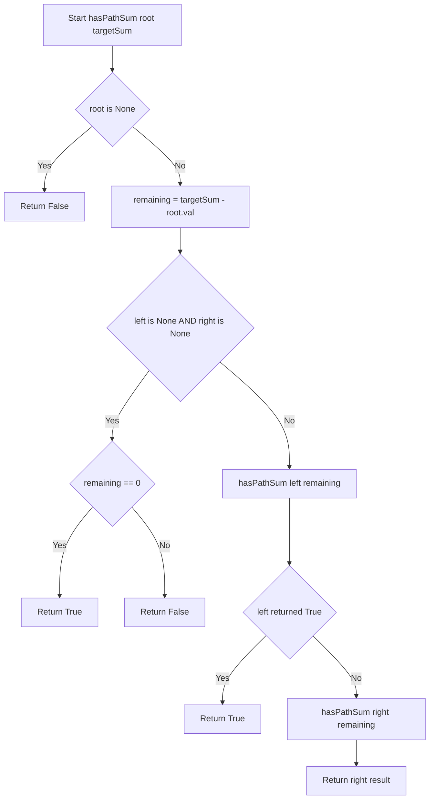
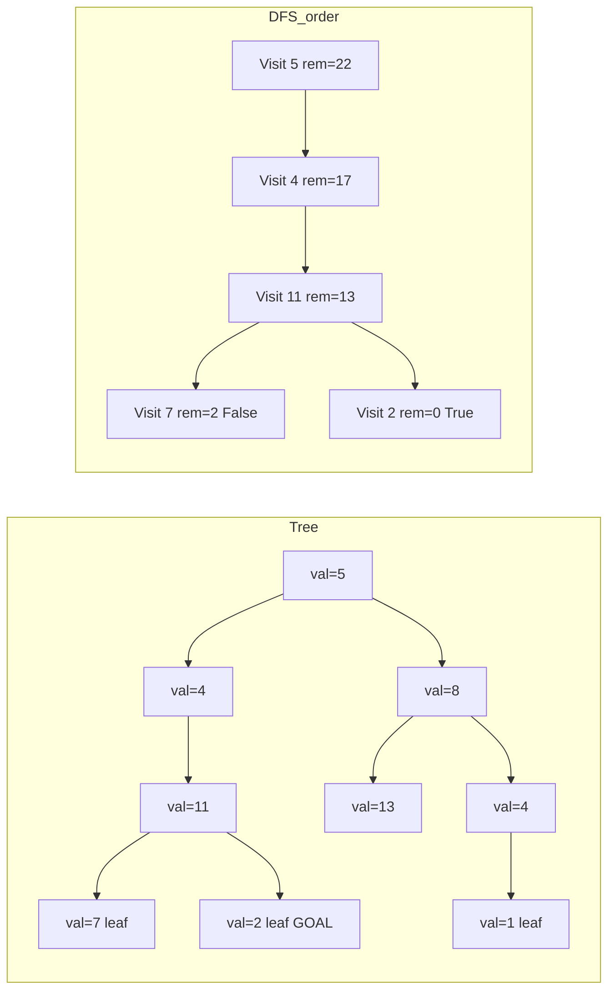

# Path Sum — 根から葉へのパス合計判定

<h2 id="toc">目次</h2>

- [概要](#overview)
- [アルゴリズム要点 TL;DR](#tldr)
- [図解](#figures)
- [正しさのスケッチ](#correctness)
- [計算量](#complexity)
- [Python 実装](#impl)
- [CPython 最適化ポイント](#cpython)
- [エッジケースと検証観点](#edgecases)
- [FAQ](#faq)

---

<h2 id="overview">概要</h2>

💡 **この問題は一言で言うと：**
「木の頂点（根）から末端（葉）まで下りていくルートの数値の合計が、指定された目標値と一致するパスが1本でも存在するか？」を調べる問題です。

## なぜ難しいのか・どこにポイントがあるのか

この問題の難しさは「全パスを効率よく探索する」点にあります。木（ツリー）は配列やリストと違い、「インデックス」で直接ノードにアクセスできません。根から葉まで分岐しながら下りていく必要があり、**どの経路を辿ったか**を追跡しながら合計を管理する仕組みが求められます。また、葉の定義（左右両方の子が存在しないノード）を正確に判定しないと、途中のノードで誤って答えを確定してしまうバグが発生します。

### 問題の制約

| 項目       | 制約                 |
| ---------- | -------------------- |
| ノード数   | 0 以上 5000 以下     |
| ノードの値 | -1000 以上 1000 以下 |
| targetSum  | -1000 以上 1000 以下 |

> 📖 **この章で登場した用語**
>
> - **根（Root）**：木の一番上にあるノード。ここから探索を始める
> - **葉（Leaf）**：子ノードが1つも存在しないノード。パスの終点となる
> - **パス（Path）**：根から葉まで辿った一本の道。途中で分岐に戻ることはない
> - **制約**：入力として与えられる値の範囲や条件のこと

---

<h2 id="tldr">アルゴリズム要点 TL;DR</h2>

💡 **TL;DR（Too Long; Didn't Read）**とは「長くて読めない人向けの要約」という意味です。アルゴリズム全体の戦略をここで掴んでおき、詳細は後の章で確認しましょう。

- **戦略**：DFS（深さ優先探索）で根から葉まで下りながら、`targetSum` から現在のノードの値を引いていく。葉に到達した時点で残り値が 0 なら条件達成。
    - _なぜ DFS か？_ → 「根から葉への1本道を完走する」という目的に、深く潜ってから戻る DFS の性質がぴったり合うから
- **データ構造**：競技版は再帰呼び出しスタック（関数が自分自身を呼ぶ仕組み）、業務版は `collections.deque`（両端開きの箱型構造）を明示的なスタックとして使用
- **時間計算量**：O(n)。すべてのノードを最大1回ずつ訪問するため
- **空間計算量**：O(h)。h は木の高さ。均衡した木では O(log n)、一直線の木では O(n)
- **メモ化**：今回は不要。同じノードを複数回訪れる経路が存在しないため

> 📖 **この章で登場した用語**
>
> - **DFS（深さ優先探索 / Depth-First Search）**：木やグラフをできるだけ深く潜ってから引き返す探索方法。迷路を一本道ずつ試すイメージ
> - **`collections.deque`**：前後どちらからでも O(1) で追加・取り出しができる「両端開きの箱」。`list` で先頭操作をすると O(n) かかるのに対して高速
> - **スタック（Stack）**：後から積んだものを先に取り出す構造（皿の積み重ねイメージ）
> - **メモ化**：一度計算した結果を記録しておき、同じ計算を繰り返さない技法

---

<h2 id="figures">図解</h2>

💡 **Mermaid フローチャートの読み方**：ひし形（`{}`）は「Yes/No で分岐する条件判定」を表し、長方形（`[]`）は「実際に行う処理のステップ」を表します。矢印（`-->`）はデータや制御の流れを示します。図は上から下へ読み進めてください。

---

### フローチャート

この図は `hasPathSum` 関数の処理の流れ全体を表しています。「根に入力 → null チェック → 葉チェック → 再帰」という順番で処理が進む様子を上から下へ読んでください。



**各ノードの意味：**

- `Start`：関数の入り口。`root`（現在のノード）と `targetSum`（残り目標値）を受け取る
- `NullCheck`（ひし形）：`root` が `None` かどうかを判定。空の木または葉を超えた場合に該当
- `Subtract`：現在のノードの値を `targetSum` から引いて「残り目標値」を計算する
- `LeafCheck`（ひし形）：左右両方の子が `None` = 葉に到達したかを判定する
- `ZeroCheck`（ひし形）：葉に到達した時点で残り目標値がちょうど 0 かどうかを確認する
- `RecurLeft`：左の子ツリーに対して同じ処理を再帰的に呼び出す
- `OrCheck`（ひし形）：左の子で条件達成（`True`）が返ったか。`True` なら右の子を調べる必要がない（短絡評価）

---

### データフロー図（木の探索の様子）

この図は Example 1 の木を、DFS がどの順番でノードを訪問するかを表しています。左から右へ、探索が進む順番に読んでください。



**主要な流れの説明：**

- `N5 → N4 → N11`：DFS が左の子を優先して深く潜っていく経路
- `Visit 7 rem=2 False`：葉ノード 7 で残り 2 ≠ 0 のため不一致
- `Visit 2 rem=0 True`：葉ノード 2 で残り 0 = 条件達成！ここで `True` が返される

---

> 💡 **代表例でのトレース**：`root=[5,4,8,11,null,13,4,7,2,null,null,null,1], targetSum=22` を入力として、フローチャートの各ノードをどのように通過するかを示します。
>
> ```
> 初期状態: root=Node(5), targetSum=22
>
> Step 1: NullCheck → root=Node(5) ≠ None → No
>         Subtract  → remaining = 22 - 5 = 17
>         LeafCheck → left=Node(4), right=Node(8) → No（葉ではない）
>         → 左の子 Node(4) に進む
>
> Step 2: NullCheck → root=Node(4) ≠ None → No
>         Subtract  → remaining = 17 - 4 = 13
>         LeafCheck → left=Node(11), right=None → No（葉ではない）
>         → 左の子 Node(11) に進む
>
> Step 3: NullCheck → root=Node(11) ≠ None → No
>         Subtract  → remaining = 13 - 11 = 2
>         LeafCheck → left=Node(7), right=Node(2) → No（葉ではない）
>         → 左の子 Node(7) に進む
>
> Step 4: NullCheck → root=Node(7) ≠ None → No
>         Subtract  → remaining = 2 - 7 = -5
>         LeafCheck → left=None, right=None → Yes（葉！）
>         ZeroCheck → -5 == 0 ? → No → return False ❌
>
> Step 5: Step 3 に戻り、右の子 Node(2) を調べる
>         NullCheck → root=Node(2) ≠ None → No
>         Subtract  → remaining = 2 - 2 = 0
>         LeafCheck → left=None, right=None → Yes（葉！）
>         ZeroCheck → 0 == 0 ? → Yes → return True ✅
>
> 最終結果: True（パス 5→4→11→2 の合計 = 22）
> ```

> 📖 **この章で登場した用語**
>
> - **フローチャート**：処理の手順を図形と矢印で表したもの。ひし形=条件分岐、長方形=処理
> - **短絡評価（Short-circuit Evaluation）**：`A or B` で A が `True` なら B を評価しない仕組み。無駄な計算を省く
> - **DFS 探索順序**：左の子 → 右の子 の順で深く潜る（左優先DFS）

---

<h2 id="correctness">正しさのスケッチ</h2>

💡 この章では「このアルゴリズムが常に正しい答えを返すと言える理由」を整理します。数学的な厳密な証明ではなく、「なぜ正しいと言えるか」の直感的な説明です。

### ① 不変条件（ループ・再帰を通じてずっと成り立つ条件）

> **「`hasPathSum(node, remaining)` を呼び出したとき、`remaining` は根から `node` の親までの合計を `targetSum` から引いた残り値である」**

- 根ノードでの呼び出し `hasPathSum(root, 22)` では `remaining=22`（まだ何も引いていない）
- 次の階層 `hasPathSum(node.left, 22-5=17)` では `remaining=17`（根ノード 5 を引いた残り）
- この不変条件が成り立ち続けることで、葉に到達したときに `remaining==0` が「合計が一致した」を意味することが保証される

### ② 網羅性（すべてのパスを見落とさない）

- 各ノードで左の子と右の子の**両方**を調べる（`or` の左右）
- `or` の短絡評価により、左で `True` が得られた場合は右を調べないが、`False` の場合は必ず右も調べる
- このため、木のすべての葉へのパスが必ず探索される

### ③ 基底条件（再帰が終わる条件）

- **ケース A**：`root is None` → これ以上下に進めない（子が存在しない）→ `False` を返す。空の木や、葉の子（存在しない）を参照した場合に該当
- **ケース B**：`root.left is None and root.right is None`（葉）→ ここでパスが完了した → `remaining == 0` の真偽値を返す

### ④ 終了性（アルゴリズムが必ず終わる理由）

- 各再帰呼び出しでは `node.left` または `node.right` に進む
- 木は有限（最大 5000 ノード）であり、葉から先は必ず `None`（ケース A の基底条件）になる
- したがって再帰の深さは最大で木の高さ h に抑えられ、必ず終了する

> 📖 **この章で登場した用語**
>
> - **不変条件**：アルゴリズムが正しく動くために、処理中ずっと成り立ち続けるべき条件
> - **網羅性**：すべてのケースをもれなく処理できているという保証
> - **基底条件**：再帰の終了条件。これがないと無限ループになる
> - **終了性**：アルゴリズムが必ず有限ステップで終わるという保証

---

<h2 id="complexity">計算量</h2>

💡 計算量とは「入力が大きくなるにつれて、処理にかかる時間・メモリがどう増えるか」の目安です。

| 記法       | 意味                   | 直感的なイメージ           |
| ---------- | ---------------------- | -------------------------- |
| `O(1)`     | 入力サイズによらず一定 | 辞書で直接ページを開く     |
| `O(log n)` | 入力の対数に比例       | 二分探索で半分ずつ絞る     |
| `O(n)`     | 入力に比例して増加     | リストを端から順に読む     |
| `O(n²)`    | 入力の2乗で増加        | 全ペアを総当たりで確認する |

### 時間計算量：O(n)

すべてのノードをちょうど1回ずつ訪問します。n = 5000 のとき最大 5000 回の関数呼び出しで答えが出ます。「最良ケース（根が葉の場合）」でも「最悪ケース（すべてのノードを見る場合）」でも O(n) であることに変わりありません。

### 空間計算量：O(h)（hは木の高さ）

再帰呼び出しのたびに関数の情報がコールスタック（関数呼び出しの履歴を積み重ねる領域）に積まれます。その最大の深さは木の高さ h です。

| 木の形状                 | 高さ h   | 空間計算量                  |
| ------------------------ | -------- | --------------------------- |
| 均衡二分木（左右均等）   | O(log n) | O(log n) ≈ O(13) for n=5000 |
| 一直線（右の子のみ続く） | O(n)     | O(n) = O(5000)              |

### 競技版 vs 業務版の空間計算量の違い

| 実装                     | スタック管理                     | 空間計算量 | 特記                           |
| ------------------------ | -------------------------------- | ---------- | ------------------------------ |
| 再帰DFS（競技版）        | Pythonの呼び出しスタック（暗黙） | O(h)       | デフォルト再帰制限約1000に注意 |
| 反復DFS＋deque（業務版） | `deque` として明示的に管理       | O(h)       | 再帰制限なし。安全             |

> 📖 **この章で登場した用語**
>
> - **時間計算量**：入力の大きさに対して処理にかかる手間がどう増えるかの目安
> - **空間計算量**：処理中に使うメモリ量がどう増えるかの目安
> - **コールスタック**：関数が呼び出されるたびにその情報を積み上げる領域。再帰の深さに比例して使われる
> - **均衡二分木**：左右の子の高さがほぼ等しい木。高さが log n に抑えられるため効率的

---

<h2 id="impl">Python 実装</h2>

💡 コードを読む前に、実装の全体的な骨格を確認しましょう。

**競技版（再帰DFS）の骨格：**

1. `root is None` チェック → `False` を返す（空の木または存在しない子を参照）
2. `targetSum` から現在のノードの値を引く
3. 葉かどうかを判定 → 葉なら `remaining == 0` を返す
4. 葉でなければ左右の子に対して再帰呼び出し。どちらかが `True` なら `True`

**業務版（反復DFS + deque）の骨格：**

1. 入力検証（型チェック）
2. 空の木チェック → `False` を返す
3. `deque` にルートを積み、ループ開始
4. ループ内：取り出す → 残り値を計算 → 葉なら確定 → 子をスタックに積む
5. ループ終了まで条件達成がなければ `False`

---

### 競技プログラミング版

チームメンバーのいない個人開発や、LeetCode などのジャッジで制限時間内に正解を出すことを優先する場面に向きます。型ヒントは最低限、エラーハンドリングを省略し、コードの短さと速度を最大化しています。

```python
from __future__ import annotations

from typing import Optional, TYPE_CHECKING

if TYPE_CHECKING:
    pass

# LeetCode が提供する TreeNode の定義（コメントアウトされているため、
# 実行時は NameError にならないよう try/except で軽量フォールバックを用意する）
try:
    # LeetCode 環境では TreeNode がすでに定義済みなので、この定義は上書きされる
    TreeNode  # type: ignore[used-before-def]
except NameError:
    class TreeNode:  # type: ignore[no-redef]
        """二分木の1つのノードを表すクラス（最小定義）"""
        __slots__ = ("val", "left", "right")

        def __init__(
            self,
            val: int = 0,
            left: Optional["TreeNode"] = None,
            right: Optional["TreeNode"] = None,
        ) -> None:
            self.val = val
            self.left = left
            self.right = right


class Solution:
    def hasPathSum(self, root: Optional[TreeNode], targetSum: int) -> bool:
        # ベースケース①：root が None = 空の木 or 葉を超えた
        # None のノードにはパスが存在しないので即 False を返す。
        # "root is None" は "root == None" より高速（同一性チェック）かつ pylance 推奨。
        if root is None:
            return False

        # 現在のノードの値を targetSum から引く。
        # 「残りあとどれだけ合計が必要か」を次の階層に渡すため引き算で管理する。
        # 例）targetSum=22, root.val=5 → 次の呼び出しには 17 を渡す
        targetSum -= root.val

        # ベースケース②：葉（左右両方の子が None）に到達した
        # パスの終点に来たので、残り目標値がちょうど 0 かどうかで答えを確定する。
        if root.left is None and root.right is None:
            return targetSum == 0

        # 再帰ステップ：左の子 or 右の子のどちらかで条件を満たすパスがあれば True。
        # Python の "or" は短絡評価（左が True なら右を評価しない）なので、
        # 左で True が返った時点で右の探索をスキップできる。
        return (
            self.hasPathSum(root.left, targetSum)
            or self.hasPathSum(root.right, targetSum)
        )
```

---

### 業務開発版（反復DFS + deque）

チームで長期間メンテナンスするプロダクションコードに向きます。Python のデフォルト再帰制限（約1000）を回避するため `deque` を使った明示的なスタック管理を採用し、最大5000ノードの木でも安全に動作します。

```python
from __future__ import annotations

from collections import deque
from typing import Optional, TYPE_CHECKING

if TYPE_CHECKING:
    pass

try:
    TreeNode  # type: ignore[used-before-def]
except NameError:
    class TreeNode:  # type: ignore[no-redef]
        """二分木の1つのノードを表すクラス（最小定義）"""
        __slots__ = ("val", "left", "right")

        def __init__(
            self,
            val: int = 0,
            left: Optional["TreeNode"] = None,
            right: Optional["TreeNode"] = None,
        ) -> None:
            self.val = val
            self.left = left
            self.right = right


class Solution:
    def hasPathSum(self, root: Optional[TreeNode], targetSum: int) -> bool:
        """
        根から葉までのパスの合計が targetSum と等しいパスが存在するか判定する。

        反復DFS（deque スタック）で実装。
        Python のデフォルト再帰制限（約1000）を回避し、
        最大 5000 ノードの一直線の木でも安全に動作する。

        Args:
            root: 二分木の根ノード（None の場合は空の木）
            targetSum: 目標とするパスの合計値

        Returns:
            条件を満たすパスが存在すれば True、存在しなければ False

        Raises:
            TypeError: targetSum が int でない場合
            TypeError: root が TreeNode でも None でもない場合

        Complexity:
            Time:  O(n)  — 全ノードを最大1回ずつ訪問
            Space: O(h)  — deque の最大サイズは木の高さ h に比例
        """
        # --- 入力検証 ---
        # Python は動的型付けなので呼び出し元が誤った型を渡してもコンパイル時には気づけない。
        # isinstance() で実行時に検証し、pylance の型チェックと合わせて二重に安全性を確保する。
        if not isinstance(targetSum, int):
            raise TypeError(
                f"targetSum must be int, got {type(targetSum).__name__}"
            )

        # root は TreeNode または None のみ許可する
        if root is not None and not isinstance(root, TreeNode):
            raise TypeError(
                f"root must be TreeNode or None, got {type(root).__name__}"
            )

        # --- エッジケース：空の木 ---
        # root が None のとき、そもそもパスが存在しないので即 False を返す。
        if root is None:
            return False

        # --- 反復DFS の準備 ---
        # deque をスタック（後から積んだものを先に取り出す）として使う。
        # タプル (ノード, 残り目標値) の形で積んでいく。
        # list でも動くが、deque.pop() は C 実装で若干高速。
        # また list.append() / list.pop() は O(1) だが、
        # deque の方が「スタックとして使う」という意図が明確で可読性も高い。
        stack: deque[tuple[TreeNode, int]] = deque()
        stack.append((root, targetSum))

        # --- 反復DFS 本体 ---
        # スタックが空になる = 探索できるパスをすべて試し終えた
        while stack:
            # スタックの末尾（最後に積んだもの）を取り出す。
            # これが DFS（深さ優先）になる理由：
            # 直前に積んだ子ノードを先に処理するため、自然と深く潜る探索になる。
            node, remaining = stack.pop()

            # 現在のノードの値を残り目標値から引く。
            # これにより「このノードを通過した分の合計」を差し引いて次に渡せる。
            remaining -= node.val

            # --- 葉（Leaf）の判定 ---
            # 葉 = 左の子も右の子も存在しないノード = パスの終点
            is_leaf: bool = node.left is None and node.right is None

            if is_leaf:
                # 葉に到達したとき、残り目標値がちょうど 0 になっていれば
                # 「根からこの葉までの合計 = targetSum」が成立している。
                if remaining == 0:
                    return True
                # 0 でなければこのパスは条件を満たさないので次の探索へ
                continue

            # --- 子ノードをスタックに積む ---
            # 右の子を先に積む（後でスタックから取り出すとき左が先になる = 左優先DFS）。
            # None の子はスタックに積まない（積むと TypeError が発生する）。
            if node.right is not None:
                stack.append((node.right, remaining))
            if node.left is not None:
                stack.append((node.left, remaining))

        # すべてのパスを探索し終えたが、条件を満たすものがなかった
        return False
```

---

> 💡 **動作トレース（業務版 · deque）**：`root=[5,4,8,11,null,13,4,7,2,null,null,null,1], targetSum=22`
>
> ```
> 初期状態: stack = [(Node(5), 22)]
>
> Iteration 1: pop → (Node(5), 22)
>   remaining = 22 - 5 = 17
>   is_leaf = False（left=Node(4), right=Node(8)）
>   → right: append (Node(8), 17) → stack = [(Node(8), 17)]
>   → left:  append (Node(4), 17) → stack = [(Node(8), 17), (Node(4), 17)]
>
> Iteration 2: pop → (Node(4), 17)  ← 左が先に取り出される（左優先DFS）
>   remaining = 17 - 4 = 13
>   is_leaf = False（left=Node(11), right=None）
>   → right: None なのでスキップ
>   → left:  append (Node(11), 13) → stack = [(Node(8), 17), (Node(11), 13)]
>
> Iteration 3: pop → (Node(11), 13)
>   remaining = 13 - 11 = 2
>   is_leaf = False（left=Node(7), right=Node(2)）
>   → right: append (Node(2), 2)  → stack = [(Node(8), 17), (Node(2), 2)]
>   → left:  append (Node(7), 2)  → stack = [(Node(8), 17), (Node(2), 2), (Node(7), 2)]
>
> Iteration 4: pop → (Node(7), 2)
>   remaining = 2 - 7 = -5
>   is_leaf = True（left=None, right=None）
>   -5 == 0 ? → False ❌ → continue
>
> Iteration 5: pop → (Node(2), 2)
>   remaining = 2 - 2 = 0
>   is_leaf = True（left=None, right=None）
>   0 == 0 ? → True ✅ → return True
>
> 最終結果: True（パス 5→4→11→2 の合計 = 22）
> ```

> 📖 **この章で登場した用語**
>
> - **`from __future__ import annotations`**：型ヒントを文字列として扱うようにする宣言。前方参照（まだ定義されていないクラスを型として使う）を解決できる
> - **`TYPE_CHECKING`**：`True` になるのは pylance などの静的型チェック時のみ。実行時は `False` なので、型チェック用のインポートを実行時に省略できる
> - **`__slots__`**：クラスが持てる属性を事前に宣言する仕組み。通常のクラスより使うメモリを削減できる
> - **`Optional[TreeNode]`**：`TreeNode` または `None` のどちらかであることを表す型ヒント。`TreeNode | None` とも書ける（Python 3.10以降）
> - **`deque[tuple[TreeNode, int]]`**：「TreeNode と int のペア（タプル）を格納する deque」を表す型ヒント

---

<h2 id="cpython">CPython 最適化ポイント</h2>

💡 この章では「同じ処理でも Python の書き方によって速さが変わる理由」を説明します。最適化テクニックは「最適化前 → 最適化後 → なぜ速くなるか」の3点セットで確認しましょう。

### ① `root is None` vs `root == None`

```python
# 最適化前（pylance 警告が出ることもある）
if root == None:
    return False

# 最適化後（推奨）
if root is None:
    return False
# 理由：`is` は同一性チェック（メモリアドレスが同じか）なので
#       `==` のような値の比較（__eq__ メソッドの呼び出し）が発生しない。
#       None との比較では is を使うのが Python の慣習であり、pylance も推奨する。
```

### ② 葉判定の変数化

```python
# 最適化前：同じ属性アクセスが2回発生する
if node.left is None and node.right is None:
    if node.left is None and node.right is None:  # 仮に再チェックが必要な場合
        ...

# 最適化後：bool 変数に1回だけ評価してキャッシュする
is_leaf: bool = node.left is None and node.right is None
if is_leaf:
    ...
# 理由：属性アクセス（node.left, node.right）は内部的にオブジェクトの辞書を
#       検索するコストがかかる。結果を bool 変数に保存すると1回の検索で済む。
#       今回は微小な差だが、ループ回数が多い場面では効果が出る。
```

### ③ `or` の短絡評価による早期リターン

```python
# 競技版での実装
return (
    self.hasPathSum(root.left, targetSum)   # ← まずこちらを評価
    or self.hasPathSum(root.right, targetSum)  # True なら右は評価しない
)
# 理由：Python の `or` は左が True の瞬間に右を評価せず即 True を返す（短絡評価）。
#       左のサブツリーで答えが見つかった場合、右のサブツリー全体の探索をスキップできる。
#       最良ケースでは探索を半分に抑えられる。
```

### ④ `deque` と `list` の違い（業務版で deque を選ぶ理由）

```python
# list をスタックとして使う場合（今回は末尾操作のみなので実は同等）
stack_list: list[tuple[TreeNode, int]] = []
stack_list.append((node, remaining))   # O(1) 均償（amortized）
stack_list.pop()                        # O(1)

# deque をスタックとして使う場合
from collections import deque
stack_deque: deque[tuple[TreeNode, int]] = deque()
stack_deque.append((node, remaining))   # O(1) 常に
stack_deque.pop()                       # O(1) 常に

# 理由：末尾操作だけなら list でも deque でも速度差はほぼない。
#       ただし deque を使うことで「このデータ構造はスタック/キューとして使う」
#       という意図が明確になり、可読性と保守性が向上する。
#       先頭への追加・削除が必要になったとき、list の O(n) と deque の O(1) の差が大きい。
```

> 📖 **この章で登場した用語**
>
> - **同一性チェック（`is`）**：2つの変数が全く同じオブジェクトを指しているかを確認する操作。`None` のチェックに適している
> - **属性アクセス**：`node.left` のようにオブジェクトのプロパティを参照する操作。Pythonでは内部的に辞書検索が発生する
> - **短絡評価（Short-circuit Evaluation）**：`A or B` で A が True なら B を評価しない仕組み。早期リターンによる最適化
> - **均償 O(1)（Amortized O(1)）**：「1回ごとに見ると遅い操作があるが、平均すると O(1) になる」こと。`list.append()` はバッファ再確保が稀に O(n) になるが平均は O(1)

---

<h2 id="edgecases">エッジケースと検証観点</h2>

💡 エッジケースとは「入力が空・最小値・最大値・特殊な形状」など、通常とは異なる境界的な入力のことです。エッジケースを見落とすと、普通のテストは通るのに特定の入力でだけバグが発生します。各ケースでなぜ問題になりうるかを先に確認しておきましょう。

| #   | テストケース                   | 入力                               | 期待出力 | なぜ注意が必要か                                                        |
| --- | ------------------------------ | ---------------------------------- | -------- | ----------------------------------------------------------------------- |
| 1   | **空の木**                     | `root=None, targetSum=0`           | `False`  | `root is None` チェックがないと `root.val` で AttributeError が発生する |
| 2   | **葉が1枚・一致**              | `root=[1], targetSum=1`            | `True`   | 根が同時に葉でもあるケース。葉の判定ロジックが正しいか確認              |
| 3   | **葉が1枚・不一致**            | `root=[1], targetSum=2`            | `False`  | 葉での `remaining == 0` 判定が正確か確認                                |
| 4   | **負の値を含む**               | `root=[-3,1], targetSum=-2`        | `True`   | `-3 + 1 = -2`。負数の引き算が正しく動くか確認                           |
| 5   | **targetSum がゼロ**           | `root=[0,0,0], targetSum=0`        | `True`   | `0 + 0 = 0`。ゼロの加算が正しく判定されるか確認                         |
| 6   | **合計がゼロになるが葉でない** | `root=[0,0], targetSum=0`          | `True`   | 根（`val=0`）を通過して、子（`val=0`）の葉で確定                        |
| 7   | **一直線の右の木（最悪深さ）** | `root=[1→2→...→5000], targetSum=X` | 各値     | 競技版は再帰深度 5000 に達する可能性。業務版の deque は安全             |
| 8   | **値の境界最大**               | `root=[1000], targetSum=1000`      | `True`   | 制約の上限値 1000 で正しく動くか                                        |
| 9   | **値の境界最小**               | `root=[-1000], targetSum=-1000`    | `True`   | 制約の下限値 -1000 で正しく動くか                                       |
| 10  | **Example 2（全パス不一致）**  | `root=[1,2,3], targetSum=5`        | `False`  | すべてのパスを探索し終えたあと `False` を返せるか                       |

> 📖 **この章で登場した用語**
>
> - **エッジケース**：空のリスト・要素1つ・最大サイズ入力など、境界的な条件の入力
> - **境界値**：制約の上限・下限にあたる値。今回は `val=1000` や `targetSum=-1000` など
> - **AttributeError**：存在しない属性（プロパティ）にアクセスしようとしたときに発生するエラー。`None.val` などで起きる
> - **再帰深度制限**：Python のデフォルトで約1000。`sys.getrecursionlimit()` で確認できる

---

<h2 id="faq">FAQ</h2>

💡 FAQは初学者がつまずきやすいポイントをQ&A形式でまとめたものです。「なぜその方法を選んだのか」「別の方法ではダメなのか」を中心に、**結論 → 理由 → 具体例**の順で答えています。

---

**Q1. なぜ `targetSum` を引き算で管理するのですか？加算して比較ではダメですか？**

**結論**：どちらでも正しく動きますが、引き算の方がコードがシンプルになるため採用しています。

**理由**：加算方式だと「現在のパスの合計」を別変数に保持する必要があります。引き算方式では `targetSum` 自体を「残り目標値」として使いまわせるので、変数が1つ少なくて済みます。

**具体例**：

```python
# 加算方式（current_sum を別に管理する必要がある）
def hasPathSum(self, root, targetSum, current_sum=0):
    current_sum += root.val
    if is_leaf:
        return current_sum == targetSum

# 引き算方式（targetSum 1つで管理できる）
def hasPathSum(self, root, targetSum):
    targetSum -= root.val
    if is_leaf:
        return targetSum == 0  # 残りがゼロかどうかだけ見ればよい
```

---

**Q2. なぜ「葉」の判定が必要なのですか？`root is None` だけではダメですか？**

**結論**：ダメです。葉の判定なしだと、内部ノード（子を持つノード）で誤って答えを確定してしまいます。

**理由**：`root is None` だけに頼ると、葉ノードの「存在しない左の子（None）」を再帰呼び出しした時点で `False` が返ってしまいます。これでは「葉でちょうど合計が一致した」ケースを正しく捉えられません。

**具体例**：

```
木: [1], targetSum=1

葉の判定あり:
  hasPathSum(Node(1), 1) → remaining=0 → 葉 → 0==0 → True ✅

葉の判定なし（None チェックのみ）:
  hasPathSum(Node(1), 1) → remaining=0
  → hasPathSum(None, 0) → return False ❌（誤り）
  → hasPathSum(None, 0) → return False ❌（誤り）
  → False or False = False ❌
```

---

**Q3. 業務版でなぜ `deque` を使うのですか？`list` でも動きませんか？**

**結論**：末尾操作（`append`/`pop`）だけなら `list` でも動きます。ただし `deque` を使う方が意図が明確で保守性が高まります。

**理由**：Python の `list` は末尾への追加・削除は O(1) なので、スタックとして使う分には速度差がほぼありません。しかし `deque` は「スタック（後入れ先出し）またはキュー（先入れ先出し）として使うデータ構造」という意味が明確なため、コードを後から読んだ人が「このデータ構造はスタックとして使っている」とすぐ理解できます。

**補足**：仮に「幅優先探索（キュー）に変更したい」という要件変更があった場合、`list` ベースのコードでは `pop(0)` に変えると O(n) になってしまいます。`deque` なら `popleft()` に変えるだけで O(1) のまま済みます。

---

**Q4. 競技版の再帰で最大5000ノードの木を処理するとスタックオーバーフローになりますか？**

**結論**：一直線の木（5000ノードが一本の鎖のような形）の場合、Python のデフォルト再帰制限（約1000）を超える可能性があります。

**理由**：Python の `sys.getrecursionlimit()` のデフォルト値は約1000です。一直線の木（右の子だけが続く形）では再帰深度がノード数と同じになり、5000ノードで制限を超えます。

**対策**：

- 競技版でも一応 `import sys; sys.setrecursionlimit(10000)` を先頭に追加すれば回避できます
- 根本的な解決策は業務版の「反復DFS + deque」です。`deque` のサイズ制限は Python のヒープメモリ上限（通常数GB）なので、5000ノード程度では問題になりません

---

**Q5. BFS（幅優先探索）を使わないのはなぜですか？**

**結論**：BFS はこの問題に適していません。なぜなら BFS は「階層ごとに横に広がる」探索で、「根から葉への1本道を追う」パス探索との相性が悪いからです。

**理由**：BFS では各ノードを訪問するとき「ここまでの合計」を一緒に管理する必要があります（キューに `(ノード, 合計)` のペアを積む）。これは DFS の実装と同じくらいのコードになり、かつ BFS は最悪ケースで最大幅分のメモリを使うため、DFS に対して不利です。

**補足**：BFS が向く場面は「最短経路（最少ステップ）」を求める問題です。今回はパスの合計を比較するだけなので、BFS の「最短」という特性が活きません。

---

> 📖 **この章で登場した用語**
>
> - **スタックオーバーフロー**：再帰が深くなりすぎてコールスタックの上限を超えるエラー。Pythonでは `RecursionError` として発生する
> - **`sys.setrecursionlimit`**：Pythonの再帰深度の上限を変更する関数。競技環境で一時的に上限を増やすために使う
> - **BFS（幅優先探索 / Breadth-First Search）**：木を階層ごとに横向きに探索する方法。最短経路探索に向くが、今回のようなパス合計問題には DFS が適している
> - **FAQ**：Frequently Asked Questions の略。よくある質問と回答のこと
