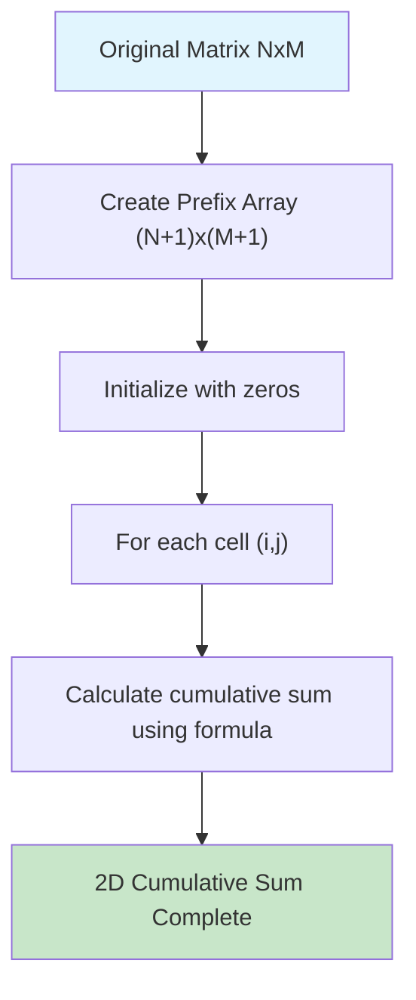
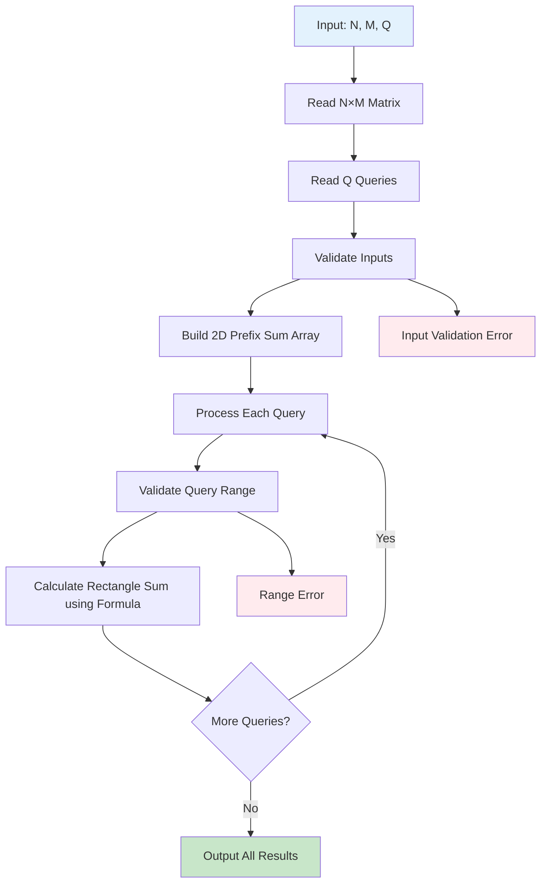

# 2D 累積和による長方形領域和計算

## 概要

このプログラムは、2 次元配列（行列）上の指定された長方形領域内の要素の合計を効率的に計算するアルゴリズムです。2D 累積和（2 次元累積和）を用いることで、複数のクエリに対して O(1)で応答できます。

## アルゴリズムの詳細

### 1. 2D 累積和の構築



累積和配列 `prefix[i][j]` は、元の行列の `(0,0)` から `(i-1,j-1)` までの長方形領域の合計を格納します

**構築の流れ：**

- `(N+1) × (M+1)` のサイズで累積和配列を初期化
- 各セル `(i,j)` について、以下の公式で計算：

  ```text
  prefix[i+1][j+1] = matrix[i][j] + prefix[i][j+1] + prefix[i+1][j] - prefix[i][j]
  ```

### 2. 長方形領域和の計算

**_README.html を参照_**

### 3. 長方形領域和の計算公式

指定された長方形領域 `(a,b)` から `(c,d)` の和を求める際は、以下の包除原理を使用します：

```text
結果 = prefix[c+1][d+1] - prefix[a][d+1] - prefix[c+1][b] + prefix[a][b]
```

**計算の理由：**

1. `prefix[c+1][d+1]`: 目標領域を含む大きな長方形の和
2. `prefix[a][d+1]`: 上側の不要な領域を減算
3. `prefix[c+1][b]`: 左側の不要な領域を減算
4. `prefix[a][b]`: 重複して減算した左上の領域を加算

### 4. プログラムの処理フロー## エラーハンドリング

プログラムには以下のエラーチェック機能が実装されています：



### 入力検証

- **TypeError**: 行列が 2 次元配列でない、または長方形でない場合
- **TypeError**: クエリが配列でない場合

### クエリ検証

- **RangeError**: クエリの座標が行列の範囲外の場合
- **RangeError**: クエリの座標が無効（`a > c` または `b > d`）の場合

## 計算量解析

| 処理         | 時間計算量       | 空間計算量   |
| ------------ | ---------------- | ------------ |
| 累積和構築   | O(N × M)         | O(N × M)     |
| 各クエリ処理 | O(1)             | O(1)         |
| **合計**     | **O(N × M + Q)** | **O(N × M)** |

## 使用例

### 入力形式

```text
N M Q
a₁₁ a₁₂ ... a₁ₘ
a₂₁ a₂₂ ... a₂ₘ
...
aₙ₁ aₙ₂ ... aₙₘ
a₁ b₁ c₁ d₁
a₂ b₂ c₂ d₂
...
aQ bQ cQ dQ
```

### 実行例

```text
4 4 2
1  2  3  4
5  6  7  8
9  10 11 12
13 14 15 16
1 1 2 3
0 0 3 3
```

**出力:**

```text
25
136
```

## アルゴリズムの利点

1. **高速なクエリ処理**: 一度累積和を構築すれば、各クエリは O(1)で処理可能
2. **メモリ効率**: 元の行列サイズ+1 の空間のみ使用
3. **スケーラビリティ**: 大量のクエリに対して効率的
4. **汎用性**: 任意サイズの長方形領域に対応

このアルゴリズムは、競技プログラミングやデータ分析における範囲クエリ処理で広く活用されています。
