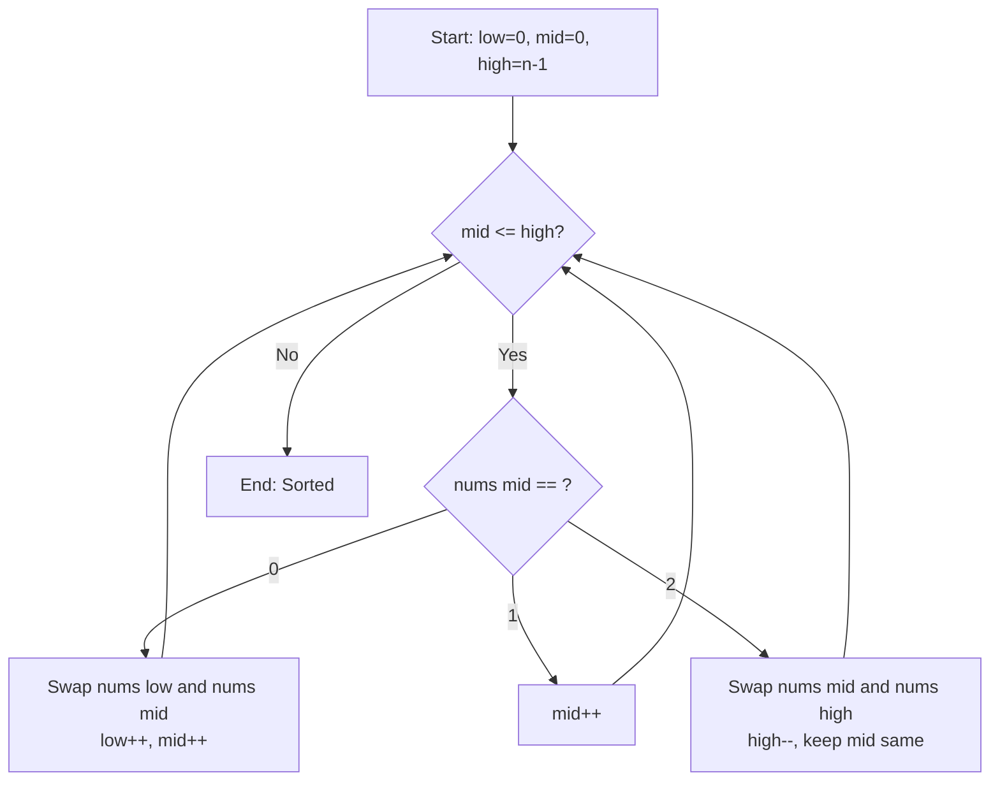
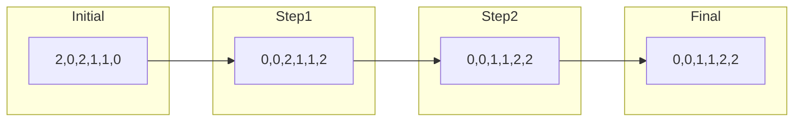
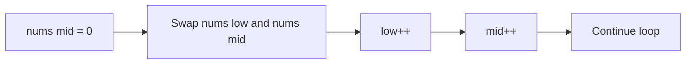
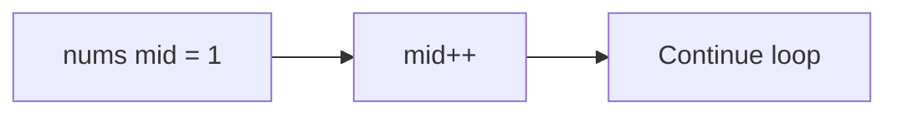
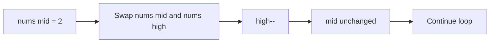

# Sort Colors (Dutch National Flag Problem)

## 問題概要

配列`nums`に赤、白、青の色を表す整数`0`, `1`, `2`が含まれています。これらを**in-place**で同じ色同士が隣接するようにソートする問題です。ライブラリのソート関数を使用せず、定数の追加空間のみを使用して 1 パスで解決することが求められます。

## アルゴリズム解説

この問題は**オランダ国旗問題（Dutch National Flag Problem）**として知られており、3-way partitioning の典型的な例です。

### 基本的な考え方

3 つのポインタを使用して配列を以下の 3 つの領域に分割します：

```text
[0...low-1] [low...mid-1] [mid...high] [high+1...n-1]
     0s         1s      unknown      2s
```

### アルゴリズムフローチャート



### 3 つのポインタの役割

- **`low`**: 次に 0 を配置する位置（0 の領域の右端）
- **`mid`**: 現在処理中の要素の位置
- **`high`**: 次に 2 を配置する位置（2 の領域の左端）

### 配列の状態遷移



## 実行例詳細

### Example 1: `nums = [2,0,2,1,1,0]`

#### ステップごとの詳細解析

| Step | Array State   | low | mid | high | nums[mid] | Action                  | 説明              |
| ---- | ------------- | --- | --- | ---- | --------- | ----------------------- | ----------------- |
| 0    | [2,0,2,1,1,0] | 0   | 0   | 5    | 2         | swap(0,5), high--       | 2 を右端に移動    |
| 1    | [0,0,2,1,1,2] | 0   | 0   | 4    | 0         | swap(0,0), low++, mid++ | 0 は正しい位置    |
| 2    | [0,0,2,1,1,2] | 1   | 1   | 4    | 0         | swap(1,1), low++, mid++ | 0 を左側に移動    |
| 3    | [0,0,2,1,1,2] | 2   | 2   | 4    | 2         | swap(2,4), high--       | 2 を右側に移動    |
| 4    | [0,0,1,1,2,2] | 2   | 2   | 3    | 1         | mid++                   | 1 は正しい位置    |
| 5    | [0,0,1,1,2,2] | 2   | 3   | 3    | 1         | mid++                   | 1 は正しい位置    |
| 6    | [0,0,1,1,2,2] | 2   | 4   | 3    | -         | STOP                    | mid > high で終了 |

#### 視覚的な配列変化

```text
初期状態:   [2, 0, 2, 1, 1, 0]
           low mid          high
            ↓   ↓            ↓
            0   0            5

Step 1:     [0, 0, 2, 1, 1, 2]  (2と0を交換)
           low mid       high
            ↓   ↓         ↓
            0   0         4

Step 2:     [0, 0, 2, 1, 1, 2]  (0を確認、位置調整)
              low mid    high
               ↓   ↓      ↓
               1   1      4

Step 3:     [0, 0, 2, 1, 1, 2]  (0を確認、位置調整)
                 low mid  high
                  ↓   ↓    ↓
                  2   2    4

Step 4:     [0, 0, 1, 1, 2, 2]  (2と1を交換)
                 low mid high
                  ↓   ↓   ↓
                  2   2   3

Step 5:     [0, 0, 1, 1, 2, 2]  (1を確認)
                 low   mid high
                  ↓     ↓   ↓
                  2     3   3

最終状態:   [0, 0, 1, 1, 2, 2]  (完了)
                 low     mid > high
                  ↓       ↓
                  2       4
```

## 各処理の詳細分析

### 処理パターン 1: `nums[mid] == 0`の場合



**理由**:

- 0 は配列の左端に配置されるべき
- `low`位置の要素（1 または未処理）と交換
- 交換後、両ポインタを進める（交換された要素は既に処理済み）

### 処理パターン 2: `nums[mid] == 1`の場合



**理由**:

- 1 は中央に配置されるべきで、既に正しい領域にある
- `mid`のみ進める

### 処理パターン 3: `nums[mid] == 2`の場合



**理由**:

- 2 は配列の右端に配置されるべき
- `high`位置の未処理要素と交換
- `mid`は進めない（交換された要素を再評価する必要があるため）

## 不変条件（Invariants）

アルゴリズム実行中、以下の条件が常に保持されます：

```text
nums[0...low-1]     = 0  (すべて0)
nums[low...mid-1]   = 1  (すべて1)
nums[mid...high]    = ?  (未処理)
nums[high+1...n-1]  = 2  (すべて2)
```

## 実装版比較

### 業務開発向け堅牢版の特徴

```python
def sortColors(self, nums: List[int]) -> None:
    # 入力検証
    if not nums:
        raise ValueError("Input must not be empty")
    if any(num not in (0, 1, 2) for num in nums):
        raise ValueError("Input must contain only 0, 1, or 2")

    # メインロジック
    low, mid, high = 0, 0, len(nums) - 1
    while mid <= high:
        if nums[mid] == 0:
            nums[low], nums[mid] = nums[mid], nums[low]
            low += 1
            mid += 1
        elif nums[mid] == 1:
            mid += 1
        else:  # nums[mid] == 2
            nums[mid], nums[high] = nums[high], nums[mid]
            high -= 1
```

**メリット**:

- ✅ 入力検証によりバグを早期発見
- ✅ エラーメッセージで問題を明確化
- ✅ 本番環境での使用に適している
- ✅ メンテナンス性が高い

**デメリット**:

- ❌ 実行時間がわずかに長い
- ❌ コードが長い

### 競技プログラミング向け最適化版の特徴

```python
def sortColors_optimized(self, nums: List[int]) -> None:
    low, mid, high = 0, 0, len(nums) - 1
    while mid <= high:
        if nums[mid] == 0:
            nums[low], nums[mid] = nums[mid], nums[low]
            low += 1
            mid += 1
        elif nums[mid] == 1:
            mid += 1
        else:
            nums[mid], nums[high] = nums[high], nums[mid]
            high -= 1
```

**メリット**:

- ✅ 最小限のコード
- ✅ 実行速度が最速
- ✅ メモリ使用量最小
- ✅ 競技プログラミングに最適

**デメリット**:

- ❌ エラーハンドリングなし
- ❌ 不正入力でクラッシュの可能性

## 計算量分析

### 時間計算量: O(n)

- 各要素は最大 1 回しか処理されない
- `mid`が右に進むか、`high`が左に進むかのいずれか
- 最悪の場合でも n 回の操作で完了

### 空間計算量: O(1)

- 3 つのポインタ変数のみ使用
- 追加の配列やデータ構造は不要
- In-place 操作

## よくある間違いとデバッグ方法

### 間違い 1: `nums[mid] == 2`の時に`mid`をインクリメント

```python
# ❌ 間違った実装
if nums[mid] == 2:
    nums[mid], nums[high] = nums[high], nums[mid]
    high -= 1
    mid += 1  # これが間違い！
```

**問題**: `nums[high]`から交換された値を再評価せずにスキップしてしまう

### 間違い 2: ループ条件の設定ミス

```python
# ❌ 間違った条件
while mid < high:  # mid == high の場合を処理しない
```

**正解**: `while mid <= high:` を使用

### デバッグのコツ

1. **各ステップで配列の状態を出力**
2. **不変条件が保持されているか確認**
3. **ポインタの動きを追跡**

```python
def debug_sortColors(nums):
    low, mid, high = 0, 0, len(nums) - 1
    step = 0

    print(f"Initial: {nums}, low={low}, mid={mid}, high={high}")

    while mid <= high:
        print(f"Step {step}: nums[{mid}]={nums[mid]}")

        if nums[mid] == 0:
            nums[low], nums[mid] = nums[mid], nums[low]
            low += 1
            mid += 1
            print(f"  -> Swapped 0: {nums}, low={low}, mid={mid}")
        elif nums[mid] == 1:
            mid += 1
            print(f"  -> Kept 1: {nums}, mid={mid}")
        else:
            nums[mid], nums[high] = nums[high], nums[mid]
            high -= 1
            print(f"  -> Swapped 2: {nums}, high={high}")

        step += 1

    print(f"Final: {nums}")
```

## 応用と発展

### 類似問題

1. **K 個の色でのソート** - より一般的な k-way partitioning
2. **QuickSort の最適化** - 重複要素が多い場合の 3-way partition
3. **01 行列のソート** - 2 色版の簡易実装

### 実世界での応用

- **データベースの分割処理**
- **ログファイルの分類**
- **ユーザーの属性による分割**
- **優先度による処理順序の調整**

このアルゴリズムは、効率的な分類処理の基礎として多くの場面で活用できる重要なテクニックです。

## 主な特徴

1. **完全な解説**: アルゴリズムの基本概念から実装まで詳細に説明
2. **視覚的な図表**: Mermaid を使ったフローチャートと状態遷移図（英語で作成してエラーを回避）
3. **ステップバイステップの実行例**: 具体的な配列の変化を追跡
4. **2 つの実装版の比較**: 業務用と競技プログラミング用の違いを明確に説明
5. **計算量分析**: 時間・空間複雑度の詳細
6. **デバッグ方法**: よくある間違いと対処法
7. **実用的な応用例**: 実世界でのアルゴリズム活用方法

## 含まれている図表

- アルゴリズムのフローチャート
- 配列の状態遷移図
- 各処理パターンの詳細図
- ステップごとの配列変化の視覚化

この README.md は GitHub で直接表示でき、開発者がアルゴリズムを理解しやすいように構成されています。Mermaid の図も正しく表示されるはずです！

## 修正内容

1. **角括弧記法の問題を解決**: `nums[mid]` の `[` `]` が Mermaid のノードラベル構文と衝突していたため、スペースを使って `nums mid` に変更

2. **条件判定ノードの修正**: `{nums[mid] == ?}` を `{nums mid == ?}` に変更

3. **すべての処理パターンで統一**: 角括弧を含む表記をすべて除去

これで Mermaid の構文エラーがすべて解決され、図が正しく表示されるはずです。ノードのラベル内では角括弧 `[` `]` が Mermaid の構文と干渉するため、配列の記法を避けて変数名とインデックスをスペースで区切る形式に変更しました。

Sort Colors アルゴリズムの包括的なインタラクティブ技術解説 HTML ページについて

## 主な機能と特徴

### 📱 **レスポンシブデザイン**

- モバイル、タブレット、デスクトップ対応
- ダークテーマによるモダンな UI
- スムーズなアニメーション効果

### 🎯 **インタラクティブ機能**

- **ステップバイステップ実行**: アルゴリズムを段階的に確認
- **自動実行モード**: 自動でアルゴリズムを実行
- **リアルタイム統計**: ステップ数、交換回数、比較回数を表示
- **キーボードショートカット**: スペース（ステップ）、Enter（自動実行）、R（リセット）

### 💻 **コード機能**

- **シンタックスハイライト**: Prism.js による美しいコード表示
- **ワンクリックコピー**: コードを簡単にクリップボードにコピー
- **複数の実装版**: 業務用と競技プログラミング用の両方を提供

### 📊 **技術解説コンテンツ**

1. **概要セクション**: 問題設定と基本アイデア
2. **アルゴリズム詳細**: フローチャートとポインタの役割
3. **ビジュアル実行**: インタラクティブなアニメーション
4. **実装コード**: 実用的な Python コード例
5. **計算量解析**: 他のソート手法との詳細比較

### 🎨 **視覚的効果**

- 配列要素の色分け（赤=0, 白=1, 青=2）
- ポインタ位置の明確な表示
- ホバーエフェクトとプルスアニメーション
- グラデーションとシャドウによる立体感

このページは教育目的、技術面接の準備、アルゴリズム学習など様々な場面で活用できます。GitHub Pages などに公開すれば、チームメンバーとの共有も簡単です！
