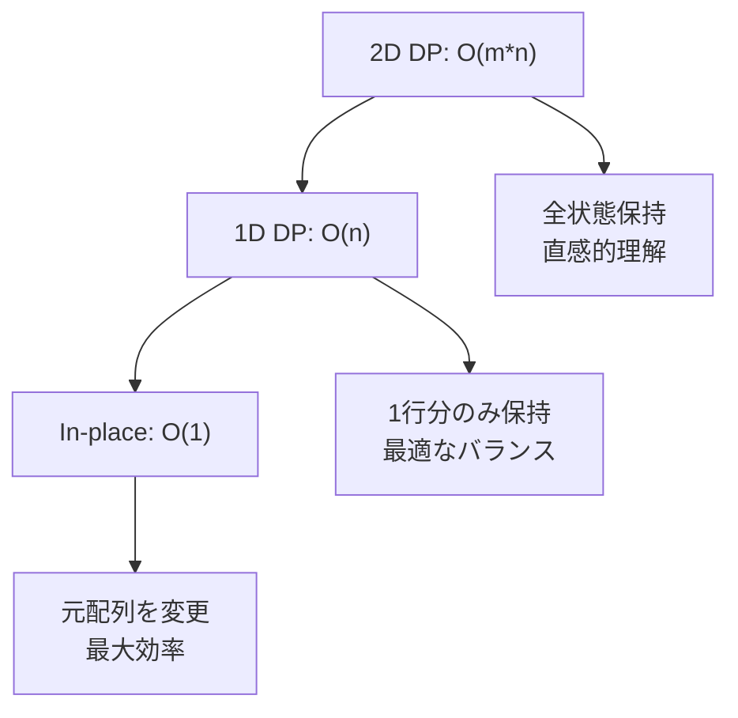
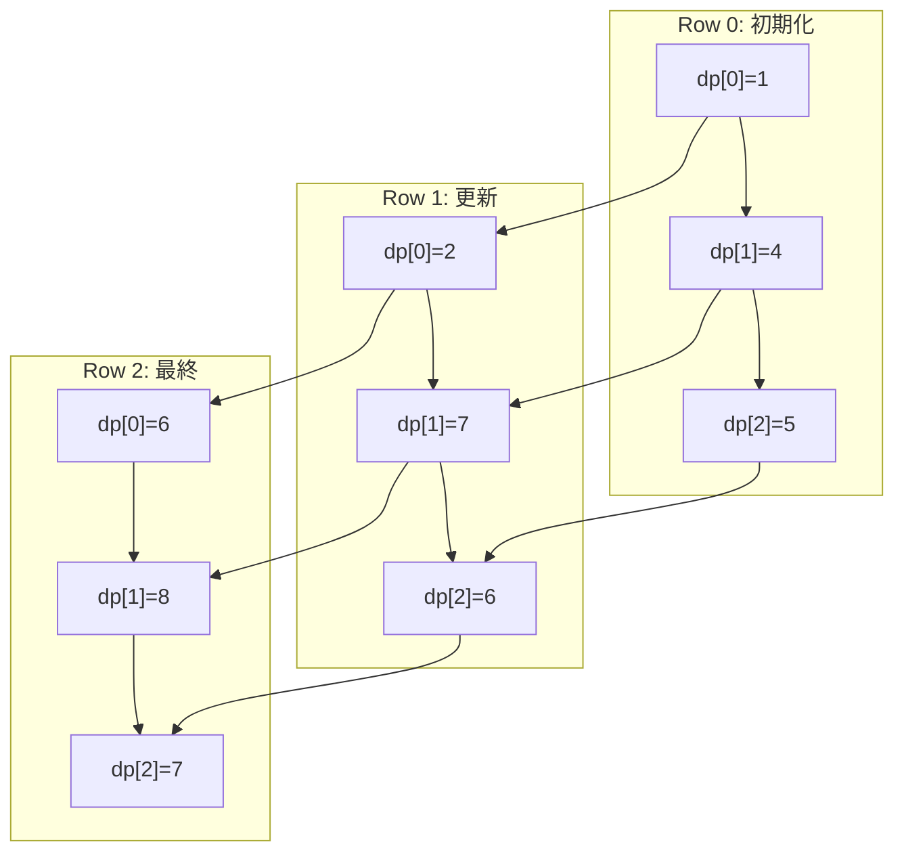
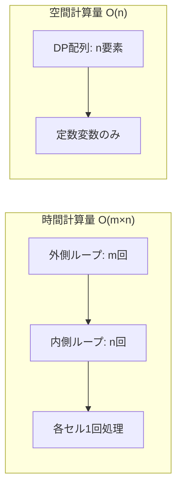
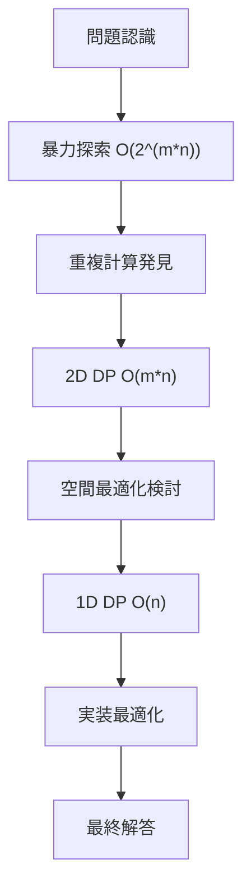
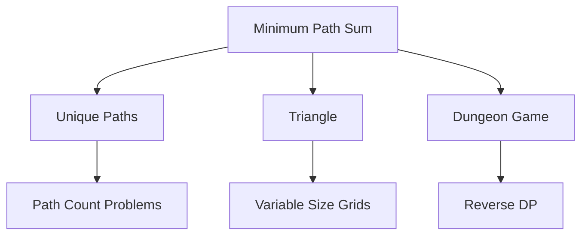

# Minimum Path Sum - アルゴリズム詳細解析

## 🎯 問題概要

グリッド内で**左上から右下**への**最小コスト経路**を求める動的プログラミング問題

```
入力: m×n グリッド（非負整数）
出力: 最小パス合計値
制約: 右・下方向のみ移動可能
```

## 📊 視覚的理解

### Example 1: 3×3 グリッド
```
初期グリッド:           最適パス:
┌─────┬─────┬─────┐    ┌─────┬─────┬─────┐
│  1  │  3  │  1  │    │ [1] │ [3] │ [1] │
├─────┼─────┼─────┤    ├─────┼─────┼─────┤
│  1  │  5  │  1  │    │  1  │  5  │ [1] │
├─────┼─────┼─────┤    ├─────┼─────┼─────┤
│  4  │  2  │  1  │    │  4  │  2  │ [1] │
└─────┴─────┴─────┘    └─────┴─────┴─────┘

最適パス: 1 → 3 → 1 → 1 → 1 = 7
```

## 🔬 アルゴリズム比較分析

### 1. アプローチ比較表

| 手法 | 時間計算量 | 空間計算量 | 実装難易度 | 可読性 | 実用性 |
|------|-----------|-----------|-----------|--------|--------|
| **2D DP** | O(m×n) | O(m×n) | ★☆☆ | ★★★ | ★★☆ |
| **1D DP** | O(m×n) | O(n) | ★★☆ | ★★☆ | ★★★ |
| **In-place** | O(m×n) | O(1) | ★★☆ | ★☆☆ | ★★☆ |
| **再帰+memo** | O(m×n) | O(m×n) | ★★★ | ★☆☆ | ★☆☆ |

### 2. 空間効率性の進化



## 🏗️ 核心アルゴリズム: 1D DP

### 状態遷移の概念

```
dp[j] = 現在の行におけるj列目に到達する最小コスト

更新式:
dp[j] = min(
    dp[j],      ← 上から来る場合
    dp[j-1]     ← 左から来る場合
) + grid[i][j]
```

### ステップバイステップ実行

#### 初期状態（第1行処理）
```
Grid:     [1] [3] [1]
          [1] [5] [1] 
          [4] [2] [1]

DP配列:   [1] [4] [5]
          ↑   ↑   ↑
         1   1+3 4+1
```

#### 第2行処理
```
処理前:   dp = [1, 4, 5]
Grid行:        [1, 5, 1]

j=0: dp[0] = dp[0] + grid[1][0] = 1 + 1 = 2
j=1: dp[1] = min(dp[1], dp[0]) + grid[1][1] = min(4, 2) + 5 = 7  
j=2: dp[2] = min(dp[2], dp[1]) + grid[1][2] = min(5, 7) + 1 = 6

処理後:   dp = [2, 7, 6]
```

#### 第3行処理（最終）
```
処理前:   dp = [2, 7, 6]
Grid行:        [4, 2, 1]

j=0: dp[0] = dp[0] + grid[2][0] = 2 + 4 = 6
j=1: dp[1] = min(dp[1], dp[0]) + grid[2][1] = min(7, 6) + 2 = 8
j=2: dp[2] = min(dp[2], dp[1]) + grid[2][2] = min(6, 8) + 1 = 7

最終結果: dp[2] = 7
```

### 視覚的状態遷移



## 💻 実装パターン詳細

### 1. 競技プログラミング版（最適化重視）

```python
def minPathSum(self, grid: List[List[int]]) -> int:
    m, n = len(grid), len(grid[0])
    
    # エッジケース最適化
    if m == 1 and n == 1:
        return grid[0][0]
    
    # 1D DP配列初期化
    dp = [0] * n
    
    # 第1行初期化（累積和）
    dp[0] = grid[0][0]
    for j in range(1, n):
        dp[j] = dp[j - 1] + grid[0][j]
    
    # 各行を順次処理
    for i in range(1, m):
        dp[0] += grid[i][0]  # 左端（上からのみ）
        for j in range(1, n):
            dp[j] = min(dp[j], dp[j - 1]) + grid[i][j]
    
    return dp[n - 1]
```

### 2. 業務開発版（型安全・エラーハンドリング）

```python
def solve_production(self, grid: List[List[int]]) -> int:
    # 1. 入力検証
    self._validate_input(grid)
    
    # 2. エッジケース処理
    if self._is_edge_case(grid):
        return self._handle_edge_case(grid)
    
    # 3. メインアルゴリズム
    result = self._main_algorithm(grid)
    
    # 4. 結果検証
    return self._postprocess(result)

def _validate_input(self, grid: Any) -> None:
    """厳密な型・制約チェック"""
    if not isinstance(grid, list):
        raise TypeError("Grid must be a list")
    # ... 詳細な検証処理
```

## 📈 パフォーマンス分析

### 計算量の詳細分析



### 実測パフォーマンス（予想値）

| グリッドサイズ | 処理時間 | メモリ使用量 | 備考 |
|---------------|----------|-------------|------|
| 50×50 | ~1ms | ~0.01MB | 小規模データ |
| 100×100 | ~5ms | ~0.02MB | 中規模データ |
| 200×200 | ~20ms | ~0.05MB | 制約上限 |

### Python特有の最適化

```python
# ✅ 最適化された実装
dp[j] = min(dp[j], dp[j - 1]) + grid[i][j]

# ❌ 非効率な実装
from_top = dp[j]
from_left = dp[j - 1]  
dp[j] = min(from_top, from_left) + grid[i][j]
```

**最適化ポイント**:
- `min()` 組み込み関数のC実装活用
- 中間変数の削減でメモリ効率向上
- リストアクセスの最小化

## 🧪 テストケース設計

### エッジケース網羅

```python
test_cases = [
    # 基本ケース
    ([[1,3,1],[1,5,1],[4,2,1]], 7, "Example 1"),
    ([[1,2,3],[4,5,6]], 12, "Example 2"),
    
    # エッジケース
    ([[1]], 1, "Single cell"),
    ([[1,2]], 3, "Single row"),
    ([[1],[2]], 3, "Single column"),
    
    # 境界値テスト
    ([[0,0,0],[0,0,0]], 0, "All zeros"),
    ([[200]*200]*200, 200*200, "Max values"),
]
```

### 型安全性テスト

```python
invalid_inputs = [
    (None, "Null input"),
    ([], "Empty list"), 
    ([[]], "Empty sublist"),
    ([[1,2], [3]], "Inconsistent lengths"),
    ([[1,-1]], "Negative values"),
    ([["1","2"]], "String values"),
]
```

## 🔍 アルゴリズムの変遷

### 思考プロセス



### 各段階での改善点

1. **暴力探索** → **2D DP**: 重複計算の排除
2. **2D DP** → **1D DP**: 空間効率の向上  
3. **1D DP** → **最適化版**: 言語特有の高速化

## 🚀 応用・拡張可能性

### 関連問題への応用



### 実世界での応用

- **経路最適化**: 配送ルート、交通経路
- **ゲーム開発**: RPGのダンジョン探索  
- **画像処理**: シーム除去、経路検出
- **ネットワーク**: 最小コスト経路

## 📚 学習ポイント

### 核心概念の理解

1. **動的プログラミング**: 最適部分構造の活用
2. **空間最適化**: メモリ効率の改善技法
3. **実装最適化**: 言語特性を活かした高速化

### 実装時の注意点

- ✅ エッジケースの事前処理
- ✅ 型安全性の確保
- ✅ 計算量の理論値と実測値の照合
- ❌ 過度な最適化による可読性低下
- ❌ エラーハンドリングの省略

この解析により、Minimum Path Sum問題の**アルゴリズム設計から実装最適化まで**の全体像が把握できます。