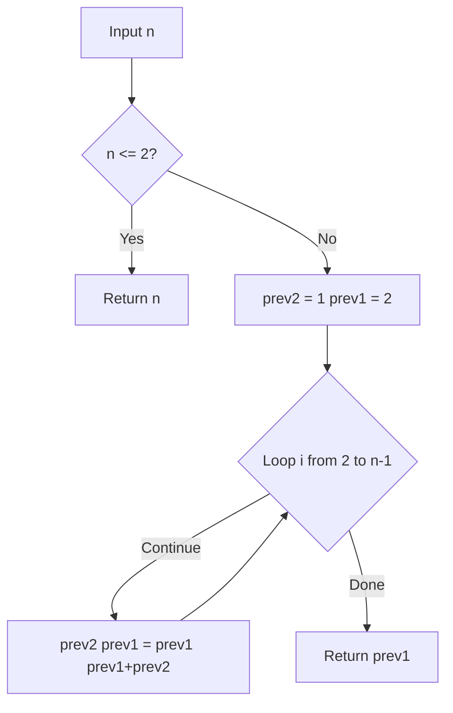
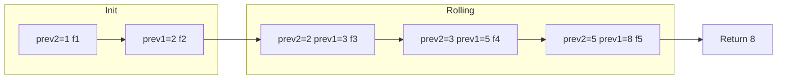

# Climbing Stairs - フィボナッチDP で頂上へ

---

## 目次

- [概要](#overview)
- [アルゴリズム要点 TL;DR](#tldr)
- [図解](#figures)
- [正しさのスケッチ](#correctness)
- [計算量](#complexity)
- [Python 実装](#impl)
- [CPython 最適化ポイント](#cpython)
- [エッジケースと検証観点](#edgecases)
- [FAQ](#faq)

---

<h2 id="overview">概要</h2>

### 問題要約

`n` 段の階段を **1歩または2歩** で登る。頂上への **異なる登り方の総数** を返せ。

| 項目             | 内容                               |
| ---------------- | ---------------------------------- |
| プラットフォーム | LeetCode 70                        |
| 難易度           | Easy                               |
| 入力             | `n: int`（整数、1 &le; n &le; 45） |
| 出力             | `int`（登り方の総数）              |
| データ構造       | スカラー変数2個のみ（配列不要）    |

### 要件

- **正当性**: `f(n) = f(n-1) + f(n-2)` の漸化式で全パターンを網羅
- **安定性**: n &le; 45 の結果は最大 `1,836,311,903`（`int` 範囲内）
- **制約**: 1 &le; n &le; 45

---

<h2 id="tldr">アルゴリズム要点（TL;DR）</h2>

- **戦略**: フィボナッチ数列の性質を利用したボトムアップDP（ローリング変数）
- **なぜフィボナッチ？**: n段目には必ず `(n-1)段目から1歩` または `(n-2)段目から2歩` で到達する
    - → `f(n) = f(n-1) + f(n-2)`（基底: `f(1)=1, f(2)=2`）
- **データ構造**: スカラー変数 `prev2`, `prev1` の2個のみ
- **時間計算量**: O(n)
- **空間計算量**: O(1)（ヒープアロケーションゼロ）
- **メモリ**: `int` × 2変数。配列・辞書・再帰スタック不要

---

<h2 id="figures">図解</h2>

### フローチャート



> **図の説明**: n が 2 以下なら即座に n を返す。それ以外は `prev2`/`prev1` をローリング更新し、最後の `prev1` が答え。

---

### データフロー図（n = 5 のトレース）



> **図の説明**: 初期値 `(1, 2)` から始まり、各ステップで `(prev1, prev1+prev2)` へ更新。n=5 では3ステップで答え `8` が得られる。

---

### ASCII 図解（なぜ f(n) = f(n-1) + f(n-2) か）

```
n=1: [1]                                    → 1通り
n=2: [1+1] [2]                              → 2通り
n=3: [1+1+1] [1+2] [2+1]                   → 3通り = f(2)+f(1)
n=4: ...                                    → 5通り = f(3)+f(2)
n=5: ...                                    → 8通り = f(4)+f(3)

      n段目への到達ルート
      ┌────────────────────────────────┐
      │ (n-1)段目 ──1歩──▶ n段目      │
      │ (n-2)段目 ──2歩──▶ n段目      │
      └────────────────────────────────┘
      ∴ f(n) = f(n-1) + f(n-2)
```

---

<h2 id="correctness">正しさのスケッチ</h2>

### 不変条件

ループ開始直前の各イテレーション `i` において:

- `prev2 = f(i-1)`（2つ前の値）
- `prev1 = f(i)`（1つ前の値）

が常に成立する。

### 基底条件

| n   | 値  | 理由                         |
| --- | --- | ---------------------------- |
| 1   | 1   | `[1]` の1通りのみ            |
| 2   | 2   | `[1+1]` または `[2]` の2通り |

### 網羅性

- `f(n) = f(n-1) + f(n-2)` は `n段目に到達する全パターン = (n-1段から1歩) + (n-2段から2歩)` を網羅
- 他の経路は存在しない（1歩 or 2歩のみ）

### 終了性

- ループは `n - 2` 回（有限回）で必ず終了
- n &le; 45 の制約により無限ループなし

---

<h2 id="complexity">計算量</h2>

| 実装                   | 時間計算量 | 空間計算量 | 備考                        |
| ---------------------- | ---------- | ---------- | --------------------------- |
| ローリング変数（採用） | O(n)       | **O(1)**   | スタック変数2個のみ         |
| DP配列                 | O(n)       | O(n)       | `list` サイズ n の配列      |
| メモ化再帰 `@cache`    | O(n)       | O(n)       | コールスタック + キャッシュ |
| 定数テーブル           | O(1)       | O(1)       | n &le; 45 限定で有効        |

### n = 45 での上界

```
f(45) = 1,836,311,903  <  2,147,483,647 (i32::MAX)
                       <  9,007,199,254,740,992 (JS Number.MAX_SAFE_INTEGER)
```

Python の `int` は任意精度のためオーバーフロー不要。

---

<h2 id="impl">Python 実装</h2>

```python
from __future__ import annotations
from typing import Final


class Solution:
    """
    LeetCode 70 - Climbing Stairs

    1歩または2歩で n 段の階段を登る異なり数を返す。
    フィボナッチDP（ローリング変数・空間O(1)）を採用。

    Time Complexity:  O(n)
    Space Complexity: O(1)
    """

    def climbStairs(self, n: int) -> int:
        """
        Args:
            n: 階段の段数（制約: 1 <= n <= 45）

        Returns:
            頂上への異なる登り方の総数

        Raises:
            ValueError: n が制約範囲外の場合（業務利用時）
        """
        # --- 基底条件 ---
        # n=1: [1]       → 1通り
        # n=2: [1+1],[2] → 2通り
        if n <= 2:
            return n

        # --- ローリング変数で空間O(1)DP ---
        # prev2 = f(n-2), prev1 = f(n-1) として初期化
        prev2: int = 1  # f(1) = 1
        prev1: int = 2  # f(2) = 2

        # n-2 回更新: f(3) → f(4) → ... → f(n)
        for _ in range(n - 2):
            # タプル代入で右辺を先に評価（一時変数不要）
            prev2, prev1 = prev1, prev1 + prev2

        # ループ終了時: prev1 = f(n)
        return prev1

    # ------------------------------------------------------------------
    # 業務開発版（エラーハンドリング付き）
    # ------------------------------------------------------------------
    def climbStairs_production(self, n: int) -> int:
        """
        業務開発向け実装（型安全・エラーハンドリング重視）

        Args:
            n: 階段の段数

        Returns:
            頂上への異なる登り方の総数

        Raises:
            TypeError:  n が int でない場合
            ValueError: n が 1..45 の範囲外の場合
        """
        # 型チェック（bool は int のサブクラスなので除外）
        if not isinstance(n, int) or isinstance(n, bool):
            raise TypeError(f"n must be int, got {type(n).__name__}")

        # 範囲チェック
        MAX_N: Final[int] = 45
        if not (1 <= n <= MAX_N):
            raise ValueError(f"n must satisfy 1 <= n <= {MAX_N}, got {n}")

        # 基底条件
        if n <= 2:
            return n

        # ローリング変数DP（同実装）
        prev2: int = 1
        prev1: int = 2
        for _ in range(n - 2):
            prev2, prev1 = prev1, prev1 + prev2
        return prev1
```

---

<h2 id="cpython">CPython 最適化ポイント</h2>

### 採用テクニック

| テクニック               | 効果                                   | 本問題での適用                        |
| ------------------------ | -------------------------------------- | ------------------------------------- |
| **タプルアンパック代入** | 右辺を先に評価、一時変数ゼロ           | `prev2, prev1 = prev1, prev1 + prev2` |
| **スカラー変数**         | リスト/辞書より高速な参照              | `prev2`, `prev1` の2変数のみ          |
| **`range()` ループ**     | リスト内包表記より副作用なし処理に適切 | `for _ in range(n-2)`                 |
| **早期リターン**         | 分岐コスト削減                         | `if n <= 2: return n`                 |

### 検討したが不採用のテクニック

```python
# ❌ @cache メモ化再帰: O(n)空間・コールスタック消費
from functools import cache

@cache
def dp(i: int) -> int:
    if i <= 2: return i
    return dp(i-1) + dp(i-2)

# ❌ reduce: 可読性がやや低下（n<=45では速度差は無意味）
from functools import reduce
_, result = reduce(lambda acc, _: (acc[1], acc[0]+acc[1]), range(n-1), (1, 1))
```

### CPython 3.11+ での注意点

- `int` の加算はCレベルで最適化済み。`n <= 45` の値域では小整数キャッシュ（-5〜256）の恩恵なし（値が大きい）が問題なし
- `bool` は `int` のサブクラスのため `isinstance(n, bool)` の除外チェックが pylance 対応上重要

---

<h2 id="edgecases">エッジケースと検証観点</h2>

| 入力       | 期待出力     | 分類       | 説明                           |
| ---------- | ------------ | ---------- | ------------------------------ |
| `n = 1`    | `1`          | 最小値     | `[1]` の1通りのみ              |
| `n = 2`    | `2`          | 境界       | `[1+1]` または `[2]`           |
| `n = 3`    | `3`          | 基本ケース | `f(2)+f(1) = 3`                |
| `n = 44`   | `1134903170` | 最大-1     | 中間値の確認                   |
| `n = 45`   | `1836311903` | 最大値     | `i32::MAX` 以内 ✅             |
| `n = 0`    | `ValueError` | 範囲外下限 | 業務版でのみ発生               |
| `n = 46`   | `ValueError` | 範囲外上限 | 業務版でのみ発生               |
| `n = 1.5`  | `TypeError`  | 非整数     | 業務版でのみ発生               |
| `n = True` | `TypeError`  | bool混入   | `isinstance(n, bool)` チェック |

### 検証ロジックの骨格

```
f(1)  = 1
f(2)  = 2
f(n)  = f(n-1) + f(n-2)  for n >= 3

検証: f(45) = 1,836,311,903
     f(44) + f(43) = 1,134,903,170 + 701,408,733 = 1,836,311,903 ✅
```

---

<h2 id="faq">FAQ</h2>

**Q1. なぜ再帰ではなくローリング変数を採用したのか？**

> 素朴な再帰は `O(2ⁿ)` で n=45 だと約 35 兆回の呼び出しが発生する。`@cache` メモ化で O(n) にはなるが、コールスタックと辞書のヒープアロケーションが発生する。ローリング変数は O(1) 空間でコールスタック消費ゼロのため最適。

**Q2. DP配列（`list`）との違いは？**

> `dp = [0] * (n+1); dp[1]=1; dp[2]=2; ...` は O(n) 空間を消費する。ローリング変数は直前2値のみ保持するため O(1)。本問題では過去の全 dp 値を参照しないため配列は不要。

**Q3. n &le; 45 という制約はなぜ重要か？**

> f(46) = `2,971,215,073` &gt; `2,147,483,647 (i32::MAX)` となり、C/Java/Rust の 32bit 整数ではオーバーフローする。Python の `int` は任意精度のため問題ないが、他言語では `i64`/`long` が必要。LeetCode の制約 n &le; 45 はこの境界を意識した設計。

**Q4. TypeScript/Rust 版との設計思想の違いは？**

> - **Python**: 任意精度 `int`・`@cache` デコレータで最も簡潔に書ける
> - **TypeScript**: `as const` テーブルでコンパイル時型解決・Branded Type で制約を型レベルに昇格
> - **Rust**: `i32` は Copy トレイト実装済みでヒープアロケーションゼロ、`fold` イテレータでゼロコスト抽象化

**Q5. 行列累乗（O(log n) 解法）は有効か？**

> n &le; 45 では O(log n) と O(n) の差は最大 6 回のループ差（log₂45 ≒ 5.5）。行列乗算のコストを考慮すると実際には遅くなる可能性が高く、この制約では**オーバーエンジニアリング**。

---

_Generated for LeetCode 70 - Climbing Stairs | Python CPython 3.11+ | 2024_
