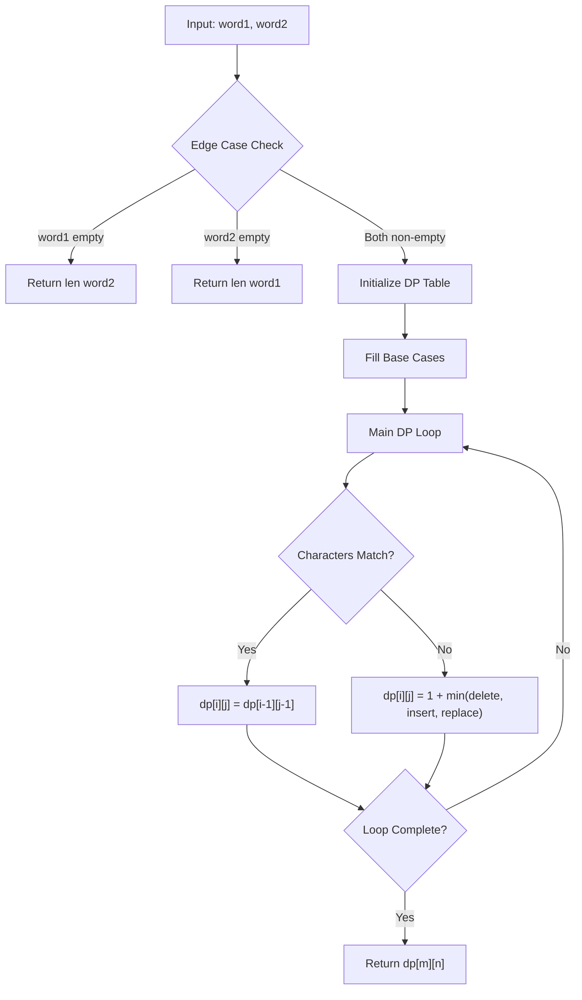
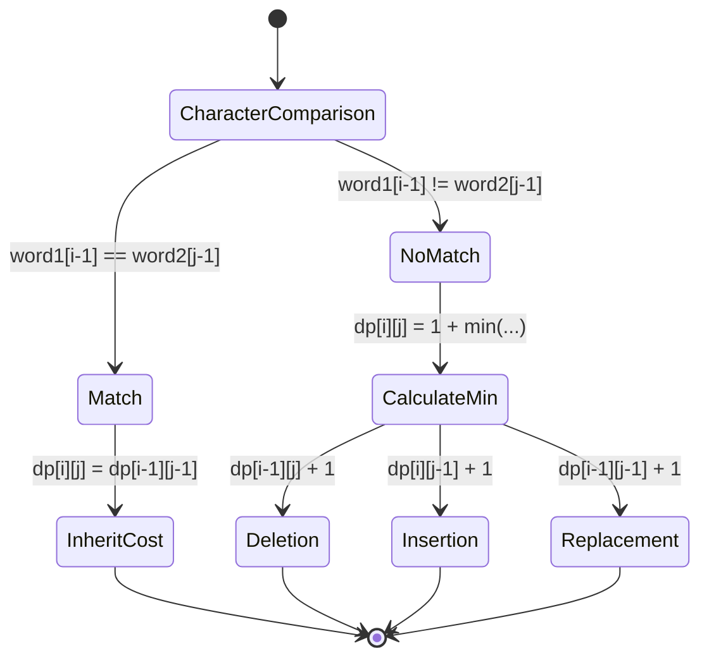
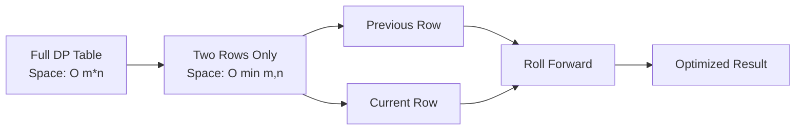

# Edit Distance (Levenshtein Distance) Algorithm

## 概要

このプロジェクトは、**Edit Distance（編集距離、レーベンシュタイン距離）**を計算するアルゴリズムの実装を提供します。競技プログラミング向けとプロダクション開発向けの両方の実装パターンを含んでいます。

編集距離とは、ある文字列を別の文字列に変換するために必要な**最小限の編集操作数**を表す指標です。

## アルゴリズムの仕組み

### 基本概念

編集距離では以下の 3 つの基本操作が許可されています：

1. **挿入 (Insert)**: 文字を追加
2. **削除 (Delete)**: 文字を削除
3. **置換 (Replace)**: 文字を別の文字に変更

### アルゴリズムフロー



### 動的プログラミングテーブルの構築

以下の例で「horse」→「ros」への変換を見てみましょう：

#### 初期状態の DP テーブル

|     | ε   | r   | o   | s   |
| --- | --- | --- | --- | --- |
| ε   | 0   | 1   | 2   | 3   |
| h   | 1   |     |     |     |
| o   | 2   |     |     |     |
| r   | 3   |     |     |     |
| s   | 4   |     |     |     |
| e   | 5   |     |     |     |

#### 完成した DP テーブル

|     | ε   | r   | o   | s   |
| --- | --- | --- | --- | --- |
| ε   | 0   | 1   | 2   | 3   |
| h   | 1   | 1   | 2   | 3   |
| o   | 2   | 2   | 1   | 2   |
| r   | 3   | 2   | 2   | 2   |
| s   | 4   | 3   | 3   | 2   |
| e   | 5   | 4   | 4   | 3   |

**結果**: 編集距離は **3** （右下の値）

### 状態遷移の詳細

各セル `dp[i][j]` は `word1[0...i-1]` を `word2[0...j-1]` に変換する最小コストを表します。



## 実装パターン

### 1. 競技プログラミング版

```python
def minDistance(self, word1: str, word2: str) -> int:
    m, n = len(word1), len(word2)

    # エッジケース
    if m == 0: return n
    if n == 0: return m

    # DPテーブル
    dp = [[0] * (n + 1) for _ in range(m + 1)]

    # 初期化
    for i in range(m + 1): dp[i][0] = i
    for j in range(n + 1): dp[0][j] = j

    # メインループ
    for i in range(1, m + 1):
        for j in range(1, n + 1):
            if word1[i-1] == word2[j-1]:
                dp[i][j] = dp[i-1][j-1]
            else:
                dp[i][j] = min(dp[i-1][j], dp[i][j-1], dp[i-1][j-1]) + 1

    return dp[m][n]
```

**特徴**:

- シンプルで読みやすい
- LeetCode 等での提出に最適
- 最小限のエラーハンドリング

### 2. プロダクション版

```python
def minDistance_production(self, word1: str, word2: str, *,
                         validate_input: bool = True,
                         enable_logging: bool = False) -> int:
```

**特徴**:

- 型安全性の保証
- 包括的な入力検証
- ログ機能
- エラーハンドリング
- ドキュメント完備

### 3. 空間最適化版



**空間計算量の改善**: O(m×n) → O(min(m,n))

## 計算量解析

### 時間計算量

- **O(m × n)**: m と n はそれぞれの文字列の長さ
- 各セルで定数時間の計算を実行

### 空間計算量

- **標準版**: O(m × n) - 完全な DP テーブルを保持
- **最適化版**: O(min(m, n)) - 2 行のみ保持

## 使用例

### 基本的な使用方法

```python
solution = Solution()

# 例1: "horse" → "ros"
result1 = solution.minDistance("horse", "ros")
print(result1)  # 出力: 3

# 例2: "intention" → "execution"
result2 = solution.minDistance("intention", "execution")
print(result2)  # 出力: 5
```

### プロダクション環境での使用

```python
solution = Solution()

try:
    result = solution.minDistance_production(
        "example",
        "sample",
        validate_input=True,
        enable_logging=True
    )
    print(f"Edit distance: {result}")
except (TypeError, ValueError) as e:
    print(f"Input error: {e}")
```

## エッジケース処理

| ケース     | 入力例               | 出力 | 説明     |
| ---------- | -------------------- | ---- | -------- |
| 両方空文字 | `("", "")`           | 0    | 変換不要 |
| 片方空文字 | `("abc", "")`        | 3    | 全削除   |
| 片方空文字 | `("", "xyz")`        | 3    | 全挿入   |
| 同一文字列 | `("hello", "hello")` | 0    | 変換不要 |

## 実際のアプリケーション

1. **スペルチェッカー**: 誤字の候補を提案
2. **DNA 配列解析**: 遺伝子配列の類似性測定
3. **検索エンジン**: あいまい検索機能
4. **バージョン管理**: ファイル差分の計算
5. **自然言語処理**: テキスト類似度の測定

## 最適化のポイント

### CPython 固有の最適化

1. **組み込み関数の活用**: `min()`関数を使用
2. **リスト内包表記**: メモリ効率の向上
3. **事前サイズ確保**: DP テーブルの初期化最適化

### メモリ最適化

```python
# 空間効率化: 長い文字列を行、短い文字列を列に配置
if len(word1) > len(word2):
    word1, word2 = word2, word1
```

## 主な特徴

### 📊 視覚的な説明

- **Mermaid ダイアグラム**でアルゴリズムフローと状態遷移を図解
- **DP テーブルの具体例**で「horse」→「ros」の変換過程を詳細に説明
- **空間最適化**の仕組みを視覚的に表現

### 🔧 実装パターンの比較

1. **競技プログラミング版**: シンプル・高速
2. **プロダクション版**: 型安全・エラーハンドリング完備
3. **空間最適化版**: メモリ効率重視

### 📈 計算量解析

- 時間計算量: O(m×n)
- 空間計算量: O(m×n) → O(min(m,n))への最適化

### 🎯 実用的な情報

- **エッジケース処理**の詳細表
- **実際のアプリケーション**事例
- **CPython 固有の最適化**テクニック
- **使用例**とテストコード

この README は、アルゴリズムの理論的背景から実装の詳細、実用的な応用まで幅広くカバーしており、初心者から上級者まで理解しやすい構成になっています。

問題は角括弧 `[ ]` 内に配列アクセス記号 `[i][j]` が含まれていたことでした。Mermaid では角括弧内に角括弧があると構文エラーが発生します。

主な修正点：

1. `I[dp[i][j] = dp[i-1][j-1]]` → `I["dp[i][j] = dp[i-1][j-1]"]` （ダブルクォートで囲む）
2. `J[dp[i][j] = 1 + min deletion, insertion, replacement]` → `J["dp[i][j] = 1 + min(delete, insert, replace)"]` （ダブルクォートで囲み、テキストも簡潔化）
3. `L[Return dp[m][n]]` → `L["Return dp[m][n]"]` （ダブルクォートで囲む）

これで Mermaid ダイアグラムが正常に表示されるはずです。
