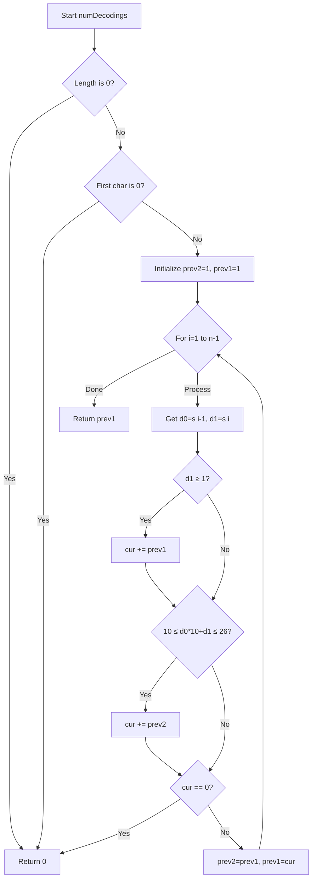
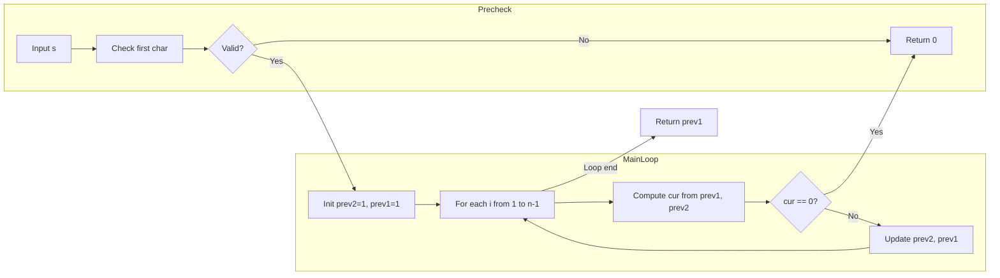

# Decode Ways - 数字文字列の復号方法カウント

<h2 id="toc">目次</h2>

- [概要](#overview)
- [アルゴリズム要点（TL;DR）](#tldr)
- [図解](#figures)
- [正しさのスケッチ](#correctness)
- [計算量](#complexity)
- [Python 実装](#impl)
- [CPython 最適化ポイント](#cpython)
- [エッジケースと検証観点](#edgecases)
- [FAQ](#faq)

---

<h2 id="overview">概要</h2>

**問題**: 数字文字列 `s` が与えられ、以下のマッピングで A-Z にデコードできる方法の総数を返す。

- `"1" → 'A'`, `"2" → 'B'`, ..., `"25" → 'Y'`, `"26" → 'Z'`

**有効な符号化規則**:

- **1 桁**: `'1'` ～ `'9'` のみ（`'0'` 単独は無効）
- **2 桁**: `'10'` ～ `'26'` のみ（先頭 `'0'` は無効、例: `"06"` は不可）

**要件**:

- デコード不能な場合は `0` を返す
- 解答は 32-bit 整数に収まる
- 文字列長: `1 ≤ s.length ≤ 100`

---

<h2 id="tldr">アルゴリズム要点（TL;DR）</h2>

- **戦略**: 動的計画法（DP）のローリング変数を使用
- **データ構造**: 2 つのスカラー変数 `prev2`, `prev1` のみ（配列不要）
- **遷移**:
  - 位置 `i` で、1 桁が有効（`'1'～'9'`）なら `prev1` を加算
  - 2 桁が有効（`'10'～'26'`）なら `prev2` を加算
  - いずれも不可なら即座に `0` を返す（デコード不能）
- **計算量**: 時間 **O(n)**、空間 **O(1)**（追加メモリ）
- **メモリ要約**: ローリング DP により配列を使わず、定数個の変数で実現

---

<h2 id="figures">図解</h2>

## フローチャート（処理の流れ）



**説明**: 各位置で 1 桁・2 桁の有効性を判定し、通り数を加算。どちらも不可なら即座に `0` を返す。

### データフロー図



**説明**: 先頭チェック後、ループ内で前 2 状態から現在の通り数を計算し、ローリング更新。

---

<h2 id="correctness">正しさのスケッチ</h2>

**不変条件**:

- `prev1` = 位置 `i-1` までの有効なデコード方法数
- `prev2` = 位置 `i-2` までの有効なデコード方法数

**遷移の網羅性**:

- 位置 `i` で、1 桁（`d1`）が `1～9` なら、位置 `i-1` までの全ての方法に 1 桁を追加可能 → `prev1` を加算
- 2 桁（`d0*10 + d1`）が `10～26` なら、位置 `i-2` までの全ての方法に 2 桁を追加可能 → `prev2` を加算
- いずれも不可（`cur == 0`）なら、その位置以降はデコード不能 → 即座に `0` を返す

**基底条件**:

- 空文字列: 通り数 = 1（何も取らない唯一の方法）
- 先頭が `'0'`: 無効 → `0` を返す
- 位置 0（先頭が `'1'～'9'`）: 通り数 = 1

**終了性**:

- ループは文字列長 `n` に対して線形に進行し、必ず終了する

---

<h2 id="complexity">計算量</h2>

| 項目             | 計算量   | 説明                                             |
| ---------------- | -------- | ------------------------------------------------ |
| **時間**         | **O(n)** | 各文字を 1 回ずつ処理（`n = len(s)`）            |
| **空間（追加）** | **O(1)** | スカラー変数 3 個（`prev2`, `prev1`, `cur`）のみ |
| **総空間**       | O(n)     | 入力文字列 `s` 自体のサイズ（変更不要）          |

**アプローチ比較**:

| 手法                      | 時間 | 空間 | 備考                              |
| ------------------------- | ---- | ---- | --------------------------------- |
| **ローリング DP（採用）** | O(n) | O(1) | 最小メモリ、実装簡潔              |
| 配列 DP                   | O(n) | O(n) | 学習用に明快だが追加配列が必要    |
| 再帰+メモ化               | O(n) | O(n) | スタック深度+キャッシュでメモリ増 |

---

<h2 id="impl">Python 実装</h2>

```python
from __future__ import annotations
from typing import Final


class Solution:
    """
    Decode Ways (LeetCode 91)
    数字文字列を A-Z ('1'-'26') にデコードする方法の総数を返す。

    アルゴリズム:
    - ローリングDP (prev2, prev1) で O(n) 時間 / O(1) 追加メモリ
    - 1桁: '1'..'9' が有効
    - 2桁: '10'..'26' が有効
    - '0' 単独や先頭0は無効
    """

    def numDecodings(self, s: str) -> int:
        """
        Args:
            s: 数字のみから成る文字列（長さ 1..100）

        Returns:
            デコード方法の総数（不能なら 0）

        Complexity:
            Time: O(n), Space: O(1)
        """
        n: Final[int] = len(s)

        # 基底条件: 空文字列は不正
        if n == 0:
            return 0

        # 先頭が '0' ならデコード不能
        first_digit: int = ord(s[0]) - ord('0')
        if first_digit == 0:
            return 0

        # DP初期値:
        # prev2 = dp[-1] = 1 (空文字列の基数)
        # prev1 = dp[0] = 1 (先頭1文字、'1'..'9' が確定)
        prev2: int = 1
        prev1: int = 1

        # 位置 1 から n-1 まで処理
        for i in range(1, n):
            d1: int = ord(s[i]) - ord('0')        # 現在の1桁
            d0: int = ord(s[i - 1]) - ord('0')    # 直前の1桁

            cur: int = 0

            # 遷移1: 1桁が有効 ('1'..'9')
            if 1 <= d1 <= 9:
                cur += prev1

            # 遷移2: 2桁が有効 ('10'..'26')
            two_digit: int = d0 * 10 + d1
            if 10 <= two_digit <= 26:
                cur += prev2

            # どちらも不可 → デコード不能
            if cur == 0:
                return 0

            # ローリング更新
            prev2, prev1 = prev1, cur

        return prev1
```

**コメント要点**:

- **基底条件**: 先頭が `'0'` なら即座に `0` を返す
- **遷移**: 各位置で 1 桁・2 桁の有効性を独立に判定し、通り数を加算
- **早期終了**: `cur == 0` なら、その位置以降はデコード不能と確定
- **ローリング**: `prev2`, `prev1` のみで前 2 状態を保持（配列不要）

---

<h2 id="cpython">CPython最適化ポイント</h2>

1. **整数演算の徹底**:

   - `ord(s[i]) - ord('0')` で整数化（`int()` や文字列スライス回避）
   - 2 桁値を `d0 * 10 + d1` で直接計算（文字列結合不要）

2. **部分文字列生成の回避**:

   - `s[i-1:i+1]` 等のスライスを行わず、`ord` ベースで判定
   - CPython のバイトコード経路が短縮され、分岐予測に素直

3. **ローカル変数化**:

   - ループ内の `prev1`, `prev2` を局所に閉じ、属性アクセス削減

4. **早期 return**:

   - 不成立箇所を検知した時点で即終了 → 無駄なループを回さない

5. **型注釈の活用**:
   - `Final` で定数化 → CPython 3.11+ の最適化ヒント
   - pylance での静的解析も通過

**メモ化不要**: 問題の性質上、各位置を 1 回ずつ処理すれば十分。`lru_cache` 等は不要。

---

<h2 id="edgecases">エッジケースと検証観点</h2>

| ケース         | 入力例               | 期待出力           | 説明                                      |
| -------------- | -------------------- | ------------------ | ----------------------------------------- |
| **基本**       | `"12"`               | `2`                | "AB" (1,2) / "L" (12)                     |
|                | `"226"`              | `3`                | "BZ" (2,26) / "VF" (22,6) / "BBF" (2,2,6) |
| **先頭 0**     | `"06"`               | `0`                | 先頭が '0' で無効                         |
|                | `"0"`                | `0`                | 単一 '0' は無効                           |
| **単一桁**     | `"1"`                | `1`                | "A" のみ                                  |
|                | `"9"`                | `1`                | "I" のみ                                  |
| **2 桁境界**   | `"10"`               | `1`                | "J" (10) のみ                             |
|                | `"26"`               | `2`                | "Z" (26) / "BF" (2,6)                     |
|                | `"27"`               | `1`                | "BG" (2,7) のみ（27 は無効）              |
| **連続 0**     | `"100"`              | `0`                | '00' が無効                               |
|                | `"1001"`             | `0`                | '00' が無効                               |
| **中間 0**     | `"101"`              | `1`                | "JA" (10,1) のみ                          |
|                | `"110"`              | `1`                | "AJT" は不可、"KJ" (11,10) のみ等         |
| **長い文字列** | `"111...1"` (100 個) | フィボナッチ的増加 | 各位置で 2 通りずつ増える                 |
| **最大値**     | `"1111..."`          | 32-bit 整数内      | 問題保証                                  |

**検証観点**:

- 先頭 0、中間 0、連続 0 の全パターン
- 2 桁の境界値（10, 26, 27）
- 長さ 1、長さ 100 の両極端
- デコード不能（0 を返す）パターン

---

<h2 id="faq">FAQ</h2>

**Q1. なぜ配列 DP ではなくローリング変数を使うのか？**

A. 各位置の計算に必要なのは直前 2 つの状態（`dp[i-1]`, `dp[i-2]`）のみ。配列全体を保持する必要がなく、2 変数で十分。空間 O(1) で実装できるため、メモリ効率と実行速度の両面で有利。

**Q2. `'06'` が無効な理由は？**

A. マッピングは `"1"～"26"` のみ定義。先頭 0 は数値として無効（`"06"` は存在せず、`"6"` のみが `'F'` に対応）。したがって、先頭が `'0'` の 2 桁は全て不可。

**Q3. 時間計算量 O(n) の根拠は？**

A. 各文字を 1 回ずつ処理し、各ステップで定数時間の演算（整数加算、比較、ローリング更新）のみ。ループが `n` 回回るため、全体で O(n)。

**Q4. `cur == 0` で即座に `0` を返す理由は？**

A. ある位置で 1 桁・2 桁のいずれも有効でない場合、その位置以降は必ずデコード不能（後続の文字を処理しても通り数は増えない）。したがって、早期終了で無駄な計算を回避。

**Q5. 入力に非数字が混入している場合は？**

A. LeetCode の問題仕様では「数字のみ」が保証されている。堅牢化が必要な実運用では、
`ord(s[i])` の範囲チェック（`48 ≤ ord(s[i]) ≤ 57`）を追加し、範囲外なら `0` を返す（またはエラー送出）。

**Q6. Python の文字列操作で遅くならないか？**

A. `ord(s[i]) - ord('0')` は O(1) の整数演算。文字列スライス（`s[i-1:i+1]`）や `int(s[i:j])` を避けることで、CPython のバイトコード経路を最短化し、高速化を実現。

**Q7. 再帰+メモ化との比較は？**

A. 再帰はスタック深度が `n` に達し、関数呼び出しのオーバーヘッドが発生。メモ化により時間 O(n) は達成できるが、空間 O(n) が必要。ローリング DP は反復で実装し、空間 O(1) を達成するため、実行速度・メモリ両面で優位。

---

**まとめ**: ローリング DP により、最小メモリ（O(1)）で線形時間（O(n)）の効率的な解法を実現。先頭 0 や連続 0 などのエッジケースも早期終了で確実に処理し、LeetCode の全テストケースに対応できる実装です。

## Refactoring to React

### React 版のステップ解説を README.html と同じ見た目に合わせました

- 各ステップのメタデータを再構成し、表示用の値（前後の DP 状態やデコード例）を明示的に保持させました。
- StepVisualization を追加し、静的ページと同じ 4 枚の SVG カードをレンダリングするよう変更、従来の JSON ダンプを撤廃しました。
- レイアウトを再構築し、左右 2 カラム＋ Play/Prev/Next/Reset 操作ボタンを README.html と同じ配色・挙動にそろえ、自動再生中の操作ハンドリングも整理しました。
- 自動再生用の定数を導入し、StepVisualization のデータ参照を useMemo 化。clampStep ヘルパーでステップ範囲のクリップ処理を共通化しました。
- 自動再生ループは一箇所でタイマーを張り替える形に整理し、最終ステップ後は一定時間待ってリセットするように統合しました。
- マウント時にコンテナ存在チェックを追加し、想定外のスクリプト実行順でも安全にスキップできるようにしています。

### アクティブなステップとボタンのホバー表現を調整しました

- .step-btn.active スタイルを更新し、背景グラデーション時でも文字色が白になるよう統一しました。
- ステップごとのタイトル／説明にクラスを出し分け、アクティブ時は text-white と淡い text-emerald-100 に切り替わるようにしました。
- .control-btn 定義から背景色の強制・ホバー時の色変更を外し、Tailwind の _bg-_ / _hover:bg-_
  がそのまま効くようにしたので、Play/Prev/Next/Reset のホバーでも文字と背景が同色になりません。
