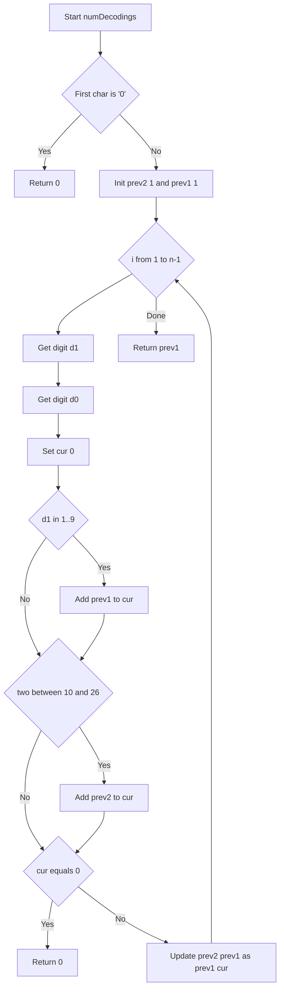
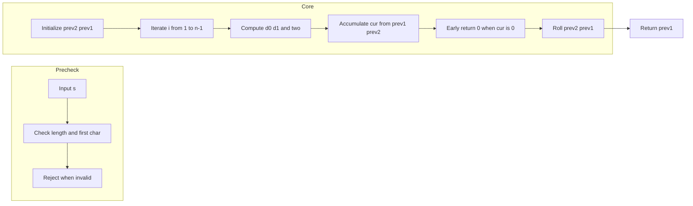

# Decode Ways - 1 桁と 2 桁の動的計画法で通り数を数える

## 目次

- [概要](#overview)
- [アルゴリズム要点（TL;DR）](#tldr)
- [図解](#figures)
- [正しさのスケッチ](#correctness)
- [計算量](#complexity)
- [Python 実装](#impl)
- [CPython 最適化ポイント](#cpython)
- [エッジケースと検証観点](#edgecases)
- [FAQ](#faq)

<h2 id="overview">概要</h2>

- **問題**: 数字文字列 `s` を、`"1"→'A'`, `"2"→'B'`, …, `"26"→'Z'` の対応でデコードできる**通り数**を求める。
- **制約**: `1 <= len(s) <= 100`、`s` は数字のみ。`"0"` 単独や `"06"` のような先頭が 0 の 2 桁は無効。
- **要求**: 通り数を 32-bit 整数で返す。デコード不能な場合は **0**。
- **要旨**: 直近 1 桁・2 桁の有効性に基づく**一次元 DP のローリング**で O(n) 時間 / O(1) 追加メモリ。

<h2 id="tldr">アルゴリズム要点（TL;DR）</h2>

- **戦略**: 位置 `i` までの通り数 `dp[i]` は
  `dp[i] = (s[i] が 1..9 なら dp[i-1]) + (s[i-1..i] が 10..26 なら dp[i-2])`
  を満たす。配列を使わず **`prev2 = dp[i-2]`, `prev1 = dp[i-1]`** だけで更新。
- **データ構造**: 追加配列なし（スカラー 2 変数のみ）。
- **計算量**: **Time O(n)**、**Space O(1)**。
- **実装の勘所**: `substring` を避け、`ord` ベースの整数演算で 1 桁・2 桁判定。無効に出会ったら即 0 を返す。

<h2 id="figures">図解</h2>

## **フローチャート（処理の流れ）**



_説明_: 1 桁と 2 桁の妥当性を順に確認し、通り数を累積。どちらも無効なら早期に 0 を返す。

## **データフロー（前処理から出力まで）**



_説明_: 前処理で即不可能を弾き、コアではローリング DP で通り数を計算。

<h2 id="correctness">正しさのスケッチ</h2>

- **不変条件**: 反復の各時点で `prev1 = dp[i-1]`、`prev2 = dp[i-2]` を保つ。
- **遷移の正当性**:
    - `s[i]` が `'1'..'9'` なら単独で 1 文字に対応し、直前までの通り数 `dp[i-1]` を継承。
    - `s[i-1..i]` が `'10'..'26'` なら 2 文字に対応し、`dp[i-2]` を追加。
    - 両方無効なら `dp[i] = 0` であり、以降も増えないため即 0 で打ち切って良い。

- **基底**: `i=0` は `'1'..'9'` のみ有効で `dp[0]=1`。先頭 `'0'` は不可能で 0。
- **終了性**: 有界ループ `i=1..n-1` で必ず終了。
- **網羅性**: 各位置で取り得る 1 桁／2 桁の全遷移を加算しており、重複・欠落なし。

<h2 id="complexity">計算量</h2>

- **時間計算量**: **O(n)**（各文字を一定回数処理）。
- **空間計算量**: **O(1)**（配列 DP なし、スカラー 2 変数のみ）。

| 実装                    | Time | Space | 特徴                               |
| ----------------------- | ---- | ----- | ---------------------------------- |
| ローリング DP（本実装） | O(n) | O(1)  | 最速・省メモリ・簡潔               |
| 配列 DP                 | O(n) | O(n)  | 学習向けに遷移が見やすいが割当増   |
| 再帰＋メモ化            | O(n) | O(n)  | 関数呼出やスタックでオーバーヘッド |

<h2 id="impl">Python 実装</h2>

- **LeetCode 準拠シグネチャ**: `class Solution: def numDecodings(self, s: str) -> int:`
- **Pure**: 外部副作用なし。
- **pylance 対応**: 厳密な型注釈（`Final`, `int`）・不要インポート削減。

```python
from __future__ import annotations
from typing import Final


class Solution:
    """
    LeetCode 91. Decode Ways
    1桁: '1'..'9' / 2桁: '10'..'26' のみ有効。'0'単独は無効。
    ローリングDPで O(n) 時間 / O(1) 追加メモリ。
    """

    def numDecodings(self, s: str) -> int:
        """
        Args:
            s: 数字のみから成る文字列（長さ 1..100）
        Returns:
            通り数（デコード不能なら 0）
        Complexity:
            Time O(n), Space O(1)
        """
        n: Final[int] = len(s)
        if n == 0:
            return 0

        # 先頭 '0' は不可能
        c0: int = ord(s[0])
        if c0 < 48 or c0 > 57:
            return 0  # 非数字は想定外だが安全側で 0
        if c0 == 48:
            return 0

        # dp[-1] = 1（空文字の基数）、dp[0] = 1（先頭は '1'..'9'）
        prev2: int = 1  # dp[i-2]
        prev1: int = 1  # dp[i-1]

        for i in range(1, n):
            ci: int = ord(s[i])
            if ci < 48 or ci > 57:
                return 0  # 非数字は想定外だが安全側で 0

            d1: int = ci - 48
            d0: int = ord(s[i - 1]) - 48

            cur: int = 0

            # 1桁 '1'..'9'
            if d1 >= 1:
                cur += prev1

            # 2桁 '10'..'26'
            two: int = d0 * 10 + d1
            if 10 <= two <= 26:
                cur += prev2

            # どちらも不可ならそこでデコード不能
            if cur == 0:
                return 0

            prev2, prev1 = prev1, cur

        return prev1
```

<h2 id="cpython">CPython最適化ポイント</h2>

- **スライス回避**: `s[i-1:i+1]` を作らず、`ord` ベースの整数演算で 2 桁値を構成（割当削減）。
- **ローカル変数化**: `prev1`, `prev2`, `d0`, `d1`, `two` はローカルに束縛して高速化。
- **早期リターン**: 無効確定時に即 0 を返して残りの反復を省略。
- **分岐の単純化**: 1 桁・2 桁の判定を固定順で評価し、ブランチ予測の安定化を狙う。
- **追加構造なし**: リストや辞書を使わず GC 負荷を最小化。

<h2 id="edgecases">エッジケースと検証観点</h2>

- **先頭 0**: `"0"`, `"06"` → **0**。
- **単一桁**: `"1"` → 1、`"9"` → 1。
- **2 桁境界**: `"10"` → 1、`"20"` → 1、`"30"` → 0。
- **連続ゼロ**: `"100"` → 0、`"1001"` → 0。
- **ミックス**: `"101"` → 1、`"110"` → 1、`"226"` → 3、`"27"` → 1。
- **最大長**: 長さ 100 の入力でも O(1) 追加メモリで安定動作。
- **非数字混入**: LeetCode 入力では発生しない前提だが、実装は安全側で **0** を返す。

<h2 id="faq">FAQ</h2>

- **Q. なぜ `"06"` は無効なのか？**
  **A.** 先頭が 0 の 2 桁はマップに存在しないため。`"6"` は有効でも `"06"` は無効。

- **Q. 配列 DP を使わない理由は？**
  **A.** 遷移が 1 歩前と 2 歩前のみ依存のため、2 変数で十分。メモリ削減と速度に有利。

- **Q. 再帰＋メモ化との違いは？**
  **A.** オーバーヘッド（関数呼び出し・スタック）があり、本問題規模では反復の方が安定して速い。

- **Q. 途中で 0 を返しても正しいのか？**
  **A.** ある位置 `i` で `dp[i] = 0` なら以降で増える道は存在しない（1 桁・2 桁とも無効）。よって早期終了は正当。
