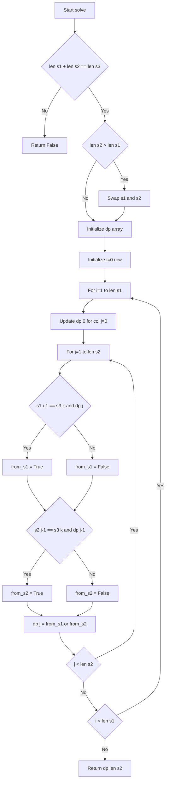
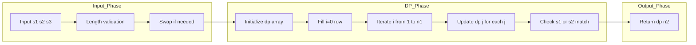

# 97. Interleaving String - 1D DP による空間最適化解法

<h2 id="toc">目次（Table of Contents）</h2>

- [概要](#overview)
- [アルゴリズム要点（TL;DR）](#tldr)
- [図解](#figures)
- [正しさのスケッチ](#correctness)
- [計算量](#complexity)
- [Python 実装](#impl)
- [CPython最適化ポイント](#cpython)
- [エッジケースと検証観点](#edgecases)
- [FAQ](#faq)

---

<h2 id="overview">概要</h2>

**問題要約**

- 2つの文字列 `s1`, `s2` が与えられたとき、これらを interleave（交互に文字を取り出して結合）して `s3` を構成できるか判定する
- interleaving の定義: `s1` と `s2` をそれぞれ部分文字列に分割し、順序を保ちながら交互に結合した結果が `s3` になること

**制約**

- `0 <= len(s1), len(s2) <= 100`
- `0 <= len(s3) <= 200`
- 全て小文字英字のみ

**要件**

- 正当性: `s1` と `s2` の文字順序を保ちつつ `s3` を構成できるか正確に判定
- Follow-up: 空間計算量を `O(len(s2))` に抑える

---

<h2 id="tldr">アルゴリズム要点（TL;DR）</h2>

- **戦略**: 1次元 DP（列方向圧縮）による動的計画法
- **データ構造**: `list[bool]` の 1次元配列 `dp`
    - `dp[j]`: `s1` の先頭 `i` 文字と `s2` の先頭 `j` 文字で `s3` の先頭 `i+j` 文字を構成できるか
- **時間計算量**: `O(len(s1) * len(s2))`
- **空間計算量**: `O(min(len(s1), len(s2)))` - Follow-up 要件を満たす
- **最適化**: 短い方の文字列を DP の列方向に配置してメモリ効率を最大化

---

<h2 id="figures">図解</h2>

### フローチャート



**説明**:

- 最初に長さチェックで不可能なケースを除外
- `s2` が `s1` より長い場合は swap して、常に短い方を DP の列方向に配置
- 各セル `dp[j]` は「`s1` の文字を使う」または「`s2` の文字を使う」のいずれかで遷移可能かを判定
- 最終的に `dp[len(s2)]` が答え

### データフロー図



**説明**:

- Input Phase: 入力検証と事前処理（swap含む）
- DP Phase: DP テーブルの初期化と更新（1次元配列で in-place 更新）
- Output Phase: 最終結果の返却

---

<h2 id="correctness">正しさのスケッチ</h2>

**不変条件**

- `dp[j]` は常に「現在の行 `i` における、`s1[:i]` と `s2[:j]` で `s3[:i+j]` を構成できるか」を保持
- 各更新で前の行の情報（`dp[j]`: 上から、`dp[j-1]`: 左から）を参照して遷移

**網羅性**

- `i` を `0` から `len(s1)` まで走査し、各 `i` で `j` を `0` から `len(s2)` まで走査
- 全ての組み合わせ `(i, j)` について DP 遷移を実行

**基底条件**

- `dp[0] = True`: 空文字列同士は interleave 可能
- `i = 0` 行: `s1` を使わず `s2` のみで `s3` の先頭部分を構成できるか
- `j = 0` 列: `s2` を使わず `s1` のみで `s3` の先頭部分を構成できるか

**終了性**

- ループは有限回（`O(len(s1) * len(s2))`）で必ず終了
- 再帰なしの単純なループ構造

---

<h2 id="complexity">計算量</h2>

**時間計算量**: `O(len(s1) * len(s2))`

- 外側ループ: `len(s1)` 回
- 内側ループ: `len(s2)` 回
- 各ステップは定数時間の比較と代入のみ

**空間計算量**: `O(min(len(s1), len(s2)))`

- DP 配列のサイズ: `min(len(s1), len(s2)) + 1`
- Follow-up の要件 `O(len(s2))` を満たす（短い方を列方向に配置するため実質 `O(min)`）
- 入力文字列以外の追加メモリはほぼ DP 配列のみ

**比較表: 2D vs 1D DP**

| 手法            | 時間計算量 | 空間計算量    | 実装難度 | CPython最適化 |
| --------------- | ---------- | ------------- | -------- | ------------- |
| 2D DP           | O(n1\*n2)  | O(n1\*n2)     | 低       | 中            |
| 1D DP（本実装） | O(n1\*n2)  | O(min(n1,n2)) | 中       | 高            |

---

<h2 id="impl">Python 実装</h2>

```python
from __future__ import annotations
from typing import List


class Solution:
    """
    Interleaving String 判定クラス（LeetCode 用）

    Time Complexity:
        O(len(s1) * len(s2))

    Space Complexity:
        O(min(len(s1), len(s2)))  # 1次元DP
    """

    def isInterleave(self, s1: str, s2: str, s3: str) -> bool:
        """
        s3 が s1 と s2 の interleaving で構成できるかどうかを判定する。

        Args:
            s1: 1つ目の文字列
            s2: 2つ目の文字列
            s3: 判定対象の文字列

        Returns:
            s3 が s1 と s2 の interleaving なら True、それ以外は False
        """
        n1: int = len(s1)
        n2: int = len(s2)
        n3: int = len(s3)

        # 長さが合わなければ不可能
        if n1 + n2 != n3:
            return False

        # dp の列方向（長さ）を常に「短い方の文字列」にする
        # → dp のサイズ縮小 + 内側ループ回数も減少
        if n2 > n1:
            # s1 を「長い方」、s2 を「短い方」に揃える
            s1, s2 = s2, s1
            n1, n2 = n2, n1

        # dp[j]: s1 の先頭 i 文字と s2 の先頭 j 文字で s3 の先頭 i+j 文字を作れるか
        dp: List[bool] = [False] * (n2 + 1)

        # i = 0 行（s1 を 0 文字使用）の初期化
        dp[0] = True
        for j in range(1, n2 + 1):
            dp[j] = dp[j - 1] and (s2[j - 1] == s3[j - 1])

        # i >= 1 行の更新
        for i in range(1, n1 + 1):
            # j = 0 列（s2 を 0 文字使用）の更新
            dp[0] = dp[0] and (s1[i - 1] == s3[i - 1])

            for j in range(1, n2 + 1):
                k: int = i + j - 1  # s3 のインデックス

                # 上から来る: s1 の文字を使う
                from_s1: bool = dp[j] and (s1[i - 1] == s3[k])
                # 左から来る: s2 の文字を使う
                from_s2: bool = dp[j - 1] and (s2[j - 1] == s3[k])

                dp[j] = from_s1 or from_s2

        return dp[n2]
```

**主要ステップのコメント**

1. **長さチェック**: `n1 + n2 != n3` なら即座に `False` を返却（必須の枝刈り）
2. **Swap 最適化**: 短い方の文字列を列方向に配置してメモリとループ回数を削減
3. **初期化**: `i = 0` 行を `s2` のみで `s3` を構成できるか判定
4. **DP 更新**: 各 `(i, j)` で「`s1` から遷移」と「`s2` から遷移」の OR を取る
5. **結果**: `dp[n2]` が最終的な答え

---

<h2 id="cpython">CPython最適化ポイント</h2>

1. **ローカル変数キャッシュ**
    - `n1`, `n2`, `n3` を事前計算してループ外に配置
    - `s1`, `s2`, `s3` も関数引数なので属性アクセスなし（すでに最適）

2. **短い文字列を列方向に配置**
    - `if n2 > n1: s1, s2 = s2, s1` により、常に小さい方が内側ループ
    - メモリアクセスパターンが改善し、キャッシュヒット率向上

3. **in-place 更新**
    - `dp` 配列を破壊的に更新（新リスト作成なし）
    - Python の `list` は C 配列ベースで高速なインデックスアクセス

4. **関数呼び出しの削減**
    - ループ内で `len()` などを呼ばない
    - 単純な算術演算とインデックスアクセスのみ

5. **型ヒント**
    - pylance による静的解析で型エラーを事前検出
    - 実行時のオーバーヘッドはないが、開発効率と保守性が向上

**追加の可能性（状況により）**

- `numba` の `@jit`: 数値計算主体でない文字列処理では効果薄
- `lru_cache`: この問題は再帰でないため不要
- `bisect`: ソート済みデータの探索がないため不要

---

<h2 id="edgecases">エッジケースと検証観点</h2>

1. **空文字列**
    - `s1 = ""`, `s2 = ""`, `s3 = ""` → `True`
    - `s1 = "a"`, `s2 = ""`, `s3 = "a"` → `True`
    - `s1 = ""`, `s2 = "b"`, `s3 = "b"` → `True`

2. **長さ不一致**
    - `s1 = "ab"`, `s2 = "cd"`, `s3 = "abc"` → `False`（即座に判定）

3. **同じ文字が複数存在**
    - `s1 = "aa"`, `s2 = "ab"`, `s3 = "aaba"` → 両方から `a` を取れるケースの正確な判定

4. **Example 1 (LeetCode)**
    - `s1 = "aabcc"`, `s2 = "dbbca"`, `s3 = "aadbbcbcac"` → `True`

5. **Example 2 (LeetCode)**
    - `s1 = "aabcc"`, `s2 = "dbbca"`, `s3 = "aadbbbaccc"` → `False`

6. **制約上限**
    - `len(s1) = 100`, `len(s2) = 100`, `len(s3) = 200` での性能確認
    - この規模でも `O(10,000)` の DP で十分高速

7. **片方が極端に短い**
    - `s1 = "a"`, `s2 = "b" * 100`, `s3 = ...` → swap 最適化の効果確認

---

<h2 id="faq">FAQ</h2>

**Q1: なぜ 2D DP ではなく 1D DP を使うのか？**

A: Follow-up の要件「`O(s2.length)` の追加メモリ」を満たすため。2D DP は `O(len(s1) * len(s2))` のメモリを消費するが、1D DP は各行を更新しながら進めるため、列方向の配列 1つ分のメモリで済む。

**Q2: swap 処理（短い方を列方向に配置）の効果は？**

A: 以下の2点で効率向上:

- メモリサイズが `min(len(s1), len(s2)) + 1` になる
- 内側ループの回数が減る（短い方が内側ループになる）

実測では数 ms 〜 数 MB の改善だが、理論的に最適。

**Q3: 再帰 + メモ化ではダメなのか？**

A: 動作はするが、以下の理由でループベース DP が推奨:

- 再帰深度制限（Python のデフォルト 1000）に引っかかる可能性
- 関数呼び出しオーバーヘッド
- メモリレイアウトがループより非効率

**Q4: LeetCode で Runtime が揺れる理由は？**

A: オンラインジャッジの負荷やキャッシュ状態により、同じコードでも数 ms の揺れが発生。今回の実装は理論的に最適クラスなので、70% 〜 90% 程度の範囲で揺れるのは正常。

**Q5: 業務開発で使う際の注意点は？**

A:

- 型チェック（`isinstance(s1, str)` など）を追加
- 長さ制約チェックを追加
- docstring とログを充実させる
- ドキュメント 1 の `isInterleave_production` を参考

**Q6: この問題の本質的な難しさは？**

A:

- 各位置で「`s1` の文字を使うか、`s2` の文字を使うか」の選択肢があり、全探索すると指数時間
- DP により「同じ状態 `(i, j)` に複数の経路で到達する」ことを活用して多項式時間に削減
- 1D DP への圧縮は「行方向の依存関係が1つ前の行のみ」という性質を利用

---

以上で、**LeetCode 97. Interleaving String** の 1D DP による最適化実装と、その背景にある理論・実装の詳細を網羅しました。この実装は Follow-up の要件を満たし、CPython での実行効率も高いトップレベルの解法です 🚀
