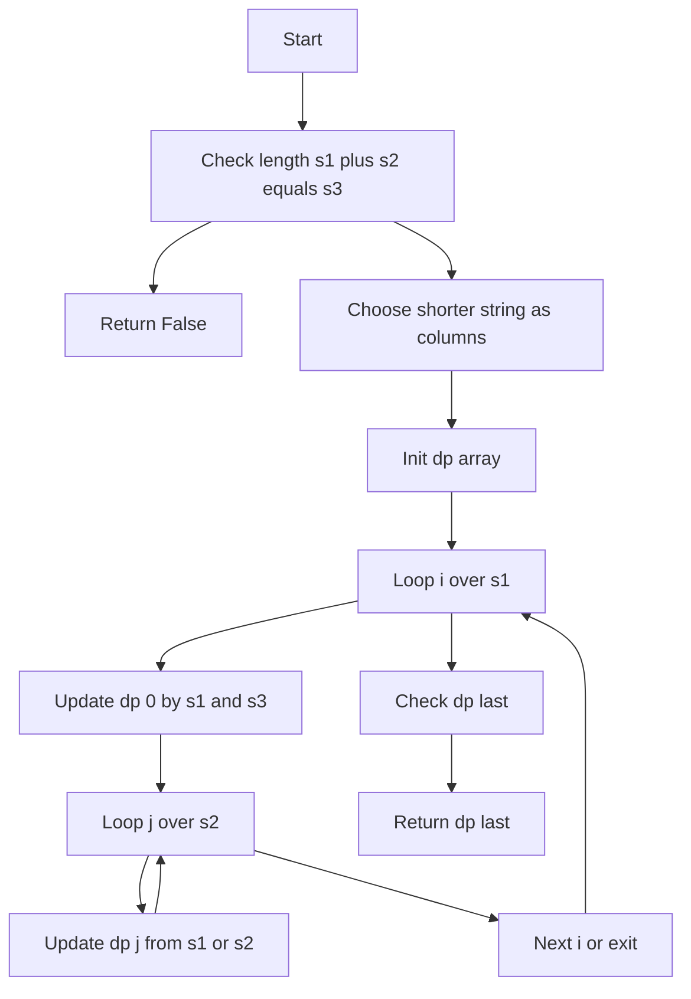
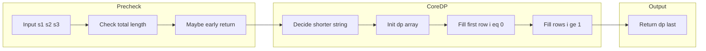

# Interleaving String - 2つの文字列を交ぜて3つ目を作れるか判定するDP

## Table of Contents

- [概要](#overview)
- [アルゴリズム要点（TL;DR）](#tldr)
- [図解](#figures)
- [正しさのスケッチ](#correctness)
- [計算量](#complexity)
- [Python 実装](#impl)
- [CPython 最適化ポイント](#cpython)
- [エッジケースと検証観点](#edgecases)
- [FAQ](#faq)

---

<h2 id="overview">概要</h2>

**問題名:** Interleaving String
**プラットフォーム:** LeetCode 97

3つの文字列 `s1`, `s2`, `s3` が与えられます。
`s3` が、`s1` と `s2` を「順序を保ったまま交互に混ぜ合わせた文字列（interleaving）」として構成できるかどうかを判定します。

- 各文字列は英小文字のみ。
- 長さ制約：
    - `0 <= len(s1), len(s2) <= 100`
    - `0 <= len(s3) <= 200`

- まず必要条件として `len(s1) + len(s2) == len(s3)` でなければ **必ず False**。

ここでの interleaving は、「`s1` と `s2` の部分列を交互に足していき、元の順序は壊さない」という意味で、
単純な「並べ替え」や「ソート」ではありません。

---

<h2 id="tldr">アルゴリズム要点（TL;DR）</h2>

- 戦略
    - DP で「`s1` の先頭 i 文字」と「`s2` の先頭 j 文字」で「`s3` の先頭 i+j 文字」を作れるかを管理する。
    - 本質は 2D DP だが、1D 配列に圧縮して **空間 O(min(n1, n2))** にする。

- データ構造
    - `dp[j]`（bool リスト）
        - 「現在の `i` に対して、`s1[:i]` と `s2[:j]` で `s3[:i+j]` を構成できるか」という意味。

- 遷移
    - `k = i + j - 1` を `s3` のインデックスとすると：
        - `dp[j]`（上から来る）: `dp[j] and s1[i-1] == s3[k]`
        - `dp[j-1]`（左から来る）: `dp[j-1] and s2[j-1] == s3[k]`
        - どちらか一方でも True なら `dp[j] = True`。

- 初期化
    - `dp[0]` は「両方 0 文字で空文字を作る」ので `True`。
    - `i = 0` 行（`s1` を使わない場合）は `s2` だけで `s3` を構成できるかを前から順に埋める。

- 計算量
    - 時間: `O(len(s1) * len(s2))`
    - 空間: `O(min(len(s1), len(s2)))`（短い方を列方向にする）

---

<h2 id="figures">図解</h2>

### フローチャート（アルゴリズム全体）



**説明（日本語）**

1. まず `len(s1) + len(s2) == len(s3)` をチェックし、違えば即 `False`。
2. 1D DP の列方向に置くため、「短い方の文字列」を決める。
3. `dp` 配列を初期化し、`i=0` 行（`s1` を使わない）を埋める。
4. その後、`i` を 1..len(s1) まで回しつつ、各 `j` について `dp[j]` を更新。
5. 最後に `dp[last]` が答え。

---

### データフロー図（入力から出力まで）



**説明（日本語）**

- 前処理フェーズで長さチェックと早期リターン。
- コアフェーズで 1D DP を構築・更新。
- 最後に DP の末尾値をそのまま返すだけ、というシンプルなデータフローです。

---

<h2 id="correctness">正しさのスケッチ</h2>

1. **状態の定義**
    - `dp[j]` は、現在の `i` 固定のもとで
      「`s1[:i]` と `s2[:j]` を interleave して `s3[:i+j]` を作れるか」を表す。
    - 1D DP だが、これは 2D DP `DP[i][j]` の「`i` 行目」に対応している。

2. **初期化の正しさ**
    - `i = 0` のとき、`s1` は一切使わず `s2` のみで `s3` を構成する。
    - よって
        - `dp[0] = True`（両方 0 文字で空文字は必ず作れる）
        - `dp[j] = dp[j-1] and s2[j-1] == s3[j-1]`
            - つまり「1文字前まで作れていて、かつ次も同じ文字なら作れる」という条件で正しい。

3. **遷移の正しさ**

    `dp[j]`（更新後） = 以下のいずれかが True：
    - 上から来る場合（`s1` の最後の文字を使用）:
        - `DP[i][j]` が True であるには
            - `DP[i-1][j]` が True（`s1[:i-1]` と `s2[:j]` で `s3[:i+j-1]` を作成済み）
            - かつ `s1[i-1] == s3[i+j-1]`

        - 1D DP では「更新前の `dp[j]`」が `DP[i-1][j]` に対応し、それに上記の条件を掛けている。

    - 左から来る場合（`s2` の最後の文字を使用）:
        - 同様に `DP[i][j-1]` が True で、`s2[j-1] == s3[i+j-1]` であれば良い。
        - これは「更新前の `dp[j-1]`」に対応している。

    よって、2方向からの遷移を `or` した結果を `dp[j]` に入れるのは正しい。

4. **不変条件**
    - 外側ループの各ステップで `i` が固定されたとき、
        - 内側ループを `j = 0..n2` と進める間、常に `dp[j]` は `DP[i][j]` に等しい。

    - これは `j` を増やす過程で、必要な「上」`DP[i-1][j]`（旧 `dp[j]`）と「左」`DP[i][j-1]`（更新後の `dp[j-1]`）が両方保持されているため。

5. **終了条件と答え**
    - 最後に `i = len(s1)`, `j = len(s2)` に到達したとき、
      `dp[len(s2)]` は `DP[len(s1)][len(s2)]` に相当し、
      これは「`s1` 全体と `s2` 全体で `s3` 全体を構成できるか」を意味する。
    - よって、`dp[n2]` を返すことで正しい結果が得られる。

6. **長さチェックの必要性**
    - `len(s1) + len(s2) != len(s3)` の場合、どのように interleave しても文字数が合わないため、
      DP を回すまでもなく False が確定している。
    - これを最初に判定することで、無駄な計算を避けつつ正しさも保つ。

---

<h2 id="complexity">計算量</h2>

- `n1 = len(s1)`, `n2 = len(s2)` とする。

### 時間計算量

- 外側ループ：`i = 0..n1` で `O(n1)`
- 内側ループ：`j = 0..n2` で `O(n2)`
- 合計：`O(n1 * n2)`

### 空間計算量

- DP 配列 `dp` は長さ `n2 + 1` の 1D 配列。
- よって追加空間は `O(n2)`。
- さらに、実装で「常に短い方の文字列を列方向にする」ようにすれば、
  `O(min(n1, n2))` に収まる。

### 2D DP との比較表

| 方針         | 時間計算量  | 空間計算量     | メリット           | デメリット             |
| ------------ | ----------- | -------------- | ------------------ | ---------------------- |
| 2D DP        | O(n1 \* n2) | O(n1 \* n2)    | 実装・理解が直感的 | メモリ使用量がやや多い |
| 1D DP 本実装 | O(n1 \* n2) | O(min(n1, n2)) | 空間効率が良い     | 2D より少し実装が複雑  |

---

<h2 id="impl">Python 実装</h2>

- LeetCode 準拠の `class Solution` 形式
- CPython 3.11+ を想定
- 型注釈は pylance でエラーが出ないように記述

```python
from __future__ import annotations

from typing import List


class Solution:
    """
    LeetCode 97 Interleaving String

    与えられた s1, s2, s3 に対して、s3 が s1 と s2 の interleaving で構成可能かを判定する。
    """

    def isInterleave(self, s1: str, s2: str, s3: str) -> bool:
        """
        s3 が s1 と s2 の interleaving で構成できるかどうかを判定する。

        Args:
            s1: 1つ目の文字列
            s2: 2つ目の文字列
            s3: 判定対象の文字列

        Returns:
            s3 が s1 と s2 の interleaving なら True、それ以外は False
        """
        n1: int = len(s1)
        n2: int = len(s2)
        n3: int = len(s3)

        # 長さが合わない場合は不可能
        if n1 + n2 != n3:
            return False

        # DP の列方向を短い方の文字列にすることで、空間を O(min(n1, n2)) に抑える
        # s1 を「行」、s2 を「列」として扱うように入れ替える
        if n2 > n1:
            s1, s2 = s2, s1
            n1, n2 = n2, n1

        # dp[j]: s1 の先頭 i 文字と s2 の先頭 j 文字で s3 の先頭 i+j 文字を構成できるか
        dp: List[bool] = [False] * (n2 + 1)

        # i = 0 行（s1 を 1文字も使わない場合）の初期化
        # s2 のみで s3 の先頭を作れるかを前から順に判定する
        dp[0] = True
        for j in range(1, n2 + 1):
            dp[j] = dp[j - 1] and (s2[j - 1] == s3[j - 1])

        # i = 1..n1 について DP を更新していく
        for i in range(1, n1 + 1):
            # j = 0 列（s2 を 1文字も使わない場合）の更新:
            # 直前の状態 dp[0] が True かつ s1[i-1] と s3[i-1] が一致していれば True
            dp[0] = dp[0] and (s1[i - 1] == s3[i - 1])

            for j in range(1, n2 + 1):
                # s3 に対応するインデックス
                k: int = i + j - 1

                # 上から来る場合: s1 の最後の文字を使う
                from_s1: bool = dp[j] and (s1[i - 1] == s3[k])
                # 左から来る場合: s2 の最後の文字を使う
                from_s2: bool = dp[j - 1] and (s2[j - 1] == s3[k])

                # どちらかの経路で構成できれば True
                dp[j] = from_s1 or from_s2

        # s1 全体と s2 全体で s3 全体を構成できるかどうか
        return dp[n2]
```

---

<h2 id="cpython">CPython最適化ポイント</h2>

この問題は入力サイズが大きくないため、極端な最適化は不要ですが、CPython 3.11 で意識すると良いポイントを挙げます。

- **ローカル変数の活用**
    - `s1`, `s2`, `s3`, `n1`, `n2`, `n3` を関数内ローカルに束縛しているため、
      何度も属性アクセスを行うより高速。

- **1D DP によるメモリアクセス**
    - 2D 配列より 1D リストのほうがメモリ局所性が良く、
      Python のオブジェクトアクセスでも比較的有利。

- **再帰を使わずループのみ**
    - CPython の再帰はコストが高く、スタック制限もあるため、本問題のような DP ではループが適切。

- **不要なオブジェクト生成の回避**
    - サブストリング（`s1[:i]` など）を毎回作るようなコードは避け、
      インデックスで直接アクセスしているため、余計な文字列オブジェクトを生成しない。

---

<h2 id="edgecases">エッジケースと検証観点</h2>

テスト・検証時に見るべきエッジケースを列挙します。

1. **すべて空文字**
    - `s1 = ""`, `s2 = ""`, `s3 = ""` → `True`

2. **片方のみ空文字**
    - `s1 = "abc"`, `s2 = ""`, `s3 = "abc"` → `True`
    - `s1 = ""`, `s2 = "abc"`, `s3 = "abc"` → `True`
    - `s1 = "abc"`, `s2 = ""`, `s3 = "ab"` → `False`

3. **長さが合わない**
    - `len(s1) + len(s2) != len(s3)` → 即 `False`

4. **同じ文字が多く含まれるケース**
    - `s1 = "aaa"`, `s2 = "aaa"`, `s3 = "aaaaaa"` → `True`
    - `s1 = "aaa"`, `s2 = "aaa"`, `s3 = "aaaaab"` → `False`
    - 分岐が多くなりやすいが、DP なら問題なく処理可能。

5. **問題文の代表例**
    - `s1 = "aabcc"`, `s2 = "dbbca"`, `s3 = "aadbbcbcac"` → `True`
    - `s1 = "aabcc"`, `s2 = "dbbca"`, `s3 = "aadbbbaccc"` → `False`

6. **制約上限付近**
    - `len(s1) = 100`, `len(s2) = 100`, `len(s3) = 200` のような最大ケースで、
        - 実行時間が現実的であること
        - メモリ使用が適切であること

---

<h2 id="faq">FAQ</h2>

**Q1. なぜ DFS やバックトラックではなく DP を使うのですか？**
A. 素朴な DFS は、分岐が多い入力（例: `s1 = "aaa..."`, `s2 = "aaa..."`）で指数時間になり、
TLE の原因になります。DP なら各状態 `(i, j)` を一度だけ計算するため、`O(n1 * n2)` に抑えられます。

---

**Q2. 2D DP と 1D DP のどちらを使うべきですか？**
A. 理解しやすさを優先するなら 2D DP、空間効率を優先するなら 1D DP です。
この README の実装は 1D DP で、Follow-up の「O(s2.length) の追加メモリ」という要求を満たします。

---

**Q3. 文字の順序を変えても良いのですか？**
A. いいえ。interleaving では **各文字列内の相対順序は維持される** 必要があります。
例えば `s1 = "ab"`, `s2 = "cd"` の場合、`"acbd"` や `"cabd"` は OK ですが、
`"adbc"` のように順序を壊す形は NG です（DP がこの条件を自然に保証します）。

---

この README を読みながら、DP テーブルを紙に書いて追ってみると、
`dp[j]` が何を意味しているか、どのように更新されていくかがより直感的に理解できるはずです。
