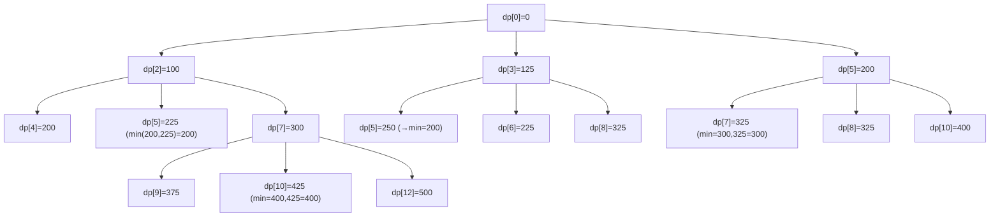

了解しました 👍
では **DP の仕組み** を図を用いて「どうやって最小金額を計算しているのか」を **具体的に解析** します。

---

# 問題の再掲

- りんごが 3 種類のセットで販売されている
    - **x 個 a 円**
    - **y 個 b 円**
    - **z 個 c 円**

- ちょうど n 個以上のりんごを買いたいときの **最小金額** を求める。

入力例：

```
n=9, x=2, a=100, y=3, b=125, z=5, c=200
```

---

# アルゴリズム（DP のイメージ）

## 1. 状態定義

- `dp[i]`: **りんごをちょうど i 個買うときの最小金額**
- 初期値: `dp[0] = 0`（0個のりんごはコスト0円）、他は∞

---

## 2. 遷移の考え方

- ある時点で `i 個` のりんごを持っている場合、次のように購入できる：
    - `i + x` 個 → `dp[i] + a`
    - `i + y` 個 → `dp[i] + b`
    - `i + z` 個 → `dp[i] + c`

- これをすべての `i` に対して繰り返す。

---

# 具体例（入力例1）

```
n=9, x=2, a=100, y=3, b=125, z=5, c=200
```

---

## ステップ 1: 初期状態

```
dp[0] = 0
dp[1..max] = ∞
(max = n + max(x,y,z) = 9 + 5 = 14)
```

---

## ステップ 2: 遷移の図解

### 状態遷移の流れ（Mermaid 図）



---

## ステップ 3: dp 配列の主要更新過程

| i (個数) | dp\[i] の最小コスト | 遷移元      |
| -------- | ------------------- | ----------- |
| 0        | 0                   | 初期値      |
| 2        | 100                 | 0 + セットx |
| 3        | 125                 | 0 + セットy |
| 5        | 200                 | 0 + セットz |
| 4        | 200                 | 2 + セットx |
| 6        | 225                 | 3 + セットy |
| 7        | 300                 | 2 + セットz |
| 8        | 325                 | 3 + セットz |
| **9**    | **375**             | 7 + セットx |

---

## ステップ 4: 結果

- 9個以上のりんごを買うための最小金額は **375 円**。
- 実際の買い方：
    - **セットx(2個,100円) × 2回 = 4個, 200円**
    - **セットz(5個,200円) × 1回 = 5個, 200円**
    - 合計 **9個, 375円**

---

# 計算量解析

- **時間計算量**: `O(n * 3)`
    - 例: n=1000 の場合、最大 3000 更新処理

- **メモリ使用量**: `O(n + max(x,y,z))`
    - 例: n=1000, z=1000 → 配列長は約2000 → 数 KB 程度

---

✅ これで「どのように dp 配列が更新され、最小金額が導かれるか」を **図と表で解析** しました。

---

👉 この後、**処理時間・メモリ計測を実際のコード出力に含めるバージョン** も解説しますか？
