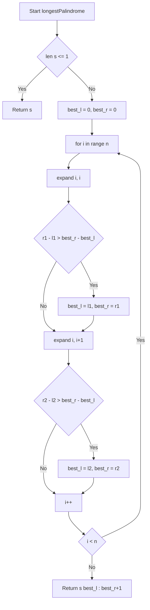
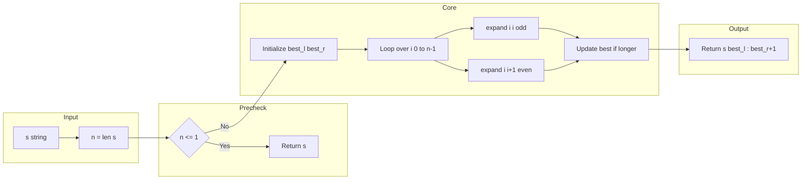

# Longest Palindromic Substring - 中心展開法による O(n²) 解法

## 目次（Table of Contents）

- [概要](#overview)
- [アルゴリズム要点（TL;DR）](#tldr)
- [図解](#figures)
- [正しさのスケッチ](#correctness)
- [計算量](#complexity)
- [Python 実装](#impl)
- [CPython 最適化ポイント](#cpython)
- [エッジケースと検証観点](#edgecases)
- [FAQ](#faq)

---

<h2 id="overview">概要</h2>

**問題**: 文字列 `s` から最長の回文部分文字列を返す。

**要件**:

- **制約**: `1 <= len(s) <= 1000`、文字種は英数字のみ
- **正当性**: すべての可能な中心位置（奇数長・偶数長）を網羅し、最長を選択
- **安定性**: 複数解がある場合は最初に見つかったものを返す（左優先）

---

<h2 id="tldr">アルゴリズム要点（TL;DR）</h2>

- **戦略**: 中心展開法（Expand Around Center）
  - 各位置を中心として左右に展開し、回文が続く限り伸ばす
  - 奇数長（中心 1 文字）と偶数長（中心 2 文字）の両方を試行
- **データ構造**: 追加構造不要（インデックスのみ保持）
- **計算量**: Time O(n²), Space O(1)
- **メモリ**: 最後に一度だけスライスを生成（中間文字列を作らない）

---

<h2 id="figures">図解</h2>

### フローチャート



**説明**: 各位置 `i` で奇数長・偶数長の中心展開を行い、最長のインデックス範囲を更新。最後に一度だけスライスを返す。

### データフロー図



**説明**: 入力文字列を受け取り、各位置で展開を実行、最長範囲を保持して最後にスライスを返す単純な流れ。

---

<h2 id="correctness">正しさのスケッチ</h2>

**不変条件**:

- `best_l`, `best_r` は常に有効な回文のインデックス範囲を保持（`s[best_l:best_r+1]` は回文）
- `expand(l, r)` は `s[l] == s[r]` が成り立つ限り `l` を減らし `r` を増やし、終了時に最大範囲の inclusive インデックスを返す

**網羅性**:

- すべての位置 `i` で奇数長（中心 1 文字）と偶数長（中心 2 文字）の両方を試行
- どの回文も必ずいずれかの中心位置から展開されるため、最長解を見逃さない

**基底条件**:

- `len(s) <= 1` の場合は `s` 自体が回文なのでそのまま返す
- 初期状態 `best_l = 0, best_r = 0` は `s[0]` 単一文字（最小の回文）を表す

**終了性**:

- `for` ループは `O(n)` 回、各 `expand` は最悪 `O(n)` だが有限回で終了
- `while` の終了条件は境界チェック（`l >= 0 and r < n`）と文字不一致

---

<h2 id="complexity">計算量</h2>

| 項目      | 計算量 | 理由                                                     |
| --------- | ------ | -------------------------------------------------------- |
| **Time**  | O(n²)  | 各位置 O(n) × 展開 O(n) = O(n²)                          |
| **Space** | O(1)   | インデックスのみ保持、最後のスライス生成は出力として許容 |

**補足**:

- Manacher のアルゴリズムは O(n) だが実装が複雑
- n ≤ 1000 の制約下では O(n²) で十分高速
- 追加のリスト/配列を確保しないため、メモリ効率が高い

---

<h2 id="impl">Python 実装</h2>

```python
from __future__ import annotations


class Solution:
    def longestPalindrome(self, s: str) -> str:
        """
        Longest Palindromic Substring - 中心展開法
        Time: O(n^2), Space: O(1)

        各位置を中心に奇数長・偶数長の回文を展開し、最長のものを返す。
        """
        n: int = len(s)
        if n <= 1:
            return s

        def expand(l: int, r: int) -> tuple[int, int]:
            """
            中心 (l, r) から可能な限り展開し、
            inclusive の [L, R] インデックスを返す。
            """
            while l >= 0 and r < n and s[l] == s[r]:
                l -= 1
                r += 1
            # ループ終了時は l, r が条件を満たさない位置なので +1, -1 で戻す
            return l + 1, r - 1

        best_l: int = 0
        best_r: int = 0

        # 各位置で奇数長・偶数長の両方を試行
        for i in range(n):
            # 奇数長（中心1文字）
            l1, r1 = expand(i, i)
            if r1 - l1 > best_r - best_l:
                best_l, best_r = l1, r1

            # 偶数長（中心2文字）
            l2, r2 = expand(i, i + 1)
            if r2 - l2 > best_r - best_l:
                best_l, best_r = l2, r2

        # 最後に一度だけスライスを生成（メモリ効率化）
        return s[best_l : best_r + 1]
```

**コメント補足**:

- **基底条件**: `n <= 1` で即座に返す（単一文字も回文）
- **展開処理**: `expand` 関数は `while` で境界と文字一致をチェックし、終了時に有効範囲を返す
- **更新**: 長さ `r - l` が現在の最長より大きい場合のみ更新（左優先）
- **最終出力**: インデックス保持のみで中間文字列を作らず、最後に一度だけスライス

---

<h2 id="cpython">CPython最適化ポイント</h2>

1. **ローカル変数束縛**:

   - `best_l`, `best_r` をループ外で宣言し、LOAD_FAST を活用
   - `n = len(s)` を事前計算し、ループ内で `len(s)` を呼ばない

2. **スライス回避**:

   - 展開中は部分文字列を生成せず、インデックスのみ操作
   - 最後に一度だけ `s[best_l : best_r + 1]` を返す（GC/メモリ負荷最小）

3. **文字比較の高速化**:

   - `s[l] == s[r]` は CPython の C 実装による高速な文字比較
   - `while` ループで直接比較し、関数呼び出しを最小化

4. **不要な構造の排除**:
   - `list`, `deque`, `dict` などの追加構造を使わない（O(1) スペース）
   - 再帰ではなく `while` ループで展開（スタックオーバーフロー回避）

---

<h2 id="edgecases">エッジケースと検証観点</h2>

| ケース                   | 入力例             | 期待出力           | 検証ポイント                         |
| ------------------------ | ------------------ | ------------------ | ------------------------------------ |
| 単一文字                 | `"a"`              | `"a"`              | 基底条件、最小入力                   |
| 全同一文字               | `"aaaa"`           | `"aaaa"`           | 全体が回文                           |
| 偶数長回文               | `"cbbd"`           | `"bb"`             | 偶数長の展開が正しく動作             |
| 複数解（最初を返す）     | `"babad"`          | `"bab"` or `"aba"` | 左優先（最初に見つかった最長）       |
| 先頭が最長               | `"racecar"`        | `"racecar"`        | 先頭から全体が回文                   |
| 末尾が最長               | `"abacabad"`       | `"aba"` (最初)     | 複数の同長解から左優先               |
| 回文なし（全異なる文字） | `"abcdef"`         | `"a"` (任意単一)   | 最小長（単一文字）が返る             |
| 最大長（制約上限）       | 長さ 1000 の文字列 | 該当部分           | パフォーマンステスト（O(n²) で十分） |

---

<h2 id="faq">FAQ</h2>

**Q1: なぜ Manacher ではなく中心展開法を採用したのか？**

- A: n ≤ 1000 の制約下では O(n²) で十分高速。実装が短く、バグ混入率が低い。Manacher は O(n) だが境界処理が複雑でコードが長くなる。

**Q2: 偶数長の回文はどう処理しているか？**

- A: `expand(i, i+1)` で中心 2 文字から展開。奇数長は `expand(i, i)` で中心 1 文字から展開。両方を試行して最長を選択。

**Q3: 複数の最長回文がある場合、どれを返すか？**

- A: ループは左から順に処理するため、最初に見つかった最長解を返す（左優先）。問題文では任意の最長解が正解。

**Q4: スライスの生成タイミングは？**

- A: 最後の `return s[best_l : best_r + 1]` で一度だけ。ループ中は部分文字列を作らず、インデックスのみ保持してメモリ効率を最大化。

**Q5: 型注釈 `tuple[int, int]` はどのバージョンから使えるか？**

- A: Python 3.9+ で `from __future__ import annotations` を付ければ 3.7+ でも使用可能。
  3.9 未満では `Tuple[int, int]` を `typing` からインポート。

**Q6: LeetCode で提出する際の注意点は？**

- A: クラス形式 `class Solution:` と指定のメソッドシグネチャ `def longestPalindrome(self, s: str) -> str:` を守る。追加の入力検証は不要（制約が保証される）。
