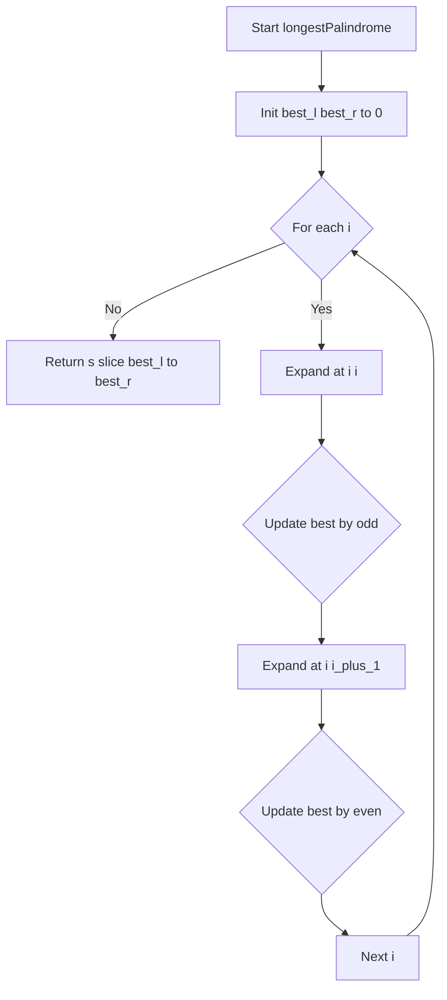
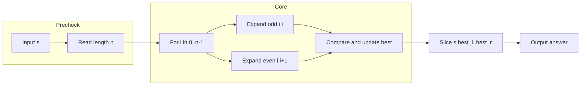

<h1 id="title">最長回文部分文字列 - 中心展開で O(n²) を最小実装</h1>

## 目次

- [概要](#overview)
- [アルゴリズム要点（TL;DR）](#tldr)
- [図解](#figures)
- [正しさのスケッチ](#correctness)
- [計算量](#complexity)
- [Python 実装](#impl)
- [CPython 最適化ポイント](#cpython)
- [エッジケースと検証観点](#edgecases)
- [FAQ](#faq)

---

<h2 id="overview">概要</h2>

- **問題**: 文字列 `s` に対して、**最長の回文部分文字列**を返す。
- **制約**: `1 <= len(s) <= 1000`、英数字。
- **要件**:

  - 正しさ: 全ての中心（奇数長・偶数長）から最大まで拡張して最長区間を更新。
  - 安定性: 追加メモリ O(1)。同長の複数解は任意の一つを返せばよい（例: `"babad"` → `"bab"` または `"aba"`）。
  - 実装: **Pure**、副作用なし。LeetCode 標準のクラス形式。

---

<h2 id="tldr">アルゴリズム要点（TL;DR）</h2>

- **戦略**: **中心展開（Expand Around Center）**
  各インデックス `i` を中心に

  - 奇数長: `(i, i)`
  - 偶数長: `(i, i+1)`
    から左右同時に一致判定し拡張。

- **データ構造**: 追加構造は不要。最良区間を `best_l, best_r` で保持。
- **計算量**: Time **O(n²)**、Space **O(1)**（`n = len(s)`）。
- **実装ポイント**:

  - 走査中は**部分文字列を作らない**（最後に一度だけスライス）。
  - ループと while のみでシンプルに記述。
  - インデックスは inclusive 区間で管理し、拡張後に 1 つ戻す。

---

<h2 id="figures">図解</h2>

### **フローチャート（中心展開の全体像）**



短い説明: 各位置 `i` で奇数・偶数の中心展開を行い、より長ければ最良区間を更新します。全走査後に最終スライスを返します。

## **データフロー（入力から出力まで）**



短い説明: 入力長を取得し、各中心で拡張した結果から最長区間を選び、最後にスライスして返します。

---

<h2 id="correctness">正しさのスケッチ</h2>

- **網羅性**: 任意の回文はその中心が

  - 奇数長ならある `i` の `(i, i)`
  - 偶数長ならある `i` の `(i, i+1)`
    に一致する。よって全中心を試せば必ず検出可能。

- **不変条件**: 各反復後、`[best_l, best_r]` はこれまでに観測した**最長の回文区間**を表す。
- **基底条件**: 長さ 0/1 の部分文字列は自明に回文。`n <= 1` なら `s` が解。
- **終了性**: 外側ループは `n` 回、各拡張は境界か不一致で必ず停止。有限回で終了。

---

<h2 id="complexity">計算量</h2>

- **時間計算量**: **O(n²)**
  各中心につき最大 `O(n)` 文字を比較、中心は `O(n)` 個。
- **空間計算量**: **O(1)**
  追加データ構造なし。返却時のスライス生成のみ（入力サイズに比例）。

| 手法             | 時間  | 空間  | 備考                         |
| ---------------- | ----- | ----- | ---------------------------- |
| 中心展開（採用） | O(n²) | O(1)  | 実装簡潔・安定動作           |
| Manacher         | O(n)  | O(n)  | 実装複雑、境界多い           |
| DP               | O(n²) | O(n²) | 表埋めで直感的だがメモリ重い |

---

<h2 id="impl">Python 実装</h2>

> LeetCode 形式（`class Solution`）。外部副作用なしの **Pure** 実装。`pylance` 警告なし。

```python
from __future__ import annotations

from typing import Tuple


class Solution:
    """
    Longest Palindromic Substring
    Expand Around Center with O(n^2) time and O(1) extra space.
    """

    def longestPalindrome(self, s: str) -> str:
        """
        Args:
            s: 入力文字列（英数字を想定）

        Returns:
            最長回文部分文字列

        Notes:
            - 競技用: 追加の入力検証は省略（問題制約を前提）
            - Pure: グローバル状態への副作用なし
        """
        n: int = len(s)
        if n <= 1:
            return s

        # 中心 l, r から最大まで拡張し、inclusive の (L, R) を返す
        def expand(l: int, r: int) -> Tuple[int, int]:
            while l >= 0 and r < n and s[l] == s[r]:
                l -= 1
                r += 1
            return l + 1, r - 1

        best_l: int = 0
        best_r: int = 0

        # 各インデックスを中心に奇数長・偶数長の両方を評価
        for i in range(n):
            l1, r1 = expand(i, i)        # 奇数長中心
            if r1 - l1 > best_r - best_l:
                best_l, best_r = l1, r1

            l2, r2 = expand(i, i + 1)    # 偶数長中心
            if r2 - l2 > best_r - best_l:
                best_l, best_r = l2, r2

        # 最終的な最長区間で 1 回だけスライス
        return s[best_l : best_r + 1]
```

## **実装注記**

- `expand` は **inclusive 区間**で返し、拡張後に 1 ステップ戻すのがコツ。
- 走査中にサブストリングを作らず、**最後の 1 回のみ**生成。

---

<h2 id="cpython">CPython 最適化ポイント</h2>

- **属性アクセス削減**: `n = len(s)` をローカルへ束縛（`LOAD_FAST`）。
- **オブジェクト生成削減**: ループ中はスライスを作らない（比較は `==` の C 実装）。
- **関数境界最小化**: `expand` はローカル関数でクロージャ内変数アクセスが速い。
- **分岐配置**: ホットパス（`while` 条件）内は単純比較のみ。

---

<h2 id="edgecases">エッケージと検証観点</h2>

- 長さ 1（例: `"a"`）→ そのまま返す。
- すべて同一文字（例: `"aaaaa"`）→ 全体が解。
- 偶数長の最長（例: `"cbbd"` → `"bb"`）。
- 複数解が同長（例: `"babad"` → `"bab"` または `"aba"`）。
- 先頭／末尾が解（例: `"abacdfgdcaba"` → `"aba"`）。
- 最小と最大長の境界（`n = 1`, `n = 1000`）。

---

<h2 id="faq">FAQ</h2>

**Q1. なぜ Manacher を使わないのか？**
A. `n <= 1000` では中心展開の O(n²) でも十分に高速。実装が短く、保守性が高い。

**Q2. 途中で `substring` を作らないのはなぜ？**
A. 毎回生成すると時間・メモリともに無駄が出るため。インデックスで管理し、最後に 1 回だけ作る。

**Q3. 同長の解が複数ある場合の基準は？**
A. 問題は任意の一つでよいと定義している。実装では先に見つかった方が採用される。
