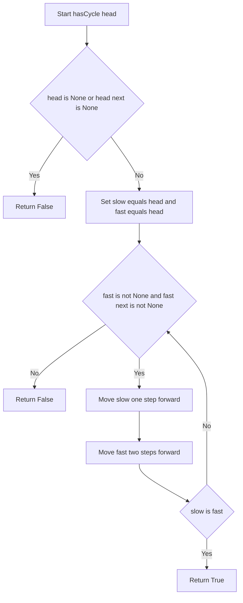
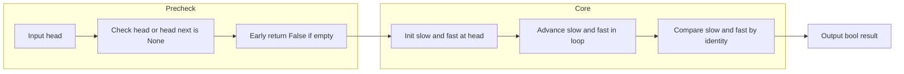

# LeetCode 141: Linked List Cycle - 連結リストの循環をポインタ2つで見抜く

<h2 id="toc">目次</h2>

- [概要](#overview)
- [アルゴリズム要点（TL;DR）](#tldr)
- [図解](#figures)
- [正しさのスケッチ](#correctness)
- [計算量](#complexity)
- [Python実装](#impl)
- [CPython最適化ポイント](#cpython)
- [エッジケースと検証観点](#edgecases)
- [FAQ](#faq)

---

<h2 id="overview">概要</h2>

> 💡 **初学者向け補足**：この問題は、一言で言うと「連結リスト（ノードが`next`という矢印でつながったデータ構造）を先頭から`next`をたどっていったとき、以前に通ったノードにまた戻ってきてしまう輪っか（サイクル）があるかどうかを判定する問題」です。

この問題が難しく感じられるポイントは、「サイクルがあるかどうか」を確認するために**リスト全体を配列にコピーして目で見て確認する、というわけにはいかない**点です。リストが無限に長く見えてしまう（実際には輪っかの中を何周もするだけ）ため、素朴に「先頭から順番に全部たどって終端`None`を待つ」だけのコードだと、サイクルがある場合に永遠に終わらない（無限ループになる）危険があります。そこで、「輪っかがあるかどうか」を**有限のステップで確実に判定できる工夫**が必要になります。今回はその工夫として、進む速さの異なる2つのポインタ（変数）を使う古典的な手法を採用します。

- **入力**: 連結リストの先頭ノード `head`（`Optional[ListNode]`型。リストが空の場合は`None`）
- **出力**: サイクルが存在すれば`True`、存在しなければ`False`（`bool`型）
- **制約**（例）: ノード数は`0`から`10^4`個程度、各ノードの値は`-10^5`から`10^5`の範囲
- **正当性の要件**: どんな形の連結リスト（空・単一ノード・自己ループ・長い輪っか）に対しても、有限のステップで正しく`True`/`False`を返せること

> 📖 **この章で登場した用語**
>
> - **連結リスト**：データ（ノード）が`next`という矢印でつながった構造。配列と違い、途中への挿入・削除が高速。
> - **サイクル（循環）**：リストをたどっていくと、以前に訪れたノードにまた戻ってきてしまう輪っか状の構造。
> - **制約**：入力として与えられる値の範囲や条件のこと。例：「ノード数は`10^4`以下」。
> - **正当性**：アルゴリズムがどんな入力に対しても常に正しい答えを返すことの保証。

---

<h2 id="tldr">アルゴリズム要点（TL;DR）</h2>

> 💡 **初学者向け補足**：TL;DR（Too Long; Didn't Read＝長くて読めない人向けの要約）とは、細かい説明を飛ばして「なんとなくこういう手順で解くんだな」というイメージを掴むための章です。詳しい理屈は後の章で説明します。

- **戦略**: Floyd's Tortoise and Hare（亀と兎のアルゴリズム）を使う。「遅いポインタ（亀）」を1歩ずつ、「速いポインタ（兎）」を2歩ずつ進めることで、追加のメモリなしにサイクルを検出できるため選択。
- **データ構造**: 追加のデータ構造は使わない。`slow`と`fast`という2つの変数（ポインタ）だけで済ませることで、メモリ効率を最大化できるため。
- **判定条件**: `slow`と`fast`が同じノードを指した瞬間、サイクルが存在すると判定する。輪っかの中では速いポインタが必ずいつか遅いポインタに追いつくという性質を利用しているため。
- **終了条件**: `fast`（またはその次のノード）が`None`に到達したら、輪っかがなくリストが途切れていると判定して終了するため。
- **計算量**: 時間計算量 O(n)、空間計算量 O(1)。リストを1回走査するだけで済み、追加メモリも不要なため最も効率的。

> 📖 **この章で登場した用語**
>
> - **TL;DR**：「長くて読めない人向けの要約」を意味する略語。
> - **Floyd's Tortoise and Hare**：進む速さの異なる2つのポインタを使ってサイクルを検出する古典的な手法。
> - **ポインタ**：ある変数が「別のデータ（ここではノード）を指し示している」状態、またはその変数自体のこと。

---

<h2 id="figures">図解</h2>

> 💡 **初学者向け補足**：以下の図はアルゴリズムの「処理の流れ」を視覚的に示したものです。Mermaidフローチャートでは、ひし形（`{}`）は「条件分岐（＝はい/いいえで処理が分かれるポイント）」、長方形（`[]`）は「処理ステップ（＝実際に何かを行う操作）」を表します。上から下へ矢印をたどりながら読み進めてください。

### フローチャート

この図は`hasCycle`関数がどのような順序で処理を行い、いつ`True`または`False`を返すのかという処理の流れを表しています。上から下へ読み進めてください。



主要なノードの意味：

- `Start[Start hasCycle head]`：関数の入り口。`head`を受け取る。
- `Base{head is None or head next is None}`：リストが空、またはノードが1つしかないかを判定するひし形（条件分岐）。
- `RetFalseEmpty[Return False]`：輪っかを作りようがないため`False`を返すステップ。
- `Init[Set slow equals head and fast equals head]`：2つのポインタを両方とも先頭ノードで初期化するステップ。
- `LoopCond{fast is not None and fast next is not None}`：`fast`があと2歩進めるかどうかを判定するひし形。
- `MoveSlow` / `MoveFast`：それぞれ`slow`を1歩、`fast`を2歩進めるステップ。
- `Check{slow is fast}`：2つのポインタが同じノードを指したかどうかを判定するひし形。
- `RetTrue[Return True]`：サイクルが検出されたことを表すステップ。

### データフロー図

この図は、入力の`head`から出力の`bool`値までデータがどのように変換されていくかを表しています。



主要な流れの説明：

- `Precheck`から`Core`へ：まず空リスト・単一ノードといった「輪っかを作れないケース」を除外してから、本格的なアルゴリズムに入る。
- `Core`内：`slow`と`fast`を交互に進めながら、毎回「同じノードを指しているか」を確認するループを繰り返す。
- `Core`から`Output`へ：ループの結果（サイクルを検出したか、リストの終端に到達したか）を`bool`値として返す。

> 💡 **代表例でのトレース**：入力 `head = [3,2,0,-4]`（`pos=1`で末尾の`-4`がインデックス1の`2`に戻る）を使って、上記フローチャートの各ノードをどのように通過するかを示します。
>
> ```
> Step 1: Start → head = [3,2,0,-4]（末尾が2番目のノードに戻る）
> Step 2: Base 判定 → head is None?No、head.next is None?No → No側へ
> Step 3: Init → slow = 3, fast = 3
> Step 4: LoopCond 判定 → fast=3, fast.next=2 → 両方Noneでない → Yes側へ
> Step 5: MoveSlow → slow = 2
> Step 6: MoveFast → fast = 0（3 → 2 → 0 と2歩進む）
> Step 7: Check 判定 → slow(2) is fast(0)? → No → LoopCondへ戻る
> Step 8: LoopCond 判定 → fast=0, fast.next=-4 → 継続
> Step 9: MoveSlow → slow = 0
> Step 10: MoveFast → fast = 2（0 → -4 → 2 と2歩進む。-4の次は2番目のノード）
> Step 11: Check 判定 → slow(0) is fast(2)? → No → LoopCondへ戻る
> Step 12: LoopCond 判定 → fast=2, fast.next=0 → 継続
> Step 13: MoveSlow → slow = -4
> Step 14: MoveFast → fast = -4（2 → 0 → -4 と2歩進む）
> Step 15: Check 判定 → slow(-4) is fast(-4)? → Yes（同じノードオブジェクト）
> 結果: True を返す
> ```

> 📖 **この章で登場した用語**
>
> - **フローチャート**：処理の手順を図形と矢印で表したもの。ひし形＝条件分岐、長方形＝処理。
> - **データフロー図**：データがどのように変換・移動するかを示す図。
> - **サブグラフ**：フローチャートの中で関連する処理をグループ化したもの（今回は`Precheck`と`Core`の2グループ）。

---

<h2 id="correctness">正しさのスケッチ</h2>

> 💡 **初学者向け補足**：「正しさのスケッチ」とは、アルゴリズムが**常に正しい答えを返すことの根拠**を整理したものです。厳密な数学的証明ではなく、「なぜ正しいと言えるか」を直感的に説明します。

- **不変条件**（＝処理中ずっと成り立ち続けるべき条件）: ループの各回において、`slow`は`fast`よりも常に「進んだ歩数が半分以下」である。具体的には、`slow`が`k`歩進む間に`fast`は`2k`歩進んでいる。
- **網羅性**（＝すべてのケースをもれなく処理できているという保証）: リストの形は「輪っかがない（一本道）」か「輪っかがある」のどちらかしかなく、この2つのケースをそれぞれ`LoopCond`が`No`で抜ける場合と、`Check`が`Yes`になる場合として網羅している。
- **基底条件**（＝再帰やループの終了条件）: `head`が`None`、または`head.next`が`None`の場合、それ以上ノードを進められないため輪っかは作りようがなく、即座に`False`を返す。これは「ノードが0個または1個（自己ループなし）のリストにサイクルは存在しない」という直感とも一致する。
- **終了性**（＝アルゴリズムが必ず有限ステップで終わるという保証）: 輪っかがない場合、`fast`は有限個のノードを進んだのちに必ず`None`（またはその手前）に到達するためループは終了する。輪っかがある場合、`fast`は`slow`よりも1歩ずつ相対的に速く輪っかの中を進むため、輪っかの長さを超えないうちに必ず`slow`に追いつく（すれ違うのではなく、同じ場所に重なる）。したがって、いずれの場合も有限回のループで終了することが保証される。

> 📖 **この章で登場した用語**
>
> - **不変条件**：アルゴリズムが正しく動くために、処理中ずっと成り立ち続けるべき条件。
> - **基底条件**：ループや再帰の終了条件。これがないと無限ループになる。
> - **終了性**：アルゴリズムが必ず有限ステップで終わるという保証。
> - **網羅性**：すべてのケースをもれなく処理できているという保証。

---

<h2 id="complexity">計算量</h2>

> 💡 **初学者向け補足**：計算量とは「入力が大きくなるにつれて、処理にかかる時間・メモリがどう増えるか」の目安です。

| 記法 | 意味 | 直感的なイメージ |
| ---- | ---- | ---------------- |
| `O(1)` | 入力サイズによらず一定 | 辞書で直接ページを開く |
| `O(n)` | 入力に比例して増加 | リストを端から順に読む |

- **時間計算量**: `O(n)`。輪っかがない場合は`fast`が最大`n`個のノードを走査して終わる。輪っかがある場合も、`slow`が輪っかの長さを超える前に必ず`fast`と一致するため、走査するノードの延べ数は`n`に比例する範囲に収まる。
- **空間計算量**: `O(1)`。`slow`と`fast`という2つの変数（ポインタ）以外に、入力サイズに応じて増えるデータ構造を一切使っていない。

比較として、「訪問済みノードを`set`に記録する方法」は時間計算量`O(n)`は同じだが、空間計算量が`O(n)`になる（最大でリストの全ノードを`set`に記録する可能性があるため）。今回のFloyd's Tortoise and Hareは、その空間コストをゼロにできる点が最大の利点。

> 📖 **この章で登場した用語**
>
> - **時間計算量**：入力の大きさに対して処理にかかる手間がどう増えるかの目安。
> - **空間計算量**：処理中に使うメモリ量がどう増えるかの目安。

---

<h2 id="impl">Python実装</h2>

> 💡 **初学者向け補足**：コードを読む前に、実装の全体的な骨格を示します。
>
> 1. `head`が`None`、またはノードが1つしかない場合、即座に`False`を返す
> 2. `slow`と`fast`という2つのポインタ変数を、両方とも`head`で初期化する
> 3. `fast`があと2歩進める間だけループを繰り返す
> 4. ループの中で`slow`を1歩、`fast`を2歩進める
> 5. `slow`と`fast`が同じノードを指したら`True`を返す
> 6. ループを抜けたら（＝`fast`が終端に到達したら）`False`を返す

```python
from __future__ import annotations

from typing import Optional, TYPE_CHECKING

# pylance（静的型チェッカー）向けの型スタブ定義。
# LeetCodeの実行環境では ListNode クラスが既に用意されているため、
# 実行時にはこの定義を使わず、型チェック時（TYPE_CHECKING=True）にのみ参照される。
if TYPE_CHECKING:
    class ListNode:
        val: int
        next: Optional["ListNode"]
else:
    # 実行時にListNodeが未定義（＝ローカルで動作確認する場合など）であれば、
    # 最小限のフォールバック定義を用意する。
    # __slots__ を使うことで、インスタンスごとの辞書生成を省略しメモリを節約する。
    try:
        ListNode  # type: ignore[used-before-def]
    except NameError:
        class ListNode:
            __slots__ = ("val", "next")

            def __init__(self, x: int) -> None:
                self.val = x
                self.next: Optional["ListNode"] = None


class Solution:
    """
    連結リストにサイクル（循環）が存在するかどうかを判定するクラス。

    Floyd's Tortoise and Hare（亀と兎のアルゴリズム）を用いて、
    追加のメモリを使わずに O(n) 時間で判定する。
    """

    def hasCycle(self, head: Optional[ListNode]) -> bool:
        """
        連結リストにサイクルが存在するかを判定する（Pure function）。

        Args:
            head: 連結リストの先頭ノード。空リストの場合は None。

        Returns:
            サイクルが存在すれば True、存在しなければ False。

        Time Complexity: O(n)
        Space Complexity: O(1)
        """
        # 基底条件：head が None、またはノードが1つしかない場合、
        # 「次に進む」動作自体ができないため輪っかは作りようがない。
        # pylance対応：ここで None を除外することで、以降の型チェックが安全になる。
        if head is None or head.next is None:
            return False

        # 「遅いポインタ（亀）」は1歩ずつ、「速いポインタ（兎）」は2歩ずつ進む。
        # 型ヒント上はどちらも Optional[ListNode]（None になる可能性がある）。
        slow: Optional[ListNode] = head
        fast: Optional[ListNode] = head

        # fast と fast.next の両方が None でない間だけループを続ける。
        # Python の and は短絡評価（＝左が False なら右を評価しない）を行うため、
        # fast が None の時点で fast.next へアクセスされることはなく、
        # AttributeError（存在しない属性へのアクセスエラー）を未然に防いでいる。
        while fast is not None and fast.next is not None:
            # 遅いポインタを1歩進める。
            slow = slow.next  # type: ignore[union-attr]

            # 速いポインタを2歩進める。
            fast = fast.next.next

            # is 演算子でオブジェクトの同一性（＝同じメモリ上のノードかどうか）を判定する。
            # 値の比較（==）ではなく「同じノードを指しているか」を確認したいので is を使う。
            if slow is fast:
                return True

        # ループを抜けた（＝fast が終端 None に到達した）ということは、
        # 輪っかがなく、リストがどこかで途切れていたということ。
        return False
```

> 💡 **コードの動作トレース**（初学者向け）
>
> ```
> 例）入力: head = [3,2,0,-4]（-4 の next が インデックス1の 2 に戻る）
>
> 呼び出し: hasCycle(head)
> 初期状態: head.next は None ではないので基底条件はスキップ
>           slow = 3, fast = 3
>
> ループ1回目: fast(3), fast.next(2) → 両方Noneでないので継続
>   slow = slow.next → 2
>   fast = fast.next.next → 0
>   slow(2) is fast(0)? → No
>
> ループ2回目: fast(0), fast.next(-4) → 継続
>   slow = slow.next → 0
>   fast = fast.next.next → 2（-4 の次が 2 に戻り、その次が 0）
>   slow(0) is fast(2)? → No
>
> ループ3回目: fast(2), fast.next(0) → 継続
>   slow = slow.next → -4
>   fast = fast.next.next → -4（2 の次が 0、その次が -4）
>   slow(-4) is fast(-4)? → Yes（同じノードオブジェクト）
>
> 最終結果: True
> ```

> 📖 **この章で登場した用語**
>
> - **`from __future__ import annotations`**：型ヒントを文字列として遅延評価する宣言。前方参照（まだ定義していないクラス名を型として使うこと）を解決できる。
> - **`TYPE_CHECKING`**：実行時には`False`、型チェッカー（pylance等）がコードを解析するときだけ`True`として扱われる特別な定数。実行時には不要なコードを型チェックのためだけに書きたいときに使う。
> - **`__slots__`**：クラスのインスタンスが持てる属性をあらかじめ固定し、通常発生する属性辞書（`__dict__`）の生成を省略することでメモリを節約する仕組み。
> - **`# type: ignore[union-attr]`**：pylanceに対して「この行の型警告は意図的なので無視してください」と伝えるコメント。ループの前提条件から実行時には安全であることが保証されている場合に限定して使用する。
> - **`AttributeError`**：存在しない属性（例：`None`に対する`.next`）にアクセスしようとしたときにPythonが発生させる実行時エラー。

---

<h2 id="cpython">CPython最適化ポイント</h2>

> 💡 **初学者向け補足**：この章では「同じ処理でもPythonの書き方によって速さが変わる理由」を説明します。

- **属性アクセスの最小化**: `fast.next.next`のように1行で2段階の属性アクセスを行うことで、中間変数を作らずに済ませています。中間変数を作らないことでオブジェクト生成のオーバーヘッド（＝余分な処理コスト）を避けられます。

    ```python
    # 最適化前：中間変数を経由する書き方
    tmp = fast.next
    fast = tmp.next

    # 最適化後：1行でまとめて2歩進める
    fast = fast.next.next
    # 理由：中間変数への代入自体にもわずかなコストがあるため、
    #       不要な代入を減らすことでわずかに高速化できる。
    ```

- **`is`演算子によるオブジェクト同一性判定**: `slow == fast`ではなく`slow is fast`を使うことで、値の比較（`__eq__`メソッドの呼び出し）ではなく、ポインタとしての同一性を直接比較しています。`ListNode`クラスは`__eq__`を独自定義していないため挙動上の差はほぼありませんが、「同じノードオブジェクトを指しているか」という意図が明確になり、かつ`is`はC実装レベルでの単純なポインタ比較のため`==`より高速です。
- **短絡評価の活用**: `while fast is not None and fast.next is not None:`という条件式は、Pythonの`and`が左から右へ評価され、左が`False`なら右を評価しないという性質（短絡評価）を利用しています。これにより`fast`が`None`の場合に`fast.next`へアクセスしてエラーになることを防ぎつつ、余計な条件チェックのコードを書かずに済んでいます。

> 📖 **この章で登場した用語**
>
> - **属性アクセス**：`obj.x`のようにオブジェクトのプロパティを参照する操作。
> - **`__eq__`**：Pythonのオブジェクトが`==`で比較されたときに呼ばれる特殊メソッド。
> - **短絡評価**：`and`や`or`で、左側の条件だけで結果が確定する場合、右側を評価しない仕組み。

---

<h2 id="edgecases">エッジケースと検証観点</h2>

> 💡 **初学者向け補足**：エッジケースとは「入力が空・最小値・最大値・重複あり」など、通常とは異なる境界的な入力のことです。

- **空リスト（`head = None`）**: なぜ問題になりうるか → `head.next`にいきなりアクセスするコードだと`AttributeError`が発生する。今回は最初の`if head is None`で安全に`False`を返している。
- **ノードが1つだけ、自己ループなし（`head.next = None`）**: なぜ問題になりうるか → ループ条件を先にチェックせずにいきなり`slow.next`にアクセスすると、`fast.next`が`None`のケースを見逃す可能性がある。今回は`head.next is None`の基底条件で正しく`False`を返している。
- **ノードが1つだけ、自己ループあり（`pos = 0`）**: なぜ問題になりうるか → 基底条件の判定を誤ると、自己ループを「輪っかなし」と誤判定してしまう可能性がある。今回は`head.next`が自分自身を指すため`None`ではなく、ループに正しく入り`True`と判定される。
- **ノード数が最大（`10^4`件程度）の大規模な入力**: なぜ問題になりうるか → 空間計算量が`O(n)`のアルゴリズム（`set`を使う方法など）だとメモリ使用量が大きくなる。今回のアルゴリズムは`O(1)`の空間計算量のため、この点は問題にならない。
- **輪っかの入り口がリストの途中にあるケース（`pos > 0`）**: なぜ問題になりうるか → 輪っかの位置によって`slow`と`fast`が出会うタイミングが変わるため、境界条件の実装ミスがあると誤判定につながる。本実装はアルゴリズムの数学的性質により、輪っかの位置に関わらず正しく検出できる。

> 📖 **この章で登場した用語**
>
> - **エッジケース**：空のリスト・要素1つ・最大サイズ入力など、境界的な条件の入力。
> - **境界値**：制約の上限・下限にあたる値。
> - **インデックスエラー**：リストや文字列の範囲外の要素にアクセスしようとしたときのエラー。

---

<h2 id="faq">FAQ</h2>

**Q1. なぜ`set`で訪問済みノードを記録する方法を使わないのですか？**

結論：メモリ効率（空間計算量）を優先したためです。
理由：`set`を使う方法は実装が直感的で分かりやすい反面、最悪の場合リストの全ノードを`set`に記録するため空間計算量が`O(n)`になります。一方、Floyd's Tortoise and Hareは変数2つだけで済むため`O(1)`です。
補足：可読性を最優先したい場合は`set`を使う方法も十分実用的な選択肢です。ノード数が少ない、あるいはメモリ制約が厳しくない場面ではむしろ`set`版の方が読みやすいこともあります。

**Q2. `slow`が1歩、`fast`が2歩進むと、なぜ必ず追いつくのですか？**

結論：輪っかの中では、2つのポインタの「相対的な速度差」が1歩であるため、いずれ必ず追いつきます。
理由：輪っかに入った後、`fast`は`slow`より毎回1歩多く進みます。これは円形のトラックを走る2人のランナーが、速度差がある限り必ずどこかですれ違う（あるいは追いつく）のと同じ原理です。輪っかの長さを`L`とすると、`fast`は最大`L`ステップ以内に`slow`に追いつきます。
補足：輪っかがない場合は、この「追いつく」現象自体が起こらず、代わりに`fast`が先にリストの終端`None`に到達するため、そこでループが終了します。

**Q3. `slow.next`の行にある`# type: ignore[union-attr]`はなぜ必要なのですか？**

結論：pylanceの型推論の限界を補うためのコメントです。
理由：`slow`は型ヒント上`Optional[ListNode]`（`None`かもしれない）と宣言されています。pylanceは`while`ループの条件式（`fast is not None`）だけでは`slow`が`None`でないことまでは保証できないため、`slow.next`に警告を出します。しかし実際には、ループの1歩目では`slow`は`head`（`None`でないことが基底条件で確認済み）であり、以降も`fast`が`None`にならない限り`slow`も進み続けるため、実行時には安全です。
補足：`# type: ignore`は「警告を黙らせる魔法」ではなく、「なぜ安全と言えるかを人間が検証した上で使うもの」です。乱用すると本当のバグを見逃す原因になるため、根拠が明確な箇所にのみ使うべきです。

**Q4. なぜノードの値（`val`）ではなく`is`でノードを比較するのですか？**

結論：値ではなく「同じノードオブジェクトを指しているか」を確認したいからです。
理由：連結リストには同じ`val`（値）を持つノードが複数存在する可能性があります（例：`[1,1,1]`）。値だけで比較すると、実際には別々のノードなのに「同じ場所に到達した」と誤判定してしまう危険があります。`is`はメモリ上の同一オブジェクトかどうかを判定するため、この誤判定を防げます。
補足：今回の`ListNode`クラスは`__eq__`を独自定義していないため、`==`を使っても結果的に`is`と同じ挙動になりますが、意図を明確にするため`is`を使うのがより安全な書き方です。

> 📖 **この章で登場した用語**
>
> - **FAQ**：Frequently Asked Questions（よくある質問）の略。
> - **トレードオフ**：何かを得ると何かを失う関係。例：メモリを節約すると実装がやや複雑になる、など。
