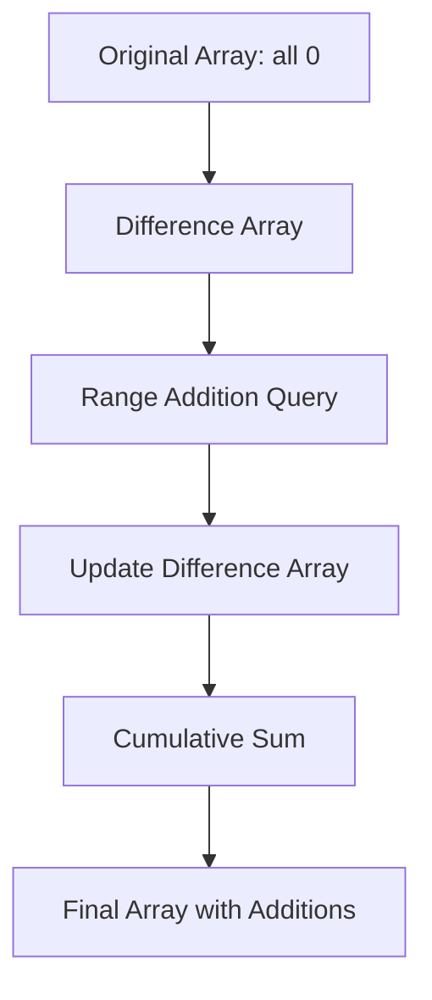
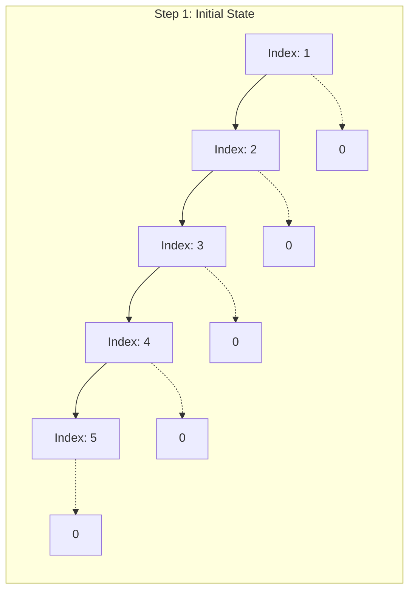
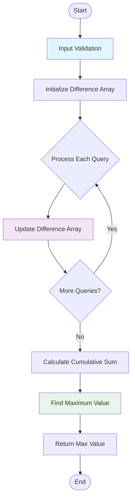

# いもす法による範囲加算処理

## 概要

このモジュールは**いもす法（IMOS 法）**を使用して、複数の範囲に対する加算処理を効率的に実行し、最終的な配列の最大値を求めるアルゴリズムを実装しています。

## アルゴリズムの特徴

- **時間計算量**: O(N+Q)
- **空間計算量**: O(N)
- **用途**: 範囲加算クエリの効率的な処理

## 問題設定

N 個のマス（初期値は全て 0）に対して、Q 個のクエリで範囲[L, R]に+1 を加算し、最終的な配列の最大値を求める問題を解決します。

## いもす法の仕組み

### 基本原理

いもす法は、範囲加算を差分配列を使って効率的に処理する手法です。



### 処理の流れ

1. **差分配列の初期化**
    - サイズ N+2 の差分配列 `diff` を 0 で初期化

2. **範囲加算の記録**
    - 範囲 [L, R] に +1 を加算する場合：
        - `diff[L] += 1`（範囲開始点で+1）
        - `diff[R+1] -= 1`（範囲終了点の次で-1）

3. **累積和による復元**
    - 差分配列から累積和を計算して元の配列を復元

### 具体例による説明

#### 例：N=5, クエリ [2,4] と [1,3] を処理



**クエリ 1: [2,4] に +1**

- diff[2] += 1
- diff[5] -= 1

**クエリ 2: [1,3] に +1**

- diff[1] += 1
- diff[4] -= 1

**差分配列の状態:**

```text
Index: 0  1  2  3  4  5  6
diff:  0  1  1  0 -1 -1  0
```

**累積和による復元:**

```text
Index: 1  2  3  4  5
Value: 1  2  2  1  0
```

## コードの詳細解析

### 入力検証フェーズ

```javascript
// 型チェック
if (typeof input !== 'string') {
    throw new TypeError('input must be a string');
}

// 制約チェック
if (!(1 <= N && N <= 1000)) {
    throw new RangeError('N out of range');
}
```

### 差分配列による範囲更新

```javascript
const diff = new Array(N + 2).fill(0);

for (let i = 1; i <= Q; i++) {
    // 範囲 [L, R] に +1 を加算
    diff[L] += 1; // 開始点で+1
    diff[R + 1] -= 1; // 終了点の次で-1
}
```

### 累積和と最大値の計算

```javascript
let maxVal = -Infinity;
let current = 0;

for (let i = 1; i <= N; i++) {
    current += diff[i]; // 累積和
    if (current > maxVal) {
        maxVal = current; // 最大値更新
    }
}
```

## 処理フローチャート



## 使用例

### 基本的な使用方法

```javascript
const { imosMethod } = require('./imos-method');

const input = `5 2
2 4
1 3`;

const result = imosMethod(input);
console.log(result); // 出力: 2
```

### 入力形式

```text
N Q
L1 R1
L2 R2
...
LQ RQ
```

- N: マスの数 (1 ≤ N ≤ 1000)
- Q: クエリの数 (1 ≤ Q ≤ 1000)
- Li, Ri: i 番目のクエリの範囲 (1 ≤ Li ≤ Ri ≤ N)

## エラーハンドリング

### 主なエラータイプ

1. **TypeError**:
    - 入力が文字列でない
    - N, Q が整数でない
    - クエリ行が不足

2. **RangeError**:
    - N, Q が制約範囲外
    - L, R の範囲が無効

### エラーメッセージ例

```javascript
// 制約違反の例
throw new RangeError('N out of range');
throw new RangeError(`Invalid range: [${L},${R}]`);
```

## パフォーマンス分析

### 従来の方法との比較

| 手法         | 時間計算量 | 空間計算量 | 特徴                     |
| ------------ | ---------- | ---------- | ------------------------ |
| 素朴な方法   | O(N×Q)     | O(N)       | 各クエリで範囲を直接更新 |
| **いもす法** | **O(N+Q)** | **O(N)**   | **差分配列で高速化**     |

### メモリ使用量

- 差分配列: N+2 個の整数
- 追加変数: 定数個

## テスト例

### テストケース 1

```text
入力:
3 2
1 2
2 3

期待される出力: 2
```

### テストケース 2

```text
入力:
5 3
1 3
2 4
3 5

期待される出力: 3
```

## 実装のポイント

1. **境界処理**: 配列サイズを N+2 として範囲外アクセスを防止
2. **効率性**: 1 回の累積和計算で全ての範囲加算を処理
3. **堅牢性**: 包括的な入力検証とエラーハンドリング

## 主な特徴

1. **アルゴリズムの可視化**: Mermaid ダイアグラムで処理フローと概念図を表示
2. **具体例による説明**: 実際の数値を使った step-by-step の解説
3. **コード解析**: 各処理段階の詳細な説明
4. **パフォーマンス分析**: 時間・空間計算量の説明と従来手法との比較
5. **エラーハンドリング**: 包括的なエラー処理の説明
6. **使用例とテストケース**: 実用的な例とテスト方法

## 技術的なポイント

- **Mermaid ダイアグラム**: 日本語エラーを避けるため、ノードのラベルは英語で記述
- **差分配列の仕組み**: 視覚的に理解しやすい図解
- **計算量の明確化**: O(N+Q)の効率性を強調
- **実装の詳細**: 境界処理やメモリ効率性についても言及

この解説により、いもす法の概念から実装まで、GitHub 利用者が理解しやすい形で説明されています。
