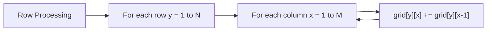
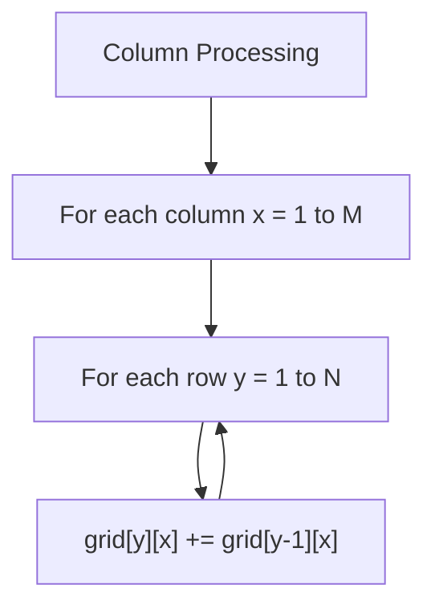
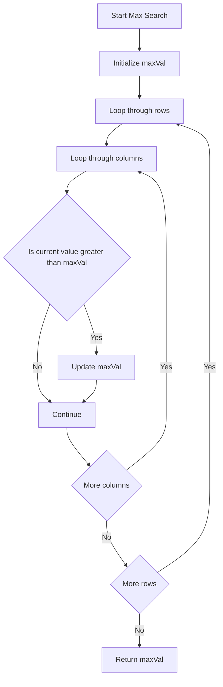

# 主な特徴

1. **視覚的な説明**: 各処理段階での配列の状態を具体的な数値例で示しています
2. **Mermaid フローチャート**: 処理の流れを図で表現（英語表記でエラーを回避）
3. **段階的解説**: いもす法の各ステップを詳細に説明
4. **計算量分析**: 時間・空間計算量の明確な表示
5. **実装のポイント**: エラーハンドリングや番兵の使用理由

## 技術的なポイント

- **差分配列**: 4 つの角への操作で長方形全体を効率的に更新
- **2 段階累積和**: 横 → 縦の順序での累積和計算
- **番兵の活用**: 境界チェックの簡素化
- **エラーハンドリング**: 堅牢な入力検証

**Before:**

```text
0 0 0 0 0 0
0 0 0 0 0 0
0 0 0 0 0 0
0 0 0 0 0 0
0 0 0 0 0 0
```

**After difference operations:**

```text
0  0   0  0   0  0
0 +1   0  0  -1  0
0  0   0  0   0  0
0  0   0  0   0  0
0 -1   0  0  +1  0
```

### 3. 横方向累積和の計算

各行において、左から右へ累積和を計算します。



**横方向累積和後：**

```text
0  0  0  0  0  0
0 +1 +1 +1  0  0
0  0  0  0  0  0
0  0  0  0  0  0
0 -1 -1 -1  0  0
```

### 4. 縦方向累積和の計算

各列において、上から下へ累積和を計算します。



**縦方向累積和後（最終結果）：**

```text
0  0  0  0  0  0
0  1  1  1  0  0
0  1  1  1  0  0
0  1  1  1  0  0
0  0  0  0  0  0
```

### 5. 最大値の探索

最終的なグリッドから最大値を見つけます。



## 計算量分析

- **時間計算量**: O(N×M + K)
    - 差分配列構築: O(K)
    - 累積和計算: O(N×M)
    - 最大値探索: O(N×M)

- **空間計算量**: O(N×M)
    - グリッド配列のサイズ

## アルゴリズムの利点

1. **効率性**: 各長方形の追加が O(1)で実行可能
2. **シンプル性**: 実装が分かりやすい
3. **拡張性**: 3 次元以上への拡張も可能

## 実装のポイント

### エラーハンドリング

- 入力形式の検証
- 数値型の検証
- 制約範囲の検証

### 番兵の使用

配列サイズを `(N+2) × (M+2)` とすることで、境界チェックを簡素化しています。

```javascript
const grid = Array.from({ length: N + 2 }, () => Array(M + 2).fill(0));
```

## 使用例

```bash
# 入力例
3 4 2
2 1 4 2
1 2 3 4

# 出力: 2
```

この例では、2 つの長方形が重なる領域で最大値 2 が得られます。
