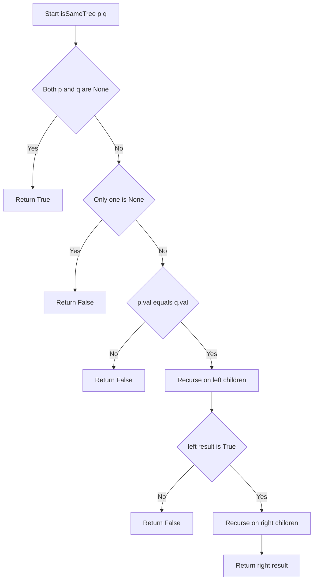
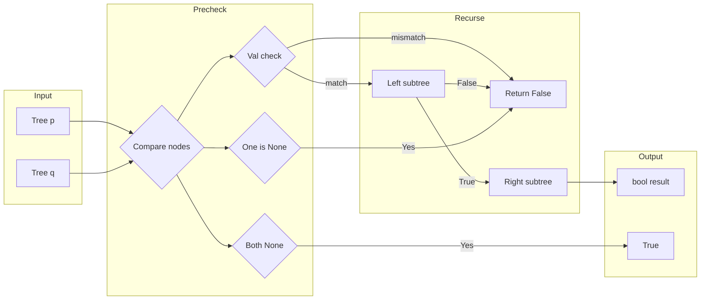

# Same Tree — 2つの二分木が同一かを再帰DFSで判定する

---

## 目次（Table of Contents）

- [概要](#overview)
- [アルゴリズム要点（TL;DR）](#tldr)
- [図解](#figures)
- [正しさのスケッチ](#correctness)
- [計算量](#complexity)
- [Python 実装](#impl)
- [CPython 最適化ポイント](#cpython)
- [エッジケースと検証観点](#edgecases)
- [FAQ](#faq)

---

<h2 id="overview">概要</h2>

> 💡 **初学者向け補足**：この問題を一言で言うと、「2本の木（ツリー）が、形も値もまったく同じかどうかを確認する問題」です。

### 問題の要約

LeetCode 100「Same Tree」は、2つの二分木（＝各ノードが高々2つの子を持つ木構造）`p` と `q` を受け取り、その2つが**構造的にも値的にも完全に一致するか**を判定する問題です。

**なぜこの問題が面白いのか**：木構造は「自分の中に同じ形の小さな構造を持つ」という**再帰的な性質**を持っています。`p` と `q` が同じ木かどうかを調べるには、「根の値が同じか」を確認した後に「左の子木が同じか」と「右の子木が同じか」を再び同じ手順で確認すればよいのです。この「同じ問題を小さくして繰り返す」という構造こそが再帰の本質です。

### 入出力仕様

| 引数   | 型                   | 説明                                       |
| ------ | -------------------- | ------------------------------------------ |
| `p`    | `Optional[TreeNode]` | 比較元の木のルートノード（または `None`）  |
| `q`    | `Optional[TreeNode]` | 比較先の木のルートノード（または `None`）  |
| 戻り値 | `bool`               | 2つの木が同一なら `True`、異なれば `False` |

### 制約

- 両方の木のノード数は `0` 以上 `100` 以下
- `-10^4 <= Node.val <= 10^4`

### 代表例

```
例1: p = [1,2,3]  q = [1,2,3]  → True
       1               1
      / \             / \
     2   3           2   3

例2: p = [1,2]    q = [1,null,2]  → False
       1               1
      /                 \
     2                   2

例3: p = [1,2,1]  q = [1,1,2]  → False
       1               1
      / \             / \
     2   1           1   2
```

> 📖 **この章で登場した用語**
>
> - **二分木（Binary Tree）**：各ノードが高々2つの子（左・右）を持つ木構造のこと
> - **ルートノード**：木の最上部にある「根」のノード。ここから全ての子ノードにたどり着ける
> - **再帰（Recursion）**：関数が自分自身を呼び出す仕組み。「木の比較」のように同じ構造が繰り返される問題に適している
> - **制約**：入力として与えられる値の範囲や条件のこと。制約から「どのくらいの計算量まで許容されるか」を逆算できる

---

<h2 id="tldr">アルゴリズム要点（TL;DR）</h2>

> 💡 **初学者向け補足**：TL;DR（Too Long; Didn't Read）とは「長くて読めない人向けの要約」という意味です。ここではアルゴリズム全体の戦略を箇条書きでまとめます。詳細は後の章で説明するので、**「なんとなくこういう手順で解くんだな」というイメージを掴む章**として位置づけてください。

- **手法**：再帰 DFS（深さ優先探索）
  → 問題の定義「p と q が同じ ⟺ 根の値が同じ かつ 左の子木が同じ かつ 右の子木が同じ」がそのまま再帰のコードになるため、最もシンプルで直感的

- **データ構造**：追加のデータ構造は不要
  → 再帰コールスタック（関数呼び出しの積み重ね）のみを使用。`deque` や `list` は必要ない

- **終了条件（基底条件）**：両方が `None` になった時点で `True` を返す
  → 葉ノード（子を持たないノード）のさらに下は必ず `None` なので、ここが再帰の底になる

- **早期終了**：片方だけ `None` または値が違う時点で `False` を即座に返す
  → Python の `and` の短絡評価（＝左辺が `False` なら右辺を評価しない仕組み）を活用し、不要な探索を省く

- **時間計算量**：O(n)（n = 総ノード数）
  → 全ノードを最大1回しか訪問しないため

- **空間計算量**：O(h)（h = 木の高さ）
  → 再帰の深さ = 木の高さ分だけコールスタックを消費。平均 O(log n)、最悪 O(n)

> 📖 **この章で登場した用語**
>
> - **TL;DR**：「長くて読めない人向けの要約」を意味する略語
> - **DFS（深さ優先探索）**：木やグラフを「根から葉まで深く潜ってから戻る」順番で探索する手法
> - **基底条件**：再帰の終了条件。これがないと関数が無限に自分自身を呼び続けてしまう
> - **コールスタック**：関数呼び出しの履歴を積み上げるメモリ領域。再帰が深くなるほど消費量が増える
> - **短絡評価**：`A and B` の A が `False` なら B を評価しない・`A or B` の A が `True` なら B を評価しない仕組み

---

<h2 id="figures">図解</h2>

> 💡 **初学者向け補足**：Mermaid フローチャートの基本的な読み方を説明します。
>
> - **長方形（`[]`）**：処理のステップを表します
> - **ひし形（`{}`）**：条件分岐を表します。`Yes` か `No` かで矢印の向きが変わります
> - **矢印（`-->`）**：処理の流れを表します

---

### フローチャート

この図は `isSameTree(p, q)` 関数が1回の呼び出しでどのように処理を進めるかを表しています。上から下へ読み進めてください。再帰呼び出しは `Recurse` ノードが自分自身を再び呼び出すことを表します。



主要なノードの意味：

- `Start`：関数の入り口。`p` と `q` を受け取る
- `BothNone`：両方が `None` かどうかを判定するひし形（条件分岐）
- `OnlyOne`：どちらか一方だけが `None` かを判定する（片方だけ None = 構造が違う）
- `ValCheck`：2つのノードの値 `p.val` と `q.val` が等しいかを判定する
- `RecurLeft / RecurRight`：左・右の子ノードに対して同じ処理を再帰的に繰り返す
- `RetTrue / RetFalse1〜3`：それぞれの条件で確定した結果を返す

---

### データフロー図

この図は、入力の2本の木がどのような順序でノードを比較されていくかのデータの流れを表しています。



主要な流れの説明：

- `Tree p → Compare nodes`：p と q のノードを同時に比較ステージへ送る
- `Both None → True`：両方が `None` の場合は即座に `True`
- `One is None → False`：片方だけ `None` の場合は即座に `False`
- `Val check → Left subtree → Right subtree`：値が一致したら左・右の子木を順に比較する

---

> 💡 **代表例でのトレース**：`p=[1,2,3]` と `q=[1,2,3]`（例1）を入力として、フローチャートの各ノードを通過する様子を追います。

```
Step 1: isSameTree(Node(1), Node(1))
  → BothNone? No（両方非 None）
  → OnlyOne?  No（どちらも非 None）
  → ValCheck? 1 == 1 → Yes
  → RecurLeft: isSameTree(Node(2), Node(2)) を呼び出す

Step 2: isSameTree(Node(2), Node(2))
  → ValCheck? 2 == 2 → Yes
  → RecurLeft: isSameTree(None, None) を呼び出す

Step 3: isSameTree(None, None)
  → BothNone? Yes → Return True ← 再帰の底（基底条件）

Step 4: Step2 に戻る
  → LeftOK = True → RecurRight: isSameTree(None, None)
  → BothNone? Yes → Return True

Step 5: Step2 の結果 = True

Step 6: Step1 に戻る
  → LeftOK = True → RecurRight: isSameTree(Node(3), Node(3))
  → 同様に True

最終結果: True
```

> 📖 **この章で登場した用語**
>
> - **フローチャート**：処理の手順を図形と矢印で表したもの。ひし形=条件分岐、長方形=処理ステップ
> - **データフロー図**：データがどのように変換・移動するかを示す図
> - **サブグラフ**：フローチャートの中で関連する処理をグループ化したもの
> - **基底条件**：再帰の終了条件。`Both None → Return True` がここに相当する

---

<h2 id="correctness">正しさのスケッチ</h2>

> 💡 **初学者向け補足**：「正しさのスケッチ」とは、アルゴリズムが**常に正しい答えを返すことの根拠**を整理したものです。数学的な厳密な証明ではなく「なぜ正しいと言えるか」の説明です。

### 1. 基底条件（再帰の終わり）

**条件**：`p is None and q is None` のとき `True` を返す
**根拠**：両方が `None` ということは「どちらにも子が存在しない」ことを意味します。構造的に同じ「葉の先端」に到達したため、`True` を返すのは正しい判断です。
**具体例**：`p=[1]` と `q=[1]` の場合、ルートの比較後に `isSameTree(None, None)` が呼ばれ `True` が返ります。これは「どちらも子がない = 同じ構造」を正しく表しています。

### 2. 不変条件（処理中ずっと成り立つ条件）

**条件**：「`isSameTree(p, q)` が `True` を返す ⟺ p を根とする部分木と q を根とする部分木が完全に一致する」
**根拠**：この条件は再帰の各段階で維持されます。

- 根の値が一致し、左の子木が一致し、右の子木が一致する場合のみ `True`
- 一つでも不一致があれば `False`

どの段階でも「この時点で確認できた範囲では一致している」という状態を保ちながら再帰が進むため、不変条件は常に成立しています。

### 3. 網羅性（すべてのケースを処理しているか）

`(p, q)` の組み合わせは以下の4通りしかなく、すべてを処理しています：

| p の状態  | q の状態  | 処理                |
| --------- | --------- | ------------------- |
| `None`    | `None`    | `True`（基底条件）  |
| `None`    | 非 `None` | `False`（構造違い） |
| 非 `None` | `None`    | `False`（構造違い） |
| 非 `None` | 非 `None` | 値比較 → 再帰       |

`if p is None and q is None` → `if p is None or q is None` の順で判定することで、2番目と3番目のケースをまとめて処理しています（1番目でリターン済みなので、`or` の条件に来た時点で必ず「どちらか一方だけ `None`」です）。

### 4. 終了性（有限ステップで終わるか）

各再帰呼び出しでは必ず「子ノード」に向かって進みます。木のノード数は有限（制約より最大100）なので、必ず `None` に到達して再帰が終了します。無限ループは発生しません。

> 📖 **この章で登場した用語**
>
> - **不変条件**：アルゴリズムが正しく動くために、処理中ずっと成り立ち続けるべき条件
> - **基底条件**：再帰の終了条件。これがないと関数が無限に自分自身を呼び続けてしまう
> - **終了性**：アルゴリズムが必ず有限ステップで終わるという保証
> - **網羅性**：すべてのケースをもれなく処理できているという保証
> - **部分木（サブツリー）**：ある木の中の特定のノードを根として切り出した、より小さな木

---

<h2 id="complexity">計算量</h2>

> 💡 **初学者向け補足**：計算量とは「入力が大きくなるにつれて、処理にかかる時間・メモリがどう増えるか」の目安です。

| 記法       | 意味                   | 直感的なイメージ               |
| ---------- | ---------------------- | ------------------------------ |
| `O(1)`     | 入力サイズによらず一定 | 辞書で直接ページを開く         |
| `O(n)`     | 入力に比例して増加     | リストを端から順に読む         |
| `O(log n)` | 入力の桁数に比例       | 辞書を二分探索で引く           |
| `O(h)`     | 木の高さに比例         | 木の根から葉まで降りていく深さ |

---

### 時間計算量：O(n)

- n = 2つの木の総ノード数
- すべてのノードを**最大1回**しか訪問しない
- 各ノードでの処理（`None` チェック・値比較）は O(1) のため、全体で O(n)
- **早期終了**が発生する場合は O(n) より少ないステップで終わる

### 空間計算量：O(h)

- h = 木の高さ（再帰コールスタックの深さ）
- 再帰呼び出しが積み重なるコールスタックが唯一の追加メモリ

| 木の形                         | 高さ h   | 空間計算量     |
| ------------------------------ | -------- | -------------- |
| 平衡二分木（バランスが良い木） | log₂ n   | O(log n)       |
| 一本道（最悪ケース）           | n        | O(n)           |
| 本問題（ノード数 &le; 100）    | 最大 100 | 実用上問題なし |

### 他のアプローチとの比較

| アプローチ           | 時間計算量 | 空間計算量 | 備考                                   |
| -------------------- | ---------- | ---------- | -------------------------------------- |
| **再帰 DFS**（採用） | O(n)       | O(h)       | コードが最もシンプル                   |
| 反復 DFS（スタック） | O(n)       | O(h)       | `list` をスタック代わりに使用          |
| 反復 BFS（キュー）   | O(n)       | O(n)       | 常に O(n) メモリを消費、`deque` が必要 |

> 📖 **この章で登場した用語**
>
> - **時間計算量**：入力の大きさに対して処理にかかる手間がどう増えるかの目安
> - **空間計算量**：処理中に使うメモリ量がどう増えるかの目安
> - **平衡二分木**：左右の子木の高さの差が小さい、バランスの取れた二分木。高さが O(log n) になる
> - **早期終了**：不一致が見つかった時点で以降の処理を打ち切ること。最悪ケースの計算量は変わらないが、平均的には高速になる

---

<h2 id="impl">Python 実装</h2>

> 💡 **初学者向け補足**：コードを読む前に、実装の全体的な骨格を確認しましょう。
>
> 1. `Optional["TreeNode"]` 型ヒントで「TreeNode か None のどちらか」を表現する
> 2. `if p is None and q is None:` で基底条件（両方 None）を最初に処理する
> 3. `if p is None or q is None:` で「片方だけ None」の構造違いを処理する
> 4. `p.val != q.val` で値の違いを確認する
> 5. `isSameTree(p.left, q.left) and isSameTree(p.right, q.right)` で左右の子木を再帰的に比較する

---

### 関数シグネチャ（LeetCode 形式）

```python
class Solution(object):
    def isSameTree(self, p, q):
        # :type p: Optional[TreeNode]
        # :type q: Optional[TreeNode]
        # :rtype: bool
```

---

### 完全な実装コード

```python
from __future__ import annotations

# TYPE_CHECKING は「型チェック時（pylance 動作時）のみ True になるフラグ」。
# 実行時には False になるため、TreeNode の定義がなくてもエラーにならない。
from typing import TYPE_CHECKING, Optional

if TYPE_CHECKING:
    # pylance が TreeNode の型情報を正しく解析するためのスタブ定義。
    # LeetCode の実行環境では TreeNode はすでに定義済みなので、
    # ここでは型チェック専用として宣言している。
    class TreeNode:
        val: int
        left: Optional[TreeNode]
        right: Optional[TreeNode]

        def __init__(
            self,
            val: int = 0,
            left: Optional[TreeNode] = None,
            right: Optional[TreeNode] = None,
        ) -> None: ...


class Solution:
    def isSameTree(
        self,
        p: Optional["TreeNode"],
        q: Optional["TreeNode"],
    ) -> bool:
        """
        2つの二分木が構造・値ともに完全に一致するかを再帰DFSで判定する。

        「p と q が同じ木」は以下の3条件すべてが成立するときに限る：
          1. p.val == q.val  （根の値が同じ）
          2. isSameTree(p.left, q.left) が True  （左の子木が同じ）
          3. isSameTree(p.right, q.right) が True  （右の子木が同じ）
        この定義を再帰でそのままコードにしている。

        Time:  O(n)  n = 総ノード数
        Space: O(h)  h = 木の高さ（コールスタックの深さ）
        """

        # ── ① 両方 None のとき ──────────────────────────────────
        # 葉ノードのさらに下（= 何もない場所）に到達した。
        # 「両方に何もない」= 構造が一致しているので True を返す。
        # `is None` を使うのが Pythonic（Pythonらしい書き方）。
        # `== None` は非推奨で pylance も警告を出す。
        if p is None and q is None:
            return True

        # ── ② 片方だけ None のとき ──────────────────────────────
        # ①で「両方 None」は return 済みなので、ここに来るのは
        # 「どちらか一方だけ None」の場合のみ。
        # 片方にノードがあり、片方にない = 構造が違う → False。
        if p is None or q is None:
            return False

        # ── ③ 値の比較 ───────────────────────────────────────────
        # ①②を通過した時点で p も q も None ではないことが確定。
        # pylance もここでは p・q を TreeNode として認識する
        # （型の絞り込み = Type Narrowing と呼ばれる仕組み）。
        # 値が違えば木の内容が異なるので False を返す。
        if p.val != q.val:
            return False

        # ── ④ 左右の子木を再帰で比較 ────────────────────────────
        # 根の値が一致したので、次は左の子木・右の子木を再帰で確認する。
        # `and` の短絡評価により、左が False なら右の再帰は実行されない。
        # → 不一致が見つかった時点で即座に False を返せる（無駄な探索を省く）。
        return (
            self.isSameTree(p.left, q.left)
            and self.isSameTree(p.right, q.right)
        )
```

---

> 💡 **コードの動作トレース**（例2: `p=[1,2]`、`q=[1,null,2]`）
>
> ```
> 呼び出し①: isSameTree(p=Node(val=1, left=Node(2), right=None),
>                        q=Node(val=1, left=None, right=Node(2)))
>   → ① p,q ともに非 None → パス
>   → ② どちらも非 None → パス
>   → ③ p.val=1, q.val=1 → 1 == 1 → パス
>   → ④ 左の子木を比較するために再帰へ
>
> 呼び出し②: isSameTree(p=Node(val=2), q=None)
>   → ① p は非 None → パス
>   → ② p は非 None だが q は None → return False ← ここで終了！
>
> 呼び出し①に戻る:
>   → isSameTree(p.left, q.left) = False
>   → and の短絡評価: False and ... → 右辺の再帰は実行されない
>   → return False
>
> 全体の結果: False
> ```

---

> 📖 **この章で登場した用語**
>
> - **`Optional["TreeNode"]`**：`TreeNode` または `None` のどちらかであることを表す型ヒント。`"TreeNode"` と文字列にするのは「前方参照」と呼ばれ、クラス定義より前に型名を使うための書き方
> - **型の絞り込み（Type Narrowing）**：`if p is None: return` の後では pylance が「p は None でない」と自動的に判断してくれる仕組み
> - **短絡評価**：`A and B` の A が `False` なら B を評価しない仕組み。不要な再帰呼び出しを省ける
> - **`TYPE_CHECKING`**：`typing` モジュールに含まれるフラグ。型チェック時のみ `True` になり、実行時には `False` になる
> - **Pythonic**：Pythonらしい、慣用的な書き方のこと。`is None` は `== None` よりも意図が明確でPythonicとされる

---

<h2 id="cpython">CPython 最適化ポイント</h2>

> 💡 **初学者向け補足**：この章では「同じ処理でもPythonの書き方によって速さが変わる理由」を説明します。本問題は制約がノード数 &le; 100 と小さいため、最適化の効果は小さいですが、考え方として知っておくと他の問題でも役立ちます。

---

### ポイント① `is None` vs `== None`

CPython の内部では `None` はシングルトン（＝プログラム全体で1つしか存在しないオブジェクト）です。

```python
# 最適化前（非推奨）
if p == None:  # __eq__ メソッドを呼び出すため、わずかに遅い
    return True

# 最適化後（推奨）
if p is None:  # オブジェクトのIDを比較するだけ。最速かつ pylance 警告なし
    return True

# 理由：`is` はオブジェクトのメモリアドレスを直接比較する。
#       `==` はオブジェクトの __eq__ メソッドを呼び出すため、わずかにオーバーヘッドがある。
#       None に対しては `is` を使うのが Python の慣習。
```

---

### ポイント② `and` の短絡評価を活用した早期終了

```python
# 最適化前：左の結果を変数に格納してから and で結合
left_result = self.isSameTree(p.left, q.left)
right_result = self.isSameTree(p.right, q.right)
return left_result and right_result
# 問題点：left_result が False でも right_result の再帰が実行されてしまう

# 最適化後：and の短絡評価に任せる
return (
    self.isSameTree(p.left, q.left)
    and self.isSameTree(p.right, q.right)
)
# 理由：左の再帰が False を返した瞬間、右の再帰は実行されない。
#       不一致が見つかった時点で探索を打ち切れる。
```

---

### ポイント③ 早期 return によるネストの削減

```python
# 最適化前：深いネストで可読性が低い
def isSameTree(self, p, q):
    if p is not None or q is not None:
        if p is not None and q is not None:
            if p.val == q.val:
                return (self.isSameTree(p.left, q.left)
                        and self.isSameTree(p.right, q.right))
    return p is None and q is None

# 最適化後：早期 return でネストを浅く保つ
def isSameTree(self, p, q):
    if p is None and q is None:
        return True            # ← 確定した時点で即 return
    if p is None or q is None:
        return False           # ← 確定した時点で即 return
    if p.val != q.val:
        return False           # ← 確定した時点で即 return
    return (self.isSameTree(p.left, q.left)
            and self.isSameTree(p.right, q.right))

# 理由：早期 return によりインデントが深くならず、後続のコードで
#       「ここに来た時点でこの条件は成立している」という前提が明確になる。
```

---

### ポイント④ 本問題でメモ化（`lru_cache`）が使えない理由

```python
# 使えない理由：TreeNode は mutable（変更可能）なオブジェクトのため、
#               ハッシュ値を持たない（hashable でない）。
# lru_cache はハッシュ値でキャッシュを管理するため、
# hashable でない引数を持つ関数には使えない。
#
# もし仮に使えたとしても、この問題では同じ (p, q) の組み合わせが
# 再度呼ばれることはないため、メモ化の効果はゼロ。
```

> 📖 **この章で登場した用語**
>
> - **シングルトン**：プログラム全体で1つしか存在しないオブジェクト。`None`、`True`、`False` が該当する
> - **短絡評価**：`A and B` の A が `False` なら B を評価しない仕組み
> - **早期 return**：関数の先頭で確定したケースを先に返すことで、以降のコードをシンプルに保つテクニック
> - **`lru_cache`**：関数の結果をキャッシュするデコレータ。引数が同じなら計算をスキップしてキャッシュを返す
> - **hashable（ハッシュ可能）**：ハッシュ値（= 値を整数に変換したもの）を持つオブジェクトのこと。辞書のキーや `lru_cache` の引数に使える条件

---

<h2 id="edgecases">エッジケースと検証観点</h2>

> 💡 **初学者向け補足**：エッジケースとは「入力が空・最小値・最大値・特殊な形」など、通常とは異なる境界的な入力のことです。エッジケースを見落とすと、普通のテストは通るのに特定の入力でだけバグが発生します。本問題で想定されるエッジケースをすべて確認しましょう。

| ケース             | p               | q            | 期待出力 | なぜ重要か                                                                        |
| ------------------ | --------------- | ------------ | -------- | --------------------------------------------------------------------------------- |
| 両方空             | `None`          | `None`       | `True`   | 基底条件が正しく `True` を返すかの確認                                            |
| p だけ空           | `None`          | `[1]`        | `False`  | 「片方だけ None」の処理が抜けていると誤って比較しようとして AttributeError が出る |
| q だけ空           | `[1]`           | `None`       | `False`  | 上記と対称。`or` 条件で両方まとめて処理する                                       |
| 1ノードのみ・同値  | `[1]`           | `[1]`        | `True`   | 子なしの最小ケース。再帰が正しく終了するかの確認                                  |
| 1ノードのみ・異値  | `[1]`           | `[2]`        | `False`  | 根の値比較だけで即 `False` になるかの確認                                         |
| 構造同一・値同一   | `[1,2,3]`       | `[1,2,3]`    | `True`   | 通常の正常系                                                                      |
| 構造異なる（左右） | `[1,2]`         | `[1,null,2]` | `False`  | ノード数が同じでも位置が違うケース                                                |
| 値だけ異なる       | `[1,2,1]`       | `[1,1,2]`    | `False`  | 構造は同一だが左右の値が反転しているケース                                        |
| 最大深さ（一本道） | 100ノードの直列 | 同上         | `True`   | 再帰深度 100 でスタックオーバーフローしないかの確認                               |
| 負の値を含む       | `[-10000]`      | `[-10000]`   | `True`   | 制約の下限値（`-10^4`）が正しく比較されるかの確認                                 |

### 特に注意すべきケース

**「片方だけ None」の見落とし**が最もよくあるバグです。以下のような実装ミスに注意してください。

```python
# ❌ 誤った実装例：None チェックが不完全
def isSameTree(self, p, q):
    if p is None and q is None:
        return True
    # ここで p か q が None のまま p.val にアクセスすると
    # AttributeError: 'NoneType' object has no attribute 'val
    if p.val != q.val:  # ← p が None のとき AttributeError が発生！
        return False
    return (self.isSameTree(p.left, q.left)
            and self.isSameTree(p.right, q.right))

# ✅ 正しい実装：片方だけ None のケースを先に排除する
def isSameTree(self, p, q):
    if p is None and q is None:
        return True
    if p is None or q is None:   # ← これを追加することで安全になる
        return False
    if p.val != q.val:
        return False
    ...
```

> 📖 **この章で登場した用語**
>
> - **エッジケース**：空のツリー・ノード1つ・最大深さなど、境界的な条件の入力
> - **境界値**：制約の上限・下限にあたる値。例：ノード数 0（= None）や最大 100 ノード
> - **AttributeError**：存在しない属性にアクセスしようとしたときのエラー。`None.val` のような操作で発生する
> - **スタックオーバーフロー**：再帰が深くなりすぎてコールスタックがメモリを使い果たすエラー。CPython は `RecursionError` を発生させる

---

<h2 id="faq">FAQ</h2>

> 💡 **初学者向け補足**：FAQは「初学者がつまずきやすいポイント」を想定した質問と回答です。「結論 → 理由 → 補足」の順で説明します。

---

**Q1. なぜ `if p is None or q is None` を `if p is None and q is None` の後に書くのか？**

**結論**：順番を守らないと「両方 None」のケースも `False` を返してしまうからです。

**理由**：Python は `if` を上から順に評価します。`or` の条件を先に書くと、`p=None, q=None` のとき `p is None` が `True` になった瞬間に短絡評価が働き、`False` を返してしまいます。

**補足（具体例）**：

```python
# ❌ 順番を間違えた例
if p is None or q is None:  # p=None, q=None → p is None が True → False を返す（誤り！）
    return False
if p is None and q is None:  # ここには到達しない
    return True

# ✅ 正しい順番
if p is None and q is None:  # まず「両方 None」を先に確認
    return True
if p is None or q is None:   # 次に「片方だけ None」を確認
    return False
```

---

**Q2. なぜ BFS（幅優先探索）ではなく再帰 DFS（深さ優先探索）を使うのか？**

**結論**：この問題の構造が再帰と完全に一致しているため、再帰が最もシンプルで可読性が高いからです。

**理由**：「2つの木が同じかどうか」の定義が「根の値が同じ かつ 左の子木が同じ かつ 右の子木が同じ」という再帰的な構造になっています。この定義をそのままコードにしたのが再帰DFSです。BFS を使うと `deque` の管理が必要になり、コードが複雑になります。

**補足**：計算量は BFS も再帰 DFS も O(n) で同じです。ノード数が最大 100 という制約下では速度差もありません。コードの明瞭さを優先した選択です。

---

**Q3. 再帰でスタックオーバーフローにならないのか？**

**結論**：この問題の制約（ノード数 &le; 100）では問題ありません。

**理由**：CPython のデフォルトの再帰深度制限は 1000 です。本問題では木の高さが最大 100 なので、再帰の深さは 100 を超えることがありません。

**補足**：もし制約が「ノード数 &le; 10^5」のような大きな値であれば、反復DFS（`list` をスタックとして使う実装）に切り替えることを検討します。

```python
import sys
# 万が一のための確認（今回は不要だが、大きな問題では念のため）
print(sys.getrecursionlimit())  # デフォルト: 1000
```

---

**Q4. `p.val` と `q.val` を比較する前に `None` チェックをしないと何が起こるか？**

**結論**：`AttributeError` が発生してプログラムがクラッシュします。

**理由**：`None` は Python の組み込み型 `NoneType` のオブジェクトです。`NoneType` には `val` という属性が存在しないため、`None.val` にアクセスすると `AttributeError: 'NoneType' object has no attribute 'val'` というエラーが発生します。

**補足**：TypeScriptや Rust ではコンパイル時にこのような null アクセスを防いでくれますが、Python では実行時まで検出できません。だからこそ `None` チェックを先に行うことが重要です。pylance を使うと静的解析で警告を出してくれます。

---

**Q5. `return self.isSameTree(p.left, q.left) and self.isSameTree(p.right, q.right)` の1行で書いても正しく動くか？**

**結論**：正しく動きます。さらに `and` の短絡評価のおかげで、不必要な再帰呼び出しを省けます。

**理由**：`and` は左辺が `False` の場合に右辺を評価しません。つまり左の子木の比較で `False` が返った瞬間、右の子木の比較は実行されません。これは「不一致が見つかった時点で探索を打ち切る」という効果を自動的に実現しています。

**補足**：

```python
# この1行は...
return self.isSameTree(p.left, q.left) and self.isSameTree(p.right, q.right)

# 以下と同じ意味（でも1行の方が簡潔）
left_same = self.isSameTree(p.left, q.left)
if not left_same:
    return False  # ← and の短絡評価がこれを自動でやってくれる
return self.isSameTree(p.right, q.right)
```

> 📖 **この章で登場した用語**
>
> - **FAQ**：Frequently Asked Questions の略。よくある質問と回答のこと
> - **短絡評価**：`A and B` の A が `False` なら B を評価しない仕組み
> - **AttributeError**：存在しない属性にアクセスしようとしたときのエラー
> - **スタックオーバーフロー**：再帰が深くなりすぎてメモリを使い果たすエラー。CPython では `RecursionError` として発生する
> - **静的解析**：プログラムを実行せずにコードを読むだけでバグや型エラーを検出する手法。pylance はこれを行うツール
