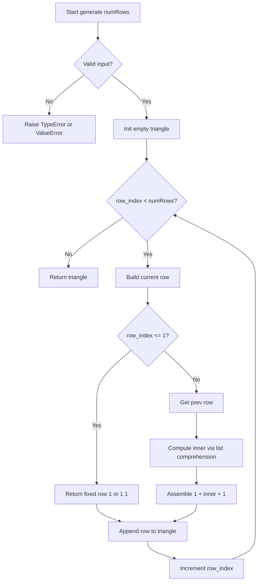

# Pascal's Triangle - 行を積み上げてパスカルの三角形を生成する

---

## 目次（Table of Contents）

- [概要](#overview)
- [アルゴリズム要点 TL;DR](#tldr)
- [図解](#figures)
- [正しさのスケッチ](#correctness)
- [計算量](#complexity)
- [Python 実装](#impl)
- [CPython 最適化ポイント](#cpython)
- [エッジケースと検証観点](#edgecases)
- [FAQ](#faq)

---

<h2 id="overview">概要</h2>

> 💡 **初学者向け補足**
> この問題は一言で言うと、**「三角形の形に並んだ数値の表を、上から1行ずつ積み上げて作る問題」** です。
> なぜ「積み上げ」かというと、各行の内側の値は **直上の左と右の値を足すだけ** で決まるからです。

### 問題の要件

与えられた整数 `numRows` に対して、パスカルの三角形の最初の `numRows` 行を返します。

```
行0：     [1]
行1：    [1, 1]
行2：   [1, 2, 1]
行3：  [1, 3, 3, 1]
行4： [1, 4, 6, 4, 1]
```

**ルールは 2 つだけ：**

1. 各行の **両端は必ず `1`**
2. 内側の要素は **真上の左と右の値を足した値**（例：行 2 の `2` = 行 1 の `1 + 1`）

**なぜこの問題が面白いのか：**
「前の行だけ見れば次の行を作れる」という局所的なルールが積み重なると、美しい三角形ができ上がります。
この「局所ルールの積み上げ」は、動的計画法（＝部分問題の答えを使って全体の答えを組み立てる手法）の入門として最適な題材です。

### 制約

| 項目             | 値                 |
| ---------------- | ------------------ |
| `numRows` の範囲 | `1 ≤ numRows ≤ 30` |
| 戻り値の型       | `list[list[int]]`  |

> 📖 **この章で登場した用語**
>
> - **制約**：入力として与えられる値の範囲や条件のこと。例：「numRows は 1 以上 30 以下」
> - **動的計画法**：問題を小さな部分問題に分割し、その結果を記録しながら全体の答えを組み立てる手法

---

<h2 id="tldr">アルゴリズム要点（TL;DR）</h2>

> 💡 **TL;DR とは**：Too Long; Didn't Read（長くて読めない人向けの要約）という意味です。
> ここでは「なんとなくこういう手順で解くんだな」というイメージを掴むことが目標です。
> 各ステップの詳細は後の章で説明します。

- **戦略**：`for` ループで行を 1 行ずつ積み上げる。前の行だけ参照すれば次の行が作れるので、余分な情報を保持する必要がない
- **データ構造**：`list[list[int]]`（整数のリストを要素とする 2 次元リスト）。インデックスアクセスが頻繁なため `deque` より `list` が適切
- **時間計算量**：O(n²)。全要素数が `1 + 2 + ... + n = n(n+1)/2` なので避けられない下限
- **空間計算量**：O(n²)。全行をメモリに保持して返すため
- **Python 最適化**：内側の要素はリスト内包表記（＝リストを 1 行で作る書き方）で一括生成。CPython のバイトコードレベルの最適化が効く

> 📖 **この章で登場した用語**
>
> - **TL;DR**：「長くて読めない人向けの要約」を意味する略語
> - **バイトコード**：Python のコードが実行される前に変換される中間形式。`for` ループより内包表記の方が、専用のバイトコード命令を使うため高速
> - **リスト内包表記**：`[式 for 変数 in イテラブル]` という形でリストを 1 行で作る書き方

---

<h2 id="figures">図解</h2>

> 💡 **Mermaid フローチャートの読み方**
>
> - **長方形 `[]`**：処理ステップ（何かをする）
> - **ひし形 `{}`**：条件分岐（Yes か No かで処理が分かれる）
> - **矢印 `-->`**：処理の流れの方向
>
> 上から下へ（または左から右へ）読み進めてください。

### フローチャート

この図は `generate(numRows)` 関数が内部でどのような手順を踏むかを表しています。
上から下へ読み進めることで、入力の検証から行の積み上げ、結果の返却までの流れが分かります。



**主要ノードの意味：**

- `Start`：`generate(numRows)` の呼び出し入口
- `Validate`（ひし形）：型チェックと範囲チェック。不正な入力をここで弾く
- `Init`：結果リストを `[]`（空リスト）で初期化する
- `Loop`（ひし形）：`row_index`（0 から開始）が `numRows` に達するまで繰り返す終了条件の判定
- `BuildRow`：`_build_row()` ヘルパーを呼び出す
- `IsSmall`（ひし形）：0 行目・1 行目は特殊処理（内側の要素がない）
- `Inner`：リスト内包表記で `prev[col-1] + prev[col]` を計算
- `Assemble`：`[1] + inner + [1]` で行を完成させる
- `Append`：完成した行を `triangle` に追加する

---

### データフロー図

この図は `numRows=5` のとき、各行のデータがどのように生成・蓄積されていくかを表しています。

```mermaid
graph LR
  subgraph Input
    A[numRows = 5]
  end
  subgraph Row0
    B[row0 = 1]
  end
  subgraph Row1
    C[row1 = 1 1]
  end
  subgraph Row2
    D[prev = 1 1]
    E[inner = 2]
    F[row2 = 1 2 1]
    D --> E
    E --> F
  end
  subgraph Row3
    G[prev = 1 2 1]
    H[inner = 3 3]
    I[row3 = 1 3 3 1]
    G --> H
    H --> I
  end
  subgraph Row4
    J[prev = 1 3 3 1]
    K[inner = 4 6 4]
    L[row4 = 1 4 6 4 1]
    J --> K
    K --> L
  end
  A --> B
  B --> C
  C --> D
  F --> G
  I --> J
  L --> M[Output triangle]
```



**主要な流れの説明：**

- `Input → Row0`：最初の行 `[1]` は空の `triangle` に対して `row_index=0` で生成される
- `Rowi → prev`：前の行がそのまま次の行の計算材料（`prev`）になる
- `prev → inner`：隣り合う要素の和を内包表記で一括計算
- `inner → rowi`：`[1] + inner + [1]` で両端を追加して行を完成させる

---

> 💡 **代表例でのトレース（`numRows = 5`）**

```
入力: numRows = 5

── 入力検証 ──
isinstance(5, bool) → False
isinstance(5, int)  → True
1 <= 5 <= 30        → 検証通過 ✅

── ループ ──

[row_index = 0]
  → row_index == 0 なので [1] を即返す
  triangle = [[1]]

[row_index = 1]
  → row_index == 1 なので [1, 1] を即返す
  triangle = [[1], [1,1]]

[row_index = 2]
  prev = [1, 1]
  inner: col=1 → prev[0]+prev[1] = 1+1 = 2
  inner = [2]
  row = [1] + [2] + [1] = [1, 2, 1]
  triangle = [[1],[1,1],[1,2,1]]

[row_index = 3]
  prev = [1, 2, 1]
  inner: col=1 → 1+2=3,  col=2 → 2+1=3
  inner = [3, 3]
  row = [1] + [3,3] + [1] = [1, 3, 3, 1]
  triangle = [[1],[1,1],[1,2,1],[1,3,3,1]]

[row_index = 4]
  prev = [1, 3, 3, 1]
  inner: col=1 → 1+3=4,  col=2 → 3+3=6,  col=3 → 3+1=4
  inner = [4, 6, 4]
  row = [1] + [4,6,4] + [1] = [1, 4, 6, 4, 1]
  triangle = [[1],[1,1],[1,2,1],[1,3,3,1],[1,4,6,4,1]]

出力: [[1],[1,1],[1,2,1],[1,3,3,1],[1,4,6,4,1]] ✅
```

> 📖 **この章で登場した用語**
>
> - **フローチャート**：処理の手順を図形と矢印で表したもの。ひし形=条件分岐、長方形=処理
> - **データフロー図**：データがどのように変換・移動するかを示す図
> - **サブグラフ**：フローチャートの中で関連する処理をグループ化した枠

---

<h2 id="correctness">正しさのスケッチ</h2>

> 💡 **初学者向け補足**
> 「正しさのスケッチ」とは、アルゴリズムが **常に正しい答えを返すことの根拠** を整理したものです。
> 数学的な厳密な証明ではなく、「なぜ正しいと言えるか」の説明です。

### 不変条件（＝アルゴリズムが正しく動くために、ループ中ずっと成り立ち続けるべき条件）

> ループの各イテレーション（＝繰り返しの 1 回分）の開始時点で、
> `triangle` には `row_index` 個の行が格納されており、それらはすべてパスカルの三角形のルールを満たしている。

- `row_index = 0` のとき：`triangle = [[1]]`。行 0 は定義上 `[1]` なので成立 ✅
- `row_index = k` で成立していると仮定すると：`_build_row` は `triangle[k-1]`（前行）から `prev[col-1] + prev[col]` を計算して行 `k` を正しく構築する。よって `row_index = k+1` でも成立 ✅

### 網羅性（＝すべてのケースをもれなく処理できているという保証）

- `row_index == 0`：`[1]` を返す。長さ 1 の行に内側の要素はなく、両端が `1` なのは定義通り
- `row_index == 1`：`[1, 1]` を返す。長さ 2 の行に内側の要素はなく、両端が `1` なのは定義通り
- `row_index >= 2`：`[1] + inner + [1]` で構築。`inner` は `prev[col-1] + prev[col]` のすべての `col` を計算するので抜け漏れなし

### 基底条件（＝再帰やループの終了条件）

- `row_index` は 0 始まりで `numRows` 未満の間だけ繰り返す
- 各行の長さは `row_index + 1` なので必ず正の値。無限ループにはならない

### 終了性（＝アルゴリズムが必ず有限ステップで終わるという保証）

- `numRows ≤ 30` かつ各行の構築は O(k) で完了するため、全体は必ず有限ステップで終了する

> 📖 **この章で登場した用語**
>
> - **不変条件**：アルゴリズムが正しく動くために、処理中ずっと成り立ち続けるべき条件。「ループ不変条件」とも呼ぶ
> - **網羅性**：すべてのケースをもれなく処理できているという保証
> - **終了性**：アルゴリズムが必ず有限ステップで終わるという保証
> - **イテレーション**：ループの 1 回分の繰り返し処理のこと

---

<h2 id="complexity">計算量</h2>

> 💡 **Big-O 記法の読み方**

| 記法         | 意味                   | 直感的なイメージ            |
| ------------ | ---------------------- | --------------------------- |
| `O(1)`       | 入力サイズによらず一定 | 辞書で直接ページを開く      |
| `O(n)`       | 入力に比例して増加     | リストを端から順に読む      |
| `O(n log n)` | n よりやや速く増加     | 辞書を二分探索で引く × n 回 |
| `O(n²)`      | 入力の 2 乗で増加      | 全ペアを総当たりで確認する  |

### この問題の計算量

| 種類           | 計算量 | 理由                                                     |
| -------------- | ------ | -------------------------------------------------------- |
| **時間計算量** | O(n²)  | 全要素数 = 1+2+…+n = n(n+1)/2。各要素を 1 度だけ計算する |
| **空間計算量** | O(n²)  | 生成した全行を `triangle` リストに保持して返すため       |

### なぜ O(n²) を下回れないのか

出力自体が `n(n+1)/2` 個の要素を持つため、それらを生成するだけで O(n²) の時間が必要です。
どんなに賢いアルゴリズムを使っても、この下限（＝どうしても避けられない計算量の最低ライン）は超えられません。

### Pure vs in-place の比較

| 方式                   | 空間計算量 | 説明                                                         |
| ---------------------- | ---------- | ------------------------------------------------------------ |
| **Pure（今回の実装）** | O(n²)      | 全行を新しいリストとして返す。元のデータを変更しない         |
| **in-place**           | -          | この問題は「全行を返す」のが仕様なので in-place の余地はない |

> 📖 **この章で登場した用語**
>
> - **時間計算量**：入力の大きさに対して処理にかかる手間がどう増えるかの目安
> - **空間計算量**：処理中に使うメモリ量がどう増えるかの目安
> - **下限**：どんなアルゴリズムを使っても越えられない計算量の最低ライン
> - **Pure**：入力を変更せず新しいデータを返す操作。副作用がなく安全

---

<h2 id="impl">Python 実装</h2>

> 💡 **実装の骨格（全体像の把握）**
> コードを読む前に、処理の流れを箇条書きで確認しましょう。
>
> 1. 入力 `numRows` の **型チェック**（`bool` と `int` の区別に注意）と **範囲チェック**（1〜30 以外を弾く）
> 2. 結果リスト `triangle` を空で用意する
> 3. `for` ループで `row_index = 0` から `numRows - 1` まで繰り返す
> 4. 各イテレーションで `_build_row()` を呼び、返ってきた行を `triangle` に追加する
> 5. `_build_row()` 内：0 行目・1 行目は固定値を返す。2 行目以降は `prev` を参照してリスト内包表記で計算する
> 6. ループ終了後に `triangle` を返す

```python
from __future__ import annotations

# TYPE_CHECKING はpylance（静的型チェッカー）が型情報を解析するときだけ True になる。
# 実行時には False なので、型ヒント専用のインポートは実行コストゼロ。
from typing import TYPE_CHECKING, Any


class Solution:
    """
    LeetCode 118: Pascal's Triangle

    パスカルの三角形の最初の numRows 行を生成して返す。
    各行は前の行だけを参照して O(k) で構築する（k = 行のインデックス）。
    全体の時間計算量: O(n²)  /  空間計算量: O(n²)  （n = numRows）
    """

    def generate(self, numRows: int) -> list[list[int]]:
        """
        パスカルの三角形を生成して返す（業務開発版）。

        Args:
            numRows: 生成する行数。制約: 1 <= numRows <= 30

        Returns:
            各行を list[int] で表した 2 次元リスト

        Raises:
            TypeError:  numRows が int 型でない場合（bool を含む）
            ValueError: numRows が 1 未満または 30 超の場合

        Time Complexity:  O(n²)
        Space Complexity: O(n²)
        """
        # ── 入力検証（型チェック） ──────────────────────────────────────
        # Python では bool が int のサブクラスのため isinstance(True, int) → True になる。
        # True/False が numRows として渡されても気づかないバグを防ぐため、先に bool を弾く。
        if isinstance(numRows, bool) or not isinstance(numRows, int):
            raise TypeError(
                f"numRows must be an int, got: {type(numRows).__name__}"
            )

        # ── 入力検証（範囲チェック） ────────────────────────────────────
        # 制約「1 <= numRows <= 30」の範囲外を弾く。
        # ここで弾かないと後続のリストアクセスで意図しない動作が起きる可能性がある。
        if numRows < 1 or numRows > 30:
            raise ValueError(
                f"numRows must be between 1 and 30, got: {numRows}"
            )

        # ── 結果格納用リスト ────────────────────────────────────────────
        # list[list[int]] = 「整数のリスト」を要素とする 2 次元リスト（型注釈）。
        # pylance がこの変数の型を正確に把握できるよう明示している。
        triangle: list[list[int]] = []

        # ── 行を 1 行ずつ積み上げる ─────────────────────────────────────
        for row_index in range(numRows):
            # _build_row() に「これまでの三角形」と「今作りたい行番号」を渡す。
            # 前の行の参照は _build_row() 内で行うため、ここはシンプルに保てる。
            current_row = self._build_row(triangle, row_index)
            triangle.append(current_row)

        return triangle

    def _build_row(
        self, triangle: list[list[int]], row_index: int
    ) -> list[int]:
        """
        指定した行インデックスの行を構築して返すヘルパー関数。

        Args:
            triangle: これまでに構築した三角形。前行の参照に使う。
            row_index: 今から構築する行のインデックス（0 始まり）

        Returns:
            新しく構築した行（list[int]）
        """
        # ── 基底条件 1：0 行目 ─────────────────────────────────────────
        # パスカルの三角形の定義により、最初の行は [1] と決まっている。
        # 前の行が存在しないためここで早期リターンする。
        if row_index == 0:
            return [1]

        # ── 基底条件 2：1 行目 ─────────────────────────────────────────
        # 1 行目も [1, 1] と決まっている。内側の要素が 1 つもないケース。
        # （内側要素の計算式 prev[col-1]+prev[col] は col=1..0 → 範囲が空になる）
        if row_index == 1:
            return [1, 1]

        # ── 2 行目以降：前の行を参照して内側を計算する ──────────────────
        # triangle[row_index - 1] が前の行。
        # list[int] と型注釈を付けることで pylance が prev への操作を型チェックできる。
        prev: list[int] = triangle[row_index - 1]

        # リスト内包表記（＝リストを 1 行で作る書き方）で内側の要素を一括計算する。
        # 「なぜ for ループではなく内包表記か」：
        #   CPython は内包表記専用の最適化されたバイトコード命令（LIST_APPEND）を使う。
        #   素朴な for + append() より高速に動作するため。
        # range(1, row_index) で先頭と末尾をスキップ（両端は必ず 1 なので後で追加）。
        inner: list[int] = [
            prev[col - 1] + prev[col]   # 真上の左 + 真上の右
            for col in range(1, row_index)
        ]

        # [1] + inner + [1] でリストを結合して完成した行にする。
        # Python のリスト結合は新しいリストを生成するが、行の長さは最大 30 なので問題ない。
        return [1] + inner + [1]
```

---

### 競技プログラミング版（LeetCode 提出用最短実装）

```python
class Solution:
    def generate(self, numRows: int) -> list[list[int]]:
        # 1 行目を直接入れて初期化する
        tri: list[list[int]] = [[1]]

        # 2 行目以降をループで積み上げる（0 行目は初期化済みなので range(1, ...) から）
        for i in range(1, numRows):
            # tri[-1] は「tri リストの末尾 = 直前の行」を O(1) で取得する Python の記法
            p = tri[-1]

            # 両端の [1] と内包表記で計算した内側を 1 行で結合する
            tri.append([1] + [p[j - 1] + p[j] for j in range(1, i)] + [1])

        return tri
```

---

> 💡 **コードの動作トレース（`numRows = 5`）**

```
入力: numRows = 5

── 業務開発版の流れ ──

[入力検証]
isinstance(5, bool) → False（bool チェック通過）
isinstance(5, int)  → True（型チェック通過）
1 <= 5 <= 30        → 範囲チェック通過 ✅
triangle = []（空リストで初期化）

[row_index = 0]
_build_row([], 0) → row_index == 0 → return [1]
triangle = [[1]]

[row_index = 1]
_build_row([[1]], 1) → row_index == 1 → return [1, 1]
triangle = [[1], [1,1]]

[row_index = 2]
_build_row(triangle, 2):
  prev = [1, 1]
  inner = [prev[0]+prev[1]] = [1+1] = [2]  ← col=1 の 1 ステップのみ
  return [1] + [2] + [1] = [1, 2, 1]
triangle = [[1],[1,1],[1,2,1]]

[row_index = 3]
_build_row(triangle, 3):
  prev = [1, 2, 1]
  inner:
    col=1 → prev[0]+prev[1] = 1+2 = 3
    col=2 → prev[1]+prev[2] = 2+1 = 3
  inner = [3, 3]
  return [1] + [3,3] + [1] = [1, 3, 3, 1]
triangle = [[1],[1,1],[1,2,1],[1,3,3,1]]

[row_index = 4]
_build_row(triangle, 4):
  prev = [1, 3, 3, 1]
  inner:
    col=1 → prev[0]+prev[1] = 1+3 = 4
    col=2 → prev[1]+prev[2] = 3+3 = 6
    col=3 → prev[2]+prev[3] = 3+1 = 4
  inner = [4, 6, 4]
  return [1] + [4,6,4] + [1] = [1, 4, 6, 4, 1]
triangle = [[1],[1,1],[1,2,1],[1,3,3,1],[1,4,6,4,1]]

最終出力: [[1],[1,1],[1,2,1],[1,3,3,1],[1,4,6,4,1]] ✅
```

> 📖 **この章で登場した用語**
>
> - **`from __future__ import annotations`**：型ヒントを文字列として扱うようにする宣言。クラス自身を型ヒントに使う「前方参照」を解決できる
> - **`TYPE_CHECKING`**：`from typing import TYPE_CHECKING` で使える定数。pylance が解析するときだけ `True` になり、実行時は `False`。型専用のインポートを実行コストゼロで書くためのテクニック
> - **`isinstance()`**：変数がある型かどうかを調べる組み込み関数。C 言語実装のため高速
> - **`bool` は `int` のサブクラス**：Python では `True` が `1`、`False` が `0` として扱われる。`isinstance(True, int)` が `True` を返すため、`bool` を先にチェックする順番が重要
> - **リスト内包表記**：`[式 for 変数 in イテラブル]` という形でリストを 1 行で作る書き方。CPython 専用の最適化命令（`LIST_APPEND`）が使われるため `for + append()` より高速
> - **`tri[-1]`**：Python 固有の負のインデックス記法。末尾要素を O(1) で取得できる

---

<h2 id="cpython">CPython 最適化ポイント</h2>

> 💡 **この章では「同じ処理でも Python の書き方によって速さが変わる理由」を説明します。**
> 最適化は「最適化前のコード → 最適化後のコード → なぜ速いか」の 3 点セットで説明します。

### ポイント 1：リスト内包表記 vs for ループ

内側の要素を計算する部分を比較します。

```python
# ── 最適化前：for ループで 1 要素ずつ追加 ──
inner: list[int] = []
for col in range(1, row_index):
    inner.append(prev[col - 1] + prev[col])

# ── 最適化後：リスト内包表記で一括生成 ──
inner: list[int] = [
    prev[col - 1] + prev[col]
    for col in range(1, row_index)
]
# なぜ速いか：
# CPython はリスト内包表記をコンパイルするとき、
# ループ専用の最適化されたバイトコード命令「LIST_APPEND」を使う。
# 一方の for + append() は毎回「self.inner.append」という
# 属性アクセス（＝辞書検索）が発生するため、その分だけ遅くなる。
```

### ポイント 2：`tri[-1]` による末尾アクセス

競技プログラミング版で使っているテクニックです。

```python
# ── 最適化前：インデックスを明示して前行を取得 ──
prev = triangle[len(triangle) - 1]

# ── 最適化後：Python の負のインデックスを使う ──
prev = tri[-1]
# なぜ速いか：
# Python の list は末尾から数えるインデックス（負値）を O(1) でサポートしている。
# len() の計算と引き算が不要になるため、コードが短く・速くなる。
```

### ポイント 3：`[1] + inner + [1]` によるリスト結合

```python
# ── 最適化前：先頭・末尾を insert/append で追加 ──
inner.insert(0, 1)    # O(n)：先頭への挿入は全要素を右にシフトするため遅い
inner.append(1)       # O(1)：末尾への追加は速い

# ── 最適化後：リスト結合演算子 + を使う ──
row = [1] + inner + [1]
# なぜこちらが良いか：
# list.insert(0, x) は先頭への挿入のため O(n) かかる（全要素を右に移動するから）。
# [1] + inner + [1] は新しいリストを生成するが、行の長さは最大 30 なので
# O(30) = O(1) とみなせる。また insert() の O(n) を回避できる。
```

> 📖 **この章で登場した用語**
>
> - **バイトコード**：Python コードが CPython 内部で変換される中間表現。`LIST_APPEND` はリスト内包表記専用の高速命令
> - **属性アクセス**：`obj.method` のようにオブジェクトのプロパティを参照する操作。CPython 内部では辞書（dict）を使って名前を検索するため、毎回コストが発生する
> - **`list.insert(0, x)`**：リストの先頭に要素を挿入する操作。全要素を右にシフトするため O(n) になる
> - **負のインデックス**：`list[-1]` のように末尾から数える Python 固有の記法。`list[len(list)-1]` と同じ意味

---

<h2 id="edgecases">エッジケースと検証観点</h2>

> 💡 **初学者向け補足**
> エッジケース（＝境界的な条件の入力）を見落とすと、普通のテストは通るのに
> 特定の入力でだけバグが発生します。代表的なエッジケースを確認しましょう。

| エッジケース              | 入力例       | 期待出力              | なぜ問題になりうるか                                                                                  |
| ------------------------- | ------------ | --------------------- | ----------------------------------------------------------------------------------------------------- |
| **最小値**                | `numRows=1`  | `[[1]]`               | ループが 1 回しか回らない。行 0 の特殊処理が正しく動くか確認が必要                                    |
| **最大値**                | `numRows=30` | 30 行の三角形         | 最大 465 要素を生成する。タイムアウトや MemoryError が起きないか                                      |
| **行 2 の最初の内側要素** | `numRows=3`  | `[[1],[1,1],[1,2,1]]` | `inner` の長さが 1 になる。範囲が `range(1, 2)` で正しく動くか確認                                    |
| **型エラー（文字列）**    | `"5"`        | `TypeError`           | `isinstance()` チェックがなければ後続でクラッシュする                                                 |
| **型エラー（bool）**      | `True`       | `TypeError`           | `bool` は `int` のサブクラスなので `isinstance(True, int)` が `True` を返す。先に bool チェックが必要 |
| **範囲外（0 以下）**      | `numRows=0`  | `ValueError`          | ループが 0 回回り、空リストが返る。仕様上 `numRows >= 1` なのでエラーにすべき                         |
| **範囲外（31 以上）**     | `numRows=31` | `ValueError`          | 制約上限を超えた入力。エラーにすべき                                                                  |
| **浮動小数点数**          | `5.0`        | `TypeError`           | `isinstance(5.0, int)` は `False` なので型エラーになるが、意図が明確になるよう検証メッセージを出す    |

```python
from typing import Any

sol = Solution()

# 最小値
assert sol.generate(1) == [[1]]

# 2 行
assert sol.generate(2) == [[1], [1, 1]]

# 代表例
assert sol.generate(5) == [[1], [1, 1], [1, 2, 1], [1, 3, 3, 1], [1, 4, 6, 4, 1]]

# 最大値：30 行生成できること・先頭行と最終行の両端が 1 であること
result_30 = sol.generate(30)
assert len(result_30) == 30
assert result_30[0] == [1]
assert result_30[-1][0] == 1
assert result_30[-1][-1] == 1

# 型エラー：文字列
try:
    sol.generate("5")  # type: ignore[arg-type]
    assert False, "TypeError が発生するべき"
except TypeError:
    pass

# 型エラー：bool（True は 1 として扱われるが仕様上エラーにする）
try:
    sol.generate(True)  # type: ignore[arg-type]
    assert False, "TypeError が発生するべき"
except TypeError:
    pass

# 範囲外：0 以下
try:
    sol.generate(0)
    assert False, "ValueError が発生するべき"
except ValueError:
    pass

# 範囲外：31 以上
try:
    sol.generate(31)
    assert False, "ValueError が発生するべき"
except ValueError:
    pass
```

> 📖 **この章で登場した用語**
>
> - **エッジケース**：空のリスト・最小値・最大値など、境界的な条件の入力
> - **境界値**：制約の上限・下限にあたる値。例：`numRows=1` や `numRows=30`
> - **`TypeError`**：型が不正な場合に投げるエラー。「整数を渡すべきところに文字列を渡した」など
> - **`ValueError`**：型は正しいが値の範囲が不正な場合に投げるエラー。「1〜30 の範囲外の整数」など

---

<h2 id="faq">FAQ</h2>

> 💡 **FAQ（Frequently Asked Questions）とは「よくある質問と回答」のことです。**
> 初学者がつまずきやすいポイントを Q&A 形式でまとめました。
> 各回答は「結論 → 理由 → 補足（具体例）」の順で書いています。

---

**Q1. なぜ `deque` を使わずに `list` を使うのですか？**

**結論**：この問題では `list` の方が適切です。

**理由**：`deque`（＝前後から出し入れできる両端キュー）が有効なのは「先頭への追加・削除が頻繁なとき」です。
`list.pop(0)` や `list.insert(0, x)` は O(n) かかりますが、`deque.popleft()` や `deque.appendleft()` は O(1) です。
しかしこの問題では先頭への挿入は `[1]` との結合で 1 回だけ行い、その後はインデックスアクセス（`prev[col]`）が中心です。
`deque` のインデックスアクセスは O(n) なのに対し、`list` は O(1) です。そのため `list` が向いています。

**補足**：`deque` を使うべき場面の例 → BFS（幅優先探索）での先頭からの取り出し、スライディングウィンドウでの先頭削除

---

**Q2. `bool` の型チェックを `isinstance(numRows, int)` の前に置く理由は何ですか？**

**結論**：`bool` は Python の `int` のサブクラスなので、順番を間違えると `True/False` が整数として通過してしまいます。

**理由**：Python では `True == 1`、`False == 0` です。そのため `isinstance(True, int)` は `True` を返します。
もし `isinstance(numRows, int)` を先にチェックすると、`True` が 1 として扱われ検証を通過してしまいます。
`bool` を先にチェックすることで「`True` は `int` ではなく `bool` だ」と正しく弾けます。

```python
# ❌ 間違った順番（bool が通過してしまう）
if not isinstance(numRows, int):
    raise TypeError(...)
# → isinstance(True, int) == True なので True が通過する

# ✅ 正しい順番（bool を先に弾く）
if isinstance(numRows, bool) or not isinstance(numRows, int):
    raise TypeError(...)
# → isinstance(True, bool) == True なので True を弾ける
```

---

**Q3. なぜ行 0 と行 1 を特殊ケースとして分けるのですか？**

**結論**：行 0 と行 1 は「内側の要素」が存在せず、汎用ロジックを当てはめると計算が空振りするからです。

**理由**：汎用ロジックである `[prev[col-1] + prev[col] for col in range(1, row_index)]` は
`row_index = 0` のとき `range(1, 0)` → 空のイテラブル、`row_index = 1` のとき `range(1, 1)` → 空のイテラブルになります。
空のイテラブルに `[1] + [] + [1] = [1, 1]` となり行 1 は正しく動きますが、行 0 は `triangle[-1]` へのアクセスで
`IndexError`（インデックスエラー）が発生します（`triangle` がまだ空のため）。
これを安全に処理するために早期リターンを設けています。

```
row_index=0: range(1, 0) → 空 → [1] + [] + [1] でも良さそうだが
             前の行 triangle[-1] が存在しないので IndexError になる
             → 早期リターンで [1] を返す
row_index=1: range(1, 1) → 空 → [1] + [] + [1] = [1, 1] → 正しい
             でも前の行 [1] を参照するのでロジック的には問題なし
             → 明示的に特殊ケースにすることで意図を明確にする
```

---

**Q4. `[1] + inner + [1]` でリストを結合するとき、毎回新しいリストが作られるのでは？**

**結論**：はい、新しいリストが作られます。しかしこの問題では問題になりません。

**理由**：Python の `+` 演算子はリストを結合した **新しいリスト** を返します（元のリストは変更しません）。
行の長さは最大 `numRows + 1 = 31` 要素なので、1 回の結合コストは O(31) ≈ O(1) とみなせます。
全行で合計しても O(n²) の定数倍に収まり、計算量に影響しません。

**補足**：もし行の長さが非常に大きい場合（例：10 万要素）は `[1] + inner + [1]` が O(n) になるため、
`inner.insert(0, 1)` と `inner.append(1)` を分けた方がメモリ効率が良くなります。
ただしこの問題では `numRows ≤ 30` なので気にする必要はありません。

---

**Q5. 競技プログラミング版と業務開発版、どちらを選ぶべきですか？**

**結論**：LeetCode への提出なら競技プログラミング版、チーム開発や長期メンテなら業務開発版を選びます。

| 判断軸                             | 競技プログラミング版 | 業務開発版                  |
| ---------------------------------- | -------------------- | --------------------------- |
| **コードの短さ**                   | ◎                    | △                           |
| **実行速度**                       | ◎                    | ○（同等だが検証コストあり） |
| **型安全性**                       | △（最小限）          | ◎                           |
| **エラーの分かりやすさ**           | ✗（省略）            | ◎                           |
| **後から読んだときの理解しやすさ** | △                    | ◎                           |

**補足**：LeetCode では入力が問題の制約を満たすことが保証されているため、型チェックや範囲チェックは省略できます。
一方、実際のシステム開発では「誰が何を渡してくるか分からない」ため、検証が重要です。

> 📖 **この章で登場した用語**
>
> - **FAQ**：Frequently Asked Questions の略。よくある質問と回答のこと
> - **`IndexError`**：リストや文字列の範囲外の要素にアクセスしようとしたときのエラー。例：長さ 0 のリストに `list[0]` でアクセスする
> - **イテラブル**：`for` ループで繰り返せるオブジェクトの総称。リスト・タプル・`range` など
> - **早期リターン**：関数の先頭で特殊なケースを判定し、すぐに `return` することで後続の処理を単純に保つテクニック
