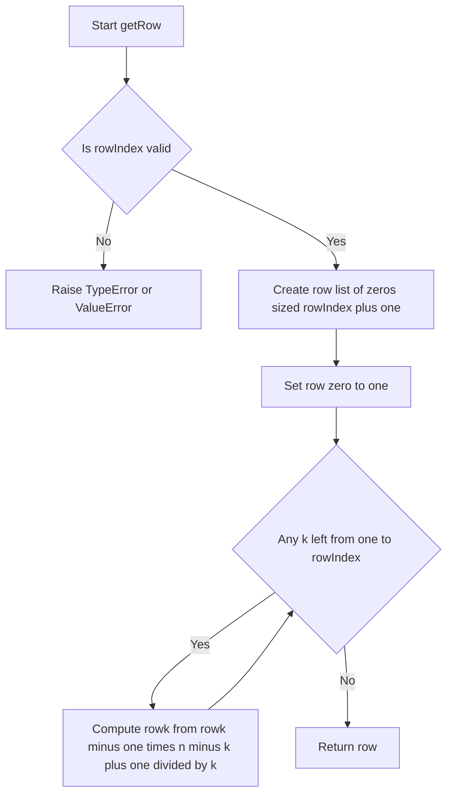
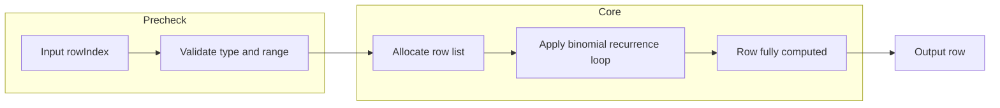

# Pascal's Triangle II - 二項係数の漸化式で1行だけを効率よく求める

## 目次

- [概要](#overview)
- [アルゴリズム要点（TL;DR）](#tldr)
- [図解](#figures)
- [正しさのスケッチ](#correctness)
- [計算量](#complexity)
- [Python 実装](#impl)
- [CPython最適化ポイント](#cpython)
- [エッジケースと検証観点](#edgecases)
- [FAQ](#faq)

---

<h2 id="overview">概要</h2>

> 💡 **初学者向け補足**：この問題は、一言で言うと「**パスカルの三角形の、指定された行だけを無駄なく作る問題**」です。

パスカルの三角形は、各行の両端が常に `1` で、それ以外の値は「1つ上の行の隣り合う2つの数の和」になっている数の並びです。今回の問題では、三角形全体を作る必要はなく、`rowIndex` 番目（0-indexed＝0から数え始める番号付け）の行だけを返せばよいという点がポイントです。

この問題が難しく感じられるとしたら、それは「三角形全体を作ってから該当行を取り出す」という発想に引っ張られてしまうためです。実際には、二項係数（＝n個からk個を選ぶ組み合わせの数）という数学的な性質を使うことで、**行を積み上げずに、同じ行の中だけで完結する計算**に置き換えられます。これによりフォローアップ条件である「O(rowIndex) の追加空間」も自然に満たせます。

制約は `0 <= rowIndex <= 33` と小さく、正当性（＝アルゴリズムが常に正しい答えを返すことの保証）を保ったまま最速のアプローチを選べる余地があります。

> 📖 **この章で登場した用語**
>
> - **0-indexed**：数え始めを0からとする番号付け方式。`rowIndex = 0` は「1行目」ではなく「0番目の行」を指す
> - **二項係数**：n個の中からk個を選ぶ組み合わせの数。`C(n, k)` と表記する
> - **制約**：入力として与えられる値の範囲や条件のこと。今回は `0 <= rowIndex <= 33`
> - **正当性**：アルゴリズムが常に正しい答えを返すことの保証

---

<h2 id="tldr">アルゴリズム要点（TL;DR）</h2>

> 💡 **初学者向け補足**：TL;DR（Too Long; Didn't Read＝長くて読めない人向けの要約）とは、詳細を読む前に「なんとなくこういう手順で解くんだな」というイメージを掴むための章です。

- **戦略**：三角形を上から積み上げず、二項係数の漸化式 `C(n, k) = C(n, k-1) * (n - k + 1) / k` を使い、**同じ行の中を左から右へ**計算していく。行を積み上げる必要がないため、ループが1重で済む。
- **データ構造**：単純な `list[int]` のみを使う。両端からの追加・削除は発生しないため、`deque`（両端が開いた箱のような構造）のような特殊な構造は不要。
- **計算量**：時間 `O(rowIndex)`、空間 `O(rowIndex)`（出力用のリスト以外に追加のメモリを使わない）。
- **Python特有の工夫**：Pythonの `/` は常に `float` を返してしまうため、割り切れることが保証されているこの計算では `//`（フロア除算＝小数点以下を切り捨てて整数を返す演算子）を使う。

> 📖 **この章で登場した用語**
>
> - **TL;DR**：「長くて読めない人向けの要約」を意味する略語
> - **漸化式**：ある項の値を、1つ前の項の値から計算するための式
> - **フロア除算**：Pythonの `//` 演算子。小数点以下を切り捨てて `int` を返す

---

<h2 id="figures">図解</h2>

> 💡 **初学者向け補足**：Mermaidのフローチャートでは、ひし形（`{}`）は条件分岐を、長方形（`[]`）は処理ステップを表します。矢印を上から下へ、あるいは左から右へたどることで、処理の流れを追うことができます。

### フローチャート

この図は `getRow` 関数の処理の流れを表しています。上から下へ読み進めてください。



主要なノードの意味：

- `Start[Start getRow]`：関数の入り口。引数 `rowIndex` を受け取る
- `Validate{Is rowIndex valid}`：入力値が型・範囲の制約を満たすかを判定する条件分岐
- `Init[Create row list of zeros sized rowIndex plus one]`：結果を格納するリストを、必要なサイズ分だけ最初に確保するステップ
- `Loop{Any k left from one to rowIndex}`：`k = 1` から `rowIndex` まで処理が残っているかを判定する条件分岐
- `Compute[Compute rowk ...]`：二項係数の漸化式で、1つ前の値から次の値を計算するステップ

### データフロー図

この図は、入力の `rowIndex` がどのように変換されて最終的な出力になるかを表しています。



主要な流れの説明：

- `Input rowIndex` から `Validate type and range` へ：型が `int` か、値が `0` 〜 `33` の範囲内かを確認する
- `Allocate row list` から `Apply binomial recurrence loop` へ：確保したリストに対して、1つ前の値から次の値を順に埋めていく
- `Row fully computed` から `Output row` へ：全ての値が埋まったリストをそのまま返す

> 💡 **代表例でのトレース**：`rowIndex = 4` を入力として、上記フローチャートの各ノードをどのように通過するかを示します。

```
Step 1: Start → rowIndex = 4
Step 2: Validate → isinstance(4, int)かつboolではない、0<=4<=33 → Yes
Step 3: Init → row = [0, 0, 0, 0, 0]
Step 4: Base → row[0] = 1 → row = [1, 0, 0, 0, 0]
Step 5: Loop(k=1) → Yes → Compute → row[1] = 1*4//1 = 4 → row = [1, 4, 0, 0, 0]
Step 6: Loop(k=2) → Yes → Compute → row[2] = 4*3//2 = 6 → row = [1, 4, 6, 0, 0]
Step 7: Loop(k=3) → Yes → Compute → row[3] = 6*2//3 = 4 → row = [1, 4, 6, 4, 0]
Step 8: Loop(k=4) → Yes → Compute → row[4] = 4*1//4 = 1 → row = [1, 4, 6, 4, 1]
Step 9: Loop(k=5) → No（5 > rowIndex） → Ret
結果: [1, 4, 6, 4, 1]
```

> 📖 **この章で登場した用語**
>
> - **フローチャート**：処理の手順を図形と矢印で表したもの。ひし形=条件分岐、長方形=処理
> - **データフロー図**：データがどのように変換・移動するかを示す図
> - **サブグラフ**：フローチャートの中で関連する処理をグループ化したもの

---

<h2 id="correctness">正しさのスケッチ</h2>

> 💡 **初学者向け補足**：「正しさのスケッチ」とは、アルゴリズムが常に正しい答えを返すことの根拠を整理したものです。数学的な証明ではなく「なぜ正しいと言えるか」の説明です。

- **不変条件（＝処理中ずっと成り立ち続けるべき条件）**：ループの `k` 回目が終わった時点で、`row[k]` は常に `C(rowIndex, k)`（＝rowIndex個からk個を選ぶ組み合わせの数）と等しくなっている。これは漸化式 `C(n, k) = C(n, k-1) * (n - k + 1) / k` が数学的に成り立つ関係式であり、`row[k-1]` が既に正しい値であればその値から計算される `row[k]` も必ず正しくなるためです。
- **基底条件（＝再帰やループの出発点となる条件）**：`row[0] = 1` は「rowIndex個から0個を選ぶ組み合わせは、何も選ばないという1通りしかない」という事実に対応しており、これは直感的にも正しいことが確認できます。
- **網羅性（＝すべてのケースをもれなく処理できているという保証）**：ループは `k = 1` から `rowIndex` まで1つも飛ばさずに実行されるため、行のすべての要素（`row[0]` から `row[rowIndex]` まで）が過不足なく計算されます。
- **終了性（＝アルゴリズムが必ず有限ステップで終わるという保証）**：ループの範囲は `range(1, rowIndex + 1)` という有限の範囲であり、`rowIndex` は制約により最大でも `33` なので、必ず有限回で終了します。

> 📖 **この章で登場した用語**
>
> - **不変条件**：アルゴリズムが正しく動くために、処理中ずっと成り立ち続けるべき条件
> - **基底条件**：再帰やループの出発点となる条件。これがないと処理が始められない
> - **網羅性**：すべてのケースをもれなく処理できているという保証
> - **終了性**：アルゴリズムが必ず有限ステップで終わるという保証

---

<h2 id="complexity">計算量</h2>

> 💡 **初学者向け補足**：計算量とは「入力が大きくなるにつれて、処理にかかる時間・メモリがどう増えるか」の目安です。
>
> | 記法 | 意味 | 直感的なイメージ |
> | --- | --- | --- |
> | `O(1)` | 入力サイズによらず一定 | 辞書で直接ページを開く |
> | `O(n)` | 入力に比例して増加 | リストを端から順に読む |
> | `O(n log n)` | nよりやや速く増加 | 辞書を二分探索で引く&times;n回 |
> | `O(n&sup2;)` | 入力の2乗で増加 | 全ペアを総当たりで確認する |

- **時間計算量**：`O(rowIndex)`。ループが `rowIndex` 回だけ実行され、各回の計算は定数時間（掛け算1回・割り算1回）で終わるため。
- **空間計算量**：`O(rowIndex)`。出力用のリスト `row` 以外に、追加の一時配列や二次元リストを作らないため、フォローアップの条件をそのまま満たす。

| アプローチ | 時間計算量 | 空間計算量 | 備考 |
| --- | --- | --- | --- |
| 三角形全体を二次元リストで構築 | O(rowIndex&sup2;) | O(rowIndex&sup2;) | 直感的だが不要な行まで保持してしまう |
| 1本のリストを右から左へ更新 | O(rowIndex&sup2;) | O(rowIndex) | in-place（＝新しいメモリを確保せず元のデータを直接書き換える操作）だが二重ループが必要 |
| 二項係数の漸化式（本実装） | O(rowIndex) | O(rowIndex) | 同じ行の中だけで完結するため最速 |

> 📖 **この章で登場した用語**
>
> - **時間計算量**：入力の大きさに対して処理にかかる手間がどう増えるかの目安
> - **空間計算量**：処理中に使うメモリ量がどう増えるかの目安
> - **in-place**：新しいメモリを確保せず元のデータを直接書き換える操作。空間計算量を抑えられる

---

<h2 id="impl">Python 実装</h2>

> 💡 **初学者向け補足**：コードの全体的な骨格は以下の通りです。
>
> 1. `from __future__ import annotations` で型ヒントの前方参照を有効にする
> 2. `rowIndex` の型と範囲を実行時にも検証する（pylanceの静的チェックだけでは実行時の誤りは防げないため）
> 3. 結果を格納するリストを先に確保し、先頭を `1` にする
> 4. 二項係数の漸化式を使い、`k = 1` から `rowIndex` まで1つずつ値を計算する
> 5. 完成したリストを返す
>
> 型ヒント `List[int]` は「intのリスト」を意味します。Python 3.9以降は組み込みの `list[int]` と書くこともできますが、ここでは `typing.List` を明示的にimportして使います。

```python
from __future__ import annotations

from typing import List


class Solution:
    """
    119. Pascal's Triangle II を解決するクラス

    パスカルの三角形の rowIndex 行目を、二項係数の漸化式を使って
    O(rowIndex) 時間・O(rowIndex) 追加空間で求める。
    """

    def getRow(self, rowIndex: int) -> List[int]:
        """
        パスカルの三角形の rowIndex 行目（0-indexed）を返す

        Args:
            rowIndex: 求めたい行番号（0 <= rowIndex <= 33）

        Returns:
            rowIndex 行目の値を格納したリスト

        Raises:
            TypeError: rowIndex が int 型でない場合
            ValueError: rowIndex が 0〜33 の範囲外の場合
        """
        # 型ヒントは実行時には無視される。呼び出し元が誤った型を渡した場合に
        # 実行時までエラーに気づけないため、isinstance() で別途検証する。
        self._validate_input(rowIndex)

        # 結果を格納するリストを先に確保する。
        # フォローアップの「O(rowIndex)の追加空間」を満たすため、
        # 過去の行を丸ごと保持する二次元リストは作らず、この1本のリストだけを使い回す。
        row: List[int] = [0] * (rowIndex + 1)

        # パスカルの三角形の左端は、どの行でも必ず1になる
        # （rowIndex個からk=0個を選ぶ組み合わせは「何も選ばない」の1通りしかないため）
        row[0] = 1

        # 二項係数の漸化式 C(n, k) = C(n, k-1) * (n - k + 1) // k を使い、
        # 1つ左の値から次の値を順番に計算していく（同じ行の中だけで完結する）
        for k in range(1, rowIndex + 1):
            # 掛け算を先に行ってから割り算をする。
            # 「//」（フロア除算）を使うのは、Pythonの「/」が常にfloatを返してしまい
            # List[int]という戻り値の型と食い違ってしまうため。
            # 二項係数は必ず整数になる値なので、掛け算を先に行えば割り切れずに誤差が出ることはない。
            row[k] = row[k - 1] * (rowIndex - k + 1) // k

        return row

    def _validate_input(self, row_index: int) -> None:
        """入力値が問題の制約を満たすかを検証する"""
        # isinstance() で型チェックする。
        # bool は int のサブクラスなので、isinstance(True, int) は True になってしまう。
        # そのため True/False が誤って渡されるケースも別途弾いておく。
        if not isinstance(row_index, int) or isinstance(row_index, bool):
            raise TypeError("rowIndex must be an int")

        if not (0 <= row_index <= 33):
            raise ValueError("rowIndex must be between 0 and 33")
```

> 💡 **コードの動作トレース**（`rowIndex = 3` の場合。問題文のExample 1に対応）
>
> ```
> 呼び出し: Solution().getRow(3)
> Step 1: _validate_input(3) → isinstance(3, int)かつboolではない → OK、0<=3<=33 → OK
> Step 2: row = [0, 0, 0, 0] を確保 → row[0] = 1 → row = [1, 0, 0, 0]
> Step 3: k=1 → row[1] = row[0] * (3-1+1) // 1 = 1 * 3 // 1 = 3 → row = [1, 3, 0, 0]
> Step 4: k=2 → row[2] = row[1] * (3-2+1) // 2 = 3 * 2 // 2 = 3 → row = [1, 3, 3, 0]
> Step 5: k=3 → row[3] = row[2] * (3-3+1) // 3 = 3 * 1 // 3 = 1 → row = [1, 3, 3, 1]
> 最終結果: [1, 3, 3, 1]
> ```
>
> この結果は問題文のExample 1の出力 `[1,3,3,1]` と一致します。

> 📖 **この章で登場した用語**
>
> - **`from __future__ import annotations`**：型ヒントを文字列として遅延評価する宣言。前方参照（まだ定義されていないクラス名を型ヒントで使うこと）を解決できる
> - **`List[int]`**：「intのリスト」を表す型ヒント
> - **`_validate_input`のようなアンダースコア始まりの名前**：Pythonの慣習で「クラス内部だけで使う想定のメソッド」を表す印

---

<h2 id="cpython">CPython最適化ポイント</h2>

> 💡 **初学者向け補足**：この章では「同じ処理でもPythonの書き方によって速さが変わる理由」を、最適化前のコード→最適化後のコード→なぜ速くなるか、の3点セットで説明します。

**最適化1：リストの初期化方法**

```python
# 最適化前：forループでappendしながらリストを作る
row = []
for _ in range(rowIndex + 1):
    row.append(0)

# 最適化後：乗算で一気に確保する
row = [0] * (rowIndex + 1)
```

なぜ速いか：最適化前は `append` の呼び出しのたびにPythonレベルの関数呼び出しと、リストの内部バッファが足りなくなるたびに発生する再確保処理が繰り返し走ります。最適化後の `[0] * n` はCPython内部でC言語レベルの単純なメモリ確保1回に置き換わるため、`n` 回のPython関数呼び出しが発生しません。

**最適化2：各値の計算方法**

```python
# 最適化前：math.combを各kごとに個別に呼び出す
import math
row = [math.comb(rowIndex, k) for k in range(rowIndex + 1)]

# 最適化後：1つ前の値から漸化式で計算する（本実装の方法）
row: List[int] = [0] * (rowIndex + 1)
row[0] = 1
for k in range(1, rowIndex + 1):
    row[k] = row[k - 1] * (rowIndex - k + 1) // k
```

なぜ速いか：`math.comb(n, k)` はC実装（＝Python言語ではなくC言語で書かれた関数。Pure Pythonより高速）ではあるものの、呼び出しのたびに `min(k, n-k)` 回程度の掛け算を内部で行うため、`k = 0` から `rowIndex` まで全部呼び出すと合計で `O(rowIndex&sup2;)` 相当の計算になります。一方、漸化式を使う方法は「1つ前の結果」を再利用するため、各ステップが定数時間で済み、合計でも `O(rowIndex)` にとどまります。`rowIndex <= 33` という小さな制約では体感できる差ではありませんが、計算量の観点では漸化式方式が本質的に優れています。

> 📖 **この章で登場した用語**
>
> - **C実装**：Pythonコードではなく、内部でC言語で実装された関数。Pure Pythonより大幅に高速
> - **再確保処理**：リストの内部バッファが不足したときに、より大きなメモリ領域を確保し直す処理

---

<h2 id="edgecases">エッジケースと検証観点</h2>

> 💡 **初学者向け補足**：エッジケースとは「入力が空・最小値・最大値・重複あり」など、通常とは異なる境界的な入力のことです。エッジケースを見落とすと、普通のテストは通るのに特定の入力でだけバグが発生します。

- **`rowIndex = 0`**：ループが0回実行され、`row = [1]` がそのまま返る。特別な分岐を書かなくても自然に正しい結果になる。もし特別扱いのコードを書いてしまうと、その分岐だけ別のバグを持ち込むリスクがあるため、分岐なしで済むこの実装は望ましい形です。
- **`rowIndex = 33`（最大値）**：`C(33, 16) &asymp; 1.17 &times; 10&sup9;` 程度の値になるが、CPythonの `int` は多倍長整数（＝桁数に応じて自動的にメモリを拡張できる整数表現）のため、オーバーフロー（桁あふれ）の心配がない。
- **型が不正な入力（例：`"3"` や `3.5`）**：`_validate_input` の `isinstance()` チェックにより `TypeError` が送出される。文字列や小数がそのまま `range()` に渡ると、実行時に分かりにくいエラーメッセージが出てしまうため、事前に明確なエラーを出す方が保守性が高い。
- **`True` / `False` が渡された場合**：Pythonでは `bool` が `int` のサブクラスであるため、`isinstance(True, int)` は `True` になってしまう。この問題の性質上 `rowIndex` が真偽値であることは意味を持たないため、明示的に弾いている。

> 📖 **この章で登場した用語**
>
> - **エッジケース**：空のリスト・要素1つ・最大サイズ入力など、境界的な条件の入力
> - **境界値**：制約の上限・下限にあたる値。今回は `rowIndex = 0` と `rowIndex = 33`
> - **多倍長整数**：桁数に応じて自動的にメモリを拡張できる整数表現。CPythonの `int` はこの仕組みを持つ

---

<h2 id="faq">FAQ</h2>

**Q1. なぜ三角形全体を作らずに1行だけを計算するのですか？別の方法ではダメなのですか？**

結論：三角形全体を作ると不要なメモリと時間を使ってしまうため、1行だけを計算する方法を選びました。

理由：三角形全体を二次元リストで保持する方法は `O(rowIndex&sup2;)` の空間を必要としますが、この問題が求めているのは最後の1行だけです。フォローアップ条件の「`O(rowIndex)` の追加空間」を満たすには、不要な行を保持しない設計が必須です。

補足：二項係数の漸化式を使えば、同じ行の中だけで値を計算できるため、そもそも「前の行」という概念自体が不要になります。

**Q2. なぜ `/` ではなく `//` を使っているのですか？`/` を使うとどうなりますか？**

結論：`/` を使うと戻り値の型が `float` になってしまい、`List[int]` という型ヒントと矛盾するため `//` を使っています。

理由：Pythonの `/` は「真の除算」と呼ばれ、割り切れる場合でも常に `float` を返します（例：`6 / 2` は `3.0`）。今回の計算は数学的に必ず割り切れることが保証されていますが、型としては `float` になってしまいます。

補足：`//` は「フロア除算」と呼ばれ、小数点以下を切り捨てて `int` を返します。掛け算を先に行ってから割り算をするという計算順序を守っている限り、切り捨てによる誤差は発生しません。

**Q3. `math.comb` を使えばもっと簡単に書けるのに、なぜ漸化式を使うのですか？**

結論：コードの短さでは `math.comb` を使った1行のリスト内包表記も魅力的ですが、計算量の観点では漸化式の方が優れているため、こちらを採用しました。

理由：`math.comb(n, k)` を `k = 0` から `rowIndex` まで毎回個別に呼び出すと、合計で `O(rowIndex&sup2;)` 相当の計算になります。一方、漸化式は1つ前の結果を再利用するため `O(rowIndex)` で済みます。

補足：`rowIndex <= 33` という小さな制約下では体感できる差はほとんどありませんが、より大きな `n` を扱う場面を想定した場合、漸化式の方が本質的にスケールする実装です。

**Q4. `isinstance(row_index, bool)` のチェックのイメージがつかめません。もう少し具体的に教えてください。**

結論：Pythonでは `bool` 型が `int` 型のサブクラス（＝派生した型）として定義されているため、`True` や `False` が誤って数値として扱われてしまうことを防ぐためのチェックです。

理由：`True == 1` および `False == 0` が成立し、`isinstance(True, int)` も `True` を返します。つまり型チェックだけでは `True` を「有効な `int`」として通してしまいます。

補足：例えば呼び出し元が誤って `getRow(True)` のように呼び出してしまった場合、このチェックがなければ `rowIndex = 1` として扱われてしまい、意図しない挙動につながります。明示的に弾くことで、こうした呼び出しミスを早期に検出できます。

> 📖 **この章で登場した用語**
>
> - **FAQ**：Frequently Asked Questions の略。よくある質問と回答のこと
> - **サブクラス**：あるクラスを継承して作られた、より特化したクラス。`bool` は `int` のサブクラス
