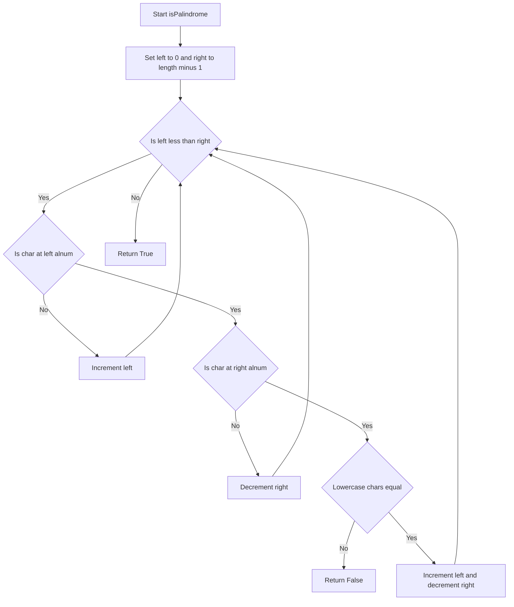

# 125. Valid Palindrome - 英数字だけを比較する回文判定

## 目次

- [概要](#overview)
- [アルゴリズム要点（TL;DR）](#tldr)
- [図解](#figures)
- [正しさのスケッチ](#correctness)
- [計算量](#complexity)
- [Python 実装](#impl)
- [CPython 最適化ポイント](#cpython)
- [エッジケースと検証観点](#edgecases)
- [FAQ](#faq)

---

<h2 id="overview">概要</h2>

> 💡 この問題は、一言で言うと**「文字列から記号やスペースを取り除き、大文字を小文字に揃えたうえで、前から読んでも後ろから読んでも同じかどうかを判定する問題」**です。

**問題（LeetCode 125 Valid Palindrome）**

- 与えられた文字列 `s` に対して、すべての大文字を小文字に変換し、英数字（アルファベットと数字）以外の文字をすべて取り除いたとき、その結果が回文（＝前から読んでも後ろから読んでも同じ並びになる文字列）であれば `True` を、そうでなければ `False` を返します。

**この問題が難しく感じられるポイント**

一見すると「文字列を綺麗にしてから前後を比べるだけ」の単純な問題に見えますが、実は2つの落とし穴があります。1つ目は「綺麗にする（クリーニングする）」という処理を素直に実装すると、新しい文字列を作ってしまい、余計なメモリを消費してしまう点です。2つ目は、記号やスペースが文字列のどこに出現するか分からないため、比較の途中で「読み飛ばし」の判定を挟む必要があり、単純な `s == s[::-1]` のような一行の比較では対応できない点です。この2つの落とし穴を回避するために、後述する二方向ポインタ（＝文字列の両端から中央に向かって2つの指し位置を同時に動かしていく手法）という考え方が重要になります。

**入出力仕様**

- 入力: `s: str`（印字可能なASCII文字列、長さは1以上2×10^5以下）
- 出力: `bool`（回文であれば `True`、そうでなければ `False`）

**要件（正当性・安定性・制約）**

- **正当性**: すべての入力パターン（記号のみ、英数字混在、大文字小文字混在）に対して常に正しい `True`/`False` を返す必要があります。
- **制約**: 文字列の長さは最大2×10^5文字であるため、`O(n)` または `O(n log n)` 程度の計算量に収める必要があります。

<h3>📖 この章で登場した用語</h3>

- **回文**：前から読んでも後ろから読んでも同じ並びになる文字列や文の並び
- **制約**：入力として与えられる値の範囲や条件のこと。例：「文字列の長さは1以上2×10^5以下」
- **正当性**：アルゴリズムが常に正しい答えを返すことの保証
- **二方向ポインタ**：配列や文字列の両端から中央に向かって2つの指し位置（インデックス）を同時に動かしていく手法

---

<h2 id="tldr">アルゴリズム要点（TL;DR）</h2>

> 💡 TL;DR（Too Long; Didn't Read＝長くて読めない人向けの要約）とは、アルゴリズム全体の戦略を短くまとめたものです。ここでは「なんとなくこういう手順で解くんだな」というイメージを掴んでください。詳細は後の章で説明します。

- **戦略**: 文字列の先頭と末尾に2つのポインタ（指し位置）を置き、中央に向かって進めながら1文字ずつ比較します。新しい文字列を作らないため、なぜこの手法を選ぶかというと、メモリ効率が最も良いからです。
- **データ構造**: 追加のデータ構造は使わず、入力の `str` に対してインデックス（整数の位置番号）でアクセスするだけです。なぜ `list` や `deque` を使わないかというと、両端からのアクセスだけで済み、途中への挿入・削除が発生しないため、単純な整数変数2つで十分だからです。
- **判定ロジック**: `str.isalnum()` で英数字かどうかを判定し、`str.lower()` で大文字小文字を揃えます。なぜ正規表現（`re` モジュール）を使わないかというと、正規表現エンジンの初期化コストがかかり、単純な走査より遅くなるためです。
- **計算量**: 時間計算量 `O(n)`、空間計算量 `O(1)`（入力以外に使う追加メモリが、文字列の長さに関係なく一定であることを意味します）。

<h3>📖 この章で登場した用語</h3>

- **TL;DR**：「長くて読めない人向けの要約」を意味する略語
- **インデックス**：文字列や配列の中で、何番目の要素かを示す位置番号（0から始まる）
- **正規表現**：文字列のパターンを記述するためのミニ言語。`re` モジュールで使う

---

<h2 id="figures">図解</h2>

> 💡 図を読む前に、Mermaidフローチャートの基本的な読み方を確認しておきましょう。ひし形のノードは「条件分岐（＝はい・いいえで処理が枝分かれするポイント）」を表し、長方形のノードは「処理ステップ（＝実際に何かを実行する場所）」を表します。矢印は処理の流れる方向を示します。

### フローチャート

この図は `isPalindrome` メソッドの内部で行われる、二方向ポインタによる回文判定の処理の流れを表しています。上から下へ、矢印に沿って読み進めてください。



主要なノードの意味：

- `Start[Start isPalindrome]`：アルゴリズムの入り口。引数 `s` を受け取る
- `Init[Set left to 0 and right to length minus 1]`：左ポインタを先頭、右ポインタを末尾に初期化する処理ステップ
- `LoopCheck{Is left less than right}`：2つのポインタがまだすれ違っていないかを判定するひし形（条件分岐）
- `CheckLeftAlnum{Is char at left alnum}` / `CheckRightAlnum{Is char at right alnum}`：それぞれの位置の文字が英数字かどうかを判定するひし形
- `LeftInc[Increment left]` / `RightDec[Decrement right]`：非英数字を読み飛ばすためにポインタを1つ動かす処理
- `CompareChars{Lowercase chars equal}`：小文字化した文字同士が一致するかを判定するひし形
- `MovePointers[Increment left and decrement right]`：一致した場合に両ポインタを内側へ進める処理
- `ReturnTrue` / `ReturnFalse`：ループの結果に応じて最終的な真偽値を返す終端ノード

### データフロー図

この図は、この問題を「概念として」理解する場合のデータの変換の流れと、実際に採用する二方向ポインタ実装でのデータの流れを比べたものです。

```
【概念としての理解（実際の実装ではこの通りには動かない）】

  元の文字列
       |
       v
  英数字だけを残す
       |
       v
  すべて小文字に変換する
       |
       v
  反転した文字列と比較する
       |
       v
  真偽値（True または False）

【実際の二方向ポインタ実装（新しい文字列を作らない）】

  元の文字列 s
   left位置 -> [ その場で1文字ずつ判定・比較 ] <- right位置
       |
       v
  真偽値（True または False）
```

主要な流れの説明：

- 元の文字列 → 英数字だけを残す：この段階で新しい文字列オブジェクトが1つ生成されてしまう、というのが「概念としての理解」における弱点です
- 英数字だけを残す → すべて小文字に変換する：ここでもさらにもう1つ新しい文字列が生成されます
- 実際の実装では、この「新しい文字列を作る」ステップを一切行わず、元の文字列 `s` に対してインデックスでアクセスするだけで同じ判定結果を得ています

> 💡 **代表例でのトレース**：`s = "A man, a plan, a canal: Panama"` を入力として、上記フローチャートの各ノードをどのように通過するかをステップごとに示します。

```
Step 1: Start → 入力 s = "A man, a plan, a canal: Panama"（長さ30）
Step 2: Init → left=0, right=29
Step 3: LoopCheck → 0 < 29 → Yes
Step 4: CheckLeftAlnum → s[0]='A' は alnum → Yes
Step 5: CheckRightAlnum → s[29]='a' は alnum → Yes
Step 6: CompareChars → 'a' == 'a' → Yes（一致）
Step 7: MovePointers → left=1, right=28
Step 8: LoopCheck → 1 < 28 → Yes
Step 9: CheckLeftAlnum → s[1]=' ' は alnum ではない → No
Step 10: LeftInc → left=2
Step 11: LoopCheck → 2 < 28 → Yes
Step 12: CheckLeftAlnum → s[2]='m' は alnum → Yes
Step 13: CheckRightAlnum → s[28]='m' は alnum → Yes
Step 14: CompareChars → 'm' == 'm' → Yes（一致）
Step 15: MovePointers → left=3, right=27
...（中略：以降も同じパターンで "an" と "am" 、"a" と "a" の比較が続く）...
Step N: LoopCheck → left と right がすれ違う → No
Step N+1: ReturnTrue → 一度も不一致がなかったため True を返す
結果: True
```

<h3>📖 この章で登場した用語</h3>

- **フローチャート**：処理の手順を図形と矢印で表したもの。ひし形＝条件分岐、長方形＝処理ステップ
- **データフロー図**：データがどのように変換・移動するかを示す図
- **ノード**：フローチャートやデータフロー図を構成する箱（図形）1つ1つのこと

---

<h2 id="correctness">正しさのスケッチ</h2>

> 💡 「正しさのスケッチ」とは、アルゴリズムが常に正しい答えを返すことの根拠を整理したものです。数学的な証明ではなく、「なぜ正しいと言えるか」を噛み砕いて説明します。

- **不変条件（＝アルゴリズムが正しく動くために、処理中ずっと成り立ち続けるべき条件）**: ループの各反復が終わった時点で、「`s[0..left)` の範囲にある英数字の並び」と「`s(right..n)` の範囲にある英数字の並びを逆順にしたもの」が常に一致している、という条件が成り立ち続けます。この条件が崩れた瞬間（＝比較で不一致が見つかった瞬間）に `False` を返すため、途中で条件が崩れているのに処理を続けてしまう、ということが起こりません。
- **網羅性（＝すべてのケースをもれなく処理できているという保証）**: `while left < right` というループ条件と、内部の `if/elif/else` 分岐により、「非英数字である」「英数字だが不一致」「英数字で一致」という3つの状態をすべて網羅しています。記号のみの文字列（例：`",,,,"`）であっても、`CheckLeftAlnum` と `CheckRightAlnum` の分岐が正しく機能し、最終的にポインタがすれ違ってループを抜けます。
- **基底条件（＝再帰の終了条件。この問題ではループの終了条件に相当）**: `left >= right` になった時点でループを終了し `True` を返します。これは「これ以上比較すべきペアが残っていない」ことを意味し、直感的にも正しい終了地点です。1文字だけの文字列（`len(s) == 1`）の場合、最初から `left == right` となるため、ループに一度も入らず即座に `True` が返ります。これも妥当な結果です（1文字は必ず回文であるため）。
- **終了性（＝アルゴリズムが必ず有限ステップで終わるという保証）**: `left` は単調に増加し、`right` は単調に減少します。両方とも `0` から `len(s) - 1` という有限の範囲に収まっているため、ループは必ず有限回で終了します（無限ループにはなりません）。

<h3>📖 この章で登場した用語</h3>

- **不変条件**：アルゴリズムが正しく動くために、処理中ずっと成り立ち続けるべき条件
- **基底条件**：再帰やループの終了条件。これがないと無限ループになる
- **終了性**：アルゴリズムが必ず有限ステップで終わるという保証
- **網羅性**：すべてのケースをもれなく処理できているという保証

---

<h2 id="complexity">計算量</h2>

> 💡 計算量とは「入力が大きくなるにつれて、処理にかかる時間・メモリがどう増えるか」の目安です。まずBig-O記法の読み方を確認しましょう。

| 記法       | 意味                   | 直感的なイメージ           |
| ---------- | ---------------------- | -------------------------- |
| O(1)       | 入力サイズによらず一定 | 辞書で直接ページを開く     |
| O(n)       | 入力に比例して増加     | リストを端から順に読む     |
| O(n log n) | nよりやや速く増加      | 辞書を二分探索で引く×n回   |
| O(n²)      | 入力の2乗で増加        | 全ペアを総当たりで確認する |

**この問題の計算量**

- **時間計算量**: O(n)。文字列の各文字を最大1回ずつ読むだけで判定が完了するためです。
- **空間計算量**: O(1)。ポインタ `left` と `right` という2つの整数変数以外に、入力サイズに比例して増えるメモリを使わないためです。

**in-place vs Pure の比較**

| 実装方式                   | 空間計算量 | 説明                                                                                         |
| -------------------------- | ---------- | -------------------------------------------------------------------------------------------- |
| in-place（今回採用）       | O(1)       | 新しいメモリを確保せず元の文字列を直接インデックス参照する。空間計算量を抑えられる           |
| Pure（フィルタ＋反転比較） | O(n)       | 入力を変更せず、クリーニング済みの新しい文字列を生成して比較する。安全だがメモリを余分に使う |

<h3>📖 この章で登場した用語</h3>

- **時間計算量**：入力の大きさに対して処理にかかる手間がどう増えるかの目安
- **空間計算量**：処理中に使うメモリ量がどう増えるかの目安
- **in-place**：新しいメモリを確保せず、元のデータ構造を直接書き換える（または直接参照する）操作
- **Pure**：入力を変更せず新しいデータを返す操作。安全だがメモリを余分に使う

---

<h2 id="impl">Python 実装</h2>

> 💡 コードを読む前に、実装全体の骨格を確認しておきましょう。

- `isinstance()` で入力が本当に `str` 型かどうかを検証する
- 左ポインタ `left` を先頭、右ポインタ `right` を末尾に初期化する
- `left < right` の間、非英数字の読み飛ばし・小文字化しての比較・ポインタの移動を繰り返す
- 不一致が見つかった時点で即座に `False` を返す（早期リターン＝条件を満たした時点ですぐに関数を終了させること）
- ループを抜けたら `True` を返す

LeetCode class形式（`class Solution: def isPalindrome(self, s: str) -> bool:`）で実装します。データ構造は `str` のみを使うため、`ListNode` や `TreeNode` のような補助クラスの定義は不要です。

```python
from __future__ import annotations
# from __future__ import annotations は、型ヒントを実行時ではなく
# 文字列として遅延評価するようにする宣言です。
# クラス自身の型を戻り値に使う場合や、前方参照（まだ定義されていないクラス名を
# 型ヒントに書くこと）が必要な場合に役立ちます。今回のコードでは必須ではありませんが、
# 業務コードのテンプレートとして先頭に付けておくと安全です。

from typing import Final
# Final は「この変数は再代入されない定数である」ことを型チェッカー（pylance）に
# 伝えるための型ヒントです。マジックナンバー（意味の分からない数値）を
# 避けるために、制約の上限値に名前を付けて定義します。


class Solution:
    """125. Valid Palindrome を解くクラス"""

    # 問題の制約：文字列の長さは最大 2 * 10**5
    _MAX_LENGTH: Final[int] = 2 * 10**5

    def isPalindrome(self, s: str) -> bool:
        """
        文字列 s が「英数字だけ・小文字統一」で回文かどうかを判定する

        Args:
            s: 判定対象の文字列（大文字・記号・スペースを含んでよい）

        Returns:
            回文であれば True、そうでなければ False

        Raises:
            TypeError: s が str 型でない場合
            ValueError: s の長さが制約の上限を超える場合
        """
        # isinstance() で実行時にも型を確認する。
        # Python は動的型付け（＝変数の型を実行時まで確定させない）言語のため、
        # pylance の静的チェックをすり抜けてきた値が紛れ込んでも、ここで安全に弾ける。
        if not isinstance(s, str):
            raise TypeError("Input must be a string")

        # 制約の上限を超えていないか確認する。
        # 上限チェックを入れておくことで、想定外の巨大入力による
        # 予期しない性能劣化を早期に検知できる。
        if len(s) > self._MAX_LENGTH:
            raise ValueError("Input length exceeds the problem constraint")

        # 左ポインタは先頭、右ポインタは末尾に置く。
        # ここで s を書き換えたり新しい文字列を作ったりしないため、
        # 追加メモリはこの2つの整数変数だけで済む（空間計算量 O(1) の理由）。
        left: int = 0
        right: int = len(s) - 1

        # 2つのポインタがすれ違う（left >= right）まで比較を続ける。
        while left < right:
            # 左側が非英数字（記号・スペースなど）の間は読み飛ばす。
            # str.isalnum() は CPython 内部で C 実装されているため、
            # Python レベルで文字コード比較を自前実装するより高速かつ読みやすい。
            if not s[left].isalnum():
                left += 1
                continue

            # 右側も同様に非英数字を読み飛ばす。
            if not s[right].isalnum():
                right -= 1
                continue

            # 両方とも英数字にたどり着いたら、小文字化して比較する。
            # str.lower() を文字列全体ではなく1文字だけに対して呼ぶことで、
            # 新しい長い文字列を生成するコストを避けている。
            if s[left].lower() != s[right].lower():
                return False

            # 一致していれば両ポインタを内側に1つずつ進める。
            left += 1
            right -= 1

        # ループを最後まで抜けられた（不一致が一度もなかった）ということは、
        # 文字列全体が回文であることが確認できたことを意味する。
        return True
```

> 💡 **コードの動作トレース**（初学者向け）

```
入力: s = "A man, a plan, a canal: Panama"
呼び出し: isPalindrome(s)
  → isinstance チェック → str 型なので通過
  → 長さチェック → 31文字 <= 2*10**5 なので通過
  → left=0, right=30
  → ループ開始
     s[0]='A' は isalnum → True
     s[30]='a' は isalnum → True
     'A'.lower()='a' と 'a'.lower()='a' を比較 → 一致
     → left=1, right=29
     s[1]=' ' は isalnum → False → left=2
     s[2]='m', s[29]='m' → 一致 → left=3, right=28
     ...（以下同様のパターンが続く）...
     最終的に left と right がすれ違いループ終了
  → return True
最終結果: True
```

<h3>📖 この章で登場した用語</h3>

- **`from __future__ import annotations`**：型ヒントを文字列として扱うようにする宣言。循環参照や前方参照を解決できる
- **`Final`**：`typing` モジュールが提供する型。「この変数は再代入されない定数である」ことを型チェッカーに伝える
- **動的型付け**：変数の型を実行時まで確定させない言語の性質。Pythonはこれに該当する
- **早期リターン**：条件を満たした時点ですぐに関数を終了させること。無駄な処理を続けずに済む

---

<h2 id="cpython">CPython 最適化ポイント</h2>

> 💡 この章では「同じ処理でもPythonの書き方によって速さが変わる理由」を説明します。

**属性アクセスの削減**

`s[left].isalnum()` のように書くと、CPythonは毎回「`s[left]` という `str` インスタンスから `isalnum` という属性（メソッド）を検索し、バインドメソッド（＝そのインスタンスに紐づいたメソッドオブジェクト）を新しく作る」という処理を行います。ループが数十万回繰り返される場合、この検索・生成コストが積み重なります。

```python
# 最適化前：ループのたびに s[left].isalnum() のように毎回メソッドを検索する
while left < right:
    if not s[left].isalnum():
        left += 1
        continue
    if not s[right].isalnum():
        right -= 1
        continue
    if s[left].lower() != s[right].lower():
        return False
    left += 1
    right -= 1

# 最適化後：str クラスからメソッドそのものをローカル変数にキャッシュしておく
is_alnum = str.isalnum  # 属性検索を1回だけ行い、以降は関数として直接呼び出す
to_lower = str.lower
while left < right:
    if not is_alnum(s[left]):
        left += 1
        continue
    if not is_alnum(s[right]):
        right -= 1
        continue
    if to_lower(s[left]) != to_lower(s[right]):
        return False
    left += 1
    right -= 1

# 理由：is_alnum(s[left]) という書き方は「str クラスの isalnum 関数に
#       s[left] を引数として渡す」という意味になり、毎回のバインドメソッド生成を
#       省略できる。ループ回数が多いほど、この差が積み重なって効いてくる。
```

**スライス回避**

`s[::-1]` のようなスライス操作（＝配列や文字列の一部を切り出す操作）は、新しい文字列を丸ごとコピーして生成するため `O(n)` の時間とメモリを消費します。今回の二方向ポインタ実装では、一度もスライスを使わず、常に1文字だけを `s[i]` で取り出しているため、このコストを完全に回避しています。

**`re` モジュールを使わない理由**

`re.sub(r"[^a-zA-Z0-9]", "", s).lower()` のように正規表現でクリーニングする方法もありますが、正規表現パターンのコンパイル（＝パターン文字列を内部的な実行形式に変換する処理）にコストがかかり、さらに `re.sub` は新しい文字列を生成するため、今回のような単純なパターンには `str.isalnum()` / `str.lower()` の組み合わせの方が適しています。

<h3>📖 この章で登場した用語</h3>

- **属性アクセス**：`s.isalnum` のようにオブジェクトのプロパティやメソッドを参照する操作。CPythonでは内部的に検索処理が発生する
- **バインドメソッド**：特定のインスタンスに紐づけられたメソッドオブジェクト。呼び出すたびに新しく生成されるコストがある
- **スライス**：`s[1:3]` のように文字列やリストの一部を取り出す操作。新しいオブジェクトを生成するのでメモリを消費する
- **ローカル変数キャッシュ**：クラスの属性やグローバル変数への参照を一度ローカル変数に保存することで、アクセスコストを削減するテクニック

---

<h2 id="edgecases">エッジケースと検証観点</h2>

> 💡 エッジケースとは「入力が空・最小値・最大値・重複あり」など、通常とは異なる境界的な入力のことです。エッジケースを見落とすと、普通のテストは通るのに特定の入力でだけバグが発生します。

- **1文字だけの文字列（例：`"a"`）**: `left == right` (`0 == 0`) からスタートするため、`while left < right` の条件を満たさず即座に `True` を返します。単一の `while left < right` と `if/continue` 分岐を使う本実装では範囲外アクセスは発生しません。
- **記号やスペースだけの文字列（例：`" "` や `",,,,"`）**: 内側の `while` ループで非英数字を連続スキップする別実装の場合、`left < right` ガードを付け忘れると範囲外アクセス（インデックスエラー）を起こす危険がありますが、本実装のように単一 `while` 内で 1 ステップずつポインタを移動・再チェックする構造では安全に交差して `True` を返します。
- **大文字小文字が混在する数字と文字（例：`"0P"`）**: `'0'.lower()` は `'0'` のまま変化しませんが、`'P'.lower()` は `'p'` になります。なぜ問題になりうるかというと、数字に対して `.lower()` を呼んでもエラーにならず元の文字がそのまま返る、という仕様を知らないと「数字には `.lower()` を呼んではいけないと誤解してしまう」可能性があるためです。
- **制約の上限に近い長さの文字列（長さ2×10^5）**: 時間計算量が `O(n)` であることを確認するためのケースです。なぜ重要かというと、もし実装の途中でうっかりスライスや文字列連結を使ってしまうと、この規模の入力で急激に遅くなる可能性があるためです。

<h3>📖 この章で登場した用語</h3>

- **エッジケース**：空の入力・要素1つ・最大サイズ入力など、境界的な条件の入力
- **境界値**：制約の上限・下限にあたる値。例：長さ1や長さ2×10^5の文字列
- **インデックスエラー**：リストや文字列の範囲外の要素にアクセスしようとしたときのエラー

---

<h2 id="faq">FAQ</h2>

**Q1. なぜ二方向ポインタを使うのですか？フィルタして新しい文字列を作ってから比較する方法ではダメなのですか？**

結論：フィルタして比較する方法でも正解にはなりますが、二方向ポインタの方がメモリ効率で優れているため、こちらを採用しています。

理由：フィルタする方法（`"".join(c for c in s if c.isalnum()).lower()` のような書き方）は、クリーニング済みの新しい文字列を1つ生成します。文字列は2×10^5文字になる可能性があるため、この新しい文字列の生成に `O(n)` の追加メモリがかかります。二方向ポインタなら、`left` と `right` という2つの整数変数だけで済むため `O(1)` に抑えられます。

補足：可読性を最優先するチームのコードベースでは、フィルタする方法の方が「直感的で読みやすい」という理由であえて選ばれることもあります。速度・メモリと可読性はトレードオフ（＝何かを得ると何かを失う関係）の関係にあるため、状況に応じて選ぶことが大切です。

**Q2. `isalnum()` や `lower()` はコードのどの部分で使われていますか？**

結論：ループ内の「非英数字の読み飛ばし判定」と「文字の比較」の2箇所で使われています。

理由：`isalnum()` は `if not s[left].isalnum():` の部分で、その位置の文字が英数字かどうかを判定するために使われています。`lower()` は `if s[left].lower() != s[right].lower():` の部分で、大文字小文字の違いを無視して比較するために使われています。

補足：CPython最適化ポイントの章で紹介したように、`str.isalnum` や `str.lower` をローカル変数にキャッシュして使う書き方に変えることもできます。

**Q3. 「非英数字をスキップする」というイメージがつかめません。具体例でもう一度説明してください。**

結論：文字列の中に紛れ込んだ記号やスペースを、比較の対象から除外しながら読み進める、という動きです。

理由：例えば `"a, a"` という文字列を考えると、インデックス1にはカンマ `,` があります。もし記号もそのまま比較してしまうと、`left=1` の `,` と `right=2` の（スペースを挟んだ）文字を比較することになり、正しい判定ができません。そこで `left` を1つ進めて `,` を読み飛ばし、本来比較すべき英数字同士（この場合は `'a'` と `'a'`）を見つけてから比較を行います。

補足：この「読み飛ばし」の処理があるからこそ、記号やスペースがどこに何個あっても、正しく英数字だけを比較できます。

**Q4. なぜ新しい文字列を作らないほうが良いのですか？メモリの話がよく分かりません。**

結論：Pythonの文字列はイミュータブル（＝作成後に内容を変更できない性質）であるため、文字列に対して何らかの変換処理を行うたびに、新しいメモリ領域が確保されるからです。

理由：例えば `s.lower()` を文字列全体に対して呼び出すと、元の文字列とは別に、小文字化された新しい文字列がまるごと1つ作られます。文字列が2×10^5文字であれば、その分のメモリがもう1つ必要になります。二方向ポインタでは `s[left].lower()` のように1文字だけを小文字化するため、生成される一時的な文字列も1文字分だけで済みます。

補足：この考え方は、図解の章で示した「概念としての理解」と「実際の二方向ポインタ実装」の違いにそのまま対応しています。

**Q5. 再帰でも解けますか？なぜ推奨しないのですか？**

結論：再帰でも実装は可能ですが、この問題の制約下では推奨しません。

理由：再帰は「関数の呼び出し履歴」をコールスタック（＝関数呼び出しの情報を積み上げるメモリ領域）に積んでいきます。文字列の長さが最大2×10^5であるため、単純な再帰では10万回以上の呼び出しが発生する可能性があり、Pythonのデフォルトの再帰制限（`sys.getrecursionlimit()`、通常1000回程度）を超えて `RecursionError` になる危険があります。

補足：どうしても再帰で書きたい場合は `sys.setrecursionlimit()` で上限を引き上げる方法もありますが、コールスタックを使う分メモリ効率が悪化するため、今回のようにループで書ける問題ではループを使う方が安全です。

<h3>📖 この章で登場した用語</h3>

- **FAQ**：Frequently Asked Questions（よくある質問）の略
- **トレードオフ**：何かを得ると何かを失う関係。例：速さを得るとメモリが増える
- **コールスタック**：関数呼び出しの情報を積み上げるメモリ領域。再帰呼び出しが深くなるとここが溢れる可能性がある
