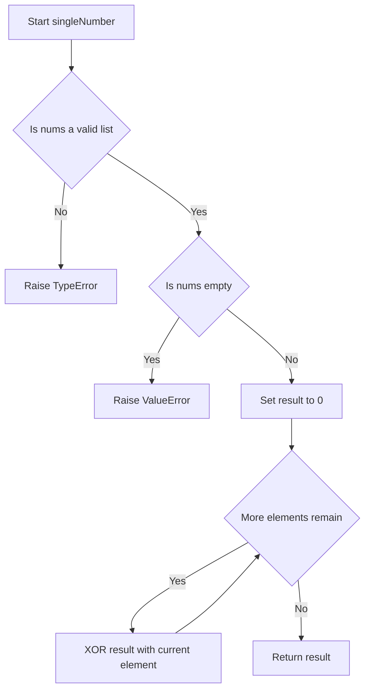
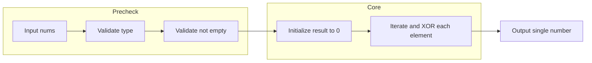

# Single Number - XORで"はぐれ者"を一撃で見つける

## 目次

- [概要](#overview)
- [アルゴリズム要点（TL;DR）](#tldr)
- [図解](#figures)
- [正しさのスケッチ](#correctness)
- [計算量](#complexity)
- [Python 実装](#impl)
- [CPython最適化ポイント](#cpython)
- [エッジケースと検証観点](#edgecases)
- [FAQ](#faq)

---

<h2 id="overview">概要</h2>

💡 この章では、問題が何を求めているのかを一言で言い換え、なぜこの問題が興味深いのかを説明します。ここを理解しておくと、後続の章でXORという少し変わった発想を使う理由が腑に落ちやすくなります。

この問題は、一言で言うと「配列の中からペアを組んでいない“はぐれ者”の数字を1つだけ見つける問題」です。配列 `nums` の中では、1つの数字を除いてすべての数字がちょうど2回ずつ登場します。その「1回しか登場しない数字」を答えとして返す必要があります。

この問題が難しく感じられるポイントは、制約にあります。

- `1 <= nums.length <= 3 * 10^4`
- `-3 * 10^4 <= nums[i] <= 3 * 10^4`
- **必ず線形時間（O(n)）で解くこと**
- **必ず定数空間（O(1)）だけを使うこと**

直感的には「辞書（＝キーと値をセットで記録できる構造）で出現回数を数えればいい」と考えがちですが、それだと辞書の分だけ追加のメモリ（O(n)）を使ってしまい、「定数空間」という制約（＝入力として与えられる値の範囲や条件のこと。ここでは"追加メモリはO(1)まで"という条件）に違反してしまいます。この制約こそが、XOR（排他的論理和）という一見遠回りに見える手法を使う最大の理由です。

> 📖 この章で登場した用語
>
> - **制約**：入力として与えられる値の範囲や条件のこと。例：「配列の長さは1以上3万以下」
> - **正当性**：アルゴリズムが常に正しい答えを返すことの保証
> - **定数空間**：入力サイズに関係なく一定量のメモリしか使わないこと

---

<h2 id="tldr">アルゴリズム要点（TL;DR）</h2>

💡 TL;DR（Too Long; Didn't Read＝長くて読めない人向けの要約という意味の略語）とは、細かい理由は後回しにして「なんとなくこういう手順で解くんだな」というイメージを掴むための章です。詳しい理由は後の章で1つずつ説明します。

- **戦略**：配列を1回だけ走査（＝先頭から末尾まで1周すること）しながら、XOR（排他的論理和＝2つのビットを比較し、違っていれば1、同じなら0を返す演算）を使って全要素を1つの値にまとめていきます。なぜXORを選ぶかというと、「同じ数字同士をXORすると0になる」という性質が、まさに「2回登場する数字を打ち消し合わせる」という今回のゴールにぴったり合うからです。
- **データ構造**：追加のデータ構造は一切使いません。`int`型の変数1つ（`result`）だけで完結します。辞書や配列を新たに作らないことで、空間計算量をO(1)に抑えられます。
- **計算量**：時間計算量 O(n)、空間計算量 O(1)。制約が要求する条件を過不足なく満たします。
- **メモリ**：`result`という変数1つ分のメモリしか消費しません。入力サイズが3万でも300万でも、使うメモリは変わりません。

> 📖 この章で登場した用語
>
> - **TL;DR**：「長くて読めない人向けの要約」を意味する略語
> - **XOR（排他的論理和）**：2つのビットを比較し、違っていれば1、同じなら0を返す演算
> - **走査**：データ構造の要素を先頭から順番に見ていく操作

---

<h2 id="figures">図解</h2>

💡 この章では、アルゴリズムの処理の流れを図で確認します。Mermaidフローチャートでは、ひし形（`{}`で囲まれた形）は「条件分岐」を、長方形（`[]`で囲まれた形）は「処理ステップ」を表します。上から下へ矢印をたどりながら読み進めてください。

### フローチャート

この図は、`singleNumber`関数が呼び出されてから結果を返すまでの処理の流れを表しています。上から下へ読み進めてください。



主要なノードの意味：

- `Start[Start singleNumber]`：関数の入り口。引数`nums`を受け取る
- `Validate{Is nums a valid list}`：`isinstance(nums, list)`で型を確認するひし形（条件分岐）
- `RaiseType[Raise TypeError]`：型が不正な場合にエラーを投げる処理
- `CheckEmpty{Is nums empty}`：配列が空かどうかを確認する条件分岐
- `RaiseValue[Raise ValueError]`：空配列の場合にエラーを投げる処理
- `Init[Set result to 0]`：累積変数`result`を0で初期化するステップ
- `LoopCheck{More elements remain}`：まだ走査していない要素が残っているかを判定する条件分岐
- `XorStep[XOR result with current element]`：現在の要素を`result`にXORで重ねる処理
- `Return[Return result]`：走査が終わったら`result`を返す最終ステップ

### データフロー図

この図は、入力データがどのように変換されて最終的な出力になるかを表しています。



主要な流れの説明：

- `Precheck`（入力→型検証→空チェック）：入力が「本当に処理してよいデータか」を確認する前処理段階
- `Core`（初期化→XOR走査）：実際にアルゴリズムの本体が動く段階。ここで答えが計算される
- `Core`から`F`へ：計算済みの`result`をそのまま出力として返す

> 💡 **代表例でのトレース**：`nums = [4, 1, 2, 1, 2]` を入力として、上記フローチャートの各ノードをどのように通過するかを示します。

```
Step 1: Start → nums = [4, 1, 2, 1, 2] を受け取る
Step 2: Validate → isinstance(nums, list) は True → Yes
Step 3: CheckEmpty → len(nums) == 0 は False → No
Step 4: Init → result = 0
Step 5: LoopCheck → 要素が残っている → Yes
Step 6: XorStep → result = 0 ^ 4 = 4
Step 7: LoopCheck → 残っている → Yes → XorStep → result = 4 ^ 1 = 5
Step 8: LoopCheck → 残っている → Yes → XorStep → result = 5 ^ 2 = 7
Step 9: LoopCheck → 残っている → Yes → XorStep → result = 7 ^ 1 = 6
Step 10: LoopCheck → 残っている → Yes → XorStep → result = 6 ^ 2 = 4
Step 11: LoopCheck → 要素がなくなった → No
Step 12: Return → result = 4 を返す
結果: 4
```

> 📖 この章で登場した用語
>
> - **フローチャート**：処理の手順を図形と矢印で表したもの。ひし形＝条件分岐、長方形＝処理
> - **データフロー図**：データがどのように変換・移動するかを示す図
> - **サブグラフ**：フローチャートの中で関連する処理をグループ化したもの

---

<h2 id="correctness">正しさのスケッチ</h2>

💡 この章では、「なぜこのアルゴリズムが常に正しい答えを返すと言えるのか」を、数学的な証明ではなく直感的な根拠として整理します。

- **不変条件（＝アルゴリズムが正しく動くために、処理中ずっと成り立ち続けるべき条件）**：ループの各ステップが終わった時点で、`result`は「それまでに走査した要素をすべてXORで重ねた値」になっています。XORには交換法則・結合法則（＝計算の順番を入れ替えたり、まとめる位置を変えても結果が変わらない性質）が成り立つため、要素をどの順番でXORしても最終結果は変わりません。
- **網羅性（＝すべてのケースをもれなく処理できているという保証）**：`for num in nums`というforループは、配列の全要素を1つも飛ばさずに処理します。したがって、2回登場する数字は必ずどこかで2回XORされ、`a ^ a = 0`によって打ち消されます。
- **基底条件（＝再帰の終了条件。これがないと無限ループになる）**：この問題は再帰ではなくループですが、対応する概念として「ループの開始時点」があります。`result = 0`という初期値は、`0 ^ a = a`という性質により「まだ何も処理していない状態」を正しく表現しています。例えば`nums = [1]`のとき、ループは1回しか回らず`result = 0 ^ 1 = 1`となり、直感通り「唯一の要素がそのまま答えになる」ことが確認できます。
- **終了性（＝アルゴリズムが必ず有限ステップで終わるという保証）**：`nums`の長さは制約により最大でも`3 * 10^4`個であり、forループは配列の長さ分だけ回れば必ず終了します。無限ループになる要素は存在しません。

> 📖 この章で登場した用語
>
> - **不変条件**：アルゴリズムが正しく動くために、処理中ずっと成り立ち続けるべき条件
> - **基底条件**：再帰やループの出発点となる初期状態の条件
> - **終了性**：アルゴリズムが必ず有限ステップで終わるという保証
> - **網羅性**：すべてのケースをもれなく処理できているという保証

---

<h2 id="complexity">計算量</h2>

💡 計算量とは「入力が大きくなるにつれて、処理にかかる時間・メモリがどう増えるか」の目安です。まずBig-O記法の読み方を確認してから、この問題の計算量を見ていきます。

| 記法         | 意味                   | 直感的なイメージ               |
| ------------ | ---------------------- | ------------------------------ |
| `O(1)`       | 入力サイズによらず一定 | 辞書で直接ページを開く         |
| `O(n)`       | 入力に比例して増加     | リストを端から順に読む         |
| `O(n log n)` | nよりやや速く増加      | 辞書を二分探索で引く&times;n回 |
| `O(n&sup2;)` | 入力の2乗で増加        | 全ペアを総当たりで確認する     |

この問題の計算量は以下の通りです。

- **時間計算量**: O(n) — 配列を1回だけ走査するため、要素数に比例した時間がかかります
- **空間計算量**: O(1) — `result`という変数1つ分のメモリしか使わないため、入力サイズによらず一定です

**in-place vs Pure の比較**

| 観点             | in-place（＝新しいメモリを確保せず、元のデータ構造を直接書き換える操作） | Pure（＝入力を変更せず新しいデータを返す操作） |
| ---------------- | ------------------------------------------------------------------------ | ---------------------------------------------- |
| 入力配列への影響 | 今回の実装では`nums`自体は書き換えない                                   | 今回の実装は入力を一切変更しないPureな関数     |
| 追加メモリ       | O(1)（`result`のみ）                                                     | O(1)（同上）                                   |
| 安全性           | 呼び出し元の配列を壊す心配がない                                         | 同上。今回はどちらの性質も同時に満たしている   |

> 📖 この章で登場した用語
>
> - **時間計算量**：入力の大きさに対して処理にかかる手間がどう増えるかの目安
> - **空間計算量**：処理中に使うメモリ量がどう増えるかの目安
> - **in-place**：新しいメモリを確保せず元のデータを直接書き換える操作。空間計算量を抑えられる
> - **Pure**：入力を変更せず新しいデータを返す操作。安全だがメモリを余分に使う

---

<h2 id="impl">Python 実装</h2>

💡 コードを読む前に、実装の全体的な骨格を確認します。

1. `isinstance()`で`nums`が本当に`list`かどうかを検証する（実行時の型安全性を確保するため）
2. `all()` + ジェネレータ式で、全要素が`int`型かどうかを検証する
3. 配列が空でないことを確認する（制約上は保証されているが、防御的に確認する）
4. 累積変数`result`を`0`で初期化する（`0 ^ a = a`という性質を使うため）
5. forループで配列を1回だけ走査し、各要素を`result`にXORで重ねていく
6. 走査が終わったら`result`を返す

コード内で使う型ヒント（＝関数の引数や戻り値に型を注釈として書く仕組み）は`List[int]`のみです。「`int`のリスト」を表し、pylance（VSCodeで使える静的型チェックツール）が呼び出し側の間違いを実行前に検出できるようにします。

```python
from __future__ import annotations

from typing import List


class Solution:
    """
    136. Single Number 解決クラス

    配列内で1回だけ登場する数値を、XOR（排他的論理和）を使って
    O(n)時間・O(1)空間で見つける。
    """

    def singleNumber(self, nums: List[int]) -> int:
        """
        配列内で1回だけ登場する数値を返す。

        Args:
            nums: 1回だけ登場する要素が1つ含まれる整数配列。
                  それ以外の要素はすべてちょうど2回登場する。

        Returns:
            1回だけ登場する整数。

        Raises:
            TypeError: nums がリストでない、または要素に int 以外が含まれる場合。
            ValueError: nums が空の場合。
        """
        # isinstance() で型チェックする。
        # Python は動的型付け（＝実行するまで型が確定しない仕組み）のため、
        # 呼び出し元が誤った型を渡しても実行時まで気づけない。
        # pylance と組み合わせることで、実行前にも型の誤りを検出できるようにする。
        if not isinstance(nums, list):
            raise TypeError("Input must be a list")

        # all() + ジェネレータ式（＝値を必要なときだけ1つずつ生成する仕組み。
        # リストのように全要素を一度にメモリへ展開しないためメモリ効率が良い）で
        # 全要素が int かどうかを1行でチェックする。
        # for ループを自分で回すより可読性が高く、all() 自体も C 実装のため高速。
        if not all(isinstance(x, int) for x in nums):
            raise TypeError("All elements must be integers")

        # 制約上は長さ1以上が保証されているが、防御的プログラミング
        # （＝想定外の入力にも備えて壊れないようにする書き方）として
        # 空リストを明示的に弾いておく。
        if len(nums) == 0:
            raise ValueError("Input list must not be empty")

        # result を「これまでXORを重ねた累積値」として使う。
        # 初期値を 0 にするのは、0 ^ a = a という性質があり、
        # 最初の要素をそのまま取り込めるようにするため。
        result: int = 0

        # 配列を1回だけ走査する（for ループは Python で最も基本的な反復方法）。
        # 各要素を result に XOR で重ねていく。
        # 同じ数字が2回現れると a ^ a = 0 で打ち消し合い、
        # 最終的にペアのない「はぐれ者」の数字だけが result に残る。
        for num in nums:
            result ^= num

        # すべての走査が終わった時点で、result には
        # ペアを持たない唯一の数値が残っている。
        return result
```

> 💡 **コードの動作トレース**：入力 `nums = [4, 1, 2, 1, 2]` を例に、各ステップで変数がどう変化するかを示します。

```
呼び出し: singleNumber([4, 1, 2, 1, 2])

Step 1: isinstance(nums, list) → True → 検証通過
Step 2: all(isinstance(x, int) for x in nums) → True → 検証通過
Step 3: len(nums) == 0 → False → 空リストではない
Step 4: result = 0 で初期化

Step 5: num = 4 → result = 0 ^ 4 = 4
Step 6: num = 1 → result = 4 ^ 1 = 5
Step 7: num = 2 → result = 5 ^ 2 = 7
Step 8: num = 1 → result = 7 ^ 1 = 6   （1が2回目 → 打ち消し合いの途中経過）
Step 9: num = 2 → result = 6 ^ 2 = 4   （2が2回目 → 打ち消し合い完了）

走査終了 → result = 4 を返す
最終結果: 4
```

> 📖 この章で登場した用語
>
> - **`from __future__ import annotations`**：型ヒントを文字列として扱うようにする宣言。前方参照（まだ定義されていないクラス名などを型ヒントで使うこと）を解決できる
> - **動的型付け**：実行するまで変数の型が確定しない仕組み。Python はこの方式を採用している
> - **防御的プログラミング**：想定外の入力にも備えて、プログラムが壊れないようにあらかじめ対処を書いておく考え方
> - **`List[int]`**：「int のリスト」を表す型ヒント

---

<h2 id="cpython">CPython最適化ポイント</h2>

💡 この章では「同じ処理でも Python の書き方によって速さが変わる理由」を説明します。最適化前のコード → 最適化後のコード → なぜ速くなるか、の3点セットで見ていきます。

```python
# 最適化前：明示的な for ループで result を更新する
result = 0
for num in nums:
    result ^= num

# 最適化後：functools.reduce と operator.xor を使い、ループ制御をC実装に任せる
from functools import reduce
from operator import xor

result = reduce(xor, nums, 0)

# なぜ速いか：
# reduce のループ制御自体が C 言語で実装されているため、
# Python インタープリタが1行ずつバイトコードを解釈する回数を減らせる。
# ただし可読性は for ループの方が高いため、
# 業務開発版では for ループ、競技プログラミング版では reduce を使い分けるとよい。
```

もう1つの観点として、XOR演算子`^`自体はCPythonのバイトコードレベルで直接処理される軽量な演算です。ハッシュマップを使う方法（`Counter`など）と比べると、辞書のハッシュ計算や衝突解決といった内部処理が一切発生しないため、単純な整数演算だけで完結するXOR方式は非常に軽量です。

> 📖 この章で登場した用語
>
> - **属性アクセス**：`self.x`のようにオブジェクトのプロパティを参照する操作。Pythonでは内部的に辞書検索が発生する
> - **`functools.reduce`**：配列の全要素を順番に処理しながら1つの値にまとめていく関数。C実装
> - **バイトコード**：Pythonのソースコードをコンパイルした中間表現。CPythonのインタープリタはこれを1つずつ解釈して実行する

---

<h2 id="edgecases">エッジケースと検証観点</h2>

💡 エッジケース（＝空のリスト・要素1つ・最大サイズ入力など、境界的な条件のこと）を見落とすと、普通のテストは通るのに特定の入力でだけバグが発生します。それぞれのケースがなぜ問題になりうるかを確認します。

- **要素数が1個の場合**（`nums = [1]`）：ループは1回しか回らず、`result = 0 ^ 1 = 1`となります。ペアがなくてもXORの初期値`0`が正しく機能するため、問題なく動作します。
- **負の数が含まれる場合**（`nums = [-1, -1, -2]`）：Pythonの整数は符号付きビット表現を内部で適切に扱うため、負の数同士でも`a ^ a = 0`という性質は変わらず成り立ちます。特別な分岐は不要です。
- **入力サイズが上限に近い場合**（要素数が`3 * 10^4`個に近い）：O(n)アルゴリズムのため、処理時間は要素数に比例するだけで、極端に遅くなることはありません。
- **重複の並び順がバラバラな場合**（例：`[1, 2, 1, 2, 4]`のように隣接していないペア）：XORの交換法則・結合法則（＝計算の順番を入れ替えても結果が変わらない性質）により、ペアが配列内でどこに配置されていても正しく打ち消し合います。
- **型が不正な場合**（`nums`がリストでない、または要素に`int`以外が含まれる）：`isinstance`チェックにより`TypeError`が送出され、原因不明のクラッシュを防ぎます。

> 📖 この章で登場した用語
>
> - **エッジケース**：空のリスト・要素1つ・最大サイズ入力など、境界的な条件の入力
> - **境界値**：制約の上限・下限にあたる値
> - **符号付きビット表現**：負の数をコンピュータ内部でビット列として表現する方式

---

<h2 id="faq">FAQ</h2>

💡 この章では、初学者がつまずきやすいポイントを想定した質問と回答をまとめます。各回答は「結論 → 理由 → 補足」の順で書かれています。

**Q1. なぜハッシュマップ（辞書）で出現回数を数える方法ではダメなのですか？**

結論：ハッシュマップ方式は動作こそ正しいものの、この問題が要求する「定数空間（O(1)）」という制約に違反してしまうため採用しませんでした。

理由：ハッシュマップに要素を記録すると、配列の要素数に比例したメモリ（O(n)）を使ってしまいます。問題文には「must implement a solution with a linear runtime complexity and use only constant extra space」と明記されており、追加メモリはO(1)でなければなりません。

補足：例えば`nums`の要素数が3万個ある場合、ハッシュマップ方式では最大で3万個分のキーと値を記録する可能性がありますが、XOR方式では常に`result`という変数1つ分のメモリしか使いません。

---

**Q2. XORの交換法則・結合法則という性質のイメージがつかめません。もう一度具体例で説明してください。**

結論：XORは「足し算のように、どの順番で計算しても結果が変わらない」演算です。

理由：交換法則とは`a ^ b = b ^ a`が成り立つこと、結合法則とは`(a ^ b) ^ c = a ^ (b ^ c)`が成り立つことを指します。これにより、配列の要素をどんな順番でXORしても最終結果は同じになります。

補足：`nums = [1, 2, 1, 2, 4]`という配列を例にすると、`1 ^ 2 ^ 1 ^ 2 ^ 4`という計算は、順番を入れ替えて`(1 ^ 1) ^ (2 ^ 2) ^ 4 = 0 ^ 0 ^ 4 = 4`と考えることもできます。実際のコードは配列の先頭から順番に処理するだけですが、数学的にはどの順番で計算しても答えは`4`になります。

---

**Q3. なぜ`functools.reduce`版の方が速いと言われるのですか？実務でも使うべきですか？**

結論：`reduce`版はループ制御がC実装であるため、理論上はわずかに高速になる場合がありますが、実務では明示的な`for`ループを使うことをおすすめします。

理由：`reduce`はPythonインタープリタがバイトコードを1行ずつ解釈する回数を減らせるため、CPython内部の処理としては効率的です。しかし、`reduce(xor, nums, 0)`という1行は、初めて読む人にとって「何をしているか」が直感的にわかりにくく、チーム開発では可読性の方が優先されることが多いためです。

補足：本README内の実装では、業務開発向けには`for`ループを使ったコードのみを掲載していますが、競技プログラミングの場面では`reduce(xor, nums, 0)`という1行で書くことも可能です。

---

**Q4. 負の数が含まれる場合でも本当に正しく動きますか？**

結論：はい、正しく動きます。負の数に対して特別な処理を追加する必要はありません。

理由：XOR演算はビット単位（＝0か1で表される情報の最小単位ごと）で行われる演算であり、Pythonの整数は内部的に符号を適切に扱う仕組みを持っています。そのため`a`が負の数であっても`a ^ a = 0`という性質は変わらず成り立ちます。

補足：例えば`nums = [-1, -1, -2]`の場合、`-1 ^ -1 = 0`となり、最終的に`0 ^ -2 = -2`が返されます。これは「`-2`が1回しか登場しない」という入力の意図と一致します。
