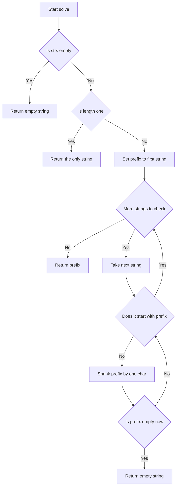
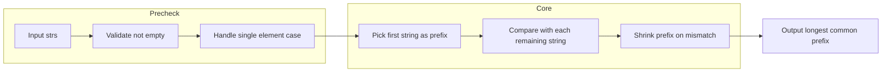

# Longest Common Prefix - 複数文字列の共通接頭辞を求める（Python/TypeScript/Go/Rust実装比較）

<h2 id="toc">目次</h2>

- [概要](#overview)
- [アルゴリズム要点（TL;DR）](#tldr)
- [図解](#figures)
- [正しさのスケッチ](#correctness)
- [計算量](#complexity)
- [Python 実装](#impl)
- [TypeScript 実装](#impl-ts)
- [Go 実装](#impl-go)
- [Rust 実装](#impl-rust)
- [言語間比較](#comparison)
- [CPython最適化ポイント](#cpython)
- [エッジケースと検証観点](#edgecases)
- [FAQ](#faq)

---

<h2 id="overview">概要</h2>

> 💡 **初学者向け補足**：この問題は、一言で言うと「複数の文字列を先頭から見比べて、全員が同じ文字を並べている部分（接頭辞）だけを取り出す問題」です。

**問題（LeetCode 14. Longest Common Prefix）**：文字列の配列 `strs` が与えられたとき、すべての文字列に共通する最長の接頭辞（先頭部分）を返してください。共通する接頭辞が存在しない場合は、空文字列 `""` を返します。

- **入力**: 文字列のリスト `strs`（`1 <= strs.length <= 200`、`0 <= strs[i].length <= 200`、非空なら小文字の英字のみ）
- **出力**: 全文字列に共通する最長の接頭辞（`str`）
- **代表例**:
    - `["flower", "flow", "flight"]` → `"fl"`
    - `["dog", "racecar", "car"]` → `""`

この問題が難しく感じられるポイントは2つあります。1つ目は「共通接頭辞の長さが、文字列の本数が増えるほど短くなっていく」という性質を効率よく扱う必要がある点です。2つ目は、空文字列や要素数1件などの**境界的な入力（エッジケース）**を見落とすと、実装が一見正しく動いているように見えても特定の入力でだけ誤った結果を返してしまう点です。この2点を意識しながら、Python・TypeScript・Go・Rustの4言語でそれぞれの言語の特性を活かした実装を行います。

> 📖 **この章で登場した用語**
>
> - **制約**：入力として与えられる値の範囲や条件のこと。例：「文字列の長さは0以上200以下」
> - **正当性**：アルゴリズムが常に正しい答えを返すことの保証
> - **エッジケース**：空文字列・要素数1件・全要素一致など、境界的な条件の入力

---

<h2 id="tldr">アルゴリズム要点（TL;DR）</h2>

> 💡 **初学者向け補足**：TL;DR（Too Long; Didn't Read、＝長くて読めない人向けの要約）とは、アルゴリズム全体の戦略を先にざっくり掴むための章です。「なんとなくこういう手順で解くんだな」というイメージを持てればOKです。詳細は後の章で説明します。

- **戦略**: 先頭の文字列を「共通接頭辞の候補」として仮に置き、残りの文字列と1つずつ比較しながら候補を縮めていく**水平走査**を採用します。なぜこの戦略を選ぶかというと、追加のデータ構造（ヒープやマップなど）を必要とせず、文字列比較の組み込み機能（`str.startswith` や `strings.HasPrefix` など）だけで実装でき、4言語すべてで最もシンプルかつ効率的に書けるからです。
- **データ構造**: 追加のデータ構造は使わず、文字列そのものと「候補の長さ」を表す整数だけで完結します。
- **計算量**: 時間計算量 O(S)（S = 全文字列の合計文字数）、空間計算量 O(1)（出力用の文字列を除く）。
- **メモリ**: 候補を「新しい文字列を作って縮める」のではなく「範囲（スライス）を狭める」ことで、余計なメモリ確保を最小限に抑えます。

> 📖 **この章で登場した用語**
>
> - **TL;DR**：「長くて読めない人向けの要約」を意味する略語
> - **水平走査**：1つの文字列を基準にして、他の文字列と丸ごと比較しながら接頭辞を縮めていく方法
> - **スライス**：文字列や配列の一部分（範囲）だけを、コピーを作らずに参照する操作

---

<h2 id="figures">図解</h2>

> 💡 **初学者向け補足**：図はアルゴリズムの「処理の流れ」を視覚的に示したものです。フローチャートでは、ひし形（`{}`）は条件分岐を、長方形（`[]`）は処理ステップを表します。矢印をたどることで、入力から出力までの道筋を追うことができます。

### フローチャート

この図は、`longestCommonPrefix` 関数が入力を受け取ってから結果を返すまでの処理の流れを表しています。上から下へ読み進めてください。



主要なノードの意味：

- `Start[Start solve]`：アルゴリズムの入り口。`strs` を受け取る。
- `CheckEmpty{Is strs empty}`：配列が空かどうかを判定する条件分岐。空なら共通接頭辞は定義できないため空文字列を返す。
- `CheckOne{Is length one}`：要素数が1件だけかを判定する。1件ならその文字列自体が答え。
- `InitPrefix[Set prefix to first string]`：先頭の文字列を「候補」として仮に置くステップ。
- `Loop{More strings to check}`：まだ比較していない文字列が残っているかを確認する条件分岐。
- `Match{Does it start with prefix}`：現在の文字列が候補で始まっているかを判定する条件分岐。
- `Shrink[Shrink prefix by one char]`：候補を1文字だけ短くする処理。
- `CheckZero{Is prefix empty now}`：候補が空になったかを判定する。空になれば共通部分は無いと確定する。

### データフロー図

この図は、入力データがどのように変換されて最終的な出力になるかを表しています。



主要な流れの説明：

- `Input strs` から `Validate not empty` へ：まず配列が空でないかを確認する。
- `Handle single element case` から `Pick first string as prefix` へ：要素数1件のケースを先に処理してから、通常のメインロジックに入る。
- `Compare with each remaining string` から `Shrink prefix on mismatch` へ：不一致が見つかるたびに候補を縮め、最終的に全員に共通する部分だけが残る。

> 💡 **代表例でのトレース**：`["flower", "flow", "flight"]` を入力として、上記フローチャートをどう通過するか示します。

```
Step 1: Start → strs = ["flower", "flow", "flight"]
Step 2: CheckEmpty → 空ではない → No
Step 3: CheckOne → 要素数3 → No
Step 4: InitPrefix → prefix = "flower"
Step 5: Loop → "flow" が残っている → Yes
Step 6: TakeNext → current = "flow"
Step 7: Match → "flow".startswith("flower") → No
Step 8: Shrink → prefix = "flowe" → CheckZero → No → Match再判定
        （"flowe"→"flow" まで縮小してMatch成立）
Step 9: Loop → "flight" が残っている → Yes
Step 10: TakeNext → current = "flight"
Step 11: Match → "flight".startswith("flow") → No
Step 12: Shrink → "flo"→"fl" まで縮小してMatch成立
Step 13: Loop → 残りなし → No
結果: prefix = "fl" を返す
```

> 📖 **この章で登場した用語**
>
> - **フローチャート**：処理の手順を図形と矢印で表したもの。ひし形＝条件分岐、長方形＝処理
> - **データフロー図**：データがどのように変換・移動するかを示す図
> - **サブグラフ**：フローチャートの中で関連する処理をグループ化したもの

---

<h2 id="correctness">正しさのスケッチ</h2>

> 💡 **初学者向け補足**：「正しさのスケッチ」とは、アルゴリズムが**常に正しい答えを返すことの根拠**を整理したものです。数学的な証明ではなく「なぜ正しいと言えるか」の直感的な説明です。

- **不変条件（＝処理中ずっと成り立ち続けるべき条件）**: ループの各時点で、変数 `prefix`（候補）は「これまでに走査した文字列すべてに共通する接頭辞」であり続けます。例えば `["flower", "flow", "flight"]` の走査中、`"flow"` を処理し終えた時点では `prefix = "flow"` が `"flower"` と `"flow"` の両方に共通する接頭辞であることが保証されています。
- **網羅性（＝すべてのケースをもれなく処理できているという保証）**: すべての文字列を1つずつ走査し、各文字列に対して候補が一致するまで縮める処理を行うため、どの文字列も見逃されません。
- **基底条件（＝再帰やループの終了条件）**: 候補の長さが0になった時点（＝`prefix == ""`）で、これ以上共通部分がないことが確定するため即座に処理を打ち切ります。これは「空文字列との共通部分は必ず0文字である」という直感とも一致します。
- **終了性（＝アルゴリズムが必ず有限ステップで終わるという保証）**: 候補の長さは1文字ずつ単調に減少し、文字列の走査回数も有限（最大200件）であるため、無限ループに陥ることはありません。

> 📖 **この章で登場した用語**
>
> - **不変条件**：アルゴリズムが正しく動くために、処理中ずっと成り立ち続けるべき条件
> - **基底条件**：ループや再帰の終了条件。これがないと無限ループになる
> - **終了性**：アルゴリズムが必ず有限ステップで終わるという保証
> - **網羅性**：すべてのケースをもれなく処理できているという保証

---

<h2 id="complexity">計算量</h2>

> 💡 **初学者向け補足**：計算量とは「入力が大きくなるにつれて、処理にかかる時間・メモリがどう増えるか」の目安です。

| 記法         | 意味                    | 直感的なイメージ               |
| ------------ | ----------------------- | ------------------------------ |
| `O(1)`       | 入力サイズによらず一定  | 辞書で直接ページを開く         |
| `O(n)`       | 入力に比例して増加      | リストを端から順に読む         |
| `O(S)`       | 全文字数Sに比例して増加 | すべての文字を1回ずつ読む      |
| `O(n log n)` | nよりやや速く増加       | 辞書を二分探索で引く&times;n回 |

この問題では、以下の計算量になります。

- **時間計算量**: O(S) （S = 全文字列の合計文字数。最大でも200 &times; 200 = 40,000文字程度）
- **空間計算量**: O(1) （出力用の文字列を除き、追加のメモリはほぼ使わない）

**in-place vs Pure 比較表**

| アプローチ                                                         | 特徴                                                         | 本問題での該当箇所                                       |
| ------------------------------------------------------------------ | ------------------------------------------------------------ | -------------------------------------------------------- |
| in-place（＝新しいメモリを確保せず元のデータを直接書き換える操作） | 候補の「長さ」だけを整数で管理し、新しい文字列を都度作らない | Go / Rust 版の `prefix[:i]` スライス式による縮小         |
| Pure（＝入力を変更せず新しいデータを返す操作）                     | 元の入力配列 `strs` は一切書き換えない                       | 4言語すべての実装（`strs` 自体はどの言語でも不変のまま） |

> 📖 **この章で登場した用語**
>
> - **時間計算量**：入力の大きさに対して処理にかかる手間がどう増えるかの目安
> - **空間計算量**：処理中に使うメモリ量がどう増えるかの目安
> - **in-place**：新しいメモリを確保せず元のデータを直接書き換える操作。空間計算量を抑えられる
> - **Pure**：入力を変更せず新しいデータを返す操作。安全だがメモリを余分に使う

---

<h2 id="impl">Python 実装</h2>

> 💡 **初学者向け補足**：コードを読む前に、実装の全体的な骨格を示します。
>
> 1. `strs` が空でないかを確認する
> 2. 要素が1件だけならそれをそのまま返す（エッジケース処理）
> 3. `zip(*strs)` で同じ位置の文字を束ね、`set` で全員一致か判定する垂直走査を行う
> 4. 一致した文字だけをリストに集め、最後に `"".join()` で結合して返す

Pythonでは、前の回答で比較検討した通り「垂直走査（`zip` + `set`）」を採用しています。`zip(*strs)` は最短の文字列の長さで自動的にイテレーションが止まるため、範囲チェックを自前で書く必要がありません。`List[str]` のような型ヒントは、pylance（VSCodeの型チェッカー）が実行前に型の誤りを検出できるようにするためのものです。

```python
from __future__ import annotations

from typing import List


class Solution:
    def longestCommonPrefix(self, strs: List[str]) -> str:
        # 入力検証：空配列なら共通する接頭辞は定義できないため、空文字列を返す。
        # ここで弾いておかないと、後続の zip(*strs) が何も生成せず
        # 意図が分かりにくいコードになってしまう。
        if not strs:
            return ""

        # エッジケース：要素が1つだけならそれ自体が唯一の共通接頭辞になる。
        if len(strs) == 1:
            return strs[0]

        # 垂直走査：zip(*strs) は「複数の文字列を同じ位置ごとに束ねる」組み込み関数。
        # 例: zip("flow", "flower") → ('f','f'), ('l','l'), ('o','o'), ('w','w')
        # 最短の文字列の長さで自動的に止まるため、
        # 「最長共通接頭辞は最短文字列の長さを超えられない」という性質と噛み合っている。
        prefix_chars: List[str] = []
        for chars in zip(*strs):
            # set(chars) で重複を除いた集合を作り、サイズが1なら全員同じ文字。
            if len(set(chars)) == 1:
                prefix_chars.append(chars[0])
            else:
                # 1文字でも異なればそれ以上は共通しないため打ち切る（早期終了）。
                break

        # "".join() でリストを1つの文字列に結合する。
        # 文字列はイミュータブル（一度作ったら変更できない）なので、
        # + での逐次連結より効率的。
        return "".join(prefix_chars)
```

> 💡 **コードの動作トレース**（初学者向け）
>
> ```
> 入力: strs = ["flower", "flow", "flight"]
> Step 1: not strs → False（空ではない）
> Step 2: len(strs) == 1 → False（エッジケースではない）
> Step 3: zip(*strs) は最短の "flow"（4文字）で止まる
>   index0: ('f','f','f') → set サイズ1 → prefix_chars=['f']
>   index1: ('l','l','l') → set サイズ1 → prefix_chars=['f','l']
>   index2: ('o','o','i') → set サイズ2 → break
> 結果: "".join(['f','l']) = "fl"
> ```

> 📖 **この章で登場した用語**
>
> - **`from __future__ import annotations`**：型ヒントの評価を遅延させる宣言。前方参照を書きやすくする
> - **`zip()`**：複数のイテラブルを同じ位置同士でペアにまとめる組み込み関数。最も短いものの長さで自動的に止まる
> - **`set()`**：重複を許さない集合を作る組み込み関数。「全部同じ値か」を`len(set(...))==1`で一発判定できる
> - **`List[str]`**：「文字列のリスト」を表す型ヒント

---

<h2 id="impl-ts">TypeScript 実装</h2>

> 💡 **初学者向け補足**：TypeScript版では、Pythonの「垂直走査」とは異なる**水平走査**（先頭文字列を基準に縮めていく方式）を採用しています。どちらも計算量はO(S)ですが、V8エンジン（Node.jsが使うJavaScriptエンジン）に最適化された `startsWith` メソッドを活かせる点でこちらを選びました。

先頭の文字列を候補 `prefix` として仮に置き、`String.prototype.startsWith`（C++実装で高速な組み込みメソッド）で他の文字列と照合しながら1文字ずつ縮めていきます。`readonly string[]` という型注釈は、「この関数の中では配列を書き換えない」という約束をコンパイラに伝えるためのものです。

```typescript
/**
 * 複数の文字列に共通する最長の接頭辞を求める。
 * 先頭の文字列を候補とし、他の文字列が候補で始まっているかを
 * startsWith で確認しながら、始まっていなければ候補を1文字ずつ縮める。
 *
 * @param strs - 共通接頭辞を調べたい文字列の配列（読み取り専用）
 * @returns 全文字列に共通する最長の接頭辞。共通部分が無ければ空文字列。
 * @throws {TypeError} strs が配列でない、または要素に文字列以外が含まれる場合
 * @throws {RangeError} strs が空配列の場合
 * @complexity Time: O(S), Space: O(1)
 */
function longestCommonPrefix(strs: readonly string[]): string {
    // 型ガード：実行時にも配列かどうかを確認する。
    // TypeScript の型注釈はコンパイル時にしか効かないため、二重の安全策として必要。
    if (!Array.isArray(strs)) {
        throw new TypeError('strs must be an array of strings');
    }
    if (strs.length === 0) {
        throw new RangeError('strs must contain at least one string');
    }
    if (!strs.every((s): s is string => typeof s === 'string')) {
        throw new TypeError('All elements of strs must be strings');
    }

    // エッジケース：要素が1つだけならそれ自体が答え。
    if (strs.length === 1) {
        return strs[0];
    }

    // 先頭の文字列を候補として仮置きする。
    let prefix: string = strs[0];

    for (let i = 1; i < strs.length; i++) {
        const current: string = strs[i];

        // startsWith は「current が prefix で始まっているか」を判定する。
        while (!current.startsWith(prefix)) {
            // slice で末尾1文字を除いた新しい候補を作る。
            // 文字列はイミュータブルなので、実際には短い新しい文字列に代入し直している。
            prefix = prefix.slice(0, prefix.length - 1);

            // 候補が空になれば共通部分は無いと確定するため即座に返す。
            if (prefix === '') {
                return '';
            }
        }
    }

    return prefix;
}
```

> 💡 **コードの動作トレース**（初学者向け）
>
> ```
> 入力: strs = ["flower", "flow", "flight"]
> prefix = "flower"
> i=1, current="flow": "flow".startsWith("flower") → false
>   → "flowe" → false → "flow" → true
> i=2, current="flight": "flight".startsWith("flow") → false
>   → "flo" → false → "fl" → true
> 結果: "fl"
> ```

> 📖 **この章で登場した用語**
>
> - **`readonly`**：配列や変数の値を変更できないようにする修飾子。JavaScriptにはない、TypeScript独自のコンパイル時チェック機能
> - **型ガード**：`typeof` や `Array.isArray` などで実行時に値の型を確認し、その情報をもとに型を絞り込む仕組み
> - **`startsWith`**：文字列が指定した接頭辞で始まっているかを判定する組み込みメソッド

---

<h2 id="impl-go">Go 実装</h2>

> 💡 **初学者向け補足**：Go版もTypeScript版と同じ「水平走査」を採用しています。Goには例外機構（`try-catch`）が無く、代わりにエラーを戻り値として返す設計が慣習になっています。LeetCode提出用の関数はエラーを返さず空文字列で異常系を表現しています。

Goの文字列（`string`）はイミュータブルなバイト列です。`prefix[:len(prefix)-1]` のようなスライス式は、新しいバイト列をコピーせず「範囲」だけを変更するため、追加のメモリ確保（アロケーション）がほとんど発生しません。`strings.HasPrefix` は標準ライブラリの比較関数で、自前でバイトループを書くより可読性と信頼性が高くなります。

```go
package main

import "strings"

// longestCommonPrefix は複数の文字列に共通する最長の接頭辞を求める。
// 先頭の文字列を候補とし、strings.HasPrefix で他の文字列と照合しながら
// 一致しなければ候補を1文字ずつ縮める（水平走査）。
//
// Time Complexity: O(S)  S = 全文字列の合計バイト数
// Space Complexity: O(1)
func longestCommonPrefix(strs []string) string {
	// エッジケース：空スライスなら空文字列を返す。
	// strs[0] へ直接アクセスするとパニック（範囲外アクセス）になるため事前に確認する。
	if len(strs) == 0 {
		return ""
	}

	// 先頭の文字列を候補として仮置きする。
	prefix := strs[0]

	// 2番目以降の文字列を順にチェックしながら候補を縮めていく。
	for i := 1; i < len(strs); i++ {
		current := strs[i]

		// current が prefix で始まらなくなるまで、prefix を1文字ずつ短くする。
		for !strings.HasPrefix(current, prefix) {
			// スライス式で末尾1文字を除いた範囲を指す。新しいコピーは作らない。
			prefix = prefix[:len(prefix)-1]

			// 候補が空文字列になれば、共通部分は無いと確定し即座に返す。
			if prefix == "" {
				return ""
			}
		}
	}

	return prefix
}
```

> 💡 **コードの動作トレース**（初学者向け）
>
> ```
> 入力: strs = []string{"flower", "flow", "flight"}
> prefix = "flower"
> i=1, current="flow": HasPrefix("flow","flower") → false
>   → "flowe" → false → "flow" → true
> i=2, current="flight": HasPrefix("flight","flow") → false
>   → "flo" → false → "fl" → true
> 結果: "fl"
> ```

> 📖 **この章で登場した用語**
>
> - **`error` 戻り値**：JavaやPythonの例外と異なり、Goはエラーを戻り値として返す設計が基本。LeetCode提出用の関数では簡潔さのため使っていない
> - **`strings.HasPrefix`**：ある文字列が指定した接頭辞で始まっているかを判定する標準ライブラリ関数
> - **スライス式 `s[:i]`**：文字列の一部の「範囲」だけを新しいヘッダとして取り出す構文。バイト列自体はコピーされない
> - **パニック**：Goで回復不能なエラーが発生した際に起きる強制終了

---

<h2 id="impl-rust">Rust 実装</h2>

> 💡 **初学者向け補足**：Rust版も水平走査を採用していますが、所有権（＝値を"誰が管理するか"をコンパイル時に決める仕組み）の扱いが他の3言語と大きく異なります。LeetCodeのシグネチャは `Vec<String>` を引数に取り、この関数がその所有権を受け取りますが、内部処理は `&str`（文字列スライスへの参照）だけで完結させ、無駄な複製（`clone`）を避けています。

候補の管理には `String` そのものではなく `usize`（符号なし整数）型の `prefix_len` を使い、「候補として認めているバイト数」だけを追跡します。これにより、候補を縮める操作はヒープへのアクセスを伴わない、スタック上の単純な整数の更新だけで完結します。

```rust
impl Solution {
    /// 複数の文字列に共通する最長の接頭辞を求める。
    /// 先頭の文字列を候補とし、starts_with で他の文字列と照合しながら
    /// 一致しなければ候補の長さ prefix_len を1ずつ縮める（水平走査）。
    ///
    /// # Complexity
    /// - Time: O(S)  S = 全文字列の合計バイト数
    /// - Space: O(1) （戻り値の String を除く）
    pub fn longest_common_prefix(strs: Vec<String>) -> String {
        // エッジケース：空 Vec なら空文字列を返す。
        if strs.is_empty() {
            return String::new();
        }

        // エッジケース：要素が1つならそれ自体が答え。
        if strs.len() == 1 {
            return strs[0].clone();
        }

        // 先頭の文字列を &str として借用し、候補の長さを prefix_len で管理する。
        // 所有権を移動させないため、strs はこの後も生きたまま使える。
        let first: &str = strs[0].as_str();
        let mut prefix_len: usize = first.len();

        // 2番目以降の文字列を順にチェックしながら候補を縮めていく。
        for s in strs.iter().skip(1) {
            let current: &str = s.as_str();

            while !current.starts_with(&first[..prefix_len]) {
                // 候補の長さを1減らす。新しい String は作らず整数を更新するだけ。
                prefix_len -= 1;

                // 候補が空になれば共通部分は無いと確定し即座に返す。
                if prefix_len == 0 {
                    return String::new();
                }
            }
        }

        // 確定した prefix_len 分だけ切り出し、to_string() で所有権を持つ String に変換する。
        first[..prefix_len].to_string()
    }
}
```

> 💡 **コードの動作トレース**（初学者向け）
>
> ```
> 入力: strs = vec!["flower", "flow", "flight"]（String化済み）
> first = "flower", prefix_len = 6
> s="flow": starts_with("flower"[..6]) → false
>   prefix_len=5→"flowe"→false, prefix_len=4→"flow"→true
> s="flight": starts_with("flower"[..4]="flow") → false
>   prefix_len=3→"flo"→false, prefix_len=2→"fl"→true
> 結果: "flower"[..2].to_string() = "fl"
> ```

> 📖 **この章で登場した用語**
>
> - **所有権**：値を"誰が管理するか"をコンパイル時に決めるRust独自の仕組み
> - **借用**：所有権を渡さずに値を参照する仕組み（`&T`）
> - **`usize`**：符号なし整数型。配列のインデックスや長さに使われる
> - **`to_string()`**：`&str` から新しい `String` を作る（ヒープにコピーする）メソッド

---

<h2 id="comparison">言語間比較</h2>

> 💡 **初学者向け補足**：同じアルゴリズム（水平走査、またはPythonのみ垂直走査）でも、言語ごとに「メモリの扱い方」や「エラーの表現方法」が異なります。ここでは4言語の実装を横並びで比較し、それぞれの言語特有の設計判断を振り返ります。

| 観点                 | Python                            | TypeScript                                     | Go                                 | Rust                                                         |
| -------------------- | --------------------------------- | ---------------------------------------------- | ---------------------------------- | ------------------------------------------------------------ |
| 採用アルゴリズム     | 垂直走査（`zip`+`set`）           | 水平走査（`startsWith`）                       | 水平走査（`strings.HasPrefix`）    | 水平走査（`starts_with`、長さのみ管理）                      |
| 候補の縮め方         | 文字を1つずつリストに集める       | `slice` で新しい文字列を再代入                 | スライス式 `s[:i]` で範囲を変更    | `usize` の整数だけを更新                                     |
| メモリ確保の特徴     | `"".join()` で最後に1回結合       | `slice` のたびに新しい文字列（イミュータブル） | スライス式はコピーなし             | 整数更新のみ、最後に `to_string()` で1回だけ確保             |
| エラー表現           | `TypeError` / `ValueError` の例外 | `TypeError` / `RangeError` の例外              | `error` 戻り値（LeetCode版は省略） | `Result<T, E>` が定石だが、戻り値型固定のため空文字列で表現  |
| 所有権・参照の考え方 | 該当なし（GC管理）                | 該当なし（GC管理）                             | 該当なし（GC管理）                 | `&str` による借用で `Vec<String>` の所有権を保持したまま処理 |
| 型安全性の担保方法   | 型ヒント + pylance                | `readonly` + 型ガード                          | 明示的な型宣言 + `go vet`          | 所有権システム + コンパイラチェック                          |

**共通点**: どの言語でも計算量は O(S)（S = 全文字列の合計文字数）であり、追加のヒープ確保を最小限に抑える設計を採っている点は共通しています。

**相違点の背景**: PythonとTypeScript、GoはGC（ガベージコレクション）付きの言語であるため、文字列の縮小操作で新しいオブジェクトが生成されてもGCが後始末をしてくれます。一方Rustにはガベージコレクタが無く、コンパイル時に所有権を追跡する仕組みがあるため、「新しい文字列を作らず整数だけを更新する」という、より低レベルなメモリ効率を意識した設計が自然に選ばれます。

> 📖 **この章で登場した用語**
>
> - **GC（ガベージコレクション）**：使い終わったメモリを自動で回収する仕組み。Python・TypeScript（JavaScript）・Goが持つ
> - **所有権システム**：Rust独自の、コンパイル時にメモリの管理者を1つに定める仕組み。GC不要でメモリ安全性を実現する

---

<h2 id="cpython">CPython最適化ポイント</h2>

> 💡 **初学者向け補足**：この章では「同じ処理でもPythonの書き方によって速さが変わる理由」を説明します。最適化テクニックは「最適化前 → 最適化後 → なぜ速くなるか」の3点セットで見ていきます。

```python
# 最適化前：文字列を + で逐次連結する
# str はイミュータブルなので、+= のたびに新しいオブジェクトが作られ直す
prefix = ""
for ch in prefix_chars:
    prefix += ch

# 最適化後：リストに集めてから join で一括結合する
prefix = "".join(prefix_chars)
# 理由：join は内部で必要なメモリサイズを事前に計算してから
#       1回だけ確保するため、逐次連結よりアロケーション回数が少ない
```

- **組み込み関数の活用**: `zip()` と `set()` はどちらもC言語で実装された組み込み機能であり、Pythonレベルのループより高速です。
- **早期終了**: 不一致が見つかった時点で `break` することで、それ以上の無駄な走査を避けています。
- **`zip` の自動停止**: `zip(*strs)` は最短の文字列の長さで自動的に止まるため、`min(len(s) for s in strs)` を自前で計算する手間が省けます。

> 📖 **この章で登場した用語**
>
> - **アロケーション**：新しいメモリ領域を確保する操作。頻繁に行うと処理が遅くなる
> - **早期終了**：それ以上調べても答えが変わらないと分かった時点で処理を打ち切ること
> - **`join()`**：文字列のリストを1つの文字列に結合する組み込みメソッド

---

<h2 id="edgecases">エッジケースと検証観点</h2>

> 💡 **初学者向け補足**：エッジケースとは「入力が空・最小値・最大値・重複あり」など、通常とは異なる境界的な入力のことです。エッジケースを見落とすと、普通のテストは通るのに特定の入力でだけバグが発生します。

| エッジケース       | 入力例                       | なぜ問題になりうるか                                                                         | 期待される結果     |
| ------------------ | ---------------------------- | -------------------------------------------------------------------------------------------- | ------------------ |
| 空配列             | `[]`                         | 先頭要素 `strs[0]` へのアクセスがインデックスエラー（Go/Rustではパニック）になる可能性がある | 空文字列 `""`      |
| 要素数1件          | `["a"]`                      | ループに一度も入らないため、特別扱いしないと実装によっては空文字列を返してしまう恐れがある   | `"a"`              |
| 空文字列を含む     | `["", "abc"]`                | 候補の初期長さが0になるため、比較ループの扱いを誤ると想定外の挙動になりやすい                | `""`               |
| 全要素完全一致     | `["abc", "abc", "abc"]`      | 候補が一度も縮まらないケースであり、ループを抜ける条件が正しいか確認が必要                   | `"abc"`            |
| 先頭文字から不一致 | `["dog", "racecar", "car"]`  | 最初の比較で候補がすぐ空になるケース。早期終了が正しく機能するか確認できる                   | `""`               |
| 最大規模           | 200個・各200文字がすべて一致 | 計算量がO(S)であることを確認する規模。最大4万文字でも一瞬で終わるべき                        | 全文字列と同じ内容 |

> 📖 **この章で登場した用語**
>
> - **エッジケース**：空の配列・要素1つ・最大サイズ入力など、境界的な条件の入力
> - **境界値**：制約の上限・下限にあたる値
> - **インデックスエラー**：配列や文字列の範囲外の要素にアクセスしようとしたときのエラー

---

<h2 id="faq">FAQ</h2>

**Q1. なぜPythonだけ「垂直走査」で、他の3言語は「水平走査」を使っているのですか？**

結論：Pythonは `zip()` と `set()` という強力な組み込み機能があるため垂直走査が最も簡潔に書けますが、他の3言語ではこれに相当する機能がないため水平走査の方がシンプルになるからです。

理由：垂直走査を他の言語で実装しようとすると、「複数の文字列を同じ位置で束ねるイテレータ」を自作する必要があり、かえってコードが複雑になります。一方、水平走査は「1つの文字列を基準に比較する」というシンプルな考え方で、`startsWith` / `HasPrefix` / `starts_with` のような各言語の標準機能とそのまま噛み合います。

補足：どちらのアプローチも計算量はO(S)で同じであり、優劣があるわけではなく「その言語の標準ライブラリと最も相性が良い書き方」を選んでいます。

**Q2. Rust版だけ、候補を文字列ではなく整数（`prefix_len`）で管理しているのはなぜですか？**

結論：Rustの所有権システムのもとでは、文字列を何度も作り直すより、整数1つを更新する方がシンプルで効率的だからです。

理由：`String` を毎回作り直すと、そのたびにヒープへの確保・解放のコストがかかります。`usize` の整数だけを更新すれば、スタック上の値の書き換えだけで済み、余計なアロケーションが発生しません。

補足：TypeScript版やGo版でも実は近い発想（`slice` によるコピーなしの範囲操作）を使っていますが、Rustでは所有権の制約がより厳格なため、整数管理という形でその発想がさらに徹底されています。

**Q3. なぜ Python・TypeScript・Rust の3言語では「要素数1件」のケースを明示的にチェックしているのですか？**

結論：Python・TypeScript・Rust の3言語では、要素数1件のケースを明示的にアーリーリターンさせることで不要な処理をスキップし、コードの意図を明確にしています。一方、Go言語実装では `1 < len(strs)` のループ条件により、要素数1件の場合はループに入らずそのまま `prefix`（`strs[0]`）を返す構造となっています。

理由：Python・TypeScript・Rust の実装では、要素数1件のケースで即座に先頭要素を返すことで無用なイテレーションやオブジェクト生成を抑え、エッジケース処理の意図を明示しています。

補足：Go言語実装でも `len(strs) == 0` の境界値チェック後に `prefix := strs[0]` とし、`for i := 1; i < len(strs); i++` の3部構成ループに入ります。要素が1件の場合は条件式が偽となりループの中身が一度も実行されずに `prefix` が返るため、各言語の設計スタイルに合致した正確な動作となります。

**Q4. `startsWith` や `HasPrefix` を使わずに、1文字ずつ比較するループを自分で書いてはダメなのですか？**

結論：動作としては問題ありませんが、標準ライブラリの比較関数を使う方が可読性・信頼性ともに優れているため推奨しません。

理由：`startsWith` や `strings.HasPrefix` は各言語のランタイムやコンパイラによって十分に最適化された実装であり、自前でバイト単位のループを書くよりバグが入り込む余地が少なくなります。

補足：競技プログラミングのように1マイクロ秒単位の速度を争う場面では自前ループが有利になることもありますが、この問題の制約規模（最大4万文字程度）では両者の速度差は無視できるレベルです。

> 📖 **この章で登場した用語**
>
> - **FAQ**：Frequently Asked Questions の略。よくある質問と回答のこと
> - **トレードオフ**：何かを得ると何かを失う関係。例：速さを得るとメモリが増える
