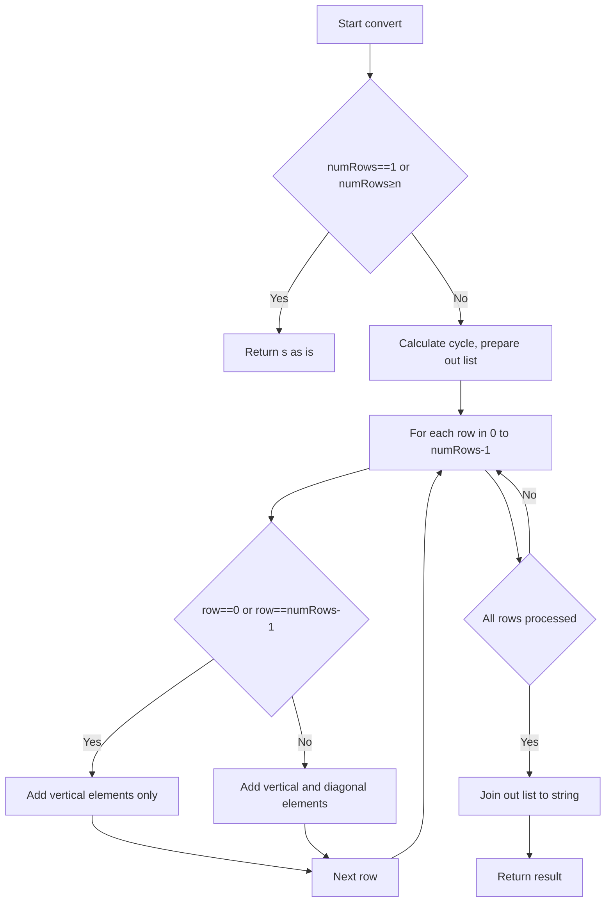
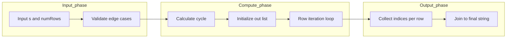

# Zigzag Conversion - 周期式による行別直接抽出

<h2 id="toc">目次</h2>

- [概要](#overview)
- [アルゴリズム要点（TL;DR）](#tldr)
- [図解](#figures)
- [正しさのスケッチ](#correctness)
- [計算量](#complexity)
- [Python 実装](#impl)
- [CPython 最適化ポイント](#cpython)
- [エッジケースと検証観点](#edgecases)
- [FAQ](#faq)

---

<h2 id="overview">概要</h2>

文字列 `s` を `numRows` 行のジグザグパターンで配置し、各行を左から右へ読み出して連結した文字列を返す問題です。

**要件**:

- **正当性**: すべての文字を正しい行順で出力
- **安定性**: 同一行内の文字の相対順序を保持
- **制約**: `1 <= len(s) <= 1000`, `1 <= numRows <= 1000`

**戦略**: 周期 `cycle = 2*(numRows-1)` を用いて各行の文字インデックスを直接計算し、O(n)で走査します。

---

<h2 id="tldr">アルゴリズム要点（TL;DR）</h2>

- **周期式**: ジグザグの周期は `cycle = 2*(numRows-1)`
- **端行（0 行目、最終行）**: `i = row + k*cycle` のみ
- **中間行**: 縦成分 `i` に加えて斜め成分 `i + (cycle - 2*row)` を追加
- **データ構造**: 固定長リスト `out` にインデックス代入 → `''.join(out)`
- **計算量**: Time O(n)、Space O(1)（出力バッファ除く）
- **メモリ効率**: 補助領域は定数個のみ

---

<h2 id="figures">図解</h2>

## フローチャート



**説明**:

- 特殊ケース（`numRows==1` または `numRows>=n`）を早期判定
- 各行について、端行は縦成分のみ、中間行は縦＋斜めの両方を出力リストに追加
- 最後に結合して返却

### データフロー図



**説明**:

- 入力検証後、周期を計算
- 各行のインデックスを周期式で直接取得し、出力リストに格納
- 最終的に文字列結合で出力

---

<h2 id="correctness">正しさのスケッチ</h2>

**不変条件**:

- 各行 `row` について、縦成分インデックス `i = row + k*cycle` (k=0,1,2,...) は必ず正しい周期で出現
- 中間行の斜め成分 `diag = i + (cycle - 2*row)` も周期内で一意に定まる

**網羅性**:

- すべての文字 `s[0]` から `s[n-1]` は、いずれかの行の縦成分または斜め成分として正確に 1 回ずつ出力リストに追加される

**基底条件**:

- `numRows == 1`: ジグザグ無し → そのまま返す
- `numRows >= n`: すべての文字が縦一列 → そのまま返す

**終了性**:

- 各行のループは `i < n` で終了し、全行を走査後に終了

---

<h2 id="complexity">計算量</h2>

| 項目           | 値   | 備考                                      |
| -------------- | ---- | ----------------------------------------- |
| **時間計算量** | O(n) | 各文字を 1 回ずつ走査                     |
| **空間計算量** | O(1) | 出力バッファ `out` を除く補助領域は定数個 |

**比較**:

- **方法 A（採用）**: 周期式で直接抽出 → O(n) / O(1)
- **方法 B（非採用）**: 行番号タグ付けソート → O(n log n) / O(n)
- **方法 C（非採用）**: 2D 配置 → O(n²) / O(n²)

---

<h2 id="impl">Python実装</h2>

```python
from __future__ import annotations
from typing import TYPE_CHECKING

if TYPE_CHECKING:
    pass


class Solution:
    """
    LeetCode 6. Zigzag Conversion
    - 競技向け: convert() は高速版を直接呼び出し
    - 実務向け: 必要に応じて _validate_inputs() を有効化
    """

    def convert(self, s: str, numRows: int) -> str:
        """
        文字列を numRows 行のジグザグ配置で並べ替え、行ごとに読み出す。

        Args:
            s: 変換対象の文字列（長さ 1..1000）
            numRows: 行数（1..1000）

        Returns:
            変換後の文字列

        Time: O(n), Space: O(1) (出力バッファ除く)
        """
        n: int = len(s)

        # 基底条件: ジグザグ不要
        if numRows == 1 or numRows >= n:
            return s

        # 周期: ジグザグの1サイクル = 2*(numRows-1)
        cycle: int = (numRows - 1) * 2
        out: list[str] = [""] * n
        k: int = 0  # 出力リストの書き込み位置

        # ローカル束縛で属性アクセスを削減
        _s = s
        _n = n
        _out = out
        _cycle = cycle
        last_row = numRows - 1

        for row in range(numRows):
            i = row  # 現在行の縦成分の開始インデックス

            if row == 0 or row == last_row:
                # 端行: 斜め成分なし、周期刻みで縦成分のみ
                while i < _n:
                    _out[k] = _s[i]
                    k += 1
                    i += _cycle
            else:
                # 中間行: 縦成分 + 斜め成分
                step_diag = _cycle - (row << 1)  # cycle - 2*row
                while i < _n:
                    # 縦成分
                    _out[k] = _s[i]
                    k += 1
                    # 斜め成分（範囲内なら追加）
                    diag_idx = i + step_diag
                    if diag_idx < _n:
                        _out[k] = _s[diag_idx]
                        k += 1
                    i += _cycle

        return "".join(_out)

    # 実務向け入力検証（LeetCodeでは不要）
    def _validate_inputs(self, s: object, numRows: object) -> None:
        """型検証（実務で必要な場合のみ使用）"""
        if not isinstance(s, str):
            raise TypeError("s must be a string")
        if not isinstance(numRows, int):
            raise TypeError("numRows must be an int")
        n = len(s)
        if not (1 <= n <= 1000):
            raise ValueError("len(s) must be in [1, 1000]")
        if not (1 <= numRows <= 1000):
            raise ValueError("numRows must be in [1, 1000]")
```

**主要ステップ**:

1. **基底条件判定**: `numRows==1` または `numRows>=n` なら元の文字列を返す
2. **周期計算**: `cycle = 2*(numRows-1)`
3. **行別走査**: 各行について縦成分と斜め成分（中間行のみ）を出力リストに追加
4. **結合**: `''.join(out)` で最終文字列を生成

---

<h2 id="cpython">CPython最適化ポイント</h2>

1. **ローカル変数束縛**: ループ内で `s`, `n`, `out`, `cycle` をローカル変数にキャッシュし、属性/グローバル解決コストを削減
2. **固定長リスト**: `out = [''] * n` で事前確保し、インデックス代入により GC 負荷を最小化
3. **ビットシフト**: `row << 1` は `2*row` より高速（ただし可読性とのトレードオフ）
4. **文字列結合**: `''.join(list)` はループ内連結 `+=` より効率的

**注意**: `lru_cache` や `bisect` は本問題では不要（メモ化や二分探索の要素がないため）

---

<h2 id="edgecases">エッジケースと検証観点</h2>

| ケース   | 入力例                            | 期待出力           | 検証ポイント                 |
| -------- | --------------------------------- | ------------------ | ---------------------------- |
| 最小長   | `s="A"`, `numRows=1`              | `"A"`              | 1 文字でも正しく処理         |
| 行数 1   | `s="ABC"`, `numRows=1`            | `"ABC"`            | ジグザグなし                 |
| 行数過多 | `s="AB"`, `numRows=5`             | `"AB"`             | `numRows >= len(s)` で縦一列 |
| 標準例   | `s="PAYPALISHIRING"`, `numRows=3` | `"PAHNAPLSIIGYIR"` | 中間行の斜め成分を正しく処理 |
| 4 行     | `s="PAYPALISHIRING"`, `numRows=4` | `"PINALSIGYAHRPI"` | 複数中間行の処理             |
| 文字種   | `s="A,b.C"`, `numRows=2`          | `"A.Cb,"`          | 大文字小文字、記号を含む     |

**検証方法**:

- 各ケースで手計算と出力を比較
- pylance で型エラーがないことを確認
- LeetCode のテストケースで Accept

---

<h2 id="faq">FAQ</h2>

**Q1: なぜ周期は `2*(numRows-1)` なのか？**
A: ジグザグの 1 往復は、下り `numRows-1` ステップ＋上り `numRows-1` ステップの合計 `2*(numRows-1)` です。

**Q2: 中間行で斜め成分のインデックスはどう決まるか？**
A: 行 `row` の縦成分インデックス `i` に対し、斜め成分は `i + (cycle - 2*row)` です。これは周期内での対称位置に対応します。

**Q3: `out = [''] * n` ではなく `out = []` で `append` ではダメか？**
A: `append` でも動作しますが、事前確保＋インデックス代入の方が GC 負荷が低く、CPython では高速です。

**Q4: 実務で入力検証は必要か？**
A: LeetCode では制約が保証されていますが、実務では `_validate_inputs()` を有効化して型や範囲を検証することを推奨します。

**Q5: 他の言語でも同じアプローチが有効か？**
A: はい。周期式による直接抽出は言語に依存しない汎用的な手法です。C++/Java でも同様に O(n) / O(1) で実装可能です。
