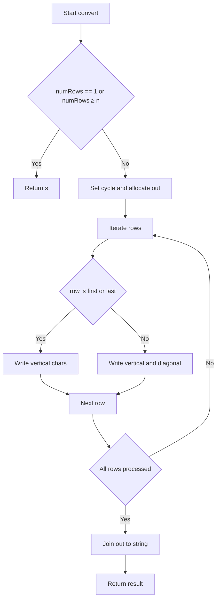
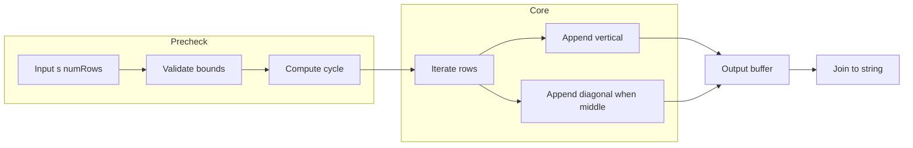

# Zigzag Conversion - 周期で行走査して O(n) で構築

## Table of Contents

- [概要](#overview)
- [アルゴリズム要点 TL;DR](#tldr)
- [図解](#figures)
- [正しさのスケッチ](#correctness)
- [計算量](#complexity)
- [Python 実装](#impl)
- [CPython 最適化ポイント](#cpython)
- [エッジケースと検証観点](#edgecases)
- [FAQ](#faq)

<h2 id="overview">概要</h2>

- **プラットフォーム/ID**: LeetCode 6
- **問題タイトル**: Zigzag Conversion
- **要約**: 文字列 `s` を `numRows` 行にジグザグ配置したとき、上から行単位に読み取った文字列を返す。
- **入出力仕様（簡潔）**:

  - 入力: `s: str`（長さ 1..1000、英字と `,` `.`）、`numRows: int`（1..1000）
  - 出力: 変換後の `str`

- **想定データ構造**: String（一次元）
- **代表例**:

  - `s="PAYPALISHIRING", numRows=3` → `"PAHNAPLSIIGYIR"`
  - `s="PAYPALISHIRING", numRows=4` → `"PINALSIGYAHRPI"`

- **関数シグネチャ**（LeetCode 準拠）:
  `class Solution: def convert(self, s: str, numRows: int) -> str:`
- **アルゴリズム要点**:

  - 周期 `cycle = 2*(numRows-1)` を用いる。
  - 各行 `row` で縦列 `i = row + k*cycle` を拾い、**中間行**は斜め成分 `diag = i + (cycle - 2*row)` も拾う。

- **ターゲット計算量**: Time **O(n)**, Space **O(1)**（出力を除く）
- **エッジケース**: `numRows == 1`、`numRows >= len(s)`、`len(s) == 1` など
- **図ヒント**: フローチャート（基底条件 → 行走査 → 結合）、データフロー（入力 → 前処理 → 主処理 → 出力）

<h2 id="tldr">アルゴリズム要点（TL;DR）</h2>

- 行配列を作らず、**出力用バッファに直接書き込み**して最後に `join`。
- `row=0` と `row=numRows-1` は **斜め成分なし**、中間行のみ **斜め成分あり**。
- 端条件 `numRows == 1` または `numRows >= len(s)` は **早期 return**。
- 追加メモリは定数個の変数のみ（出力を除く）。

<h2 id="figures">図解</h2>

## **フローチャート**



_説明_: 周期 `cycle` を使い、**行ごとに縦要素と必要なら斜め要素を追加していく流れ**。

## **データフロー**



_説明_: 入力を検証し周期を算出、行反復で出力バッファに書き込んで最後に結合。

<h2 id="correctness">正しさのスケッチ</h2>

- **不変条件**: 行 `row` の走査中、`i = row + k*cycle` はジグザグ配置の縦要素を **順序通り** 網羅する。
- **斜め要素の網羅**: 中間行に対して `diag = i + (cycle - 2*row)` は、該当行の斜め位置を一意に指し示す。`diag < n` の判定により過走査を防ぐ。
- **重複排除**: 端行では斜め要素が存在しないため追加しない。中間行では縦と斜めは異なるインデックスであり、重複は生じない。
- **基底条件**: `numRows == 1` または `numRows >= n` のとき、ジグザグ配置は元文字列と等価であり、そのまま返して正しい。
- **終了性**: `i` は `cycle` ずつ増加し有限回で `n` に到達、行ループも有限。必ず終了する。

<h2 id="complexity">計算量</h2>

- **時間計算量**: `O(n)`（各文字は高々一度ずつバッファに書き込まれる）
- **空間計算量**: `O(1)`（出力を除く補助領域は定数。出力は必須で `O(n)`）

> 参考: 行配列に `append` し最後に連結する実装は理解しやすいが、配列管理が増える分だけオーバーヘッドがわずかに増える。本実装は単一バッファに直接書き込む。

<h2 id="impl">Python 実装</h2>

```python
from __future__ import annotations
from typing import Final

class Solution:
    """
    LeetCode 6. Zigzag Conversion
    - Pure: 外部副作用なし
    - 前提: 入力は問題制約を満たす（実務では検証関数の導入を推奨）
    """

    def convert(self, s: str, numRows: int) -> str:
        """
        文字列 s を numRows 行のジグザグに配置し、行ごとに読み出して返す。

        Args:
            s: 変換対象の文字列（長さ 1..1000）
            numRows: 行数（1..1000）

        Returns:
            ジグザグ読みの結果文字列
        """
        n: Final[int] = len(s)
        if numRows == 1 or numRows >= n:
            return s

        cycle: Final[int] = (numRows - 1) * 2  # 2*(numRows-1)
        out: list[str] = [''] * n
        k: int = 0

        # ローカル束縛で属性解決を削減（CPython最適化）
        _s = s
        _n = n
        _out = out
        _k = k
        _cycle = cycle
        last_row: Final[int] = numRows - 1

        for row in range(numRows):
            i = row
            if row == 0 or row == last_row:
                # 端の行: 斜め成分は存在しない
                while i < _n:
                    _out[_k] = _s[i]
                    _k += 1
                    i += _cycle
            else:
                # 中間行: 縦成分と斜め成分を交互に追加
                step_diag: Final[int] = _cycle - (row << 1)  # cycle - 2*row
                while i < _n:
                    _out[_k] = _s[i]
                    _k += 1
                    diag_idx = i + step_diag
                    if diag_idx < _n:
                        _out[_k] = _s[diag_idx]
                        _k += 1
                    i += _cycle

        # _k はローカル再束縛のため、以降は out を直接 join
        return ''.join(_out)
```

- **型注釈**: `Final` で不変意図を明示、pylance でも問題なく解析可能。
- **実装ポイント**: 端行と中間行の処理を分岐して分かりやすく、かつ高速に。

<h2 id="cpython">CPython最適化ポイント</h2>

- **属性アクセス削減**: 局所変数へ束縛（`_s`, `_out`, `_cycle`）によりループ内の `LOAD_ATTR` を回避。
- **文字列連結の回避**: 逐次 `+` 連結ではなく、**固定長リスト**に代入して最後に `''.join`。
- **整数演算の簡略化**: `row << 1` による `2*row`、`cycle` の事前計算で冗長な計算を抑制。
- **分岐の集約**: 端行は斜め成分をスキップし、中間行は `diag_idx` のみ境界チェックで済む。

<h2 id="edgecases">エッジケースと検証観点</h2>

- `numRows == 1` → 入力をそのまま返す。
- `numRows >= len(s)` → 1 列の配置と等価、入力を返す。
- `len(s) == 1` → 自明に入力を返す。
- `numRows == 2` → 斜め成分は常に `cycle - 2*row == 0` にならないよう、端行扱いの分岐で安全。
- 記号 `,` `.` を含む文字列 → インデックス処理のため影響なし。
- 最大長 `len(s) == 1000`、最大行数 `numRows == 1000` → 早期 return パスで安全。

<h2 id="faq">FAQ</h2>

- **Q. 行配列を用意して `append` し、最後に結合する実装との違いは？**
  A. 可読性は高いが、中間配列の管理・`append` コールが増える分わずかにオーバーヘッドが増える。本解は単一バッファに直接書き込むため軽量。

- **Q. `cycle = 2*(numRows-1)` の直感は？**
  A. 縦に `numRows` 進み、斜めに `numRows-2` 戻る周期で 1 往復するため、合計が `2*(numRows-1)`。

- **Q. 端行で斜め成分を考えない理由は？**
  A. ジグザグの最上段・最下段は折返し点であり、斜め経路が存在しないため。

- **Q. 文字列連結 `+=` はなぜ非推奨？**
  A. Python の文字列はイミュータブルであり、`+=` は新しいオブジェクトを都度生成してしまうため非効率。リストに集めて `join` が定石。

この数行は「**ホットループ内の名前解決コストを下げるために、よく使う値をローカル変数に束縛する**」という意図を示しています。まず結論、その効果が大きいケースとそうでもないケースを正直に切り分けます。

---

## 何が起きているのか

```python
_s = s
_n = n
_out = out
_cycle = cycle
last_row = numRows - 1
```

- これらは**ローカル変数**（`_s`, `_n`, `_out`, `_cycle`, `last_row`）を作り、以降のループでそれを使うための**エイリアス**です。
- CPython では、**ローカル変数の読み取りは `LOAD_FAST`** という高速な命令で行われます。
  逆に、**属性アクセス**（`obj.attr`）は `LOAD_ATTR` が必要になり、ローカル参照よりコストが高いです。
  **グローバル**や**組み込み**の参照も `LOAD_GLOBAL` でコストが高めです。

> **要点**：
>
> - `obj.attr` → `LOAD_ATTR`（重い）
> - `global_name` / `builtins` → `LOAD_GLOBAL`（やや重い）
> - `local_name` → `LOAD_FAST`（軽い）

---

## このコードで実際に効いているもの／いないもの

### 効果が明確にあるもの

- `last_row = numRows - 1`

  - ループのたびに `numRows - 1` を計算しない（**事前計算で算術コスト削減**）。

- `_cycle = cycle`

  - `cycle` 自体はすでにローカルですが、「**再計算を伴う式ではなく値を固定**」という意図を明確にします（今回は `cycle` は固定値なので読みやすさの寄与が主）。

### 効果が限定的または誤解されやすいもの

- `_s = s`, `_n = n`, `_out = out`

  - **`s`/`n`/`out` もすでにローカル**なので、`_s` に置き直しても **`LOAD_FAST` → `LOAD_FAST` のまま**。
  - つまり **速度はほぼ変わりません**（可読性の都合で短名にしたい、という目的ならアリ）。

> **本当に効くパターン**は、**属性やグローバルをローカルにキャッシュ**する場合です：
>
> - 例：`append = out.append` としておき、ループ内で `append(x)` と呼ぶ
>   → `out.append` の **属性探索 `LOAD_ATTR` を毎回避ける**（顕著に効くことが多い）。
> - 例：`rng = range` として `for i in rng(n):`（微差。可読性と相談）

---

## なぜローカル束縛が速いのか（CPython の視点）

- **ローカル**: 関数フレームの「**fast locals 配列**」に直接インデックスでアクセス → `LOAD_FAST`。
- **グローバル/ビルトイン**: **辞書ルックアップ**（モジュール dict → builtins dict の順） → `LOAD_GLOBAL`。
- **属性アクセス**: **ディスクリプタ/`__getattribute__` 経由**の探索 → `LOAD_ATTR`。
- したがって、**ホットループ内で `obj.attr` を毎回呼ぶのは不利**。ローカルに 1 回束縛して使い回すのが定石です。

---

## 実務での指針（いつやるべき？）

- **やるべき**：

  - ループの中で **同じ属性アクセス**や**グローバル参照**を多数回行うとき。
    例：`push = heapq.heappush`、`pop = heapq.heappop`、`append = out.append`
  - **不変の式の事前計算**（`last_row = numRows - 1`、`step_diag = cycle - 2*row` など）

- **やりすぎ注意**：

  - すでにローカルな名前を `_s` のように別名にしても **効果はほぼ無し**。
  - 可読性が落ちるならやらない。マイクロ最適化は**ホットパスでのみ**に留める。

---

## 本件コードの改善例（より効果の出るキャッシュ）

現在の実装はインデックス代入なので `append` は使っていませんが、もし `append` 版で書くなら：

```python
out: list[str] = []
append = out.append          # 属性アクセスのキャッシュ
local_s = s                  # これは速度面では効果薄いが、短名で読みやすくする意図ならOK
cycle = (numRows - 1) * 2
last_row = numRows - 1

for row in range(numRows):
    i = row
    if row == 0 or row == last_row:
        while i < n:
            append(local_s[i])   # out.append(...) より速くなりやすい
            i += cycle
    else:
        step_diag = cycle - (row << 1)
        while i < n:
            append(local_s[i])
            diag_idx = i + step_diag
            if diag_idx < n:
                append(local_s[diag_idx])
            i += cycle
return ''.join(out)
```

- ここでは **`append = out.append` のキャッシュが効点**。
- ただし、今回の最終版は**固定長リストへのインデックス代入**なので `append` 自体を使っておらず、**現在の実装方針では十分に最適**です（インデックス代入は速く、`append` キャッシュ云々は無関係）。

---

## まとめ

- **本質的な最適化**は「**属性・グローバル参照をローカルにキャッシュ**」すること。
- 質問のコードでは、**`last_row` の事前計算**は明確に意味があり、`_cycle` も意図明示として妥当。
- 一方、**すでにローカルな `s`/`n`/`out` を `_s`/`_n`/`_out` にするのは性能面の効果はほぼ無し**（可読性や一貫性の都合で選ぶのはアリ）。
- マイクロ最適化は**ホットパス限定**・**可読性とのトレードオフ**を意識して使い分けましょう。

該当部分は「**行ごとに、周期 `cycle` に沿って縦の要素と（中間行なら）斜めの要素を拾い、出力バッファ `_out` に順序通り書き込む**」処理です。

---

## 全体像と前提

- `numRows` 行のジグザグ配置は、**1 往復の周期**が `cycle = 2*(numRows-1)` になります。

  - 一番上の行から一番下の行まで「縦に」`numRows` 進み、そこから上に「斜めに」`numRows-2` 戻る合計で `2*(numRows-1)` 。

- 文字列の**出力順**は、「行 0 の左から右」「行 1 の左から右」…「行 numRows-1 の左から右」の順に読み取ることと等価です。
- `row` は現在処理中の行番号、`i` は元文字列 `s` のインデックス、`_k` は出力バッファ `_out` への書き込み位置です。
  `_n = len(s)`、`last_row = numRows - 1`、`_cycle = cycle` は前段で準備済みのローカル束縛です。

---

## 1. 行ループと列走査の初期化

```python
for row in range(numRows):
    i = row
```

- **各行の最初の縦の要素**は必ず元文字列インデックス `row` に現れます。
  以降、**周期 `_cycle` ずつ**進めて同じ行の縦要素を拾えます（後述の中間行は斜め要素も挟みます）。

---

## 2. 端の行（最上段・最下段）

```python
if row == 0 or row == last_row:
    while i < _n:
        _out[_k] = _s[i]
        _k += 1
        i += _cycle
```

- **最上段（row=0）と最下段（row=last_row）には斜め成分が存在しません**。
  なぜなら、折り返し点に該当し、斜め方向の位置は**この行には乗らない**ためです。
- よって、`i` を `row` から始め、**`_cycle` ずつ**足していけば、その行に現れる**縦の要素だけ**を順番にすべて拾えます。
- バッファ `_out` には、**読み取り順（左 → 右）**で `_k` をインクリメントしながら書き込むので、出力の並びが自然に正しくなります。

### **イメージ（numRows=4, cycle=6 のとき）**

- 行 0: インデックス `0, 6, 12, ...`
- 行 3: インデックス `3, 9, 15, ...`
  どちらも**縦だけ**で構成され、斜めの追加はありません。

---

## 3. 中間行（1 ≤ row ≤ last_row-1）

```python
else:
    step_diag: Final[int] = _cycle - (row << 1)  # cycle - 2*row
    while i < _n:
        _out[_k] = _s[i]
        _k += 1
        diag_idx = i + step_diag
        if diag_idx < _n:
            _out[_k] = _s[diag_idx]
            _k += 1
        i += _cycle
```

### 3.1 斜め成分オフセット `step_diag` の導出

- 縦要素は `i = row + t * cycle`（`t=0,1,2,...`）に出現します。
- **中間行**には、縦の次に**斜めの要素**が同じ「ビート」の中に 1 つ現れます。
- その斜めの位置は、**同一ビート内**で「縦から何文字ずらすか」で表せ、
  その**ずれ**が `step_diag = cycle - 2*row` になります。

導出の直感：

- 往路（下向き）で `row` 進んで縦に着地。
- 復路（上向き）で `numRows-2-row` だけ上に寄ると、その行の斜め位置に当たる。
- これを全体の周期 `cycle` で表すと、**縦 → 斜め**の距離は `cycle - 2*row` で一定になります。

> 例：`numRows=4`（`cycle=6`）
>
> - 行 1: `step_diag = 6 - 2*1 = 4` → 縦 `i` に対し斜めは `i+4`
> - 行 2: `step_diag = 6 - 2*2 = 2` → 縦 `i` に対し斜めは `i+2`
>   端行（行 0,行 3）は中間行ではないのでこの計算は使いません。

### 3.2 交互に「縦 → 斜め」を追加

- 中間行では、**1 ビートごとに 2 文字**（縦 → 斜め）を追加する可能性があります：

  1. まず縦 `i` を書く。
  2. 次に `diag_idx = i + step_diag` を計算し、**文字列範囲内なら**追加する。
  3. 1 ビート終了後、次の縦要素に移るため `i += _cycle`。

このとき `diag_idx < _n` ガードが重要です。
最後のビートでは**斜め要素が文字列末尾を越える**ことがあるので、越境しないときだけ書き足します。

### 3.3 重複が起きない理由

- 端行は斜めを持たず、**中間行のみ** `diag_idx` を追加します。
- 任意の `row` に対して、同じビートの縦 `i` と斜め `i + step_diag` は**必ず異なるインデックス**です（`step_diag` は 1..`cycle-1` の範囲にある）。
- さらに、**別の行の斜め**が同じ場所を指すことはありません。これはジグザグの幾何的配置により、各マスが**1 つの行に一意に紐づく**ためです。

---

## 4. インデックスが正しい順序で並ぶ理由

- 1 つの行について、**左 → 右**に現れる順序は「`i`（縦）→ `diag_idx`（斜め, あれば）→ `i+cycle`（次の縦）→ `i+cycle+step_diag`（次の斜め）」…の繰り返しです。
- これが**行読みの順序**と一致するため、行ごとにこの順で `_out[_k]` に書くだけで、最後に `join` すれば正しい出力になります。

---

## 5. 例で確認（`s="PAYPALISHIRING"`, `numRows=4`）

`cycle = 2*(4-1) = 6`、各行の取り出し順（インデックス）：

- 行 0（端行）: `0, 6, 12` → `P, I, N`
- 行 1（中間）: `1, 5, 7, 11, 13`

  - ビート t=0: 縦 `1`→ 斜め `1+4=5`
  - ビート t=1: 縦 `7`→ 斜め `7+4=11`
  - ビート t=2: 縦 `13`→ 斜め `13+4=17` は越境で不採用

- 行 2（中間）: `2, 4, 8, 10, 14`

  - step_diag=2

- 行 3（端行）: `3, 9, 15`

連結すると `"P I N | A L S I G | Y A H R | P I"` → `"PINALSIGYAHRPI"`。

---

## 6. 計算量・分岐の意味

- **時間計算量**: すべてのインデックスを**ちょうど一度**訪れるので `O(n)`。
- **空間計算量**: 出力バッファ（`n`）以外は定数で `O(1)`。
- **分岐最適化**:

  - 端行と中間行を分けることで、不要な `diag_idx` 計算や `if` を減らし、ホットループの単純化と高速化を図っています。

---

## 7. 典型的な落とし穴と本実装の回避策

- **斜め距離の誤り**: `cycle - 2*row` でない式を使うと、斜め位置がずれて壊れます。
- **越境チェック忘れ**: `diag_idx < _n` を怠ると IndexError になります。
- **numRows=2 の特例**: このとき中間行は存在しない（`last_row=1`）ので、端行分岐だけで正しく動きます。

---

### まとめ 2

- 各行に現れるインデックス列は、**周期 `_cycle`** と **行オフセット `row`**、および **斜め距離 `step_diag=cycle-2*row`** の 3 要素で**完全に決定**できます。
- 実装はこの数式を忠実に反映し、**端行は縦のみ**、**中間行は縦 → 斜め**を**交互に出力バッファへ書く**ことで、最終結果を **O(n)** で構築しています。

ここで言っていた「**ビート**」は、**音楽の拍（beat）**の比喩で、**bit（ビット）**とは無関係です。

### 何を指しているか（用語の置き換え）

- 正確には「**1 周期の中のひとかたまり**」や「**往復周期を区切った**単位」を指して使いました。
- ジグザグ変換では周期 `cycle = 2*(numRows-1)` があり、**行ごとの取り出しは「縦 →（中間行なら）斜め」**という並びが**1 単位**になっています。
  この**1 単位**を説明の便宜上「ビート」と呼びました。

### 具体例（numRows=4, cycle=6）

- 行 1 の場合、インデックス列はこう分解できます：

  - **ビート t=0**：縦 `i=1` → 斜め `i+4=5`
  - **ビート t=1**：縦 `i=7` → 斜め `i+4=11`
  - **ビート t=2**：縦 `i=13` → 斜め `17`（越境で不採用）

- ここで「ビート t=k」は、`i = row + k*cycle` から始まる**ひとかたまり**（縦＋必要なら斜め）を表します。

### 置き換え可能な言い方

- 「**区画**」「**塊**」「**サイクル内の 1 ステップ**」「**1 ブロック**」
- 数学寄りなら「**k 番目の周期区間**」という表現でも OK です。

要するに、「ビート」は**わかりやすさのための比喩的な区切り**で、**bit とは別物**です。
